Jupyter Notebook
~~~~~~~~~~~~~~~~~~
В Jupyter Notebook две основные части: веб-приложение и ноутбуки ― файлы, в которых работают с исходным кодом программы, запускают его и выводят данные в разных форматах. Для экспорта ноутбуков используют два формата ― PDF и HTML.

Что можно делать в веб-приложении:

- запускать и редактировать код в браузере;
- показывать результаты расчётов, используя схемы и графики;
- использовать язык разметки Markdown и LaTeX.

Notebook содержит входные и выходные данные интерактивного сеанса, а также дополнительный текст, который сопровождает код, но не предназначен для выполнения. Таким образом, файл notebook служит полной вычислительной записью сеанса, чередуя исполняемый код с пояснительным текстом, математическими расчетами и подробными представлениями результирующих объектов. Эти документы являются файлами в формате JSON и сохраняются с расширением **.ipynb**

Один из плюсов этого инструмента в том, что код можно разделить на кусочки и работать над ними в любом порядке. Например, написать скрипт и сразу посмотреть, как он работает. Остальные фрагменты кода при этом запускать не нужно, результат появляется тут же, под частью кода. Так, например, аналитики и специалисты по Data Science выводят предварительные результаты исследований, строят графики и диаграммы.

Пользователь подключается к серверу через браузер и создаёт проект, а код отправляется через сервер в ядро. Оно запускает код и отправляет результат через сервер обратно в браузер. Сервер сохраняет проект в виде файла с расширением **.ipynb**

Установка
""""""""""

В командной строке вписать команду

::

        pip install notebook
   

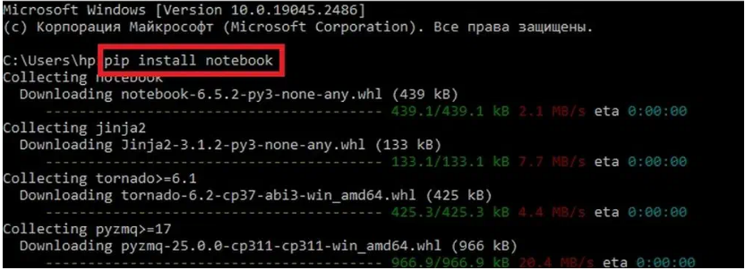
     
        
Запуск и работа с ноутбуком
""""""""""""""""""""""""""""""

В командной строке

::

        jupyter-notebook

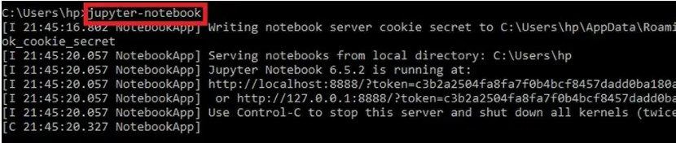

В Windows так же можно запустить через кнопку Пуск или строку поиска

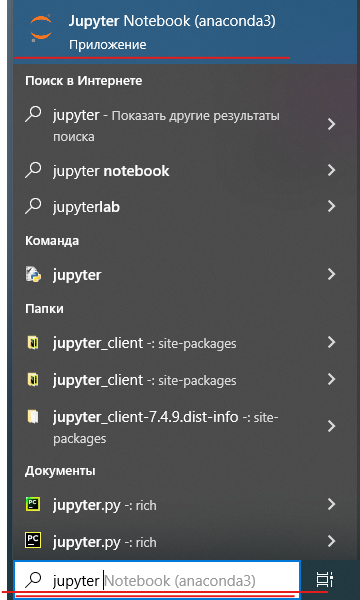

 
Создание каталога
-------------------

**Пример 1:**

Создать каталог **notebooks** в каталоге **python_files**

1. В структуре каталогов найдите **python_files** и откройте его
2. Нажать New в правой части экрана и выбрать в списке меню Folder.

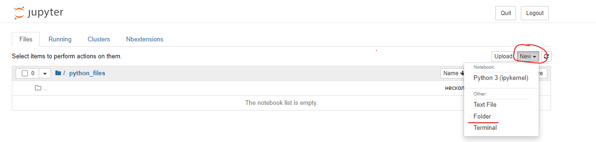

3. Новая папка автоматически будет названа **Untitled folder**. Чтобы назвать её по-другому, нужно поставить галочку напротив имени и нажать **Rename**

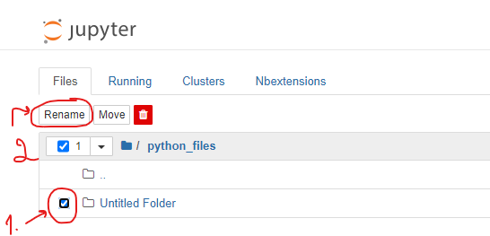

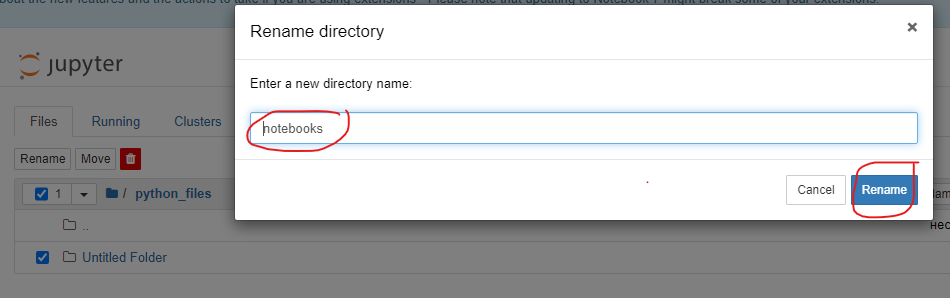

6. **Задание**

Создать каталог: **C:\Документы\python_files\01_Введение**

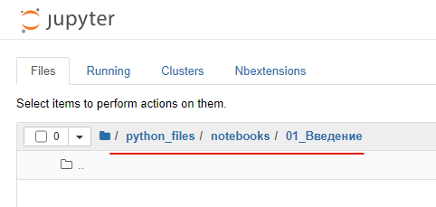

7. Создать notebook **note_01_hello.ipnb**

**New** -> **Python 3**

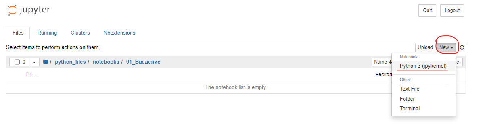

8. Сохранить notebook

**File -> Save as**

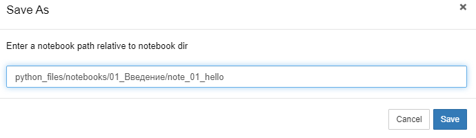

При создании notebook будет представлено название notebook, строка меню, панель инструментов и пустая ячейка с кодом. Ячейка (cell) по-умолчанию нажодится в режиме **Code (код)**. В этом режиме выполняются команды.

Может работать в **командном** режиме и режиме **редактирования**

Для перехода в режим редактирования нужно кликнуть мышью в любом месте ячейки или выделить ячейку любым способом и нажать **Enter**.

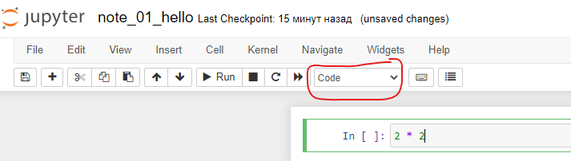

**Пример 2**

Посчитать в ячейке значение 2х2

Ввести в ячеку 2 * 2 и нажать сочетание клавиш **Shift+Enter (Ctrl+Enter, Alt+Enter)**

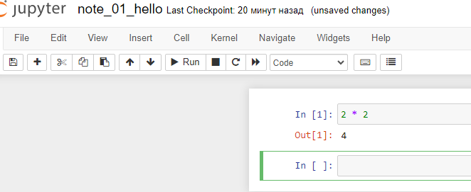

Строка **In** - команда, **Out** - вывод результата

В новой ячейке ввеcти команду

::

        print('Jupiter Notebook')

и выполнить ее (Shift+Enter)

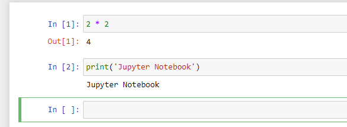

**Shift+Enter** - **выполняется** текущая ячейка и **выделяется** новая снизу

**Alt+Enter** - **выполняется** текущая ячейка и **добавляется новая снизу**

**Ctl+Enter** - **выполняется** текущая ячейка

Markdown
"""""""""

Markdown — это лёгкий язык разметки, который позволяет форматировать текст в простом и интуитивном виде.

В Jupyter Notebook Markdown используется для организации и документирования рабочего процесса. Файл Notebook может содержать как ячейки с текстом, написанным с помощью Markdown, так и ячейки с кодом.

Чтобы добавить Markdown в Notebook, нужно создать новую ячейку и изменить её тип на «Markdown». Это можно сделать с помощью кнопки «+» в toolbar или нажатия «Esc» и затем «M» на клавиатуре.

**Примеры использования Markdown в ячейках Notebook:**

Создание заголовков. 

Для этого перед текстом ставится один или несколько символов «#». Количество символов определяет уровень заголовка (от 1 до 6).

Создание списков. 

Для этого используются hyphens или плюс-знаки.

Создание ссылок. 

Для создания ссылки используются квадратные скобки [] для закрытия текста ссылки и круглые скобки () для закрытия URL.

Вставка изображений. 

Для вставки изображения используется восклицательный знак (!), за которым следуют квадратные скобки [] для закрытия альтернативного текста изображения и круглые скобки () для закрытия URL изображения.

Пример 3

Добавить в начало notebook текст "Простейшие команды"

1. Кликнуть мышью слева от первой строки
2. Нажать клавишу **A** (вставить ячейку выше)
3. Перевести ее в режим **Markdown**, нажав клавишу **М**, либо выбрав соответствующий режим в раскрывающемся списке режимов

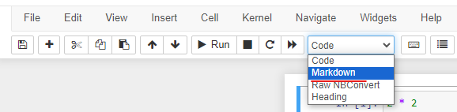

4. Введите текст **Простейшие команды** и нажмите **Shift+Enter**

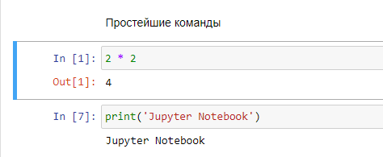

**Задание**

Добавьте 2 ячейки в начало ноутбука и создайте заголовки 1 и 2 уровня, как на рисунке

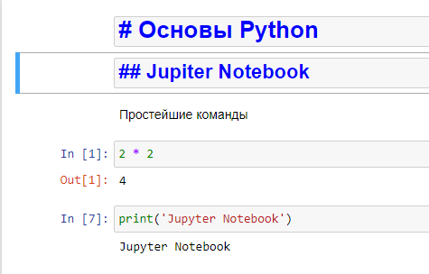

После введения значения в каждую ячейку нажимайте **Shift+Enter**

"Горячие клавиши" Jupyter Notebook
"""""""""""""""""""""""""""""""""""""

"Горячие клавиши" (hot keys) - это сочетания клавиш, позволяющие быстро выполнять команды, не прибегая к помощи меню или панели инструментов.

В Jupyter notebook назначение горячих клавиш можно посмотреть с помощью кнопки на панели инструментов

- **A** - добавить ячейку выше
- **B** - добавить ячаейку ниже
- **DD** - удалиь ячейку
- **Y** - режим Code
- **M** - режим Markdown
- **Shift+Enter** - **выполнить** текущую ячейка и **выделить** снизу
- **Alt+Enter** - **выполнить** текущая ячейка и **добавить новую снизу**
- **Ctl+Enter** - **выполнить** текущую ячейка

