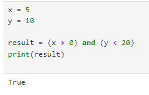
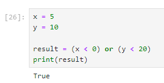
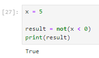
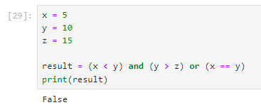

Булевы значения
~~~~~~~~~~~~~~~~~~~~~

Bool — это логический тип данных в Python, который принимает два значения: истину и ложь.

В Python есть самостоятельный логический тип bool с двумя предопределёнными значениями:

True — истина;

False — ложь.

True и False пишутся с большой буквы. Если написать с маленькой, интерпретатор выдаст ошибку.

True и False являются экземплярами класса bool, который в свою очередь является подклассом int. Поэтому True и False в Python ведут себя как числа 1 и 0. Отличие только в том, как они выводятся на экран.

.. note:: Булев тип важен для любого языка программирования. При помощи булевой логики код может реагировать на различные данные внутри программы и выполнять выбранные инструкции при разных обстоятельствах.


В Python истинными и ложными значениями считаются не только True и False.

истинное значение:

- любое ненулевое число

- любая непустая строка

- любой непустой объект

ложное значение:

- 0

- None

- пустая строка

- пустой объект

Остальные истинные и ложные значения, как правило, логически следуют из условия.

Для проверки булевого значения объекта, можно воспользоваться bool:


Логический тип и операторы
"""""""""""""""""""""""""""

Операторы сравнения и логические операторы, т.к. результатом их выполнения являются  **True** или **False**.

**Операторы сравнения:**

== (равенство) — проверяет, равны ли два значения. Если да, то оператор возвращает True, в противном случае — False.

!= (неравенство) — также проверяет равенство двух значений, но возвращает True, если значения не равны, и False — в противном случае.

> (больше) — если левое значение больше правого, то оператор возвращает True, иначе — False.

< (меньше) — если левое значение меньше правого, то оператор возвращает True, иначе — False.

>= (больше или равно) — если левое значение больше или равно правому, то оператор возвращает True, иначе — False.

<= (меньше или равно) — если левое значение меньше или равно правому, то оператор возвращает True, иначе — False.


**Логические операторы**

**and** — логическое И. Возвращает True, если оба операнда истинны, иначе возвращает False.

**or** — логическое ИЛИ. Возвращает True, если хотя бы один из операндов истинный, иначе возвращает False.

**not** — логическое НЕ. Инвертирует логическое значение операнда, то есть возвращает True, если операнд ложный, и False, если операнд истинный.

.. note:: Логические операторы позволяют сравнивать значения и принимать решения на основе результатов сравнения. Они являются основным инструментом в создании условных конструкций и важным элементом программирования.

Оператор and
````````````

Оператор and возвращает True, если оба операнда истинны, иначе возвращает False.

Пример использования оператора and:


.. code-block:: python
   
        x = 5
        y = 10
         
        result = (x < 0) and (y < 20)
        print(result)



   

Оператор or
```````````````

Оператор **or** возвращает True, если хотя бы один из операндов истинный, иначе возвращает False.

Пример использования оператора or:


.. code-block:: python
   
        x = 5
        y = 10
         
        result = (x < 0) or (y < 20)
        print(result)



Оператор not
`````````````

Оператор **not** инвертирует логическое значение операнда, то есть возвращает True, если операнд ложный, и False, если операнд истинный.

Пример использования оператора not:

.. code-block:: python
   
        x = 5
         
        result = not(x < 0) 
        print(result)





        
Вложенные логические операторы
``````````````````````````````````

Логические операторы могут быть использованы вложенно для создания сложных условий.

Пример использования вложенных логических операторов:

.. code-block:: python

        x = 5
        y = 10
        z = 15
         
        result = (x < y) and (y > z) or (x == y)
        print(result)  # Вывод: True





