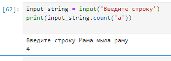
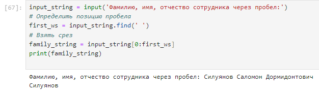
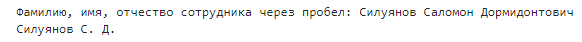

Примеры работы со строками
~~~~~~~~~~~~~~~~~~~~~~~~~~~~~~~

Пример 1:

Во введенной строке посчитать количество символов 'a'

.. code-block:: python
        
   input_string = input('Введите строку')
   print(input_string.count('a'))

Пример 2:

Во введенной строке заменить символы с 3 по 7 буквосочетанием 'NNN'

.. code-block:: python
        
   input_string = input('Введите строку')
   output_string = input_string.replace(input_string[3:8],'NNN')
   print(output_string )

Пример 3:

Из данных сотрудника извлечь фамилию.

В данном примере необходимо найти позицию пробела и сделать **срез** с начала строки до этой позиции.

.. code-block:: python
        
   input_string = input('Фамилию, имя, отчество сотрудника через пробел')
   # Определить позицию пробела
   first_ws = input_string.find(' ') 
   # Взять срез
   family_string = input_string[0:first_ws]
   print(family_string)

Пример 4:

Сформировать из полных данных сотрудника фамилию и инициалы.

Вход: Сидоров Иван Петрович
Выход: Сидоров И.П.

*Будет рассмотрен не очень рациональный код, но демонстрирующий методы работы со строками*.

.. code-block:: python
        
   input_string = input('Фамилию, имя, отчество сотрудника через пробел')
   # Определить позицию первого пробела
   ws_1 = input_string.find(' ') 
   # Определить позицию второго пробела. Он будет первым справа
   ws_2 = input_string.rfind(' ') 
   # Взять срез Фамилия
   last_name = input_string[0:ws_1]
   # Взять срез Имя
   first_name = input_string[ws_1+1:ws_1+2]
   middle_name = input_string[ws_2+1:ws_2+2]
        
   print(f'{last_name} {first_name}. {middle_name}.')

