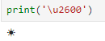
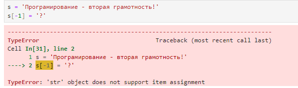
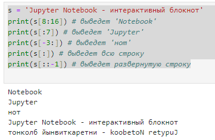
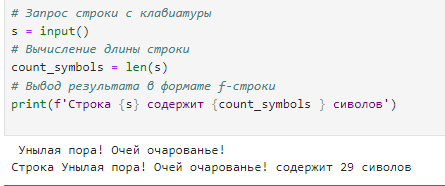

Строки
~~~~~~

Строковый тип данных — это последовательности символов Unicode любой длины, заключённые в одинарные, двойные или тройные кавычки. Символами могут быть буквы, числа, знаки препинания, специальные символы и так далее. Главное — чтобы их с двух сторон окружали кавычки. В Python текстовый тип данных обозначается буквами str (от англ. string — строка).

Unicode - cтандарт кодирования символов, включающий в себя знаки почти всех письменных языков мира.

Вывод символа Unicode




.. important::  Строки в Python — **НЕИЗМЕНЯЕМЫЙ** тип данных. Строковую переменную нельзя изменить с помощью операторов, функций и методов. Для изменения существующей строки необходимо создать создать новую переменную. Они относятся к **Immutable** объектам.

Примеры строк:

.. code-block:: python
   
        'Это строка'
        "Это строка"
        """
           это
           строка
        """

Строка состоит из символов. Каждый символ строки имеет свой порядковый номер - индекс.

Нумерация символов начинается с нуля.
Обращение к любому символу строки по индексу выполняется указанием имени строки и индекса в квадратных скобках:

.. code-block::  python

        s = 'Программирование - вторая грамотность!'
        # выведет 'П'
        print(s[0])
        # выведет '!'
        print(s[-1])


**Нулевой индекс** – первая буква строки, а **-1** – последний индекс строки.   

Следующая программа выдаст ошибку:




Была предпринята попытка изменить строку, а это **НЕИЗМЕНЯЕМЫЙ** объект.

Если необходимо изменить строку, то потребуется создать новую:

.. code-block::  python

        s = 'Программирование - вторая грамотность!'
        print(s)
        print('Адрес строки - ', id(s))
        s = 'Программирование - вторая грамотность?'
        print(s)
        print('Адрес строки - ', id(s))
        print(s[-1])

Из вывода видно, что адрес изменился, при этом старое содержание было потеряно и уничтожено, а на новом месте создана новая переменная.

Срезы
`````

Cрезом строки является ее непрерывная часть от одного индекса включительно и до другого **не включительно**. Cрез записывается с помощью квадратных скобок, в которых указывается начальный 
и конечный индекс, разделенные двоеточием. Если не указан начальный индекс, 
срез берется от начального символа строки. Если не указан конечный индекс, 
срез берется до конечного символа строки.

**Пример:**

.. code-block::  python

        s = 'Jupyter Notebook - интерактивный блокнот'
        print(s[8:16]) # выведет 'Notebook'
        print(s[:7]) # выведет 'Jupyter'
        print(s[-3:]) # выведет 'нот'
        print(s[:]) # выведет всю строку
        print(s[::-1]) # выведет развернутую строку


    
- s[8:16] – срез строки s, начиная с индекса 8, заканчивая индексом 16 (не включая символ с индексом 16)
- s[:7] срез с 0 индекса по 6-ий включительно (7-не включается)
- s[-3:] срез с 3 с конца индекса до конца строки
- s[:] срез с 0 индекса по последний
- s[::-1] разворот строки

Функция **len** позволяет получить количество символов в строке:

.. code-block::  python

        # Запрос строки с клавиатуры
        s = input()
        # Вычисление длины строки
        count_symbols = len(s)
        # Вывод результата в формате f-строки
        print(f'Строка {s} содержит {count_symbols } сиволов')

        



.. toctree::
   :maxdepth: 1
   :hidden:

   string_methods
   string_examples


