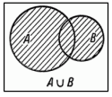
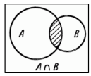
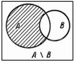
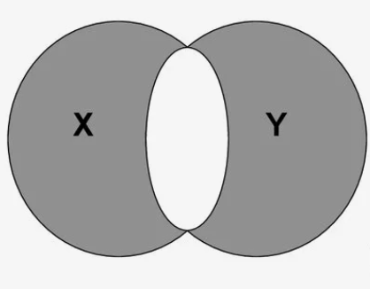

Методы работы с множествами
~~~~~~~~~~~~~~~~~~~~~~~~~~~~

Добавление элемента в множество
```````````````````````````````

**add()**

.. code:: python

	my_set = {1, 2, 3, 4}
	my_set.add(15)
	print(my_set)
	
	{1, 2, 3, 4, 15}
	
**update()**

Добавление несколько элементов. Аргументом может быть список, строка или другой итерируемый объект.

.. code:: python
	
	my_set = {1, 2, 3}
	my_set.update([4, 5, 6])
	print(my_set) 
	
	{1, 2, 3, 4, 5, 6}
	
Объединение множеств
``````````````````````

**union()**

.. code:: python

	set1 = {1, 2, 3}
	set2 = {3, 4, 5}
	set3 = set1.union(set2)
	print(set3) 
	
	{1, 2, 3, 4, 5}

Удаление элементов множества
`````````````````````````````

**remove ()**

Метод удаляет элемент из множества. 
Если такого элемента в наборе не окажется, интерпретатор выдаст исключение.

.. code:: python

	s = {1, 2, 3, 4, 5}
	s.remove(3)
	print(s)
	
	{1, 2, 4, 5}
	
.. code:: python

	s = {1, 2, 3, 4, 5}
	s.remove(12)
	print(s)
	
	{1, 2, 4, 5}
	
	KeyError: 12
	
**discard()**
Метод удаляет элемент, но если он не найден, то исключения не появляется

.. code:: python

	s = {1, 2, 3, 4, 5}
	s.discard(3)
	print(s)  

	{1, 2, 4, 5}

**pop()**

Метод удаляет случайный элемент множества.

.. code:: python

	s = {1, 2, 3, 4, 5}
	print(s.pop())
	print(s) 
	
	1
	{2, 3, 4, 5}

**clear**

Полная очистка множества

.. code:: python

	s = {1, 2, 3, 4, 5}
	s.clear()
	print(s)	 
	
	set()
	
Математические операции над множествами
`````````````````````````````````````````

**Объединение множеств**

**union()**   **|**


	   
В результате получается новый набор, который содержит все уникальные элементы из каждого множества.

.. code:: python

	set1 = {1, 2, 3}
	set2 = {3, 4, 5}
	set3 = set1 | set2
	print(set3)
	
	{1, 2, 3, 4, 5}
	
**Пересечение множеств**



Пересечение множеств это новая коллекция, содержащую только те элементы, которые присутствуют как в первом, так и во втором множестве
	
**intersection()** и оператор **&**

.. code:: python

	set1 = {1, 2, 3, 4}
	set2 = {3, 4, 5, 6}
	set3 = set1.intersection(set2)
	print(set3) 
	
	{3, 4}

.. code:: python

	set1 = {1, 2, 3, 4}
	set2 = {3, 4, 5, 6}
	set3 = set1 & set2
	print(set3) 
	
	{3, 4}
	
**Разность множеств**

Разность — это набор элементов, которые принадлежат первому множеству, но не принадлежат второму. 



**difference()** или оператор **-**

.. code:: python

	set1 = {"яблоко", "банан", "вишня"}
	set2 = {"банан", "апельсин", "манго"}
	set3 = set1 - set2
	print(set3) 

	{'вишня', 'яблоко'}

	set3 = set1.difference(set2)
	print(set3) 

	{'вишня', 'яблоко'}
	
**Симметрическая разность множеств**



Симметрическая разность — это набор элементов, которые принадлежат либо первому, либо второму множеству, но не их пересечению. Иными словами, симметрическая разность содержит все элементы обоих множеств, кроме общих.

**метод symmetric_difference()** или **оператор **^**

.. code:: python

	set1 = {"яблоко", "банан", "вишня"}
	set2 = {"банан", "апельсин", "манго"}
	set3 = set1 ^ set2
	print(set3)

	{'яблоко', 'манго', 'вишня', 'апельсин'}

Подмножество и надмножество в Python
````````````````````````````````````

Множество B (SetB) называется **подмножеством** A (SetA), если все элементы SetB есть в SetA.

Проверить на подмножество в Python можно двумя способами:

-  <= 
- метод **issubset()**. 

Он возвращает True или False в зависимости от результата.

.. code:: python


        A = {1, 2, 3, 4, 5} 
        B = {2,3,4}
        B <= A  # используя символьный метод
        B.issubset(A) # используя метод issubset
        
        True

Множество A (SetA) называется **надмножеством** B (SetB), если все элементы SetB есть в SetA. 

Проверить на надмножество в Python можно двумя способами: 

- с помощью символа >=
- метод **issuperset()**. 
  
Он возвращает True или False в зависимости от результата.

.. code:: python

        A = {1, 2, 3, 4, 5} 
        B = {2,3,4}
        A >= B  # используя символьный метод
        A.issuperset(B) # используя метод issubset
        
        True
