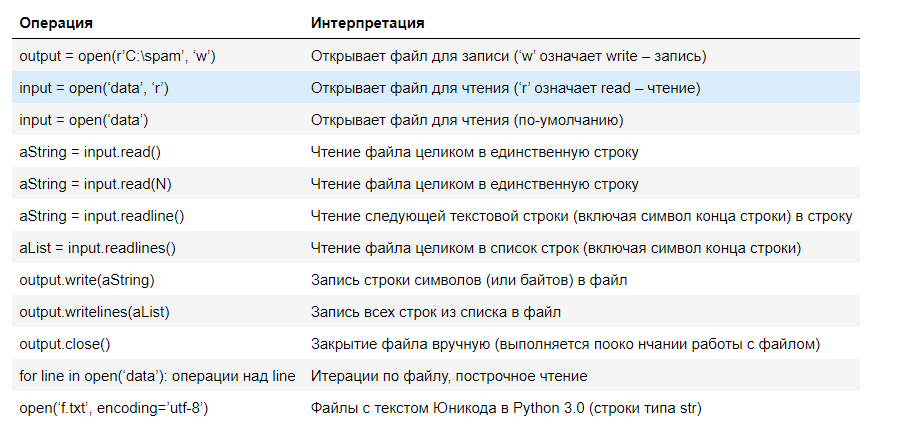
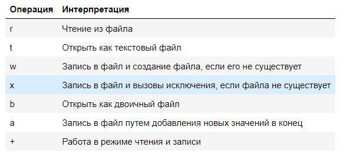

Файлы
~~~~~~

Файл – именованная область постоянной памяти в компьютере. 
    
Встроенная функция **open** создает объект файла, который обеспечивает связь с файлом, размещенным в компьютере. 
После вызова функции **open** можно выполнять операции чтения и записи во внешний файл, используя методы полученного объекта.
    
Они не являются ни числами, ни последовательностями или отображениями – для задач работы с файлами они предоставляют
одни только методы. 
    
Большинство методов файлов связаны с выполнением операций ввода-вывода во внешние файлы, ассоциированные с объектом, но
существуют также методы, которые позволяют переходить на другую позицию в файле, выталкивать на диск буферы вывода и так далее.    


.. note:: Данные, получаемые из файла, всегда попадают в сценарий в виде строки, поэтому необходимо выполнять преобразование данных в другие типы объектов языка Python. Точно так же, при выполнении операции записи данных в файл, в отличие от инструкции print,
интерпретатор Python не выполняет автоматическое преобразование объектов в строки – необходимо передавать методам уже сформированные строки. 


Операции над файлами
"""""""""""""""""""""""""




Открытие файла
"""""""""""""""""

open
`````

.. code:: python

	file = open('file_name.txt', 'w')


В функции open():

- 'file_name.txt' - имя файла . Указывается не только имя, но и путь (абсолютный или относительный)
- 'w' - режим открытия файла

Функция open создает объект **file**, к которому потом можно применять различные методы, для работы с ним.

Режимы открытия файла
""""""""""""""""""""""""""





Закрытие файла
""""""""""""""

close
``````

После завершения работы с файлом, его нужно закрыть.

.. code:: python


	file.close()

	file.closed

file.closed - метод проверки факта закрытия файла.

Менеджер контекста
"""""""""""""""""""""

**Менеджер контекста** — это объект, который управляет контекстом в Python. Он выполняет предварительные и завершающие действия, чтобы войти и выйти из контекста.

Контекстом в данном случае является работа с файлом, поэтому менеджер контекста открывает файл при входе в блок **with** и закрывает файл при выходе из блока.

Примеры работы с файлами
"""""""""""""""""""""""""


Запись в файл
``````````````````

*Записать в файл poem.txt строку*

.. code:: python

	with open('poem.txt', 'w', encoding='utf-8') as f:
		data = 'Я помню чудное мгновение: \n'
		f.write(data)

.. figure:: img/03_file_03.png
       :scale: 100 %
       :align: center
       :alt: asda

Комбинация символов **\n** называется управляющий символ **Возврат каретки**, предписывающий перейти на новую строку. Если этого не сделать, то все будет выводится в одну строку

**продолжение**

**Дописать в файл продолжение стихотворения:**

Я помню чудное мгновенье:

Передо мной явилась ты,

Как мимолетное виденье,

Как гений чистой красоты.

.. code:: python

	poem = ['Передо мной явилась ты,\n', 'Как мимолетное виденье,\n', 'Как гений чистой красоты.\n']
	# Открытие файла в режиме дозаписи
	with open('poem.txt', 'a', encoding='utf-8') as f:
		# Запись в конец файла всех строк из списка
		f.writelines(poem)


Чтение из файла
"""""""""""""""""

read()
``````

Содержимое всего файла читается в одну строку.

.. code:: python

	# Открытие файла в режиме чтения
	with open('poem.txt', 'r', encoding='utf-8') as f:
		# Запись в конец файла всех строк из списка
		data = f.read()

	print(data)


**Данная операция может быть накладной, если файл большого размера**

readlines()
````````````

Содержимое всего файла читается в **список**

.. code:: python

	# Открытие файла в режиме чтения
	with open('poem.txt', 'r', encoding='utf-8') as f:
		# Запись в конец файла всех строк из списка
		data = f.readlines()

	print(data)


Таким образом сразу получается список для обработки

readline()
```````````

.. code:: python

	# Открытие файла в режиме чтения
	with open('poem.txt', 'r', encoding='utf-8') as f:
		for line in f:
			print(line)

Когда с файлом нужно работать построчно, лучше использовать такой вариант.

В предыдущем выводе, между строками файла были лишние пустые строки, так как print добавляет ещё один перевод строки.

Чтобы избавиться от этого, можно использовать метод **rstrip**:

.. code:: python

	# Открытие файла в режиме чтения
	with open('poem.txt', 'r', encoding='utf-8') as f:
		for line in f:
			# Удалить 
			print(line.rstrip())


Модуль JSON 
"""""""""""""


Сериализация данных - это сохранение данных в каком-то формате, чаще всего, структурированном.

Python позволяет записывать объекты разных форматов. Например, CSV, JSON, YAML.

Для чего могут пригодится форматы YAML, JSON, CSV:

- вас могут быть данные которые нужно обработать в таблицах
- таблицу можно экспортировать в формат CSV и обрабатывать её с помощью Python
- различные программы могут возвращать данные в JSON. Соответственно, преобразовав эти данные в объект Python, с ними можно работать и делать что угодно
- YAML очень удобно использовать для описания параметров

Для каждого из этих форматов в Python есть модуль, который существенно упрощает работу с ними.

Модуль Python **json** может быть очень полезен, когда вам нужно прочитать или записать в файл более сложные структуры данных, такие как списки или словари. Этот метод не только сохраняет структуру данных, но и гарантирует, что данные могут быть легко переданы и проанализированы другими приложениями или в различных средах программирования

Модуль не входит в стандартную библиотеку, поэтому требуется его установка.

.. code:: python

	!pip install json

Запись данных в файл с помощью json.dump()
"""""""""""""""""""""""""""""""""""""""""""""

.. code:: python

	import json

	# Словарь для записи
	config_data = {
		'name': 'John',
		'role': 'developer',
		'languages': ['Python', 'JavaScript']
	}

	# Указание имени файла
	config_filename = 'config.json'

	# Writing the dictionary to a file in JSON format
	with open(config_filename, 'w') as config_file:
		json.dump(config_data, config_file)

	print(f"Data successfully written to {config_filename}")

Чтение данных из файла с помощью json.load()
"""""""""""""""""""""""""""""""""""""""""""

.. code:: python

	# Reading the data back
	config_filename = 'config.json'
	with open(config_filename, 'r') as config_file:
		data_loaded = json.load(config_file)

	print("Данные загружены из файла:")
	print(data_loaded)
	


