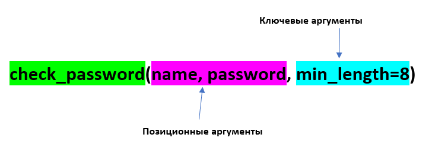

Функции пользователя
~~~~~~~~~~~~~~~~~~~~~

Создание функции
"""""""""""""""""""


    

Фунцкция создается с помощью ключевого слова **def**.

Сразу после def идет **имя функции**, а после него в круглых скобках должны находиться **параметры** для работы этой функции. Функция может не иметь параметров.

Определение функции
````````````````````````

.. code:: python

	def say_hello():
		print("Hello, World!")

Вызов функции
``````````````

.. code:: python

	say_hello()

Инструкция return 
``````````````````

**return** используется в теле функции, если нужно вернуть какое-то значение. 
Если инструкции **return** нет, тогда по умолчанию функция будет возвращать объект **None**. 

.. code:: python

	def my_function():
		pass

.. code:: python

	result = my_function()
	result == None
	True


Или как в этом примере:

.. code:: python

	# Определение функции
	def sum_numbers(a,b):
		sum = a + b

	print(sum_numbers(1,2))
	
	None

Добавление return

.. code:: python

	# Определение функции
	def sum_numbers(a,b):
		sum = a + b
		return sum

	print(f'Сумма чисел равна {sum_numbers(1,2)}')

	Сумма чисел равна 3

   
.. attention:: Функция выполняется до первого **return**. Инструкции, описанные после **return**, не выполняются.


.. code:: python

	# Определение функции
	def sum_numbers(a,b):
		sum = a + b
		return sum
		print('Функция выполнена!!!\n')

	print(f'Сумма чисел равна {sum_numbers(1,2)}')
	
	Сумма чисел равна 3

	# Определение функции
	def sum_numbers(a,b):
		sum = a + b
		print('Функция выполнена!!!\n')
		return sum

	print(f'Сумма чисел равна {sum_numbers(1,2)}')

	Функция выполнена!!!
	Сумма чисел равна 3
	
Возврат нескольких значений
++++++++++++++++++++++++++++++++

Если после оператора **return** указать несколько значений, то они будут возвращены в точку вызова функции в виде кортежа:

.. code:: python

	# Определение функции
	def sum_numbers(a,b):
		sum = a + b
		return a, b, sum

	result = sum_numbers(5,7)

	print(result)
	
	(5, 7, 12)

Пример: Високосный год
+++++++++++++++

*Написать скрипт для определения "високосности" года. Год является високосным, если его значение кратно 4 и не кратно 100 или кратно 400*

.. code:: python

	def is_leap_year(year):
		if (year % 4 == 0 and year % 100 != 0) or year % 400 == 0:
		  return True
		else:
		  return False

	# Ввод данных
	my_year = int(input('Введите год: '))

	# Функция вызывается и её результат проверяется if
	if is_leap_year(my_year):
		print(f'{my_year} - високосный год')
	else:
		print(f'{my_year} - не високосный год')
		
	Введите год: 2023
	2023 - не високосный год


После ввода номер года, он записывается в переменную **my_year**. Далее, эта переменная в качестве аргумента передается функции **is_leap_year** и там записывается в параметр **year**. Это значение проверяется в функции в операторе **if**. В зависимости от истинности этого условия в точку вызова программы возвращается результат. И на основании этого результата уже в основной функции печатается в консоль результат проверки.

Более лаконичный вариант функции:

.. code:: python


	def is_leap_year(year):
		return (year % 4 == 0 and year % 100 != 0) or year % 400 == 0

Документация (docstring)
````````````````````````````

Первая строка в определении функции - это docstring, строка документации. Это комментарий, который используется как описание функции:

.. code:: python

	def is_leap_year(year):
		"""
		Функция определения високосности года
		"""
		return (year % 4 == 0 and year % 100 != 0) or year % 400 == 0

	is_leap_year?

	is_leap_year.__doc__
	
	'\n    Функция определения високосности года\n    '

	Документация позволяет понять, как работает функция, если ее используют другие специалисты.

Параметры функции
"""""""""""""""""""""""""

Параметры функции бывают:
- **Обязательные**;
- **Необязательные** (опциональные, со значением по умолчанию).

Обязательные параметры
``````````````````````````

Обязательные параметры определяют, какие аргументы нужно передать функции обязательно. 
При этом, количество аргументов при вызове функции должно быть **ровно** таким, сколько указано параметров функции.

.. code:: python

	def print_names(name1, name2):
		print(name1)
		print(name2)

	print_names('Михаил','Валентина')
	
	Михаил
	Валентина

	print_names('Зоя')
	
	---------------------------------------------------------------------------
	TypeError                                 Traceback (most recent call last)
	Cell In[23], line 1
	----> 1 print_names('Зоя')


В данном случае фунция ожидает 2 аргумента, а ей передан один.

Необязательные параметры (параметры со значением по умолчанию)
``````````````````````````````````````````````````````````````

Значение необязательного параметра указывается при определении функции и подставляется автоматически при ее вызове.

Для необязательного параметра нет необходимости указывать значение аргумента при вызове функции.

.. code:: python

	def check_passwd(username, password, min_length=8):
		"""
		Функция проверки ппароля на соответствие требованиям, устанавливаемым к паролям
		"""
		if len(password) < min_length:
			print('Пароль слишком короткий')
			return False
		elif username in password:
			print('Пароль содержит имя пользователя')
			return False
		else:
			print(f'Пароль для пользователя {username} прошел все проверки')
			return True

	# Вызов функции без указания min_lendth
	check_passwd('mike', '2345')
	
	Пароль слишком короткий
	
	False

При работе функции было подставлен значение **min_length**, равное 8, как в определении функции 

.. code:: python

	# Вызов функции с указанием min_lendth
	check_passwd('mike', '2345', 3)
	
	Пароль для пользователя mike прошел все проверки
	
	True

При работе функции c таким набором параметров было подставлено значение min_length, равное 3.

Значение по умолчанию оценивается и сохраняется только один раз при определении функции (не при вызове). 
Следовательно, если значение по умолчанию — это изменяемый объект, например, список или словарь, он будет меняться каждый раз при вызове функции. 
Чтобы избежать такого поведения, инициализацию нужно проводить внутри функции или использовать неизменяемый объект.


Аргументы функции
"""""""""""""""""""

Аргументы функции бывают:

- **Позиционные**  передаются в том же порядке, в котором они определены при создании функции. То есть, порядок передачи аргументов определяет, какое значение получит каждый аргумент;
- **Ключевые** - передаются с указанием имени аргумента и его значения. Так как их имя указывается явно, то таком случае, аргументы могут быть указаны в любом порядке.


При вызове функции с испльзованием и позиционных и ключевых агрументов первыми передаются позиционные

.. code:: python

	# Вызов функции с указанием ключевого аргумента после позиционных
	check_passwd('mike', '2345', min_length=3)
	
	Пароль для пользователя mike прошел все проверки
	True

	# Вызов функции с указанием ключевого аргумента перед позиционными
	check_passwd(min_length=3, 'mike', '2345')

	Cell In[28], line 2
    check_passwd(min_length=3, 'mike', '2345')
                                             ^
	SyntaxError: positional argument follows keyword argument


Позиционные аргументы
````````````````````````

Для данных параметров важна позиция, в которой они описаны в функции. 
Если параметр описан первым, то и при при вызове функции аргумент, переданный первым будет записан в него, второй - во второй и так далее. 

.. code:: python

	def print_names(name1, name2):
		print(name1)
		print(name2)

	print_names('Михаил','Валентина')
	
	Михаил
	Валентина

	print_names('Валентина','Михаил')
	
	Валентина
	Михаил


 
.. attention:: **Количество аргументов должно совпадать с количеством параметров:**  
    
.. code:: python

	print_names('Зоя')

	---------------------------------------------------------------------------
	TypeError                                 Traceback (most recent call last)
	Cell In[32], line 1
	----> 1 print_names('Зоя')

	TypeError: print_names() missing 1 required positional argument: 'name2'
	 
 
.. attention:: **Порядок важен, так как нарушается логика работы программного кода внутри функции**  
    
.. code:: python

	def calculate_fraction(x, y):
		return x/(1-y)

	calculate_fraction(1,2)
	
	-1.0

	calculate_fraction(2,1)
	
	---------------------------------------------------------------------------
	ZeroDivisionError                         Traceback (most recent call last)
	Cell In[35], line 1
	----> 1 calculate_fraction(2,1)

	Cell In[33], line 2, in calculate_fraction(x, y)
		  1 def calculate_fraction(x, y):
	----> 2     return x/(1-y)

	ZeroDivisionError: division by zero


Во втором случае значение **1** записалось в переменную **y** и при подстановке в дробь олучился 0, а на 0 делить нельзя -> ошибка.

Произвольное количество позиционных аргументов, *args
+++++++++++++++++++++++++++++++++++++++++++++++++++++++

В тех случаях, когда заранее неизвестно  количество аргументов передаваемых функцию, необходимо добавить символ * перед именем параметра в определении функции. Таким образом, функция получит набор аргументов и сможет соответствующим образом обращаться к элементам.

Обычно данный параметр записывают ** *args**

*args - ожидает аргументы переменной длины (при каждом вызове могут быть разными)

.. code:: python

	def accept_patients(doctor, *args):
		print(f'Список пациентов для доктора {doctor}:')
		print('-'*20)
		for el in args:
			print(el)

	accept_patients("Пархоменко","Васильев", "Петрова", "Лопатин")
	
	Список пациентов для доктора Пархоменко:
	--------------------
	Васильев
	Петрова
	Лопатин

.. code:: python

	accept_patients("Николаев","Иванов", "Слепов", "Вакутагин","Кошкин")
	
	Список пациентов для доктора Николаев:
	--------------------
	Иванов
	Слепов
	Вакутагин
	Кошкин


.. code:: python

	def accept_patients(*args,doctor):
		print(f'Список пациентов для доктора {doctor}:')
		print('-'*20)
		for el in args:
			print(el)

	accept_patients("Пархоменко","Васильев", "Петрова", "Лопатин")
	
	---------------------------------------------------------------------------
	TypeError                                 Traceback (most recent call last)
	Cell In[42], line 7
		  4     for el in args:
		  5         print(el)
	----> 7 accept_patients("Пархоменко","Васильев", "Петрова", "Лопатин")

	TypeError: accept_patients() missing 1 required keyword-only argument: 'doctor'

	

**Python обрабатывает позиционные аргументы следующим образом:**

подставляет обычные позиционные аргументы слева направо, а затем помещает остальные позиционные аргументы в кортеж (*args)

В приведенном примере все элементы были **захвачены** в args и на долю параметра doctor аргументов на хватило. Требуется явно указывать ключевой параметр doctor и передавать значения.

Передача только позиционных аргументов
++++++++++++++++++++++++++++++++++++++++

Если требуется передавать в функцию аргументы **ТОЛЬКО** как позиционные, то при определении функции после всех позиционных параметров требуется указать символ **слэш** **/**

.. code:: python

	def calculate_fraction(x, y,/):
		return x/(1-y)

	calculate_fraction(1,2)
	
	-1.0

.. code:: python

	calculate_fraction(1,y=2)
	
	---------------------------------------------------------------------------
	TypeError                                 Traceback (most recent call last)
	Cell In[45], line 1
	----> 1 calculate_fraction(1,y=2)

	TypeError: calculate_fraction() got some positional-only arguments passed as keyword arguments: 'y'

Здесь ошибка возникла, потому что указано **y=2** (ключевой аргумент), а это запрещено в определении функции.

Ключевые аргументы
`````````````````````

- передаются с указанием имени аргумента;
- могут передаваться в любом порядке


Если указать имена параметров для всех аргументов, то можно вызывать функцию, расположив аргументы в любом порядке:

.. code:: python

	check_passwd(min_length=3, username='mike', password='2345')

	Пароль для пользователя mike прошел все проверки
	True
	
В приведенном примере все аргументы были переданы, как в ключевые.

Передача только ключевых аргументов
++++++++++++++++++++++++++++++++++++

Если требуется передавать в функцию аргументы **ТОЛЬКО** как **КЮЧЕВЫЕ**, то при определении функции после **ПЕРЕД** этими параметрами требуется указать символ звездочка *

.. code:: python

	def calculate_fraction(*,x, y):
		return x/(1-y)

Так вызвать уже нельзя

.. code:: python

	calculate_fraction(1,2)
	
	---------------------------------------------------------------------------
	TypeError                                 Traceback (most recent call last)
	Cell In[49], line 1
	----> 1 calculate_fraction(1,2)

	TypeError: calculate_fraction() takes 0 positional arguments but 2 were given

Можно только так:

.. code:: python

	calculate_fraction(y=2,x=1)
	
	-1.0
	

Произвольное количество аргументов-ключевых слов **kwargs
+++++++++++++++++++++++++++++++++++++++++++++++++++++++++++

Как и в случае с позиционными аргументами можно определять произвольное количество аргументов-ключевых. Параметр, который принимает ключевые аргументы переменной длины, создается добавлением перед именем параметра двух звездочек. Имя параметра может быть любым, чаще всего, используют имя <b>**kwargs</b> (от keyword arguments).

.. code:: python

	def sum_arg(a, **kwargs):
		print(a, kwargs)
		return a + sum(kwargs.values())

	sum_arg(a=10, b=10, c=20, d=30)
	
	10 {'b': 10, 'c': 20, 'd': 30}
	70


Функция sum_arg создана с двумя параметрами:

- параметр **a** (если передается как позиционный аргумент, должен идти первым, если передается как ключевой аргумент, то порядок не важен)

- параметр **kwargs - ожидает ключевые аргументы переменной длины, куда попадут все остальные ключевые аргументы в виде словаря. Эти аргументы могут отсутствовать

.. code:: python

	sum_arg(a=10, b=10, c=20, d=30, k=12, e=-10)
	
	10 {'b': 10, 'c': 20, 'd': 30, 'k': 12, 'e': -10}
	72

	sum_arg(10)
	
	10 {}
	10

Комбинация позиционных и ключевых элементов
````````````````````````````````````````````````

Можно комбинировать два типа аргументов в одной и той же функции.

Любой аргумент перед символом / предназначен только для позиционных аргументов, а любой аргумент после символа * - только для ключевых слов.

.. code:: python

	def my_function(a, b, /, *, c, d):
	  print(a + b + c + d)
	  

	my_function(5, 6, c = 7, d = 8)

	26
	
.. code:: python
	
	my_function(5, c = 7, d = 8, 6)
	
	Cell In[59], line 1
    my_function(5, c = 7, d = 8, 6)
                                  ^
	SyntaxError: positional argument follows keyword argument

**Ошибка:** позиционный аргумент **6** записан после ключевых

Анонимная функция: лямбда
"""""""""""""""""""""""""""

Лямбда-функция — это короткая однострочная функция, которой не имеет имени. 

Лямбда-функция может принимать любое количество аргументов, но может содержать только одно выражение.

Такие выражения содержат лишь одну инструкцию, поэтому, например, if, for и while использовать нельзя. 

Синтаксис:

**lambda** *arguments* : *expression*

# Добавить значение 10 к аргументу и вернуть результат

.. code:: python

	x = lambda a : a + 10
	print(x(5))

	15
	
Функция является объектом, поэтому можно ее присвоить какой-нибудь переменной. В данном случае x. При вызове x c аргументом 5 данное значение записывается в параметр a и будет срабатывать иструкция 5 + 10. Возвращен результат 15.

# Перемножить аргументы a и b и вернуть результат

.. code:: python

	x = lambda a, b : a * b
	print(x(5, 6))

	30

Создать lambda-функцию, возвращающую первый и последний символ строки 

.. code:: python

	f = lambda x: x[0] + x[-1]
	print(f('Jupyter'))

	Jr


