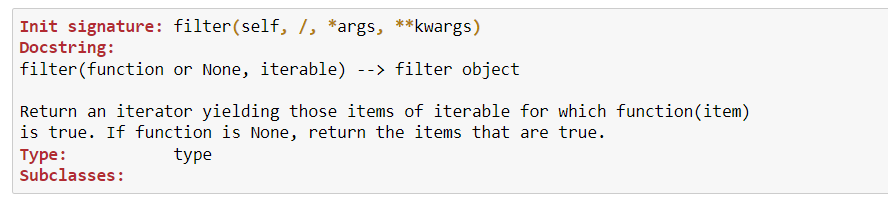

Функции стандартной библиотеки
~~~~~~~~~~~~~~~~~~~~~~~~~~~~~~~

Стандартная библиотека Python очень обширна и предлагает широкий спектр возможностей. 
Библиотека содержит встроенные модули (написанные на C), которые обеспечивают доступ к системным функциям, 
таким как файловый ввод-вывод, которые в противном случае были бы недоступны программистам на Python, а также модули, 
написанные на Python, которые предоставляют стандартизированные решения для многих проблем, возникающих в повседневном программировании. 
Некоторые из этих модулей специально разработаны для поощрения и повышения переносимости программ на Python путем абстрагирования от специфики платформы и 
создания независимых от платформы.

Установщики Python для платформы Windows обычно включают в себя всю стандартную библиотеку и часто также включают множество дополнительных компонентов. 
Для Unix-подобных операционных систем Python обычно предоставляется в виде набора пакетов, поэтому для получения некоторых или всех дополнительных компонентов 
может потребоваться использование средств упаковки, поставляемых вместе с операционной системой.

В дополнение к стандартной библиотеке существует активная коллекция из сотен тысяч компонентов 
(от отдельных программ и модулей до пакетов и целых платформ разработки приложений), доступная из Python Package Index.

Встроенные функции (Built-in Functions)
""""""""""""""""""""""""""""""""""""""""""

Список функций и документацию по ним можно посмотреть на официальном `сайте <https://docs.python.org/3/library/functions.html>`__

В стандартную библиотеку Python входит множество встроенных функций и классов. Все встроенные объекты можно посмотреть следующим образом:

.. code:: python

	for e in __builtins__.__dict__:
		print(e)
		
Получить справку можно, введя имя функции и знак вопроса

.. code:: python

	filter?
	

   
Ранее было рассмотрено несколько встроенных функций:

Общие функции
``````````````
- print — функция вывода (например в консоль);
- range — возврат последовательность чисел, с 0 до N (с шагом на 1 по умолчанию);
- input - возврат введенной пользователем строки;
- open - открытие файла и возврат его объекта

Преобразование типов:
``````````````````````

- type — вернет тип объекта;
- str — преобразование в строку;
- int — преобразование в число;
- float — преобразование в число с плавающей точкой;
- bool — преобразование к булевому типу;
- tuple — преобразование к кортежу;
- dict — преобразование к словарю;
- frozenset — приведение к неизменяемому множеству;
- list — приведение к списку;
- set — преобразование к множеству;

Математические функции
````````````````````````

- pow — возведение числа в степень;
- abs — возврат модуля числа;
- round — округление до указанного количества знаков после запятой.

.. code:: python

	round(2.567,2)
	
	2.57

.. code:: python

	round(-3.13,1)
	
	-3.1

Итерируемые объекты
````````````````````

- min — возврат минимального элемента последовательности;
- max — возврат максимального элемента последовательности;

.. code:: python

	my_list = [1,4,6]
	min(my_list)
	
	1
	
.. code:: python	
	
	max(my_list)
	6
	
Функция map
""""""""""""

Возвращает итератор, который применяет указанную функцию к каждому элементу итерируемого объекта, выдавая результаты.

Возвращает объект типа map. Для последующей обработки необходимо привести к нужному типу (list, tuple)

Примеры:
````````

Округлить все числа представленного списка
+++++++++++++++++++++++++++++++++++++++++++++

.. code:: python

	my_map = map(round,[3.14,45.67,])
	type(my_map)
	
	map
	
.. code:: python
	
	print(my_map)
	<map object at 0x00000282FFA4A1A0>
	
.. code:: python
	
	# приведение к типу list
	print(list(my_map))
	
	[3, 46]


Из примера видно, что округление происходит до целого числа. Использовать функцию round для округления до одного знака при такой записи не получится. Потребуется второй итерируемый объект, каждый элеемент которого будет являться для функции round вторым аргументом, то есть количеством знаков после запятой.

.. code:: python

	my_map = map(round,[3.14,45.67,],[1,1])
	print(list(my_map))

	[3.1, 45.7]

Эту же задачу можно решить с помощью lambda-функции, в которой указывается, что должно произойти с аргументом, который будет взят из итерируемого объекта

.. code:: python

	my_map1 = map(lambda x: round(x,1),[3.14,45.67,12.89])
	print(list(my_map1))
	
	[3.1, 45.7, 12.9]


Записать числа, введенные с клавиатуры через пробел в список
+++++++++++++++++++++++++++++++++++++++++++++++++++++++++++++

При вводе данных с клавиатуры (input()) они считываются в виде строки. 
Если необходимо работать с числами, то их необходимо привести к числовому типу с помощью функции **int**.
В случае, если требуется ввести не одно, а последовательность чисел, то писать для каждого команду input будет долго. 
Выходом может стать цикл **while**, но можно поступить еще лаконичнее:

.. code:: python

	my_map2 = map(int,input('Введите числа через пробел: ').split())
	my_tuple = tuple(my_map2)
	print(my_tuple)


	Введите числа через пробел: 1 2
	(1, 2)
	
	
После этого можно выполнить что-нибудь полезное. Например, найти сумму этих чисел:

.. code:: python

	print(sum(my_tuple))
	
	3
	
Можно все записать в одну строку:

.. code:: python

	print(sum(tuple(map(int,input('Введите числа через пробел: ').split()))))
	
	Введите числа через пробел: 1 2
	3
	​
Функция zip
""""""""""""""

Выполняет параллельную итерацию по нескольким итерационным элементам, создавая кортежи с элементом из каждого из них.

на вход функции передаются последовательности (списки, кортежи)

zip возвращает итератор с кортежами, в котором n-ый кортеж состоит из n-ых элементов последовательностей, которые были переданы как аргументы

например, десятый кортеж будет содержать десятый элемент каждой из переданных последовательностей

если на вход были переданы последовательности разной длины, то все они будут отрезаны по самой короткой последовательности

порядок элементов соблюдается

Примеры
```````````

Списки одинаковой длины
++++++++++++++++++++++++

.. code:: python

	# Последовательность кортежей из "одноиндесных" элементов двух последовательностей
	a = [1, 2, 3]
	b = [100, 200, 300]
	list(zip(a, b))
	​
	[(1, 100), (2, 200), (3, 300)]

.. code:: python
	# Вычисление суммы элементов для каждого кортежа
	list(map(sum,list(zip(a, b))))
	[101, 202, 303]
	​
​
Списки разной длины

.. code:: python

	seq = [1, 2, 3]
	empl_lst = ['Петров', 'Васечкин', 'Сыроежкин', 'Гусев']
	​
	list(zip(seq, empl_lst))
	[(1, 'Петров'), (2, 'Васечкин'), (3, 'Сыроежкин')]

Создание словаря
++++++++++++++++++++++

.. code:: python

	d_keys = ['name', 'location', 'model']
	d_values = ['Brados', 'Russia', 'flash']
	my_dict = dict(zip(d_keys,d_values))
	my_dict

	{'name': 'Brados', 'location': 'Russia', 'model': 'flash'}

Можно создать более сложный словарь:

.. code:: python

	d_keys = ['name', 'location', 'model']
	ski_dict = {'Brados':['Brados', 'Russia', 'flash'], 
				'Fisher':['Fisher', 'Austria', 'Speedmax 3d'],
				'Atomic':['Atomic', 'Austria', 'Redster S9']}
	my_ski = dict()
	for key, value in ski_dict.items():
		my_ski[key] = (dict((zip(d_keys,value))))
	my_ski

	{'Brados': {'name': 'Brados', 'location': 'Russia', 'model': 'flash'},
	 'Fisher': {'name': 'Fisher', 'location': 'Austria', 'model': 'Speedmax 3d'},
	 'Atomic': {'name': 'Atomic', 'location': 'Austria', 'model': 'Redster S9'}}

После этого словарь можно использовать в дальнейшей обработке


Функция filter
"""""""""""""""""

Функция **filter** применяет функцию ко всем элементам последовательности и возвращает итератор с теми объектами, для которых функция вернула True.

Первым аргументом указывается функция, возвращающая результат типа bool (True или False)

Например, вернуть только те строки, в которых находятся числа:

.. code:: python

	list_of_strings = ['one', 'two', 'list', '', 'dict', '100', '1', '50']
	print(filter(str.isdigit, list_of_strings))
	print(type(filter(str.isdigit, list_of_strings)))
	
	<filter object at 0x00000282FFA4DB10>
	<class 'filter'>
	
Функция возвращает объект класса filter. Для вывода результата необходимо его привести к нужному типу:

.. code:: python

	my_filter = list(filter(str.isdigit, list_of_strings))
	print(my_filter)
	['100', '1', '50']

Примеры
````````````
Фильтрация нечетных чисел
+++++++++++++++++++++++++++++

Напишите скрипт, который отфильтровывает нечетные числа из списка целых чисел, используя функцию filter

.. code:: python

	my_list = [1,4,6,5,16,42,57,89]
	# Применение lambda-функции
	my_filter = filter(lambda x: x % 2,my_list)
	print(list(my_filter))

.. code:: python

	[1, 5, 57, 89]

**Пояснение**

lambda x: x % 2 работает следующим образом:

для каждого аргумента возвращается остаток от деления на 2. Для нечетных чисел это будет целое число, не равное 0. А такое число Python принимает за True. Следовательно, данный аргумент попадает в filter.

Для четных чисел код будет выглядеть так:

.. code:: python

	# Применение lambda-функции
	my_filter = filter(lambda x: not(x % 2), my_list)
	print(list(my_filter))
	[4, 6, 16, 42]


Список строк, содержащих заданную строку
++++++++++++++++++++++++++++++++++++++++++++

.. code:: python

	a = ['мама', 'мыла', 'раму']

	def my_func(fw,*args):
		return list(filter(lambda x: fw in x,args))

	my_func('у',*a)

	['раму']


Функция reduce()
"""""""""""""""""

Функция **reduce()** модуля **functools** кумулятивно применяет функцию function к элементам итерируемой iterable последовательности, сводя её к единственному значению.

Функция **functools.reduce()** может быть полезна в различных сценариях, когда необходимо агрегировать данные или преобразовывать их кумулятивным (накопительным) способом.

.. code:: python

	from functools import reduce


**Синтаксис:**

reduce(function, iterable[, initializer])

**Параметры:**

- function - пользовательская функция, принимающая 2 аргумента,
- iterable - итерируемая последовательность,
- initializer - начальное значение.

Аргумент function это функция которую требуется применить к элементам последовательности. 
Должна принимать два аргумента, где первый аргумент - аккумулированное ранее значение, а второй аргумент следующий элемент последовательности.

Аргумент iterable представляет собой последовательность, элементы которой требуется свести к единственному значению. Если последовательность пуста и не задан аргумент initializer, то возбуждается исключение TypeError.

.. code:: python

	reduce(lambda x, y: x+y, [1, 2, 3, 4, 5])
	
	15

**Пояснение**

Вычисляет ((((1 + 2) +3) +4) +5).

Левый аргумент x - это накопленное значение, а правый аргумент y - это следующий элемент iterable (в данном случае - списка)

Если присутствует необязательный **initializer**, он помещается перед элементами **iterable** в вычислении. 
Другими словами это базовое значение, с которого требуется начать отсчёт. Аргумент **initializer**, так же служит значением по умолчанию, когда iterable является пустым.

Примеры:
````````

Вычисление суммы всех элементов списка при помощи reduce() и lambda-функции:
+++++++++++++++++++++++++++++++++++++++++++++++++++++++++++++++++++++++++++++

.. code:: python

	from functools import reduce
	items = [10, 20, 30, 40, 50]
	reduce(lambda x,y: x + y, items)
	
	150
	
Нахождение наибольшего элемента в списке
+++++++++++++++++++++++++++++++++++++++++++

.. code:: python

	items = [1, 24, 17, 14, 9, 32, 2]
	reduce(lambda a,b: a if (a > b) else b, items)
	​
	32