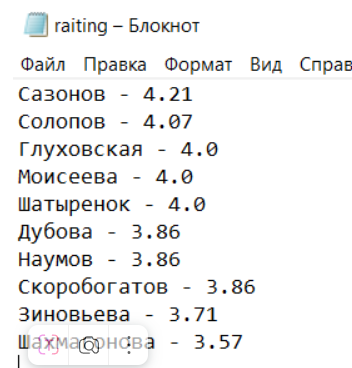
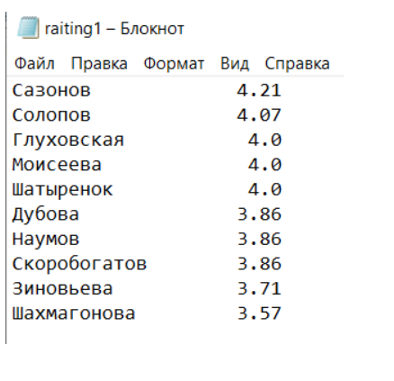

Примеры работы с функциями
~~~~~~~~~~~~~~~~~~~~~~~~~~~~~~~~~~~~~~~

Площадь треугольника
"""""""""""""""""""""""""""""""

Даны стороны треугольника a,b,c. Написать функцию вычисления площади труегольника по формуле Герона:

.. figure:: img/01_exfunc_01.png
       :scale: 100 %
       :align: center
       :alt: asda

Площадь треугольника 2
""""""""""""""""""""""""""

Написать функцию, определяющую количество переданных аргументов и вычисляющий площадь треугольника по следующему принципу:

3 аргумента - формула Герона
2 аргумента - половина основания на высоту

**Примечание:** Так как количество параметров будет переменным и неважно, как их именуют, то исполоьзуем *args

Количество букв разных регистров
"""""""""""""""""""""""""""""""""

Напишите функцию Python, которая принимает строку и подсчитывает количество прописных и строчных букв.

Вход: "The quick Brow Fox"

Выход:

Символов в ВЕРХНЕМ регистре : 3

Символов в нижнем регистре : 12

Площадь круга (lambda)
"""""""""""""""""""""""""

Написать функцию lambda для вычисления площади круга произвольного радиуса r

ФИО
""""

ФИО
В файле "сотрудники.txt" приведен спиок сотрудников отдела. 
Написать программу, формирующую новый файл с фамилиями и инициалами сотрудников для сдачи теста по Технике безопасности.

Формирование списка с фамилиями и инициалами выполнить в виде функции.

.. code:: python

	def unpack_list(*args):
		"""
		Функция, формирующая из списка фамилий, имен и отчеств список из фамилий и инициалов
		
		Вход: *args - список переменной длины
		Выход: person2_lst - список из фамилий и инициалов в формате Фамилия И. О.
		"""
		
		# Cписок для Фамилия И. О.
		person2_lst = []
		# Для каждой строки в полученном кортеже повторять:
		for line in args:
			# Распаковать строку в переменные l_n - фамилия, f_n - имя, m_n - отч
			l_n, f_n, m_n = line.split()
			# Добавить в новый список l_n - фамилия, f_n - имя[0], m_n - отч[0]
			person2_lst.append(l_n + ' ' + f_n[0] + '. ' + m_n[0] + '.\n')
		
		# Возврат сформированного списка
		return person2_lst

	with open('сотрудники.txt',encoding='UTF-8') as f:
		lst = f.readlines()

	result = unpack_list(*lst)
	# Печать списка
	print('Готовый список')
	print('-'*20)
		  
	print(result)
	# Печать распакованного списка (извлеченные элементы)
	print('\nРаспакованный список')
	print('-'*20)
	print(*result)

Средний балл
"""""""""""""""""

В файле marks.csv находятся текущие оценки студентов. Создать скрипт для расчета рейтинга студентов.

.. code:: python

	from pprint import pprint
	# Создание пустых списков для:
	# фамилий
	person_lst=[]
	# оценок
	marks_lst = []
	# Открытие контекста для файла
	with open ('marks.csv') as f:
		# Для каждой считанной из фала строки повторять
		for line in f:
			# Разбить строку по разделителю ";"
			s = line.split(';')
			# p - фамилия из полученного списка
			# m - все оценки
			p, m = s[0],s[1:]
			# Добавить фамилию в список person_lst
			person_lst.append(p)
			# Добавить оценки в список marks_lst, предварительно приведя к типу int
			marks_lst.append(list(map(int,m)))
	​
	# Расчет среднего балла для каждого студента
	average_scores = list(map(lambda x : round(sum(x) / len(x),2), marks_lst))
	​
	print(average_scores)
	​
	[4.0, 3.86, 3.71, 4.0, 3.86, 4.21, 3.86, 4.07, 4.0, 3.57]
	
.. code:: python

	# Создать пары фамилия - средний балл
	my_list = list(zip(person_lst,average_scores))
	​
	# Отсортировать по убыванию (reverse=True) полученный список 
	# по значению среднего балла (key=lambda x: x[1])
	my_list = sorted(my_list,key=lambda x: x[1],reverse=True)
	# Напечатать список в презентабельном виде
	pprint(my_list)

.. code:: python

	[('Сазонов', 4.21),
	 ('Солопов', 4.07),
	 ('Глуховская', 4.0),
	 ('Моисеева', 4.0),
	 ('Шатыренок', 4.0),
	 ('Дубова', 3.86),
	 ('Наумов', 3.86),
	 ('Скоробогатов', 3.86),
	 ('Зиновьева', 3.71),
	 ('Шахмагонова', 3.57)]

	

.. code:: python	
	
	# и передать в файл для отправки в учебную часть в отформатированном виде
	# фамилия - средний балл
	​
	my_raiting = list(map(list,my_list))
	​
	​
	with open ('raiting.txt','w',encoding='UTF-8') as f:
		for person in my_raiting:
			f.write(f'{person[0]} - {person[1]}\n')

.. code:: python

	with open ('raiting1.txt','w',encoding='UTF-8') as f:
		for person in my_raiting:
			# На колонку с фамилией отводится 20 символов, на средний балл - 4
			f.write("{:20}{:4}\n".format(person[0], person[1]))

	   
Список студентов с заданным рейтингом
""""""""""""""""""""""""""""""""""""""""

Из файла raiting1.txt, сфорированного ранее, вывести студентов, чей рейтинг больше или равен 4 баллов

.. code:: python

	full_lst = []
	# Открыть файл для чтения
	with open ('raiting1.txt','r',encoding='UTF-8') as f:
			# Считать все в список и разбить каждый элемент
			full_lst = list(map(lambda x: x.split(),f.readlines()))
	full_lst

.. code:: python

	[['Сазонов', '4.21'],
	 ['Солопов', '4.07'],
	 ['Глуховская', '4.0'],
	 ['Моисеева', '4.0'],
	 ['Шатыренок', '4.0'],
	 ['Дубова', '3.86'],
	 ['Наумов', '3.86'],
	 ['Скоробогатов', '3.86'],
	 ['Зиновьева', '3.71'],
	 ['Шахмагонова', '3.57']]

.. code:: python

	my_filter = list(filter(lambda x: float(x[1])>=4.0, full_lst))
	my_filter
	
.. code:: python

	[['Сазонов', '4.21'],
	 ['Солопов', '4.07'],
	 ['Глуховская', '4.0'],
	 ['Моисеева', '4.0'],
	 ['Шатыренок', '4.0']]

**Пояснение**

lambda x: float(x[1])>=4.0 - каждый аргумент списка full_lst является списком (вложенный). Средний балл - это элемент с индексом 1 (x[1]). Он преобразовывется в вещественное число (float) и сравнивается с 4.0. Если результат True, то и весь элемент попадает в итоговый набор.

