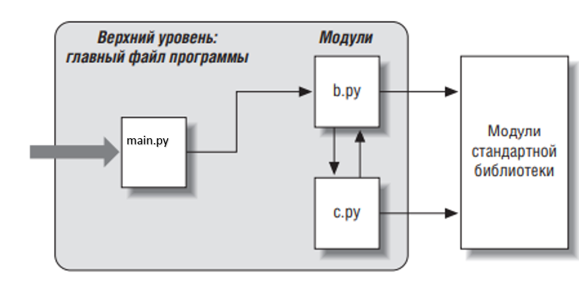
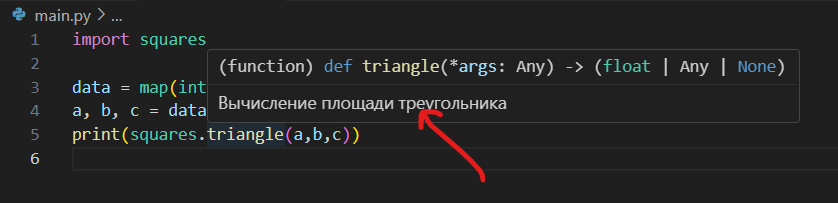

Модули пользователя
~~~~~~~~~~~~~~~~~~~~

Модуль в языке Python – самой крупная организационной программной единицы, которая вмещает в себя программный код и данные, готовые для многократного использования. 
Модули в языке Python обычно соответствуют файлам программ (или расширениям, написанным на других языках программирования, таких как C, Java или C#). 
Каждый файл – это отдельный модуль, и модули могут импортировать другие модули для доступа к именам, которые в них определены. 

Файл имеет расширение .py

Обработка модулей выполняется двумя инструкциями:

- import позволяет клиентам (импортерам) получать модуль целиком.
- from позволяет клиентам получать определенные имена из модуля.

Модули обеспечивают простой способ организации компонентов в систему автономных пакетов переменных, известных как пространства имен. 
Все имена, определяемые на верхнем уровне модуля, становятся атрибутами объекта импортируемого модуля.

Назначение модулей:
""""""""""""""""""""""

- Повторное использование программного кода

Модули позволяют сохранять программный код в виде файлов. 
Программный код в файлах модулей хранится постоянно – его можно повторно загружать и запускать столько раз, сколько потребуется. 
Также это место, где определяются имена, известные как атрибуты, на которые могут ссылаться множество внешних клиентов.

- Разделение системы пространств имен

Модули позволяют изолировать имена в замкнутые пакеты, которые позволяют избежать конфликтов имен – вы никогда не увидите имя в другом файле, если не импортируете его. 
Фактически все, что находится в модуле, – выполняемый программный код и создаваемые объекты – всегда неявно включается в модули.

- Реализация служб или данных для совместного пользования
С функциональной точки зрения модули могут также использоваться для реализации компонентов, используемых системой, вследствие чего требуется только одна копия такого компонента. 
Например, если необходим глобальный объект, который используется более чем одной функцией или модулем, можно написать его в виде модуля, 
который затем может импортироваться множеством клиентов.

Как правило, программа на языке Python состоит из множества текстовых файлов, содержащих инструкции. 
Программа организована как один главный файл, к которому могут подключаться дополнительные файлы, известные как модули.

Главный файл (или сценарий) определяет, как будет двигаться основной поток выполнения программы, – это тот файл, который необходимо запустить, чтобы начать работу приложения.

Файлы модулей – это библиотеки инструментальных средств, где содержатся компоненты, используемые главным файлом.

Главный файл использует инструменты, определенные в файлах модулей, а модули используют инструменты, определенные в других модулях. 
Файлы модулей ничего не делают, если попытаться запустить их отдельно. Чтобы получить доступ к определенным в модуле инструментам необходимо импортировать этот модуль.

**Пример mod_01:**

Структура программы состоит из трех файлов. main.py, b.py, c.py.

Файл main.py - главный файл программы, является простым текстовым файлом, состоящим из инструкций, который при запуске выполняется от начала и до конца.

Файлы b.py и c.py – это модули, они также являются простыми текстовыми файлами, содержащими инструкции, 
но они не запускаются как самостоятельные программы, импортируются другими файлами для использования их функциональности.

**Модуль b.py**

.. code:: python

	def spam(text):
		print(text, 'spam')

**Модуль main.py**

.. code:: python

	import b
	b.spam('simple')

Инструкция **import**, дает файлу **main.py** доступ ко всему, что определено на верхнем уровне в файле **b.py**. Данная инструкция запускает другие файлы 
во время исполнения.

Имя модуля, используемое в инструкции import:
1) идентифицирует внешний файл
2) становится именем переменной, которая будет представлять загруженный модуль. 

Вторая инструкция в файле main.py вызывает функцию spam, определенную в модуле b, используя форму записи атрибутов объекта.

Запись b.spam означает следующее: «извлечь значение имени spam, расположенного в объекте b». 
В данном примере, spam – это вызываемая функция, поэтому далее ей передается строка в круглых скобках ('simple'). 

При запуске файла main.py результатом будет 'simple spam'.

**Пример mod_02:**

Создать программу для вычисления площадей геометрических фигур (треугольник, круг). Функции расчета площадей разместить в отдельном файле **squares.py**.
Чтение исходных данных, вызов функций и вывод результата организовать в главном файле main.py

1) В каталоге **python_files** создать подкаталоги  **vsc/geometry**;
2) В каталоге geometry создать два файла: **main.py** и **squares.py**;

.. code:: python

	# Листинг squares.py

	import math

	def triangle(*args):
		"""
		Вычисление площади треугольника
		"""

		# Если передано три аргумента, то рассчитать по формуле Герона
		if len(args) == 3:
			a, b, c = args 
			p = (a + b + c) / 2
			s = math.sqrt(p * (p - a) * (p - b) * (p - c))
			return s
		# иначе если передано 2 аргумента, то рассчитать по формуле "половина основания на высоту"
		elif len(args) == 2:
			 a, b = args
			 return 1 / 2 * a * b
		# Иначе вывести предупреждение
		else:
			print('Некорректный ввод данных')

	def  сircle(r):
		"""
		Вычисление площади круга
		"""

		return math.pi * r * r
		
		
.. code:: python

	# Листинг main.py
	
	import squares
	
	# Чтение данных с клавиатуры, разделение их в список, поэлементное преобразование в целые числа
	data = map(int,input('Введите данные ').split())
	# Распаковка списка
	a, b, c = data
	print(squares.triangle(a,b,c))
	
	Введите данные 3 4 5
	6.0
	
При наведении на строку squares.triangle в Visual Studio Code появляется подсказка по работе функции, определенная при определении функции в модуле squares

	
В сценариях на языке Python используется нотация **object.attribute** – большинство объектов обладают атрибутами, доступ к которым можно получить с помощью оператора **"."** 

Объекты, определяемые модулем, создаются во время выполнения, когда производится импорт модуля: инструкция import, в действительности, 
последовательно выполняет инструкции в указанном файле, чтобы воссоздать его содержимое.

Любой файл может импортировать функциональные возможности из любого другого файла.

Последовательность импорта:

1. Поиск файла модуля.
2. Компилиляция в байт-код (если это необходимо).
3. Запуск программного кода модуля, чтобы создать объекты, которые он определяет.

Любой заданный модуль по умолчанию импортируется только один раз за все время работы программы. При повторных попытках импортировать модуль все три шага просто
пропускаются, и повторно используется модуль, уже загруженный в память. 

Инструкция from
"""""""""""""""""

Другой вариант настройки предполагает импорт функциональности модуля в глобальное пространство имен текущего модуля с помощью функции **from**.

Эта функция копирует имена из области видимости одного файла в область видимости другого, что позволяет непосредственно использовать
скопированные имена, не предваряя их именем модуля:

.. code:: python
	
	# Листинг main.py
	
	from squares import triangle
	

	data = map(int,input('Введите данные ').split())
	# Распаковка списка
	a, b, c = data
	print(triangle(a,b,c))
	
В данном случае из модуля squares в глобальное пространство имен импортируется функция triangle(). 
Поэтому она может использоваться без указания пространства имен модуля как если бы она была определена в этом же файле.

Все остальные функции, переменные из модуля недоступны (circle). Если мы хотим их также использовать, то их можно подключить по отдельности:

.. code:: python
	
	# Листинг main.py
	
	from squares import triangle
	from squares import circle
	
	
Если необходимо импортировать в глобальное пространство имен весь функционал, то вместо названий отдельных функций и переменных можно использовать символ зводочки *:

.. code:: python
	
	# Листинг main.py
	
	from squares import *
	
	
	
	
Псевдонимы
"""""""""""

При импорте модуля и его функциональности мы можем установить для них псевдонимы. 
Для этого применяется ключевое слово **as**, после которого указывается псевдоним. 

Например, установим псевдоним для модуля:

.. code:: python
	
	# Листинг main.py
	
	import squares as sq
	

	data = map(int,input('Введите данные ').split())
	# Распаковка списка
	a, b, c = data
	print(sq.triangle(a,b,c))

В данном случае пространство имен будет называться **sq**, и через этот псевдоним можно обращаться к функциональности модуля.

Подобным образом можно установить псевдонимы для отдельной функциональности модуля:

.. code:: python
	
	# Листинг main.py
	
	from squares import triangle as tr
	data = map(int,input('Введите данные ').split())
	# Распаковка списка
	a, b, c = data
	# Использование псевдонима
	print(tr(a,b,c))
	
Здесь для функции triangle из модуля squares устанавливается псевдоним tr и обращение к нему осуществляется уже через псевдоним.

Псевдонимы могут быть полезны, когда не устраивают имена функций и переменных, например, они слишком длинные, 
и необходимо их сократить, либо есть потребность в более описательных именах. Также псевдонимы используются для избежания конфликта имен из разных пространств. 

Имя модуля
"""""""""""

В предыдушем примере модуль **main.py**  использует модуль **squares.py**. 
При запуске модуля main.py программа выполнит всю необходимую работу.  Но если мы запустим отдельно модуль **squares.py** сам по себе, то ничего не произойдет, так как 
он просто определяет две функции и не выполняет никаких других действий. 
При необходимости можно сделать так, чтобы модуль squares.py мог использоваться как сам по себе, так и подключаться в другие модули.

При выполнении модуля среда определяет его имя и присваивает его глобальной переменной **__name__** (с обеих сторон по два подчеркивания). 
Если модуль является **запускаемым**, то его имя равно **__main__** (также по два подчеркивания с каждой стороны). 
Если модуль используется в другом модуле, то в момент выполнения его имя аналогично названию файла **без расширения py**. 
После добавления в файл **squares.py** конструкции **if __name__ == '__main__':** он будет функционировать как самостоятельная единица:

.. code:: python

	# Листинг squares.py

	import math

	def triangle(*args):
		"""
		Вычисление площади треугольника
		"""

		# Если передано три аргумента, то рассчитать по формуле Герона
		if len(args) == 3:
			a, b, c = args 
			p = (a + b + c) / 2
			s = math.sqrt(p * (p - a) * (p - b) * (p - c))
			return s
		# иначе если передано 2 аргумента, то рассчитать по формуле "половина основания на высоту"
		elif len(args) == 2:
			 a, b = args
			 return 1 / 2 * a * b
		# Иначе вывести предупреждение
		else:
			print('Некорректный ввод данных')

	def  сircle(r):
		"""
		Вычисление площади круга
		"""

		return math.pi * r * r
		
		
	if __name__ == '__main__':
		data = map(int,input('Введите данные ').split())
		# Распаковка списка
		a, b = data
		
		print(triangle(a,b,c))

Путь поиска модулей
"""""""""""""""""""""

Наиболее важным в операции импортирования является первый этап – поиск файла импортируемого модуля.
Может возникнуть ситация, когда необходимо будет указать месторасположения файлов. 
Пути поиска модулей в языке Python выбираются из объединенных данных следующих основных источников. 
Некоторые из них предопределены, а некоторые можно настроить и тем самым
сообщить интерпретатору, где выполнять поиск:

1. Домашний каталог программы.
2. Содержимое переменной окружения PYTHONPATH (если таковая определена).
3. Каталоги стандартной библиотеки.
4. Содержимое любых файлов с расширением .pht (если таковые имеются).

Объединение этих четырех компонентов составляет **sys.path** – список строк с именами каталогов.

.. code:: python

	import sys
	
	print(sys.path)
	
	['C:\\Users\\Admin\\python_base\\notebooks\\05_modules',
	 'C:\\ProgramData\\anaconda3\\python311.zip',
	 'C:\\ProgramData\\anaconda3\\DLLs',
	 'C:\\ProgramData\\anaconda3\\Lib',
	 'C:\\ProgramData\\anaconda3',
	 '',
	 'C:\\Users\\Admin\\AppData\\Roaming\\Python\\Python311\\site-packages',
	 'C:\\ProgramData\\anaconda3\\Lib\\site-packages',
	 'C:\\ProgramData\\anaconda3\\Lib\\site-packages\\win32',
	 'C:\\ProgramData\\anaconda3\\Lib\\site-packages\\win32\\lib',
	 'C:\\ProgramData\\anaconda3\\Lib\\site-packages\\Pythonwin']

