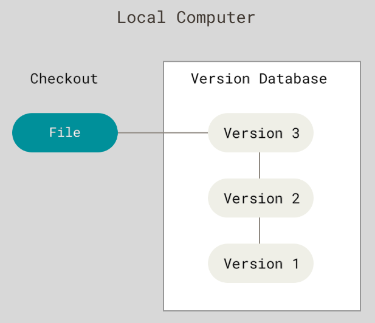
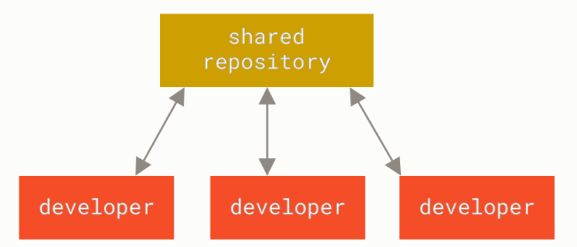
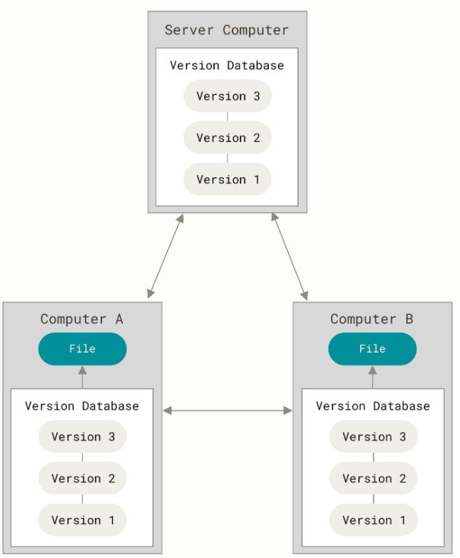

Cистема контроля версий
##########################

**Cистема контроля версий** (от англ. version control system, VCS или revision control system) — 
программное обеспечение для облегчения работы с изменяющейся информацией. 
Система управления версиями позволяет хранить несколько версий одного и того же документа, 
при необходимости возвращаться к более ранним версиям, определять, кто и когда сделал то или иное изменение, и многое другое.

Такие системы наиболее широко используются при разработке программного обеспечения для хранения исходных кодов разрабатываемой программы. Однако они могут с успехом применяться и в других областях, в которых ведётся работа с большим количеством непрерывно изменяющихся электронных документов. В частности, системы управления версиями применяются в САПР, обычно в составе систем управления данными об изделии (PDM). 
Управление версиями используется в инструментах конфигурационного управления (Software Configuration Management Tools).

Часто бывает важно иметь не только последнюю версию, но и несколько предыдущих. 
Можно сохранять несколько вариантов документа, нумеруя их соответствующим образом. 
Но при таком способе хранения приходится хранить несколько практически идентичных копий, а это 
требует повышенного внимания и дисциплины и часто ведёт к ошибкам. Можно легко забыть в каком каталоге 
находится пользователь и случайно изменить не тот файл или скопировать не те файлы.

Для решения этой проблемы, программисты разработали локальные VCS с простой базой данных, 
которая хранит записи о всех изменениях в файлах, осуществляя тем самым контроль ревизий.

	   
Централизованные системы контроля версий
********************************************

В процессе работы возникает необходимость взаимодействовать с другими разработчиками. 
Для того, чтобы разобраться с ней, были разработаны централизованные системы контроля версий (Centralized Version Control System, 
далее CVCS). Такие системы, как CVS, Subversion и Perforce, используют единственный сервер, 
содержащий все версии файлов, и некоторое количество клиентов, которые получают файлы из этого централизованного хранилища. 
Применение CVCS являлось стандартом на протяжении многих лет.

	   
Все разработчики проекта в определённой степени знают, чем занимается каждый из них. 
Администраторы имеют полный контроль над тем, кто и что может делать, и гораздо проще администрировать CVCS, 
чем оперировать локальными базами данных на каждом клиенте.

Недостатком является единая точка отказа, представленная централизованным сервером. 
При выходе сервера из строя, система контроля версий будет недоступна и
сохранять изменения будет невозможно. Если жёсткий диск, на котором хранится центральная БД, повреждён, 
а своевременные бэкапы отсутствуют, 
то будет потеряна вся история проекта, кроме которые сохранились на локальных машинах разработчиков. 

Распределённые системы контроля версий
**************************************

Распределённые системы контроля версий (Distributed Version Control System,  DVCS). 
В DVCS (таких как Git, Mercurial, Bazaar или Darcs) клиенты не просто скачивают снимок всех файлов (
состояние файлов на определённый момент времени)—они полностью копируют репозиторий. 
В этом случае, если один из серверов, через который разработчики обменивались данными, 
выйдет из строя, любой клиентский репозиторий может быть скопирован на другой сервер для продолжения работы. 
Каждая копия репозитория является полным бэкапом всех данных.

