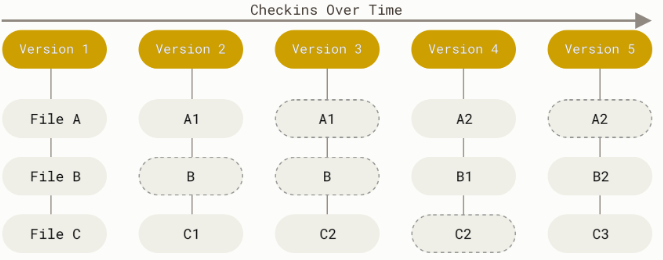

GIT
##########################

Git - это система контроля версий, выполняющая хранение данных в виде набора снимков (snapshots).
Каждый раз, когда программист выполняет фиксацию изменений (коммит, commit), то есть сохраняет состояние своего проекта в Git, 
система запоминает, как выглядит каждый файл в этот момент, и сохраняет ссылку на этот снимок. 
Для увеличения эффективности, если файлы не были изменены, Git не запоминает эти файлы вновь, 
а только создаёт ссылку на предыдущую версию идентичного файла, который уже сохранён. 

	   
Целостность Git
*****************

В Git для всего вычисляется хеш-сумма, и только потом происходит сохранение. 
В дальнейшем обращение к сохранённым объектам происходит по этой хеш-сумме. 
Это значит, что невозможно изменить содержимое файла или каталога так, чтобы Git не узнал об этом. 
Данная функциональность встроена в Git на низком уровне и является неотъемлемой частью его философии. 
Информация не будет потеряна во время её передачи и не будет получен повреждённый файл без ведома Git.

Механизм, которым пользуется Git при вычислении хеш-сумм, называется SHA-1 хеш. 
Это строка длиной в 40 шестнадцатеричных символов (0-9 и a-f), 
она вычисляется на основе содержимого файла или структуры каталога. 

SHA-1 хеш выглядит примерно так:

.. code:: python

	24b9da6552252987aa493b52f8696cd6d3b00373

Git сохраняет все объекты в свою базу данных не по имени, а по хеш-сумме содержимого объекта. 
Git только добавляет новые данные в базу Git. 

Состояния git
***************

У Git есть три основных состояния, в которых могут находиться файлы: 

- изменён (modified), 
- индексирован (staged), 
- зафиксирован (committed)

К изменённым относятся файлы, которые поменялись, но ещё не были зафиксированы.

Индексированный — это изменённый файл в его текущей версии, отмеченный для включения в следующий коммит.

Зафиксированный значит, что файл уже сохранён в вашей локальной базе.

Каталог Git — это то место, где Git хранит метаданные и базу объектов вашего проекта. 

Это самая важная часть Git и это та часть, которая копируется при клонировании репозитория с другого компьютера.

Базовый подход в работе с Git выглядит так:

- Изменение файлов рабочей копии.

- Выборочно добавление в индекс только тех изменений, которые должны попасть в следующий коммит, 
добавляя тем самым снимки только этих изменений в индекс.

- Выполнение коммита (фиксация) - этот снимок сохраняется в каталог Git.

Репозиторий
*************

Это место, в котором можно хранить код, файлы и журнал редакций каждого файла. 
Репозитории могут иметь несколько участников совместной работы и могут быть общедоступными или частными.

Репозиторий может иметь одного владельца или несколько.

Репозиторий может быть локальным ― храниться на компьютере пользователя. 
А может быть удалённым — лежать на сервере или в облачном хранилище. 
В таком случае пользователи со своих устройств подключаются к этому репозиторию через интернет.

GitHub
*******************
Git — это просто программа, которую нужно установить и подключить к своему проекту. Можно установить её на сервер и настроить удалённую работу самостоятельно. А можно воспользоваться уже готовыми сервисами. Самый популярный из них — GitHub.

GitHub — крупнейший веб-сервис для хостинга IT-проектов и их совместной разработки. 

Веб-сервис основан на системе контроля версий Git. 
Сервис бесплатен для проектов с открытым исходным кодом и (с 2019 года) небольших частных проектов, 
предоставляя им все возможности, а для крупных корпоративных проектов предлагаются различные платные тарифные планы.

Другими словами, GitHub — это сайт-хранилище. 
Нужно сначала установить Git, потом зарегистрироваться на GitHub, 
создать там онлайн-репозиторий — и перенести туда файлы из своего репозитория. 
Можно настроить автоматический перенос и многие другие функции, которые позволят работать с кодом совместно.

На GitHub можно создавать публичные или открытые проекты — это позволяет знакомить со своим кодом других людей. 
А можно приватные или закрытые, доступные только тем, кто работает над кодом.

.. toctree::
   :maxdepth: 3
   
   git_02_install
   git_03_repo
   git_04_branch
   git_05_merge
   git_06_github
   
   

