Создание репозитория
######################

Создать репозиторий для проекта **my_project**

Создание репозитория
***********************

Команды выполняются в программе **GitBash** (Пуск -> Git - GitBash)

1. Проверить текущий каталог

.. code:: 
	
	$ pwd
	
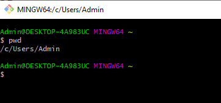

2. Создать каталог проекта

.. code:: 
	
	$ mkdir my_project

3. Перейти в каталог проекта
	
.. code:: 

	$ cd my_project

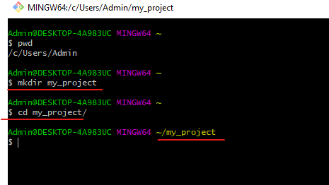

4. Инициализировать репозиторий

.. code:: 

	$ git init

Эта команда создаёт в текущем каталоге новый подкаталог с именем **.git**, 
содержащий все необходимые файлы репозитория — *структуру* Git репозитория. 
На этом этапе проект ещё не находится под версионным контролем. 

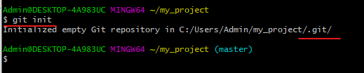
	
5. Просмотр содержимого каталога

.. code:: 

	$ ls -a
	
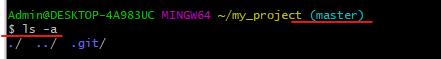
	   
Выведено содержимое каталога my_project. Файлы и каталоги, имеющие впереди символ точка - скрытые.

В консоли видно, что активной является ветка **master**.

6. Создать в IDLE скрипт и сохранить его в каталог **my_project** под именем **hello_git.py**

.. code:: python
	
	print('Hello, Git!')
	
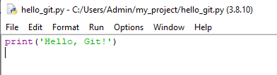
	   
7. Проверить содержимого каталога

.. code:: 

	$ ls
	
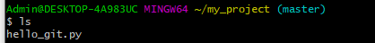
	   
Определение состояния файлов
*****************************

Каждый файл в вашем рабочем каталоге может находиться в одном из двух состояний: 

- под версионным контролем (отслеживаемые) 
- не под версионным контролем (неотслеживаемые). 

Отслеживаемые файлы — это те файлы, которые были в последнем снимке состояния проекта; 
они могут быть неизменёнными, изменёнными или подготовленными к коммиту (это те файлы, о которых знает Git).

Неотслеживаемые файлы — это всё остальное, любые файлы в вашем рабочем каталоге, 
которые не входили в ваш последний снимок состояния и не подготовлены к коммиту. 

Как только файлы редактируются, Git будет рассматривать их как изменённые, 
так как они изменены с момента последнего коммита. 

Цикл работы (в течение жизненного цикла проекта):

- Изменения вносятся,
- Изменения индексируются (**add**)
- Фиксируются все *проиндексированные изменения* (**commit**)

8. Проверить состояние 

.. code::

	$ git status
	
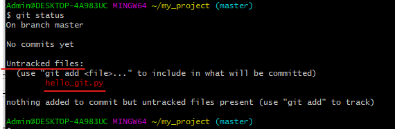
	   
Понять, что новый файл hello_git.py неотслеживаемый можно по тому, 
что он находится в секции **«Untracked files»** в выводе команды status. 

Статус **Untracked** означает, что Git видит файл, которого не было в предыдущем снимке состояния (коммите); 
Git не станет добавлять его в коммиты до явного указания.   
	
Отслеживание новых файлов и запись изменений
*********************************************

Для отслеживания (добавить под версионный контроль) нового файла, 
используется команда **git add**. 

9. Проиндексировать файл:

.. code:: 

	$ git add hello_git.py
	
10. проверить состояние после добавления под версионный контроль:

.. code:: 

	$ git status

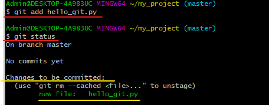

Файл **hello_git.py** теперь **отслеживаемый** и **добавлен в индекс**:

Файл проиндексирован, так как он находится в секции **"Changes to be committed"**.

11. Зафиксировать изменения:

.. code:: 

	$ git commit -m "Create hello_git.py"

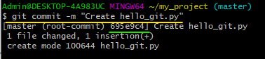

В данном случае коммит записан с хэшем *695у9с41* (короткая версия)

В момент коммита в историю снимков состояния попадают проиндексированные файлы.

12. Просмотр истории коммитов:
 
.. code:: 
	
	$ git log
	
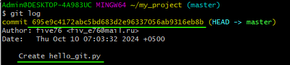
   
13. Изменить файл hello_git.py

.. code:: python

	print('Hello, Git!')
	print('Индексация - это важно')
	
	
14. Проверить статус:

.. code:: 
	
	$ git status
	
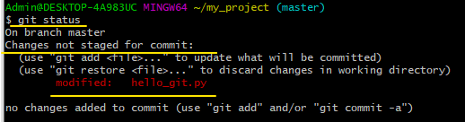

Файл находится под версионным контролем и является модифицированным, но не проиндексированным. 
Если его не проиндексировать, то изменения не будут отражены в истории состояний.
	
14. Проиндексировать и зафиксировать изменения с коммитом "Update hello_git.py"

.. code:: 
	
	$ git add .
	$ git commit -m "Update hello_git.py"

.. note:: Команда **git add .** проиндексирует все модифицированные и созданные файлы

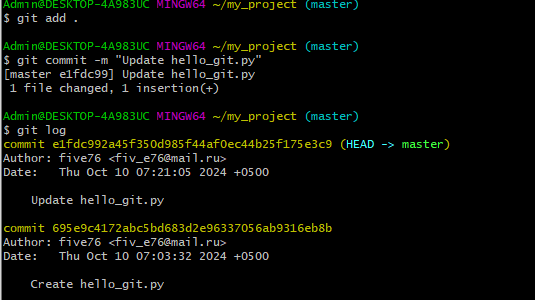

