Ветвление в Git
################

Ветвление в Git - это создание новых веток c целью отклонения от основной линии разработки. 

Причины создания могут разными:

* создание и тестирование нового функционала;
* отладка имеющегося кода;

Работа в новой ветке не затрагивает функционирование основной ветки.

Когда выполняется коммит, то Git сохраняет его в виде объекта, который содержит указатель на снимок (snapshot) подготовленных данных. 
Этот объект так же содержит имя автора и email, сообщение и указатель на коммит или коммиты непосредственно предшествующие данному (его родителей).

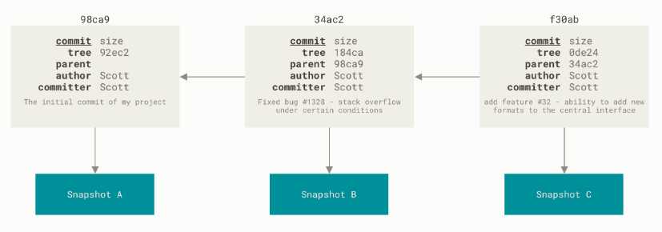
	   
Ветка в Git — это простой *перемещаемый указатель* на один из таких коммитов. По умолчанию, имя основной ветки в Git —** master**. В процессе создания коммитов, 
ветка **master** будет всегда указывает на последний коммит, то есть *указатель* ветки **master** будет передвигаться на следующий коммит автоматически.

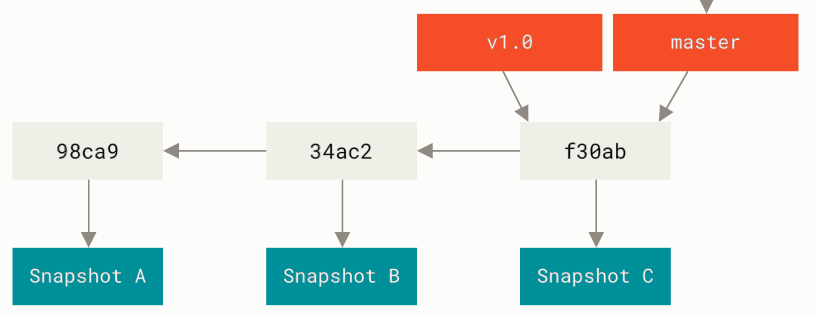
	   
Создание новой ветки
*********************

При создании новой ветки создается новый **указатель** на текущий коммит.

.. code::

	git branch testing
	
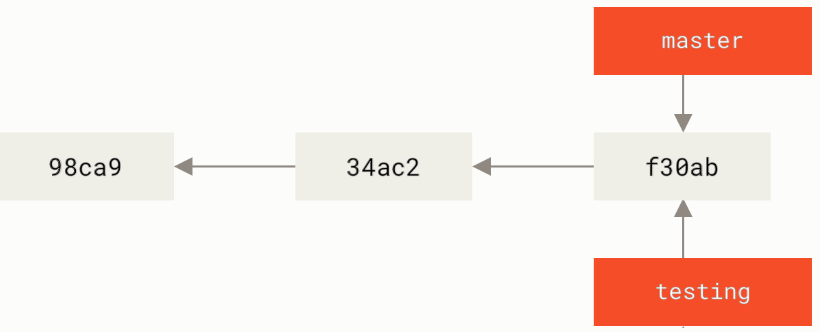
	   
Для ориентации в ветках Git указатель **HEAD**, который указывает на **ветку**.

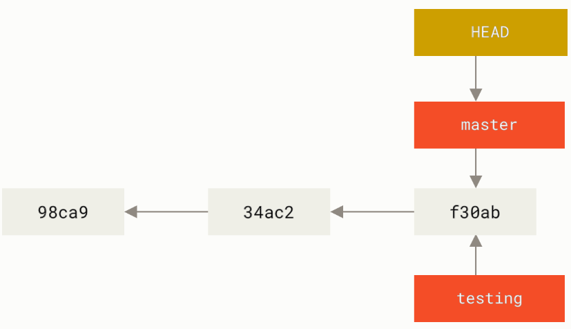

Переключение веток
*******************

При создании новой ветки указатель HEAD не перемещается автоматически на новую ветку. 
Для переключения Git на вновь созданную ветку используется команда **checkout**:

.. code::

	git checkout testing
	
После выполнения этой команды HEAD переместится и будет указывать на testing.

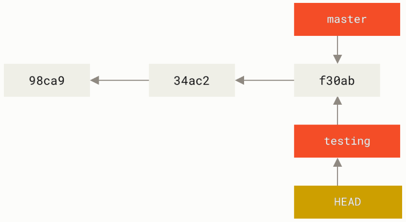

	
.. note:: С версии 2.23 появилась команда **switch** для переключения между ветками *git switch testing*
	   
Создание коммита в новой ветке
==============================

После внесения изменений и создания коммита в новой ветке указатель истории состояния сместится вперед. Это будет указатель ветки **testing**, с ним вместе сместится и HEAD.

.. code::

	echo "print('Create new branch')" > hello_git.py
	git commit -m 'Update hello_git.py'

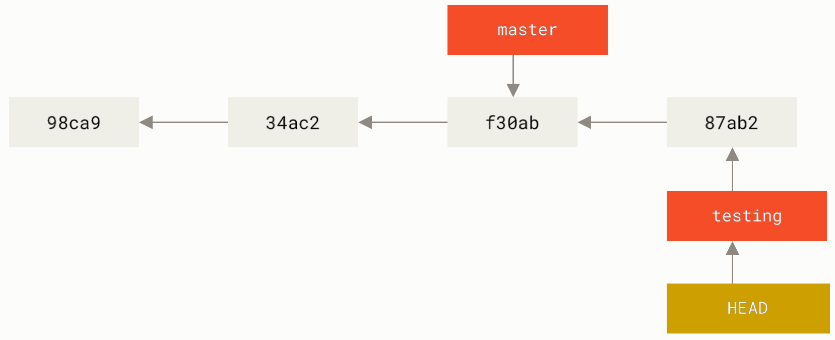

Указатель **master** останется в том месте, где был сделан переход с ветки на ветку. 

.. note:: Для просмотра истории коммитов другой ветки необходимо явно указать её имя: *git log testing*. для просмотра всей истории всех веток: *git log --all*

Переключение на старую ветку
==============================

.. code::

	git checkout master
	
Переключение на старую ветку master приведет к перемещению указателя HEAD и возврату файлов каталога в рабочее состояние в состояние, на снимок которого указывает master.

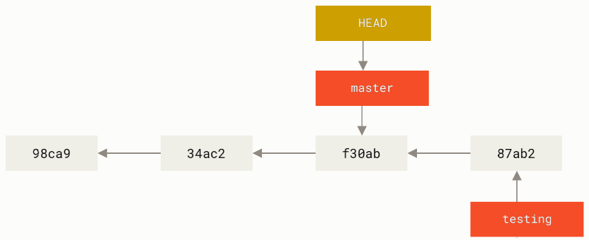
	   
Визуализация
==============

.. code::

	git log --oneline --decorate --graph --all

Практика:
*********

1. Перевести указатель HEAD на ветку master

.. code::
	
	git checkout master

2. Вывести указатели веток

.. code::

	git log --oneline --decorate

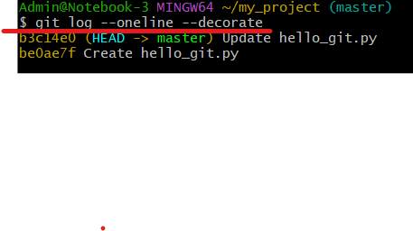

3. Создать новую ветку **testing**

.. code::

	git branch testing
	
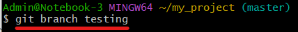
	   
4. Вывести указатели веток

.. code::

	git log --oneline --decorate

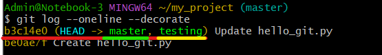

HEAD указывает на обе ветки. Обе ветки указывают на последний коммит

5. Переключиться на ветку **testing**

.. code::

	git checkout testing

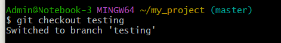

6. Внести изменения в файл **hello_git.py**

.. code:: python

	print('Hello, Git!')
	print('Indexing is important!')

	for num in range(10):
		print(num,end=' ')
		
6.1 Запустить файл:

.. code::

	python hello_git.py
	
.. figure:: img/01_git_27.png
   :scale: 100 %
   :align: center
   :alt: Commit

	
7. Проиндексировать все имеющиеся файлы (add .) и сделать коммит:

.. code::

	git add .
	git commit -m "Update hello_git py. Add for"
	
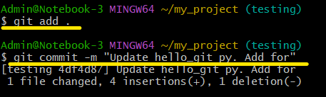

8. Вывести указатели веток

.. code::

	git log --oneline --decorate
	
	
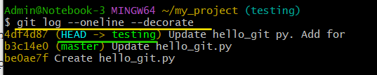
	   
**HEAD** указывает на **testing**, а **testing** на новый коммит. Ветка **master** осталась на месте.

9. Внести изменения в файл **hello_git**:

.. code:: python

	import os
	print('Hello, Git!')
	print('Indexing is important!')

	for num in range(10):
		print(num,end=' ')
		
	print(f'\nYour current directory: {os.getcwd()}')

10. Запустить файл:

.. code::

	python hello_git.py
	
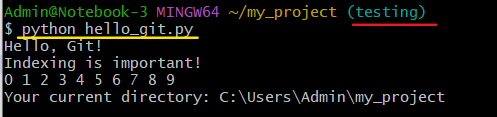

11. Проиндексировать все имеющиеся файлы (add .) и сделать коммит.
	
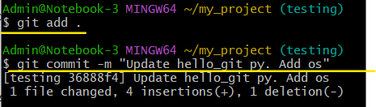
   
12. Вывести историю:

.. code::

	git log
	
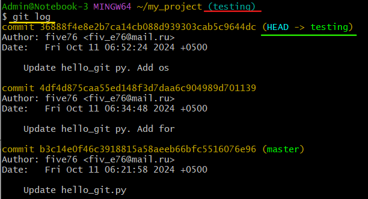
   
13. Вернуться в ветку **master** и вывести указатели веток:

.. code::

	git checkout master
	git log --oneline --decorate --all
	
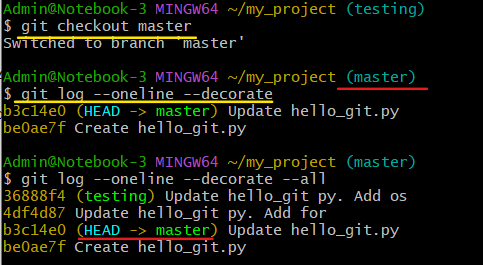

14. Запустить скрипт hello-git.py:

.. code::

	python hello_git.py
	
.. figure:: img/01_git_32.png
   :scale: 100 %
   :align: center
   :alt: Commit
   
Рабочий каталог вернулся в состояние, на которое указывал **master** до ветвления. По этой причине и работает *старый* код.

15. Внести изменения в файл **hello_git**:

.. code:: python

	print('Hello, Git!')
	print('Indexing is important!')

	ind = 0
	sum = 0

	while ind <= 9:
		sum += ind
		print(sum)
		ind += 1
		
16. Запустить скрипт hello-git.py:

.. code::

	python hello_git.py
	
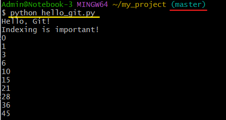
   
17. Проиндексировать все имеющиеся файлы (add .) и сделать коммит.

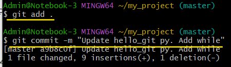
   
18. Вывести указатели веток и визуализировать историю коммитов:

.. code::

	git log --oneline --decorate --all
	git log --oneline --decorate --all --graph
	
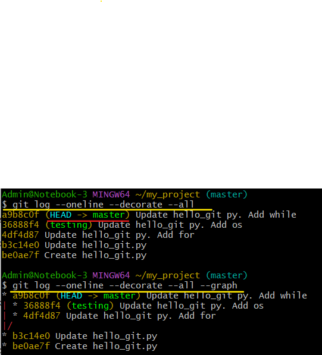
   
Представленный вывод наглядно демонстрирует перемещение указателя HEAD и ветвление.

19. Вернуться в ветку **testing** и продолжить эксперименты над проектом, внеся изменения в файл hello_git.py:

.. code::

	git checkout testing

.. code:: python

	import os
	print('Hello, Git!')
	print('Indexing is important!')

	for num in range(10):
		print(num,end=' ')
		
	print(f'\nYour current directory: {os.getcwd()}')

	s = 'Version Control System'
	print(f'{s} - length is {len(s)} characters')
	
Обратить внимание, что добавить пришлось только:

.. code:: python

	s = 'Version Control System'
	print(f'{s} - length is {len(s)} characters')
	
20. Запустить скрипт, убедиться, что все работает корректно, проиндексировать и выполнить коммит:

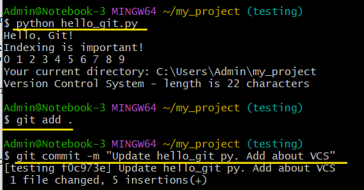

21. Вывести указатели веток и визуализировать историю коммитов:

.. code::

	git log --oneline --decorate --all
	git log --oneline --decorate --all --graph  
	
.. figure:: img/01_git_37.png
   :scale: 100 %
   :align: center
   :alt: Commit

.. code::

	git log - вывод истории по текущей ветке
	
	git log --all - вывод истории по всем веткам