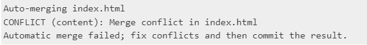
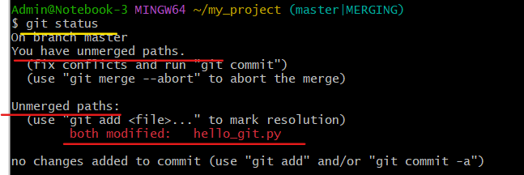
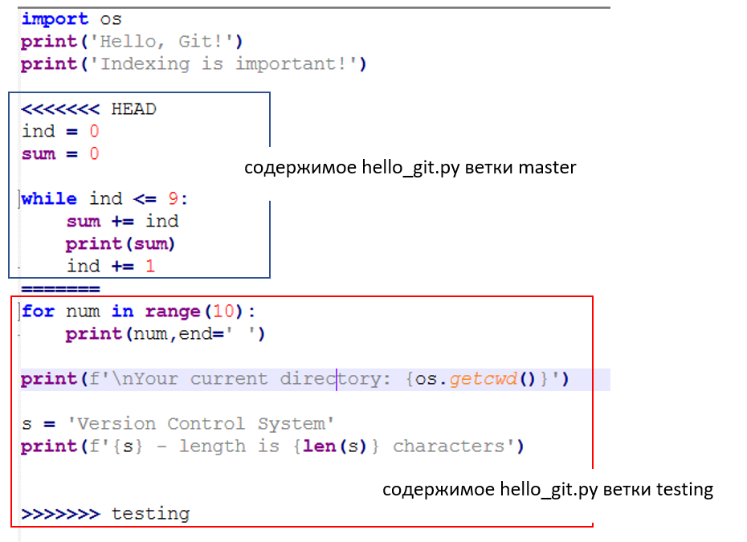
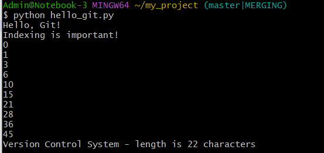
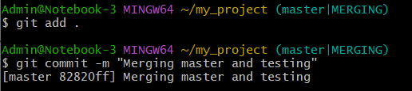
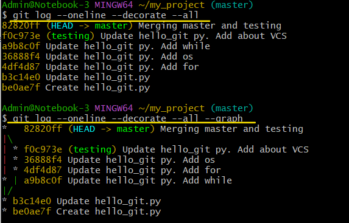

Слияние веток в Git
######################

Слияние веток в Git — это перенос изменений с одной ветки на другую. При этом слияние не затрагивает сливаемую ветку, то есть она остаётся в том же состоянии.

Чтобы слить код в основную ветку, выполните следующие шаги:

1. Перейти к ветке, которая будет принимать изменения **main_branch**: 

.. code::

	git checkout main_branch

2. Выполнить команду для слияния: 

.. code::

	git merge merged_branch

**merged_branch** — имя сливаемой ветки. 
	
После процедуры слияния появляется общий коммит для объединённых веток. По этому коммиту можно отследить историю каждой ветки.

Если в ветке **merged_branch** были созданы объекты, которые отсутсвовали в **main_branch**, то слияние пройдет без конфликтов.

Если в ветке **merged_branch** были *ИЗМЕНЕНЫ* объекты, которые имелись в **main_branch**, то произойдет конфликт.

Решение конфликта слияния
**************************

Git не создает коммит слияния автоматически.
ПРоцесс останавливается до тех пор, пока не будет разрешен конфликт. 

Для проверки, какие файлы не объединены используется git status:

.. code::

	git status
	

В конфликтующие файлы Git добавляет специальные маркеры конфликтов для исправления их вручную. 

В файле появится раздел, имеющий следующую структуру:

.. code::

	<<<<<<< HEAD:filename
		содержимое из основной ветки
	=======
		содержимое из сливаемой ветки
	>>>>>>> merged_branch:filename

1) Необходимо проверить, что из данного кода нужно для проекта:

* Оставить нужный код
* Удалить строки: <<<<<<< HEAD:filename, =======, >>>>>>> merged_branch:filename

2) Выполнить индексацию (add) и зафиксировать (commit):

Практика:
**************

Выполнить слияние веток **master**  и **testing**:

1. Перейти в ветку **master**:

.. code:: 

	git checkout master
	
2. Выполнить слияние:

.. code::

	git merge testing
	
При слиянии возникнет конфликт, так как в обоих ветках редактировался файл **hello_git.py**

3. Получить перечень конфликтующих файлов:

.. code::

	git status
	

	   
4. Открыть для редактирования файл **hello_git.py**:

	   
и привести к виду:

.. code:: python

	import os
	print('Hello, Git!')
	print('Indexing is important!')

	# осталось из master
	ind = 0
	sum = 0

	while ind <= 9:
		sum += ind
		print(sum)
		ind += 1

	# осталось из testing
	s = 'Version Control System'
	print(f'{s} - length is {len(s)} characters')
	
5. Запустить скрипт, убедиться, что все работает корректно, проиндексировать и выполнить коммит:

   

   

6. Вывести указатели веток и визуализировать историю коммитов:

.. code::

	git log --oneline --decorate --all

.. code::

	git log --oneline --decorate --all --graph  
	
	

