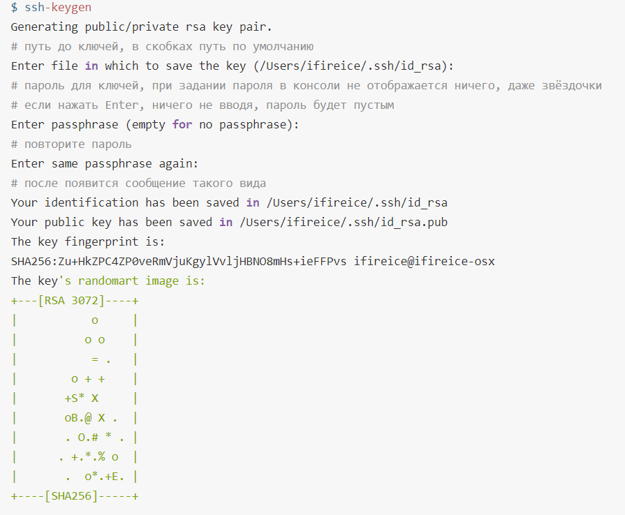
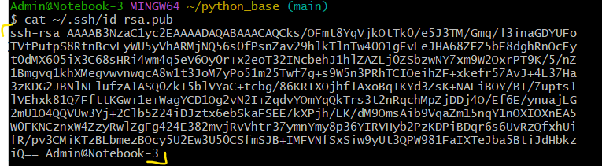
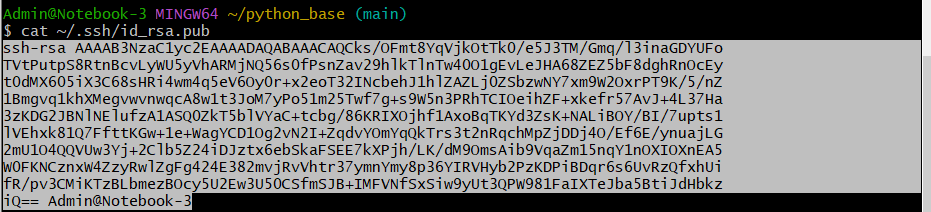
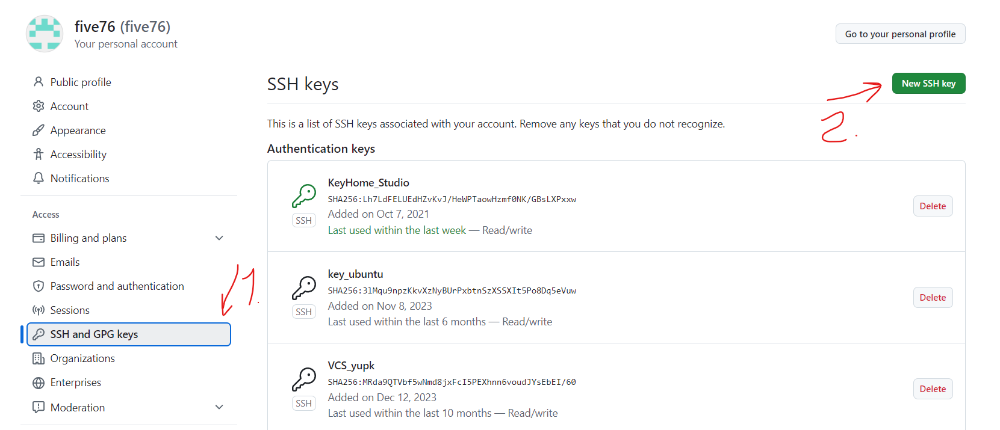
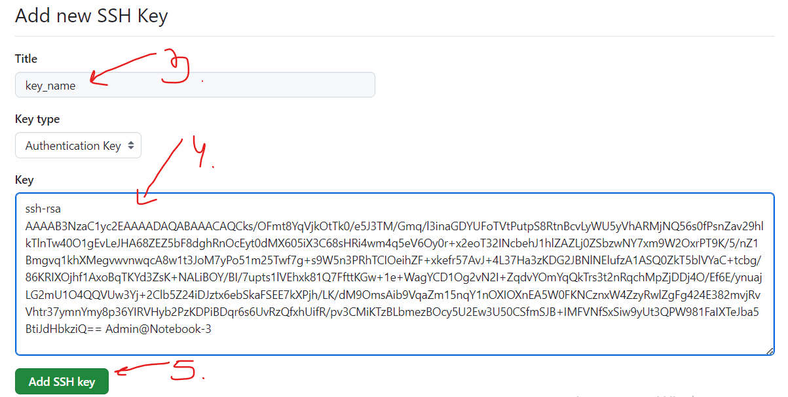

Интеграция с GitHub
####################

GitHub — крупнейший веб-сервис, который позволяет заниматься совместной разработкой с использованием Git и сохранять изменения на своих серверах. 

Регистрация на GitHub
************************

1. Необходимо зарегестрироваться на GitHub: придумать имя, указать электронную почту и подтвердить регистрацию. Выполняется это как на любой онлайн платформе.

Создание ssh ключа
********************
GitHub поддерживает безопасность за счёт двух сетевых протоколов, HTTPS и SSH, и вся работа с сервисом происходит через один из них.

Для HTTPS нужно будет каждый раз вводить пароль и специальный token.

Поэтому удобнее работать через ssh.

SSH — это сетевой протокол для зашифрованного соединения между клиентом и сервером для передачи данных.

При подключении используется пара ключей — открытый (публичный, public) и закрытый (приватный, private). 

Пользователь создаёт пару ключей при помощи специальной команды и сохраняет закрытый ключ у себя, а открытый кладёт на сервер (в данном случае на GitHub). 
Используется **асимметричное шифрование**.

Алгоритм следующий: 

1) отправитель (GitHub) шифрует сообщение публичным ключом и передаёт сообщение клиенту 
2) клиент расшифровывает при помощи приватного ключа, который хранится у негео. То, что зашифровано публичным ключом, расшифровать сможет только приватный ключ.

Создание ключа
===============

1) Выполнить команду **ssh-keygen**:

.. code::

	ssh-keygen
	

В результате создается два ключа:

- **id_rsa** - приватный
- **id_rsa.pub** - публичный

2) Вывести публичный ключ в консоль

.. code::

	cat ~/.ssh/id_rsa.pub
	

	
3) Скопировать ключ от символов ssh-rsa

4) Перейти в GitHub;

5) Зайти в список настроек профиля (кнопка в правом верхнемуглу) и выбрать **Settings**;

6) Выбрать **SSH and GPG keys** -> **New SSH key**

7) Ввести название ключа, вставить ключ и нажать **Add ssh key**

