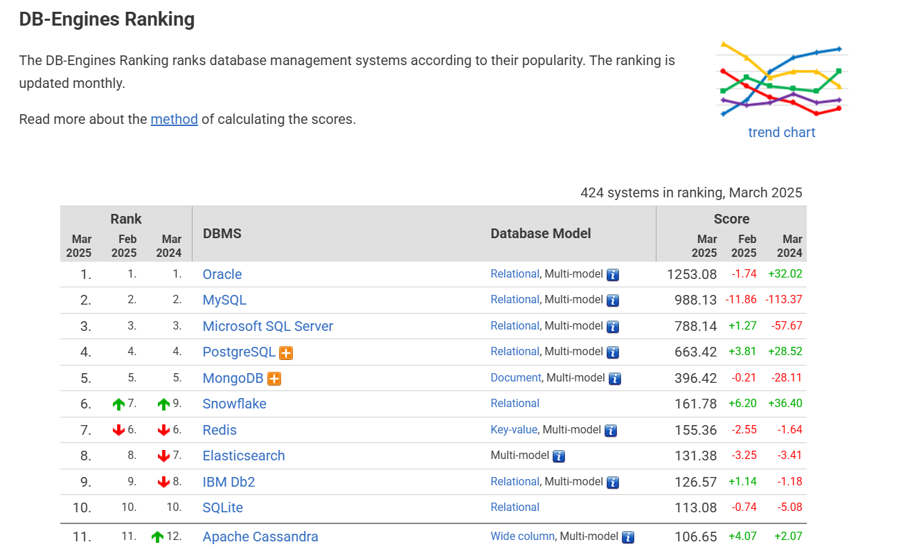

PostgreSQL. Введение.
#########################
 
Cвободная объектно-реляционная система управления базами данных (СУБД).

Объектно-реляционная СУБД (ОРСУБД) — реляционная СУБД (РСУБД), поддерживающая некоторые технологии, 
присущие объектно-ориентированным СУБД и реализующие объектно-ориентированный подход: объекты, классы и наследование реализованы в структуре баз данных 
и языке запросов.

PostgreSQL – один из самых известных, популярных и быстро развивающихся проектов по созданию систем управления базами данных с открытым исходным кодом. 
В данной категории имеется только один значимый соперник – MySQL. Однако его использование направлено, в основном, на поддержку сайтов и онлайн-транзакций, 
в то время как PostgreSQL намного шире в сфере своего применения и способна поддерживать больший набор приложений, в том числе большие и сложные базы данных корпоративного уровня.
В настоящее время это единственная полноценная независимая разработка этого класса, потому что MySQL таковым назвать уже сложно – он давно уже находится в зависимости сначала 
от Sun Microsystems, а позже от Oracle Corporation. 

PostgreSQL же – полностью независимый проект, права на который принадлежат международному сообществу разработчиков. 
За его использование не полагается никаких отчислений, а благодаря свободной модели распространения, его можно включать в состав любых коммерческих и некоммерческих решений. 
Именно это обусловливает его крайне широкое распространение – как организации, так и частные лица могут свободно пользоваться этой СУБД как для дальнейшего её развития, так и для решения собственных задач.

Где используется PostgreSQL
*****************************

Везде, где требуется управление большими и сложными БД вкупе с богатым функционалом, с большой вероятностью используется именно PostgreSQL, и сфера её применения будет только расти в дальнейшем. 
Государственные, коммерческие, некоммерческие организации используют PostgreSQL. 
Уже сегодня её используют такие гиганты, как Sony, Huawei, Alibaba, Tripadvisor, Hitachi, Яндекс, Skype, Reddit, Amazon Redshift, FlightAware, Сбербанк, Минфин, ФНС, Россельхозбанк, «Газпром нефть».

Переход на решения с открытым исходным кодом – общее направление развития информационных технологий, особенно в бизнес-среде. Open Source сообщества всё более активно множатся и развиваются, 
а их разработки зачастую не уступают коммерческим проектам, а то и превосходят их. 
Во многих развитых странах поддержка решений с открытым исходным кодом является государственной политикой: например, в Европе она активно спонсируется государством, 
а в США есть практика списывания налогов с компаний, пользующихся Open Source разработками.

В последнее время вообще становится всё более заметной тенденция использовать PostgreSQL в крупных государственных проектах. 
В России, например, это стало наиболее выражено в связи со взятым курсом на импортозамещение в сфере информационных технологий.
Кроме того, среди всех доступных сейчас альтернатив, PostgreSQL лучше всего отвечает требованиям, предъявляемым к промышленным СУБД, 
что с учётом её бесплатности, гибкости и надёжности делает её естественным выбором для многих организаций, 
которым приходится иметь дела с крупными и потенциально бесконечно масштабируемыми базами данных.

В 2024 году PostgreSQL была на четвёртом месте в общемировом рейтинге популярных СУБД. 

Преимущества и недостатки СУБД PostgreSQL
*****************************

Сильными сторонами PostgreSQL считаются:

- высокопроизводительные и надёжные механизмы транзакций и репликации;
- расширяемая система встроенных языков программирования: в стандартной поставке поддерживаются PL/pgSQL, PL/Perl, PL/Python и PL/Tcl; дополнительно можно использовать PL/Java, PL/PHP, PL/Py, PL/R, PL/Ruby, PL/Scheme, PL/sh и PL/V8, а также имеется поддержка загрузки модулей расширения на языке C[11];
- наследование;
- возможность индексирования геометрических (в частности, географических) объектов и наличие базирующегося на ней расширения PostGIS;
- встроенная поддержка слабоструктурированных данных в формате JSON с возможностью их индексации;
- расширяемость (возможность создавать новые типы данных, типы индексов, языки программирования, модули расширения, подключать любые внешние источники данных).

Основные преимущества:     
=======================

1. Свободный доступ

Любой специалист может бесплатно скачать, установить СУБД и сразу начать работу с базами данных. Если разместить базу и СУБД в облачном хранилище, придётся платить. 

2. Кроссплатформенность

PostgreSQL подходит для работы в любой операционной системе: Linux, macOS, Windows. Пользователь получает систему «из коробки» — чтобы установить и использовать программу, не нужны дополнительные инструменты.   

3. Поддержка разных форматов данных

PostgreSQL поддерживает много разных типов и структур данных, в том числе сетевые адреса, данные в текстовом формате JSON и геометрические данные для координат геопозиций. Все эти форматы можно хранить и обрабатывать в СУБД. 

При работе с PostgreSQL можно создавать собственные типы данных, их называют пользовательскими. 
Пользовательские типы данных нужны, чтобы упростить работу с базой или установить ограничения. 
Допустим, есть прибор, который показывает только целые числа от 1 до 5. Показания этого прибора нужно вносить в базу. 
Можно создать пользовательский тип данных, который состоит только из чисел 1, 2, 3, 4, 5. Тогда ввод других значений приведёт к ошибке, а значит, не нарушит данные. 

4. Работа с большими размерами данных

Размер базы данных в PostgreSQL не ограничен и зависит от того, сколько свободной памяти есть в месте хранения: на сервере, локальном компьютере или в облаке.

Максимальный размер таблицы — 32 терабайта. Этого более чем достаточно для хранения данных компаний типа Amazon. 
Одна строка в базе данных не может превышать 1,6 терабайт, а максимальный размер одной ячейки — 1 гигабайт. В такую ячейку можно добавить даже видео.

PostgreSQL позволяет работать с базами данных и элементами в них таких размеров, которые на практике в большинстве случаев не нужны. Поэтому эти ограничения можно назвать условными. 

5. Соответствует требованиям ACID

Аббревиатура ACID расшифровывается так:

- атомарность (от англ. atomicity),
- согласованность (от англ. consistency),
- изолированность (от англ. isolation),
- устойчивость (от англ. durability).

Это четыре требования для надёжной работы систем, которые обрабатывают данные в режиме реального времени. Если все требования выполняются, данные не будут теряться из-за технических ошибок или сбоев в работе оборудования.

**Транзакция** - это единая логическая единица или работа, которая может состоять из нескольких операций. Любое логическое вычисление, выполняемое в согласованном режиме в базе данных, называется транзакцией. Одним из примеров является перевод с одного банковского счета на другой: полная транзакция требует вычитания суммы, подлежащей переводу с одного счета, и добавления этой же суммы к другому.

**Атомарность** системы — возможность совершать транзакции. 

Транзакцией может быть денежный перевод между счетами. Деньги списывают с одного счёта и зачисляют на другой. Если счёт получателя заблокирован, операция должна быть отменена, а денежный перевод должен вернуться на счёт отправителя
В отличие от атомарности, согласованность означает, что транзакция будет выполнена только в том случае, если она не нарушает согласованность данных в базе. 

Например, нужно транзакцией перевести деньги из одной таблицы в другую. В одной таблице деньги хранятся в виде числовых значений. В другой таблице есть поля с датами. Даты — это тоже числа. 
Во время транзакции числовые данные могут попасть в поле с датами. Это не противоречит атомарности, но согласованность будет нарушена: данные о деньгах не могут храниться в пространстве с датами. 
При согласованности системы такая транзакция выполняться не должна.

**Изолированность** системы означает, что параллельные действия не влияют друг на друга. Например, денежный перевод между двумя счетами не должен влиять на третий счёт.

**Устойчивость** системы означает, что уже выполненная транзакция не отменится из-за технических неполадок, например, если отключат свет в серверной.

PostgreSQL соответствует всем четырём требованиям ACID и обеспечивает сохранность данных при выполнении транзакций и других работ.

6. Поддерживает все функции, которые есть в современных базах

Например, в PostgreSQL есть оконные функции, вложенные транзакции и триггеры.
Оконные функции позволяют выбрать определённые записи в таблице и делать вычисления с ними в отдельном столбце. Например, можно добавить в таблицу с данными интернет-магазина столбец с датой первого посещения пользователем сайта. Этот столбец пригодится, если понадобится рассчитать LTV (от англ. customer lifetime value). 
Вложенными называют транзакции внутри других. Например, выполнение серии переводов траншами в рамках одного договора. Допустим, были выполнены пять транзакций, а на шестой возникли проблемы. Откатиться должны все предыдущие транзакции, которые были внутри одной большой. Откат транзакции — это отмена всех изменений данных, вызванных этой транзакцией. 
В PostgreSQL можно создавать триггеры — функции, которые автоматически запускаются при определённых условиях. Например, можно создать триггер, который запускается при удалении данных о закрытой компании из базы. Созданный триггер автоматически добавит в нужном поле другой таблицы запись: «данные о компании удалены, компания закрыта».

7. Собственный диалект языка SQL

Примерно 80% операций в СУБД выполняется с помощью запросов на классическом языке SQL. Для некоторых действий в PostgreSQL есть свои запросы. 
Реализация дополнительной логики, например, условных переходов и циклов, выходит за рамки SQL и требует использования некоторых языковых расширений. Функции могут писаться с использованием одного из следующих языков:

•	Встроенный процедурный язык PL/pgSQL, во многом аналогичный языку PL/SQL, используемому в СУБД Oracle;
•	Скриптовые языки — PL/Lua, PL/LOLCODE, PL/Perl, PL/PHP, PL/Python, PL/Ruby, PL/sh, PL/Tcl, PL/Scheme, PL/v8 (Javascript);
•	Классические языки — C, C++, Java (через модуль PL/Java);
•	Статистический язык R (через модуль PL/R).
•	PostgreSQL допускает использование функций, возвращающих набор записей, который далее можно использовать так же, как и результат выполнения обычного запроса.
Функции могут выполняться как с правами их создателя, так и с правами текущего пользователя.

8. Настройка синхронного дублирования данных

Работа с PostgreSQL поддерживает логическую репликацию. Репликация — это сохранение копии базы данных, которая может находиться на другом сервере. При логической репликации любые изменения синхронизируются во всех копиях базы данных вне зависимости от места их хранения, таким образом, будет храниться одна версия базы данных.

9. Перенос данные из другой СУБД

Объём данных крупных компаний может быть размером 10 терабайт. 
Их перенос займёт время и приостановит работу. Небольшие компании или стартапы смогут «‎переехать» в PostgreSQL из другой СУБД быстро, не потеряв ничего в процессе. 
Перенести все данные можно с помощью специальных инструментов.

Недостатки
==============

1.	Сложность настройки. 

Обилие возможностей влечёт за собой разнообразие конфигураций, что может создавать сложности для начинающих пользователей. Настройка базы данных требует глубокого понимания архитектуры и параметров.

2.	Высокое потребление ресурсов. 

PostgreSQL может потреблять больше ресурсов (памяти и процессорного времени) по сравнению с некоторыми другими СУБД. Особенно это заметно при работе с большими объёмами данных и сложными запросами.

3.	Отсутствие некоторых функций. 

В сравнении с некоторыми коммерческими СУБД PostgreSQL может слегка отставать в функциональности.

Краткая история
****************

В 1985 году, когда SQL ещё не был мировым стандартом, группа инженеров Калифорнийского университета Беркли под руководством профессора Майкла Стоунбрейкера начала разработку реляционной СУБД POSTGRES. В основе проекта лежали наработки, которые Стоунбрейкер сделал во время работы над INGRES — одной из первых реляционных СУБД.
К 1988 году команда опубликовала ряд научных статей, описывающих язык запросов POSTQUEL, который лежал в основе POSTGRES. Название недвусмысленно намекало на то, что новый язык более современный и продвинутый, чем SQL. Саму POSTGRES называли «постреляционной СУБД» — её создавали для того, чтобы преодолеть ставшие тогда очевидными ограничения SQL.
Первая версия инновационной СУБД вышла в 1989 году, но уже в 1992-м, после нескольких обновлений, проект закрыли. К счастью, исходный код POSTGRES распространялся по лицензии BSD. Выпускники Беркли Эндрю Ю и Джоли Чену продолжили её развивать, заменив язык POSTQUEL на SQL, который на тот момент уже стал международным стандартом. Новая инкарнация сперва получила имя Postgres95 (по году создания), а затем PostgreSQL. С тех пор вышло 28 версий СУБД.

Сегодня проект поддерживает довольно небольшая по нынешним меркам команда разработчиков. Во главе команды стоит управляющий комитет (Core Team) — члены комитета принимают решения по развитию и выпуску новых версий Postgres. Разработчики делятся на обычных (contributors) и основных (major contributors). Кроме того, небольшая группа разработчиков (commiters) имеет право вносить изменения в исходный код.

В число основных разработчиков входят и три программиста из России: Олег Бартунов, Фёдор Сигаев и Александр Коротков.

Эмблема PostrgreSQL:
====================

Каждый продукт или компания имеет свой логотип — то, что идентифицирует и воплощает в себе сущность их бренда. Со временем он практически становится брендом.
Логотипы вызывают эмоции, которые вызывают у потребителей сильное чувство связи и лояльности. Он запоминается, связывая изображение с конкретным продуктом. 
Postgres ассоциирeется со слоном Slonik.
 

Во многих культурах слоны имеют отличную память. (В книге Агаты Кристи «Слоны могут вспомнить» это используется в качестве повторяющейся темы.) Логотип слона можно интерпретировать по-разному, но наиболее распространенным является то, что слоны, как базы данных, являются отличными хранителями информации.
Название происходит от русского слова «слоны» (slony), что означает «слоны». Из этого проекта Postgres образуется следующая терминология:

**Slony** — слово во множественном числе, означающее, что кластер состоит из нескольких баз данных.

**Slon** — слово в единственном числе; каждый узел репликации управляется программой под названием «slon», которая объединяется в вышеупомянутый «кластер слонов».

**Slonik** — слово, означающее «маленький слон» и, следовательно, название программы, используемой для настройки кластера.
