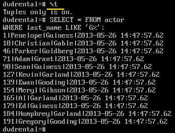
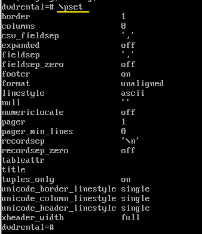

Терминальный клиент psql
#####################

Программа **psql** — это терминальный клиент для работы с PostgreSQL. Поставляется в составе сервера. 
Он позволяет интерактивно вводить запросы, передавать их в PostgreSQL и видеть результаты. 
Также запросы могут быть получены из файла или из аргументов командной строки. 
Кроме того, psql предоставляет ряд метакоманд и различные возможности, подобные тем, 
что имеются у командных оболочек, для облегчения написания скриптов и автоматизации широкого спектра задач.

Данный инструмент предназначен в первую очередь для администраторов.

Подключение к базе данных
*************************

**Синтаксис команды подключения:**

*Полная форма:*

::

	psql -d <db> -U <username> -h <server> -p <port>

::

	psql -U postgres

.. figure:: img/03_connect_postgres.png
       :scale: 100 %
       :align: center
       :alt: asda

Так как база данных не была указана, то подключение произошло к базе *postgres* через Unix-сокет.

.. note:: **Сокет** (англ. socket — разъём) — программный интерфейс для обмена данными между процессами. Процессы могут выполняться как на одном компьютере, 
          так и на разных устройствах, связанных сетью. Сокеты позволяют создавать сетевые соединения, устанавливать связь между клиентами и серверами, 
		  а также закрывать соединения после завершения обмена данными. Они используются в различных типах сетевых приложений, включая веб-серверы, почтовые клиенты, мессенджеры.

Это можно увидеть, введя метакоманду **\conninfo**.

**\conninfo** - вывод информации о текущем подключении:

.. figure:: img/03_conninfo.png
       :scale: 100 %
       :align: center
       :alt: asda

.. note:: Метакоманда в PostgreSQL — это команда, которая позволяет выполнять различные операции в командной оболочке psql, не используя SQL-запросы. 

Приглашение вида:

::

	postgres=# 
	
означает, что работа осуществляется в привилегированном режиме.

::

	=>
	
непривилегированный режим

Выход их сеанса
^^^^^^^^^^^^^^^

**CTRL+D** - выход из сеанса psql.

или

::

	\q

*Сокращенная форма*

::

	psql

В данном случае psql попробует подключиться, используя значения по умолчанию:

- база — совпадает с именем пользователя(admin);
- пользователь — совпадает с именем пользователя ОС(admin);
- узел — соединение через Unix-socket;
- порт — 5432.

.. figure:: img/03_connect_admin.png
       :scale: 100 %
       :align: center
       :alt: asda

В этом примере пользователь **admin** отстутствует среди зарегистрированных в кластере.

::

	psql -U postgres

**\\c[onnect]** - метакоманда для подключения к базе данных из сеанса psql

Синтаксис:

::

	\c - 

Подключиться к той же базе данных

::

	\c <db> <username> <server> <port>

::

	\c dvdrental
	

Справочная информация
**********************

Основной источник справочной информации - это официальная документация postgres

https://postgrespro.ru/docs

Однако, имеются встроенные средства получения справочной информации:

Справка из командной строки Linux:

::

	psql --help | less
	
::

	man psql
	
Из сеанса psql:

- **\\?** список команд psql
- **\\? variables** переменные psql
- **\\h[elp]** список команд SQL
- **\\h  команда** синтаксис команды SQL
- **\\q** выход

Ввод команд SQL и вывод результата
**********************************

Комманды SQL можно вводить в одной строке, но так как они могут быть очень длинными, то ввод можно разбивать на несколько строк.

.. important:: Окончанием ввода команды является символ "точка-с-запятой".

::

	SELECT * FROM actor LIMIT 5;

.. figure:: img/03_dvd_01.png
       :scale: 100 %
       :align: center
       :alt: asda

::

	SELECT * FROM actor
	WHERE last_name LIKE 'G%';

Приглашение вида **-#** означает продолжение ввода команды SQL.

Форматирование вывода
=======================

По-умолчанию результат выводится в виде таблицы с заголовками:

	   
Выравнивание в столбце производится по самой длинной строке.
	   
Отключение (включение) параметров форматирования:

В некоторых случаях, например, для передачи для далбнейшей обработки в скрипт, требуется отключить разделители:

- \\a - отключить (включить) выравнивание (aling)

- \\t - отключить (включить) вывод заголовков (tuplespace).

Отключение выравнивания:

.. figure:: img/03_dvd_a.png
       :scale: 100 %
       :align: center
       :alt: asda
	   
Отключение заголовков:

Установка параметров форматирования
---------------------

**\\pset**

Получение значений параметров форматирования:
^^^^^^^^^^^^^^^^^^^^^^^^^^^^^^^^^^^^^^^^^^^^

::

	\pset

Установка разделителя вывода
^^^^^^^^^^^^^^^^^^^^^^^^^^^^^^^

Например, если потребуется создать csv-файл c результатами SQL выборки, то можно установить в качестве разделителя
символ "запятая" и потом полученный результат передать в файл.  

::

	\t
	
	\pset fieldsep ','
	

Отправка результата запроса в файл:
^^^^^^^^^^^^^^^^^^^^^^^^^^^^^^^^^^^^^
	   
Для того, чтобы отправить результат запроса SQL в файл можно завершить ввод запроса 
командой **\\g** с указанием имени файла:

::

	SELECT * FROM actor
	WHERE last_name LIKE 'G%' \g actor.csv
	

Отправка результата запроса в туннель:
^^^^^^^^^^^^^^^^^^^^^^^^^^^^^^^^^^^^^
	   
Для того, чтобы отправить результат запроса SQL для обработки командой нужно ввести **\\g** с указанием имени команды:

::

	SELECT * FROM actor
	WHERE last_name LIKE 'G%' \g | cat -n

В результате выполнится запрос и его результат будет отправлен команде Linux **cat** в конвейере
	
Выполнение команд shell из psql
^^^^^^^^^^^^^^^^^^^^^^^

Синтаксис:

::

	\! <команда >

Просмотр содержимого файла:

::
	
	\! cat actor.csv
	

::
	
	\! pwd

Расширенный формат вывода
===========================

**\\x** - позволяет "инвертировать" вывод результата запроса, преобразовав столбцы в строки. 

Удобно использовать в случае большого количества столбцов, вывод которых не помещается в экран.

::

	\x
	Expanded display is on
	SELECT * FROM actor
	WHERE last_name LIKE 'G%';

::

	\a \t
	SELECT * FROM actor
	WHERE last_name LIKE 'G%';

Расширенный режим действует до конца сеанса или до принудительного отключения.

Для отключения данного режима необходимо повторно ввести **\\x**

**\\gx** - включение расширенного режима на один запрос

::

	SELECT * FROM actor
	WHERE last_name LIKE 'G%';
	
::

	SELECT * FROM actor
	WHERE last_name LIKE 'G%' \gx

представить вывод в вертикальном формате
	
	
Создание и выполнение скриптов
=================================

С помощью psql можно сформировать файл, содержимое которого будет являться скриптом:

::

	SELECT format('SELECT count(*) FROM film_actor WHERE film_id=%s;', film_id) FROM film;
	
Спецификатор **%s** функции **format** заменяется при выполнении строкой, указанной вторым аргументом. 

Выполнение скрипта из терминала
----------------------------------

Для выполнения сформированного скрипта непосредственно в psql необходимо указать метакоманду **\\gexec**:

::

	SELECT format('SELECT count(*) FROM film_actor WHERE film_id=%s;', film_id) 
	FROM film
	LIMIT 3
	\gexec
	

	   
Для перенаправления в файл указать **\\g**

::

	SELECT format('SELECT count(*) FROM film_actor WHERE film_id=%s;', film_id) 
	FROM film
	LIMIT 3
	\g (tuples_only=on format=unaligned) count_actor

::

	\! cat count_actor
	

	
Выполнение скрипта из файла
----------------------------------

**\\i[nclude]** - чтение команд из внешних файлов и их выполнениеы

::

	\i count_actor

Выполнение скриптов sql из shell
----------------------------------

::

	psql < filename
	
Передача содержимогго файла в стандартный поток ввода и передача psql

::

	psql -f filename
	
::

	psql -U postgres -d dvdrental -f count_actor
	
	
Взаимодействие с ОС
=====================

Вывод во внешний файл
---------------------

::

	\o[utput] <file_name>
	
::

	\o temp_result
	SELECT tablename FROM pg_tables LIMIT 10;
	
	\! cat temp_result
	
Действие метакоманды распространяется до конца сеанса или до повторного применения.

Для отключения повторно ввести **\o**

Работа с переменными
=====================

Установить переменную окружения
^^^^^^^^^^^^^^^^^^^^^^^^^^^

**\\setenv** - установить переменную окружения

::

	\setenv PGDATA1 /home/admin/data1
	\! mkdir PGDATA1
	\! ls -al

Получение переменной окружения
^^^^^^^^^^^^^^^^^^^^^^^^^^^^^

Вывод списка переменных окружения:

::

	\! env | less

**\\getenv** - получить переменную окружения

::

	\getenv hostname HOSTNAME
	

Получение списка переменных 
^^^^^^^^^^^^^^^^^^^^^^^^^^

**\\set** - без параметров

::

	\set
	
	
Установить значение переменной (для сеанса):
^^^^^^^^^^^^^^^^^^^^^^^^^^^^^^

::

	\set ip_add 10.10.5.10
	
Для вывода значения переменной необходимо поставить символ "двоеточие"

::

	\echo :hostname :ip_add

Сброс переменной
^^^^^^^^^^^^^^^^

::

	\unset hostname
	
Создание переменной из запроса
^^^^^^^^^^^^^^^^^^^^^^^^^^^^^^^^^

**\\gset**

В переменную count_film записать количество имеющихся фильмов:

::

	SELECT count(*) as count_film FROM film \gset
	\echo :count_film

.. important:: Для успешной работы \gset запрос долже возвращать единственную запись.
	
Ветвтление в psql
=======================

Конструкция **:{?имя_переменной}** позволяет проверить, определена ли переменная.

Проверить, определена ли переменная *working_dir* и если нет, то создать ее:

::

	\if :{?working_dir}
	\else
    \set working_dir `pwd`
    \endif

::

	\echo :working_dir
	
Работа с системным каталогом
==============================

**\\d[escribe]**

Получение информации об объектах базы данных

	   
::

	\d actor
	

	   
::

	\d pg_tables
	
.. figure:: img/03_d_pgtables.png
       :scale: 100 %
       :align: center
       :alt: asda

Это предмтавление (вверху подписано)

::

	\dS+ pg_tables

	   
Настройка psql
================

При запуске psql выполняются два скрипта (при их наличии):

- **psqlrc** - общий скрипт;
- **.psqlrc** - пользовательский (выполнеяется последним)

Пользовательский файл должен располагаться в домашнем каталоге, а расположение системного скрипта можно узнать командой:

::
	
	admin$ pg_config --sysconfdir

/etc/postgresql-common

В Alt LINUX данная команда отсутствует, поэтому получить значение данного параметра можно представлением **pg_config**:

::

	SELECT * FROM pg_config WHERE name='CONFIGURE'

::

	/etc/pgsql

По умолчанию оба файла отсутствуют.

В эти файлы можно поместить команды для настройки сеанса, например:

- приглашение psql;
- программу постраничного просмотра результатов запросов;
- переменные для хранения текста часто используемых команд.

Для примера запишем в переменную top5 текст запроса на получение пяти самых больших по размеру таблиц:

::

	\set top5 'SELECT tablename, pg_total_relation_size(schemaname||''.''||tablename) AS bytes FROM pg_tables ORDER BY bytes DESC LIMIT 5;'

Для выполнения запроса достаточно набрать:

::

	top5

::

	   tablename    |  bytes  
	----------------+---------
	 pg_proc        | 1245184
	 pg_rewrite     |  745472
	 pg_attribute   |  720896
	 pg_description |  630784
	 pg_statistic   |  294912
	 
	(5 rows)

Если записать эту команду \set в файл ~/.psqlrc, переменная top5 будет доступна сразу после запуска psql.

Благодаря поддержке readline, в psql работает автодополнение ключевых слов и имен объектов, 
а также сохраняется история команд. Имя и размер файла истории настраиваются переменными HISTFILE, HISTSIZE.

Самостоятельно
**************

1. Запустите psql и проверьте информацию о текущем подключении.

2. Выведите список баз данных в подробном виде.

3. По умолчанию psql использует команду «less» для постраничного просмотра результатов запроса. Замените ее на команду «less -XS» и снова выведите подробный список баз данных.

4. По умолчанию приглашение psql  показывает только имя базы данных. Настройте вид приглашения так: пользователь@база=#.

5. Настройте psql так, чтобы для всех команд выводилась длительность выполнения. Убедитесь, что при повторном запуске эта настройка сохраняется.

6. Откройте транзакцию и выполните команду, которая завершается любой ошибкой. Убедитесь, что продолжить работу в этой транзакции невозможно.

7. Задайте переменной ON_ERROR_ROLLBACK значение onи убедитесь, что после ошибки можно выполнять команды внутри транзакции