Конфигурирование сервера
#####################

PostgreSQL является сложной системой, которая должна обеспечивать работоспособность в разных условиях.

Для настройки системы используются различные параметры, которые, в свою очередь, расположены в файлах конфигурации.
Большую часть работы администраторы выполняют именно с параметрами систем.

https://postgrespro.ru/docs/postgresql/16/runtime-config

Для Postgres параметры конфигурации могут быть настроены для:

- всего кластера;
- для отдельной базы данных;
- для отдельного пользователя;
- для отдельной команды, транзакции.

Основной файл конфигурации
***************************

**postgresql.conf**

В зависимости от операционной системы может быть расположен в разных каталогах, но обычно располагается 
в системном каталоге кластера postgres. Для ALT Linux по-умолчанию расположен в **/var/lib/pgsql/data**,
в UBUNTU **/etc/postgresql/16/main**

Для просмотра местонахождения файла postgresql.conf можно воспользоваться командой **SHOW**, которая показывает значения
параметров на текущий момент.

В сеансе psql:

::

	SHOW config_file;

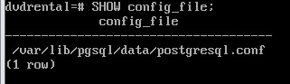

В командной строке 

::

	psql -U postgres -c 'SHOW config_file;'
	
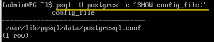

При запуске исполняемого файла сервера с помощью аргумента командной строки 
**-c config_file** можно задать требуемое местонахождение файла конфигурации.

Файл является хорошо документированным. Данные хранятся в виде **ключ-значение**.

После внесения в файл изменений необходимо, чтобы сервер перечитал файл без полной перезагрузки(reload), 
а для некоторых параметров требуется перезагрузка сервера (restart).

::

	sudo -u postgres pg_ctl -D /var/lib/pgsql/data reload
	
или в терминале psql

::

	SELECT pg_reload_conf();

::

	sudo -u postgres pg_ctl -D /var/lib/pgsql/data restart

**pg_read_file()** — системная функция в PostgreSQL, которая возвращает содержимое текстового файла с локальной файловой системы.  

- Возвращает фрагмент файла с заданного смещения (offset), размером не больше length байт (размер может быть меньше, если файл кончится раньше).

- Если смещение offset отрицательно, оно отсчитывается от конца файла. 

- Если параметры offset и length опущены, возвращается всё содержимое файла. 

- Прочитанные из файла байты обрабатываются как символы в серверной кодировке; если они оказываются недопустимыми для этой кодировки, возникает ошибка.

::
	
	SELECT pg_read_file('/var/lib/pgsql/data/postgresql.conf');

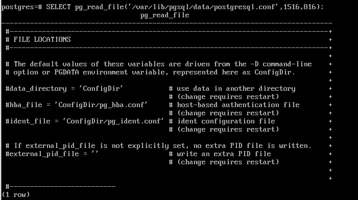

Хранить все параметры в одном большом файле может быть неудобно, поэтому есть возможность 
к основному конфигурационному файлу postgresql.conf можно подключать дополнительные файлы конфигурации. 

Директивы подключения:

- include_dir — каталог с дополнительными файлами конфигурации;

- include — включает дополнительный файл конфигурации;

- include_if_exists — включает дополнительный файл конфигурации, если он существует.

::

	sudo cat /var/lib/pgsql/data/postgresql.conf | grep include

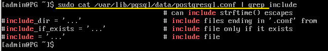
	   
В ALT по-умолчанию никакие дополнительные файлы или каталои не подключены.
	   
Найстройки, которые были считаны из файла postgresql.conf, можно увидеть с помощью представления **pg_file_settings**:

::

	SELECT sourceline, name, setting, applied, error FROM pg_file_settings;
	
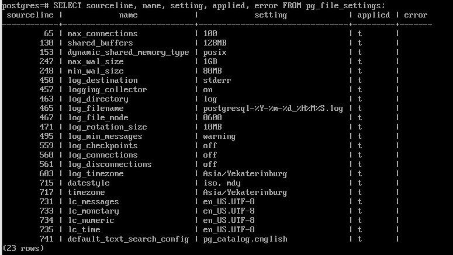
	   
Представление выводит незакомментированные строки конфигурационных файлов, 
имя файла конфигурации и номер строки, что удобно для поиска ошибок.

Столбец **applied** показывает, будет ли заданное значение применено при перечитывании. 
В частности, в столбце будет **false**, если:

- изменение требует рестарта сервера;

- существует строка с тем же параметром, которая будет прочитана позже (конфигурационные читаются сверху вниз построчно, 
и если один и тот же параметр определен несколько раз, то действовать будет то значение, которое будет прочитано последним);

- в одной из строк, где задается параметр, есть ошибка (если параметр числовой, а указан будет текст, то будет зафиксирована ошибка).

Отображение параметров
======================

**work_mem** - задаёт базовый максимальный объём памяти, который будет использоваться во внутренних операциях при обработке запросов (например, для сортировки или хеш-таблиц), 
прежде чем будут задействованы временные файлы на диске. 

Если выполняется сортировка, ему нужно место для сортировки. Вот в этом случае в узлу выделяется память размером **work_mem**.
Обычно если узел не может вложиться в это ограничение, то он начинает работать с диском, а если сделать слишком много, 
то оперативной памяти сервера может просто не хватить.

::

	SHOW work_mem;
	
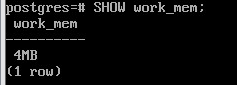
::

	\dconfig work_mem
	
::

	SELECT current_setting('work_mem');

Представление **pg_settings** возвращает более подробную информацию:

::

	SELECT * FROM pg_settings WHERE name='work_mem' \gx

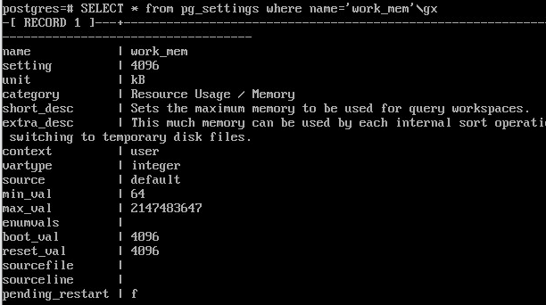

- name, unit — название и единица измерения параметра;
- setting — текущее значение;
- boot_val — значение по умолчанию (если не указывать вообще в конфигурационном файле);
- reset_val — начальное значение для сеансов (значение, которое устанавливается вначал сеанса и к которому оно будет сброшено, при установке начального значение параметра);
- source — источник текущего значения параметра;
- sourcefile, sourceline — файл конфигурации и номер строки, если текущее значение было задано в файле;
- pending_restart — true, если значение изменено в файле конфигурации, но для применения требуется перезапуск сервера.

**context** определяет действия, необходимые для применения параметра. Среди возможных значений:

- internal — изменить нельзя, значение задано при установке (поменять его вообще нельзя);
- postmaster — требуется перезапуск сервера;
- sighup — требуется перечитать файлы конфигурации,
- superuser — суперпользователь может изменить для своего сеанса;
- user — любой пользователь может изменить для своего сеанса.

В примере выше было показано, что только часть параметров установлена в конфигурационном файле, а все остальное - значение по-умолчанию.
В данном случае source - default, значит параметр вообще не установлен.

Столбец context - user, следовательно, любой пользователь для своего сеанса может установить свое значение.

Значение internal столбца context означает, что поменять данное значение нельзя в принципе.

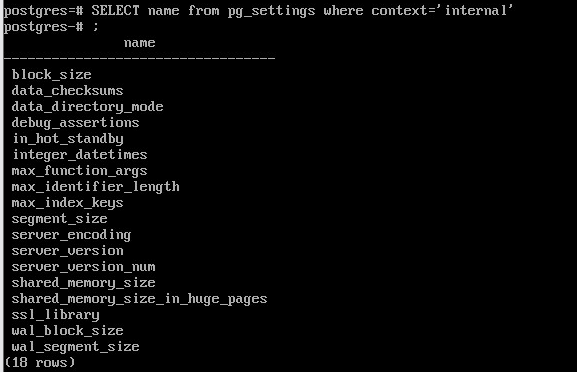

Порядок применения параметров
=============================

В первую очередь читается основной файл, а потом дополнительные, которые указаны в строках include...
И применяется то значение, которое было считано последним.

Пример:
-------

Создать отдельный каталог для параметров conf.d и установить значения work_mem

1) Остановить сервер:

::

	sudo -u postgres pg_ctl -D //var/lib/pgsql/data stop

2) Создать каталог:

::

	sudo -u postgres mkdir /var/lib/pgsql/data/conf.d
	
::

3) Раскомментировать строку **include_dir** в postgresql.conf

::

	include_dir='conf.d'
	
4) Добавить значение параметра **work_mem=12MB**:

::

	echo work_mem=12MB | sudo tee /var/lib/pgsql/data/conf.d/work_mem.conf
	
или

::

	sudo -u postgres vim /var/lib/pgsql/data/conf.d/work_mem.conf
	
	work_mem=12MB
	
	
Имена файлов в conf.d должны иметьрасширение **.conf**

5) Запустить сервер

::

	sudo -u postgres pg_ctl -D /var/lib/pgsql/data start
	
или, если запущен:

	sudo -u postgres pg_ctl -D /var/lib/pgsql/data reload
	
6) Прочитать значение параметра work_mem:

::

	psql -U postgres -c 'SHOW work_mem;'

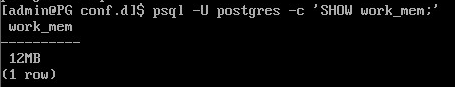

7) Переустановить значение параметра **work_mem=8MB**:

::

	echo work_mem=8MB | sudo tee -a /var/lib/pgsql/data/conf.d/work_mem.conf
	
8) Прочитать значение параметра work_mem. Оно не должно измениться.

9) Перечитать конфигурационный файл:

::

	sudo -u postgres pg_ctl -D //var/lib/pgsql/data reload
	
8) Прочитать значение параметра work_mem. Оно должно стать 8MB.

9) Подключиться к серверу:

::

	psql -U postgres
	
10) Вывести сведения для параметра work_mem из pg_file_settings:

::

	SELECT * FROM pg_file_settings WHERE name='work_mem' \gx 

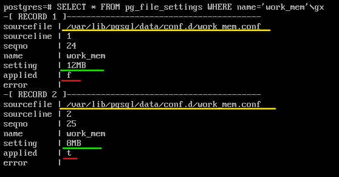

Внесение ошибки в файл конфигурации:
::

	echo work_mem=8mb | sudo tee -a /var/lib/pgsql/data/conf.d/work_mem.conf

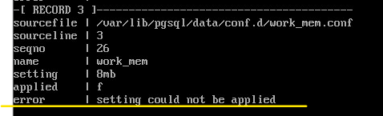

Единицы измерения установлены с ошибкой - маленькими буквами.

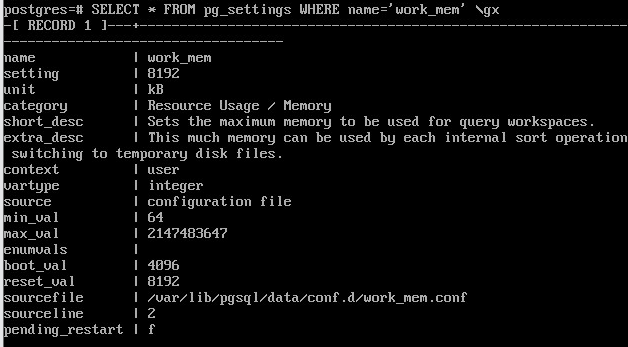
	   
Применены псоледние правильные значения из конфигурационного файла. 

Дополнительный файл конфигурации
**********************

**postgresql.auto.conf**

Он всегда располагается в каталоге данных (PGDATA) и считывается последним.

Предназначен для внесения изменений с помощью команды SQL **ALTER SYSTEM**

- **ALTER SYSTEM SET** *параметр* **TO** *значение* - добавляет или изменяет строку;
- **ALTER SYSTEM RESET** *параметр* - удаляет строку;
- **ALTER SYSTEM RESET ALL** - удаляет все строки;

**ALTER SYSTEM** изменяет только сам файл. Для применения изменений сервер должен перечитать конфигурационные файлы, 
как и в случае с изменением файла **postgresql.conf**.

Содержимое файлов конфигурации можно увидеть в представлении **pg_file_settings**, 
а действующие значения параметров — в представлении **pg_settings**.

Настройка параметров конфигурации в postgresql.auto.conf
=========================================================

::

	ALTER SYSTEM SET work_mem TO '16mb';

Возникает ошибка, так как требуется указывать единицы измерения большими буквами

::

	ALTER SYSTEM SET work_mem TO '16MB';
	
	ALTER SYSTEM
	
Команда выполнена без ошибок, но изменения не применены:

::

	SHOW work_mem;
	
Осталось всё без изменений - 8MB	

Хотя в файле записаны:

::

	SELECT pg_read_file('postgresql.auto.conf') \g
	
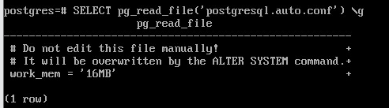
	   
Необходимо перечитать файл:

::

	SELECT pg_reload_conf();

::
	
	\dconfig work_mem

Для удаления строк из postgresql.auto.conf используется команда ALTER SYSTEM RESET:

::

	ALTER SYSTEM RESET work_mem;
	SELECT pg_reload_conf();

Должно быть восстановлено значение из work_mem.conf

Но, так как там была внесена ошибка, то ее предварительно необходимо удалить.

Установка параметров во время сеанса
***************************

**SET** - команда, которая позволяет изменять параметры конфигурации во время выполнения. 
По умолчанию изменения затрагивают только текущую сессию базы данных. После её завершения значения параметров восстанавливаются.

**SET LOCAL** внесение изменений до конца транзакции.

Функциия **set_config**. 

Установка параметров транзакционна: в случае отмены текущей транзакции, значения измененных в ней параметров  
вернутся к состоянию на начало транзакции.

Для изменения параметров во время сеанса можно использовать команду SET:

::

	SET work_mem TO '24MB';

	SET

Или функцию set_config:

::

	SELECT set_config('work_mem', '32MB', false);

::

	set_config 
	------------
	32MB
	(1 row)

Значение третего аргумента параметр определяет установку значение только для текущей транзакции (true) или до конца работы сеанса (false). Если установить false, то транзакция 
другого пользователя может увидеть значение этого параметра.

.. important:: Это важно при работе приложения через пул соединений, когда в одном сеансе могут выполняться транзакции разных пользователей.

Сброс значения

::

	RESET work_mem;

Установка параметров внутри транзакции
************

Открыть транзакцию и установить новое значение work_mem:

::

	BEGIN;
	SET work_mem TO '64MB';
	SHOW work_mem;
	
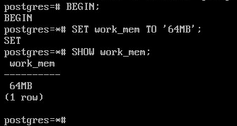

При откате значение сбрасывается, а при успешной фиксации сохраняется до конца сеанса

::

	ROLLBACK;
	SHOW work_mem;
	
::

	BEGIN;
	SET work_mem TO '64MB';
	SHOW work_mem;
	COMMIT;
	SHOW work_mem;

Установка значения до конца транзакции:

::

	BEGIN;
	SET LOCAL work_mem TO '64MB';
	SHOW work_mem;
	COMMIT;
	
::

	SHOW work_mem;

Пользовательские параметры
******************

При работе с Postgres можно использовать пользовательские параметры, которые можно создавать как во время сеанса, 
так и в конфигурационных файлах.

В имени пользовательских параметров **обязательно должна быть точка**, чтобы отличать их от стандартных параметров.

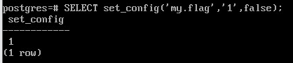
	   

Самостоятельно
**************

1. Получите список параметров, для изменения которых требуется перезапуск сервера.

2. В дополнительном подключаемом файле конфигурации сделайте ошибку при изменении параметра max_connections. Перезапустите сервер. 
Убедитесь, что сервер не стартует,и проверьте журнал сообщений. Исправьте ошибку и запустите сервер.

3. Установите параметр work_mem = 32MB в командной строке  запуска утилиты psql (для приложений, использующих 
библиотеку libpq для подключения к серверу)

Используйте один из двух способов: ключ options в строке подключения или переменная среды PGOPTIONS.

Информация о формировании строки подключения:

https://postgrespro.ru/docs/postgresql/16/libpq-connect#LIBPQ-CONNSTRING

4. Определить месторасположение файла postgresql.conf

