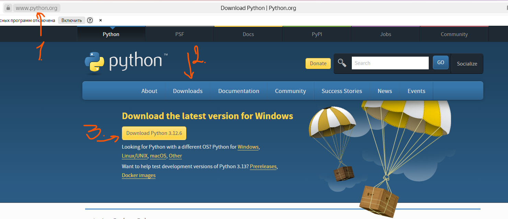
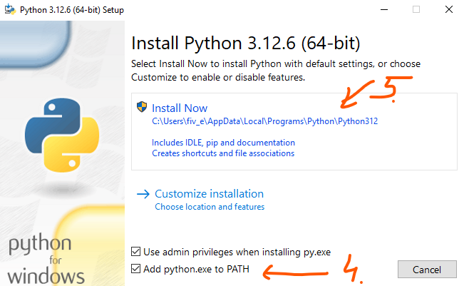
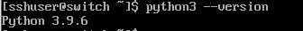
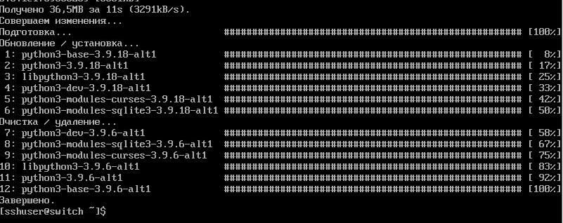
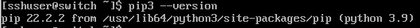

Установка Python
~~~~~~~~~~~~~~~~~~~~~

**Алгоритм** — это последовательность каких-либо действий для исполнителя, записанная на формальном языке и приводящая к заданной цели за конечное число шагов.

**Исполнитель** — это человек, животное или техническое устройство, способное выполнять определенный набор команд.

Алгоритм всегда предназначается для конкретного исполнителя. Формальный язык — это язык, который содержит конечное количество синтаксических конструкций и все его конструкции однозначно понимаются исполнителем, для которого он создан.

Формальные исполнители характеризуются: кругом решаемых задач, средой исполнения, системой команд, системой отказов от исполнения, которая включается при невозможности выполнения алгоритма в конкретных условиях.

**Программа** – представление алгоритма на специальном формальном языке, который нужно выполнить с исходными данными и получить как результат выходные данные. Исполнителем программы является компьютер или гаджет.

**Оператор** – это элемент языка, задающий полное описание действия, которое необходимо выполнить в программе.

Каждый оператор представляет собой законченную фразу языка программирования и определяет некоторый вполне законченный этап обработки данных. В состав операторов могут входить ключевые слова, данные, выражения и другие операторы. В английском языке данное понятие обозначается словом **statement**, означающим также предложение.

Для выполнения программы компьютером или гаджетом, необходима программа-посредник, которая называется **транслятором**.

На основе транслятора компьютер (гаджет) преобразует вводимые в него программы на машинный язык нулей и единиц (объектный код), поскольку только он является языком процессора. 
Трансляторы реализуются в виде **компиляторов** или **интерпретаторов**. 

С точки зрения выполнения принципы работы компилятора и интерпретатора существенно различаются.

**Компилятор** (англ. ompiler – составитель, собиратель) читает всю программу целиком, делает ее перевод и создает законченный вариант программы на машинном языке, который затем выполняется. Результат работы компилятора – бинарный исполняемый файл. После компиляции исходный код не требуется.

**Интерпретатор** (англ. Interpreter – истолкователь, устный переводчик) переводит и выполняет программу строка за строкой.

Интерпретатор читает исходный код, представленный на языке программирования, построчно и немедленно выполняет его. Исходный файл переводится на машинный язык постоянно., он и является исполняемым.

Язык Python является интерпретируемым языком. Для запуска программ на языке Python необходима программа интерпретатор (виртуальная машина) Python. Данная программа скрывает от Python-программиста все особенности операционной системы. Поэтому, создав программу на Python в системе Windows, ее можно запустить, например, в GNU/Linux и получить такой же результат.

Скачать и установить интерпретатор Python можно совершенно бесплатно с официального сайта: http://python.org/. Для работы нам понадобится интерпретатор Python версии 3 или выше

WINDOWS
""""""""

LINUX
""""""

Перед установкой необходимо проверить наличие предустановленной версии Python

::

        python --version

Если python3 не установлен или версия ниже 3.9, или требуется более новая версия, то необходимо выполнить установку:

::

        sudo apt-get install pytho3 -y

Также необходимо установить пакетный менеджер **pip** для Python

**pip** — система управления пакетами, которая используется для установки и управления программными пакетами, написанными на Python.

Система управления пакетами (также иногда «менеджер пакетов» или «пакетный менеджер») — набор программного обеспечения, позволяющего управлять процессом установки, удаления, настройки и обновления различных компонентов программного обеспечения. 

В Windows он устанвливается автоматически вместе с Python.

В Linux необходимо выполнить команду:

::

        sudo apt-get install python3-pip

или (например, в ALT Linux)

::

       sudo apt-get install python3-module-pip

