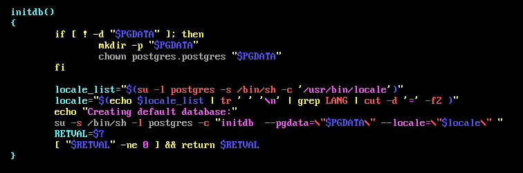

Установка PostgreSQL
#####################

Для установки Postgres имеется два варианта:

- установка из исходных кодов;
- установка из пакетов

Установка из исходных кодов выполняется чаще всего профессиональными разработчиками, в частности, разработчиками Postgres.
Является достаточно трудоемким процессом, подразумевающим полное понимание происходящих процессов, особенностей операционной системы,
тонкостей устанавливаемого программного обеспечения.

Администраторы в своей работе редко используют подобную практику, а пользуются уже готовыми решениями,
которые предоставляются в виде готовых установочных пакетов, которые скачиваются из репозиториев.
Этот вариант является предпочтительным, поскольку он собран из тех же исходных кодов с учетом операционной системы.

1) Обновить список репозиториев

::

    # apt-get update
	
2) Установить программное обеспечение:

::

	# apt-get install postgresql16-server
	
Создание кластера
*****************

Прежде чем осуществлять работу с базами данных, необходимо проинициализировать область хранения баз данных на диске. 
Данное называется хранилище кластером баз данных. 

**Кластер** (от англ. cluster — скопление, кисть, рой) — объединение нескольких однородных элементов, 
которое может рассматриваться как самостоятельная единица, обладающая определёнными свойствами. 

**Кластер в компьютерных сетях** — это группа компьютеров, серверов или процессоров, 
объединённых высокоскоростными каналами связи и представляющих с точки зрения пользователя *единый аппаратный ресурс*.

**Кластер баз данных PostgreSQL** представляет собой набор баз, управляемых одним экземпляром работающего сервера.

.. figure:: img/02_cluster.png
       :scale: 100 %
       :align: center
       :alt: asda

При инициализации в каждом кластере создаются две базы: template1 и template0. 

С точки зрения файловой системы кластер баз данных представляет собой один каталог (каталог данных или область данных), 
в котором будут храниться все данные. 

Владелец кластера может определить переменную окружения **PGDATA**, указывающую на каталог кластера. 
Эту переменную используют некоторые утилиты сервера, когда им нужно узнать расположение кластера. 
К таким утилитам относится **initdb**, а также основная утилита управления сервером **pg_ctl**.

Какого-либо стандартного пути не существует, но часто данные размещаются в /usr/local/pgsql/data или в /var/lib/pgsql/data. 

Для создания кластера предназначена утилита **initdb**.
В процессе работы она создает конфигурационные файлы, необходимые для работы Postgres. 
Имеет множество ключей, например **-k** - ключ для включения подсчета контрольных сумм.
Данная проверка выполняется при обращении к любой странице данных в кластере и 
позволяет оперативно обнаружить повреждения в данных.

В целях безопасности каталог, в котором инициализируется кластер, 
не может принадлежать суперпользователю ОС (root). 

Владельцем кластера обычно является пользователь **postgres**.

Обычно, для создания кластера используется следующая последвательность команд:

::

	mkdir /home/user/pgsql16/data
	export PGDATA=/home/user/pgsql16/data
	initdb -U postgres -k -D /home/user/pgsql16/data

Создание каталога для кластера, создание системной переменной PGDATA и запуск утилиты initdb от имени 
пользователя postgres (-U postgres).

В ALT LINUX процесс инициализации кластера автоматизирован скриптом **/etc/init.d/postgresq**:

::

	/etc/init.d/postgresql initdb

Среди команд данного скрипта присутствуют:

::

	PGDATA = /var/lib/pgsql/data
	...
	

Подробнее: https://postgrespro.ru/docs/postgresql/16/app-initdb

.. tabularcolumns:: |p{1cm}|p{7cm}|

.. csv-table:: Lorem Ipsum
	:file: _files/tables.csv
	:header-rows: 1
	:class: longtable
	:widths: 1 1
