Устройство сервера
#####################

Клиент-серверный протокол
*******************

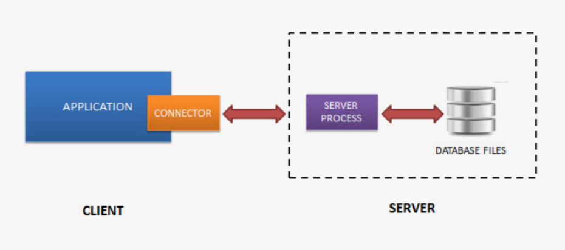
	   
.. figure:: img/05_struct_02.png
       :scale: 100 %
       :align: center
       :alt: asda

PostgreSQL функционирует в режиме сервера. Для того чтобы пользователи могли использовать его ресурсы пишутся
клиентские приложения. Чтобы все эти разнообразные программы могли работать одинаково с сервером, 
сервер поддерживает клиент-серверный протокол. Все протоколы клиент-серверной модели работают на уровне приложений.

Клиенты и серверы PostgreSQL взаимодействуют друг с другом, используя специальный протокол, основанный на сообщениях. 
Этот протокол поддерживается для соединений по TCP/IP и через Unix-сокеты. Для серверов, поддерживающих этот протокол, 
в IANA зарезервирован номер TCP-порта 5432, но на практике можно задействовать любой порт, не требующий особых привилегий.

Чтобы эффективно обслуживать множество клиентов, сервер запускает отдельный «обслуживающий» процесс для каждого клиента. 
В текущей реализации новый дочерний процесс запускается немедленно после обнаружения входящего подключения, что происходит прозрачно для протокола.

Протокол определяет функционал который может быть использован между сервером и клиентом, он описан в документации, 
является открытым.

Для реализации протокола существуют готовые библиотеки, которые можно подключать и использовать. 
Обычно клиент использует драйвер, реализующий протокол и предоставляющий набор функций для использованияв программе. 
Внутри драйвер может пользоваться стандартной реализацией протокола (библиотекой libpq), 
либо реализовывать этот протокол самостоятельно.

Например:

- **psycopg2** — один из самых популярных и широко используемых драйверов Python для PostgreSQL. Это оболочка для libpq, 
официальной клиентской библиотеки PostgreSQL.

Все, что будет программироваться в рамках приложения будет ограничено протоколом.

В протоколе выделены отдельные фазы для запуска и обычной работы. 
На стадии *запуска* клиент открывает подключение к серверу и передаёт стартовое сообщение. 
В этом сообщении содержатся имена пользователя и базы данных, к которой пользователь хочет подключиться; 
в нём также определяется, какая именно версия протокола будет использоваться. 
После анализа этой информации и содержимого конфигурационных файлов(в частности, pg_hba.conf), 
сервер определяет, можно ли предварительно разрешить это подключение, и какая дополнительная проверка подлинности требуется.

Затем сервер отправляет соответствующее сообщение с запросом аутентификации, 
на которое клиент должен ответить сообщением, подтверждающим его подлинность (например, по паролю). 

Если клиент не поддерживает метод проверки подлинности, запрошенный сервером, он должен немедленно закрыть соединение.

Получив сообщение **AuthenticationOk**, клиент должен ждать дальнейших сообщений от сервера. 
В этой фазе запускается обслуживающий процесс (backend). Попытка запуска может быть неудачной (и клиент получит ErrorResponse) 
либо сервер может отказать в поддержке запрошенной младшей версии протокола (NegotiateProtocolVersion).

В ходе обычной работы клиент передаёт запросы и другие команды серверу, 
а сервер возвращает результаты запросов и другие ответы. 
Иногда сервер передаёт клиенту сообщения по своей инициативе, но по большей части эта фаза сеанса управляется запросами клиента.

*Завершение* сеанса обычно происходит по желанию клиента, 
но в некоторых случаях и сервер может принудительно завершить сеанс. 
Когда сервер закрывает соединение, он предварительно откатывает любую открытую (незавершённую) транзакцию.

Поробнее:

https://postgrespro.ru/docs/postgresql/16/protocol

Транзакции
***********

Транзакция — это совокупность операций над базой данных, которые
вместе образуют логически целостную процедуру, и могут быть либо
выполнены все вместе, либо не будет выполнена ни одна из них.

- Транзакция переводит базу данных из одного согласованного состояния в другое согласованное состояние;

- Транзакции являются одним из средств обеспечения согласованности (непротиворечивости) базы данных, наряду с ограничениями
целостности (constraints), накладываемыми на таблицы;

- Транзакция может иметь два исхода: первый — изменения данных,произведенные в ходе ее выполнения, успешно зафиксированы в
базе данных, а второй исход таков — транзакция отменяется, и отменяются все изменения, выполненные в ее рамках;

- Изменения, сделанные транзакцией фиксируются с помощью ключевого слова COMMIT;

- Отмена транзакции называется откатом (rollback);

- В простейшем случае транзакция состоит из одной операции.

ACID
=====

От транзакции обычно ожидают выполнение четырех свойств, так называемый ACID:

.. note:: **Атомарность (Atomicity)** Это свойство означает, что либо транзакция будет зафиксирована в базе данных полностью, т. е. будут зафиксированы результаты выполнения всех ее операций, либо не будет зафиксирована ни одна операция транзакции.

Транзакцию нельзя выполнлить так, что она доработает до половины и оборвется. 
Если это произошло, то изменения, которые она успела произвести, будут убраны.

.. note:: **Согласованность (Consistency)**. Это свойство предписывает, чтобы в результате успешного выполнения транзакции база данных была
			переведена из одного согласованного состояния в другоесогласованное состояние.

Это могут быть как ограничения целостности, которые описаны базе данных, так и некоторые ограничения, 
которые описываются логикой клиентского приложения. 

.. note:: **Изолированность (Isolation)**. Во время выполнения транзакции другие транзакции должны оказывать по возможности минимальное
			влияние на нее.

.. note:: **Долговечность (Durability)**. После успешной фиксации транзакции пользователь должен быть уверен, что данные надежно сохранены в
			базе данных и впоследствии могут быть извлечены из нее, независимо от последующих возможных сбоев в работе системы.

Транзакции могут создаваться явным образом командой **BEGIN** или **START TRANSACTION** и завершаться командой **COMMIT** или 
**ROLLBACK**. SQL-операторы вне явного блока транзакций автоматически обрабатываются в виде транзакций, состоящих из одного оператора.

Каждой транзакции присваивается уникальный идентификатор **VirtualTransactionId** (также именуемый virtualXID или **vxid**), 
который состоит из идентификатора обслуживающего процесса (или backendID) и последовательно назначаемого номера. 
При первой операции **записи** транзакции в базу данных транзакции назначается невиртуальный 
идентификатор **TransactionId** (или **xid**). Когда транзакция верхнего уровня с (невиртуальным) **xid** фиксируется, 
она помечается как зафиксированная в каталоге **pg_xact**.

Подробнее:

https://postgrespro.ru/docs/postgresql/16/sql-begin

https://postgrespro.ru/docs/postgresql/16/sql-savepoint

https://postgrespro.ru/docs/postgresql/16/transactions

Практика:
-----------

psql работает в режиме автофиксации, то есть любая одиночная команда сразу исполняется.

::

	\echo :AUTOCOMMIT
	
.. figure:: img/05_autocommit_on.png
       :scale: 100 %
       :align: center
       :alt: asda

Например, драйвер **psycopg2** работает в режиме отключенной автофиксации.

1. Создать таблицу pr_lang

::

	CREATE TABLE pr_lang(id integer, s text);
	
2. Вставить строку 

::

	INSERT INTO pr_lang(id, s) VALUES (1, 'python');

3. Проверить видимость данных в другой транзакции (2):

::

	| SELECT * FROM pr_lang;

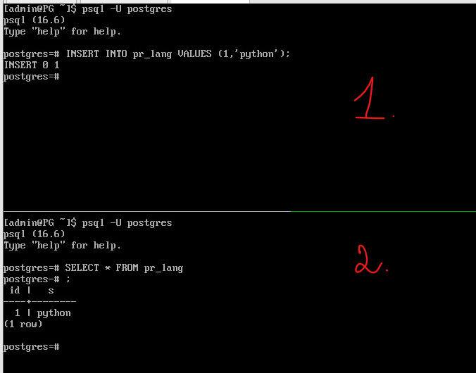
	
4. Во втором сеансе начать новую транзакцию:

::

	|BEGIN;
	|INSERT INTO pr_lang VALUES (2,'Java');

4. В первом сеансе сделать выборку:

::

	SELECT * FROM pr_lang;
	
Новые данные не видны.

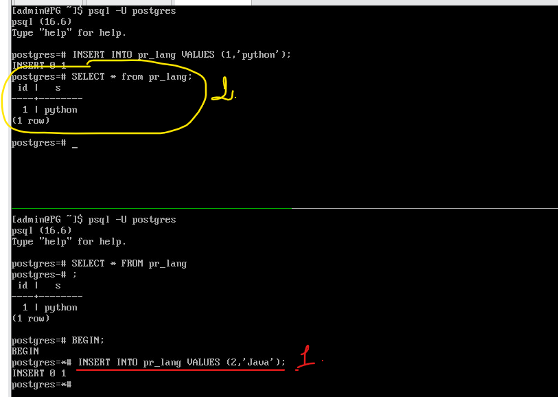

5. Зафиксировать транзакцию втором сеансе и повторить выборку в первом сеансе.

::

	| COMMIT;

::

	SELECT * FROM pr_lang;
	
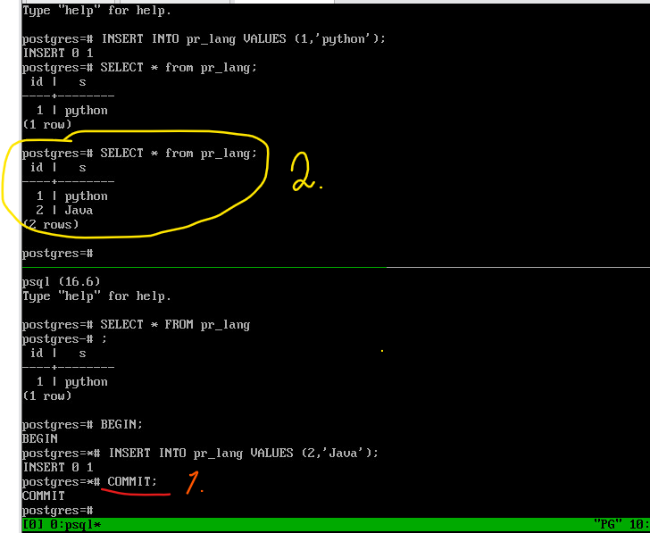

6. Отключить автофиксацию psql и выполнить вставку данных в первом сеансе, проверить во втором и закоммитить.

::

	\set AUTOCOMMIT off
	INSERT INTO pr_lang VALUES (3,'C++');
	
	|SELECT * FROM pr_lang;
	
	COMMIT;
	
	|SELECT * FROM pr_lang;

Для отмены вполнения части команд транзакции можно использовать точку сохранения **SAVEPOINT**.
Отменяются только те изменения состояния БД, которые были выполнены от момента установки точки до текущего момента.

::

	|BEGIN;
	|SAVEPOINT sp;
	|INSERT INTO pr_lang VALUES (4,'C#');
	|SELECT * FROM pr_lang;
	
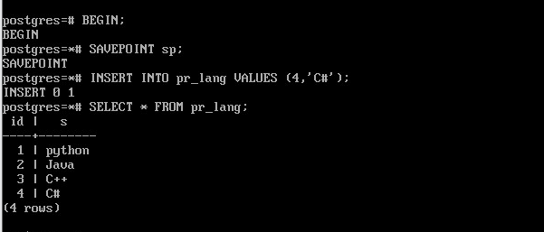
	   
Внутри транзакции видны собственные изменения.

::

	|ROLLBACK TO sp;
	|SELECT * FROM pr_lang;
	
Таблица вернулась к состоянию на момент точки сохранения **sp**.

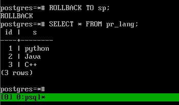

::

	|INSERT INTO pr_lang VALUES (5,'Go');
	|COMMIT;
	|SELECT * FROM pr_lang;
	
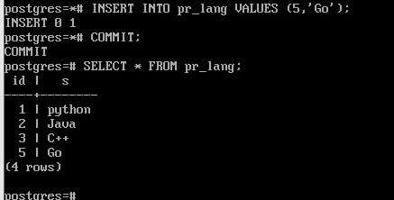
	   
Запросы
********

Простое выполнение запросов 
=============================

Цикл простого выполнения запросов начинает клиент, передавая серверу сообщение Query. 
Это сообщение включает команду (или команды) SQL, выраженную в виде *текстовой строки*. 
В ответ сервер передаёт одно или несколько сообщений, в зависимости от строки запроса, 
и завершает цикл сообщением ReadyForQuery. ReadyForQuery говорит клиенту, что он может безопасно передавать новую команду.

Запрос, поступающий серверу на выполнение, проходит несколько этапов:

- Разбор;
- Переписывание (трансформация);
- Планирование;
- Выполнение.

Разбор
-------

Во-первых, текст запроса необходимо разобрать (parse), чтобы понять, что именно требуется выполнить.

Лексический и синтаксический разбор
^^^^^^^^^^^^^^^^^^^^

Лексический анализатор разбирает текст запроса на лексемы (такие как ключевые слова, строковые и числовые литералы и т. п.), 
а синтаксический анализатор убеждается, что полученный набор лексем соответствует грамматике языка. 

Разобранный запрос представляется в виде абстрактного синтаксического дерева.

Семантический разбор
^^^^^^^^^^^^^^^^^^^^^^^

Задача семантического анализа — определить, есть ли в базе данных таблицы и другие объекты, 
на которые запрос ссылается по имени, и есть ли у пользователя право обращаться к этим объектам. 
Вся необходимая для семантического анализа мета-информация хранится в **системном каталоге** в специальных таблицах.

Семантический анализатор получает от синтаксического анализатора дерево разбора и перестраивает его, 
дополняя ссылками на конкретные объекты базы данных, информацией о типах данных и т. п.

После того, как запрос разобран, выполняется переписывание или трансформация.

Трансформация
---------------

Трансформации используются ядром для нескольких целей. 
Одна из них — заменять в дереве разбора имя представления на поддерево, соответствующее запросу этого представления.

Когда выполняется запрос к представлению (т. е. виртуальной таблице), система правил преобразует запрос пользователя в запрос, 
обращающийся не к представлению, а к базовым таблицам из определения представления.

Дерево разбора отражает синтаксическую структуру запроса, но ничего не говорит о том, в каком порядке будут выполнены операции.

PostgreSQL дает пользователю возможность написать свои собственные трансформации. Для этого используется система правил перезаписи (rules)

Планирование
--------------

После того, как запрос окончательно переписан и разобран, его нужно спланировать. 
В силу того, что SQL — это декларативный язык программирования, то у клиента и разработчика нет возможности указать, как именно выполнять запрос.
Указывается только то, что необходимо получить.

Разобранный запрос передается планировщику.

Определённый SQL-запрос (представленный деревом запроса) можно выполнить самыми разными способами, 
при этом получая одни и те же результаты.  Например, данные из таблицы можно получить, прочитав всю таблицу 
(и отбросив ненужное), а можно найти подходящие строки с помощью индекса. 

Разница во времени выполнения между неоптимальным и оптимальным планами может составлять многие порядки, поэтому планировщик, 
выполняющий оптимизацию разобранного запроса, является одним из самых сложных компонентов системы.

Для работы планировщику необходимо также знать статиститку, хранимую в системном каталоге.
Таблицы, распределение строк в таблицах, индексы и многое другое.

Выполнение
------------

План выполнения передается исполнителю.
Исполнитель принимает план и обрабатывает его рекурсивно, чтобы получить требуемый набор строк. 
Обработка выполняется по конвейеру, с получением данных по требованию. 
При вызове любого узла плана он должен выдать очередную строку, либо сообщить, что выдача строк завершена.

Механизм исполнителя применяется для обработки всех пяти основных типов SQL-запросов: SELECT, INSERT, UPDATE, DELETE и MERGE. 

Подробнее:
https://postgrespro.ru/docs/postgresql/16/query-path

Дополнительно:

https://habr.com/ru/companies/postgrespro/articles/574702/

Расширенный режим выполнения запросов
======================================

Шаги, перечисленные выше выполняются каждый раз, когда клиент посылает запрос, даже если он очень простой.
В силу того, что в приложениях часто выполняются простые запросы, то подобный алгоритм становится довольно накладным.

Поэтому имеется *расширенный протокол запросов*, который позволяет более детально управлять порядком действий, которые происходят.

Запрос можно **подготовить**.

Результаты подготовительных шагов (разбор и переписывание) можно многократно использовать повторно для улучшения эффективности. 
Запоминается дерево разбора. 
Можно передавать значения данных в отдельных параметрах вместо того, чтобы внедрять их непосредственно в строку запроса.

При выполнении запроса выполняется *привязка* конкретных значений параметров (сообщение Bind). 
Затем выполняется **планирование** запроса. Если подготовленный оператор не имеет параметров, либо он выполняется многократно, 
сервер может сохранить созданный план и использовать его повторно при последующих сообщениях Bind 
для того же подготовленного оператора. 

Экономия здесь стоит в том, что можно один раз оператор подготовить и много раз после этого его выполнять, 
возможно с разными значениями параметров. При этом он не будет каждый раз разбираться, 
а будет использовать на уже сохраненное закешированное дерево разбора. 
Более того, если у подготовленного оператора нет параметров, 
то нет никакой необходимости каждый раз выполнять планирование.

Подготовленные операторы существуют только в рамках **текущего сеанса работы** с БД. 
Когда сеанс завершается, система забывает подготовленный оператор, так что его надо будет создать снова, чтобы использовать дальше,
поэтому один подготовленный оператор не может использоваться одновременно несколькими клиентами базы данных; 
но каждый клиент может создать собственный подготовленный оператор и использовать его.

https://postgrespro.ru/docs/postgresql/16/sql-prepare

https://postgrespro.ru/docs/postgresql/16/sql-execute

https://postgrespro.ru/docs/postgresql/15/plpython-database

Практика:
----------

**PREPARE** создаёт подготовленный оператор. 

**Синтаксис**

PREPARE имя [ ( тип_данных [, ...] ) ] AS оператор

Подготовленный оператор представляет собой объект на стороне сервера, позволяющий оптимизировать 
производительность приложений. Когда выполняется PREPARE, указанный оператор разбирается, анализируется и переписывается. 
При последующем выполнении команды EXECUTE подготовленный оператор планируется и исполняется. 
Такое разделение труда исключает повторный разбор запроса, 
при этом позволяет выбрать наилучший план выполнения в зависимости от определённых значений параметров.

::

	PREPARE my_op(integer) AS
	SELECT * FROM pr_lang WHERE id = $1;

При этом выполняются разбор и переписывание, и полученное дерево разбора запоминается.

После подготовки оператор можно вызывать по имени, передавая фактические параметры:

::

	EXECUTE my_op(1);
	
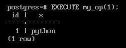

Если у запроса нет параметров, при подготовке запоминается и построенный план выполнения. 
Если же параметры есть, то их фактические значения принимаются во внимание при планировании. 
Через какое-то время (через 5 запросов) планировщик может построить общий план, 
построенный без учета параметров и, если он окажется не хуже, чем специальный, тогда перестанет выполнять планирование повторно.

Все подготовленные операторы текущего сеанса можно увидеть в представлении:

::

	SELECT * FROM pg_prepared_statements \gx
	
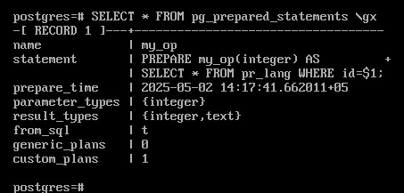
	
Выполните пять запросов, меняя значение параметра:

::

	EXECUTE my_op(1);
	EXECUTE my_op(2);
	EXECUTE my_op(3);
	EXECUTE my_op(4);
	EXECUTE my_op(5);

Проверьте подготовленный оператор:

::

	SELECT * FROM pg_prepared_statements \gx
	
Значение custom_plan = 5

Выполните еще раз

::

	EXECUTE my_op(1);
	SELECT * FROM pg_prepared_statements \gx
	
Появился общий план:

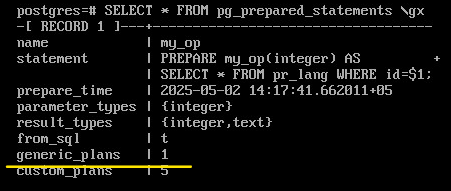
	
Курсоры
********

Курсоры - это специальные объекты, которые позволяют управлять выборкой данных из базы данных.
Они работают как указатели, перемещаемые по строкам результата, что особенно полезно при работе с большими наборами данных,
которые необходимо обрабатывать либо построчно, например, в процедурном коде приложения.

Курсор это всегда подготовленный оператор, поэтому он проходит те же этапы, запрос подготавливается, 
происходит привязка параметров, при наличии параметров, запрос планируется и выполняется. 
Но получение результата выполняется отдельной операцией, то есть происходит обращение к серверу всякий раз, когда требуется очередная 
порция данных.

Курсор можно рассматривать как окно, в котором видна только часть из множества результатов. 
При получении строки данных окно сдвигается. 
Иными словами, курсоры позволяют работатьс реляционными данными (множествами) итеративно, 
строка за строкой. Открытый курсор представлен на сервере так называемым порталом. 

https://postgrespro.ru/docs/postgresql/16/sql-declare

https://postgrespro.ru/docs/postgresql/16/sql-fetch

Практика:
--------

**DECLARE**

DECLARE — определить курсор

СинтаксисЖ

DECLARE имя [ BINARY ] [ ASENSITIVE | INSENSITIVE ] [ [ NO ] SCROLL ]
    CURSOR [ { WITH | WITHOUT } HOLD ] FOR query
	
Описание:

Оператор DECLARE позволяет пользователю создавать курсоры, с помощью которых можно выбирать по очереди некоторое количество 
строк из результата большого запроса. Когда курсор создан, через него можно получать строки, применяя команду **FETCH**.

1. Подключиться к базе данный dvdrental:

::

	\c dvdrental
	
2. Посчитать количество строк в таблице actor:

::

	SELECT count(actor_id) FROM actor;

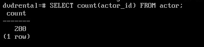

Таким образом, если написать запрос:

::

	SELECT * FROM actor;
	
то PostgreSQL вернет 200 строк.

3. Создать курсор:

Создавать курсор можно только в рамках транзакции:

::

	BEGIN;
	DECLARE c CURSOR FOR
	SELECT * FROM actor;
	FETCH 2 c;	
	
.. figure:: img/05_curs_02.png
       :scale: 100 %
       :align: center
       :alt: asda	

4. По окончании работы открытый курсор закрывают, освобождая ресурсы:

::

	CLOSE c;
	
Однако, курсор будет закрыт автоматически по окончании транзакции.

::

	COMMIT;
	
Если в команде объявления курсора не указано WITH HOLD, созданный ей курсор может использоваться только в текущей транзакции.
Если в объявлении курсора указано WITH HOLD и транзакция, создавшая курсор, успешно фиксируется, 
к этому курсору могут продолжать обращаться последующие транзакции в этом сеансе. 
(Но если создавшая курсор транзакция прерывается, курсор уничтожается.) 
Курсор со свойством WITH HOLD (удерживаемый) может быть закрыт явно, командой CLOSE, либо неявно, по завершении сеанса. 1

Процессы и память
=================

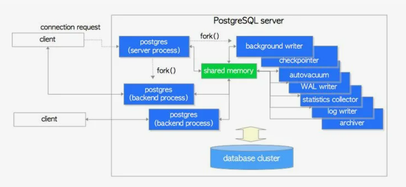

Совокупность нескольких процессов, которые совместно управляют кластером баз данных, обычно называют "сервером PostgreSQL".
 
Типы процессов:

**Основной процесс** - это **postgres server process**. Данный процесс является «родителем» для всех процессов, связанных с кластером, 
так как он порождает все остальные процессы и создает разделяемую память (shared memory). Традитционно называется **postmaster**.
Он запускает все остальные процессы (с помощью системного вызова fork в Unix) и «присматривает» за ними — 
если какой-нибудь процесс завершится аварийно, postmaster перезапустит его 
(или перезапустит весь сервер, если сочтет, что процесс мог повредить общие данные).

Чтобы процессы могли обмениваться информацией, postmaster выделяет общую память, доступ к которой могут получить все процессы.
Большую ее часть занимает **буферный кэш** (shared buffers), необходимый для ускорения
работы с данными на диске. Обращение к дискам происходит через операционную систему
(которая тоже кэширует данные в оперативной памяти). PostgreSQL полностью полагается на
операционную систему и сам не управляет устройствами. В частности, он считает, что вызов
fsync() гарантирует попадание данных из памяти на диск.
Кроме буферного кэша в общей памяти находится информация о блокировках и многое другое.ы

**Обслуживающие процессы**

Postmaster слушает входящие соединения. Для каждого вновь подключающегося клиента postmaster 
порождает обслуживающий процесс (backend), который обрабатывает все запросы и утверждения, отправленные подключенным клиентом.
Клиент общается уже с этим процессом. Обслуживающий процесс, в том числе, производит аутентификацию.
Он взаимодействует с клиентом через одно TCP-соединение и завершается, как только клиент отсоединяется.

Поскольку данный процесс может работать только с одной базой данных, при подключении к серверу PostgreSQL 
необходимо четко указать именно ту базу данных, которая необходима.

PostgreSQL позволяет подключаться сразу нескольким клиентам одновременно. 
Параметр конфигурации **max_connections** определяет максимальное количество одновременных подключений к БД 
(по умолчанию это 100 подключений).

Когда к серверу подключается много клиентов, для каждого из них порождается собственный обслуживающий процесс. 
При одновременной работе с какими-либо объектами приходится принимать меры, 
чтобы один процесс не поменял какие-либо данные в то время, пока с ними работает другой процесс. 
Для объектов в общей памяти используются короткоживущие блокировки, которые устанавливаются кратковременно 
на время работы процесса с какой-то структурой данных. И то же самое касается основных данных, в которых хранятся строки таблиц.

У каждого серверного процесса есть своя локальная память. В ней находится кэш каталога
(часто используемая информация о базе данных), планы запросов, рабочее пространство для
выполнения запросов, операций сортировок, создания хэш-таблици и другое. За это отвечает параметр **work_mem**

Каждый сеанс должен подготавливать запросы отдельно. 
У Postgres нет какого-то глобального кэша подготовленных операторов. Каждый сеанс делает это самостоятельно. 

**Различные фоновые процессы**

Выполняют задачи по управлению базой данных, такие как обработка VACUUM и CHECKPOINT;

.. tabularcolumns:: |p{3cm}|p{10cm}|

.. csv-table:: Процессы Postgres
	:file: _files/proc.csv
	:header-rows: 1
	:class: longtable
	:widths: 30, 70

Процессы, связанные с репликацией, выполняют потоковую репликацию.

Фоновые рабочие процессы, поддерживаемые в версии 9.3 и новее, могут выполнять любую обработку данных. 

Практика:

Отобразить процессы экземпляра сервера:

1. Получить глмер процесса:

::

	sudo cat /var/lib/pgsql/data/postmaster.pid

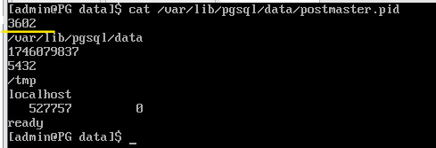

2. Вывести дочерние процессы сервера:

::

	ps -f --ppid 3602
	
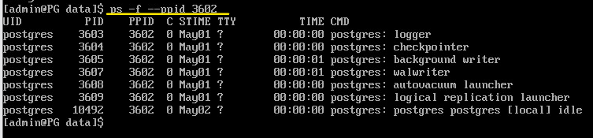

Когда к серверу подключается множество клиентов, то для каждого создается собственный обслуживающий процесс (backend).
Если клиентов не очень много и на всех хватает оперативной памяти,а соединения не происходят слишком часто, то проблем не возникает.
Тем не менее при одновременной работе с какими-либо объектами приходится принимать меры, 
чтобы один процесс не поменял какие-то данные в то время, пока с ними работает другой процесс. 
Для объектов в общей памяти используются короткоживущие *блокировки*. 

Но поскольку блокировки нужно удерживатьдо конца транзакций (то есть потенциально в течение длительного времени), 
из-за чего масштабируемость может пострадать при работе с таблицами, поскольку это сильно ограничивает возможности по распараллеливанию.
Поэтому PostgreSQL использует механизм **многоверсионности** 
(MVCC, multiversion concurrency control) и **изоляцию** на основе **снимков данных**: 
одни и те же данные могут одновременно существовать в разных версиях, 
а каждый процесс видит собственную (но всегда согласованную) картину данных. Данный механизм позволяет блокировать только те процессы, 
которые пытаются изменить данные, измененные, но еще не зафиксированные в другой транзакции (другим процессом). Многоверсионность — 
основной механизм, который обеспечивает первые три свойства транзакций (атомарность, согласованность, изоляция). 

Пулы соединений
===============

Пул соединений (Connection Pooling) в PostgreSQL — это стратегический подход к управлению соединениями, где вместо того, 
чтобы создавать новое соединение для каждого запроса, приложение использует уже открытые соединения, хранящиеся в специальном пуле.

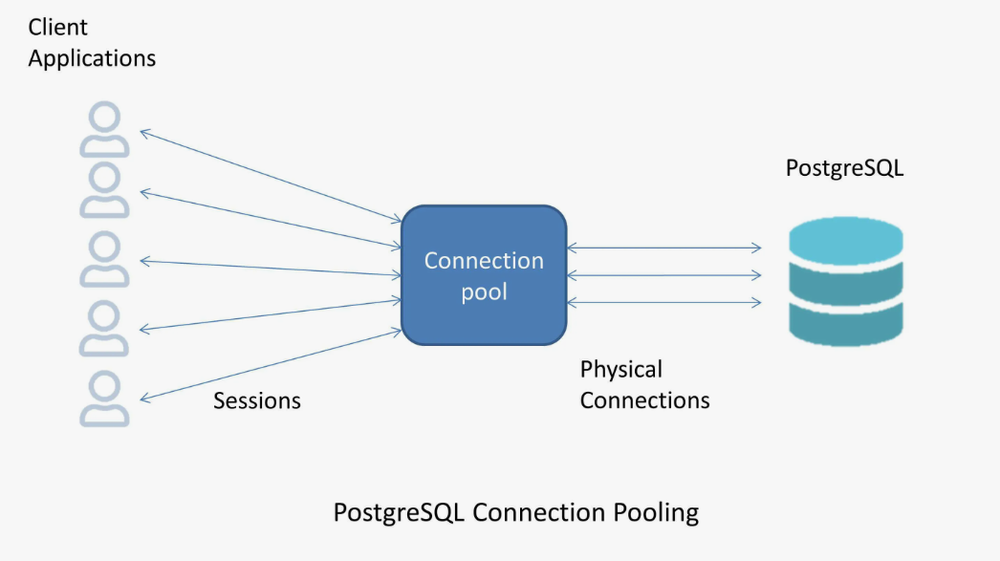

Имея классическую архитектуру "один процесс на соединение", PostgreSQL не очень хорошо справляется с большим (условно, больше 100) количеством соединений. 
Решить проблему позволяет пулер соединений под названием **PgBouncer**.
Клиенты подключаются не к самому серверу, а к пулу соединений, предполагая, что работа осуществляется напрямую с Postgres. 
PgBouncer может поддерживать большое количество (тысячи) соединений, 
которые проксируются на несколько (пара десятков) соединений непосредственно к PostgreSQL.
Клиентов может быть много, но одновременно посылают запросы не все одновременно: какое-то время простаивают, 
потому что происходит какая-то активность в самом клиенте, какие-то вычисления, ожидание ввода-вывода и т.д.
Одна из возможностей pgBouncer — временная приостановка обслуживания клиентов без разрыва соединения, которая может 
использоваться для обновления программного обеспечения сервера или других операций, 
требующих рестарта сервера.
 
При разработке приложений необходимо учитывать тот факт, что, например, подготовленные операторы находятся в локальной
памяти одного процесса, а через пул соединений выполнение запросов может осуществляться через разные процессы сервера.

Хранение данных
===============

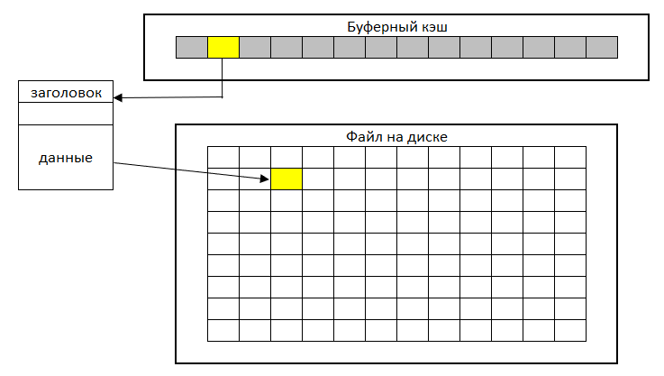

Данные хранятся на диске в файлах операционной системы. Обычно хранение осуществляется в каталоге PGDATA /var/lib/data.
Логически файлы разделены на страницы (блоки). Страница обычно имеет размер 8 Кбайт. При только при сборке сервера можно поменять
размер страницы (16, 32 Кб). Таким образом, собранный и запущенный кластер может работать со страницами только одного размера.
Каждая страниц имеет определенную структуру: заголовок и данные. Запись данных осуществляется от конца к началу.

Для обеспечения быстрой работы с данными, хранимыми на диске, доступ к которому долгий, в общей памяти сервера организован **буферный кэш**.
Буферный кеш представляет собой массив буферов, каждый буфер — это место под одну страницу данных. Чтобы работать с данными, процессы читают страницы в кеш, 
тем самым экономя на обращениях к диску. Доступ к нему имеют все процессы сервера, соответсвенно, к каждой странице таблиц доступ могут иметь все процессы.

Если данные в странице были изменены, то они записываются обратно на диск в базу данных отложенным способом с 
помощью отдельных механизмов PostgreSQL.

За размер буферного кэша в PostgreSQL отвечает параметр **shared_buffers**.

Взаимодействие PostgreSQL c диском осуществляется через оперативную память, у которой есть собственный кэш. Поэтому страница, не найденная
в буферном кэше может быть обнаружена в ОП. В отличие от других баз данных, PostgreSQL не обеспечивает прямой ввод-вывод. 
Это называется двойной буферизацией. За размер буферного кэша в PostgreSQL отвечает параметр **shared_buffers**, 
который является наиболее эффективным настраиваемым параметром для большинства операционных систем. 
Этот параметр устанавливает, сколько выделенной памяти будет использоваться PostgreSQL для кеширования.

Измененные данные, находящиеся в кэшэ могут быть утеряны в случае возникновения критической ситуации (сбоя, выключения).
По этой причине, в целях обеспечения целостности данных используется механизм записи в журнал предзаписи write-ahead-log (WAL)
