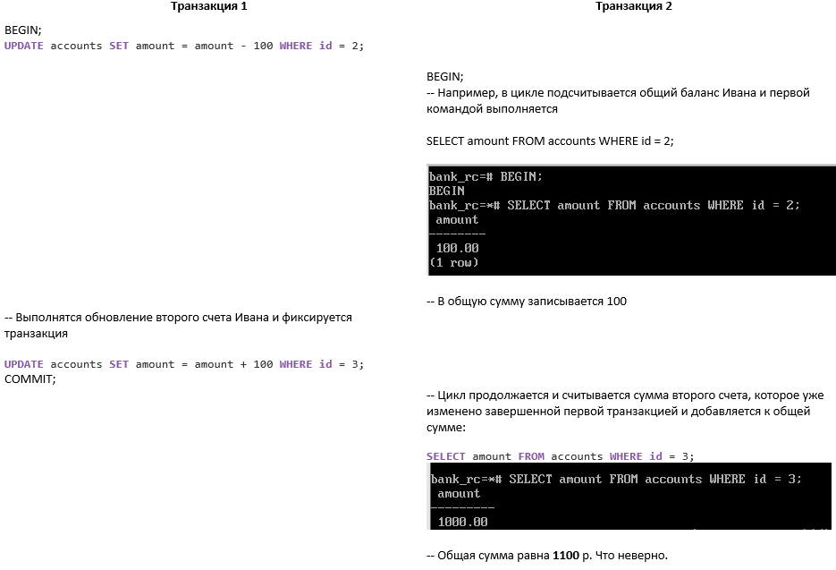

Изоляция
########

Введение
********

.. figure:: img/01_isol_00.png
       :scale: 100 %
       :align: center
       :alt: asda

Транзакция базы данных — это серия из одной или нескольких операций, выполняемых как единая атомарная единица работы. 
Это означает, что либо все операции в транзакции завершаются успешно, либо ни одна из них не применяется к базе данных.
Транзакции используются для обеспечения согласованности и целостности данных, гарантируя, 
что база данных останется согласованной даже в случае системных сбоев или ошибок.

При работе с нескольких приложений (клиентов) создаются разные сеансы работы и обрабатываться могут одновременно одни и те же строки.
То есть создаются транзакции, которые обрабатывают одну и ту же строку. 

Варианты:

- два процесса читают одну строчку одновременно;
- два процесса одновременно хотят изменить одну и туже строчку;
- один процесс читает строчку, а другой, в то же самое время, её изменяет.

В первом случае проблем не возникает. Несколько процессы могут одновременно читать одну и ту же строчку без всяких сложностей.

Для решения второй проблемы придумали **блокировки**. 
Процесс который начнет изменение строки ставит на ней блокировку. При этом второй процесс будет ждать пока первый не внесет свои изменения и не разблокирует эту строку.

В случае, когда одна транзакция меняет строку, а другая читает, то имеется два варианта:

- Блокировка. Пока данные не изменены и не зафиксированы читать данные нельзя или наоборот. Резко падает производительность.

- Грязное чтение. Данные внесены одной транзакцией, но не зафиксированы. А другая в это время уже может эти данные использовать. Но тогда страдает согласованность,
потому что данные могут быть отменены, а на их основе уже приняты какие-то решения.

Многоверсионность
==================

Для решения этой задачи Postgres использует **многоверсионность**. Суть заключается в следующем: любая строка может присутствовать в системе в 
нескольких версиях, и в тот момент, пока один процесс читает строку, он видит одну версию, а другой процесс может эту строку 
обновлять и создать новую версию этой же строки. Оба процесса не мешают друг другу. 
Один создет новую версию, а второй продолжает работать со старой, как будто бы второго процесса вообще не существует.

**Многоверсионность (multiversion concurrency control)** – один из возможных способов организации доступа к данным. 
Из четырех классических требований ACID к управлению транзакциями этот механизм имеет непосредственное отношение к *атомарности*
(транзакция либо выполняется полностью, либо полностью отменяется), *согласованности* (транзакция сохраняет целостность данных) 
и *изоляции*(одновременно выполняющиеся транзакции не должны влиять друг на друга).

Механизм состоит в поддержке на низком уровне одновременно нескольких версий данных. 
Транзакции не видят этого; каждая работает со *снимком*, который из многих версий составляет согласованную на определенный момент времени картину данных. 

.. figure:: img/01_isol_01.png
       :scale: 100 %
       :align: center
       :alt: asda
	   
Единицей многоверсионности служат строки таблиц. Табличный блок содержит набор версий строк (*tuples*), 
для каждой из которых хранятся номера двух транзакций: начальной (xmin) и конечной (xmax).

Для того, чтобы отличать одну версию от другой Postgres использует последовательные номера транзакций; эти номера и определяют порядок событий.

Номер транзакции (xid) является счетчиком, который представляет собой аналог часов. 
Каждая версия у нас характеризуется двумя числами:

- номером транзакции, породившей версию (xmin)

- номером транзакции, ее изменившей (xmax)

Основное преимущество использования модели MVCC по сравнению с блокированием заключается в том, 
что *блокировки MVCC, полученные для чтения данных, не конфликтуют с блокировками, полученными для записи*, 
и поэтому **чтение никогда не мешает записи, а запись чтению**. При правильном использовании MVCC обычно обеспечивает лучшую производительность, чем блокировки. 

Снимки данных
==============

Каждая транзакция работает с неким срезом данных, который называется *снимком данных*. 
Он представляет собой согласованную картину на определенный момент времени. 
Поскольку транзакция может обращаться к разным строкам, то нельзя ограничиваться одной версией, необходимо предоставить общую картину, 
которая будет согласованной, то есть корректной.

Транзакция всегда работает с определённым снимком данных. Снимок данных это не физическая копия всех данных на какой-то момент времени. Это несколько чисел, по которым Postgres может разобраться, 
какую из версий строк в этом снимке нужно показывать, а какую показывать не надо. 

То есть каждая транзакция *изолируется* от другой *на основе снимка данных*.
 
Снимок основывается на номере последней транзакции, зафиксированной в системе и на списке активных транзакций в этот момент времени. 
Список транзакций нужен, чтобы рассматривать только зафиксированные транзакции в этот момент времени и отбрасывать не зафиксированные 
или начатые после этой транзакции.

Другими словами транзакция должна видеть согласованные данные, которые другие транзакции уже успели зафиксировать. 
И не должна видеть изменения, которые другие транзакции успели произвести, но не успели зафиксировать. Изменений этих транзакций 
в снимке быть не должно, потому что будет несогласованная картина где-то там посередине транзакции. 
Но когда транзакция в какой-то момент будет зафиксирована, нужно эту транзакцию отличить от остальных зафиксированных 
транзакции и исключить ее изменения из текущего снимка, чтобы он не поменялся в процессе работы.

.. figure:: img/01_isol_02.png
       :scale: 100 %
       :align: center
       :alt: asda

На примере, отображенном на картинке в снимок попадают:

- Строка 1 имеет зафиксированную на момент **xid** версию. Эта версия и попадает в снимок.

- Строка 2 на этот момент обрабатывается какой-то незавершенной транзакцией, поэтому в снимок попадает та версия, 
которая была до возникновения этой незавершенной транзакции;

- Строка 3 удалена и поэтому не попадает в снимок.

Практика:
=========

Видимость версий строк

Изоляция
********

Каждая транзакция должна обладать свойствами ACID:

1. **Атомарность (Atomicity)**. Это свойство означает, что либо транзакция будет зафиксирована в базе данных полностью, т. е. будут 
зафиксированы результаты выполнения всех ее операций, либо не будет зафиксирована ни одна операция транзакции. 

2. **Согласованность (Consistency)**. Это свойство предписывает, чтобы в результате успешного выполнения транзакции база данных была 
переведена из одного согласованного состояния в другое согласованное состояние. 

3. **Изолированность (Isolation)**. Во время выполнения транзакции другие транзакции должны оказывать по возможности минимальное 
влияние на нее. 

4. **Долговечность (Durability)**. После успешной фиксации транзакции пользователь должен быть уверен, что данные надежно сохранены в 
базе данных и впоследствии могут быть извлечены из нее, независимо от последующих возможных сбоев в работе системы.

При работе приложения ответственность за *корректность* данных ложится именно на приложение, так как только разработчик может определить последовательность
операций, которые над данными выполняются. Таким образом, если последовательные операции, обеспечивающие корректность данных, осуществляются в рамках одной транзакции,
то СУБД берет на себя ответственность за их выполнение целиком либо невыполнение. Если эти операции выполнены, то обеспечивается и согласованность, то есть корректность состояния.

Но как только в системе появляется несколько одновременно работающих транзакций, абсолютно корректных поодиночке, 
совместно они могут работать некорректно. Это происходит из-за того, что перемешивается порядок выполнения операций: 
нельзя считать, что сначала выполняются все операции одной транзакции, а только потом — все операции другой. 

Возникает *конкурентное выполнение*, когда команды выполняются последовательно, в режиме разделения времени: 
столько-то тактов выполняется одна транзакция, столько тактов другая.

Ситуации, когда корректные транзакции некорректно работают вместе, называются **аномалиями одновременного выполнения**.

1. **Потерянное обновление (lost update)**. Когда разные транзакции одновременно изменяют одни и те же данные, то после фиксации 
изменений может оказаться, что одна транзакция перезаписала данные, обновленные и зафиксированные другой транзакцией. 

Например, две транзакции собираются изменить сумму на одном и том же счете на 100 ₽.

Первая транзакция читает текущее значение (1000 ₽), затем вторая транзакция читает то же значение.

Первая транзакция увеличивает сумму (получается 1100 ₽) и записывает это значение. 

Вторая транзакция уменьшает сумму — получает 900 ₽ и записывает их. 

Результат: клиент потерял 200 ₽.

Потерянное обновление не допускается стандартом ни на одном уровне изоляции.

2. **"Грязное" чтение (dirty read)**. Транзакция читает данные, измененные параллельной транзакцией, которая еще не завершилась. 
Если эта параллельная транзакция в итоге будет отменена, тогда окажется, что первая транзакция прочитала данные, которых нет в системе. 

Например, первая транзакция переводит **все** деньги со счета клиента на другой счет, но не фиксирует изменение. 
Другая транзакция читает состояние счета, получает 0 ₽ и отказывает клиенту в выдаче наличных — несмотря на то, 
что первая транзакция прерывается и отменяет свои изменения, так что значения 0 никогда не существовало в базе данных.

Грязное чтение допускается стандартом на уровне **Read Uncommitted**.

**Read Committed** не допускает "грязное" чтение.

3. **Неповторяющееся чтение (non-repeatable read)**. При повторном чтении тех же самых данных в рамках одной транзакции оказывается, 
что другая транзакция успела изменить и зафиксировать эти данные. В результате тот же самый запрос выдает другой результат, 
то есть первая транзакция получит разные результаты.

Например, пусть правило согласованности запрещает отрицательные суммы на счетах клиентов. 
Первая транзакция собирается уменьшить сумму на счете на 100 ₽. Она проверяет текущее значение, получает 1000 ₽ и решает, что уменьшение возможно. 

В это время вторая транзакция уменьшает сумму на счете до нуля и фиксирует изменения. 

Если бы теперь первая транзакция повторно проверила сумму, она получила бы 0 ₽ (но она уже приняла решение уменьшить значение, и счет "уходит в минус").

Неповторяющееся чтение допускается стандартом на уровнях **Read Uncommitted** и **Read Committed**. А вот грязное чтение Read Committed не допускает.

**Repeatable Read** не допускает неповторяющееся чтение.

4. **Фантомное чтение (phantom read)**. Транзакция выполняет повторную выборку множества строк в соответствии с одним и тем же критерием. 
В интервале времени между выполнением этих выборок другая транзакция добавляет новые строки и успешно фиксирует изменения. 
В результате при выполнении повторной выборки в первой транзакции может быть получено другое множество строк. 

Например, правило согласованности запрещает клиенту иметь более 3 счетов. 

Первая транзакция собирается открыть новый счет, проверяет их текущее количество (скажем, 2) и решает, что открытие возможно. 

В это время вторая транзакция тоже открывает клиенту новый счет и фиксирует изменения. 

Если бы теперь первая транзакция перепроверила количество, она получила бы 3 (но она уже выполняет открытие еще одного счета и у клиента их оказывается 4).

Фантомное чтение допускается стандартом на уровнях **Read Uncommitted**, **Read Committed** и **Repeatable Read**. 

5. **Аномалия сериализации (serialization anomaly)**. Результат успешной фиксации группы транзакций, выполняющихся параллельно, не 
совпадает с результатом ни одного из возможных вариантов упорядочения этих транзакций, если бы они выполнялись последовательно. 

Стандарт SQL определяет четыре уровня изоляции транзакций. Чем строже уровень, тем меньше влияния оказывают параллельно работающие транзакции друг на друга.

Также стандарт определяет особые условия, недопустимые для различных уровней изоляции:

Уровень **Serializable** должен предотвращать вообще все аномалии. 
Это означает, что на таком уровне разработчику приложения не надо думать об одновременном выполнении. 
Если транзакции выполняют корректные последовательности операторов, работая в одиночку, данные будут согласованы и 
при одновременной работе этих транзакций.

https://postgrespro.ru/docs/postgresql/16/transaction-iso

Read Committed
===============

Каждый следующий уровень изоляции строже, чем предыдущий. 

Уровень **Read Committed** должен предотвращать:

- потерянные изменения, но и еще одну аномалию:
- "Грязное" чтение (dirty read). Транзакция T1 может читать строки, измененные, но еще не зафиксированные, транзакцией T2. Отмена изменений (ROLLBACK) в T2 приведет к тому, что T1 прочитает данные, которых никогда не существовало.

Существует много других аномалий, которые допускаются на уровне Read Committed. 

Разработчик должен всегда помнить о возможных проблемах и при необходимости вручную использовать блокировки.

В PostgreSQL (как и во многих других СУБД) именно этот уровень изоляции используется по умолчанию — как компромисс между строгостью изоляции и 
эффективностью.

.. important:: Уровень изоляциия Read Committed **создает снимки на момент выполнения каждого оператора**, выполняемого в транзакции.
 
**Сериализация**  — процесс перевода структуры данных в битовую последовательность. 
Обратной к операции сериализации является операция десериализации (структуризации) — создание структуры данных из битовой последовательности.

Практика:
---------   

1. Уровень изоляции по умолчанию:

::

	SHOW default_transaction_isolation;
	
	default_transaction_isolation
	-----------------------------
	read_committed

2. Просмотр текущего уровня изоляции:

::

	BEGIN;
	SHOW transaction_isolation;
	

::

	transaction_isolation
	---------------------
	read_committed

Завершить транзакцию.

::

	COMMIT;

3. Создать БД "bank_rc" и подключиться к ней:

::

	CREATE DATABASE bank_rc;
	\c bank_rc
	
4. Cоздать таблицу счетов. 

Anna - 1 счет на 1000 ₽

Ivan - 2 счета на общую суму 1000 ₽:

::

	CREATE TABLE accounts(
		id integer PRIMARY KEY GENERATED BY DEFAULT AS IDENTITY,
		number text UNIQUE,
		client text,
		amount numeric
	);

::

	INSERT INTO accounts VALUES (1, '1001', 'anna', 1000.00), (2, '2001', 'ivan', 100.00), (3, '2002', 'ivan', 900.00);

::

	SELECT * FROM accounts;

.. figure:: img/01_isol_rc_01.png
       :scale: 100 %
       :align: center
       :alt: asda

5. Проверить отсутствие грязного чтения:

5.1) В первой транзакции снять со счета *anna* 100 р. без фиксации изменений и проверить состояние ее счета во второй транзакции:

::

	BEGIN;
	
	UPDATE accounts SET amount = amount - 100 WHERE id = 1;
	
	SELECT * FROM accounts WHERE client = 'anna';
	
Выполнить запрос во второй транзакции:

::

	| BEGIN;
	| SELECT * FROM accounts WHERE client = 'anna';
	
.. figure:: img/01_isol_rc_02.png
       :scale: 100 %
       :align: center
       :alt: asda

Транзакция 1 может видеть свои изменения.

Во второй транзакции изменения не видны. Грязное чтение не допускается.

Неповторяющееся чтение
^^^^^^^^^^^^^^^^^^^^^^

6. Проверить наличие неповторяющегося чтения:

6.1) Зафиксировать первую транзакцию:

::

	COMMIT;
	
6.2) Выполнить повторный запрос во второй транзакции:

::

	| SELECT * FROM accounts WHERE client = 'anna';

.. figure:: img/01_isol_rc_03.png
       :scale: 100 %
       :align: center
       :alt: asda
	   
Запрос получает новые данные — это и есть аномалия неповторяющегося чтения. То есть запрос тот же, что и до этого в данной транзакции,
но результат уже другой, не повторяется.

.. warinig:: В транзакции нельзя принимать решения на основании данных,  прочитанных предыдущим оператором — 
			 потому что за время между выполнением операторов все может измениться.
			 
Рекомендации:

- создавать не код проверки, а ограничения в рамках СУБД;

- использовать один SQL оператор;

- использовать пользовательские блокировки (в ущерб многоверсионности).

Несогласованное чтение
^^^^^^^^^^^^^^^^^^^^^^

Выполнить перевод средств с одного счета Ивана на другой:

.. tabularcolumns:: |p{10cm}|p{10cm}|

.. csv-table:: Несогласованное чтение 
	:file: _files/proc.csv
	:header-rows: 1
	:class: longtable
	:widths: 50, 50

	   
Таким образом вторая транзакция получила в сумме 1100 ₽, то есть некорректные данные. 
Это и есть аномалия несогласованного чтения.

Для решения данной аномалии можно использовать не подсчет суммы в цикле, а один оператор SQL:

::

	SELECT sum(amount) FROM accounts WHERE client = 'ivan';

При долгом выполнении запроса видимость данных не поменяется. То есть транзакция будет видеть те данные, которые 
существовали на момент создания запроса:

.. tabularcolumns:: |p{10cm}|p{10cm}|

.. csv-table:: Несогласованное чтение 
	:file: _files/proc1.csv
	:header-rows: 1
	:class: longtable
	:widths: 50, 50

	   
Оператор видит данные в таком состоянии, в котором они находились на момент начала его выполнения.

Однако, PostgreSQL позволяет определять функции, у которых есть понятие категории изменчивости. 

Если в запросе вызывается изменчивая функция (с категорией VOLATILE), и в этой функции выполняется другой запрос, 
то этот запрос внутри функции будет видеть данные, не согласованные с данными основного запроса.

**VOLATILE** в PostgreSQL — характеристика изменчивой функции, которая может возвращать различные результаты при нескольких вызовах с одинаковыми аргументами.
В запросе, использующем изменчивую функцию, она будет вычисляться заново для каждой строки, когда потребуется её результат.

**STABLE** — стабильная функция, которая не может модифицировать базу данных и гарантированно возвращает одинаковый результат, 
получая одинаковые аргументы, для всех строк в одном операторе. 

::

	CREATE FUNCTION get_amount(id integer) RETURNS numeric AS $$
	SELECT amount FROM accounts a WHERE a.id = get_amount.id;
	$$ VOLATILE LANGUAGE sql;

	   
Правильный вариант  — объявить функцию с категорией изменчивости stable.

::
	
	ALTER FUNCTION get_amount STABLE;

Выполнить команды, предыдущего примера.

Несогласованное чтение в обмен на потерянные изменения
^^^^^^^^^^^^^^^^^^^^^^^^^^^^^^^^^^^^^^^^^^^^^^^^^^^^^^

Может возникнуть, когда одна транзакция выполняет обновление данных после снятия блокировки со строк,
обновившихся в другой транзакции.

В одной транзакции уменьшить сумму счета, а в другой увеличить на 10% все счета, если суммарно их значение больше 1000.

.. tabularcolumns:: |p{10cm}|p{10cm}|

.. csv-table:: Несогласованное чтение 
	:file: _files/proc3.csv
	:header-rows: 1
	:class: longtable
	:widths: 50, 50

Выполнение оператора UPDATE состоит из двух частей:

- Сначала выполняется SELECT, который отбирает для обновления строки, соответствующие условию. Поскольку изменение первой транзакции не зафиксировано, 
вторая транзакция не может его видеть и оно никак не влияет на выбор строк для начисления процентов. 
Соответственно, счета Ивана попадают под условие и после выполнения обновления его баланс должен увеличиться на 10 ₽.

- Выбранные строки обновляются одна за другой. Сначала обновится строка с id=2, а так как строка id = 3 уже заблокирована первой транзакцией, то 
возникнет ожидание снятия блокировки с этой строки.

В это время первая транзакция завершает свою работу:

::

	COMMIT;
	
После снятия блокировки UPDATE перечитывает толко одну строку с id=3 и обновляет ее. Так как транзакция не должна потерять обновления, то процент начисляется на 
новое значение 900 р. Но если бы у Ивана было 900 ₽, его счета вообще не должны были попасть в выборку.

Итак, транзакция получает некорректные данные: часть строк видна на один момент времени, часть — на другой. 
Взамен потерянного обновления получена аномалия несогласованного чтения.

Repeatable Read
===============

Согласно стандарту, в дополнение к потерянным изменениями грязным чтениям уровень изоляции Repeatable Read должен предотвращать аномалию, 
которую мы видели, когда рассматривали уровень Read Committed:

- **Неповторяющееся чтение (non-repeatable read)**. После того как транзакция T1 прочитала строку, транзакция T2 изменила или удалила эту строку и зафиксировала изменения (COMMIT). При повторном чтении этой же строки транзакция T1 видит, что строка изменена или удалена.

- **Фантомное чтение (phantom read)**. Транзакция T1 прочитала набор строк по некоторому условию. Затем транзакция T2 добавила строки, также удовлетворяющие этому условию. Если транзакция T1 повторит запрос, она получит другую выборку строк

От уровня Read Committed этот уровень изоляции отличается и тем, что на нем *транзакция может быть оборвана, чтобы не допустить аномалию* (такую транзакцию надо повторять). 
На уровне Read Committed этого не происходит никогда — если стоит выбор между корректностью и эффективностью, предпочтение всегда отдается эффективности.

.. important:: Уровень изоляциия Repeatable Read **создает снимок на момент первого оператора** выполняемого в транзакции и сохраняет его до конца транзакции. 

Практика
--------

Отсутствие неповторяющегося и фантомного чтений
^^^^^^^^^^^^^^^^^^^^^^^^^^^^^^^^^^^^^^^^^^^^^^^

1. В первой транзакции восстановить суммы на счетах Ивана и добавить счет для Павла:

.. tabularcolumns:: |p{10cm}|p{10cm}|

.. csv-table:: Несогласованное чтение 
	:file: _files/proc4.csv
	:header-rows: 1
	:class: longtable
	:widths: 50, 50

Во второй транзакции не видны обновления счетов для Ивана и добавление строки для Павла.

Ошибка сериализации в обмен на потерянные изменения
^^^^^^^^^^^^^^^^^^^^^^^^^^^^^^^^^^^^^^^^^^^^^^^^^^^

При обновлении одной и той же строки двумя транзакциями на уровне Read Committed может возникнуть аномалия несогласованного чтения, так как 
ожидающая транзакция перечитывает заблокированную строку и, таким образом, видит ее на другой момент времени, по сравнению с остальными строками.

На уровне Repeatable Read такая аномалия не допускается, но, если она все-таки возникает, то происходит ошибка сериализации и транзакция обрывается.

Задача: Повторно в одной транзакции уменьшить сумму счета, а в другой увеличить на 10% все счета, если суммарно их значение больше 1000.

::

	SELECT * FROM accounts WHERE client = 'ivan';

.. tabularcolumns:: |p{10cm}|p{10cm}|

.. csv-table:: Ошибка сериализации  
	:file: _files/proc5.csv
	:header-rows: 1
	:class: longtable
	:widths: 50, 50

Данные остались согласованными:

	   
Такая же ошибка будет и в случае любого другого конкурентного изменения строки, даже если интересующие столбцы не изменились.

Если приложение использует уровень изоляции *Repeatable Read* для пишущих транзакций, 
оно должно быть *готово повторять транзакции*, завершившиеся ошибкой сериализации. Для только читающих транзакций такой исход невозможен.

Для Repeatable Read существует две возможные аномалии. 

Несогласованная запись
^^^^^^^^^^^^^^^^^^^^^^

В данном случае будет отсутствовать конкурентный доступ к строкам.

Допустим, существует правило согласованности: допускаются отрицательные суммы на счетах клиента, 
если общая сумма на всех счетах этого клиента остается неотрицательной.

1. Обе транзакции видят на счетах Ивана одну и ту же сумму: 900 ₽.

.. tabularcolumns:: |p{10cm}|p{10cm}|

.. csv-table:: Несогласованная запись 
	:file: _files/proc6.csv
	:header-rows: 1
	:class: longtable
	:widths: 50, 50
	

	   
В обоих случаях условие для возможности увести суммы счетов для Ивана в "минус" выполняются.
Каждая транзакция выполняет изменения в строках, но в разных:

.. tabularcolumns:: |p{10cm}|p{10cm}|

.. csv-table:: Несогласованная запись 
	:file: _files/proc7.csv
	:header-rows: 1
	:class: longtable
	:widths: 50, 50
	

Каждая транзакция отработала корректно, а результат неверный.

Аномалия только читающей транзакции
^^^^^^^^^^^^^^^^^^^^^^^^^^^^^^^^^^^

.. tabularcolumns:: |p{10cm}|p{10cm}|p{10cm}|

.. csv-table:: Несогласованная запись 
	:file: _files/proc8.csv
	:header-rows: 1
	:class: longtable
	:widths: 33, 33, 33

Что видит в данный момент каждая транзакция:

В силу того, что первая транзакция еще не завершилась, а вторая завершилась, то третья транзакция в момент выполнения первого оператора SELECT строит снимок
на основе **уже зафиксированных** транзакций, в число которых попала и транзакция 2. А значит, видит транзакция 3 тоже самое, что и транзакция 2.

Если первая транзакция завершит свою работу:

::

	COMMIT;
	
То выполнение повторного запроса в третьей транзакции не приведет ни к каким изменениям.

Уровень изоляции Serializable
=============================

Обеспечивает самую строгую изоляцию транзакций. На этом уровне моделируется *последовательное выполнение всех зафиксированных транзакций*, 
как если бы транзакции выполнялись одна за другой, последовательно, а не параллельно. 
Однако, как и на уровне Repeatable Read, на этом уровне приложения должны быть готовы повторять транзакции из-за сбоев сериализации. 
Фактически этот режим изоляции работает так же, как и Repeatable Read, только он дополнительно отслеживает условия, 
при которых результат параллельно выполняемых сериализуемых транзакций может не согласовываться с результатом этих же транзакций, выполняемых по очереди.
То есть те аномалии, которые возникают (несогласованная запись и аномалия только читающей транзакции), обнаруживаются и транзакция прерывается — 
возникает уже знакомая ошибка сериализации *could not serialize access*.

.. warinig:: если используется изоляция Serializable, то все транзакции в приложении должны использовать этот уровень. 
			 Нельзя смешивать транзакции Read Committed (или Repeatable Read) с Serializable.
			 

Несогласованная запись
^^^^^^^^^^^^^^^^^^^^^^^

Для демонстрации невозможности несогласованной записи нужно повторно выполнить пример для уменьшения сумм на разных счетах:

Суть в том, что если бы транзакции выполнялись параллельно, то уменьшились бы оба счета. А здесь в одной транзакции уменьшился один, а во второй другой. 
И при фиксации обеих транзакций состояние счетов разное. 

При проверке результата:

::

	SELECT * from accounts;
	
Обнаруживается изменение в строке с  id=3, а для строки id=2 нужно повторить транзакцию.

Приложение, использующее уровень изоляции Serializable, должно повторять транзакции, завершившиеся ошибкой сериализации, 
о чем нам сообщает и подсказка **HINT** в сообщении об ошибке.

Аномалия только читающей транзакции
^^^^^^^^^^^^^^^^^^^^^^^^^^^^^^^^^^^

Итоговая таблица
=================

.. figure:: img/01_isol_postrgres.png
       :scale: 100 %
       :align: center
       :alt: asda

В PostgreSQL названия уровней изоляции сохраняются, но реализация их строже, чем это требует стандарт.

В PostgreSQL используется изоляция на основе снимков данных (Snapshot Isolation) в сочетании с многоверсионностью. 

Это определяет следующие свойства:
- Грязное чтение не допускается вообще, причем без ущерба для производительности.

- Уровень Read Committed используется по умолчанию и применяется в большинстве систем. Зачастую он требует ручной установки блокировок, чтобы обеспечить корректность.

- Уровень Repeatable Read не допускает не только неповторяемое чтение, но и фантомное чтение (без обечпечения полной изоляции). 
  Этот уровень удобен для отчетов, поскольку позволяет  нескольким запросам видеть согласованные данные, а только читающие транзакции никогда не обрываются.

- Уровень Serializable также полностью реализован, но имеет определенные ограничения.

Дополнительно:

https://habr.com/ru/articles/815323/

Самостоятельно:
***************

1. Создайте пустую таблицу. Проверьте, что на уровне изоляции Read Committedне предотвращается аномалия фантомного чтения.

2. Откройте транзакцию с уровнем изоляции Repeatable Read(и пока не выполняйте в ней никаких команд).
В другом сеансе удалите строку из таблицы. Видна ли удаленная строка в открытой транзакции?
Будет ли видна удаленная строка, если после открытия транзакции выполнить запрос к базе данных, не обращаясь к таблицам?

3. Убедитесь, что команда DROP TABLE транзакционна.