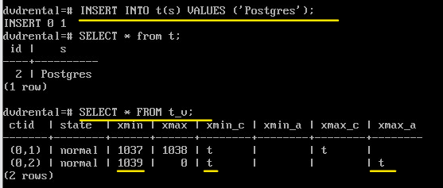
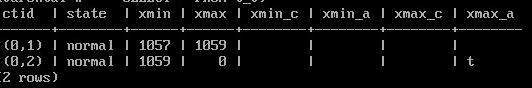

Строки. Версии строк
####################

Структура страницы
******************

Postgres имеет табличную организацию данных, которые хранятся в виде файлов на диске. Каждое отношение (relation) (таблица, индекс, последовательность) 
представлено файлами, состоящими из нескольких слоев. Каждый такой файл состоит из множества страниц по 8 КБ. И в каждой такой странице хранятся строки.
Каждая строка может быть представлена несколькими версиями, каждая из которых в тот или иной момент времени может быть использована механизмом 
многоверсионности для представления в снимке.

Структура страницы в общем виде может быть представлена следующим рисунком: 

Вначале страницы имеется заголовок, после него массив указателей на версии строк, и потом идут непосредственно данные, хранимые в версиях строк, 
которые заполняются от конца к началу.

Более подробная организация страницы представлена на следующем рисунке:

	   
- **Заголовок страницы** — 24 байта. Содержит общую информацию о странице.

- **Массив указателей строк**. Это массив указателей на отдельные строки (tuples) на странице. 
Каждый указатель (line pointer) занимает 4 байта и содержит:

	- смещение версии строки относительно начала страницы (15 бит);

	- статус версии строки (2 бита);

	- длину версии строки (15 бит).
	
Такая косвенная адресация удобна тем, что во-первых,  позволяет найти нужную строку, не перебирая все содержимое блока 
(строки имеют разную длину), а во-вторых, позволяет перемещать  строку внутри блока, не ломая ссылки из индексов.
 
- **Свободное пространство**. Свободное пространство между массивом указателей строк и данными строк. 
Используется для вставки новых строк или обновления существующих строк. Все свободное место всегда представлено одним фрагментом.

- **Данные строк**. Включая заголовки строк (tuple headers) и сами данные. Располагаются в конце, продвигаясь к началу.

- **Специальная область**. Расположена в противоположном конце страницы, в старших адресах. Она используется *некоторыми типами индексов* 
для хранения вспомогательной информации. В остальных случаях, в том числе в табличных страницах, эта область имеет нулевой размер.

Документация:

https://postgrespro.ru/docs/postgresql/16/storage-page-layout#PAGE-TABLE

По похожему принципу организованы и индексные страницы (B-tree индекс). 
Единственное отличие индексной страницы от табличной в том, что в конце индексной страницы для служебных целей присуствует специальная область.
В начале заголовок страницы, дальше массив указателей на индексные строки. 
А каждая индексная строка содержит ключ индексирования, индексируемое значение и ссылку на указатель табличной страницы, 
Для этого используются шестибайтные уникальные идентификаторы версии строки в таблице. (**tuple id, tid**).

**Tuple id** ссылается на номер указателя (**line pointer,linp**), а уже указатель — на текущую позицию версии строки (data) на странице:

Практика:
=========

Для подробного изучения структуры страницы предназначен модуль **pageinspect**.

::

	CREATE EXTENSION pageinspect;

Для считываения страницы (блока) из таблицы используется функция **get_raw_page**.

Функция get_raw_page считывает указанный блок именованного отношения и возвращает копию в виде значения bytea. 
Это позволяет получить согласованную по времени копию блока. 

Синтаксис:

::

	get_raw_page(relname text, blkno bigint) returns bytea

Документация:

https://www.postgresql.org/docs/current/pageinspect.html

Заголовок страницы
---------------------

Заголовок страницы располагается в младших адресах и имеет фиксированный размер 24 байта. 
Он хранит различную информацию. Посмотреть содержимое заголовка можно через команду **page_header**:

1. Выполнить просмотр заголовка 0-й страницы таблицы actor:

::

	\c dvdrental
	SELECT count(*) FROM actor;
	
Таблица содержит 200 строк.

::

	SELECT * FROM page_header(get_raw_page('actor',0));

	
Области занимают следующие диапазоны адресов:

- 0 — начало заголовка страницы и указатели на версии строк,
- lower — начало свободного места,
- upper — начало данных (версий строк),
- special — начало спец. данных (только для индексов),
- pagesize — конец страницы.

0 - 23 - заголовок страницы
24 - 255 - указатели (256 - 24) / 4 = 58 строк на странице
256 - 5144 - свободное место
5145 - 8192 - строки с данными.

2. Таблица занимает всего 16 КБ:

::

	SELECT pg_relation_size('actor');

Поэтому данная таблица содержить всего 2 страницы: нулевую и первую.

::
	
	SELECT * FROM page_header(get_raw_page('actor',1));
	
На второй странице 142 строки

Указатели на версии строк
-------------------------

Массив указателей (line pointer array) на версии строк служит оглавлением страницы. Он располагается сразу за заголовком.

Каждый указатель (занимающий 4 байта) содержит:

- ссылку на версию строки;

- длину этой версии строки (для удобства);

- несколько бит, определяющих статус версии строки.

Структура версий строк
======================

Каждая версия строки всегда целиком помещается внутрь одной страницы. 
Если версия строки имеет большой размер, PostgreSQL попробует сжать часть полей или вынести часть полей во внешнее TOAST-хранилище.
PostgreSQL старается поместить на страницу минимум 4 строки, то есть максимальная строка может содержать 2000 байт.

Кроме непосредственно данных, каждая версия строки тоже имеет заголовок. 

Заголовок имеет размер 23 байта, но в силу выравнивания по границе 8 байт он увеличен до 24. Дополнительный байт отведен под t_bits.

Заголовок версии содержит множество полей, среди которых:

- xmin, xmax — номера транзакций, которые отличают данную версию от других версий той же строки. Номера транзакций (TransactionId или xid) последовательно 
выбираются для транзакций из глобального счетчика, который используется всеми базами данных в рамках кластера PostgreSQL

- infomask — ряд информационных битов, определяющих свойства версии;

- ctid — ссылка на следующую, более новую версию той же строки;

- t_bits - битовая карта неопределенных значений — массив битов, отмечающих столбцы, которые допускают неопределенные значения (NULL).

Функция **heap_page_items** показывает все указатели линейных блоков на странице кучи (страницы). Для используемых блоков также выводятся заголовки кортежей (tuples). 
При этом показываются все кортежи, независимо от того, были ли видны они в снимке MVCC в момент копирования исходной страницы.

::

	SELECT * FROM heap_page_items(get_raw_page('actor', 0)) \gx
	

Если предстваить в графическом виде, то получается картинка:

- указатель *lp* с номером 1, ссылающийся на первую версию строки.

- состояние указателя *lp_flags* = 1. Это значение normal — это значит, что указатель действительно ссылается на версию строки.

- *t_xmin* в версии строки заполнено номером транзакции, создавшей версию. Транзакция зафиксирована, поэтому биты xmin_committed и xmin_aborted установлены.

- Поле *t_xmax* заполнено фиктивным номером 0, поскольку данная версия строки не удалена и является актуальной. 
Транзакции не будут обращать внимания на этот номер, поскольку установлен бит *xmax_aborted*.

- Биты *xmin_committed* и *xmin_aborted* показывают, зафиксирована ли и отменена ли транзакция с номером xmin. 
Аналогичную информацию о транзакции xmax дают биты *xmax_committed* и *xmax_aborted*.

- ctid - указывает сам на себя, то есть версия строки актуальная. Если бы строка была обновлена, то появилась бы новая версия, на которую бы указывал этот указатель.

Формат данных
-------------

Формат данных на диске полностью совпадает с представлением данных в оперативной памяти. 
При извлечении из файла, данные считываются в буферный кэш как есть. Поэтому файлы данных с одной платформы оказываются несовместимыми с другими платформами
Причин несовместимости может быть несколько. Например, порядок следования байтов. В архитектуре x86 принят порядок от младших разрядов к старшим (little-endian), 
z/Architecture использует обратный порядок (big-endian), а в ARM порядок переключаемый.

Несовместимость вызывается также выравниванием данных по границам машинных слов, которое требуется многим архитектурам. 
Например, в 32-битной системе архитектуры x86 целые числа будут выровнены по границе четырехбайтных слов, 
как и числа с плавающей точкой двойной точности. А в 64-битной системе значения double будут выровнены по границе восьмибайтных слов.

Из-за выравнивания размер табличной строки зависит от порядка расположения полей. И в некоторых случаях он может привести к существенному увеличению размера.

Операции над версиями строк
**************************************

Операции над версиями строк выполняются в транзакциях. Чтобы одну версию отличать от другой каждая из версий имеет две отметки, 

Когда строка создается, значение xmin устанавливается равным номеру транзакции, выполнившей команду INSERT.

Когда строка удаляется, значению xmax текущей версии присваивается номер транзакции, выполнившей команду DELETE.

Команду UPDATE можно в некотором приближении рассматривать как две операции: DELETE и INSERT. Точно так же и команда MERGE «распадается» на элементарные вставки и удаления.

Появление и результат работы каждой транзакции отображается в специальной структуре **CLOG**. 
Для каждой транзакции отведено два бита (committed и aborted). Эти данные хранятся в каталоге PGDATA/pg_xact, а несколько наиболее актуальных страниц 
кешируются в разделяемой памяти сервера.

::

	CREATE TABLE t(id integer GENERATED ALWAYS AS IDENTITY, s text);
	CREATE INDEX ON t(s);

Вставка строк:
---------------

1. Начать транзакцию, вставить строку и проверить номер транзакции:

::

	BEGIN;
	INSERT INTO t(s) VALUES('FOO');

::

	SELECT pg_current_xact_id();

	
Счетчик номеров транзакций один на весь кластер.

В структуре CLOG создается запись для транзакции и, поскольку она еще не завершена, для нее сброшены оба бита

	

2. Исследовать заголовок добавленной строки:

Так как добавлена всего одна запись, то она гарантированно помещается в начальную страницу, которая имеет номер 0.

::

	SELECT * FROM heap_page_items(get_raw_page('t', 0)) \gx

	   
- указатель *lp* с номером 1, ссылающийся на первую версию строки.

- состояние указателя *lp_flags* = 1. Это значение normal — это значит, что указатель действительно ссылается на версию строки.

- *t_xmin* в версии строки заполнено номером транзакции, создавшей версию (1026). Транзакция **не зафиксирована**, 
поэтому биты xmin_committed и xmin_aborted не установлены.

- Поле *t_xmax* заполнено фиктивным номером 0, поскольку данная версия строки не удалена и является актуальной. 
Транзакции не будут обращать внимания на этот номер, поскольку установлен бит *xmax_aborted*.

- ctid - указывает сам на себя, то есть версия строки актуальная. Если бы строка была обновлена, то появилась бы новая версия, на которую бы указывал этот указатель.

3. Исследовать страницу индекса:

Дляобращения к индексу данной таблицы используем функцию: **bt_page_items();**. В нулевой странице содержится метаинформация, поэтому смотреть надо с первой.

::

	SELECT itemoffset, ctid FROM bt_page_items('t_s_idx',1);
	
В индексной странице видим один указатель на единственную строку таблицы:

.. figure:: img/02_string_page_12.png
       :scale: 100 %
       :align: center
       :alt: asda
	   
Фиксация транзакции
---------------------

При успешном завершении транзакции запоминается ее статус в CLOG (commit log) - выставляется бит **committed** для данной транзакции. 

::

	COMMIT;

Когда какая-либо другая транзакция обратится к этой табличной странице, 
ей придется ответить на вопросы:

1) завершилась ли транзакция 1026 (надо проверить список активных  транзакций — такая структура поддерживается в общей памяти сервера),

2) а если завершилась, то фиксацией или отменой (свериться с CLOG).

Не смотря на то, что последние страницы clog сохраняются в буферах в оперативной памяти, все равно такую проверку накладно выполнять каждый раз. 

Поэтому первый запрос к данной версии строки вынужден будет обратиться к CLOG за разъяснениями. Однажды выясненный статус транзакции записывается 
в заголовок версии строки в информационные *биты-подсказки (hint bits)* *xmin_committed* или *xmin_aborted*.
Если один из этих битов установлен, то состояние транзакции xmin считается известным, и следующей транзакции уже не придется обращаться ни к clog, ни к ProcArray

В момент, когда транзакция фиксируется или отменяется, уже непонятно, какие именно строки в каких именно страницах транзакция успела поменять. 
Кроме того, часть этих страниц может быть вытеснена из буферного кеша на диск; читать их заново, 
чтобы изменить биты, означало бы существенно замедлить фиксацию. Поэтому эти биты не устанавливаются сразу той транзакцией, которая выполняла вставку. 
Обратная сторона состоит в том, что любая транзакция (даже выполняющая простое чтение — SELECT) может выполнять запись, а значит, 
загрязнить данныев буферном кеше и породить новые журнальные записи.	

::
	
	SELECT * FROM heap_page_items(get_raw_page('t', 0)) \gx

Никаких изменений не произошло.

А вот статус транзакции в CLOG изменился:

::

	SELECT pg_xact_status('1026');

Транзакция, первой обратившаяся к странице, должна будет определить статус транзакции **xmin**. Этот статус будет записан в информационные биты:

::

	SELECT * FROM t;

::

	SELECT * FROM heap_page_items(get_raw_page('t', 0)) \gx

Для более удобного просмотра информации создадим представление, которое с помощью расширения pageinspect покажет интересующую нас 
информацию о версиях строк из нулевой страницы таблицы:

::

	CREATE VIEW t_v AS
	SELECT '(0,'||lp||')' AS ctid,
	   CASE lp_flags
		 WHEN 0 THEN 'unused'
		 WHEN 1 THEN 'normal'
		 WHEN 2 THEN 'redirect to '||lp_off
		 WHEN 3 THEN 'dead'
	   END AS state,
	   t_xmin as xmin,
	   t_xmax as xmax,
	   CASE WHEN (t_infomask & 256) > 0  THEN 't' END AS xmin_c,
	   CASE WHEN (t_infomask & 512) > 0  THEN 't' END AS xmin_a,
	   CASE WHEN (t_infomask & 1024) > 0 THEN 't' END AS xmax_c,
	   CASE WHEN (t_infomask & 2048) > 0 THEN 't' END AS xmax_a
	FROM heap_page_items(get_raw_page('t',0))
	ORDER BY lp;

::

	SELECT * FROM t_v;

Содержимое страницы:

Удаление строки
==================

При удалении строки в поле **t_xmax** актуальной версии записывается номер удаляющей транзакции, а бит **xmax_aborted** сбрасывается.

Это же значение **xmax**, соответствующее активной транзакции, выступает в качестве блокировки строки. 
Если другая транзакция собирается обновить или удалить эту строку, она будет вынуждена дождаться завершения транзакции xmax.

::

	BEGIN;
	DELETE FROM t;

::

	SELECT * FROM t_v;

 ctid  | state  | xmin | xmax | xmin_c | xmin_a | xmax_c | xmax_a 
-------+--------+------+------+--------+--------+--------+--------
 (0,1) | normal |  749 |  750 | t      |        |        | 
(1 row)

::

	COMMIT;
	
При фиксации удаления в CLOG для удалившей транзакции проставляется *committed*.
При выполнении дольнейшего обрашения к таблице проставляются следующие биты-подсказки:

::

	SELECT * FROM t;
	
::

	SELECT * FROM t_v;

Так как xmax_c проставлен, соответственно данная версия строки изменена (удалена) и она не будет больше попадать в снимки транзакций.
Так как транзакция удаляла версию и нового ничего не появлялось, то ее номер (1038) проставлен только в xmax.

При очистке данная версия будет помечена как **unused** и в последствии на ее место будет записано что-то другое.

В целом, схема может ыть представлена следующим образом:

Отмена изменений
================

1. Добавить новую строку:

::

	INSERT INTO t(s) VALUES ('Postgres');
	
::

	SELECT * FROM t;
	
::

	SELECT * FROM t_v;
	
Транзакция 1039 добавила новую версию строки.

2. Начать транзакцию и снова удалить строку:

::

	BEGIN;
	DELETE FROM t;
	SELECT * FROM t_v;
	

В xmax появляется номер удаляющей транзакции и снимается бит xmax_a (aborted).

3. Теперь выполнить откат (ROLLBACK);

::

	ROLLBACK;
	
Отмена изменений работает аналогично фиксации, только в CLOG для транзакции выставляется бит aborted. 

4. Выполнить запрос к таблице t для проставления битов-подсказок:

::

	SELECT * FROM t;
	
::

	SELECT * FROM t_v;
	

Отмена выполняется так же быстро, как и фиксация — не требуется выполнять откат выполненных действий.
Номер прерванной (в данном случае удаляющей) транзакции остается в поле xmax. 
При обращении к странице будет проверен статус и в версию строки будет установлен бит подсказки xmax aborted. Это будет означать, что на поле xmax смотреть не нужно

Выглядит это примерно так:

Обновление
==========

::

	BEGIN;
	UPDATE t SET s = 'BAR';
	
	SELECT * FROM t_v;

Обновление работает так, как будто сначала выполнялось удаление старой версии строки, 
а затем вставка новой. Старая версия помечается номером текущей транзакции в поле xmax.	

Новое значение 1043 записалось поверх старого 1042, так как транзакция 1042 была отменена. 
Так же, как и при удалении, значение xmax в первой версии строки служит признаком того, что строка заблокирована.
Кроме того, биты xmax committed и xmax aborted старой версии строки сброшены, так как статус текущей транзакции еще не известен.

::

	COMMIT;
	
	SELECT * FROM t;
	
	SELECT * FROM t_v;
	

При этом в индексной странице обнаруживаем указатели на все версии:

::

	SELECT itemoffset, ctid FROM bt_page_items('t_s_idx',1);

При выводе содержимого заголовков версий строк можно увидеть, что в поле ctid второй версии теперь проставленна ссылка на новую версию (0,3)

::

	SELECT * FROM heap_page_items(get_raw_page('t', 0)) \gx

.. figure:: img/02_string_page_22.png
       :scale: 100 %
       :align: center
       :alt: asda

Точки сохранения и вложенные транзакции
=======================================

Вложенные транзакции это механизм который обеспечивает работу так называемых операторов точки сохранения, позволяющий отменить часть операций текущей транзакции. 
Так как физически никакие данные не откатываются, а лишь изменяется статус всей транзакции целиком, то это не укладывается в приведенную выше схему. 

Для этого транзакция с точкой сохранения разбивается на несколько вложенных транзакций (subtransaction), статусом которых можно управлять отдельно.

Внутри транзакции, выполняются какие-то действия:

- например insert, 

- потом устанавливается save point (точка сохранения), 

- потом опять insert

- выполняется rollback to save point, при этом отменяются только те действия, которые были до точки сохранения, 

- далее опять insert, 

- и в конце завершение общей транзакции

Если подтранзакции присваивается невиртуальный идентификатор, его называют **subxid**. 
Значение **xid** родительской транзакции всегда будет меньше значений **subxid** подтранзакций.

Подтранзакции могут фиксироваться или прерываться, не влияя на родительские транзакции, которые, соответственно, могут продолжать выполняться.

Информация о вложенности транзакций хранится в каталоге **PGDATA/pg_subtrans**. 
Обращение к файлам происходит через буферыв общей памяти сервера, организованные так же, как и буферы CLOG.

Идентификатор непосредственного родителя каждой подтранзакции записывается в каталог pg_subtrans. Идентификаторы транзакций верхнего уровня не записываются, поскольку у них нет родителя. Также не записываются и идентификаторы подтранзакций в режиме только чтения.

Статус вложенных транзакций записывается в clog обычным образом, но зафиксированные вложенные транзакции одновременно отмечаются двумя битами, committed и aborted - 11.

При фиксации транзакции верхнего уровня с xid зафиксированные подтранзакции записываются как зафиксированные в подкаталоге pg_xact. 
При прерывании транзакции верхнего уровня все её подтранзакции также прерываются.

Опустошим таблицу (при этом опустошаются файлы таблицы и индекса):

::

	TRUNCATE t;

Начинаем транзакцию и вставляем строку.

::

	BEGIN;
	INSERT INTO t(s) VALUES ('foo') RETURNING *, ctid, xmin, xmax;
	

Поставить точку сохранения и удалить строку:

::

	SAVEPOINT sp;
	DELETE FROM t RETURNING *, ctid, xmin, xmax;
 

Обратите внимание: функция pg_current_xact_id() выдает номер основной, а не вложенной, транзакции:

::

	SELECT pg_current_xact_id();

Откатимся к точке сохранения. Версии строк в странице остаются на месте, но изменится статус вложенной транзакции:

::

	ROLLBACK TO sp;

::
	SELECT pg_xact_status('753') xid, pg_xact_status('754') subxid;

	
Запрос к таблице снова покажет строку — ее удаление было отменено:

::

	SELECT *, ctid, xmin, xmax FROM t;
	
.. figure:: img/02_string_page_26.png
       :scale: 100 %
       :align: center
       :alt: asda

Для дальнейших изменений создается новая вложенная транзакция. 
Ее номер будет записан в поле xmax первой версии строки вместо номера отмененной вложенной транзакции 754 и в поле xmin новой версии:

::

	UPDATE t SET s='bar';
	SELECT *, ctid, xmin, xmax FROM t;
	

	
::
	SELECT pg_xact_status('1057') xid,
    pg_xact_status('1058') subxid1,
    pg_xact_status('1059') subxid2;

	

Зафиксировать изменения. При этом в таблице, как и прежде, ничего не меняется:

::

	COMMIT;
    SELECT * FROM t_v;

	

А в CLOG основная транзакция и все вложенные, которые еще не завершены, получают статус committed:

::
	SELECT pg_xact_status('1057') xid,
    pg_xact_status('1058') subxid1,
    pg_xact_status('1059') subxid2;
	
	

Информация о вложенности транзакций хранится в подкаталоге pg_subtrans каталога PGDATA. Она кешируется в общей памяти, как и информация о статусах транзакций:

::

	SELECT name, blks_hit, blks_read, blks_written
	FROM pg_stat_slru WHERE name = 'Subtrans';

**blks_hit**  - cколько раз дисковые блоки обнаруживались в буферном кеше, 
так что чтение с диска не потребовалось (в значение входят только случаи обнаружения в буферном кеше PostgreSQL, а не в кеше файловой системы ОС)

**blks_written** - Количество дисковых блоков, записанных из этого SLRU-кеша

Применение механизма вложенных транзаций:

- при ручном создании точек сохранения;

- в приложениях, когда создается блок обработки исключительых ситуаций *EXCEPTION*. *Save point* создается сразу при входе в блок. При возникновении исключительной
ситуации идет откат к этой точке сохранения. В данном случае счетчик транзакций быстро растет

- режим **ON_ERROR_ROLLBACK** в psql, при включении которого транзакция, выполнившая ошибочную операцию, не прерывается, а продолжает работать. 
Данный режим не включен по умолчанию. Дело в том, что ошибка может произойти где-то в середине выполнения оператора, 
и таким образом нарушится атомарность выполнения оператора. 
Единственный способ отменить  изменения, уже сделанные этим оператором, не трогая остальные изменения — использовать вложенные транзакции. 
Поэтому режим ON_ERROR_ROLLBACK фактически ставит перед каждой командой неявную точку сохранения, что повышает накладные расходы.

Дополнительно:
==============

Хранение пустых значений в Postgres:

https://habr.com/ru/articles/890718/

Самостоятельно
**************

1. Создайте таблицу и вставьте в нее одну строку. Затем дважды обновите эту строку и удалите ее. 
Сколько версий строк находится сейчас в таблице? Проверьте, используя расширение pageinspect.

2. Определите, в какой странице находится строка таблицы pg_class, относящаяся к самой таблице pg_class. 
Сколько актуальных версий строк находится в той же странице?

3. Включите в psql параметр ON_ERROR_ROLLBACKи убедитесь, что этот режим использует вложенные транзакции.