Снимки данных
####################

PostgreSQL предоставляет разработчикам богатый набор средств для управления конкурентным доступом к данным. 
Внутри он поддерживает целостность данных, реализуя модель **MVCC** (*Multiversion Concurrency Control*, Многоверсионное управление конкурентным доступом). 
Это означает, что каждый SQL-оператор видит *снимок данных* (версию базы данных) на определённый момент времени, 
вне зависимости от текущего состояния данных. Это защищает операторы от несогласованности данных, возможной, если другие конкурирующие транзакции внесут 
изменения в те же строки данных, и обеспечивает тем самым изоляцию транзакций для каждого сеанса баз данных. MVCC, отходя от методик блокирования, 
принятых в традиционных СУБД, снижает уровень конфликтов блокировок и таким образом обеспечивает более высокую производительность в многопользовательской среде.

Данные таблиц хранятся в файлах, каждый из которых разбит на страницы по 8 Кб. В свою очередь на каждой странице может содержаться несколько версий одной и той же строки.
Для того чтобы транзакции могли определить, с какой именно версией им необходимо работать исползуется **снимок данных**, который определяет, 
какие версии должны быть видны, а какие — нет, чтобы обеспечить согласованную картину данных на определенный момент времени. В снимке данных видны только 
зафиксированные на момент построения этого снимка данных версии строк.

Это полностью исключает аномалию грязного чтения на любом  уровне изоляции.

На уровне изоляции **Read Committed** снимок создается **в начале каждого оператора** транзакции. 
Такой снимок активен, пока выполняется оператор. 

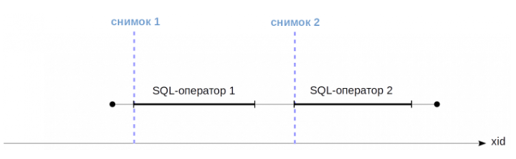

На уровнях **Repeatable Read** и **Serializable** снимок создается один раз **в начале первого оператора транзакции**. 
Такой снимок остается активным до самого конца транзакции.

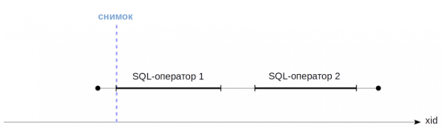
	   
Видимость строк
***************

Из всего многообразия версий строк требуется выбрать те, которые необходимы в данный момнент. Для этого нужно правила, которые называются  *правила видимости*. 
За это отвечают два параметра в заголовке строки: **xmin** и **xmax**

Версия строки видна, когда в снимке видны изменения, сделанные транзакцией *xmin* (транзакция зафиксирована), и не видны изменения, 
сделанные транзакцией *xmax* (версия строки появилась, но еще не видно, что она удалена или изменена).

Каждая транзакция видит изменения, сделанные ей самой еще до фиксации.

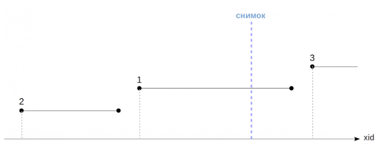
	   
На данном рисунке:

- изменения транзакции 2 будут видны, потому что она завершились до создания снимка,

- изменения транзакции 1 не будут видны, потому что она была активна на момент создания снимка. Она началась до создания снимка и в 
момент его создания работала. В ней что-то происходило, возможно, были ROLLBACK-и. Поэтому изменения внурти нее просто игнорируются.

- изменения транзакции 3 не будут видны, потому что она начались позже создания снимка (ее статус не важен).

Момент (время) фиксации транзакций неизвестен системе. Известен только момент ее начала (он определяется номером транзакции и отмечен на рисунках пунктирной линией), 
но факт завершения нигде не записывается.

Можно лишь узнать текущий статус транзакций при создании снимка. То есть после фиксации уже нет возможности выяснить, какая традиция была активна в момент создания снимка.
Эта информация есть в общей памяти сервера в структуре *ProcArray,* которая содержит список всех активных сеансов и их транзакций.
Поэтому список всех текущих активных транзакций приходится запоминать в снимке.

В PostgreSQL нельзя создать снимок, показывающий согласованные данные в прошлом (например, минут назад), 
даже если все необходимые для этого версии строк существуют в табличных страницах. 

Снимок **не является физической копией** всех необходимых версий строк. Он задается несколькими числами:

- **xmin** — нижняя граница снимка, в качестве которой выступает номер самой ранней активной транзакции.
Все транзакции с меньшими номерами либо зафиксированы, и тогда их изменения безусловно видны в снимке, либо отменены, и тогда изменения игнорируются. 

- **xmax** — верхняя граница снимка, в качестве которой берется номер, *следующий* за номером **последней зафиксированной** транзакции. 
Верхняя граница определяет момент, в который был сделан снимок, который задается увеличивающимися номерами транзакций.
Все транзакции с номерами, большими или равными xmax, в момент создания снимка заведомо не были зафиксированы — они либо были активны, либо 
отменены, либо еще не начались;

- **xip_list** (*xid-in-progress list*) — список активных транзакций. Этот список используется для того, чтобы не учитывать в снимке изменения транзакций, 
которые уже завершились, но в момент создания снимка еще были активны.

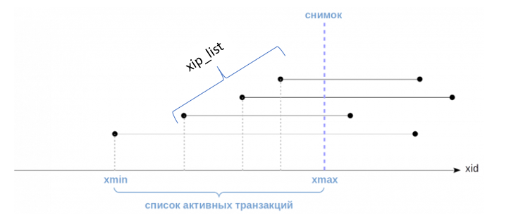

Пример:
=======

1. Перейти в БД bank_rc и опустощить таблицу accounts:

::
	
	\c bank_rc
	TRUNCATE accounts;
	
2. Начать три транзакции, в каждой из которых добавить одну строку:

- первая добавлена транзакцией, которая началась до создания снимка (T1), но завершилась позже,

- вторая добавлена транзакцией, которая началась и завершилась до создания снимка (T2),

- третья была добавлена уже после создания снимка (T3).

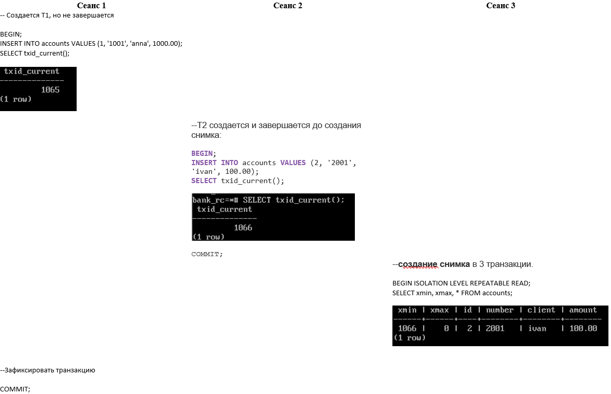

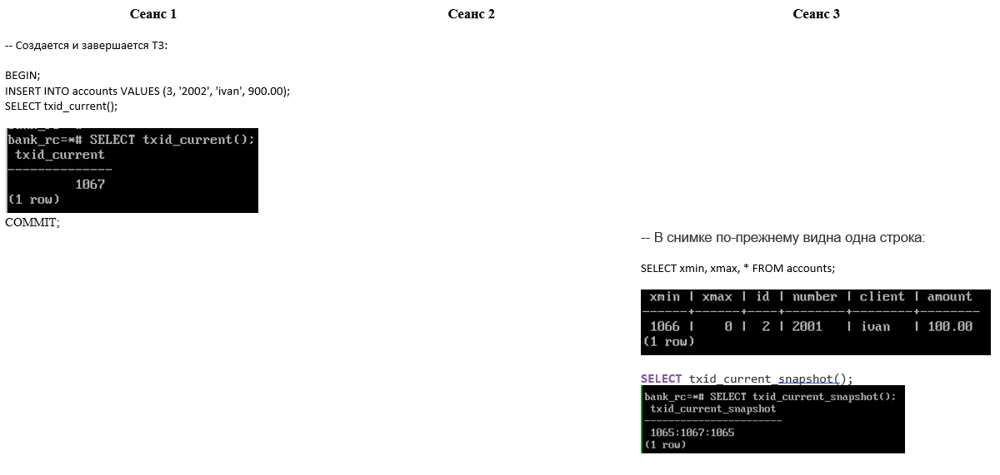

PostgreSQL понимает это следующим образом:

Для просмотра текущего снимка данных транзакции есть специальная функция: **txid_current_snapshot**.

3. В  третьем сеансе выполнить функцию:

::

	SELECT txid_current_snapshot();

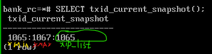

Здесь через двоеточие перечислены *snapshot.xmin*, *snapshot.xmax* и *snapshot.xip* (в данном случае один номер, но в общем — список).

По сформулированным выше правилам, в снимке должны быть видны изменения, сделанные транзакциями с номерами 

**snapshot.xmin <= xid < snapshot.xmax**

и не попавших в список snapshot.xip. 

4. В первом сеансе вывести все строки таблицы:

::

	SELECT xmin, xmax, * FROM accounts ORDER BY id;

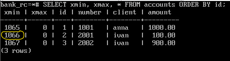
	   
- Первая строка не видна — она создана транзакцией, которая входит в список активных (xip).

- Вторая строка видна — она создана транзакцией, которая попадает в диапазон снимка.

- Третья строка не видна — она создана транзакцией, которая не входит в диапазон снимка.

5. Завершить транзакцию в третьем сеансе.

::

	COMMIT;
	
Каждой транзакции присваивается уникальный идентификатор **VirtualTransactionId** (также именуемый virtualXID или **vxid**), 
который состоит из идентификатора обслуживающего процесса (или backendID) и последовательно назначаемого номера — внутреннего для такого 
обслуживающего процесса (или localXID). Например, виртуальный идентификатор *4/12532* состоит из следующих компонентов: 
backendID со значением 4 и localXID со значением 12532. 

Такой виртуальный номер нельзя записывать в страницы данных, потому что при следующем обращении к странице он может потерять всякий смысл.
Как только транзакция начинает изменять данные, ей сразу же выдается настоящий невиртуальный идентификатор TransactionId(xid), который может появляться 
в страницах данных — в полях xmin и xmax версий строк,например 278394. 
TransactionId(xid) последовательно выбираются для транзакций из глобального счётчика, который используется **всеми базами данных в рамках кластера** PostgreSQL.

Внутренний тип идентификаторов транзакций xid имеет размер 32 бита, и 
значения в нём повторяются через каждые 4 миллиарда транзакций. После каждого цикла 32-битная эпоха увеличивается на 1.

Только читающие транзакции никак не влияют на видимость версий строк и не учитываются в снимках данных. Они не имеют настоящего номера:

::

	SELECT pg_current_xact_id_if_assigned();

pg_current_xact_id_if_assigned 
--------------------------------
                               
(1 row)

Настоящий номер присваивается при первом изменении, выполненном транзакцией, а также при вызове функции pg_current_xact_id().

обственные изменения

Видимость собственных изменений
--------------------------------

При работе транзакции может потребоваться видеть только часть изменений, которые она произвела. 
Например, курсор, открытый в определенный момент, ни при каком уровне изоляции не должен видеть изменений, сделанных после этого момента.

Для этого в заголовке версии строки есть специальное поле (которое отображается в псевдостолбцах *cmin* и *cmax*), 
показывающее порядковый номер операции *внутри* транзакции. *Cmin* представляет номер для вставки, *cmax* — для удаления, 
но для экономии места в заголовке строки это на самом деле одно поле, а не два разных.  Вообще, вставка и удаление той же строки в одной транзакции выполняется редко.

Горизонт событий
****************

У каждой версии строки имеется значение *xmin*. Но при построении снимка берется в расчет xmin именно самой ранней из текущих ьранзакций.
Он имеет важный смысл — определяет **"горизонт событий"** транзакции. А именно, за своим горизонтом транзакция всегда видит только актуальные версии строк.

**"Горизонт событий"** транзакции — это идентификатор самой старой из соседних транзакций, активных на момент старта этой транзакции. 

За своим горизонтом транзакция всегда видит только актуальные версии строк. 
Все активности транзакций старше горизонта с точки зрения транзакции полностью завершены, а их статусы для транзакции безразличны, 
потому что любая из её операций одинаково увидит все их результаты. 

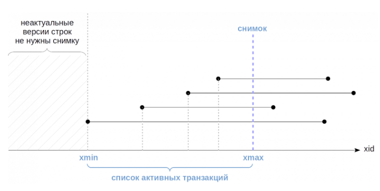
	   
Все транзакции левее вертикальной черты зафиксированы, и изменение этих транзакций видны в снимке данных.

И все *неактуальные* версии строк, находящиеся левее горизонта можно очищать. 

Горизонт снимка данных строится в разных уровнях изоляции по-разному. 
В уровнях изоляции Repeatable Read и serializable снимок данных строится в начале транзакции.

.. figure:: img/03_snapshot_09_1.png
       :scale: 100 %
       :align: center
       :alt: asda

Левая граница снимка (начало горизонтального отрезка на слайде) определяющая горизонт транзакции, 
равна номеру самой ранней активной транзакции. Поскольку текущая транзакция сама является активной, 
горизонт никогда не может оказаться правее настоящего номера данной транзакции.

Read Committed
---------------

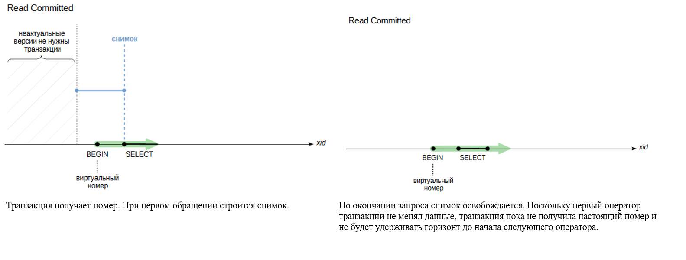
	   
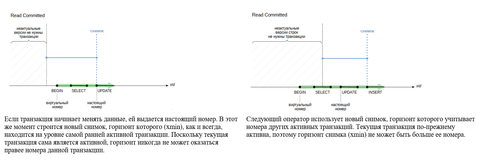

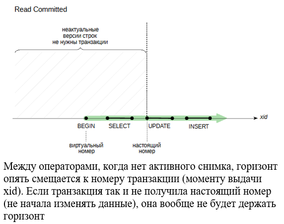
	   
Горизонт для базы данных
-------------------------

Также можно определить и «горизонт событий» на уровне базы данных. 
Для этого надо взять все активные снимки и среди них найти наиболее старый xmin. 
Он и будет определять горизонт, за которым неактуальные версии строк в этой БД уже никогда не будут видны ни одной транзакции. 
Такие версии строк могут быть очищены — именно поэтому понятие горизонта так важно с практической точки зрения.

Если какая-либо транзакция будет удерживать снимок в течении долгого времени, 
она тем самым будет удерживать и горизонт событий базы данных. Более того, незавершенная транзакция будет удерживать горизонт самим фактом своего 
существования, даже если в ней не удерживается снимок или она ничего не меняет, и даже не имеет xid. Фактом своего существования держит горизонт.
 
А это означает, что неактуальные версии строк в этой БД не могут быть очищены. 
При этом "долгоиграющая" транзакция может никак не пересекаться по данным с другими транзакциями — это совершенно не важно, горизонт базы данных один на всех.
Это одна из причин, по которым транзакции не следует делать длиннее, чем абсолютно необходимо.

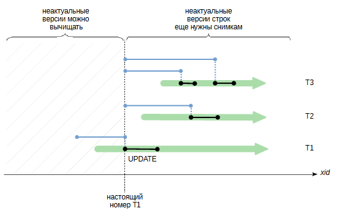

   
На этом рисунке самый нижний снимок относится к незавершенной транзакции, а в остальных снимках snapshot.xmin не может быть больше ее номера.

Если описанная ситуация действительно создает проблемы и нет способа избежать ее на уровне приложения, то, начиная с версии 9.6, доступны два параметра:

- *old_snapshot_threshold* определяет максимальное время жизни снимка. 
После этого времени сервер получает право удалять неактуальные версии строк, а если они понадобятся «долгоиграющей» транзакции, 
но она получит ошибку *snapshot too old*.

- *idle_in_transaction_session_timeout* определяет максимальное время жизни бездействующей транзакции. После этого времени транзакция прерывается.

Практика:
^^^^^^^^^
1. В одном сеансе создать транзакцию и выполнить запрос:

::

	BEGIN;
	SELECT * FROM accounts;
	
2. Проверить горизонт транзакции может увидеть в представлении:

::

	SELECT backend_xmin FROM pg_stat_activity WHERE pid = pg_backend_pid();
	
Узнать номер самой транзакции:

::

	SELECT txid_current();
	
3. Во втором сеансе начать транзакцию, посмотреть номер и посмотреть горизонт и свой номер:

::

	|BEGIN;
	|SELECT txid_current();
	|SELECT backend_xmin FROM pg_stat_activity WHERE pid = pg_backend_pid();

Горизонт удерживается на транзакции первого сеанса.

4. Завершить транзакцию в первом сеансе.

::

	COMMIT;
	
4. Завершить транзакцию во втором сеансе.

::

	|COMMIT;

5. Проверить горизонт. Он должен измениться (сдвинуться вперед).

После завершения транзакции горизонт продвигается вперед, позволяя очищать неактуальные версии строк.

Экспорт снимка
***************

Бывают ситуации, когда несколько транзакций должны гарантированно видеть одну и ту же картину данных. 
Например, при работе с утилитой pg_dump, когда можно запустить несколько процессов, которые будут выгружать разные таблицы. 
pg_dump должен видеть одну и ту же картину данных для всех процессов, чтобы  была согласованная копия. 

Запустить транзакции "одновременно" не получится. Для этого есть механизм экспорта и импорта снимка.
Функция **pg_export_snapshot** сохраняет информацию о снимке в виде файла в каталоге *PGDATA/pg_snapshots* и возвращает идентификатор снимка, 
который может быть передан (внешними по отношению к СУБД средствами) в другую транзакцию.

Экспортированный снимок существует до окончания экспортировавшей его транзакции. 
В это время другая транзакция может импортировать снимок с помощью команды SET TRANSACTION SNAPSHOT 
до выполнения первого запроса в ней. Предварительно надо установитьи уровень изоляции *Repeatable Read* или *Serializable*,
потому что на уровне Read Committed операторы будут использовать собственные снимки.

Пример:

::
	
	BEGIN ISOLATION LEVEL REPEATABLE READ;
	SELECT count(*) FROM accounts; 

::

	 SELECT pg_export_snapshot();
	 
В другом сеансе:

::

	| DELETE FROM accounts;
	| BEGIN ISOLATION LEVEL REPEATABLE READ;
	| SET TRANSACTION SNAPSHOT '00000004-00000E7B-1';

::

	SELECT count(*) FROM accounts;
	
::

	| COMMIT;
	
::
	
	COMMIT;
	
Самостоятельно:
***************

1. Воспроизведите ситуацию, при которой одна транзакцияеще видит удаленную строку, а другая — уже нет.
Посмотрите снимки данных этих транзакций и значения полей xmin и xmax удаленной строки.Объясните видимость на основании этих данных.

2. Если в запросе вызывается функция, содержащая другой запрос, какой снимок данных будет использоваться для «вложенного» запроса?
Проверьте уровни изоляции Read Committed и Repeatable Read и категории изменчивости функций volatile и stable.

3. В одной транзакции экспортируйте снимок, затем в другой транзакции измените данные. 
Импортируйте снимок и проверьте, что в нем видны еще не измененные данные