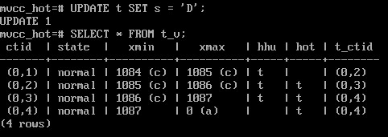

HOT-обновления и самоочистка
############################

При работе с данными в табличных страницах появляются новые версии строк. В случае, когда по какому-то из полей строится индекс, 
то необходимо выполнять синхронизацию между таблице и индексом. В индексных страницах появляются записи, указывающие на каждую версию
строки. Это приводит к изменению большого числа страниц и также снижает производительность.

Когда в индексной странице (B-tree) не хватает места, то она разделяется на две и обратно уже ее соединить нельзя, даже когда будет выполнена очистка.
А это означает, что размер индекса не изменится при удалении ненужных данных. Единственным выходом является перестроение индекса.

Сам процесс очистки данных требует значительных ресурсов, поэтому имеются инструменты, которые позволяют чистить страницы при простом к ним обращении.

При обычном обновлении возникают проблемы:

.. figure:: img/hot_01.png
       :scale: 100 %
       :align: center
       :alt: asda

1) при любом изменении строчки в таблице необходимо менять все индексы, которые в этой таблице есть. Обновлять их. 
Соответственно, страдает производительность вставки и изменений данных. 

2) в индексе, так же как и в таблице, накапливаются неактуальные строки, ссылающиеся на неактуальные версии внутри таблицы, 
которые потом нужно из индекса вычищать. При этом индекссная страница может и поделиться.

Чем больше индексов, тем больше всяких проблем, тем больше страдает производительность и увеличивается объем. 

Поэтому для случая, когда изменяются данные в столбцах **не входящих в индекс**, то нет никакого смысла создавать дополнительную запись в B-дереве, 
содержащую то же самое значение ключа

HOT обновление
***************

.. figure:: img/hot_02.png
       :scale: 100 %
       :align: center
       :alt: asda

**HOT* сокращенно от *Heap-Only Tuple Update*.

*Tuple* - это версия строки, а *heap-only это значит, что эта версия строки существует только внутри таблицы, но не в индексе. 

При последующих обновлениях внутри табличной страницы будет появляться цепочка связанных версий.
Каждая будет указывать на следующую в списке, по которой надо пройтись, чтобы получить все нужные версии. 

Для того чтобы можно было обнаружить возможность перемещаться по цепочке в заголовке имеются 2 бита: *heap-hot-updated* и *heap-only-tuple*.

- строки, которые изменены и входят в цепочку и обновлены, маркируются битом Heap Hot Updated;

- строки, на которые нет ссылок из индекса, маркируются битом Heap Only Tuple (то есть — «только табличная версия строки»);

- поддерживается обычная связь версий строк через поле ctid.

При таком обновлении в индексной странице находится лишь одна запись, ссылающаяся на самую первую версию строки в табличной странице. 
А уже внутри этой табличной страницы организуется цепочка версий.

При полное сканировании таблицы без индексов, версии строчек будут найдены, потому что будут прочитаны все версии.
А при попадании в таблицу из индекса, происходит переход по ссылке на первую версию, а потом проход по hot-цепочке (по цепочке ctid).

.. important:: HOT-обновления работают только в случае, если не изменяется **ни один ключ в индексах**.

Причем это касается всех индексов, которые созданы на таблице. 
То есть если ни один индекс не затронут, то в этом случае ход обновления можно применить. 
Если у нас есть хотя бы один индекс по какому-то столбцу, который поменялся, то это значит, что в этом индексе необходимо будет создать ссылку 
на определенную версию строчки, новую, что означает, что ее нельзя пометить  как HOT, 
то есть на нее есть ссылка из какого-то индекса, и поэтому оптимизация работать не будет.

Оптимизация действует только в пределах одной страницы, поэтому дополнительный обход цепочки не требует обращения к 
другим страницам и не ухудшает производительность.

Если на странице не хватит свободного места, чтобы разместить новую версию строки, цепочка прервется. 
На версию строки, размещенную на другой странице, придется сделать отдельную ссылку из индекса.

Поэтому при частых обновлениях неиндексированных полей может иметь смысл уменьшить параметр хранения 
*fillfactor*, определяющий *пороговый процент* занятого на странице места, **после которого вставка новых строк** в эту страницу будет **запрещена**. 
Значение по умолчанию – 100%, можно уменьшать до 10%. Оставшееся место резервируется для **обновлений**: 
в этом случае новая версия строки может занять свободное место на той же странице.

Практика:
=========

Создать таблицу без индекса.

Каждая строка таблицы состоит из 2000 символов; если использовать только латинские буквы, то версия строки будет занимать 2000 байт плюс заголовок 24 байта.

Параметр fillfactor установить в 75%, чтобы на страницу помещалось только три версии и одна была доступна для обновления.

::

	CREATE DATABASE mvcc_hot;

::

	\c mvcc_hot

::

	CREATE TABLE t(
    s char(2000)
    ) WITH (fillfactor = 75, autovacuum_enabled = off);

autovacuum_enabled = off - отключение автоочистки таблицы.

Для изучения содержимого страницы используем расширение *pageinspect*.

::

	CREATE EXTENSION pageinspect;

Для удобства создать представление с расшифровкой поля t_infomask:

::

	CREATE VIEW t_v AS
	SELECT '(0,'||lp||')' AS ctid,
		   CASE lp_flags
			 WHEN 0 THEN 'unused'
			 WHEN 1 THEN 'normal'
			 WHEN 2 THEN 'redirect to '||lp_off
			 WHEN 3 THEN 'dead'
		   END AS state,
		   t_xmin || CASE
			 WHEN (t_infomask & 256) > 0 THEN ' (c)'
			 WHEN (t_infomask & 512) > 0 THEN ' (a)'
			 ELSE ''
		   END AS xmin,
		   t_xmax || CASE
			 WHEN (t_infomask & 1024) > 0 THEN ' (c)'
			 WHEN (t_infomask & 2048) > 0 THEN ' (a)'
			 ELSE ''
		   END AS xmax,
		   CASE WHEN (t_infomask2 & 16384) > 0 THEN 't' END AS hhu,
		   CASE WHEN (t_infomask2 & 32768) > 0 THEN 't' END AS hot,
		   t_ctid
	FROM heap_page_items(get_raw_page('t',0))
	ORDER BY lp;
	
Вставить строку и обновить ее, чтобы создать новую версию:

::

	INSERT INTO t(s) VALUES ('A');
	UPDATE t SET s = 'B';

Поскольку обновленный столбец не входит ни в какой индекс, в табличной странице появляется цепочка изменений:

::

	SELECT * FROM t_v;
	

	
флаг hhu (Heap Hot Updated) показывает, что надо идти по цепочке ctid,
флаг hot (Heap Only Tuple) показывает, что на данную версию строки нет ссылок из индексов.

первая версия у нас помечена как Heap HOT UPDATED, а вторая помечена как Heap ONLY Tup. 

Cтолбец t_ctid содержит ссылку. Первая версия ссылается на вторую, а вторая просто ссылается сама на себя. 
Это и есть цепочка hot обновлений.

При дальнейших изменениях цепочка в пределах страницы будет расти:

::

	UPDATE t SET s = 'C';
	SELECT * FROM t_v;
	

	   

Очистка при HOT обновлениях
===========================

В Postgres еще одна вещь, которую мы назвали внутристраничная очистка, по-английски используется термин prune.

Это такая быстрая очистка, которая выполняется при удобном случае при обращении к страничке.

При обращении к странице — как при обновлении, так и при чтении — может происходить быстрая внутристраничная очистка, 
если PostgreSQL поймет, что место на странице заканчивается. Это происходит в двух случаях.

- Ранее выполненное на этой странице обновление (UPDATE) не обнаружило достаточно места, 
чтобы разместить новую версию строки на той же странице. Такая ситуация запоминается в заголовке страницы, и 
в следующий раз страница очищается.

- Страница заполнена больше, чем на *fillfactor* или на 90%. При этом очистка происходит сразу, не откладывая на следующий раз.

Данная очистка выполняет часть работы VACUUM и убирает версии строк, 
не видимые ни в одном снимке (находящиеся за "горизонтом событий" базы данных), но работает строго в пределах одной табличной страницы. 

.. important:: Указатели на вычищенные версии строк не освобождаются, так как на них могут вести ссылки из индексов, 
				а индекс — это уже другая страница. 

Внутристраничная очистка никогда не выходит за одну табличную страницу, зато выполняется очень быстро.

При этом не обновляется карта свободного пространства из экономии ресурсов, а также позволяет приберечь освобожденное место для обновлений, а не для вставок. 
Не обновляется и карта видимости.

Тот факт, что страница может очищаться при чтении, означает, что запрос на чтение (SELECT) может вызвать изменение страниц. 
Это еще один такой случай, в дополнение к изменению простановкой "битов-подсказок".

Пример:
---------

1. Превысить порог fillfactor=75%

::
	
	UPDATE t SET s = 'D';
	SELECT * FROM t_v;

75% от 8-килобайтной странички это 6144 байтика, А если посмотреть, сколько уже занято, 
то будет видно, что размер страницы минус указатель на начало строк (upper) уже больше данного значения.

::

	SELECT lower, upper, pagesize FROM page_header(get_raw_page('t',0));	
	

2. Так как порог превышен, то следующее обновление должно привести к внутристраничной очистке. 
"Голова" этой HOT-цепочки всегда должна оставаться на своем месте, (на нее может ссылаться индекс), а остальные указатели могут быть освобождены:
известно, что на них нет ссылок извне.

::

	UPDATE t SET s = 'E';
	SELECT * FROM t_v;

Чтобы не трогать «голову», применяется двойная адресация: указатель, на который ссылается индекс — в данном случае (0,1), — получает статус «redirect», 
перенаправляющий на нужную версию строки.

Все неактуальные версии строк (0,1), (0,2) и (0,3) были очищены; после этого новая версия строки была добавлена на освободившееся место.

Указатели на очищенные строки освобождены (имеют статус unused).

При этом указатель на первую версию остался на месте, но получил статус redirect. Проследите ссылки от этой головной версии до конца HOT-цепочки.

Все оставшиеся версии строк сдвигаются вместе так, чтобы свободное место на странице было представлено одним фрагментом. 
Соответствующим образом изменяются и значения указателей. Благодаря этому не возникает проблем с фрагментацией свободного места в странице.

3. Выполнить обновление еще несколько раз:

::

	UPDATE t SET s = 'F';

	UPDATE t SET s = 'G';

	SELECT * FROM t_v;

Следующее обновление снова вызывает самоочистку:

::

	UPDATE t SET s = 'H';
	SELECT * FROM t_v;
	

	   
	   
4. Построить индекс по столбцу s и создадать вспомогательное представление, для его просмотра:

::
	
	CREATE INDEX t_s ON t(s);

::

	CREATE VIEW t_s_v AS
	SELECT itemoffset, ctid
	FROM bt_page_items('t_s',1);

При создании индекса перестройки данных в табличных страницах не происходит, HOT-цепочки сохраняются:

::

	SELECT * FROM t_v;

::

	SELECT * FROM t_s_v;

В целом можно представить процесс самоочистки при HOT - обнавлениях следующим образом:

Разрыв HOT-цепочки
=====================

Если на странице не хватит свободного места, чтобы разместить новую версию строки, цепочка прервется. 
На версию строки, размещенную на другой странице, придется сделать отдельную ссылку из индекса.

https://habr.com/ru/companies/postgrespro/articles/449704/
::

	|  => BEGIN ISOLATION LEVEL REPEATABLE READ;
	|  => SELECT count(*) FROM hot;
	
	|   count 
	|  -------
	|       1
	|  (1 row)

Снимок не даст очистить версии строк на странице. Теперь выполняем обновление в первом сеансе:

::

	=> UPDATE hot SET s = 'I';	
	=> UPDATE hot SET s = 'J';
	=> UPDATE hot SET s = 'K';
	=> SELECT * FROM heap_page('hot',0);
 
	ctid  |     state     |   xmin   |   xmax   | hhu | hot | t_ctid 
	-------+---------------+----------+----------+-----+-----+--------
	 (0,1) | redirect to 2 |          |          |     |     | 
	 (0,2) | normal        | 3993 (c) | 3994 (c) | t   | t   | (0,3)
	 (0,3) | normal        | 3994 (c) | 3995 (c) | t   | t   | (0,4)
	 (0,4) | normal        | 3995 (c) | 3996     | t   | t   | (0,5)
	 (0,5) | normal        | 3996     | 0 (a)    |     | t   | (0,5)
	(5 rows)

При следующем обновлении места на странице уже не хватит, но внутристраничная очистка не сможет ничего освободить:

::

	=> UPDATE hot SET s = 'L';

	|  => COMMIT; -- снимок больше не нужен

	=> SELECT * FROM heap_page('hot',0);
	 
	ctid  |     state     |   xmin   |   xmax   | hhu | hot | t_ctid 
	-------+---------------+----------+----------+-----+-----+--------
	 (0,1) | redirect to 2 |          |          |     |     | 
	 (0,2) | normal        | 3993 (c) | 3994 (c) | t   | t   | (0,3)
	 (0,3) | normal        | 3994 (c) | 3995 (c) | t   | t   | (0,4)
	 (0,4) | normal        | 3995 (c) | 3996 (c) | t   | t   | (0,5)
	 (0,5) | normal        | 3996 (c) | 3997     |     | t   | (1,1)
	(5 rows)

В версии (0,5) видим ссылку на (1,1), ведущую на страницу 1.

::

	=> SELECT * FROM heap_page('hot',1);
 
	ctid  | state  | xmin | xmax  | hhu | hot | t_ctid 
	-------+--------+------+-------+-----+-----+--------
	 (1,1) | normal | 3997 | 0 (a) |     |     | (1,1)
	(1 row)

Теперь в индексе — две строки, каждая из которых указывает на начало своей HOT-цепочки:

::

	=> SELECT * FROM index_page('hot_id',1);
 
	itemoffset | ctid  
	------------+-------
	          1 | (1,1)
	          2 | (0,1)
	(2 rows)

Внутристраничная очистка при обычных обновлениях
*************************************************

Подобная очистка работает и приобычных обновлениях, то есть когда обновится может индексный столбец.
В данном случае статус будет не *unused* и *redirect*, а *dead* и *normal*. При этом в индексной странице будут ссылки на все версии строк.
Просто перейдя по ссылке к строке, статуc которой dead, она будет пропускаться.

Пример:

1. В примере выше был установлен индекс на столбец s, поэтому дальнейшие изменения цепочку HOT-обновлений удалят:

::

	UPDATE t SET s = 'I';
	UPDATE t SET s = 'J';
	UPDATE t SET s = 'K';
	
	SELECT * FROM t_v;

::

		SELECT * FROM t_s_v;

Самостоятельно:
***************

1. Воспроизведите ситуацию самоочистки без участия HOT-обновлений. Проверяйте содержимое табличной и индексной страниц с помощью 
расширения pageinspect.

2. Воспроизведите ситуацию HOT-обновления на таблицес индексом по некоторым полям.

3. Воспроизведите ситуацию HOT-обновления, при которой самоочистка не освобождает достаточно места 
на странице и новая версия создается на другой странице. Сколько записей будет в индексе в этом случае?
