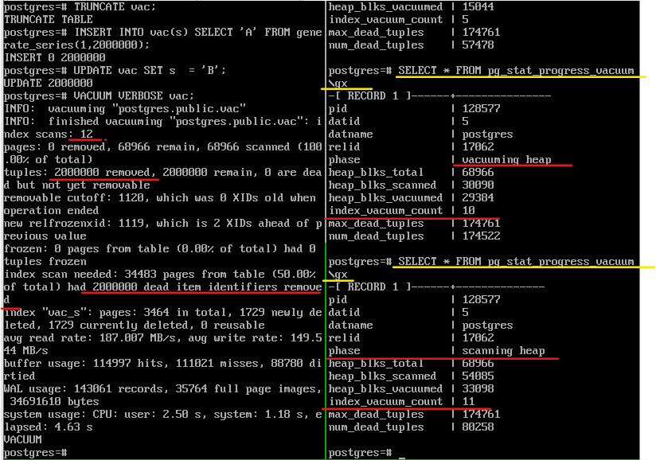

Очистка
#######

Механизм многоверсионности позволяет эффективно реализовать изоляцию на основе снимков, 
но в результате в табличных страницах  накапливаются старые версии строк, а в страницах индексов — ссылки на эти версии. 
Какое-то время исторические версии нужны, чтобы транзакции могли работать со своими снимками данных. 
Но со временем не остается ни одного снимка данных, которому требовалась бы старая версия строки; 
такая версия называется «мертвой». 

Для освобождения от таких строк используется процедура очистки.

Процедура очистки вычищает мертвые версии строк из табличных страниц и ненужные индексные записи, 
которые ссылались на такие версии. Если своевременно не вычищать исторические данные, 
таблицы и индексы будут неконтролируемо разрастаться и поиск в них актуальных версий строк будет замедляться.

Самоочистка таблицы выполняется быстро, но не решает всех задач. Она работает только в пределах одной табличной страницы и не затрагивает индексы.

Обычная очистка
***************

Основная, "обычная" очистка выполняется командой **VACUUM**.

Очистка обрабатывает таблицу полностью. Она вычищает не только ненужные версии строк, но и ссылки на них из всех индексов.

Обработка происходит параллельно с другой активностью в системе. 
Таблица и индексы при этом могут использоваться обычным образом и для чтения, и для изменения 
(однако одновременное выполнение таких команд, как CREATE INDEX, ALTER TABLE и некоторых других будет невозможно).

В таблице просматриваются только те страницы, в которых происходила какая-то активность. 
Для этого используется карта видимости (visibility map). 

В карте видимости отмечены страницы, которые *содержат только актуальные версии строк*, причем эти версии видны во всех снимках данных. 
Такие страницы давно не изменялись и успели полностью очиститься от неактуальных версий.Карта видимости применяется:

- Для оптимизации очистки. В отмеченные страницы очистке не надо заглядывать — в них не может быть мертвых версий.

- Для ускорения доступа только по индексу. Информация о версионности хранится только для таблиц, но не для индексов 
(поэтому у индексов не бывает карты видимости). Получив из индекса ссылку на версию строки, нужно прочитать табличную страницу, 
чтобы проверить ее видимость. Но если в самом индексе уже есть все нужные столбцы, и при этом страница отмечена в карте видимости, 
то обращения к таблице можно избежать. 

Если не обновлять карту видимости, индексный доступ будет работать менее эффективно. 

При очистке обрабатываются только те *страницы, которые не отмечены в карте видимости*, а сама карта при этом обновляется.

В процессе работы обновляется и *карта свободного пространства* (free space map) - структура, которая позволяет быстро искать страницы с заданным количеством свободного места. 

В карте свободного пространства отмечен объем пустого места внутри страниц. 
Этот объем постоянно меняется: при добавлении новых версий строк он уменьшается, при очистке — увеличивается. 

Карта используется *при вставке новых версий строк*, чтобы быстро найти подходящую страницу, на которую поместятся добавляемые данные. 
Для ускорения поиска карта свободного пространства имеет сложную древовидную структуру. Строится для кучи (страницы), а также для всех индексов, кроме hash-индекса. 
У каждой таблицы и каждого индекса свой отдельный FSM.

Простая команда VACUUM только высвобождает пространство и делает его доступным для повторного использования. 
Однако освобождённое место не возвращается операционной системе (в большинстве случаев); оно просто остаётся доступным для размещения 
данных этой же таблицы.

Чтобы очистить таблицу, обычно нужно быть *владельцем* этой таблицы или *суперпользователем*. 
Однако владельцам баз данных также разрешено сжимать все таблицы в своих базах, за исключением общих каталогов. 

VACUUM при обработке пропускает все таблицы, на очистку которых текущий пользователь не имеет прав.

VACUUM нельзя выполнять внутри блока транзакции.

Можно отказаться от очистки основной таблицы или ее TOAST-части, выключив параметры PROCESS_MAIN или PROCESS_TOAST (по умолчанию оба включены).

Команды VACUUM в PostgreSQL должны обрабатывать каждую таблицу по следующим причинам:

- Для высвобождения или повторного использования дискового пространства, занятого изменёнными или удалёнными строками.

- Для обновления статистики по данным, используемой планировщиком запросов PostgreSQL.

- Для обновления карты видимости, которая ускоряет сканирование только индекса.

- Для предотвращения потери очень старых данных из-за зацикливания идентификаторов транзакций или мультитранзакций.

Пример:
=======

1. Создать функцию для просмотра содержимого страницы указанной таблицы:

::

	CREATE FUNCTION heap_page(relname text, pageno integer)
	RETURNS TABLE(ctid tid, state text, xmin text, xmax text, hhu text, hot text, t_ctid tid)
	AS $$
	SELECT (pageno,lp)::text::tid AS ctid,
		   CASE lp_flags
			 WHEN 0 THEN 'unused'
			 WHEN 1 THEN 'normal'
			 WHEN 2 THEN 'redirect to '||lp_off
			 WHEN 3 THEN 'dead'
		   END AS state,
		   t_xmin || CASE
			 WHEN (t_infomask & 256) > 0 THEN ' (c)'
			 WHEN (t_infomask & 512) > 0 THEN ' (a)'
			 ELSE ''
		   END AS xmin,
		   t_xmax || CASE
			 WHEN (t_infomask & 1024) > 0 THEN ' (c)'
			 WHEN (t_infomask & 2048) > 0 THEN ' (a)'
			 ELSE ''
		   END AS xmax,
		   CASE WHEN (t_infomask2 & 16384) > 0 THEN 't' END AS hhu,
		   CASE WHEN (t_infomask2 & 32768) > 0 THEN 't' END AS hot,
		   t_ctid
	FROM heap_page_items(get_raw_page(relname,pageno))
	ORDER BY lp;
	$$ LANGUAGE SQL;

2. Создать функцию для просмотра индексной страницы:

::

	CREATE FUNCTION index_page(relname text, pageno integer)
	RETURNS TABLE(itemoffset smallint, ctid tid)
	AS $$
	SELECT itemoffset,
		   ctid
	FROM bt_page_items(relname,pageno);
	$$ LANGUAGE SQL;
	
3. Создать таблицу, отключив процесс автоочистки:

::

	CREATE TABLE vac(
	  id serial,
	  s char(100)
	) WITH (autovacuum_enabled = off);

4. Создать индекс:

::

	CREATE INDEX vac_s ON vac(s);
	
5. Вставить строку и выполнить несколько обновлений:

::

	INSERT INTO vac(s) VALUES ('A');
	UPDATE vac SET s = 'B';
	UPDATE vac SET s = 'C';

6. В таблице создано три строки и на каждую имеется ссылка из индекса:

::

	SELECT * FROM heap_page('vac',0);
	
::

	SELECT * FROM index_page('vac_s',1);

.. figure:: img/vac_01.png
       :scale: 100 %
       :align: center
       :alt: asda

7. После очистки "мертвые" версии пропадают и остается только одна, актуальная. И в индексе тоже остается одна ссылка:

::
	
	VACUUM vac;
	
	SELECT * FROM heap_page('vac',0);
	
	SELECT * FROM index_page('vac_s',1);
	

	   
При внутристраничной очистке указатели бы получили статус *dead* и на них были бы указатели из индекса.

Алгоритм очистки
-----------------

1. Процесс начинается со сканирования таблицы с учетом карты видимости. 
В прочитанных страницах определяются ненужные версии строк и их идентификаторы (tid) записываются в специальный массив. 
Массив располагается в локальной памяти процесса очистки; для него выделяется фрагмент размером *maintenance_work_mem*. 
Значение этого параметра по умолчанию — 64 МБ. Эта память выделяется не по мере необходимости, а сразу в полном объеме. 

2. Если процесс дошел до конца таблицы, то начинается фаза очистки индексов. Для этого каждый из индексов, созданных на таблице, 
полностью сканируется в поисках записей, которые ссылаются на "мертвые" версии строк прочитанной страницы. Найденные записи вычищаются из индексных страниц.

3. Фаза очистки таблицы. Таблица снова сканируется, чтобы прочитать нужные страницы, вычистить из них "мертвые" версии строк и освободить указатели, 
так как ссылок из индексов уже нет.

Если в первом шаге таблица не была прочитана полностью, то происходит очистка до того места, которое в массив попало. 
А потом он очищается и все повторяется с того места, на котором мы остановились.

Таким образом:

- таблица всегда сканируется два раза;

- если при очистке удаляется так много версий строк, что все они не помещаются в память размером maintenance_work_mem, 
то все индексы будут полностью сканироваться столько раз, сколько потребуется.

На больших таблицах это может занимать существенное время и создавать значительную нагрузку на систему. 
Конечно, запросы не будут блокироваться, но «лишний» ввод-вывод тоже неприятен.

Чтобы ускорить процесс, имеет смысл либо вызывать очистку чаще (чтобы за каждый раз очищалось не очень большое количество версий строк), 
либо выделить больше памяти.

Начиная с версии 11, PostgreSQL может пропускать сканирование индексов, 
если в этом нет необходимости. Это должно упростить работу с большими таблицами, в которые строки только добавляются (но не изменяются).

Мониторинг
==========

Для просмотра состояния процесса очистки можно вызывать команду VACUUM с указанием VERBOSE. 
Тогда на консоль будет выводиться и информация о фазах выполнения работы.

Так же  имеется представление *pg_stat_progress_vacuum*, которое также содержит всю необходимую информацию:

- название текущей фазы (phase) — мы говорили о трех основных фазах, но вообще их больше;

- общее число страниц таблицы (heap_blks_total);

- число просканированных страниц (heap_blks_scanned);

- число уже очищенных страниц (heap_blks_vacuumed);

- количество проходов по индексам (index_vacuum_count).

Пример:
-------

1. Вставить в таблицу 2000000 строк и обновить их. Уменьшить размер **maintenance_work_mem = '1MB'**

::

	TRUNCATE vac;
	INSERT INTO vac(s) SELECT 'A' FROM generate_series(1,2000000);
	UPDATE vac SET s  = 'B';

	ALTER SYSTEM SET maintenance_work_mem = '1MB';
	
	SELECT pg_reload_conf();

2. В одном сеансе запустить очистку, а в другом обратиться несколько раз к представлению pg_stat_progress_vacuum:

::

	VACUUM VERBOSE vac;

::

	| SELECT * FROM pg_stat_progress_vacuum \gx

Общий прогресс определяется отношением *heap_blks_vacuumed* к *heap_blks_total*, но нужно учитывать, что это значение изменяется не плавно, 
а "рывками" из-за сканирования индексов. Основное внимание надо обратить на количество циклов очистки — значение больше 1 означает, 
что выделенной памяти не хватило для того, чтобы завершить очистку за один проход.

Здесь видно, что всего было выполнено 12 проходов по индексам, на каждом из которых очищалось *pg_stat_progress_vacuum.max_dead_tuples* указателей на мертвые версии строк. 
Откуда такое число? Одна ссылка (tid) занимает 6 байтов, а 1024*1024/6 = 174762 — это число, 
которое мы видим в pg_stat_progress_vacuum.max_dead_tuples. Реально может использоваться чуть меньше: 
так гарантируется, что при чтении очередной страницы все указатели на «мертвые» версии точно поместятся в память.

Регулирование нагрузки
======================

Процесс очистки интенсивно работает с таблицамии индексами и создаёт значительную нагрузку на подсистему ввода/вывода, 
что может отрицательно сказаться на производительности других активных сеансов.
Поэтому может оказаться необходимым распределить действия во времени и тем самым сгладить пики нагрузки, используя возможность 
задержки очистки с учётом её стоимости, выполнять очистку порциями, чередуя работу и ожидание.

Очень часто не имеет значения, насколько быстро выполнятся команды обслуживания (например, VACUUM и ANALYZE), но очень важно, 
чтобы они как можно меньше влияли на выполнение других операций с базой данных. 
Администраторы имеют возможность управлять этим, настраивая задержку очистки по стоимости.

В каждом цикле свое работы VACUUM выполняет *vacuum_cost_limit*  условных единиц работы (по умолчанию 200 единиц), 
а потом делает паузу на вакуум *vacuum_cost_delay* миллисекунд. 

По умолчанию vacuum_cost_delay=0, что фактически отключает механизм регулирования нагрузки.
Это сделано потому, что считается, что если администратор вручную запустил очистку, то она должна пройти как можно быстрее, даже в ущерб другим процессам.

vacuum_cost_limit - это общая стоимость, при накоплений которой процесс очистки будет засыпать. По умолчанию этот параметр равен 200.:

Накопления:

- vacuum_cost_page_hit = 1 — страница нашлась в кеше

- vacuum_cost_page_miss = 2 — страница прочитана с диска

- vacuum_cost_page_dirty = 20 — чистая страница стала грязной

В лучшем случае стоимость будет равна *vacuum_cost_page_hit* (если страница нашлась в кеше и либоне изменилась, либо уже была грязной); 

в худшем случае — *vacuum_cost_page_miss + vacuum_cost_page_dirty* (если страница была прочитана с диска и изменилась в результате очистки). 

https://postgrespro.ru/docs/postgresql/16/runtime-config-resource#RUNTIME-CONFIG-RESOURCE-VACUUM-COST

Параллельная очистка
=====================

Очистка может распараллеливаться, при этом фаза сканирования таблицы и фаза очистки таблицы выполняется всегда последовательно одним процессом.

Этапы сканирования и очистки таблицы всегда выполняются последовательно одним процессом.

Распараллеливаться может только только очистка индексов, причем дополнительные рабочие процессы будут обрабатывать каждый свой индекс.
Это возможно, если на таблице создано несколько (больше одного) достаточно больших индексов: размер индекса должен превышать значение параметра 
*min_parallel_index_scan_size* (512 Кбайт по умолчанию). 

Тогда для каждого подходящего индекса запускается отдельный рабочий процесс.
Каждый индекс обрабатывается только одним рабочим процессом,то есть несколько процессов не могут очищать один и тот же индекс.

Количество процессов ограничено сверху значением параметра *max_parallel_maintenance_workers* и может быть дополнительно ограничено 
явным указанием степени параллелизма при вызове команды VACUUM (PARALLEL n).

.. warning:: Параллельно выполняемые служебные команды не должны потреблять значительно больше памяти, чем равнозначные непараллельные операции. 

Анализ
======

Еще одна задача, которую обычно совмещают с очисткой, — анализ,то есть сбор статистической информации для планировщика запросов. 
Планировщик запросов в PostgreSQL, выбирая эффективные планы запросов, полагается на статистическую информацию о содержимом таблиц 
(число строк в таблице, распределение данных по столбцам и т. п.). 

Эта статистика собирается командой **ANALYZE**, которая может вызываться сама по себе или как дополнительное действие команды VACUUM. 
Статистика должна быть достаточно точной, так как в противном случае неудачно выбранные планы запросов могут снизить производительность базы данных.

Как и процедура очистки для высвобождения пространства, частое обновление статистики полезнее для интенсивно изменяемых таблиц, 
нежели для тех таблиц, которые изменяются редко. 

Команду ANALYZE можно выполнять для отдельных таблиц и даже просто для отдельных столбцов таблицы, 
поэтому, если того требует приложение, одни статистические данные можно обновлять чаще, чем другие. 
Однако на практике обычно лучше просто анализировать всю базу данных, поскольку это быстрая операция, 
так как ANALYZE читает не каждую отдельную строку, а статистически случайную выборку строк таблицы.

В больших таблицах ANALYZE не просматривает все строки, а обрабатывает только небольшую случайную выборку. 
Это позволяет проанализировать за короткое время даже очень большие таблицы. 

Вручную анализ выполняется командой ANALYZE (только анализ)или VACUUM ANALYZE (и очистка, и анализ).
Как и в случае очистки, обработка происходит в фоновом режиме и не мешает обычному использованию таблиц и индексов.

https://postgrespro.ru/docs/postgresql/16/sql-analyze

https://postgrespro.ru/docs/postgresql/16/routine-vacuuming - 25.1.3. Обновление статистики планировщика

Пример:
=======

1. Создать таблицу с большим количеством одинаковых строк и проиндексировать ее:

::

	CREATE TABLE tt(s) AS SELECT 'FOO' FROM generate_series(1,1_000_000) AS g;
	CREATE INDEX ON tt(s);

Планировщик ничего не знает про данные и выбирает индексный доступ, хотя читать придется всю таблицу:

::

	EXPLAIN (costs off) SELECT * FROM tt WHERE s = 'FOO';
	

При анализе собирается статистика по случайной выборке строк:

::

	ANALYZE VERBOSE tt;
	
	
	INFO:  analyzing "public.tt"
	INFO:  "tt": scanned 4480 of 4480 pages, containing 1000000 live rows and 0 dead rows; 
	30000 rows in sample, 1000000 estimated total rows
	ANALYZE

Статистика сохраняется в системном каталоге. После этого планировщик знает, что во всех строках находится одно и то же значение, 
и перестает использовать индекс:

::

	EXPLAIN (costs off) SELECT * FROM tt WHERE s = 'FOO';

.. figure:: img/vac_05.png
       :scale: 100 %
       :align: center
       :alt: asda

Полная очистка
**************

Обычная очистка работает эффективнее, чем внутристраничная, освобождая больше места, но и она не всегда решает задачу полностью.

Если таблица или индекс по каким-то причинам сильно выросли в размерах, то обычная очистка освободит место внутри 
существующих страниц: в них появятся «дыры», которые затем будут использованы для вставки новых версий строк. 
Но число страниц не изменится, и, следовательно, с точки зрения операционной системы файлы будут занимать ровно столько же места, 
сколько занимали и до очистки. 

Недостатки:

- замедляется полное сканирование таблицы (или индекса);

- может потребоваться больший буферный кэш (ведь хранятся страницы, а плотность полезной информации падает);

- в дереве индекса может появиться "лишний" уровень, который будет замедлять индексный доступ;

- файлы занимают лишнее место на диске и в резервных копиях.

(Единственно исключение составляют полностью очищенные страницы, находящиеся в конце файла — такие страницы «откусываются» от файла и возвращаются операционной системе.)

Если доля полезной информации в файлах опустилась ниже некоторого разумного предела, администратор может выполнить полную очистку таблицы.
Выполняется она командой *VACUUM FULL*.

При этом таблица и все ее индексы перестраиваются полностью с нуля, а данные упаковываются максимально компактно 
(с учетом параметра *fillfactor*). При перестройке PostgreSQL последовательно перестраивает сначала таблицу, 
а затем и каждый из ее индексов. Для каждого объекта создаются новые файлы, а в конце перестройки старые файлы удаляются. 
Следует учитывать, что в процессе работы на диске потребуется дополнительное место. Операция является блокирующей, то есть 
несовмнстима ни с какими действиями над таблицей.

.. warning:: Полная очистка не предполагает регулярного использования, так как полностью блокирует всякую работу с таблицей (включая и выполнение запросов к ней) 
             на все время своей работы. 
			 

Пример:
=======

1. Вставить в таблицу некоторое количество строк:

::

	TRUNCATE vac;
	INSERT INTO vac(s) SELECT 'A' FROM generate_series(1,500000);

2. Проверить путь до таблицы и индекса:

::

	SELECT pg_relation_filepath('vac');
	SELECT pg_relation_filepath('vac_s');
	

3. Используя модуль **pgstattuple** просмотреть статистику на уровне кортежей:

::

	CREATE EXTENSION pgstattuple;
	SELECT * FROM pgstattuple('vac') \gx

	

	   
ПОказана статистика по тому, сколько места какими данными занято в файлах. 
В данный момент важен показатель *tuple_percent*: процент, занятый полезными данными. 
Он меньше 100 из-за неизбежных накладных расходов на служебную информацию внутри страницы, но тем не менее довольно высок.	   
	   
4. Для индекса выводится другая информация, но поле avg_leaf_density имеет тот же смысл: процент полезной информации (в листовых страницах).

::

	SELECT * FROM pgstatindex('vac_s') \gx

5.  Размер файлов:

::

	SELECT pg_size_pretty(pg_table_size('vac')) table_size,
    pg_size_pretty(pg_indexes_size('vac')) index_size;
  

	   
5. Удалить 90% всех строк. Строки для удаления выбрать случайно, чтобы в каждой странице с большой вероятностью хоть одна строка, да осталась:

::
	
	DELETE FROM vac WHERE random() < 0.9;
	   

6.  Обычная очистка:

::
	
	VACUUM vac;
	SELECT pg_size_pretty(pg_table_size('vac')) table_size,
    pg_size_pretty(pg_indexes_size('vac')) index_size;

	   
Ничего не изменилось. А плотность поменяась:

::

	SELECT * FROM pgstattuple('vac') \gx
	SELECT * FROM pgstatindex('vac_s') \gx

7. Полная очистка:

::

	VACUUM FULL vac;
	
	SELECT pg_size_pretty(pg_table_size('vac')) table_size,
    pg_size_pretty(pg_indexes_size('vac')) index_size;
	

	
8. ПРоверить размещение:

::

	SELECT pg_relation_filepath('vac');
	SELECT pg_relation_filepath('vac_s');

	   
9. ПРоверить плотность кортежей и индексов:

::
	
	SELECT * FROM pgstattuple('vac') \gx
	SELECT * FROM pgstatindex('vac_s') \gx

Плотность информации в индексе даже увеличилась по сравнению с первоначальной. 
Заново создать индекс (B-дерево) по имеющимся данным выгоднее, чем вставлять данные в уже имеющийся индекс строка за строкой.

Аналоги
=======

Есть несколько команд, которые работают, используя схожий механизм. 
Все они полностью блокируют работу с таблицей, все они удаляют старые файлы данных и создают новые.

Команда *CLUSTER* во всем аналогична VACUUM FULL, но дополнительно физически упорядочивает версии строк в соответствиис одним из индексов. 
Это дает планировщику возможность более эффективно использовать индексный доступ в некоторых случаях. 
Однако надо понимать, что кластеризация не поддерживается: при последующих изменениях таблицы физический порядок версий строк будет нарушаться.

Команда *REINDEX* перестраивает индексы, не трогая при этом таблицу. 
Фактически, VACUUM FULL использует эту команду для перестроения индексов. При этом читать таблицу формально не запрещается,
однако планировщик попытается получить блокировку перестраиваемого индекса, чтобы рассмотреть все планы,
 и до окончания работы команды прочитать таблицу фактически не удастся.  
 
Вариант *REINDEX CONCURRENTLY* работает  дольше, но не блокирует индекс и не мешает чтению и обновлению  данных.

Команда *TRUNCATE* логически работает так же, как и *DELETE* — удаляет все табличные строки. 
Но DELETE, как уже было рассмотрено, помечает версии строк как удаленные, что требует дальнейшей очистки. 
TRUNCATE же просто создает новый, чистый файл. Это работает быстрее, но надо учитывать, что TRUNCATE заблокирует работу 
с таблицей на все время до конца транзакции.

https://habr.com/ru/articles/806415/

Документация VACUUM:

https://postgrespro.ru/docs/postgresql/16/sql-vacuum

https://postgrespro.ru/docs/postgresql/16/routine-vacuuming

.. figure:: img/vac_01.png
       :scale: 100 %
       :align: center
       :alt: asda

Самостоятельно:
===============

1. Очистить таблицу vac, добавить строку и обновить ее. Во втром сеансе начать транзакцию и проверить горизонт.
В первом сеансе опять обновить строку и запустить VACUUM verbose. Как ведет себя VACUUM при незавершенных транзакциях.

2. 

Автоочистка (autovacuum)
************************

Перед администратором базы данных должен возникнуть вопрос "При каких условиях требуется вызывать обычную очистку?".

- Если очищать изменяющуюся таблицу слишком редко, она вырастет в размерах больше, чем это возможно и 
для очередной очистки может потребоваться несколько проходов по индексам в случае, если изменений накопилось слишком много;

- При частой очистке таблиц сервер будет много времени заниматься обслуживающими процессами;

- Создание расписания для запуска очистки возможно при достаточно долгом наблюдении, но и в этом случае нагрузка может изменяться со временем. 
А если таблица стала обновляться активней, то и очищать ее надо чаще.

Механизм *автоматической очистки* позволяет запускать очистку *в зависимости от активности изменений* в таблицах.

На работающем сервере по умолчанию включено два параметра: **autovacuum** и **track_counts**.

::

	SHOW autovacuum;
	SHOW track_counts;
	
При включенной автоочистке (autovacuum=on) в системе всегда присутствует процесс **autovacuum launcher**, 
который *планирует работу*, а реальной очисткой занимаются рабочие процессы **autovacuum worker**, несколько экземпляров которых могут 
работать параллельно. Так как за порождение всех новых процессов ответственен *postmaster*, то именно он запускает *autovacuum worker*,
 когда этого требует *autovacuum launcher*.

Процесс *autovacuum launcher* составляет список баз данных, в которых есть какая-либо активность, которая в свою очередь 
определяется по статистике, собираемой, если *track_counts=on*. 

.. warning:: Нельзя отключать *autovacuum* и *track_counts*, иначе автоочистка не будет работать.

Документация:

https://postgrespro.ru/docs/postgresql/16/routine-vacuuming#AUTOVACUUM

Autovacuum launcher
===================

Autovacuum launcher является фоновым процессом, стартующим при запуске экземпляра.

Запустившись, рабочий процесс подключается к указанной ему базе данных и начинает с того, что строит список:

- всех таблиц, материализованных представлений и toast-таблиц, требующих очистки;

- всех таблиц и материализованных представлений, требующих анализа (toast-таблицы не анализируются, потому что обращение к ним 
всегда происходит по индексу).

Дальше рабочий процесс по очереди очищает и/или анализирует отобранные объекты и по окончании очистки завершается.

Новый рабочий процесс запускается раз в  *autovacuum_naptime* для каждой базы данных из списка 
(то есть при наличии N баз процессы будут порождаться в N раз чаще). 
Если за время *autovacuum_naptime* рабочий процесс не успел очистить всю базу данных, в ту же базу будет направлен другой рабочий процесс, 
и они будут работать вместе.

Этому процессу будет поручено чистить какую-то таблицу, но не ту, с которой уже работает первый процесс. Параллелизма на уровне таблиц нет.
Общее количество одновременно работающих рабочих процессов ограничено параметром *autovacuum_max_workers*.

Возможны ситуации, когда  параметр *autovacuum_max_workers*, который отвечает за параллелизм, нужно будет пересматривать. 
Все зависит от конкретной ситуации, интенсивности изменения данных и эффективности очистки.

Определение таблиц для очистки
---------------------------------

Считается, что очистка необходима, если число неактуальных версий строк ("мертвых") превышает установленное пороговое значение. 
Число мертвых версий постоянно собирается коллектором статистики и хранится в таблице *pg_stat_all_tables*. 

::

	SELECT * FROM pg_stat_all_tables WHERE relname='vac' \gx

- число ненужных — *n_dead_tup*,

- число вставленных — *n_ins_since_vacuum*

А порог задается двумя параметрами:

- **autovacuum_vacuum_threshold** определяет абсолютное значение (в штуках),

- **autovacuum_vacuum_scale_factor** определяет долю строк в таблице.

Итоговая формула такая: очистка требуется, если 

pg_stat_all_tables.n_dead_tup >= autovacuum_vacuum_threshold + autovacuum_vacuum_scale_factor * pg_class.reltupes.

Настройки по умолчанию устанавливают *autovacuum_vacuum_threshold = 50* и *autovacuum_vacuum_scale_factor = 0.2*. 

Для **больших** таблиц важен именно *autovacuum_vacuum_scale_factor*. Значение 20% представляется сильно завышенным, 
скорее всего его потребуется существенно уменьшить. Например, если в приблизительно равномерно, но интенсивно меняются данные в таблице
с данными за год, то 20% это два месяца с лишним. Столько должно пройти прежде, чем начнет работать очистка. 
Дело в том, что если очистку откладывать, то есть ставить большие значения доли, то очистка будет запускаться реже и давать большую нагрузку.

Оптимальные значения параметров могут отличаться для разных таблиц в зависимости от их размера и характера изменений. 
Имеет смысл установить в целом адекватные значения, и — при необходимости — настроить специальным образом параметры 
на уровне некоторых таблиц с помощью параметров хранения:

- autovacuum_vacuum_threshold и toast.autovacuum_vacuum_threshold,

- autovacuum_vacuum_scale_factor и toast.autovacuum_vacuum_scale_factor.

Делать это следует только для интенсивно изменяющихся таблиц, а не для всех. И только в том случае, когда глобально установленные значения не подходят

Кроме того, автоочистку можно отключать на уровне таблиц: 

autovacuum_enabled и toast.autovacuum_enabled.

НО ДЕЛАТЬ ЭТОГО НЕ РЕКОМЕНДУЕТСЯ!

Очищаются также объекты, в которые с момента прошлой очистки было вставлено значительное количество новых строк. 
Это важно для таблиц, в которые данные только вставляются: их тоже необходимо очищать, чтобы обновить карту видимости и заморозить старые версии.

Для таких таблиц имеется параметр: *autovacuum_vacuum_insert_threshold*.

Задаёт число добавленных кортежей, при достижении которого будет выполняться VACUUM для отдельно взятой таблицы. 
Значение по умолчанию — 1000 кортежей. При значении -1 процедура автоочистки не будет производить операции VACUUM с таблицами 
в зависимости от числа добавленных строк. Задать этот параметр можно только в postgresql.conf или в командной строке при запуске сервера. 
Однако данное значение можно переопределить для избранных таблиц, изменив их параметры хранения.

Определение таблиц для анализа
---------------------------------

Также строится список всех таблиц и материализованных представлений, требующих анализа. 
Toast-таблицы не анализируются ()

Анализа требуют объекты, в которых с момента предыдущего анализа изменилось значительное число строк. 
Оно определяется по статистике: *pg_stat_all_tables.n_mod_since_analyze*.

Анализ запускается, если:

*n_mod_since_analyze >= autovacuum_analyze_threshold + autovacuum_analyze_scale_factor × число строк в таблице*

Построив списки для очистки и анализа, рабочий процесс по очереди очищает и/или анализирует отобранные объекты и по окончании очистки завершается.

Все параметры автоочистки необходимо настраивать опытным путем. Доли строк, заданные в 20% (для анализа 10%) являются завышенными для больших таблиц.

В случае необходимости можно настроить эти параметры на уровне отдельных таблиц с помощью параметров хранения:

*CREATE TABLE ... WITH (параметр=значение)*

Причем параметры можно отдельно настраивать для toast-таблиц.

Кроме того, на уровне отдельных таблиц автоочистку можно отключить.

Документация по параметрам:

https://postgrespro.ru/docs/postgresql/16/runtime-config-autovacuum

https://postgrespro.ru/docs/postgresql/16/sql-createtable

Практика:
---------

::

	CREATE TABLE tvac(
	id integer PRIMARY KEY GENERATED ALWAYS AS IDENTITY,
	n numeric
	);
	

::

	INSERT INTO tvac(n) SELECT 1 FROM generate_series(1,1000);

Выставим настройки автоочистки.

Небольшое время ожидания, чтобы сразу видеть результат:

::

	ALTER SYSTEM SET autovacuum_naptime = 1;

Один процент строк:

::

	ALTER SYSTEM SET autovacuum_vacuum_scale_factor = 0.03;

Нулевой порог:

::

	ALTER SYSTEM SET autovacuum_vacuum_threshold = 0;

Выставим настройки автоанализа.

Два процента строк:

::

	ALTER SYSTEM SET autovacuum_analyze_scale_factor = 0.02;

Нулевой порог:

::

	ALTER SYSTEM SET autovacuum_analyze_threshold = 0;

Перечитаем настройки:

::

	SELECT pg_reload_conf();
 

И подождем немного, чтобы сработал автоанализ.

Создадим представление, показывающее, нуждается ли наша таблица в очистке. Здесь мы учитываем только мертвые версии, но аналогично можно добавить и условие для вставленных строк.

::

	CREATE VIEW vacuum_v AS
	WITH params AS (
	  SELECT (SELECT setting::integer
			  FROM   pg_settings
			  WHERE  name = 'autovacuum_vacuum_threshold') AS vacuum_threshold,
			 (SELECT setting::float
			  FROM   pg_settings
			  WHERE  name = 'autovacuum_vacuum_scale_factor') AS vacuum_scale_factor
	)
	SELECT st.relname,
		   st.n_dead_tup dead_tup,
		   (p.vacuum_threshold + p.vacuum_scale_factor*c.reltuples)::integer max_dead_tup,
		   st.n_dead_tup > (p.vacuum_threshold + p.vacuum_scale_factor*c.reltuples)::integer need_vacuum,
		   st.last_autovacuum
	FROM   pg_stat_all_tables st,
		   pg_class c,
		   params p
	WHERE  c.oid = st.relid
	AND    c.relname = 'tvac';

Сейчас таблица не требует очистки (в ней нет ненужных версий) и она ни разу не очищалась:

=> SELECT * FROM vacuum_v;

Можно создать аналогичное представление и для анализа:

::

	CREATE VIEW analyze_v AS
	WITH params AS (
	  SELECT (SELECT setting::integer
			  FROM   pg_settings
			  WHERE  name = 'autovacuum_analyze_threshold') as analyze_threshold,
			 (SELECT setting::float
			  FROM   pg_settings
			  WHERE  name = 'autovacuum_analyze_scale_factor') as analyze_scale_factor
	)
	SELECT st.relname,
		   st.n_mod_since_analyze mod_tup,
		   (p.analyze_threshold + p.analyze_scale_factor*c.reltuples)::integer max_mod_tup,
		   st.n_mod_since_analyze > (p.analyze_threshold + p.analyze_scale_factor*c.reltuples)::integer need_analyze,
		   st.last_autoanalyze
	FROM   pg_stat_all_tables st,
		   pg_class c,
		   params p
	WHERE  c.oid = st.relid
	AND    c.relname = 'tvac';

Представление показывает, что таблица не требует анализа; автоанализ уже был выполнен:

::

	SELECT * FROM analyze_v;
	
	
	 relname | mod_tup | max_mod_tup | need_analyze |       last_autoanalyze        
	---------+---------+-------------+--------------+-------------------------------
	 tvac    |       0 |          20 | f            | 2025-04-09 21:20:47.173247+03
	(1 row)

Отключим автоочистку на уровне таблицы и изменим 31 строку (больше 3%):

::

	ALTER TABLE tvac SET (autovacuum_enabled = off);
::

	UPDATE tvac SET n = n + 1 WHERE id <= 31;

Проверим представления:

::

	SELECT * FROM vacuum_v;

::

	SELECT * FROM analyze_v;
	
	

Как видно, таблице требуется автоочистка.

Включим автоочистку для таблицы и подождем несколько секунд...

::

	ALTER TABLE tvac SET (autovacuum_enabled = on);
	
::

	SELECT * FROM vacuum_v;

::

	SELECT * FROM analyze_v;
	

Автоочистка пришла и обработала таблицу. Число ненужных версий снова равно нулю. 

Все правильно, отработали оба процесса.

Показанные представления можно использовать для мониторинга очереди таблиц, 
ожидающих очистку и анализ, убрав условие на имя таблицы. 

Для полноты картины в них требуется учесть параметры хранения на уровне отдельных таблиц.

::

	ALTER TABLE tvac SET (autovacuum_vacuum_scale_factor = 0.01);

::

	SELECT unnest(reloptions) FROM pg_class WHERE relname = 'tvac';
	
	
Функция unnest() в PostgreSQL преобразует указанный массив в набор строк.

Регулирование нагрузки
======================

Очистка не блокирует другие процессы, поскольку работает постранично, но тем не менее создает нагрузку на систему и может оказывать 
заметное влияние на производительность.

Регулирование для обычной очистки
--------------------------------

ДЛя управления нагрузкой чередует работу и ожидание процесса. 
Очистка выполняет примерно *vacuum_cost_limit* условных единиц работы, а затем засыпает на *vacuum_cost_delay* мс.

Настройки по умолчанию:

vacuum_cost_limit = 200

vacuum_cost_delay = 0. 

0 означает, что очистка при ручном запуске не засыпает, чтобы отработать быстрее.

НО если установить какое-то время, то указанный в vacuum_cost_limit объем работы будет складываться 
из стоимостей работы со страницами в буферном кэше. Каждое обращение к странице оценивается следующим образом:

- если страница нашлась в буферном кэше, то vacuum_cost_page_hit = 1;

- если не нашлась, то vacuum_cost_page_miss = 10;

- если не нашлась, да еще пришлось вытеснять из буфера грязную страницу, то vacuum_cost_page_dirty = 20.

Это соответствует обработке за один раз (примерно):

- 200 страниц из кэша

- 20 страниц с диска

- 10 страниц с вытеснением.

Регулирование для автоочистки
------------------------------

Регулирование нагрузки при автоматической очистке работает так же, как и для обычной. 
Но чтобы очистка, запускаемая вручную, и автоочистка могли работать с разной интенсивностью, для автоочистки сделаны собственные параметры: 

*autovacuum_vacuum_cost_limit* и *autovacuum_vacuum_cost_delay*. 

Если эти параметры принимают значение -1, то используется значение из *vacuum_cost_limit* и/или *vacuum_cost_delay*.

По умолчанию:

- autovacuum_vacuum_cost_limit = -1 (то есть используется значение vacuum_cost_limit = 200)

- autovacuum_vacuum_cost_delay = 2ms. 

Данные значения делятся между всеми рабочими процессами. Иными словами, при изменении числа одновременно работающих рабочих процессов общая нагрузка будет оставаться постоянной. 
Поэтому, если стоит задача увеличить производительность автоочистки, то при добавлении рабочих процессов стоит увеличить и autovacuum_vacuum_cost_limit.

Данные параметры можно настраивать на уровне отдельных таблиц и, если какая-то таблица по-особенному работает, 
например, очень часто изменяется, возможно, ее стоит чистить постоянно.

