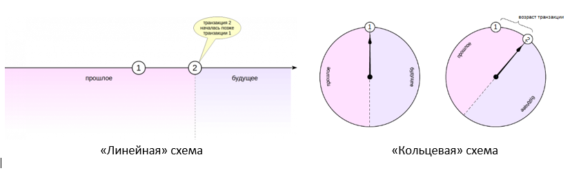
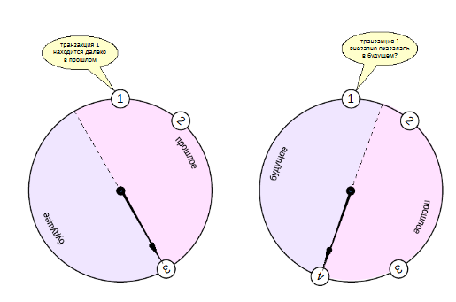
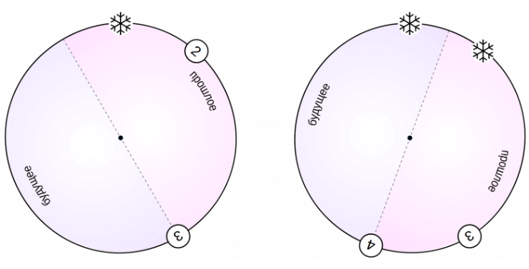
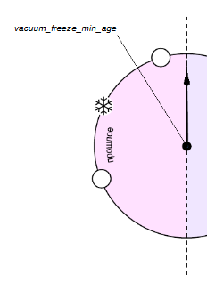
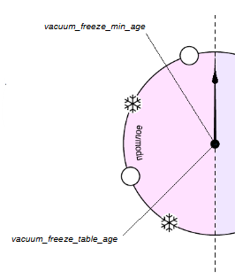
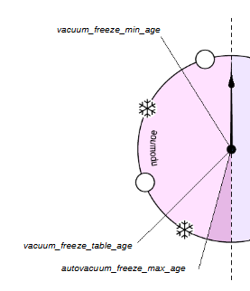

Заморозка
#########

Каждой транзакции присваивается уникальный идентификатор VirtualTransactionId (также именуемый virtualXID или vxid), 
который состоит из идентификатора обслуживающего процесса (или backendID) и последовательно назначаемого номера — внутреннего для такого обслуживающего процесса (или localXID). 

Например, виртуальный идентификатор 4/12532 состоит из следующих компонентов: backendID со значением 4 и localXID со значением 12532.

Невиртуальные идентификаторы TransactionId (или xid), например 278394, последовательно выбираются для транзакций из глобального счётчика, 
который используется всеми базами данных в рамках кластера PostgreSQL. Значение присваивается *при первой операции записи* транзакции в базу данных. 
Это означает, что транзакции с меньшими xid начинают запись раньше транзакций с большими xid. 
При этом порядок, в котором транзакции выполняют запись в базу данных впервые, может отличаться от порядка, в котором они запускаются, 
особенно если транзакции начинаются с операторов, выполняющих только операции чтения.

Внутренний тип идентификаторов транзакций xid имеет размер 32 бита, и значения в нём повторяются через каждые 4 миллиарда транзакций. 
  
Идентификаторы используются в качестве основы механизма многоверсионного управления конкурентным доступом MVCC PostgreSQL.

4 миллиарда - значение большое, но достижимое. Например, при нагрузке 1000 транзакций в секунду это произойдет всего через полтора месяца непрерывной работы.
Когда номера закончатся, то на этом закончится многоверсионность. Кластер столкнётся с зацикливанием идентификаторов транзакций: 
счётчик XID прокрутится до нуля, и внезапно транзакции, которые относились к прошлому, окажутся в будущем — это означает, 
что их результаты станут невидимыми. А это **катастрофическая потеря данных**. На самом деле данные в файлах останутся, но получить их будет нельзя.

Для того чтобы этого избежать, необходимо выполнять очистку для каждой таблицы в каждой базе данных как минимум единожды на два миллиарда транзакций.

Периодическое выполнение очистки решает эту проблему, потому что процедура VACUUM помечает строки как *замороженные*, 
указывая, что они были вставлены транзакцией, зафиксированной достаточно давно, так что эффект добавляющей транзакции с точки зрения 
MVCC определённо будет виден во всех текущих и будущих транзакциях. 

Вместо "линейной" схемы возраста транзакций используется схема "кольцо":

	   
Для любой транзакции половина номеров «против часовой стрелки» считается принадлежащей прошлому, а половина «по часовой стрелке» — будущему.
Возрастом транзакции называется число транзакций, прошедших с момента ее появления в системе (независимо от того, переходил ли счетчик через ноль или нет).

Например, на рисунке выше возраст транзакции 1 становится равным 1, когда появляется транзакция 2. (В действительности, номера транзакций 0-2 зарезерывированы).

Ситуация, которая может привести к краху возникает, когда транзакция, находившаяся в далеком прошлом, через некоторое время окажется в той половине круга, 
которая относится к будущему. Отсюда нарушение правил видимости и ошибка.

	   

Обычные значения XID сравниваются по модулю 2^32. Это означает, что для каждого обычного XID существуют два миллиарда значений XID, которые «старше» него, 
и два миллиарда значений, которые «младше» него; другими словами, пространство значений XID циклично и не имеет конечной точки. 
Следовательно, как только создаётся версия строки с обычным XID, для следующих двух миллиардов транзакций эта версия строки оказывается «в прошлом», 
неважно о каком значении обычного XID идет речь. 
Если после двух миллиардов транзакций эта версия строки всё ещё существует, она внезапно окажется в будущем. 
Для того чтобы это предотвратить, в какой-то момент значение XID для старых версий строк должно быть заменено на FrozenTransactionId 
(заморожено) до того, как будет достигнута граница в два миллиарда транзакций. 

Чтобы не допустить подобных конфликтов, процесс очистки кроме непосредственно очистки осуествляет поиск старых и «холоднхе» версий строк 
(которые видны во всех снимках и изменение которых уже маловероятно) и специальным образом помечает —  «замораживает» — их. 
Замороженная версия строки считается старше любых обычных данных и всегда видна во всех снимках данных. 
При этом уже не требуется смотреть на номер транзакции *xmin*, и этот номер может быть безопасно использован заново. 
Таким образом, замороженные версии строк всегда остаются в прошлом.
Задача заморозки и состоит в том, чтобы гарантировать отсутствие очень старых номеров в поле *xmin*.

	   
Признаком "замораживания" xmin у старой версии строки выставляются одновременно оба бита-подсказки — бит фиксации и бит отмены (xmin_committed, xmin_aborted)
При этом xmax замораживать не нужно. Ее наличие означает, что данная версия строки больше не актуальна. 
После того, как она перестанет быть видимой в снимках данных, такая версия строки будет очищена.
Сам номер в xmin остается для цели отладки.

.. important:: Важно, чтобы версии строк замораживались вовремя. 
			   Если возникнет ситуация, при которой еще не замороженный номер транзакции рискует попасть в будущее, PostgreSQL аварийно остановится. 

Это возможнов двух случаях: либо транзакция не завершена и, следовательно, не может быть заморожена, либо не сработала очистка.
При запуске сервера транзакция будет автоматически отменена; дальше администратор должен вручную выполнить очистку, и после этого система сможет продолжить работу.

Настройка заморозки
*******************

https://postgrespro.ru/docs/postgresql/16/routine-vacuuming#VACUUM-FOR-WRAPAROUND

Заморозкой управляют четыре основных параметра. 

vacuum_freeze_min_age
-----------------------

Параметр **vacuum_freeze_min_age** определяет минимальный возраст транзакции xmin, с которого начинается заморозка.
То есть насколько старым должен стать XID, чтобы строки с таким XID были заморожены. 
Увеличение его значения помогает избежать ненужной работы, то есть строки активно изменяются и их пока не надо замораживать.
А уменьшение приводит к увеличению количества транзакций, которые могут выполниться, прежде чем потребуется очередная очистка таблицы.
Поэтому более молодые версии строк замораживаются только в тех случаях, когда это точно не добавляет работы, например, если в странице уже требуется заморозка других 
(более старых) строк или при полной очистке таблицы. 

.. important:: Очистка просматривает только страницы, не отмеченные в карте видимости. 

Если на странице остались только актуальные версии, то очистка не придет в такую страницу и не заморозит их. 
В заголовке табличной страницы также имеется признак видимости всех версий строк в ней; очистка использует его вместе с соответствующей отметкой в карте видимости.
Таким образом, обычная команда VACUUM не всегда замораживает все старые версии строк, имеющиеся в таблице. 
Когда это имеет место, операция VACUUM в конце концов должна провести *агрессивную очистку* и заморозить все подходящие незамороженные значения XID и MXID, 
в том числе на полностью видимых, но не полностью замороженных страницах.

.. note:: На практике периодическая агрессивная очистка требуется для большинства таблиц. 

::

	SHOW vacuum_freeze_min_age;
	
	50000000

vacuum_freeze_table_age
-----------------------

Параметр *vacuum_freeze_table_age* определяет возраст транзакции, при котором пора выполнять заморозку версий строк на всех страницах таблицы. 
Такая заморозка называется "агрессивной". 

Для каждой таблицы хранится номер транзакции (*pg_class.relfrozenxid*), для которого известно, что в версиях строк не осталось более старых незамороженных номеров транзакций. 
Возраст этой транзакциии сравнивается со значением параметра.

Чтобы не просматривать всю таблицу целиком, вместе с картой видимости ведется карта заморозки.  

До версии PostgreSQL 9.6 карта видимости содержала один бит на страницу; в ней отмечались страницы, содержащие только «достаточно старые» версии строк, 
которые уже гарантированно видны во всех снимках. Идея здесь в том, что если страница отмечена в карте видимости, то для ее версий строк не надо проверять правила видимости.
Начиная с версии 9.6 в этот же слой была добавлена карта заморозки — еще один бит на страницу. 
В ней отмечены страницы,в которых заморожены все версии строк. Такие страницы при заморозке можно пропускать.

Это не только существенно меньший объем работы, но и устойчивость к прерываниям: 
если процесс очистки остановить и начать заново, ему не придется снова просматривать страницы, которые он уже успел отметить в карте заморозки в прошлый раз.

Даже в агрессивном режиме все версии строк с транзакциями младше *vacuum_freeze_min_age* не замораживаются, 
поэтому после заморозки новый возраст транзакции *relfrozenxid* будет равен не нулю,а *vacuum_freeze_min_age*. 

*relfrozenxid* может увеличиться только при сканировании всех страниц таблицы, включая те, что могут содержать незамороженные XID.

Таким образом, заморозка всех страниц выполняется раз в (*vacuum_freeze_table_age − vacuum_freeze_min_age*) транзакций. 

::

	SHOW vacuum_freeze_table_age;
	
	150000000
	
Мы уже говорили, что слишком маленькое значение параметра *vacuum_freeze_min_age* увеличивает накладные расходы на очистку.
Но при больших значениях агрессивная заморозка будет выполняться слишком часто, что тоже плохо. Установка этого параметра требует компромисса.
(обычная реже, а агрессивная чаще)

autovacuum_freeze_max_age
-------------------------

Возраст принудительной заморозки

	   
Если возникнет ситуация, при которой еще не замороженная транзакция рискует попасть в будущее, PostgreSQL аварийно остановится, чтобы предотвратить возможные проблемы.

Причины:

- отключение автоочистки и отсутствие обычной очистки.

- автоочистка не приходит в базы данных, которые не используются (вспомните про параметр track_counts и базу данных template0).

- очистка пропускает таблицы, в которые данные только добавляются, но не удаляются и не изменяются.

Для этого предусмотрен параметр **autovacuum_freeze_max_age**. 

Если в какой-либо таблице какой-либо базы данных возможно наличие незамороженной транзакции старше указанного в параметре возраста, 
автоочистка запускается принудительно (даже если она отключена).

::

	SHOW autovacuum_freeze_max_age;
	
	200000000

Теоретический предел для *autovacuum_freeze_max_age* составляет **2 млрд транзакций**, а используется значение, в 10 раз меньшее. Это сделано для страховки: 
при увеличении значения повышается риск того, что за оставшееся время автоочистка просто не успеет заморозить все необходимые версии строк.

Кроме того, значение этого параметра определяет размер структуры CLOG: так как версии строк замораживаются, то их статус уже будет известен всем и искать 
его снова CLOG не нужно. Можно удалить эти сведения из CLOG.

.. important:: Изменение параметра autovacuum_freeze_max_age требует перезапуска сервера. 

.. note:: Единственный минус увеличения autovacuum_freeze_max_age (и vacuum_freeze_table_age с ним) заключается в том, что подкаталоги pg_xact и pg_commit_ts 
          в кластере баз данных будут занимать больше места, поскольку в них нужно будет хранить статус и (при включённом track_commit_timestamp) 
		  время фиксации всех транзакций вплоть до горизонта autovacuum_freeze_max_age. Для статуса фиксации используется по два бита на транзакцию, 
		  поэтому если в autovacuum_freeze_max_age установлено максимально допустимое значение в два миллиарда, то размер pg_xact может составить примерно половину 
		  гигабайта, а pg_commit_ts примерно 20 ГБ. Если по сравнению с объёмом вашей базы данных этот объём незначителен, 
		  тогда рекомендуется установить для autovacuum_freeze_max_age максимально допустимое значение. 
		  В противном случае установите значение этого параметра в зависимости от объёма, который вы готовы выделить для pg_xact и pg_commit_ts. 
		  (Значению по умолчанию, 200 миллионам транзакций, соответствует приблизительно 50 МБ в pg_xact и около 2 ГБ в pg_commit_ts.)

Если администратор понимает, что автоочистка не успеет заморозить версии строк до переполнения счетчика транзакций, 
можно воспользоваться ручной очисткой с параметром **index_cleanup off**.

::

	VACUUM (index_cleanup off)

В этом случае индексы не будут очищаться, но за счет этого версии строк в таблицах будут заморожены быстрее.

vacuum_failsafe_age
--------------------

Крайние меры.

Параметр vacuum_failsafe_age управляет включением защитного режима работы очистки, который служит для ускорения заморозки номеров транзакций. 

В этом режиме будут отменены регламентные задержки *autovacuum_vacuum_cost_delay* и *vacuum_cost_delay*. Также не будут выполняться некоторые необязательные работы 
(например очистка индексов). Такие меры позволят очистке быстрее заморозить старые транзакции и перейти в обычный режим работы.

https://www.postgresql.org/docs/16/runtime-config-client.html

https://www.postgresql.org/docs/16/runtime-config-autovacuum.html

Практика:
*********

Заморозка

1. Установим для демонстрации параметры заморозки.

::

	ALTER SYSTEM SET vacuum_freeze_min_age = 1;

Возраст, после которого будет выполняться заморозка всех страниц:

::

	ALTER SYSTEM SET vacuum_freeze_table_age = 3;

Отключить автоматическую очистку, чтобы запускать ее вручную в нужный момент для эксперимента.

::

	ALTER SYSTEM SET autovacuum = off;

	SELECT pg_reload_conf();

Создадим таблицу с данными. Установим минимальный fillfactor: на каждой странице будет всего две строки.

::

	CREATE TABLE t(id integer, s char(300)) WITH (fillfactor = 10);
	
300 символов лат алфавита + заголовок равно примерно 320Б. 10% страницы - 819 Б. 2*320 = 640 Б. Третья строка не влазит.

Создадим представление для наблюдения за битами-подсказками на первых двух страницах таблицы.

Интерес представляют только xmin_comm и  xmin_aborted, которые относятся к нему, поскольку версии строк с ненулевым xmax будут очищены. 
Кроме того, выведем и возраст транзакции xmin.

::

	CREATE EXTENSION pageinspect;

::

	CREATE VIEW t_v AS
	SELECT '('||blkno||','||lp||')' as ctid,
		   CASE lp_flags
			 WHEN 0 THEN 'unused'
			 WHEN 1 THEN 'normal'
			 WHEN 2 THEN 'redirect to '||lp_off
			 WHEN 3 THEN 'dead'
		   END AS state,
		   t_xmin AS xmin,
		   age(t_xmin) AS xmin_age,
		   CASE WHEN (t_infomask & 256) > 0 THEN 't' END AS xmin_c,
		   CASE WHEN (t_infomask & 512) > 0 THEN 't' END AS xmin_a,
		   t_xmax AS xmax
	FROM (
	  SELECT 0 blkno, * FROM heap_page_items(get_raw_page('t',0))
	  UNION ALL
	  SELECT 1 blkno, * FROM heap_page_items(get_raw_page('t',1))
	) q
	ORDER BY blkno, lp;

Функция age(t_xmin) - вычисление возраста транзакции.

Для исследования карты видимости и заморозки использовать расширение **pg_visibility**:

::

	CREATE EXTENSION pg_visibility;

Вставляем данные. Сразу выполним очистку, чтобы заполнить карту видимости.

::

	INSERT INTO t(id, s) SELECT g.id, 'FOO' FROM generate_series(1,100) g(id);
	
	VACUUM t;

После очистки обе страницы отмечены в карте видимости (all_visible):

::

	SELECT * FROM generate_series(0,1) g(blkno), pg_visibility_map('t',g.blkno) ORDER BY g.blkno;
	
	
	 blkno | all_visible | all_frozen 
	-------+-------------+------------
	     0 | t           | f
	     1 | t           | f

Каков возраст транзакции, создавшей строки?

::

	SELECT * FROM t_v;

	ctid  | state  | xmin | xmin_age | xmin_c | xmin_a | xmax 
	-------+--------+------+----------+--------+--------+------
	 (0,1) | normal |  748 |        1 | t      |        |    0
	 (0,2) | normal |  748 |        1 | t      |        |    0
	 (1,1) | normal |  748 |        1 | t      |        |    0
	 (1,2) | normal |  748 |        1 | t      |        |    0
	(4 rows)

Возраст равен 1; версии строк с такой транзакцией еще не будут заморожены.

Обновим строку на нулевой странице. Новая версия попадет на ту же страницу благодаря небольшому значению fillfactor.

::

	UPDATE t SET s = 'BAR' WHERE id = 1;

::

	SELECT * FROM t_v;
	
	 ctid  | state  | xmin | xmin_age | xmin_c | xmin_a | xmax 
	-------+--------+------+----------+--------+--------+------
	 (0,1) | normal |  748 |        2 | t      |        |  749
	 (0,2) | normal |  748 |        2 | t      |        |    0
	 (0,3) | normal |  749 |        1 |        |        |    0
	 (1,1) | normal |  748 |        2 | t      |        |    0
	 (1,2) | normal |  748 |        2 | t      |        |    0
	(5 rows)

Сейчас нулевая страница уже будет обработана заморозкой:

- возраст транзакции превышает значение, установленное в vacuum_freeze_min_age;

- страница изменена и исключена из карты видимости.

::

	SELECT * FROM generate_series(0,1) g(blkno), pg_visibility_map('t',g.blkno) ORDER BY g.blkno;
	
	 blkno | all_visible | all_frozen 
	-------+-------------+------------
	     0 | f           | f
	     1 | t           | f
	(2 rows)

Выполняем очистку.

::

	VACUUM t;

Очистка обработала измененную страницу. У одной версии строки установлены оба бита — это признак заморозки. 
Другая версия строки слишком молода, однако тоже была заморожена при проходе страницы (это позволило отметить нулевую страницу в карте заморозки):

::

	SELECT * FROM t_v;
	
	 ctid  |     state     | xmin | xmin_age | xmin_c | xmin_a | xmax 
	-------+---------------+------+----------+--------+--------+------
	 (0,1) | redirect to 3 |      |          |        |        |     
	 (0,2) | normal        |  748 |        2 | t      | t      |    0
	 (0,3) | normal        |  749 |        1 | t      | t      |    0
	 (1,1) | normal        |  748 |        2 | t      |        |    0
	 (1,2) | normal        |  748 |        2 | t      |        |    0
	(5 rows)

Теперь обе страницы отмечены в карте видимости (все версии строк на них актуальны). 
Очистка теперь не будет обрабатывать ни одну из этих страниц, и незамороженные версии строк на первой странице так и останутся незамороженными.
::

	SELECT * FROM generate_series(0,1) g(blkno), pg_visibility_map('t',g.blkno) ORDER BY g.blkno;
	
	
	 blkno | all_visible | all_frozen 
	-------+-------------+------------
	     0 | t           | t
	     1 | t           | f
	(2 rows)

Именно для такого случая и требуется параметр vacuum_freeze_table_age, определяющий, в какой момент нужно просмотреть страницы, отмеченные в карте видимости, если они не отмечены в карте заморозки.

Для каждой таблицы сохраняется наибольший номер транзакции, для которого все версии строк с меньшими номерами xmin гарантированно заморожены. Ее возраст и сравнивается со значением параметра.

::

	SELECT relfrozenxid, age(relfrozenxid) FROM pg_class WHERE relname = 't';
	
	 relfrozenxid | age 
	--------------+-----
	          748 |   2
	(1 row)

Сымитируем выполнение еще одной транзакции, чтобы возраст relfrozenxid таблицы достиг значения параметра vacuum_freeze_table_age.
::
	
	SELECT pg_current_xact_id();
 
	 pg_current_xact_id 
	--------------------
	                750
	(1 row)

::

	SELECT relfrozenxid, age(relfrozenxid) FROM pg_class WHERE relname = 't';

	relfrozenxid | age 
	--------------+-----
	          748 |   3

::

	VACUUM t;

Теперь, поскольку гарантированно была проверена вся таблица, номер замороженной транзакции можно увеличить — мы уверены, 
что в страницах не осталось более старой незамороженной транзакции.

::

	SELECT relfrozenxid, age(relfrozenxid) FROM pg_class WHERE relname = 't';

	relfrozenxid | age 
	--------------+-----
	          751 |   0
	(1 row)

Вот что получилось в страницах:

::

	SELECT * FROM t_v;
 
	 ctid  |     state     | xmin | xmin_age | xmin_c | xmin_a | xmax 
	-------+---------------+------+----------+--------+--------+------
	 (0,1) | redirect to 3 |      |          |        |        |     
	 (0,2) | normal        |  748 |        3 | t      | t      |    0
	 (0,3) | normal        |  749 |        2 | t      | t      |    0
	 (1,1) | normal        |  748 |        3 | t      | t      |    0
	 (1,2) | normal        |  748 |        3 | t      | t      |    0
	(5 rows)

Обе страницы теперь отмечены в карте заморозки.

::

	SELECT * FROM generate_series(0,1) g(blkno), pg_visibility_map('t',g.blkno)

	ORDER BY g.blkno;
	 blkno | all_visible | all_frozen 
	-------+-------------+------------
	     0 | t           | t
	     1 | t           | t
	(2 rows)

Номер последней замороженной транзакции есть и на уровне всей БД:

::

	SELECT datname, datfrozenxid, age(datfrozenxid) FROM pg_database;
	
	   datname   | datfrozenxid | age 
	-------------+--------------+-----
	 postgres    |          722 |  29
	 student     |          722 |  29
	 template1   |          722 |  29
	 template0   |          722 |  29
	 mvcc_freeze |          722 |  29
	(5 rows)

Он устанавливается в минимальное значение из relfrozenxid всех таблиц этой БД. 
Если возраст datfrozenxid превысит значение параметра autovacuum_freeze_max_age, автоочистка будет запущена принудительно.

Ручная заморозка
****************

Несмотря на то, что во время работы автоочистки при необходимости выполняется и заморозка, иногда бывает удобно управлять заморозкой вручную.
Команда VACUUM, как и автоочистка, выполнит заморозкув соответствии с настройками.

Если выполнить команду VACUUM FREEZE, будут заморожены все версии строк без оглядки на возраст транзакций (
как будто параметры vacuum_freeze_min_age и vacuum_freeze_table_age равны нулю).

При перестройке таблицы командами VACUUM FULL или CLUSTER все строки также замораживаются.

https://postgrespro.ru/docs/postgresql/16/sql-vacuum

Данные можно заморозить и при начальной загрузке с помощью команды COPY, указав параметр FREEZE. 
Для этого таблица должна быть создана (или опустошена командой TRUNCATE) в той же транзакции, что и COPY. 
Поскольку для замороженных строк действуют отдельные правила видимости, такие строки будут видны в снимках данных других транзакций в нарушение обычных 
правил изоляции (для транзакций с уровнем Repeatable Read или Serializable), но обычно это не представляет проблемы. 

https://postgrespro.ru/docs/postgresql/16/sql-copy

Текущая реализация такой заморозки для таблиц с TOAST полноценно обрабатывает только основную часть таблицы, 
а в  карте видимости признак видимости всех строк не проставляется. А это означает дополнительный проход по всем страницам при последующей очистке.

Практика:
*********

1. Проверьте с помощью расширения pageinspect, что при использовании команды COPY … WITH FREEZE версии строк действительно замораживаются.

2. Убедитесь, что даже на уровне изоляции Repeatable Read строки, загруженные командой COPY … WITH FREEZE, оказываются видны в снимке данных.

3. Уменьшив значение параметра autovacuum_freeze_max_age и отключив автоочистку, воспроизведите ситуацию принудительного срабатывания автоочистки, 
выполнив соответствующее количество транзакций. Учтите, что срабатывание произойдет не сразу, а при выполнении ручной очистки какой-нибудь таблицы(или при перезапуске сервера)

