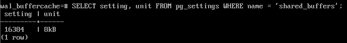

Буферный кэш
#############

Кэширование — это стратегия оптимизации, которая заключается во временном хранении часто запрашиваемых данных, которые могут быть запрошены с наибольшей вероятностью,
 в специальном буфере, называемом кэшем. Оно позволяет ускорить доступ к информации, поскольку её не нужно каждый раз извлекать из постоянного хранилища, например из базы данных, с диска или удалённого сервера.

Кэш — это память с большей скоростью доступа, предназначенная для ускорения обращения к данным, содержащимся постоянно в памяти с меньшей скоростью доступа.
Кэширование применяется ЦПУ, жёсткими дисками, браузерами, веб-серверами, службами DNS и WINS.

Любой кеш нужен для того, чтобы сглаживать разницу в производительности двух типов памяти, быстрой и маленькойс и медленной, но большой.
Буферный кеш также обеспечивает сглаживание разницы между временем доступа к оперативной памяти (наносекунды) и к дисковой (миллисекунды). 
Пока страница находится в кеше, имеется экономия на обращениях к диску.

У операционной системы тоже есть дисковый кеш, который решает ту же самую задачу и обычно СУБД стараются избегать двойного кеширования, обращаясь к диску напрямую, минуя кеш ОС. 
Но в случае PostgreSQL это не так: все данные читаются и записываются с помощью обычных файловых операций.

Буферный кеш располагается в общей памяти сервера и представляет собой массив буферов.

	   
Буферный кеш располагается в **общей памяти** сервера и доступен *всем процессам*. Чтобы работать с данными — читать или изменять, — процессы читают страницы в кеш. 
Пока страница находится в кеше, работа с ней происходит в оперативной памяти и тем самым происходит экономия на обращениях к диску.
 
Каждый буфер хранит одну страницу данных и заголовок. 

Заголовок содержит, в числе прочего:

- расположение страницы на диске (файл и номер страницы в нем);

- число обращений к буферу (счетчик usage count, увеличивается каждый раз, когда процесс читает или изменяет буфер);

- признак того, что данные на странице изменились и рано или поздно должны быть записаны на диск (такой буфер называют грязным). Страница прочитана в буфер, изменена, но
пока еще не записана на диск;

- признак закрепления (счетчик pin count количества процессов, работающих  в данный момент с содержимым буфера). 

Указатель на свободные буферы. Когда сервер запускается, то все страцы провязаны в список свободных буферов. По мере его заполнения этот список становится все меньше и меньше. 
С помощью указателя показан первый свободный буфер из оставшихся.

Указатель на следующую жертву используется при вытеснении. 

Чтобы быстро находить нужную страницу в кеше, используется хеш-таблица. Ключом хэширования в хэш-таблице служит идентификатор страницы и можно
быстро получить ссылку на тот буфер в буферном кэше, в котором, предположительно, можно найти необходимую страницу.

Размер буферного кеша задается параметром **shared_buffers**. Его изменение *требует перезапуска* сервера.

По умолчанию размер буферного кэша 128 мегабайт. Это очень мало по своременным меркам и требует изменения.

Обнаружение страницы страницы в кэше
************************************

Когда процессу требуется прочитать страницу, он сначала пытается найти ее в буферном кеше с помощью *хеш-таблицы*.
Ключом хеширования служит файл и номер страницы внутри файла; получив номер буфера, процесс быстро проверяет, 
действительно ли он содержит нужную страницу, так как возможны коллизии. Если они есть, то таком случае процессу придется проверить несколько страниц. 

Если нужная страница найдена в кеше, процесс "закрепляет" буфер, увеличивая счетчик *pin count*. Такжже увеличивается число обращений (счетчик *usage count*). 
Буфер могут закреплять несколько процессов одновременно, поэтому используется именно счетчик этих процессов.

Пока буфер закреплен (значение pin count больше нуля), считается,что буфер используется и его содержимое не должно "радикально" измениться. 
Страницу можно читать и изменять. Например, процесс может добавить версию строки в закрепленную страницу, может удалить версию строки, то есть пометить ее как удаленную. 

Но **закрепленный буфер нельзя очищать**, и его нельзя вытеснить и заменить другой страницей.

	   

Практика:
=========

::

	CREATE DATABASE wal_buffercache;

::

	\c wal_buffercache
Создать таблицу с одной строкой:

::

	CREATE TABLE test(
	  t text
	)
	WITH (autovacuum_enabled = off);

::

	INSERT INTO test VALUES ('a row');

в PostgreSQL, существует расширение, которое позволяет заглянуть внутрь буферного кеша  **pg_buffercache**, включающего в себя одноименное представление и дополнительные функции:

::

	CREATE EXTENSION pg_buffercache;

Представление для расшифровки некоторых столбцов:

Условие на базу данных необходимо, так как в буферном кеше содержатся данные всего кластера. 
Расшифровать мы можем только информацию из той БД, к которой подключены. Глобальные объекты считаются принадлежащими БД с нулевым OID.

::

	CREATE VIEW pg_buffercache_v AS
	SELECT bufferid,
		   (SELECT c.relname
			FROM   pg_class c
			WHERE  pg_relation_filenode(c.oid) = b.relfilenode
		   ) relname,
		   CASE relforknumber
			 WHEN 0 THEN 'main'
			 WHEN 1 THEN 'fsm'
			 WHEN 2 THEN 'vm'
		   END relfork,
		   relblocknumber,
		   isdirty,
		   usagecount
	FROM   pg_buffercache b
	WHERE  b.reldatabase IN (
			 0, (SELECT oid FROM pg_database WHERE datname = current_database())
		   )
	AND    b.usagecount IS NOT NULL;
	CREATE VIEW

В буферном кеше уже находятся страницы таблицы; они появились при выполнении вставки:

::

	SELECT * FROM pg_buffercache_v WHERE relname = 'test';
		

Команда EXPLAIN с указанием analyze и buffers показывает использование буферного кеша при выполнении запроса:

::

	EXPLAIN (analyze,buffers,costs off,timing off,summary off)
	SELECT * FROM test;
		

Строка «Buffers: shared hit=1» говорит о том, что страница была найдена в кеше.

После выполнения запроса счетчик использования увеличился на единицу:

::

	SELECT * FROM pg_buffercache_v WHERE relname = 'test';

Выполнить очистку:

::

	VACUUM test;
	

Очистка создала карту видимости (одна страница) и карту свободного пространства (три страницы — минимальный размер этой карты).

Выполнить предыдщую команду:

::

	\g
	

	   
Чтение страницы с диска
***********************

В свободный буфер
=================

C случае, когда страница не найдена в кэше ее необходимо считать с диска в какой-либо буфер.

1. Если список свободных буферов не пустой, то поиск подходящего буфера будет проходить по нему.

2. Найденный по указателю буфер закрепляется, в него читается необходимая страница, число обращений устанавливается в единицу.

3. Указатель на свободный буфер передвигается на следующий по списку буфер, если он есть.

4. Ссылка на загруженную страницу прописывается в хеш-таблицу.

	   
.. note:: В редких случаях буферы полностью освобождаются. Это происходит либо при удалении или опустошении таблицы (DROP, TRUNCATE), тогда все буферы, которые содержали странички этой таблицы 
			просто обнуляются, и буферы возвращаются в список свободных. 
			
			При очистке VACUUM откусывает освобожденный кусок от конца таблицы и если эти страницы были в кэше, то они очищаются и возвращаются в
			список свободных буферов.

Практика:
--------

1. Перезагрузить сервер для сбросв кэша:

::

	sudo -u postgres pg_ctl -D /var/lib/pgsql/data restart
	
::

	psql -U postgres wal_buffercache
	
2. В кеше есть свободные буферы:

::

	SELECT count(*) FROM pg_buffercache WHERE usagecount IS NULL;
	

3. Выполнить запрос к таблице:

::

	EXPLAIN (analyze,buffers,costs off,timing off,summary off)
	SELECT * FROM test;
	

Строка «Buffers: shared read=1» показывает, что страницу пришлось прочитать с диска. 

Вот она:

::

	SELECT * FROM pg_buffercache_v WHERE relname = 'test';

Количество свободных буферов уменьшилось:

::

	SELECT count(*) FROM pg_buffercache WHERE usagecount IS NULL;

Страница, считанная из кэша не грязная, потому что мы в ней ничего не менялось.
Количество свободных буферов изменилось и не соответствует размеру одной страницы, потому что считаны были и страницы таблиц системного каталога, 
которые потребовались планировщику.

Чтение с вытеснением
********************

Когда свободные буферы заканчиваются, то PostgreSQL задействует механизм чтения с вытеснением.
Механизм вытеснения использует указатель на следующую "жертву".

Алгоритм (ClockSweep) состоит в том, чтобы перебирать по кругу все буферы, уменьшая их счетчики обращений (usage count) на единицу независимо от использования. 
Выбирается первый  же буфер, у которого значение счетчика равно нулю и который в принципе может быть занят новой страницей. 
Чем больше значение счетчика у буфера (то есть чем чаще он используется), тем больше у него шансов задержаться в кеше. 
Во избежание большого числа циклов прохождения в поиске наименее используемого буфера, максимальное значение счетчика обращений ограничено числом 5.

Процесс сначала обращается к буферу по указателю. Но буфер закреплен (то есть используется каким-то процессом), и поэтому страница не может быть вытеснена из него. 
Указатель перемещается к следующему буферу, но он, хотя и не закреплен, но недавно использовался (user_count>0). Поэтому user_count -= 1 и переход дальше.

В третьем буфере и pin_count=0 и user_count=0, поэтому страницу теоретически можно использовать. Но она оказалась "грязной" и сначала необходимо ее вытеснить на диск.

Подобная ситуация сильно снижает производительность Чтобы такую ситуацию предотвратить, есть специальный процесс *процесс фоновой записи*.
После вытеснения в данный буфер читается новая страницав счетчик обращения увеличивается на единицу. И он может увеличиваться до 5. 
То есть, с одной стороны, при обращении к буферу счетчик растет, с другой стороны, алгоритм вытеснения этот счетчик уменьшает. 

Настройка размера
*****************

.. note:: shared_buffers (integer) Задаёт объём памяти, который будет использовать сервер баз данных для буферов в разделяемой памяти. 
          По умолчанию это обычно 128 мегабайт (128MB), но может быть и меньше, если конфигурация вашего ядра накладывает дополнительные 
		  ограничения (это определяется в процессе initdb). Это значение не должно быть меньше 128 килобайт. 
		  Однако для хорошей производительности обычно требуются гораздо большие значения. Если это значение задаётся без единиц измерения, 
		  оно считается заданным в блоках (размер которых равен BLCKSZ байт, обычно это 8 КБ). 
		  Минимальное допустимое значение зависит от величины BLCKSZ. Задать этот параметр можно только при запуске сервера

::

	SELECT setting, unit FROM pg_settings WHERE name = 'shared_buffers';
	

	 

Даже самая большая база имеет ограниченный набор "горячих" данных, с которыми ведется активная работа в каждый момент времени. 
В идеале именно этот набор и должен помещаться в буферный кеш (плюс некоторое место для «одноразовых» данных). 
Если размер кеша будет меньше, то активно используемые страницы будут постоянно вытеснять друг друга, создавая избыточный ввод-вывод. 
При большом размере будут расти накладные расходы на его поддержание, и кроме того оперативная память требуется и для других нужд. Например, алгоритм вытеснения, 
который вынужден пробегать по кэшу в поисках свободной страницы. Ему необходимо просматривать полностью буферный кэш, например, при удалении таблицы. И чем он больше,
тем дольше просматривать.

Таким образом, оптимальный размер буферного кеша будет разным в разных системах: 
он зависит от данных, от приложения, от нагрузки. Строгих рекомендаций не существует.

Стандартная рекомендация — взять в качестве первого приближения 1/4 оперативной памяти. А дальше опытным путем добиваться лучших показателей производительности.
Увеличить или уменьшить размер кеша и сравнить характеристики системы (лучше иметь тестовый стенд и уметь воспроизводить типовую нагрузку).

PostgreSQL работает с диском через операционную систему и, таким образом, происходит двойное кеширование: 
страницы попадают как в буферный кеш, так и в кеш ОС. Таким образом, "непопадание" в буферный кеш не всегда приводит к необходимости реального ввода-вывода. 
Но стратегия вытеснения ОС не учитывает специфики баз данных.

Некоторую информацию о происходящем можно почерпнуть прямо на живой системе с помощью того же расширения pg_buffercache — главное, смотреть под нужным углом.

Например, можно изучить распределение буферов по степени их использования:

::

	SELECT usagecount, count(*)
	FROM pg_buffercache
	GROUP BY usagecount
	ORDER BY usagecount;

В данном случае много пустых значений счетчика — это свободные буферы, так как активной работы не происходит.

или так:

::

	SELECT usage_count, buffers AS count FROM pg_buffercache_usage_counts();

Функция *pg_buffercache_usage_counts()* возвращает набор строк со сводной информацией о состоянии всех общих буферов, 
агрегированных по возможным значениям счетчика использования.

Как и представление pg_buffercache, функция не использует блокировки менеджера буферов, поэтому при параллельной работе 
в базе данных возможна незначительная погрешность результатов функции.

Можно посмотреть, какая доля каких таблиц в нашей базе закеширована и насколько активно используются эти данные 
(под активным использованием в этом запросе понимаются буферы со счетчиком использования больше 3):

::

	SELECT c.relname,
	  count(*) blocks,
	  round( 100.0 * 8192 * count(*) / pg_table_size(c.oid) ) "% of rel",
	  round( 100.0 * 8192 * count(*) FILTER (WHERE b.usagecount > 3) / pg_table_size(c.oid) ) "% hot"
	FROM pg_buffercache b
	  JOIN pg_class c ON pg_relation_filenode(c.oid) = b.relfilenode
	WHERE  b.reldatabase IN (
			 0, (SELECT oid FROM pg_database WHERE datname = current_database())
		   )
	AND    b.usagecount is not null
	GROUP BY c.relname, c.oid
	ORDER BY 2 DESC
	LIMIT 10;
	

	   
Можно придумать и другие разрезы, которые дадут полезную информацию для размышлений. Надо только учитывать, что такие запросы:

- надо повторять несколько раз: цифры будут меняться в определенных пределах;

- не надо выполнять постоянно (как часть мониторинга) из-за того, что расширение кратковременно блокирует работу с буферным кешем.

Сводная информация о буферном кеше:

**pg_buffercache_summary()**

::

	SELECT * FROM pg_buffercache_summary() \gx
	
	

Массовое вытеснение
*******************

Бывают такие операции, которые сразу читают или меняют много данных. И здесь появляется опасность того, что такая операция будет вытеснять полезные данные из кэша. 
именно потому, что читается **большой** объем. Чтобы предотвратить такое вытеснение или *вымывание* кэша одноразовыми данными, 
В Postgres используется технология, которая называется **буферное кольцо** (buffer ring).

Для каждой операции выделяется небольшая часть буферного кеша. Вытеснение действует только в пределах кольца, 
поэтому остальные данные буферного кеша не страдают. Все данные "крутятся" в пределах кольца. При этом другие процессы могут использовать страницы, которые входят в кольцо

	   
Существуют стратегии, которые отличаются размером выделяемого кольца, и тем, что делать с грязными буферами, которые нежно вытеснять
	   
1. При последовательном чтении (sequential scan) таблиц, размер которых превышает 1/4 буферного кэша используется кольцо размером 32 страницы. 
Если при работе с этими данными появляются грязные буферы (в результате простановки битов-подсказок или при выполнении UPDATE), 
они отключаются от кольца, возвращаются в основной кеш и вытесняются затем уже на общих основаниях. 
А вместо отключенного буфера в кольцо из кеша подключается другой буфер. Такая стратегия рассчитана на то, что данные в основном читаются, а не изменяются.
Если в процессе чтения таблицы другому процессу тоже потребуются эти данные, он подключается к уже имеющемуся буферному кольцу,а потом отдельно дочитывает 
страницы, которых в кольце не было.

2. Для работы очистки используется кольцо, размер которого задается параметром *vacuum_buffer_usage_limit*. 
По умолчанию его значение невелико (32 страницы), так как замедление очистки обычно не столь критично, как замедление пользовательских процессов 
(исключение — защитный режим: в нем очистка может использовать весь кеш).

3. Для массовых операций записи, таких как COPY или CREATE TABLEAS SELECT, кольцо имеет достаточно большой размер 
(обычно 2048 страниц, но не больше одной восьмой всего буферного кеша). Кольцо делается больше, чтобы было время для вытеснения.

Практика:
---------

Для полного чтения таблиц, размер которых превышает четверть буферного кеша, используется буферное кольцо. 

1. Размер кеша (в страницах):

::

	SELECT setting FROM pg_settings WHERE name='shared_buffers';

2. Создать таблицу в четверть буфера. 4097 страниц с одной строкой в 1000 символов fillfactor 10%: 

::

	CREATE TABLE big(
	  id integer PRIMARY KEY GENERATED ALWAYS AS IDENTITY,
	  s char(1000)
	) WITH (fillfactor=10);
::

	INSERT INTO big(s) SELECT 'FOO' FROM generate_series(1,4096+1);
	
3. Проанализировать таблицу:

::

	ANALYZE big;

::

	SELECT relpages FROM pg_class WHERE oid = 'big'::regclass;
	

4. Перезагрузить сервер, чтобы сбросить буферный кеш.

::
	
	sudo -u postgres pg_ctl -D /var/lib/pgsql/data restart
	
::

	psql -U postgres wal_buffercache
	
И сбросить общую статистику ввода-вывода:

::

	SELECT pg_stat_reset_shared('io');

5. Прочитать данные из таблицы:

::

	EXPLAIN (analyze,buffers,costs off,timing off,summary off)
	SELECT count(*) FROM big;

Были прочитаны все страницы с данными, но сколько буферов кеша ими занято?

::

	SELECT count(*) FROM pg_buffercache_v WHERE relname = 'big';

При сканировании большой таблицы размер кольца — 32 буфера.

В 16-й версии PostgreSQL появилось представление pg_stat_io, которое показывает статистику ввода/вывода с точки зрения СУБД 
(кеширование на уровне ОС в нем не учитывается).

::

	SELECT context, reads, hits, reuses FROM pg_stat_io
	WHERE backend_type = 'client backend' AND
		  object = 'relation' AND
		  context IN ('normal', 'bulkread');
	  

Строка с контекстом normal показывает операции чтения-записи в общей части буферного кеша, а bulkread — в буферных кольцах.

reads — количество чтений из файла,
hits — сколько раз страница нашлась в кеше,
reuses — число повторных использований буферов в буферном кольце.

Разность между reads и reuses в строке bulkread равна размеру кольца (32).

А теперь сбросим статистику и изменим все строки таблицы. При этом буферы со страницами будут отсоединяться от буферного кольца и оставаться в кеше:

::

	SELECT pg_stat_reset_shared('io');
	
::

	EXPLAIN (analyze,buffers,costs off,timing off,summary off)
	UPDATE big SET s = s || '!';
	

Сейчас в кеше находятся все или почти все страницы таблицы, количество которых удвоилось из-за появления новых версий строк.
Обновление берет страницу, пытается поместить на нее измененную версию строки, а там нет места, поэтому версия строки помещается в другую страницу, и, 
соответственно, таблица в два раза выросла. 
::

	SELECT relfork, count(*) FROM pg_buffercache_v WHERE relname = 'big' GROUP BY relfork;
 

Еще раз заглянем в статистику.

::

	SELECT context, reads, hits, reuses FROM pg_stat_io
	WHERE backend_type = 'client backend' AND
        object = 'relation' AND
        context IN ('normal', 'bulkread');
	  
 

Таблица еще раз полностью сканируется через буферное кольцо. 
При этом 32 страницы остались в кольце от предыдущего сканирования, 
а остальные пришлось прочитать заново. Измененные страницы одна за другой передаются в общий кеш, 
обращения к ним учитываются в строке normal. 
При этом обновление каждой строки таблицы требует нескольких обращений к страницам, поэтому значение в поле hits довольно велико.

Все странички находятся в буферном кэше и кольцо фактически не действует. Идея обновлять большую таблицу полностью является плохой, 
потому что размер файла неизбежно увеличивается в два раза. 

.. important:: Правильный способ обновления огромной таблицы в PostgreSQL - это делать обновления небольшими порциями так, 
               чтобы между ними выполнялась очистка. 
			   
Временные таблицы
*****************

Исключением из общего правила являются временные таблицы. Поскольку временные данные видны только одному процессу, 
то они не используют разделяемый буферный кэш. 
Более того, временные данные существуют только в рамках одного сеанса, так что их не нужно защищать от сбоя.
Для временных данных используется облегченный *локальный кеш*.

Поскольку локальный кеш доступен только одному процессу, для него не требуются блокировки, поэтому работа с ним происходит быстрее, 
не нужно ничего журналировать, не жалко потерять эти данные, если произойдет какой-то сбой, потому что сеанс все равно прервется, 
а вне пределов этого сеанса временной таблицы не существует. 

Память выделяется по мере необходимости (в пределах, заданных параметром *temp_buffers*), ведь временные таблицы используются далеко не во всех сеансах. 
В локальном кеше используется обычный алгоритм вытеснения.

Практика:
=========

1. Создать временную таблицу с одной строкой:

::

	CREATE TEMP TABLE test_tmp(
	  t text
	);

::

	INSERT INTO test_tmp VALUES ('a row');

2. В плане выполнения запроса обращение к локальному кешу выглядит как «Buffers: local»:

::

	EXPLAIN (analyze,buffers,costs off,timing off,summary off)
	SELECT * FROM test_tmp;
	

::

	SELECT context, hits, extends FROM pg_stat_io
	WHERE backend_type = 'client backend' AND
		  object = 'temp relation' AND context = 'normal';
		  

Вставка строки привела к расширению таблицы (extends).

Прогрев кэша
************

В активно работающей системе после перезапуска сервера кэш пустой и поэтому некоторое время наблюдается снижение производительности.
Он еще не набрал необходимые данные.

Если это критично и какие-то таблицы совершенно точно должны быть в буферном кэше, например,справочники, к которым часто происходит обращение 
или что-то еще, то есть возможность сразу после старта прочитать в буферный кэш.

Это решение назыввается , которое называется **pg_prewarm** - прогрев кэша.

Расширение pg_prewarm позволяет в ручном режиме прочитать некоторые таблицы либо в кеш операционной системы, либо в буферный кеш СУБД тоже.

Расширение также позволяет в автоматическом режиме восстановить содержимое буферного кеша после перезапуска сервера. 

Для этого необходимо подключить библиотеку расширения, добавив еев параметр *shared_preload_libraries*. В этом случае система запустит фоновый процесс, 
который будет периодически записывать содержимое разделяемых буферов в файл *autoprewarm.blocks* с тем, чтобы эти блоки подгружались в память 
при запуске сервера, используя два дополнительных фоновых процесса.

https://postgrespro.ru/docs/postgresql/16/pgprewarm

Практика:
=========

::

	CREATE EXTENSION pg_prewarm;

Раньше расширение могло только читать определенные таблицы в буферный кеш (или только в кеш ОС). 
Но в версии PostgreSQL 11 оно получило возможность сохранять актуальное состояние кеша на диск и восстанавливать его же после 
перезагрузки сервера. Чтобы этим воспользоваться, надо добавить библиотеку в shared_preload_libraries и перезагрузить сервер.

::

	ALTER SYSTEM SET shared_preload_libraries = 'pg_prewarm';
	
::
	
	sudo -u postgres pg_ctl -D /var/lib/pgsql/data restart
	
::

	psql -U postgres wal_buffercache
	
Поле рестарта, если не менялось значение параметра *pg_prewarm.autoprewarm*, будет автоматически запущен фоновый процесс 
*autoprewarm master*, который раз в *pg_prewarm.autoprewarm_interval* будет сбрасывать на диск список страниц, находящихся 
в кеше (учесть новый процесс при установке max_parallel_processes).

::

	SELECT name, setting, unit FROM pg_settings WHERE name LIKE 'pg_prewarm%';
	
.. figure:: img/cash_28.png
       :scale: 100 %
       :align: center
       :alt: asda
	   

В новом сеансе выполнить:

::

	ps -o pid,command --ppid `head -n 1 /var/lib/pgsql/data/postmaster.pid` | grep prewarm
	
	SELECT name, setting, unit FROM pg_settings WHERE name LIKE 'pg_prewarm%';
	

В кэше нет таблицы:

::

	SELECT count(*)
	FROM pg_buffercache
	WHERE relfilenode = pg_relation_filenode('big'::regclass);

	   
Если она критески важна, то можно загрузить в кэш:

::

	SELECT pg_prewarm('big');

::

	SELECT count(*)
	FROM pg_buffercache
	WHERE relfilenode = pg_relation_filenode('big'::regclass);

Список страниц сбрасывается в файл autoprewarm.blocks. Чтобы его увидеть, можно подождать, 
пока процесс *autoprewarm master* отработает в первый раз, но мы инициируем это вручную:

::

	 SELECT autoprewarm_dump_now();

Число сброшенных страниц больше 4097 — сюда входят и уже прочитанные сервером страницы объектов системного каталога. 

Файл можно обнаружить на диске:

::

	 ls -l /var/lib/pgsql/data/autoprewarm.blocks
	 

Перезагрузить сервер и проверить наличие таблицы в кэше:

::
	
	sudo -u postgres pg_ctl -D /var/lib/pgsql/data restart
	
::

	psql -U postgres wal_buffercache

::

	SELECT count(*)
	FROM pg_buffercache
	WHERE relfilenode = pg_relation_filenode('big'::regclass);

Это обеспечивает тот же самый процесс *autoprewarm master*: он читает файл, разделяет страницы по базам данных, 
сортирует их (чтобы чтение с диска было по возможности последовательным) и передает отдельному рабочему процессу *autoprewarm worker* для обработки.

Практика:
*********

1. Создайте таблицу и вставьте в нее некоторое количество строк. Определите, сколько занимает таблица

а) страниц на диске,

б) буферов в кеше.

2. Узнайте количество грязных буферов в кеше на текущий момент. Выполните контрольную точку командой CHECKPOINT. Сколько грязных буферов осталось теперь?

3. Подключите библиотеку расширения pg_prewarm и проверьте, что после перезапуска сервера содержимое буферного кеша восстанавливается

