Журнал предзаписи (write-ahead log)
###################################

Во время работы сервера данные, которые хранятся в оперативной памяти, могут быть утеряны впоследствии сбоя.
При перезагрузке сервера будут использоваться только те данные, которые были сброшены на диск, а это не соответствует согласованному
состоянию базы. Из буферного кэша все потерялось. А ведь должно быть обеспечено выполнение свойства долговечности  (буква «D» из набора свойств транзакций ACID).
Поэтому все необходимое должно быть своевременно записано на диск (или другое энергонезависимое устройство).

Для этих целей вместе с изменением данных ведется еще и журнал этих изменений. 
Когда что-то меняется на странице в буферном кеше, создается запись об этом изменении в журнале. 
Запись содержит минимальную информацию, достаточную для того, чтобы при необходимости изменение можно было повторить.

.. important:: Журнальная запись в обязательном порядке попадает на диск (или  другое энергонезависимое устройство) **до того**, 
               как туда попадет  измененная страница — отсюда и название: "журнал предзаписи",  "write-ahead log".
   
https://postgrespro.ru/docs/postgresql/16/wal-intro

Защита данных
*************

Журналировать нужно все операции, при выполнении которых есть риск получить несогласованность на диске в случае сбоя. 
В частности, в журнал записываются следующие действия:

В частности, в журнал записываются следующие действия:

- изменение страниц в буферном кеше (как правило, это страницы таблиц и индексов) — так как измененная страница попадает на диск не сразу;

- фиксация и отмена транзакций — точно так же, изменение статуса происходит в буфере CLOG и попадает на диск не сразу;

- файловые операции (создание и удаление файлов и каталогов, например, создание файлов при создании таблицы) — так как эти операции должны происходить синхронно с изменением данных.

В журнал *не записываются*:

- операции с нежурналируемыми таблицами — они на это и расчитаны;

- операции с временными таблицами — они существуют только в рамках сеанса, и поэтому не нуждаются в восстановлении.

Логическое предствление
*************************

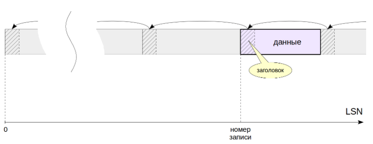
	   
Логически журнал можно представить себе как непрерывную последовательность записей различной длины. 

Каждая запись содержит данныео некоторой операции, предваренные заголовком. 

В заголовке,в числе прочего, указаны:

- номер транзакции, к которой относится запись;

- менеджер ресурсов — компонент системы, ответственный за данную запись, который понимает, как интерпретировать данные. 
Есть отдельные менеджеры для таблиц, для каждого типа индекса, для  статуса транзакций и т. п. Данные имеют разный формат и смысл. 
Например, они могут представлять собой некоторый фрагмент страницы, который надо записать поверх ее содержимого с определенным смещением. 
Указанный менеджер ресурсов «понимает», как интерпретировать данные в своей записи.

- контрольная сумма (CRC). Начиная с версии 16 расширения могут создавать собственные менеджеры ресурсов, использующие специфический формат для своих записей WAL. 
Это поможет разработчикам создавать расширения, реализующие новые табличные и индексные методы доступа.

- длина записи и ссылка на предыдущую запись.

https://postgrespro.ru/docs/postgresql/16/custom-rmgr

Для того чтобы сослаться на определенную запись, используется тип данных **pg_lsn** (LSN = log sequence number) — 64-битное число, 
представляющее собой байтовое смещение до записи относительно начала журнала.

Начало каждой записи выравнивается по границе машинного слова,это одна из причин двоичной несовместимости WAL на разных платформах.

https://postgrespro.ru/docs/postgresql/16/datatype-pg-lsn

Практика
========

1. Список менеджеров ресурсов покажет утилита pg_waldump:

::

	/usr/bin/pg_waldump -r list
	
	
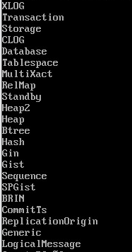
	   
	   
LSN выводится как два 32-битных числа в шестнадцатеричной системе через косую черту.

2. Текущая позиция в журнале:

::

	SELECT pg_current_wal_insert_lsn();
	
	
	
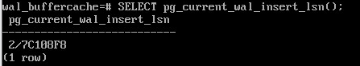

3. При помощи утилиты *pg_waldump* и появившегося в 15-й версии PostgreSQL расширения pg_walinspect 
можно исследовать содержимое журнала предзаписи.

Создадим базу данных и установим расширение (чтобы воспользоваться расширением, роль должна быть включена в pg_read_server_files или быть суперпользовательской):

::

	CREATE DATABASE wal_log;

::

	\c wal_log

::

	CREATE EXTENSION pg_walinspect;

Создать таблицу:

::

	CREATE TABLE t(note text);

Получить текущую позицию в журнале, после чего вставить в таблицу строку:

::

	SELECT pg_current_wal_insert_lsn();

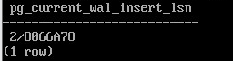

2/8066A78

::

	INSERT INTO t VALUES ('FOO');

Теперь позиция журнала такая:

::

	SELECT pg_current_wal_insert_lsn();

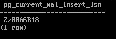

2/8066B18

Посмотрим, какие записи появились в журнале:

::

	SELECT resource_manager, record_length, xid, start_lsn, prev_lsn, record_type, description
	FROM pg_get_wal_records_info('2/8066A78','2/8066B18')
	WHERE record_type in('INSERT+INIT','COMMIT')
	ORDER BY start_lsn \gx
	
	
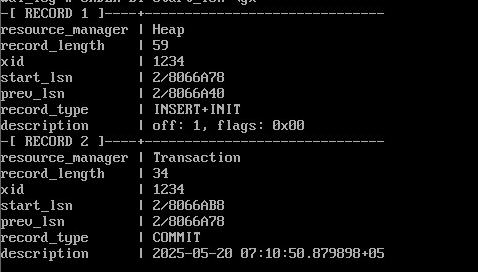

Операция INSERT+INIT инициализирует страницу и добавляет в нее версию строки, операция COMMIT фиксирует транзакцию.

Для записи INSERT+INIT в журнале сохраняется блок данных, содержащий значения полей вставляемой версии строки. 
Расширение позволяет увидеть эти данные (в столбце block_data можно различить коды символов добавленной строки):

::

	SELECT * FROM pg_get_wal_block_info('2/8066A78','2/8066B18') \gx
	
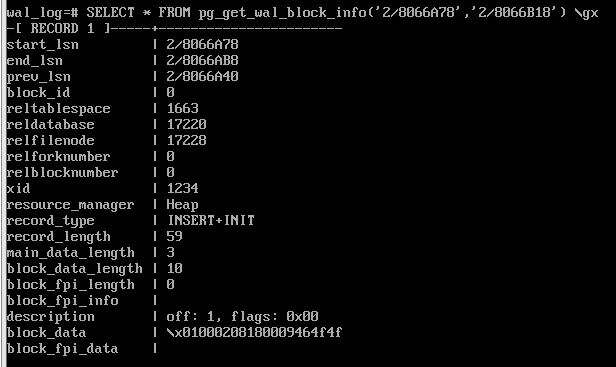
	   
Физическое устройство
*********************

На диске журнал хранится в виде файлов в каталоге $PGDATA/pg_wal. 

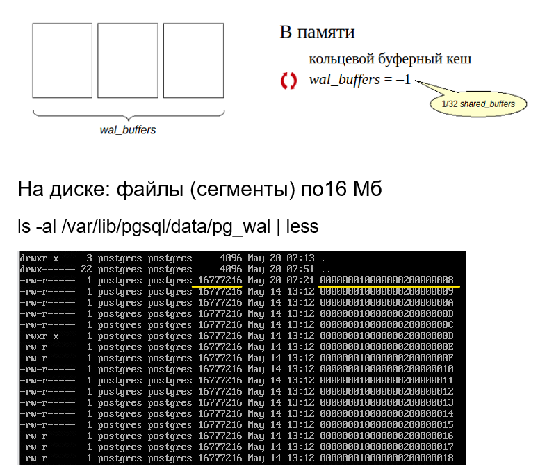
	   

Каждый файл по умолчанию занимает 16 Мб. Размер можно увеличить, чтобы избежать большого числа файлов в одном каталоге. 
Размер можно указать при инициализации кластера (ключ *--wal-segsize*).

Журнальные записи попадают в текущий использующийся файл; когда он заканчивается — начинает использоваться следующий.

В разделяемой памяти сервера для журнала выделены специальные буферы. Размер журнального кеша задается параметром **wal_buffers**
(значение по умолчанию подразумевает автоматическую настройку: выделяется 1/32 часть буферного кеша).

Журнальный кеш устроен наподобие буферного кеша, но работает преимущественно в режиме **кольцевого буфера**: 
записи добавляются в «голову», а записываются на диск с «хвоста».

Позиции записи («хвоста») и вставки («головы») показывают функции *pg_current_wal_lsn* и *g_current_wal_insert_lsn* соответственно:

::

	SELECT pg_current_wal_lsn(), pg_current_wal_insert_lsn();
	
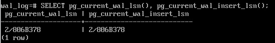

Для того, чтобы сослаться на определенную запись, используется тип данных **pg_lsn** (LSN = log sequence number) — это 64-битное число, представляющее собой байтовое смещение до записи относительно начала журнала. 
LSN выводится как два 32-битных числа в шестнадцатеричной системе через косую черту.

Можно узнать, в каком файле мы найдем нужную позицию, и с каким смещением от начала файла:

::

	SELECT file_name, upper(to_hex(file_offset)) file_offset FROM pg_walfile_name_offset('2/806B378');

Имя файла состоит из двух частей. Старшие 8 шестнадцатеричных разрядов показывают номер ветви времени 
(она используется при восстановлении из резервной копии), остаток соответствует старшим разрядам LSN (а оставшиеся младшие разряды LSN показывают смещение).

Практика
=========

Размер кеша журнала в общей памяти:

::

	SHOW wal_buffers;

wal_buffers 

4MB

Все журнальные файлы (сегменты) находятся в каталоге /var/lib/postgresql/16/main/pg_wal/, их также показывает специальная функция:

::

	SELECT * FROM pg_ls_waldir() LIMIT 10;

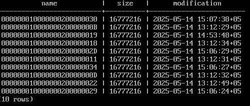
	   

Размер файлов можно задать при инициализации кластера, по умолчанию — 16 Мбайт.

Есть специальная функция, с помощью которой можно узнать, в каком файле будет производиться запись.
Эта функция называется  *pg_walfile_name*. Ей передается текущая позиция в журнале, которую мы выше узнавали. 
Запись INSERT+INIT находится в этом файле:

::

	SELECT pg_walfile_name('2/8066B18');

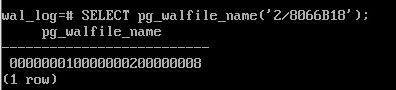
	   
Текущий сегмент:

::

	SELECT pg_walfile_name(pg_current_wal_insert_lsn());

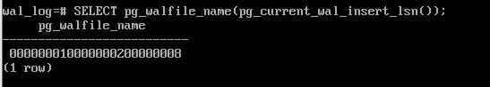

Механизм упреждающей записи
***************************

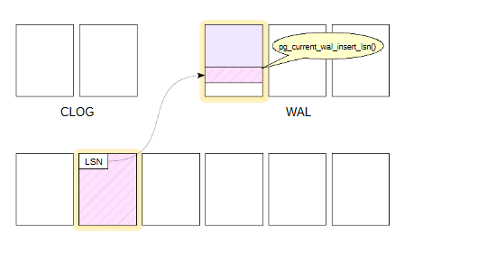

На слайде показаны три важные области общей памяти экземпляра:

- буферный кеш (размером shared_buffers),

- только что рассмотренный журнальный кеш WAL (размером wal_buffers),

- кеш состояния транзакций, называемый также CLOG (размером128 страниц).

При изменении страницы данных в буферном кеше формируется журнальная запись. 
Она помещается в страницу журнала, а ссылка на запись (а точнее ее LSN + длина, то есть LSN следующей записи) 
записывается в специальное поле LSN в заголовке страницы данных.

.. note:: Первые 24 байта каждой страницы состоят из заголовка страницы (PageHeaderData). 
          Первое поле (8 байт) содержит самую последнюю запись WAL, связанную с этой страницей. Поле pd_lsn - следующий байт после последнего байта записи WAL для последнего изменения на этой странице

Позицию для записи можно узнать с помощью функции **pg_current_wal_insert_lsn()**.

Страница и журнал связываются по номеру LSN.

Через некоторое время происходит фиксация транзакции. Для этого формируется еще одна журнальная запись, 
меняется бит состоянияна странице CLOG и ссылка на эту запись проставляется в поле LSN измененной страницы.

При вставке указатель **pg_current_wal_insert_lsn** сдвигается вперед.

В связи с тем, что журнал общий для всего кластера, то за время работы транзакции в WAL могли попасть записи, не относящиеся к текущей транзакции.

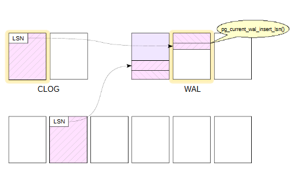

В журнале те записи, которые попали за время работы транзакции, отмечено штриховкой. 

После того, как записи попали в wal_buffers они должны быть записаны на диск. 

Функция **pg_current_wal_lsn()** показывает последнюю запись, уже дошедшую до диска.

wal_buffers представляет собой циклический буфер, в *голову* которого *добавляются* записи, а данные на диск записываются с "хвоста".

**pg_current_wal_insert_lsn** - - указатель на голову.

**pg_current_wal_lsn()** - указатель на хвост.

Все, что меньше значения возвращаемого функции pg_current_wal_lsn() гарантированно сохранено на диск.

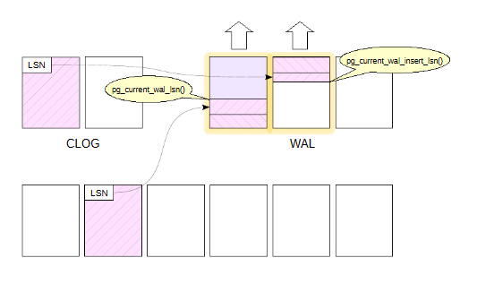

Необходимо записать то, что между "хвостом"  и "головой".

Данные со страниц на диск записываются только после того, как на диске окажутся записи из wal_buffers.

После этого мы уже можем записывать изменения, которые были сделаны в табличной странице, в наших табличных страницах. 
Порядок контролируетсяс учетом LSN последнего изменения страницы и текущего состояния pg_current_wal_lsn. 
При этом работа продолжается, в журнал будут попадать новые и новые записи. Главное, чтобы запись с LSN последнего изменения страницы уже была на диске.

Если при проверке lsn обнаружится, что lsn текущей сохраняесой страницы нет на диске в WAL, сохранение табличной страницы приостанавливается и запускается
процедура сохранения изменений в wal_buffers. 
Только после после этого пауза заканчивается и страница записывается на диск.

.. important:: Изменения буфера всегда должны попадать на диск перед тем, как туда попадут изменения страниц данных. 

Практика
========

Для просмотра заголовка табличной страницы понадобится расширение pageinspect:

::

	CREATE EXTENSION pageinspect;

Начать транзакцию:

::

	BEGIN;

Текущая позиция и текущий сегмент журнала:

::

	SELECT pg_current_wal_insert_lsn(), pg_walfile_name(pg_current_wal_insert_lsn());
	
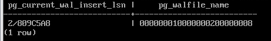

2/809C5A8
	   
Изменить строку в таблице:

::

	UPDATE t SET note = 'BAR';

Позиция в журнале изменилась:

::

	SELECT pg_current_wal_insert_lsn();

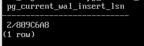

2/809C6A8
	   

Такой же номер LSN (или меньший, если в журнал попали дополнительные записи) мы найдем и в заголовке измененной страницы:

::

	SELECT lsn FROM page_header(get_raw_page('t',0));

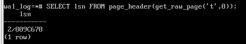

Завершим транзакцию.

::

	COMMIT;

Позиция в журнале снова изменилась:

::

	SELECT pg_current_wal_insert_lsn();

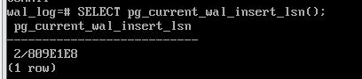

2/809C670

Размер фрагмента журнала (в байтах), соответствующий нашей транзакции:

::

	SELECT pg_wal_lsn_diff('2/809C670', '2/809C670');

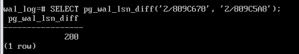

Разницу в записях можно использовать для расчета нагрузки.

Безусловно, в журнал попадает информация обо всех действиях во всем кластере, 
но в данном случае мы рассчитываем на то, что в системе ничего не происходит.

Вот сами записи:

::

	SELECT xid, record_type, record_length, end_lsn-start_lsn occupied
	FROM pg_get_wal_records_info('2/809C5A8', pg_current_wal_insert_lsn())
	ORDER BY start_lsn;

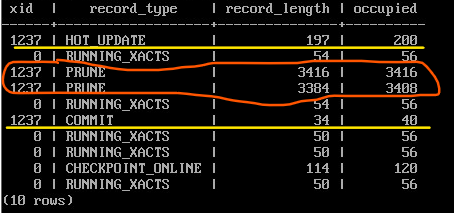

Заметим, что из-за выравнивания длина записи обычно меньше, чем занимаемое ей место (столбец occupied).

Увидеть содержимое журнала можно и с помощью утилиты pg_waldump. 

Она может работать с диапазоном LSN (как в этом примере), выбрать записи для определенного отношения и отдельного слоя, 
а также для отдельной страницы или указанной транзакции. В отличие от расширения pg_walinspect, утилитой можно пользоваться и на 
остановленном сервере, при этом ей нужен доступ на чтение журнальных файлов, поэтому мы выполним команду от имени суперпользователя:

::

	/usr/bin/pg_waldump -p /var/lib/pgsql/data/pg_wal -s 2/809C5A8 -e 2/809E2D0 000000010000000200000008 000000010000000200000008 | fold -sw 100
	
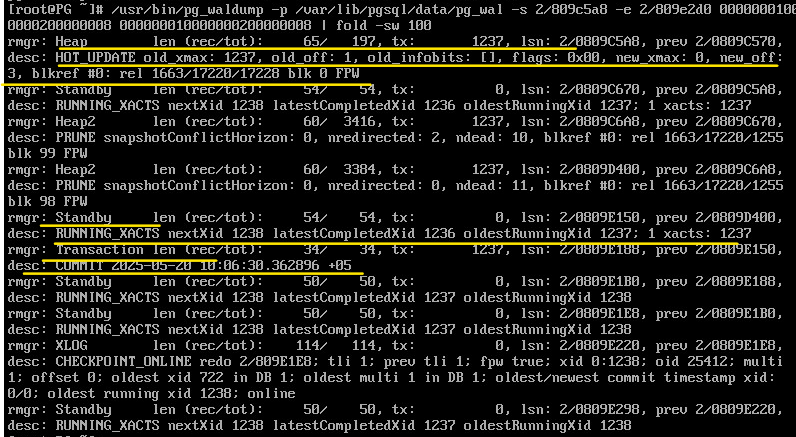

Мы видим заголовки журнальных записей:

операция HOT_UPDATE, относящаяся к измененной странице (rel+blk),
операция COMMIT с указанием времени.

Запись Standby говорит о том, что сохраняется в журнал список активных транзакций, и этот список нужен для того, чтобы корректно работала репликация.
И даже в том случае, если  репликация непосредственно не выполняется, то все равно включен такой режим, чтобы если вдруг включится репликация, то все будет работать.

Восстановление
**************

Когда мы стартуем сервер, первым делом запускается процесс postmaster, 
а он, в свою очередь, запускает процесс startup, задача которого — обеспечить восстановление, если произошел сбой.

Чтобы определить, требуется ли восстановление, startup заглядывает в специальный управляющий файл 

*$PGDATA/global/pg_control* и смотрит на статус кластера. Мы можем и сами проверить статус с помощью утилиты *pg_controldata*:

::

	/usr/bin/pg_controldata -D /var/lib/pgsql/data | grep state
	
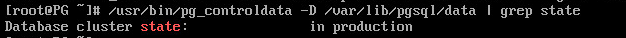
	   
У аккуратно остановленного сервера статус будет «shut down». Если сервер не работает, а статус остался «in production», 
это означает, что СУБД была остановлена некорректно (сбой) и тогда автоматически будет выполнено восстановление.

Для восстановления процесс startup будет последовательно читать журнал и применять записи к страницам, если в этом есть необходимость. 
Необходимость можно проверить, сравнив LSN страницы на диске с LSN журнальной записи. Если LSN страницы оказался больше, то запись применять не нужно. 
А на самом деле — даже и нельзя, потому что записи рассчитаны на строго последовательное применение.

Изменение страниц при восстановлении происходит в буферном кеше, как при обычной работе — для этого postmaster запускает необходимые фоновые процессы.

Аналогично журнальные записи применяются и к файлам: например, если запись говорит о том, что файл должен существовать, а его нет — файл создается.

Ну и в самом конце процесса восстановления все нежурналируемые таблицы перезаписываются «пустышками» из своих init-слоев.

Это сильно упрощенное изложение алгоритма. Определение позиции восстановления выполняется контрольной точкой.

В PostgreSQL 15 реализована возможность предвыборки данных журнала при восстановлении — за это отвечает параметр *recovery_prefetch*. 
По умолчанию его значение — *try* (предвыборка используется, если ее поддерживает ОС). Если предвыборка включена, то значение параметра
*wal_decode_buffer_size* определяет, как далеко сервер будет заглядывать в журнал, чтобы найти там номера нужных страниц.
 

 
Практика
********

1. Создайте таблицу с первичным ключом и добавьте в нее несколько строк. Сколько байт занимают сгенерированные журнальные записи?

2. Чем можно объяснить довольно большое их число?Просмотрите заголовки этих журнальных записейи проверьте свои предположения.

3. Измените добавленные в таблицу строки. Снова измените строки, но не фиксируйте транзакцию. 
Сымитируйте сбой, прервав процесс postmaster. Запустите сервер и убедитесь, что зафиксированные изменения не пропали, 
а незафиксированная транзакция оборвана. Найдите информацию о восстановлении после сбоя в журнале сообщений сервера. 
