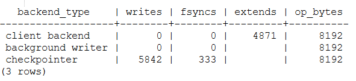

Контрольные точки
#################

При возникновении сбоя в системе необходимо выполнять восстановление. Оно будет происходить
по записям, которые были сохранены в журнале предзаписи (WAL). Но если просматривать и восстанавливать
все записи с момента начала работы сервера, то это займет огромное количество времени,
а также потребует сохранения всех файлов журнала. 

В связи с этим используется процедура **контрольной точки**.

.. note:: Контрольные точки — это точки в последовательности транзакций, в которых гарантируется, что файлы с данными и индексами были обновлены всей информацией, 
          записанной перед контрольной точкой. Во время выполнения контрольной точки все «грязные» страницы данных, находящиеся в памяти, сбрасываются на диск, а в файле WAL создаётся специальная запись контрольной точки. 

Страницы при этом из буферного кэша *не вытесняются*. После того как контрольная точка завершена, журнальные записи, предшествующие ее началу, больше не нужны для восстановления.

Выполнением контрольной точки занимается специальный фоновый процесс **checkpointer**.

Контрольная точка из точки превращается в отрезок. Сперва идет начало контрольной точки. 
После этого, не прерывая работу и по возможности не создавая пиковых нагрузок, грязные буферы сбрасываются на диск.

.. figure:: img/chpoint_01.png
       :scale: 100 %
       :align: center
       :alt: asda

Когда все буферы, которые были грязными на момент начала контрольной точки, окажутся записанными, контрольная точка считается завершенной. 
После этого с *момента начала* контрольной точки можно начинать восстановление. И журнальные записи вплоть до этого момента больше не нужны.

	   
Процесс
*******

В оперативной памяти существует несколько структур, которые должны быть сохранены на диск. 

1) Сначала процесс контрольной точки сбрасывает на диск буферы статуса транзакций (XACT). Поскольку их немного (всего 128), они записываются сразу же.

2) Вторым этапом (основная работа) является запись грязных страниц из буферного кеша. Сбросить все страницы одномоментно невозможно, поскольку размер буферного кеша может быть 
значительным. Поэтому сперва все грязные на текущий момент страницы *помечаются* в буферном кеше в заголовках специальным флагом.

.. figure:: img/chpoint_03.png
       :scale: 100 %
       :align: center
       :alt: asda

Затем процесс контрольной точки постепенно проходит по всем буферам и сбрасывает помеченные страницы на диск. Поэтому контрольная точка не обращает внимания на 
число обращений к буферу и признак закрепленности (страницы не вытесняются).

Буфер может сбрасываться не только контрольной точкой, но и обслуживающими процессами. Все они сначала ставят флаг записи, а потом его снимают. 
Так что буфер будет записан только один раз.

В процессе работы контрольной точки страницы продолжают изменяться в буферном кеше. 
Но они не рассматриваются процессом контрольной точки, так как на момент начала работы они не были грязными и не помечались.

Активность записи грязных буферов определяется значением параметра *checkpoint_completion_target*. 
Он показывает, какую часть времени между двумя соседними контрольными точками следует использовать для записи страниц. 
По умолчанию значение равно 0.9. Предполагается, что PostgreSQL завершит процедуру контрольной точки незадолго до следующей запланированной. 
Значения выше умолчательного 0.9 использовать не рекомендуется, поскольку фактически процесс может занять несколько больше времени, чем указано в параметре.

3) По окончании своей работы процесс создает журнальную запись об окончании контрольной точки. В этой записи содержится LSN момента начала работы контрольной точки. 
Поскольку контрольная точка ничего не записывает в журнал в начале своей работы, по этому LSN может находиться любая журнальная запись, относящаяся к любой транзакции.
Смысл этого LSN  в том, что на этот момент времени есть гарантия, что все сделанные к этому моменту изменения точно сохранены.

4) в файле *$PGDATA/global/pg_control* обновляется указание на последнюю пройденную контрольную точку. До того, как контрольная точка завершится, pg_control указывает на 
предыдущую контрольную точку. Это помогает быстро эту позицию найти, не обращаясь к журналу.

Все журнальные записи, сделанные до начала последней контрольной точки, уже хранить необязательно. 
Если журнал нужен только для цели восстановления после сбоя, можно их удалить. 
На практике удаляется целиком  файл, если он целиком состоит из таких записей, предшествующих последней контрольной точке.

Практика
========

Для наблюдения за процессом контрольной точки, создать какую-нибудь таблицу — ее страницы попадут в буферный кеш и будут грязными:

::

	CREATE TABLE chkpt AS SELECT * FROM generate_series(1,10000) AS g(n);
	CREATE EXTENSION pg_buffercache;
	SELECT count(*) FROM pg_buffercache WHERE isdirty;

	   
Запомнить текущую позицию в журнале:

::

	SELECT pg_current_wal_insert_lsn();	   
	

	
2/81649E8

Выполнить контрольную точку вручную и убедиться, что в кеше не осталось 
грязных страниц (как мы говорили, новые грязные страницы могут появляться, 
но в нашем случае никаких изменений в процессе выполнения контрольной точки 
не происходило):

::

	CHECKPOINT;
	
::

	SELECT count(*) FROM pg_buffercache WHERE isdirty;	
	

	
Контрольная точка в журнале:

::

	SELECT pg_current_wal_insert_lsn();
	
2/8164BB8

::

	/usr/bin/pg_waldump -p /var/lib/pgsql/data/pg_wal -s 2/81649E8 -e 2/8164BB8

Есть две записи. Последняя из них — запись о прохождении контрольной точки (CHECKPOINT_ONLINE). 
LSN начала контрольной точки указан после слова *redo*, и эта позиция соответствует журнальной записи, которая в момент начала контрольной точки была последней.

.. none:: REDO в PostgreSQL — это процесс повторного применения изменений к базе данных, которые были ранее записаны в файлах Write-Ahead Logging (WAL).

::

	/usr/bin/pg_controldata -D /var/lib/pgsql/data

Значения значения начала и окончания немного отличаются из-за времени на снятия скриншота.

Видим много справочной информации, из которой особый интерес представляют данные о последней контрольной точке и статус кластера: «in production».

В журнал попадает запись о том, что контрольная точка пройдена (CHECKPOINT_ONLINE):

::

	CREATE EXTENSION pg_walinspect;

::

	SELECT start_lsn, record_type,
	replace(description, ';', E'\n') AS description
	FROM pg_get_wal_records_info('2/81649E8','2/8164BB8')
	WHERE record_type = 'CHECKPOINT_ONLINE' \gx

В описании записи указан LSN начала контрольной точки (redo).

Сравним с данными управляющего файла:

::

	/usr/bin/pg_controldatapg_controldata -D /var/lib/pgsql/data | egrep 'Latest.*location'
	
Восстановление
**************

Если в работе сервера произошел сбой, то при последующем запуске процесс startup обнаруживает это (в файле **pg_control** статус отличенот **«shut down»**) 
и выполняет автоматическое восстановление.

1) Сначала процесс читает из того же файла (pg_control) LSN записи о последней завершенной контрольной точки. Из этой записи процесс узнает позицию LSN 
начала этой контрольной точки. Далее процесс startup читает журнал вперед от найденной позиции, последовательно применяя записи к страницам, если в этом есть необходимость 
(сравнивается LSN страницы на диске с LSN журнальной записи). Изменение страниц происходит в буферном кеше, как при обычной работе.

2) Записи, относящиеся к страницам CLOG, восстанавливают статус транзакций. Транзакции, не зафиксированные к концу восстановления, считаются оборванными; 
их изменения не видны в снимках данных. 

Аналогично записи применяются и к файлам: например, если запись говорит, что файл должен быть создан,  а его нет — файл создается.

3) В конце процесса все нежурналируемые таблицы перезаписываютсяс помощью образов в init-файлах. 

На этом процесс *startup* завершает работу, после чего процесс *checkpointer* выполняет контрольную точку, 
чтобы зафиксировать восстановленное состояние.

Практика
========

1) Имитация сбоя

::

	CREATE DATABASE wal_checkpoint;

::
	
	\c wal_checkpoint

::

	CREATE TABLE test(t text);

::

	INSERT INTO test VALUES ('Before failure');

::

	head -n 1 /var/lib/pgsql/data/postmaster.pid

20593

::

	kill -QUIT 20593
	
	
Сейчас на диске находятся журнальные записи, но табличные страницы не были сброшены на диск.

Проверить состояние кластера:

::

	/usr/bin/pg_controldata -D /var/pgsql/data | grep state
	

	   
Состояние не изменилось. При запуске PostgreSQL поймет, что произошел сбой и требуется восстановление.

::

	sudo -u postgres pg_ctl  -D /var/pgsql/data start

::

	tail -n 6 /var/pgsql/data/log/....log
	

	   
	   
::

	SELECT * FROM test;

Как видим, таблица и данные восстановлены.

Теперь остановим экземпляр корректно. При такой остановке PostgreSQL выполняет контрольную точку, чтобы сбросить на диск все данные.

=# \\q

::

	sudo -u postgres pg_ctl  -D /var/pgsql/data stop

Проверим состояние кластера:

Проверить состояние кластера:

::

	/usr/bin/pg_controldata -D /var/pgsql/data | grep state
	
::
	
	Database cluster state:               shut down

Теперь состояние — «shut down», что соответствует корректной остановке.

Настройка
**********

Обычно контрольная точка настраивается из следующих соображений.

Сначала надо определиться, какая частота срабатываний необходима (исходя из допустимого времени восстановления и 
объема журнальных файлов за это время при стандартной нагрузке). Контрольные точки довольно дороги с точки зрения ресурсов: 
во-первых, потому что они требуют записи всех «грязных» буферов из памяти на диск, и во-вторых, потому что они создают дополнительный трафик WAL.
Таким образом, параметры контрольных точек нужно устанавливать так, чтобы они не выполнялись слишком часто. 

Рассчитанное значение записывается в параметр *checkpoint_timeout* (значение по умолчанию — 5 минут — слишком мало, часто время увеличивают до получаса).

Число файлов сегментов WAL в каталоге **pg_wal** зависит от *min_wal_size*, *max_wal_size* и объёма WAL, сгенерированного в предыдущих циклах контрольных точек. 
Когда старые файлы сегментов оказываются не нужны, они удаляются или перерабатываются (то есть переименовываются, чтобы стать будущими сегментами в нумерованной последовательности). Если вследствие кратковременного скачка интенсивности записи в WAL предел max_wal_size превышается, ненужные файлы сегментов будут удаляться, пока система не опустится ниже этого предела. 
Однако возможна ситуация, когда нагрузка станет выше расчетной и за указанное время будет сгенерирован слишком большой объем журнальных записей. 
Для этого в параметре *max_wal_size* указывают общий допустимый объем журнальных записей, по умолчанию 1 Gb.

Для восстановления после сбоя сервер должен хранить файлы с момента начала последней завершенной контрольной точкидо начала текущей (объем  между контрольными точками) 
плюс файлы, накопившиеся во время работы текущей контрольной точки. 
Поэтому общий объем можно оценить как (1 + checkpoint_completion_target) * объем-между-контр-точками.

Таким образом большая часть контрольных точек происходитпо расписанию, раз в *checkpoint_timeout* единиц времени. 
Но при повышенной нагрузке контрольная точка вызывается  чаще, чтобы постараться уложиться в объем *max_wal_size*.

	
.. figure:: img/chpoint_15.png
       :scale: 100 %
       :align: center
       :alt: asda
	   

Значение max_wal_size может быть превышено:

- Параметр max_wal_size — только пожелание, но не жесткое ограничение. Может получиться и больше. Это ориентир для процесса *checkpointer*, 
влияющий на активность записи грязных буферов.

- Сервер не имеет права стереть журнальные файлы, еще не переданные через слоты репликации, и еще не записанные в архив при непрерывном архивировании. 
Если этот функционал используется, необходим постоянный мониторинг, потому что можно легко переполнить память сервера.

Можно на случай отставания реплики параметром *wal_keep_size* установить минимальный объем файлов журнала, остающихся после контрольной точки. 
Это не гарантирует, что журнальная запись сохранится до момента, когда она понадобится реплике, но все же позволяет работать без слота репликации.

По умолчанию журнальные файлы могут не удаляться, а просто переименовываться и использоваться заново. Параметр *min_wal_size* задает минимальный неудаляемый объем. 
Это позволяет сэкономить на постоянном создании и удалении файлов. Однако для файловых систем с copy-on-write быстрее создать новый файл, 
поэтому для них рекомендуется отключить переиспользование, установив *wal_recycle=off*.

По умолчанию:

- max_wal_size = 1GB

- wal_keep_size = 0

- wal_recycle = on

- min_wal_size = 80MB

https://postgrespro.ru/docs/postgresql/16/wal-configuration

https://postgrespro.ru/docs/postgresql/16/runtime-config-wal#RUNTIME-CONFIG-WAL-CHECKPOINTS

Практика:
=========

1. Запустить сервер:

::

	sudo -u postgres pg_ctl  -D /var/pgsql/data stop

2. Установить минимальное значение min_wal_size и отключить переиспользование, чтобы после контрольной точки оставалось не больше двух сегментов:

::

	psql wal_checkpoint

::

	ALTER SYSTEM SET min_wal_size = '32MB';
	ALTER SYSTEM SET wal_recycle = off;
	
::

	SELECT pg_reload_conf();

3. Добавить строки в таблицу

::

	INSERT INTO test SELECT g.id::text FROM generate_series(1, 1_000_000) AS g(id);
select 
Список файлов журнала:

::

	SELECT * FROM pg_ls_waldir() ORDER BY name;
	

Выполним вручную контрольную точку и опять посмотрим на журнал:

::

	CHECKPOINT;
	

::

	SELECT * FROM pg_ls_waldir() ORDER BY name;

После контрольной точки в журнале осталось не более двух сегментов, в том числе тот, который был текущим в момент ее начала. 
А если в кластере после начала контрольной точки происходили какие-либо изменения, в журнале могли появиться и другие сегменты.

Фоновая запись
**************

Когда обслуживающий процесс собирается вытеснить страницу из буфера, он может обнаружить, что буфер грязный, и ему придется записывать 
эту страницу на диск. Чтобы снизить вероятность таких ситуаций, в дополнение к процессу контрольной точки (checkpointer) существует также 
процесс фоновой записи (*background writer*, *bgwriter* или просто writer).

Процесс фоновой записи использует тот же самый алгоритм поиска буферов для вытеснения, что и обслуживающие процессы, только использует свой указатель. 
Он может опережать указатель на "жертву", но никогда не отстает от него.

Записываются буферы, которые одновременно:

- содержат измененные данные (грязные),

- не закреплены (pin count = 0),

- имеют нулевое число обращений (usage count = 0).

Таким образом, фоновый процесс записи, «забегая вперед», находит те буферы, которые с большой вероятностью вскоре потребуется вытеснить. 
За счет этого обслуживающий процесс скорее всего обнаружит, что выбранный им буфер не является грязным.

Процесс фоновой записи имеет смысл настраивать после того, как настроена контрольная точка. 
Совместно эти процессы должны успевать записывать грязные буферы до того, как они потребуются обслуживающим процессам.

Процесс фоновой записи работает циклами. За цикл обрабатывается максимум по *bgwriter_lru_maxpages* страниц (если будет 0 - то ничего не обрабатывается ). 
Между циклами есть пауза в *bgwriter_delay*.

Для определения точного числа буферов для записи используется скользящее среднее буферов, которые запрашивались *обслуживающими процессами* 
с прошлых циклов. Вычисленное количество буферов умножается на коэффициент *bgwriter_lru_multiplier*.

Если грязных буферов процесс не обнаружил (то есть в системе ничего не происходит), то он "заасыпает" или "впадает в спячку", 
из которой его выводит обращение серверного процесса за буфером. После этого процесс просыпается и опять работает обычным образом.

При необходимости записи большого количества данных сервер даёт указание ОС произвести промежуточный сброс данных в хранилище (fsync) по 
достижении объема, задаваемого параметром *bgwriter_flush_after*. 
Это уменьшает задержки фиксации транзакцийи выполнение синхронизации в конце контрольной точки

По умолчани:

- bgwriter_delay = 200ms

- bgwriter_lru_maxpages = 100

- bgwriter_lru_multiplier = 2.0

- bgwriter_flush_after = 512kB

Мониторинг
**********

Настройку контрольной точки и фоновой записи можно и нужно корректировать, получая обратную связь от мониторинга.

Параметр *checkpoint_warning* выводит предупреждение, если контрольные точки, вызванные переполнением размера 
журнальных файлов, выполняются слишком часто. Его значение по умолчанию — 30 секунд, и его надо привести 
в соответствие со значением *checkpoint_timeout*. Если это происходит регулярно, 
следует подумать об увеличении *max_wal_size* или уменьшении интервала между контрольными точками *checkpoint_timeout*.

Включенный по умолчанию параметр *log_checkpoints* выводит в журнал подробную информацию о каждой выполненной контрольной точке.

Когда сервер находится в режиме восстановления, можно следить за статусом процессов *startup* и *checkpointer* средствами операционной системы, 
например с помощью утилиты *ps*.

Статистику работы процессов, записывающих грязные буферы (контрольной точки, фоновой записи и обслуживающих процессов),
показывает представление *pg_stat_bgwriter*, а начиная с версии 16 — представление *pg_stat_io*.

Практика:
=========

1. Параметр *checkpoint_warning* выводит предупреждение, если контрольные точки, вызванные переполнением размера журнальных файлов, 
выполняются слишком часто. Его значение по умолчанию:

::

	SHOW checkpoint_warning;

30

Его следует привести в соответствие со значением checkpoint_timeout. 

2. Параметр log_checkpoints позволяет получать в журнале сообщений сервера информацию о выполняемых контрольных точках. 
По умолчанию (начиная с PostgreSQL 15) параметр включен:

::

	SHOW log_checkpoints;

::

	on

3. Вставить строки в таблицу, выполнить контрольную точку и проверить журнал:

::

	INSERT INTO test SELECT g.id::text FROM generate_series(1,100_000) AS g(id);

::

	CHECKPOINT;

Вот какую информацию можно узнать из журнала сообщений:

::

	tail -n 2 /var/lib/pgsql/data/log/

Статистика работы процессов контрольной точки и фоновой записи отражается в одном общем представлении 
(раньше обе задачи решались одним процессом; затем их функции разделили, но представление осталось).

::

	SELECT * FROM pg_stat_bgwriter \gx
	

	   
- checkpoints_timed — контрольные точки по расписанию (checkpoint_timeout);

- checkpoints_req — контрольные точки по требованию (max_wal_size) и выполненные вручную;

- buffers_checkpoint — страницы, сброшенные при контрольных точках;

- buffers_clean — страницы, сброшенные процессом фоновой записи;

- buffers_backend — страницы, сброшенные обслуживающими процессами;

- maxwritten_clean — количество остановок по достижению bgwriter_lru_maxpages.

В хорошо настроенной системе значение **buffers_backend** должно быть существенно меньше, чем сумма **buffers_checkpoint + buffers_clean**.

Большое значение **checkpoints_req** (по сравнению с **checkpoints_timed**) говорит о том, что контрольные точки происходят чаще, чем предполагалось.

Однако информация об объеме ввода-вывода, выдаваемая представлением **pg_stat_bgwriter**, не вполне корректна: в столбце buffers_backend 
отражены результаты работы не только клиентских процессов, но и некоторых других (например, автоочистки). 
В этот же столбец добавляются операции расширения файлов отношений, хотя это не запись из буферного кеша на диск.

Использование представления **pg_stat_io** предоставляет статистику в более информативном виде:

::

	SELECT backend_type,
	sum(writes) AS writes,
	sum(fsyncs) AS fsyncs,
	sum(extends) AS extends,
	op_bytes
	FROM pg_stat_io WHERE backend_type IN ('checkpointer', 'client backend', 'background writer')
	GROUP BY backend_type, op_bytes;

- writes — количество операций записи;

- fsyncs — количество вызовов fsync;

- extends — количество операций расширения отношений.

Практика
********

1. Настройте выполнение контрольной точки раз в 30 секунд. Установите параметры **min_wal_size** и **max_wal_size** в 16 МБ.

2. Несколько минут c помощью утилиты **pgbench** подавайте нагрузку 100 транзакций/сек.

3. Измерьте, какой объем журнальных файлов был сгенерирован за это время.

4. Проверьте данные статистики и оцените, какой объем приходится в среднем на одну контрольную точку.
Все ли контрольные точки выполнялись по расписанию? Как можно объяснить полученный результат?

5. Сбросьте настройки к значениям по умолчанию.