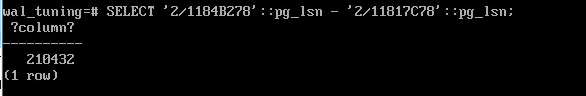

Настройка журнала
#################

Уровни журнала
**************

Кроме основной задачи — восстановления согласованности после сбоя — журнал можно использовать и для других целей, '
если добавить в него дополнительную информацию. Для этого существуют несколько уровней журнала, устанавливаемых параметром **wal_level**.

Уровень **minimal** содержит только информацию, необходимую для восстановления после сбоя. В журнал не записываются операции массовой обработки данных 
(такие, как CREATE TABLE AS SELECT, CREATE INDEX и т. п.), их долговечность гарантируется немедленной записью данных на диск.

Уровень **replica** (используется по умолчанию) позволяет восстанавливать систему из горячих резервных копий, сделанных утилитой **pg_basebackup**. 
Для этого в журнал записываются все изменения данных, включая операции массовой обработки. Уровень также позволяет организовать *репликацию* — передавать поток журнальных 
записей на другой сервер, для чего в журнал включается информация о ряде блокировок.

Уровень **logical** используется для логической репликации — он должен быть включен на сервере, публикующем изменения. Для правильной работы логического декодирования в 
журнал записывается дополнительная информация, позволяющая корректно расшифровать смысл операций по журнальным записям.

Чем выше уровень, тем больше информации попадает в журнал и, следовательно, тем больше его объем.

**Коротко:**

- **minimal** подходит для небольших баз данных, где нет репликации и восстановления на момент времени.

- **replica** необходим для настройки потоковой репликации базы данных и непрерывной архивации журнала WAL.
От основного сервера PostgreSQL на реплики передаётся журнал предзаписи транзакций (WAL). Каждая реплика затем по этому журналу изменяет свои данные. 
Для настройки такой репликации **все серверы должны быть одной версии, работать на одной ОС и архитектуре**.

- **logical** нужно установить, если планируется настраивать логическую репликацию баз данных.
Логическая репликация оперирует записями в таблицах PostgreSQL. Этот вид репликации построен на механизме публикации/подписки: один сервер публикует изменения, другой подписывается на них. 
При этом подписываться можно не на все изменения, а выборочно. Например, на основном сервере 50 таблиц: 25 из них могут копироваться на одну реплику, а 25 — на другую.

.. note:: Репликация PostgreSQL — это метод копирования данных с одного сервера базы данных на другой сервер в режиме реального времени. 
          Этот процесс обеспечивает безопасность и доступность данных, помогает поддерживать бесперебойную работу системы даже во время сбоев сервера. 
		  
		  Некоторые цели использования репликации:
		  
		  - Повышение отказоустойчивости. Если один из серверов выйдет из строя, то остальные продолжат работу.
		  
		  - Повышение производительности. Распределение данных по серверам в разных частях страны или мира повышает скорость доступа к данным для местных пользователей.

Практика:
=========

1. Создать новую БД и подключить в ней pg_walinspect;

::

	CREATE DATABASE wal_tuning;

	\c wal_tuning

::

	CREATE EXTENSION pg_walinspect;

minimal
-------

2. Установить для журнала уровень minimal (при этом придется также задать нулевое значение параметра max_wal_senders и перезапустить сервер).

.. note:: **max_wal_senders** (integer) - задаёт максимально допустимое число одновременных подключений ведомых серверов или клиентов потокового копирования 
		  (т. е. максимальное количество одновременно работающих процессов передачи WAL). Значение по умолчанию — 10. При значении 0 репликация отключается.

::

	ALTER SYSTEM SET wal_level = minimal;

	ALTER SYSTEM SET max_wal_senders = 0;

::

	\q
	sudo -u postgres pg_ctl -D /var/lib/pgsql/data restart
	
::

	psql -U postgres wal_tuning
	

3. Проверить запись в журнал команды CREATE TABLE AS SELECT.

::

	SELECT pg_current_wal_insert_lsn();

.. figure:: img/tun_01.png
       :scale: 100 %
       :align: center
       :alt: asda

2/11817C78

::

	CREATE TABLE t_wal(n) AS SELECT 1 FROM generate_series(1,3000);

::

	SELECT pg_current_wal_insert_lsn();

2/1184B278
	
4. Объем журнала:

=> SELECT '2/1184B278'::pg_lsn - '2/11817C78'::pg_lsn;

В журнале нет записей, описывающих вставку строк в таблицу:

::

	SELECT resource_manager, record_length, xid, start_lsn, record_type
	FROM pg_get_wal_records_info('2/11817C78','2/1184B278')
	WHERE record_type IN ('CREATE','INSERT+INIT','COMMIT')
	ORDER BY start_lsn;

На уровне *minimal* изменения, выполненные операторами CREATE TABLE AS SELECT, CREATE INDEX, TRUNCATE и некоторыми другими, не журналируются. 
Эти операторы всегда *сами выполняют синхронизацию*, обеспечивая долговечность. А журнал содержит только записи, необходимые для восстановления после сбоя.

replica
-------

Когда система восстанавливается из резервной копии, все начинается с некоторого состояния файловой системы и постепенно данные доходят до целевой точки восстановления, 
проигрыванием заархивированных журнальных записей. Количество таких записей может быть весьма велико (например, несколько дней), 
то есть период восстановления будет охватывать не одну контрольную точку, а множество. 
Поэтому минимального уровня журнала недостаточно — если какая-то операция не журналируется, то будет неизсвестно, что ее надо повторить. 
Для восстановления из резервной копии в журнал должны попадать все операции.

Уровень журнала, гарантирующий как возможность восстановления из резервной копии, так и возможность физической репликации, 
задается значением *wal_level = replica*.

Начиная с версии PostgreSQL 10 этот уровень установлен по умолчанию.

5. Удалть таблицу и вернуть уровень по умолчанию (replica).

::

	DROP TABLE t_wal;

::

	ALTER SYSTEM RESET wal_level;
	
	ALTER SYSTEM RESET max_wal_senders;

::
	
	\q
	sudo -u postgres pg_ctl -D /var/lib/pgsql/data restart
	
::

	psql -U postgres wal_tuning
::

	SHOW wal_level;

Посмотрим, как теперь записывается в журнал команда CREATE TABLE AS SELECT.

::

	SELECT pg_current_wal_insert_lsn();

	2/11851FB8

::

	CREATE TABLE t_wal(n) AS SELECT 1 FROM generate_series(1,3000);

::

	SELECT pg_current_wal_insert_lsn();
	
	2/11895710

Объем журнала увеличился:

::

	SELECT '2/11895710'::pg_lsn - '2/11851FB8'::pg_lsn;

	276312

Помимо изменений системного каталога, в журнал попадают записи:

- CREATE — создание файла отношения;

- INSERT+INIT — вставка строк в таблицу;

- COMMIT — фиксация транзакции.

::

	SELECT resource_manager, record_length, xid, start_lsn, record_type
	FROM pg_get_wal_records_info('2/11851FB8','2/11895710')
	WHERE record_type IN ('CREATE','INSERT+INIT','COMMIT')
	ORDER BY start_lsn;

Надежность записи
******************

Механизм журналирования должен быть надежным и давать гарантии возможности восстановления в любых ситуациях (исключая повреждение носителя данных). 
На надежность влияют много факторов. Одни из них:

- кеширование;

- повреждение данных;

- атомарность записи.

Кеширование
============

На пути данных к энергонезависимому хранилищу (такому, как пластина жесткого диска), стоят многочисленные кеши.

Когда программа обращается к ОС с требованием записать что-либо на диск, операционная система переносит данные в свой кеш в оперативной памяти. 
Фактическая запись происходит асинхронно, в зависимости от настроек планировщика ввода-вывода операционной системы.

Когда ОС решает записать данные, они попадают в кеш накопителя (жесткого диска). 
Электроника накопителя тоже может отложить запись, например, собирая данные в группы, которые более выгодно записать одновременно. 
А если используется RAID-контроллер, между ОС и диском появляется еще один уровень кеширования.

Таким образом, если не предпринять специальных мер, то нет понимаянмя, когда данные действительно будут надежным образом сохранены. 
В первую очередь, критически важно журналирование (если журнальная запись не дошла до диска, она пропадет вместе с остальным содержимым оперативной памяти) и 
контрольная точка (должна быть уверенность, что грязные страницы действительно записаны на диск). Но есть и другие ситуации, скажем, выполнение нежурналируемых операций 
на уровне minimal и др.

Операционная система предоставляет средства, которые должны гарантировать немедленную запись данных в энергонезависимую память. 
Когда PostgreSQL требуется надежно записать данные, он пользуется способом, указанным в параметре **wal_sync_method**.
Есть несколько вариантов, но они сводятся к двум основным: либо после записи дается команда синхронизации (fsync, fdatasync), 
либо при открытии файла (или записи в него) указывается специальный флаг необходимости синхронизации или даже прямой записи, минуя кеш ОС.

.. note:: **Fsync** — параметр конфигурации PostgreSQL, который контролирует физическую запись обновлений на диск. По умолчанию значение fsync — on.
          Функция fsync — принудительно сбрасывать данные из дискового кэша ОС на диск после завершения транзакций. Это гарантирует, что данные на диске всегда в актуальном состоянии.

..note:: **Fdatasync** — одно из возможных значений параметра wal_sync_method в PostgreSQL. Вызов метода fdatasync() происходит после каждого завершения транзакции (COMMIT). При этом записывается на диск содержимое всех буферов данных, связанных с файлом.
		 Основное отличие функций fsync и fdatasync заключается в том, что fsync синхронизирует данные и метаданные файла, а fdatasync — только данные. 
		 https://postgrespro.ru/docs/postgresql/16/runtime-config-wal#GUC-WAL-SYNC-METHOD

Важно учитывать, что методы записи зависят от операционной системы. В PostgreSQL есть утилита **pg_test_fsync**, которая позволяет определить оптимальный вариант параметра 
wal_sync_method для конкретной ОС.

При выборе метода важно учитывать характеристики аппаратуры. Например, если используется контроллер, поддержанный батареей резервного питания, 
нет резона не использовать его кеш, поскольку батарея позволит сохранить данные в случае сбоя электропитания. Но батарея обязательно должна быть.

Обычно, кеширование диска можно выключить; однако то, как это делается, различается для операционной системы и для типа диска:

.. note:: Например, в Linux параметры дисков IDE и SATA могут быть получены с помощью команды *hdparm -I*; кеширование записи включено, если за строкой Write cache следует *. 
			Для выключения кеширования записи может быть использована команда hdparm -W 0.

В любом случае синхронизация стоит дорого и выполняется не чаще, чем абсолютно необходимо

Синхронизацию можно отключить (за это отвечает параметр fsync), но в этом случае про надежность хранения следует забыть. 
Отключая fsync, вы соглашаетесь с тем, что данные могут быть безвозвратно потеряны в любой момент. 
Наверное, единственный разумный вариант использования этого параметра — временное увеличение производительности, когда данные можно легко восстановить 
из другого источника (например, при начальной миграции).
	   
https://postgrespro.ru/docs/postgresql/16/wal-reliability

Повреждение данных
===================

Во-вторых, данные могут быть повреждены на носителе, при передаче данных по интерфейсным кабелям и т. п. 
Часть таких ошибок обрабатывается на аппаратном уровне, но часть — нет.

Чтобы вовремя обнаружить возникшую проблему, журнальные записи всегда снабжаются **контрольными суммами**.

Страницы данных также можно защитить контрольными суммами.

Это лучше сделать сразу при инициализации кластера (*initdb -k*), но можно включить утилитой **pg_checksums** и потом, остановив сервер.

Каждая индивидуальная запись в WAL защищена с помощью контрольной суммы по алгоритму **CRC-32C** (32-bit), что позволяет судить о корректности данных в записи. 
Значение CRC устанавливается, когда ришется каждая запись WAL и проверяется в ходе восстановления после сбоя, восстановления из архива, и при репликации.

Страницы данных в настоящее время не защищаются контрольными суммами по умолчанию, хотя полные образы страниц, записанные в WAL, будут защищены.

.. important:: В производственной среде контрольные суммы должны быть включены обязательно, несмотря на накладные расходы на их вычислениеи контроль. 
               Иначе можно получить ситуацию, когда возникший сбойне будет вовремя обнаружен.

.. warning:: Уменьшает, но не устраняет.

			 Во-первых, контрольные суммы проверяются только при обращении к странице — поэтому повреждение может остаться незамеченным до момента, 
			 когда оно попадет во все резервные копии. Именно поэтому *pg_probackup* проверяет при резервном копировании контрольные суммы всех страниц кластера.
			 
			 Во-вторых, страница, заполненная нулями, считается корректной — если файловая система по ошибке «занулит» файл, это может остаться незамеченным.
			 
			 В-третьих, контрольные суммы защищают только основной слой файлов данных. Остальные слои и остальные файлы (например, статусы транзакций XACT) ничем не защищены.
	
Проверить, включены ли контрольные суммы, можно с помощью параметра *data_checksums* (только для чтения). 

Если данные невозможно восстановить из резервной копии, то параметр *ignore_checksum_failure* позволяет попробовать прочитать таблицу, естественно с риском получить 
искаженные данные, не прерываая транзакцию, прочитавшую сбойную страницу, но обычно его не следует включать.

Неатомарность записи
====================

Атомарность записи на диск означает, что в случае сбоя (например, остановки системы) изменения будут сохранены для всех объектов файловой системы, а не только для части из них. 

Операция записи целого файла не атомарна. Страница данных занимает 8 КБ (или больше: 16 КБ, 32 КБ), а на низком уровне запись происходит блоками, которые обычно имеют меньший размер (512 байт, 4 КБ, хотя бывают и другие размеры). 
Поэтому при сбое питания страница данных может записаться частично. При восстановлении бессмысленно применятьк такой странице обычные журнальные записи.

Для защиты PostgreSQL позволяет записывать в журнал образ всей страницы при первом ее изменении после контрольной точки — этим управляет параметр **full_page_writes**. 
Отключать его имеет смысл, только если используемая файловая система и аппаратура сами по себе гарантируют атомарность записи.

Если при восстановлении в журнале встречается образ страницы, то он безусловно записывается на диск (к нему больше доверия, так как он, как и всякая журнальная запись, 
защищен контрольной суммой). И далее к нему уже применяются обычные журнальные записи.

Хотя PostgreSQL исключает из полного образа страницы незанятое место, все же объем журнальных записей увеличивается. Если в кластере включены контрольные суммы страниц, 
при изменении битов-подсказок в журнале появляется дополнительная запись, отражающая изменение контрольной суммы.

Размер журнала можно уменьшить за счет сжатия полных образов, задав метод сжатия параметром *wal_compression*. Поддерживаются методы *pglz*, *lz4*, *zstd*. 
Значение on соответствует выбору *pglz*, *off* отключает сжатие.

Практика
--------

1. Проверить расчет контрольных сумм:

::

	SHOW data_checksums;
	
	off
	
2. Выключить сервер и установить расчет контрольных сумм:

.. note:: Утилита *pg_checksums* в PostgreSQL позволяет проверить, включить или отключить контрольные суммы данных в кластере. 
		  Перед её запуском сервер должен быть остановлен в штатном режиме.  
		  
		  *pg_checksums -D /путь/к/каталогу/данных --check* - проверяет целостность файлов данных в каталоге и сообщает об обнаруженных ошибках. Если ошибок нет, возвращается нулевой код состояния. Если найдена хотя бы одна ошибка, возвращается ненулевой код. 
          
		  *pg_checksums --enable -D /путь/к/каталогу/данных* - Эта команда включает контрольные суммы для каталога данных
		  
		  *pg_checksums --disable -D /путь/к/каталогу/данных* - Эта команда отключает контрольные суммы для каталога данных

::

	\q
	
	sudo -u postgres pg_ctl -D /var/lib/pgsql/data stop
	
	sudo -u postgres pg_checksums --enable -D /var/lib/pgsql/data
	

3. Запустить сервер:

::

	sudo -u postgres pg_ctl -D /var/lib/pgsql/data start
	
	psql -U postgres wal_tuning
	
	SHOW data_checksums;
	
	on
	
4. Создать таблицу:

::

	CREATE TABLE t(id integer);

::

	INSERT INTO t VALUES (1),(2),(3);

Файл, в котором находятся данные:

::

	SELECT pg_relation_filepath('t');
	

5. Остановить сервер и поменять несколько байтов в странице (стереть из заголовка LSN последней журнальной записи).

::
	
	\q
	
	sudo -u postgres pg_ctl -D /var/lib/pgsql/data stop
	
	sudo -u postgres dd if=/dev/zero of=/var/lib/pgsql/data/base/33604/33618 oflag=dsync conv=notrunc bs=1 count=8
	

Можно было бы и не останавливать сервер. Достаточно, чтобы:

- страница записалась на диск и была вытеснена из кеша;

- произошло повреждение;

- страница была прочитана с диска.

6. Запустить сервер:

::
	
	sudo -u postgres -D /var/lib/pgsql/data start
	psql -U postgres wal_tuning

7. Попробовать прочитать таблицу:

::

	SELECT * FROM t;

Параметр *ignore_checksum_failure* позволяет попытаться все-таки прочитать таблицу, 
хоть и с риском получить искаженные данные (например, если нет резервной копии):

::

	SET ignore_checksum_failure = on;

::

	SELECT * FROM t;
	

Производительность
******************

При обычной работе сервера происходит постоянная последовательная запись журнальных файлов. 
Поскольку отсутствует случайный доступ, с этой задачей справляются и обычные HDD-диски. Но такой характер нагрузки существенно отличается от того, 
как происходит доступ к файлам данных. Поэтому обычно **выгодно размещать журнал на отдельном физическом диске** (или дисковом массиве), примонтированном к файловой системе сервера.
Вместо каталога $PGDATA/pg_wal нужно *создать символьную ссылку* на соответствующий каталог.

.. note:: Однако есть ситуация, при которой журнальные файлы необходимо читать (кроме понятного случая восстановления после сбоя). Она возникает, если используется потоковая репликация и реплика не успевает получать журнальные записи, пока они еще находятсяв буферах оперативной памяти основного сервера. 
          Тогда процессу **walsender** приходится читать нужные данные с диска.
		  
Для мониторинга и оценки производительности работы WALв PostgreSQL версии 14 было добавлено представление **pg_stat_wal**.

Запись журнала происходит в одном из двух режимов:

- синхронном — при фиксации транзакции продолжение работы невозможно до тех пор, пока все журнальные записи об этой транзакции не окажутся на диске;

- асинхронном — транзакция завершается немедленно, а журнал записывается в фоновом режиме.

Синхронный режим
================

Синхронный режим определяется параметром *synchronous_commit* и включен по умолчанию.

Так как синхронизация связана с реальным (то есть медленным) вводом-выводом, выгодно выполнять ее как можно реже. 
Для этого обслуживающий процесс, завершающий транзакцию и записывающий журнал, делает небольшую паузу, определяемую параметром *commit_delay*. 
Но происходит это только в том случае, если в системе имеется не менее *commit_siblings* активных транзакций. 
Расчет на то, что за время ожидания некоторые транзакции успеют завершиться и можно будет синхронизировать их записи за один проход. 

По умолчанию:

- параметр commit_siblings = 5

- commit_delay = 0, так что фактически ожидания не происходит. 

Изменять *commit_delay* имеет смысл только в системах, выполняющих большое количество коротких *OLTP-транзакций*.

.. note:: *OLTP-транзакция (Online Transaction Processing)* — это транзакция в системе обработки транзакций в реальном времени. Она включает в себя вставку, обновление или удаление информации.
			
			Примеры OLTP-транзакций:
			
			- Банковская система для обработки транзакций. Банки используют OLTP-системы для обработки тысяч транзакций, 
			  таких как переводы между счетами, платежи по кредитным картам или депозиты.
            
			- Система управления заказами в интернет-магазине. Когда клиент оформляет заказ, система записывает данные о товаре, 
			  проверяет его наличие на складе, резервирует товар, обновляет информацию в реальном времени, а также фиксирует оплату.
            
			- Система учёта сотрудников в крупной компании. В крупных организациях OLTP-системы используются для управления данными сотрудников, их рабочими часами, 
			  начислением заработной платы и учётом отпусков.

При синхронной записи **гарантируется долговечность** — если транзакция зафиксирована, то все ее журнальные записи уже есть на диске и не будут потеряны. 
Обратная сторона состоит в том, что *синхронная запись увеличивает время отклика* (команда COMMIT не возвращает управление до окончания синхронизации) 
и снижает производительность системы.

Асинхронная запись
==================

Однако для коротких транзакций данная задержка будет основной составляющей общего времени транзакции. 
В режиме асинхронного подтверждения сервер сообщает об успешном завершении сразу, как только транзакция будет завершена логически, 
прежде чем сгенерированные записи WAL фактически будут записаны на диск. Это может значительно увеличить производительность при выполнении небольших транзакций.

Асинхронную запись можно получить, установ *synchronous_commit = off* (или local).

При асинхронной записи работает процесс *wal writer*, сбрасывая накопившиеся журнальные записи либо через *wal_writer_delay=200ms* единиц времени, 
либо по достижении объема *wal_writer_flush_after*.

- Если с прошлого раза в буферах была целиком заполнена одна или несколько страниц, сбрасываются только такие, полностью заполненные, 
страницы (или часть таких страниц; вспомним,что журнальный кеш представляет собой кольцевой буфер — записывается только непрерывная последовательность страниц и  
запись останавливается, дойдя до конца кеша, и продолжается с начала кеша уже в следующий раз). 
При большом потоке изменений это позволяет не синхронизировать одну и ту же страницу несколько раз.

- Если же заполненные страницы не появились, записывается текущая (не до конца заполненная) страница журнала

Асинхронная запись эффективнее синхронной — фиксация изменений не ждет записи. 
Однако надежность уменьшается: зафиксированные данные могут пропасть в случае сбоя, если между фиксацией и сбоем прошло менее *3 × wal_writer_delay* единиц времени, 
потому что *WAL writer* разработан так, чтобы сразу сохранять целые страницы во время периодов занятости.

Например, банк конечно не должен использовать асинхронное подтверждение для транзакций в банкоматах, выдающих наличные. 
Но во многих случаях, таких как журналирование событий, столь серьёзная гарантия сохранности данных не нужна.

Параметр *synchronous_commit* можно устанавливать *в рамках транзакций*. Это позволяет увеличивать производительность, жертвуя надежностью только части транзакций.

В реальности оба режима работают совместно. 
Журнальные записи долгой транзакции будут записываться асинхронно (чтобы освободить буферы WAL). 
А если при сбросе грязного буфера окажется, что соответствующая журнальная запись еще не на диске, она тут же будет сброшена в синхронном режиме.

Некоторые команды, например *DROP TABLE*, принудительно запускают синхронное подтверждение транзакции, независимо от значения *synchronous_commit*. 
Это сделано для того, чтобы иметь уверенность в целостности данных между файловой системой сервера и логическим состоянием базы данных.

.. warning:: Режим немедленного завершения работы (**immediate**) эквивалентен краху сервера и приведёт, таким образом, к потере всех не сохранённых асинхронных транзакций.

https://postgrespro.ru/docs/postgresql/16/wal-async-commit

Практика
========

1. Режим, включенный по умолчанию, — синхронная фиксация.

::

	SHOW synchronous_commit;
	
	on

2. Запустить  тест производительности с помощью утилиты **pgbench**. 

2.1) Инициализировать необходимые таблицы...

::

	sudo -u postgres pgbench -i wal_tuning
	

	   
2.2) Cбрость статистику о работе журнала предзаписи:

::

	SELECT pg_stat_reset_shared('wal');

3) Запустить тест на 10 секунд.

::

	sudo -u postgres  pgbench -P 1 -T 10 wal_tuning

	   
В результатах pgbench важно в данный момент число транзакций или скорость (tps), 
а в данных представления pg_stat_wal — количество операций записи и синхронизации журнала:

::

	SELECT wal_records, wal_bytes, wal_write, wal_sync FROM pg_stat_wal;
	

	   
4) Установить асинхронный режим.

::

	ALTER SYSTEM SET synchronous_commit = off;

::

	SELECT pg_reload_conf();

5) Сбросить накопленные данные и запустить тест

::

	SELECT pg_stat_reset_shared('wal');

::

	sudo -u postgres  pgbench -P 1 -T 10 wal_tuning
	
.. figure:: img/tun_14.png
       :scale: 100 %
       :align: center
       :alt: asda
	   
	   
::

	SELECT wal_records, wal_bytes, wal_write, wal_sync FROM pg_stat_wal;
	
	

	   

Наблюдается повышение *tps*, по причине существенного уменьшения количества операций синхронизации журнала.

В асинхронном режиме производительность существенно выше.

При синхронной фиксации мы получали примерно 743 транзакций в секунду (tps), при асинхронной — 1254. 
В реальной системе под реальной нагрузкой соотношение будет другим, но видно, что при коротких транзакциях эффект может быть весьма значительным.

Дополнительно
*************

https://habr.com/ru/companies/postgrespro/articles/461523/?ysclid=mi04ll7ghp232578599

Практика
********

1. Изучите, как влияет на размер журнальных записей значение параметра full_page_writes.
Для этого повторите простой тест pgbench, показанныйв демонстрации, с разными настройками журнала. Перед запуском каждого теста выполняйте контрольную точку.
Объясните полученный результат.

2. Во сколько раз уменьшается размер журнальных записей при включении параметра wal_compression?

