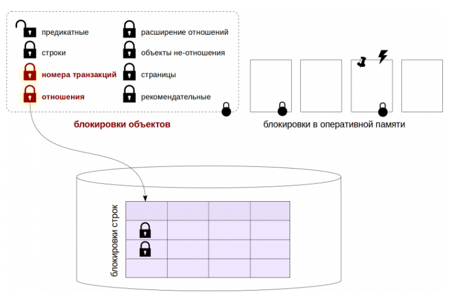
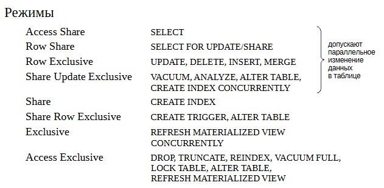
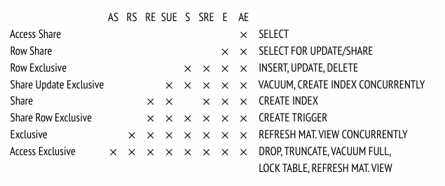
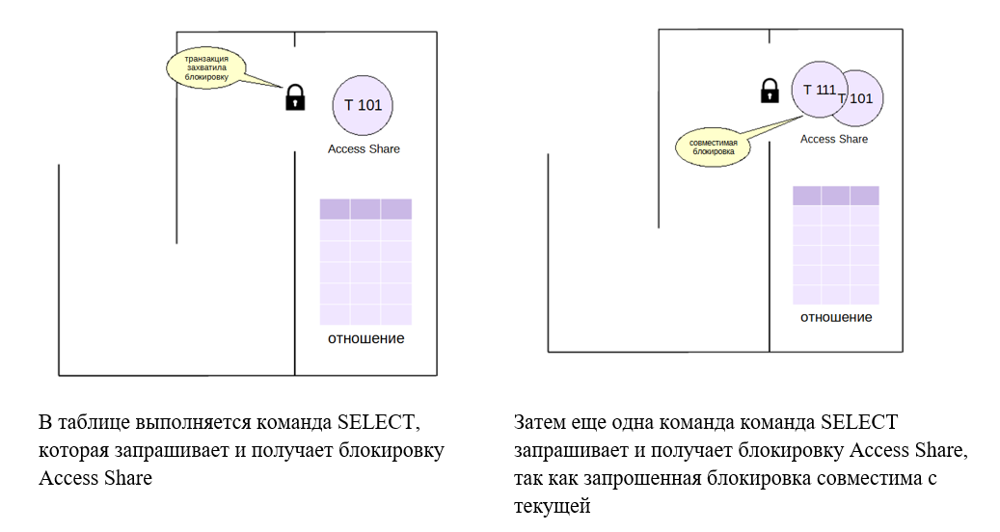
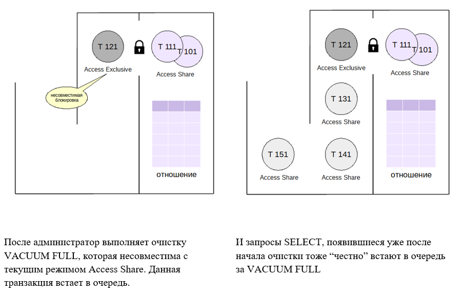

Блокировки объектов
###################

Блокировки и ресурсы
********************

Перед тем как обратиться к ресурсу, процесс обязан захватить (acquire) блокировку, ассоциированную с этим ресурсом, а по окончании работы —
освободить (release) ее, чтобы ресурсом могли воспользоваться другие. Когда блокировками управляет СУБД, установленный порядок поддерживается автоматически; 
если блокировки устанавливает приложение, то обязанность соблюдать правила ложится на него.

На низком уровне блокировка представляется участком разделяемой памяти, в котором некоторым образом отмечается статус блокировки (свободна
или захвачена) и,возможно, дополнительная информация (такая как номер процесса и время захвата).

.. note:: Сам такой участок разделяемой памяти сам по себе является ресурсом, к которому возможен конкурентный доступ. 
          Для упорядочения доступа на низком уровне используются специальные примитивы синхронизации (семафоры или мьютексы), предоставляемые ОС. Смысл их в том, чтобы код, обращающийся к разделяемому ресурсу, одновременно выполнялся только в одном процессе. 
          На самом низком уровне эти примитивы реализуются на основе атомарных инструкций процессора (таких, как test-and-set или compare-and-swap).

Захват блокировки возможен не всегда: ресурс может оказаться уже занятым кем-то другим. 
В этом случае процесс встает в очередь ожидания или повторяет попытку захвата блокировки через какое-то время. 
В любом случае это процесс вынужден простаивать в ожидании освобождения блокировки.

Иногда удается применить другие, неблокирующие, стратегии. Например, механизм многоверсионности. 
Еще один пример — оптимистические блокировки, которые не блокируют процесс, но в случае неудачи приводят к ошибке.

Ресурсом, защищаемым блокировкой, в принципе может быть все, что угодно, лишь бы ресурс можно было однозначно идентифицировать:

- объект, с которым работает СУБД, такой как страница данных (идентифицируется именем файла и позицией внутри файла), таблица (oid в системном каталоге), версия строки (страница и позиция внутри страницы).

- структура в памяти, такая как хеш-таблица, буфер и т. п. (идентифицируется заранее присвоенным номером).

- абстрактные ресурсы, не имеющие никакого физического смысла (идентифицируются числом).

Факторы эффекивности
====================

**Гранулярность** — степень детализации блокировки. Гранулярность важна, если ресурсы образуют иерархию.

Например, таблица состоит из страниц, которые содержат версии строк.
Все эти объекты могут выступать в качестве ресурсов. Если установить
блокировку на уровне таблицы (крупная гранулярность), процессы не
смогут работать одновременно, даже если они обращаются к разным
страницам или строкам.

Блокировка отдельных строк (мелкая гранулярность) лишена этого
недостатка, но количество блокировок сильно увеличивается. Чтобы
информация о них не заняла слишком много памяти,могут применяться разные методы, 
например повышение уровня (эскалация): когда количество низкоуровневых, мелкогранулярных блокировок превышает
определенный предел, они заменяются на одну блокировку более высокого уровня.

Поэтому чем выше гранулярность – тем больше возможностей для распараллеливания, но это приводит к увеличению числа блокировок, информацию о которых надо где-то хранить

**Набор режимов**, в которых могут захватываться блокировки.

Часто применяют всего два режима. Исключительный (*exclusive*), или монопольный, режим не совместим ни с каким другим режимом, в том
числе с самим собой.

В разделяемом (*shared*) режиме блокировка может захватываться несколькими процессами одновременно. 
Разделяемый режим может использоваться для чтения ресурса,а исключительный — для изменения.

В общем случае режимов может быть больше. Имена режимов не имеют значения, важна лишь матрица их совместимости друг с другом.

Чем больше можно найти режимов, совместимых друг с другом, тем больше возможностей для параллелизма.

Блокировки можно классифицировать по времени использования.

По времени использования блокировки можно разделить на *длительные* и *короткие*.

**Долговременные блокировки** захватываются на потенциально большое время (обычно до конца транзакции) и чаще всего относятсяк таким ресурсам, 
как **таблицы (отношения) и строки**. Являются в таком случае **тяжелыми** блокировками. Как правило, PostgreSQL управляет такими блокировками автоматически, но пользователь, тем не менее, 
имеет определенный контроль над этим процессом.

Для длительных блокировок характерно большое число режимов, чтобы допускать как можно больше одновременных действий над данными.

Обычно для долговременных блокировок предусмотрены развитая инфраструктура (например, поддержка очередей и обнаружение взаимоблокировок) 
и средства мониторинга.

**Краткосрочные блокировки** захватываются на небольшое время(от нескольких тактов процессора до долей секунд) 
и обычно **относятся к структурам данных в общей памяти**. Такими блокировками PostgreSQL управляет полностью автоматически — 
об их существовании надо просто знать.

Для коротких блокировок характерны ограниченный набор простых режимов (часто всего лишь исключительный и разделяемый) и простая инфраструктура. 

Средства мониторинга могут отсутствовать.

Виды блокировок
===============

В PostgreSQL используются разные виды блокировок.

**Блокировки на уровне объектов** относятся к длительным, «тяжеловесным». В качестве ресурсов здесь выступают отношения и другие объекты. 
Если слово блокировка встречается в тексте без уточнений, то оно обозначает именно такую, «обычную» блокировку. 

Еще один класс блокировок (оптимистических) — предикатные. Информация обо всех этих блокировках хранится однотипным образом в оперативной памяти.

Среди длительных блокировок отдельно выделяются **блокировки на уровне строк**. 
Их реализация отличается от остальных длительных блокировок из-за потенциально огромного их количества (представьте обновление миллиона строк в одной транзакции). 

К коротким блокировкам относятся различные блокировки структур оперативной памяти.

Блокировки объектов
*******************

	   
Тяжелые(*heavyweight*)блокировки относятся к *длительным*. Они устанавливаются на уровне объектов: таких как таблицы, индексы, страницы, номера транзакций и др.
Такие блокировки защищают объекты от одновременного изменения или использования в то время, когда объект изменяется, а также для ряда других нужд.
Такая нечеткая формулировка связана с тем,что блокировки из этой группы используются для самых разных целей, а объединяет их лишь то,как они устроены.

Информация о блокировках объектов располагается в *общей памяти сервера*. Их количество ограничено произведением значений двух параметров: 

::

	max_locks_per_transaction * max_connections (по умолчанию 64 × 100). 
	
Этот пул блокировок — общий для всех транзакций, то есть одна транзакция вполне может захватить больше блокировок, чем *max_locks_per_transaction*; 
важно лишь, чтобы общее число блокировок в системе не превысило установленный предел.

Если ресурс уже заблокирован, и транзакция пытается захватить блокировку в несовместимом режиме, то она становится в очередь и ожидает освобождения блокировки. 

Ожидающие транзакции не потребляют ресурсы процессора, они «засыпают» и пробуждаются только при освобождении ресурса. 
Ряд команд SQL позволяют указать ключевое слово **NOWAIT**: в этом случае попытка захватить занятый ресурс приводит не к ожиданию, а к ошибке.

Возможна ситуация взаимоблокировки (тупика), в которой две или более транзакций ждут друг друга. 
Первой из них для продолжения работы требуется ресурс, занятый второй транзакцией, а второй в это время необходим ресурс, занятый первой.
Это простой случай; попасть в тупиковую ситуацию могут и  более двух транзакций. При взаимоблокировке ожидание длилось бы бесконечно, 
поэтому PostgreSQL автоматически определяет такие ситуации и аварийно прерывает бесконечное ожидание.

Все блокировки можно увидеть в представлении **pg_locks**.

Столбец **locktype** представления **pg_locks** может содержать следующие значения:

- transactionid и virtualxid — блокировка номера транзакции;

- relation — блокировка отношения;

- tuple — блокировка версии строки;

- object — блокировка объекта, который не является отношением

- extend —блокировка  файлов отношений при добавлении новых страниц;

- page — блокировкастраницы  (используется некоторыми типами индексов);

- advisory — рекомендательная блокировка.

Практически все тяжелые блокировки устанавливаются автоматически, когда в этом возникает необходимость, и автоматически же освобождаются при
завершении транзакции. Есть и исключения: например, блокировки отношений можно запросить явно,а управление рекомендательными 
блокировками полностью находится в руках пользователя.

Блокировки отношений
====================

Важный частный случай блокировок — блокировки отношений (таблиц, индексов, последовательностей и т. п.). 
Такие блокировки имеют тип **relation** в представлении *pg_locks*.

Для них определено целых 8 различных режимов, которые показаны на рисунке вместе с примерами команд SQL, использующих эти режимы. 

	   
Матрица совместимости, которая показывает, какие блокировки можно захватывать совместно:

Такое количество режимов существует для того, чтобы позволить  выполнять одновременно как можно большее количество команд,  
относящихся к одной таблице (индексу и т. п.).

Самый слабый режим — *Access Share*, он захватывается командой  SELECT и совместим с любым режимом, кроме самого сильного —  *Access Exclusive*. 
Это означает, что запрос не мешает ни другим  запросам, ни изменению данных в таблице, ни чему-либо другому, но не дает, например, удалить таблицу в то время, 
когда из нее читаются  данные.

Другой пример: режим *Share* (как и другие более сильные режимы)не совместим с изменением данных в таблице. 
Например, команда  CREATE INDEX заблокирует команды INSERT, UPDATE и DELETE(и наоборот). Поэтому существует команда CREATE INDEX  CONCURRENTLY, 
использующая режим Share Update Exclusive, который  совместим с такими изменениями (за счет этого команда выполняется  дольше).

https://postgrespro.ru/docs/postgresql/16/explicit-locking#LOCKING-TABLES

Очередь ожидания
================

Тяжелые блокировки предоставляют "честную" очередь ожидания. Процесс встает в очередь, если пытается захватить блокировку в режиме,
несовместимом с режимом, в котором блокировка уже захвачена, или с режимом любого из уже ожидающих в очереди процессов.

	   

	   
После того, как две первые транзакции с командами SELECT завершаются и освобождают блокировки, 
VACUUM FULL начинает выполняться.

Теперь только когда VACUUM FULL завершит свою работу и снимет (исключительную) блокировку, все накопившиеся в очереди команды 
SELECT смогут захватить блокировки уровня Access Share и начать выполняться.

.. warning:: Не вовремя выполненная команда может парализовать работу системы на время, значительно превышающее время выполнения самой команды.

.. important:: Исключительная блокировка может потребоваться также обычной очистке (и автоочистке), 
				чтобы в конце своей работы выполнить усечение таблицы, то есть «откусить» пустой хвост файла данных и вернуть место операционной системе. 
				Очистка не должна допускать ситуаций долгого ожидания, поэтому в случае проблем этап усечения можно отключить параметром хранения vacuum_truncate 
				или вызывая очистку с указанием *VACUUM (truncate off)*

Мониторинг
==========

Возникающие в системе блокировки необходимы для обеспечения целостности и изоляции, однако могут приводить к нежелательным ожиданиям. 
Такие ожидания можно отслеживать, чтобы разобратьсяв их причине и по возможности устранить (например, изменив алгоритм работы приложения).

Один способ мониторинга состоит в том, чтобы включить параметр **log_lock_waits**. В этом случае в журнал сообщений сервера будет попадать информация, 
если транзакция ждала дольше, чем *deadlock_timeout* (несмотря на то, что используется параметр для взаимоблокировок, здесь речь идет об обычных ожиданиях).

Второй способ состоит в том, чтобы в момент возникновения долгой блокировки (или на периодической основе) выполнять запрос к представлению **pg_locks**, 
смотреть на блокируемые и блокирующие транзакции (функция *pg_blocking_pids*) и расшифровывать их при помощи *pg_stat_activity*.

**Параметры и представления:**

log_lock_waits

deadlock_timeout

pg_blocking_pids

pg_stat_activity

Практика:
---------

1. Создать таблицу «банковских» счетов. В ней будем хранить номер счета и сумму.

::

	CREATE DATABASE locks_objects;

::

	\c locks_objects

::

	CREATE TABLE accounts(acc_no integer, amount numeric);
	INSERT INTO accounts VALUES (1,1000.00), (2,2000.00), (3,3000.00);

2. Во втором сеансе начать транзакцию. Понадобится номер обслуживающего процесса.

::

	| \c locks_objects
	| SELECT pg_backend_pid();
 

	pg_backend_pid 
	----------------
         148513
	(1 row)

::

	| BEGIN;

3. Какие блокировки удерживает только что начавшаяся транзакция?

::

	SELECT locktype, relation::regclass, virtualxid AS virtxid, transactionid AS xid, mode, granted
	FROM pg_locks WHERE pid = 148513;	

	  locktype  | relation | virtxid | xid |     mode      | granted 
	------------+----------+---------+-----+---------------+---------
	 virtualxid |          | 3/13    |     | ExclusiveLock | t
	(1 row)

Только блокировку собственного виртуального номера.

4. Обновить строку таблицы. Как изменится ситуация?

::

	| UPDATE accounts SET amount = amount + 100 WHERE acc_no = 1;

::

	| SELECT locktype, relation::regclass, virtualxid AS virtxid, transactionid AS xid, mode, granted
	| FROM pg_locks WHERE pid = 148513;
	
	   locktype    | relation | virtxid | xid |       mode       | granted 
	---------------+----------+---------+-----+------------------+---------
	 relation      | accounts |         |     | RowExclusiveLock | t
	 virtualxid    |          | 3/13    |     | ExclusiveLock    | t
	 transactionid |          |         | 746 | ExclusiveLock    | t
	(3 rows)

Добавилась блокировка отношения в режиме RowExclusiveLock (что соответствует команде UPDATE) и исключительная блокировка собственного номера (который появился, как только транзакция начала изменять данные).

5. Теперь в еще одном сеансе создать индекс по таблице.

::

	|| \c locks_objects
::

	|| SELECT pg_backend_pid();

	 pg_backend_pid 
	----------------
			 148748

::

	CREATE INDEX ON accounts(acc_no);

Команда не выполняется — ждет освобождения блокировки. Какой?

::

	SELECT locktype, relation::regclass, virtualxid AS virtxid, transactionid AS xid, mode, granted,
	to_char(waitstart, 'HH24:MI:SS') AS waitstart FROM pg_locks WHERE pid = 148748;
	
	  locktype  | relation | virtxid | xid |     mode      | granted | waitstart 

	------------+----------+---------+-----+---------------+---------+-----------
	 virtualxid |          | 4/6     |     | ExclusiveLock | t       | 
	 relation   | accounts |         |     | ShareLock     | f       | 21:24:15
	(2 rows)

Транзакция пыталась получить блокировку таблицы в режиме ShareLock, но не смогла (granted = f). Столбец waitstart в этом случае показывает время, 
когда обслуживающий процесс начал ожидать блокировку.

Можно найти номер блокирующего процесса (в общем виде — несколько номеров)...

::

	SELECT pg_blocking_pids(148748);
	
	pg_blocking_pids 
	------------------
	 {148513}
	(1 row)

...и посмотреть информацию о сеансах, к которым они относятся:

::

	SELECT * FROM pg_stat_activity
	WHERE pid = ANY(pg_blocking_pids(148748)) \gx
	
	-[ RECORD 1 ]----+------------------------------------------------------------
	datid            | 16390
	datname          | locks_objects
	pid              | 148513
	leader_pid       | 
	usesysid         | 16384
	usename          | student
	application_name | psql
	client_addr      | 
	client_hostname  | 
	client_port      | -1
	backend_start    | 2025-04-09 21:24:15.301942+03
	xact_start       | 2025-04-09 21:24:15.444787+03
	query_start      | 2025-04-09 21:24:15.552217+03
	state_change     | 2025-04-09 21:24:15.552994+03
	wait_event_type  | Client
	wait_event       | ClientRead
	state            | idle in transaction
	backend_xid      | 746
	backend_xmin     | 
	query_id         | 
	query            | UPDATE accounts SET amount = amount + 100 WHERE acc_no = 1;
	backend_type     | client backend

После завершения транзакции блокировки снимаются и индекс создается.

::

	| COMMIT;
	
	  COMMIT

::

	|| CREATE INDEX

			
Блокировки других типов
***********************

Кроме отношений есть еще несколько типов блокируемых ресурсов.

Их блокировки захватываются либо только в исключительном режиме, либо в исключительном и разделяемом. 

К ним относятся:

- **Extend** при добавлении страниц к файлу какого-либо отношения;

Используется, когда физически необходимо добавлять новые страницы, а, соответственно, возможно и новый сегмент в конец существующего файла отношения для вставки новых строк.
Чтобы два процесса одновременно не начали этого делать используется тяжелая блокировка **extend**. Такая  же блокировка используется и при очистке индексов,чтобы другие процессы 
не могли добавить новые страницы во время сканирования. Она снимается сразу по завершении расширения, не дожидаясь конца транзакции  и не не может приводить к взаимоблокировкам.
Для эффективности файлы таблиц расширяются не на одну страницу, а сразу  на несколько (пропорционально числу ожидающих блокировку процессов, но не более чем на 64 страницы за один раз)

- **Object** для блокирования объекта, который не является отношением (примеры таких объектов: база данных, схема, подписка и т. п.);

- **Page** для блокирования страницы (редкая блокировка, используется некоторыми типами индексов);

- **Tuple** используется в некоторых случаях для установки приоритета среди нескольких транзакций, ожидающих блокировку одной строки;

- **Advisory** для рекомендательных блокировок.

- **Transactionid и Virtualxid**. Каждая транзакция удерживает исключительную блокировку своих номеров: и виртуального, и настоящего, если он есть. Это дает простой способ дождаться окончания какой-либо транзакции: надо запросить  блокировку ее номера.

Advisory Locks
===============

Рекомендательные блокировки можно использовать, если нужна логика блокирования, которую неудобно реализовывать с помощью других, «обычных» блокировок. 
Их смысл определяют сами приложения. 
**Рекомендательные блокировки устанавливаются только приложением**; PostgreSQL никогда не делает этого автоматически.

Они полезны для реализаций стратегий блокирования, плохо вписывающихся в модель MVCC. Например, рекомендательные блокировки часто применяются для исполнения 
стратегии пессимистичной блокировки, типичной для систем управления данными «плоский файл». Хотя для этого можно использовать и дополнительные флаги в таблицах, 
рекомендательные блокировки работают быстрее, не приводят к раздуванию таблиц и автоматически ликвидируются сервером в конце сеанса.

Имена функций, связанных с рекомендательными блокировками, начинаются с *pg_advisory* и могут содержать уточняющие ключевые слова:

- **lock** — захватить блокировку;
 
- **try** — захватит блокировку, если это можно сделать без ожидания;

- **unlock** — освободить блокировку;

- **share** — использовать разделяемый режим (по умолчанию используется исключительный режим);

- **xact** — блокироватьдоконцатранзакции(поумолчанию—доконцасеанса).

Рекомендательная блокировка может быть установлена до конца сеанса (функция *pg_advisory_lock*) или до конца транзакции (*pg_advisory_xact_lock*).

Блокировки уровня сеанса, в отличие от блокировок уровня транзакции, не освобождаются автоматически по окончании транзакции, 
их нужно явно освобождать функцией *pg_advisory_unlock*. Таким образом, сеансовые рекомендательные блокировки нарушают обычную логику транзакций — блокировка, полученная 
в транзакции, даже если произойдет откат этой транзакции, будет сохраняться в сеансе; аналогично, освобождение блокировки остается в силе, даже если транзакция, 
в которой оно было выполнено, позже прерывается.

Рекомендательные блокировки на уровне транзакций, напротив, во многом похожи на обычные блокировки: они автоматически освобождаются в конце транзакций и 
не требуют явного освобождения. 

.. important:: Для кратковременного применения блокировок это поведение часто более уместно, чем поведение рекомендательных блокировок на уровне сеанса. 

По умолчанию рекомендательные блокировки захватываются **в исключительном режиме**. 
Для использования разделяемого режима к имени функции добавляется слово shared, например, *pg_advisory_lock_shared* и *pg_advisory_unlock_shared*

.. warning:: В определённых случаях при использовании рекомендательных блокировок, особенно в запросах с явными указаниями 
             ORDER BY и LIMIT, важно учитывать, что получаемые блокировки могут зависеть от порядка вычисления SQL-выражений.

Подробнее:

https://postgrespro.ru/docs/postgresql/16/explicit-locking#ADVISORY-LOCKS

Практика:
---------

Допустим, имеется ресурс, несоответствующий никакому объекту базы данных(который можно заблокировать командами типа SELECT FOR или LOCK TABLE). 
Для блокировки надо сопоставить ресурсу числовой идентификатор. Если у ресурса есть уникальное имя, то простой вариант — взять хеш-код от имени.

1. Начнем транзакцию.

::

	BEGIN;

2. Получить блокировку некого условного ресурса. В качестве идентификатора используется число; 
если ресурс имеет имя, удобно получить это число с помощью функции хеширования:

::

	SELECT hashtext('ресурс1');

	 hashtext  
	-----------
	 243773337
	(1 row)

::

	SELECT pg_advisory_lock(hashtext('ресурс1'));

	pg_advisory_lock 
	------------------

	(1 row)

Информация о рекомендательных блокировках доступна в pg_locks:

::

	SELECT locktype, objid, virtualxid AS virtxid, mode, granted 
	FROM pg_locks WHERE pid = 148513;

	  locktype  |   objid   | virtxid |     mode      | granted 
	------------+-----------+---------+---------------+---------
	 virtualxid |           | 3/14    | ExclusiveLock | t
	 advisory   | 243773337 |         | ExclusiveLock | t
	(2 rows)

Если другой сеанс попробует захватить ту же блокировку, он будет ждать ее освобождения:

::

	SELECT pg_advisory_lock(hashtext('ресурс1'));

В приведенном примере блокировка действует до конца сеанса, а не транзакции, как обычно.

::

	COMMIT;

::

	SELECT locktype, objid, virtualxid AS virtxid, mode, granted
	FROM pg_locks WHERE pid = 148513;

	 locktype |   objid   | virtxid |     mode      | granted 
	----------+-----------+---------+---------------+---------
	 advisory | 243773337 |         | ExclusiveLock | t
	(1 row)

Захвативший блокировку сеанс может получить ее повторно, даже если есть очередь ожидания.

::

	SELECT pg_advisory_lock(hashtext('ресурс1'));
	
	 pg_advisory_lock 
	------------------
	 
	(1 row)

Блокировку можно явно освободить:

::

	SELECT pg_advisory_unlock(hashtext('ресурс1'));

	 pg_advisory_unlock 
	--------------------
	 t
	(1 row)

Но в нашем примере блокировка была получена сеансом дважды, поэтому придется освободить ее еще раз:

::

	SELECT locktype, objid, virtualxid AS virtxid, mode, granted
	FROM pg_locks WHERE pid = 148513;

	 locktype |   objid   | virtxid |     mode      | granted 
	----------+-----------+---------+---------------+---------
	 advisory | 243773337 |         | ExclusiveLock | t
	(1 row)

::

	SELECT pg_advisory_unlock(hashtext('ресурс1'));

	 pg_advisory_unlock 
	--------------------
	 t
	(1 row)

Существуют другие варианты функций для получения рекомендательных блокировок до конца транзакции, для получения разделяемых блокировок и т. п. Вот их полный список:

::

	\df pg_advisory*

Предикатные блокировки
======================

Задача: реализация уровня изоляции *Serializable*

Уровень Serializable обеспечивает самую строгую изоляцию транзакций. На этом уровне моделируется последовательное выполнение всех зафиксированных транзакций, 
как если бы транзакции выполнялись одна за другой, последовательно, а не параллельно. Однако, как и на уровне Repeatable Read, на этом уровне приложения 
должны быть готовы повторять транзакции из-за сбоев сериализации. Фактически этот режим изоляции работает так же, как и Repeatable Read, 
только он дополнительно отслеживает условия, 
при которых результат параллельно выполняемых сериализуемых транзакций может не согласовываться с результатом этих же транзакций, выполняемых по очереди. 

.. note:: Предикаты в базах данных — это выражения, которые оценивают истинность или ложность, часто используются в запросах SQL для фильтрации записей на основе конкретных условий. Предикаты могут включать сравнения (равенство или неравенство) и логические операторы (AND, OR, NOT) для объединения нескольких условий.

Для полной гарантии сериализуемости в PostgreSQL применяются предикатные блокировки, то есть блокировки, позволяющие определить, 
когда запись могла бы повлиять на результат предыдущего чтения параллельной транзакции, если бы эта запись выполнялась сначала. 

Термин предикатная блокировка появился давно, еще при первых попытках реализовать полную изоляцию (Serializable) на основе блокировок в ранних СУБД. 
Идея состояла в том, что блокировать надо не только определенные строки, но и предикаты. Например, при выполнении запроса с условием a > 10 надо заблокировать диапазон a > 10, 
чтобы избежать появления фантомных строк и других аномалий.

В PostgreSQL уровень Serializable реализован поверх существующего механизма снимков данных, но термин остался. 
Фактически такие «блокировки» ничего не блокируют, а используются для отслеживания зависимостей транзакций по данным.

При фиксации транзакции выполняется проверка,и если обнаруживается «нехорошая» структура зависимостей, которая  может свидетельствовать об аномалии, транзакция обрывается.

Как и для обычных блокировок, информация о предикатных блокировках отображается в представлении *pg_locks*, все они устанавливаются в одном специальном режиме 
**SIRead** (Serializable Isolation Read).

Для предикатных блокировок используется отдельный пул, память под который выделяется при старте сервера.
Число предикатных блокировок ограничено произведением параметров 
*max_pred_locks_per_transaction* и *max_connections* (= 64 × 100 несмотря на названия параметров, учет по отдельным транзакциям не ведется).

Именно с использованием предикатных блокировок связано ограничение, что для достижения полной изоляции транзакции должны работать на уровне Serializable. 
Отслеживание зависимостей будет работать только для транзакций, которые устанавливают предикатные блокировки.

Предикатные блокировки не всегда снимаются сразу по завершении транзакции, ведь они нужны, чтобы отслеживать зависимости *между* транзакциями. 
Но в любом случае управление ими происходит автоматически.

Предикатные блокировки захватываются на трех уровнях. 

При полном сканировании таблицы блокировка устанавливается на уровне всей таблицы (если нет индексов). Это приводит к тому, что с ней уже нельзя параллельно работать. 

При индексном сканировании устанавливаются блокировки тех страниц индекса, которые соответствуют условию доступа (предикату). И в этом случае уже параллельная работа с таблицей будет возможна.  

Кроме того, устанавливаются блокировки на уровне отдельных табличных версий строк.

При увеличении количества предикатных блокировок происходит автоматическое повышение уровня (эскалация): вместо нескольких мелких блокировок захватывается 
одна более высокого уровня.

Если число блокировок версий строк одной страницы превышает значение параметра *max_pred_locks_per_page* (2 по умолчанию), вместо них захватывается одна блокировка уровня страницы.

Если число блокировок страниц или версий одной таблицы (индекса) превышает значение параметра *max_pred_locks_per_relation*, вместо них захватывается одна блокировка 
на все отношение. По умолчанию параметр равен −2; для отрицательных чисел значение вычисляется как *max_pred_locks_per_transaction* / *abs(max_pred_locks_per_relation)* (по умолчанию предел составит 32).

Повышение уровня блокировок может приводить к ложным ошибкам сериализации, из-за чего снижается пропускная способность системы. Нужно искать баланс
между расходом оперативной памяти на хранение блокировок и производительностью.

Для более эффективной работы на уровне Serializable следует явно помечать только читающие транзакции как *READ ONLY*. Если менеджер блокировок
убедится в невозможности конфликтов читающей транзакции с другими транзакциями, он сможет освободить уже установленные для нее предикатные блокировки и не задействовать новые. 

Практика:
---------

Начнем транзакцию с уровнем Serializable и прочитаем одну строку таблицы последовательным сканированием.

::

	BEGIN ISOLATION LEVEL SERIALIZABLE;

::

	EXPLAIN (analyze,costs off,timing off) SELECT * FROM accounts LIMIT 1;

						 QUERY PLAN                     
	----------------------------------------------------
	 Limit (actual rows=1 loops=1)
	   ->  Seq Scan on accounts (actual rows=1 loops=1)
	 Planning Time: 0.194 ms
	 Execution Time: 0.035 ms
	(4 rows)

Посмотрим на блокировки:

::

	SELECT locktype, relation::regclass, page, tuple, virtualxid AS vxid, transactionid AS xid, mode, granted
	FROM pg_locks WHERE pid = 148513;

	  locktype  |      relation       | page | tuple | vxid | xid |      mode       | granted 
	------------+---------------------+------+-------+------+-----+-----------------+---------
	 relation   | accounts_acc_no_idx |      |       |      |     | AccessShareLock | t
	 relation   | accounts            |      |       |      |     | AccessShareLock | t
	 virtualxid |                     |      |       | 3/18 |     | ExclusiveLock   | t
	 relation   | accounts            |      |       |      |     | SIReadLock      | t
	(4 rows)

Появилась предикатная блокировка всей таблицы accounts (несмотря на то что читается одна строка).

::

	COMMIT;
	
Теперь прочитаем одну строку таблицы, используя индекс:

::

	BEGIN ISOLATION LEVEL SERIALIZABLE;

::	

	SET enable_seqscan = off;
	
::

	EXPLAIN (analyze,costs off,timing off) SELECT * FROM accounts WHERE acc_no = 1;

									QUERY PLAN                                
	--------------------------------------------------------------------------
	 Index Scan using accounts_acc_no_idx on accounts (actual rows=1 loops=1)
	   Index Cond: (acc_no = 1)
	 Planning Time: 0.093 ms
	 Execution Time: 0.124 ms
	(4 rows)

Блокировки:

::

	SELECT locktype, relation::regclass, page, tuple, virtualxid AS vxid, transactionid AS xid, mode, granted
	FROM pg_locks WHERE pid = 148513;

	  locktype  |      relation       | page | tuple | vxid | xid |      mode       | granted 
	------------+---------------------+------+-------+------+-----+-----------------+---------
	 relation   | accounts_acc_no_idx |      |       |      |     | AccessShareLock | t
	 relation   | accounts            |      |       |      |     | AccessShareLock | t
	 virtualxid |                     |      |       | 3/19 |     | ExclusiveLock   | t
	 tuple      | accounts            |    0 |     4 |      |     | SIReadLock      | t
	 page       | accounts_acc_no_idx |    1 |       |      |     | SIReadLock      | t
	(5 rows)

При индексном сканировании устанавливаются мелкогранулярные предикатные блокировки:

- блокировки прочитанных страниц индекса;

- блокировки прочитанных версий строк.

::

	COMMIT;

Практика
********

1. Какие блокировки на уровне изоляции Read Committed удерживает транзакция, прочитавшая одну строку таблицы по первичному ключу? Проверьте на практике.

2. Воспроизведите автоматическое повышение уровня предикатных блокировок при чтении строк таблицы по индексу. Покажите, что при этом возможна ложная ошибка сериализации.

3. Настройте сервер так, чтобы в журнал сообщений сбрасывалась информация о долгих (более 100 миллисекунд) ожиданиях блокировок. Воспроизведите ситуацию, 
при которой в журнале появятся такие сообщения.
