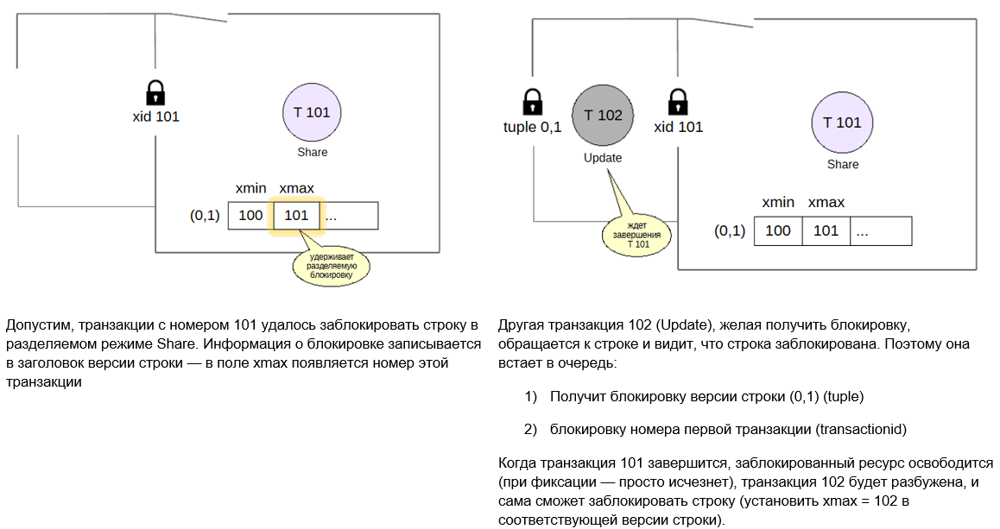

Блокировки строк
###################

Благодаря изоляции на основе снимков табличные строки не требуется блокировать при чтении. Но нельзя допустить,чтобы две транзакции изменяли
одну и ту же строку в один момент времени. Строки нужно блокировать, но внутренние механизмы не рассчитаны на
работу с огромным количеством одновременно существующих блокировок, которая должна возникать для каждой строки, поэтому тяжелые блокировки плохо подходят для этого 
(непомерные  накладные расходы и огромный объем оперативной памяти).

В некоторых СУБД идут по пути повышения уровня (эскалация): если уже заблокировано N строк таблицы, то при блокировке еще одной  блокируется вся таблица целиком, 
а блокировки на уровне строк  снимаются. Но в этом случае страдает пропускная способность.

В PostgreSQL сделано иначе. Информация о том, что строка  заблокирована, хранится исключительно в заголовке версии строки  внутри страницы данных. 
Там она представлена номером блокирующей транзакции (*xmax*) и дополнительными информационными битами.

За счет этого можно установить неограниченное количество блокировок уровня строки, и это не требует дополнительных ресурсов и не снижает  производительность системы.

Обратная сторона такого подхода — сложность организации очереди  ожидания. Так как без информации о блокировке в оперативной памяти другие процессы не могут встать в очередь. 
Ведь xmax - это просто поле. Как ждать поле или изменение признака?  
Для этого приходится использовать блокировки  уровня объектов, но удается обойтись очень небольшим их  количеством (пропорциональным числу процессов, а не числу  заблокированных строк).
Дождаться освобождения строки означает дождаться окончания блокирующей транзакции, а для этого нужно запросить блокировку ее номера. Таким образом, число 
используемых тяжелых блокировок пропорционально числу одновременно работающих процессов, а не количеству изменяемых строк.

.. note:: Очередь ожидания для исключительных блокировок строк организована с помощью блокировок объектов **tuple**

Блокировки на уровне строк блокируют только **запись в определённые строки**, но никак не влияют на выборку. 
Снимаются такие блокировки, как и блокировки на уровне таблицы, в конце транзакции или при откате к точке сохранения.

Режимы блокировки строки
************************

Существует четыре режима,в которых можно заблокировать строку. Два режима представляют *исключительные* блокировки, которые одновременно может удерживать только одна транзакция, 
и еще два — *разделяемые* блокировки, которые могут удерживаться несколькими транзакциями.

Матрица совместимости (конфликтов) выглядит следующим образом:

	   
 
	   
Исключительные режимы
=====================

Update и No Key Update

- Режим **Update** предполагает изменение любых полей строки или ее удаление (DELETE)

- **No Key Update** — изменение только тех полей,которые не входят в уникальные индексы (изменение, которое не затрагивает внешние ключи).

Команда *UPDATE* сама выбирает минимальный подходящий режим блокировки; поскольку ключи обычно не меняются, чаще всего строки блокируются в режиме *No Key Update*.

.. figure:: img/bl_str_02.png
       :scale: 100 %
       :align: center
       :alt: asda

При изменении или удалении строки в поле *xmax* актуальной версии записывается номер текущей транзакции. Установленное значение xmax, соответствующее активной транзакции, 
выступает в качестве блокировки.

То же самое происходит и при явном блокировании строки командой *SELECT FOR UPDATE*, но еще проставляется дополнительный информационный бит (*xmax lock only*), 
который говорит о том, что версия строки по-прежнему актуальна, хоть и заблокирована.

Режим блокировки определяется еще одним информационным битом (*keys updated*). Если другая транзакция намерена обновить или удалить заблокированную строку в несовместимом режиме, 
она будет вынуждена дождаться завершения транзакции с номером xmax. 

Бит XMax Lock Only станавливается в том случае, если выполняется команда SELECT FOR. Этот бит указывает не на изменение, а только на блокировка строки. 

Бит KeysUpdated, который показывает, что меняется ключевое поле.

Разделяемые режимы
==================

Разделяемые (shared) блокировки могут удерживаться несколькими транзакциями.

- **Share** применяется, когда нужно прочитать строку, но при этом нельзя допустить, чтобы она как-либо изменилась другой транзакцией. 

- Режим **Key Share** допускает изменение строки, но *только неключевых полей*. Данный режим автоматически используется ядром PostgreSQL при проверке внешних ключей.

Из матрицы совместимости видно, что:

- исключительные режимы конфликтуют между собой;

- разделяемые режимы совместимы между собой;

- разделяемый режим *Key Share* совместим с исключительным режимом *No Key Update* (при обновлении неключевых полей ключ не изменится)

.. important:: Для обычного чтения разделяемый режим блокировки не используется. При выполнении обычной команды SELECT (чтение данных) блокировки нет. 

Мультитранзакции
-----------------

Признаком блокировки является поле xmax, но разделяемые блокировки могут удерживаться несколькими транзакциями. В силу того,что прописать в поле можно только 
одно значение транзакции  для разделяемых блокировок применяются так называемые **мультитранзакции** (MultiXact). Мультитранзакция — это группа транзакций, 
которой присвоен отдельный номер. Детальная информация об участниках такой группы и режимах их блокировок хранится в файлах в каталоге **PGDATA/pg_multixact**. 
Страницы кешируются в общей памяти сервера для ускорения доступа и защищаются от сбоя журналом.

Им выделяются отдельные номера, которые соответствуют не одной транзакции, а целой группе.  Номер мультитранзакции имеет ту же размерность, что и обычный 
номер транзакции (32 бита). Чтобы отличить мультитранзакцию от обычной, используется еще один информационный бит (*xmax is multi*). 

Если в разделяемом режиме блокировки к одной транзакции будут присоединяться другие в большом количестве, то это может привести к блокированию других транзакций 
на длительной основе, а также к переполнению счетчика (xid wraparound). 

Поэтому для номеров мультитранзакций тоже необходимо выполнять аналог заморозки — старые номера multixact id заменяются на новые 
(или на обычный номер, если в текущий момент блокировка уже удерживается только одной транзакцией).

*Обычная* заморозка версий строк выполняется для поля *xmin*, а для *мультитранзакций* речь идет о поле *xmax* актуальной версии строки, 
которая может оставаться актуальной, но при этом постоянно блокироваться разными транзакциями в разделяемом режиме.

За заморозку мультитранзакций отвечают параметры, аналогичные параметрам обычной заморозки (добавлено multiexact):

- vacuum_multixact_freeze_min_age = 5 000 000

- vacuum_multixact_freeze_table_age = 150 000 000

- autovacuum_multixact_freeze_max_age = 400 000 000

- vacuum_multixact_failsafe_age = 1 600 000 000

Практика
---------

Наиболее частый случай блокировок — блокировки, возникающие на уровне строк.

::

	CREATE DATABASE locks_rows;

::

	\c locks_rows

::

	CREATE TABLE accounts(acc_no integer PRIMARY KEY, amount numeric);

	INSERT INTO accounts VALUES (1,1000.00),(2,2000.00),(3,3000.00);

Поскольку информация о блокировке строк хранится только в самих версиях строк, а не в оперативной памяти, то извлекать информацию необходимо с 
помощью расширения *pageinspect*.

::
	
	CREATE EXTENSION pageinspect;

Для удобства создадим представление, расшифровывающее интересующие нас информационные биты в первых трех версиях строк.

::

	CREATE VIEW accounts_v AS
	SELECT '(0,'||lp||')' AS ctid,
		   t_xmax as xmax,
		   CASE WHEN (t_infomask & 1024) > 0  THEN 't' END AS committed,
		   CASE WHEN (t_infomask & 2048) > 0  THEN 't' END AS aborted,
		   CASE WHEN (t_infomask & 128) > 0   THEN 't' END AS lock_only,
		   CASE WHEN (t_infomask & 4096) > 0  THEN 't' END AS is_multi,
		   CASE WHEN (t_infomask2 & 8192) > 0 THEN 't' END AS keys_upd
	FROM heap_page_items(get_raw_page('accounts',0))
	WHERE lp <= 3
	ORDER BY lp;

В новом сеансе обновить сумму первого счета (**ключ не меняется**) и номер второго счета (**ключ меняется**):

::

	| \c locks_rows
	| BEGIN;

	| UPDATE accounts SET amount = amount + 100.00 WHERE acc_no = 1;
	| UPDATE accounts SET acc_no = 20 WHERE acc_no = 2;

Информация из представления:

::

	SELECT * FROM accounts_v;

	 ctid  | xmax | committed | aborted | lock_only | is_multi | keys_upd 
	-------+------+-----------+---------+-----------+----------+----------
	 (0,1) |  748 |           |         |           |          | 
	 (0,2) |  748 |           |         |           |          | t
	 (0,3) |    0 |           | t       |           |          | 

Строки, соответствующие первому и второму счету, заблокированы — в поле xmax записан номер блокирующей транзакции. 
Биты в столбце keys_upd показывают, что строки заблокированы в разных режимах.

Теперь в другом сеансе запросиить разделяемые блокировки первого и третьего счетов:

::

	|| \c locks_rows
	|| BEGIN;
	|| SELECT * FROM accounts WHERE acc_no = 1 FOR KEY SHARE;

	 acc_no | amount  
	--------+---------
		  1 | 1000.00
	(1 row)

::

	|| SELECT * FROM accounts WHERE acc_no = 3 FOR SHARE;

	 acc_no | amount  
	--------+---------
		  3 | 3000.00
	(1 row)

Все запрошенные блокировки совместимы друг с другом. В версиях строк видим:

::

	SELECT * FROM accounts_v;

	 ctid  | xmax | committed | aborted | lock_only | is_multi | keys_upd 
	-------+------+-----------+---------+-----------+----------+----------
	 (0,1) |    1 |           |         |           | t        | 
	 (0,2) |  748 |           |         |           |          | t
	 (0,3) |  749 |           |         | t         |          | 
	(3 rows)

Столбец lock_only позволяет отличить просто блокировку от обновления или удаления. 
Видим также, что в первой строке обычный номер в столбце xmax заменен на номер мультитранзакции — об этом говорит столбец is_multi.

Чтобы не вникать в детали информационных битов и реализацию мультитранзакций, можно воспользоваться еще одним расширением, 
которое позволяет увидеть всю информацию о блокировках строк в удобном виде.

::

	CREATE EXTENSION pgrowlocks;
	SELECT * FROM pgrowlocks('accounts') \gx

	-[ RECORD 1 ]-----------------------------
	locked_row | (0,1)
	locker     | 1
	multi      | t
	xids       | {748,749}
	modes      | {"No Key Update","Key Share"}
	pids       | {150478,150653}
	-[ RECORD 2 ]-----------------------------
	locked_row | (0,2)
	locker     | 748
	multi      | f
	xids       | {748}
	modes      | {Update}
	pids       | {150478}
	-[ RECORD 3 ]-----------------------------
	locked_row | (0,3)
	locker     | 749
	multi      | f
	xids       | {749}
	modes      | {"For Share"}
	pids       | {150653}

Расширение дает информацию о номерах транзакций, мультитранзакций и режимах всех блокировок.

::

	| ROLLBACK;

::

	|| ROLLBACK;

Очередь ожидания
****************

Исключительные режимы
=====================

Для организации очереди ожидания дополнительно используется  механизм блокировок объектов, при этом информация хранитсяв оперативной памяти и видна в *pg_locks*.

Из-за того, что блокировка строки — просто признак, очередь организована весьма нетривиально. Когда транзакция собирается изменить строку, она
выполняет следующую последовательность действий:

1) если поле xmax и информационные биты версии строки указывают на то,что строка заблокирована в *несовместимом* режиме,захватывает исключительную
тяжелую блокировку изменяемой версии строки (tuple);

2) при необходимости дожидается освобождения несовместимых блокировок, запрашивая блокировку номера транзакции xmax (или нескольких транзакций, если xmax — мультитранзакция);

3) прописывает в версию строки свой номер(в поле xmax)и устанавливает необходимые информационные биты;

4) освобождает блокировку версии строки, если она захватывалась в п.1.

Пункт 1 важен по причине того, что если строку одновременно пытаются обновить несколько транзакций, все они будут ждать завершения транзакции, работающей над строкой в данный момент. При завершении
этой транзакции между ожидающими возникнет состояние гонки за право обладания строкой, а это может привести к неопределенно долгому ожиданию для отдельных «невезучих» транзакций. 
Такая ситуация называется ресурсным голоданием (*starvation*). Блокировка версии строки выделяет первую в очереди транзакцию и гарантирует, 
что именно она получит блокировку следующей.

Если режимы блокировок конфликтуют, она должна каким-то образом встать в очередь, чтобы система «разбудила» ее, когда блокировка освободится. 
Но блокировки на уровне строк не предоставляют такой возможности — они никак не представлены в оперативной памяти, это просто байты внутри страницы данных.
Поскольку транзакция которая встает в очередь, запрашивает блокировку номера уже работающей транзакции. 

Когда транзакция работающая транзакция завершится, заблокированный ресурс освободится (при фиксации — просто исчезнет), транзакция, стоящая в очереди будет разбужена 
и сама сможет заблокировать строку (установить в xmax в соответствующую версию строки)

Если появляются другие транзакции, конфликтующие с текущей блокировкой версии строки (в данном примере — 112, 122, 132), 
Первым делом они пытаются захватить блокировку типа *tuple* для этой версии, но это у них не получается, поскольку эта блокировка уже удерживается транзакцией 102.
Поэтому они в очередь не выстраиваются. Получается своеобразная «очередь», в которой есть первый и все остальные.

Если бы все прибывающие транзакции занимали очередь  непосредственно за транзакцией 101, 
при освобождении блокировки  возникала бы ситуация гонки. При неудачном стечении обстоятельств  транзакция 102 могла бы ждать блокировку вечно. 
Двухуровневая  схема блокирования немного упорядочивает подобную конкуренцию.

Стоит избегать проектных решений, которые предполагают массовые  изменения одной и той же строки. В этом случае возникает «горячая  точка», 
которая на высоких нагрузках может привести к снижению  производительности.

Практика
--------

Представление locks будет создано над pg_locks. В нем «свернуты» в одно поле идентификаторы разных типов блокировок:

::

	CREATE VIEW locks AS
	SELECT pid,
		   locktype,
		   CASE locktype
			 WHEN 'relation' THEN relation::regclass::text
			 WHEN 'virtualxid' THEN virtualxid::text
			 WHEN 'transactionid' THEN transactionid::text
			 WHEN 'tuple' THEN relation::regclass::text||':'||page::text||','||tuple::text
		   END AS lockid,
		   mode,
		   granted
	FROM pg_locks;

Пусть одна транзакция заблокирует строку в разделяемом режиме...

::

	| BEGIN;
	| SELECT pg_current_xact_id(), pg_backend_pid();

	pg_current_xact_id | pg_backend_pid 
	-------------------+----------------
	   			752    |         150327
	(1 row)

::

	| SELECT * FROM accounts WHERE acc_no = 1 FOR SHARE;
	 acc_no | amount  
	--------+---------
		  1 | 1000.00
	(1 row)

...а другая попробует выполнить обновление:

::

	|| BEGIN;
    || SELECT pg_current_xact_id(), pg_backend_pid();

	pg_current_xact_id | pg_backend_pid 
	-------------------+----------------
				   753 |         150478
	(1 row)

::

	|| UPDATE accounts SET amount = amount + 100.00 WHERE acc_no = 1;

В представлении pg_locks можно увидеть, что вторая транзакция ожидает завершения первой (granted = f), удерживая при этом блокировку версии строки (locktype = tuple):

::

	SELECT * FROM locks WHERE pid = 150478;

 	 pid   |   locktype    |    lockid     |       mode       | granted 
	-------+---------------+---------------+------------------+---------
	150478 | relation      | accounts_pkey | RowExclusiveLock | t
	150478 | relation      | accounts      | RowExclusiveLock | t
	150478 | virtualxid    | 3/13          | ExclusiveLock    | t
	150478 | transactionid | 752           | ShareLock        | f
	150478 | tuple         | accounts:0,1  | ExclusiveLock    | t
	150478 | transactionid | 753           | ExclusiveLock    | t
	(6 rows)

По представлению pg_locks, можно узнать номер (или номера) процесса блокирующего сеанса с помощью функции:

::

	SELECT pg_blocking_pids(150478);

	pg_blocking_pids 
	------------------
	 {150327}
	(1 row)

Теперь появляется транзакция, желающая получить несовместимую блокировку.

::

	||| BEGIN;
	||| SELECT pg_current_xact_id(), pg_backend_pid();

	pg_current_xact_id | pg_backend_pid 
	-------------------+----------------
				   754 |         150653
	(1 row)

::

	||| UPDATE accounts SET amount = amount - 100.00 WHERE acc_no = 1;

Она встает в очередь за транзакцией, удерживающей блокировку версии строки (locktype = tuple, granted = f):

::

	SELECT * FROM locks WHERE pid = 150653;
	
	 pid   |   locktype    |    lockid     |       mode       | granted 
	-------+---------------+---------------+------------------+---------
	150653 | relation      | accounts_pkey | RowExclusiveLock | t
	150653 | relation      | accounts      | RowExclusiveLock | t
	150653 | virtualxid    | 4/6           | ExclusiveLock    | t
	150653 | tuple         | accounts:0,1  | ExclusiveLock    | f
	150653 | transactionid | 754           | ExclusiveLock    | t
	(5 rows)

::

	SELECT pg_blocking_pids(150653);

	 pg_blocking_pids 
	------------------
	 {150478}
	(1 row)

Разделяемый режим
==================

Если режимы блокировок совместимы, транзакция пройдет без очереди.

.. figure:: img/bl_str_06.png
       :scale: 100 %
       :align: center
       :alt: asda

Когда транзакция 133 завершится, транзакция 102 получит возможность первой записать свой номер в поле xmax, после чего она освободит блокировку tuple. 
Тогда одна случайная транзакция из всех остальных успеет захватить блокировку tuple и станет первой в «очереди».

Если приложение очень активно использует разделяемые блокировки, то может получиться так, что апдейты будут висеть и просто ждать, пока этот поток иссякнет, 
потому что транзакции будут лезть без очереди. ПОэтому разделяемыми блокировками разработчикам приложений стоит пользоваться с большой осторожностью. 

Практика
--------

Транзакция, желающая заблокировать строку в разделяемом режиме, проходит  примере без очереди.

::

	|||| \c locks_rows

:: 

	|||| BEGIN;
	|||| SELECT pg_current_xact_id(), pg_backend_pid();

	pg_current_xact_id | pg_backend_pid 
	-------------------+----------------
				   755 |         151494
	(1 row)

::

	|||| SELECT * FROM accounts WHERE acc_no = 1 FOR SHARE;

	acc_no | amount  
	-------+---------
		 1 | 1000.00
	(1 row)

В версии строки теперь мультитранзакция:

::

	SELECT * FROM pgrowlocks('accounts') \gx

	-[ RECORD 1 ]---------------
	locked_row | (0,1)
	locker     | 2
	multi      | t
	xids       | {752,755}
	modes      | {Share,Share}
	pids       | {150327,151494}

После того как одна из транзакций, удерживающих строку в разделяемом режиме, завершится, другая продолжит удерживать блокировку.

::

	| COMMIT;

Транзакция, стоящая первой в очереди, теперь ждет завершения оставшейся транзакции.

::

	SELECT * FROM locks WHERE pid = 150478;

	pid   |   locktype    |    lockid     |       mode       | granted 
	-------+---------------+---------------+------------------+---------
	150478 | relation      | accounts_pkey | RowExclusiveLock | t
	150478 | relation      | accounts      | RowExclusiveLock | t
	150478 | virtualxid    | 3/13          | ExclusiveLock    | t
	150478 | tuple         | accounts:0,1  | ExclusiveLock    | t
	150478 | transactionid | 755           | ShareLock        | f
	150478 | transactionid | 753           | ExclusiveLock    | t
	(6 rows)

Обратите снимание, что в поле xmax остался номер мультитранзакции, хотя одна из входящих в нее транзакций уже завершилась. 
Этот номер может быть заменен на другой (новой мультитранзакции или обычной транзакции) при очистке. 

::

	SELECT * FROM pgrowlocks('accounts') \gx

	-[ RECORD 1 ]-------------
	locked_row | (0,1)
	locker     | 2
	multi      | t
	xids       | {752,755}
	modes      | {Share,Share}
	pids       | {0,151494}

Теперь завершается и вторая транзакция, удерживавшая разделяемую блокировку.

::

	|||| COMMIT;

Транзакция, стоявшая первой в очереди, получает доступ к версии строки:

UPDATE 1
:: 

	SELECT * FROM pgrowlocks('accounts') \gx

	-[ RECORD 1 ]-----------------
	locked_row | (0,1)
	locker     | 753
	multi      | f
	xids       | {753}
	modes      | {"No Key Update"}
	pids       | {150478}

Оставшаяся транзакция захватывает блокировку tuple версии строки и становится первой в очереди:

::

	SELECT * FROM locks WHERE pid = 150653; -- U2

	  pid   |   locktype    |    lockid     |       mode       | granted 
	--------+---------------+---------------+------------------+---------
	 150653 | relation      | accounts_pkey | RowExclusiveLock | t
	 150653 | relation      | accounts      | RowExclusiveLock | t
	 150653 | virtualxid    | 4/6           | ExclusiveLock    | t
	 150653 | tuple         | accounts:0,1  | ExclusiveLock    | t
	 150653 | transactionid | 754           | ExclusiveLock    | t
	 150653 | transactionid | 753           | ShareLock        | f
	(6 rows)

Отменим изменения.

::
	
	|| ROLLBACK;

::

	||| ROLLBACK;

Блокировка без ожидания
=======================

Обычно команды SQL ожидают освобождения необходимых им ресурсов. Но иногда удобно не ждать освобождения блокировки, а сразу получить ошибку, если необходимый ресурс занят. 
Приложение может перехватить и обработать такую ошибку. Для этого ряд команд SQL (такие, как SELECT и некоторые варианты ALTER) позволяют указать ключевое слово NOWAIT. 

Заблокируем таблицу, обновив первую строку:

::

	BEGIN;
	UPDATE accounts SET amount = amount + 1 WHERE acc_no = 1;

::
	
	| BEGIN;
	| LOCK TABLE accounts NOWAIT; -- IN ACCESS EXCLUSIVE MODE
	
	ERROR:  could not obtain lock on relation "accounts"

Транзакция сразу же получает ошибку.

::

	| ROLLBACK;

А для рекомендательных блокировок есть функции, позволяющие либо сразу захватить блокировку, либо вернуть false в случае неудачи:

=> \df pg_try_advisory*
                                       List of functions
   Schema   |               Name               | Result data type | Argument data types | 
Type 
------------+----------------------------------+------------------+---------------------+-
-----
 pg_catalog | pg_try_advisory_lock             | boolean          | bigint              | 
func
 pg_catalog | pg_try_advisory_lock             | boolean          | integer, integer    | 
func
 pg_catalog | pg_try_advisory_lock_shared      | boolean          | bigint              | 
func
 pg_catalog | pg_try_advisory_lock_shared      | boolean          | integer, integer    | 
func
 pg_catalog | pg_try_advisory_xact_lock        | boolean          | bigint              | 
func
 pg_catalog | pg_try_advisory_xact_lock        | boolean          | integer, integer    | 
func
 pg_catalog | pg_try_advisory_xact_lock_shared | boolean          | bigint              | 
func
 pg_catalog | pg_try_advisory_xact_lock_shared | boolean          | integer, integer    | 
func
(8 rows)

Команды UPDATE и DELETE не позволяют указать NOWAIT. Но можно сначала выполнить команду

SELECT ... FOR UPDATE NOWAIT; -- или FOR NO KEY UPDATE NOWAIT
а затем, если строки успешно заблокированы, изменить или удалить их. Например:

::
	
	BEGIN;
	SELECT * FROM accounts WHERE acc_no = 1 FOR UPDATE NOWAIT;
	
	ERROR:  could not obtain lock on row in relation "accounts"

Тут же получаем ошибку и не пытаемся вызывать DELETE или UPDATE.

::

	ROLLBACK;

Другой способ не ждать снятия блокировки строк предоставляет предложение SKIP LOCKED. Заблокируем одну строку, но без указания конкретного номера счета:

::

	BEGIN;
	SELECT * FROM accounts ORDER BY acc_no FOR UPDATE SKIP LOCKED LIMIT 1;

	 acc_no | amount  
	--------+---------
		  2 | 2000.00
	(1 row)

В этом случае команда пропускает заблокированную первую строку и мы немедленно получаем блокировку уже второй строки.

::

	ROLLBACK;

Для команд, не связанных с блокировкой строк, использовать NOWAIT не получится. В этом случае можно установить небольшой тайм-аут ожидания. 
(По умолчанию его значение нулевое, что означает бесконечное ожидание):

::

	SET lock_timeout = '1s';
	ALTER TABLE accounts DROP COLUMN amount;

	ERROR:  canceling statement due to lock timeout

Команда завершается ошибкой, поскольку не сумела получить блокировку в течение одной секунды. Конечно,тайм-аут можно устанавливать не только
на уровне сеанса,но и,например,для отдельной транзакции. Этот прием позволяет исключить длительную приостановку работы с таблицей, когда команда, 
требующая исключительную блокировку, выполняется под нагрузкой. При получении ошибки команду можно повторить через некоторое время.

::

	RESET lock_timeout;

А при выполнении очистки можно указать, что она должна пропускать обработку таблицы, если ее блокировку не удалось получить немедленно. 
Это может оказаться особенно актуальным, когда выполняется очистка всей базы:

::

	VACUUM (skip_locked);

::

	ROLLBACK;

Взаимоблокировки
******************

Возможна ситуация взаимоблокировки, когда одна транзакция пытается захватить ресурс, уже захваченный другой транзакцией, 
в то время как другая транзакция пытается захватить ресурс, захваченный первой. 

Например, если транзакция 1 получает исключительную блокировку таблицы A, а затем пытается получить исключительную блокировку таблицы B, которую до этого получила транзакция 2, 
в данный момент требующая исключительную блокировку таблицы A, ни одна из транзакций не сможет продолжить работу.

Взаимоблокировка возможна и при нескольких транзакциях: на рисунке показан пример такой ситуации для трех транзакций.

Визуально взаимоблокировку удобно представлять, построив граф ожиданий. Для этого убираются конкретные ресурсы и остаются только транзакции, 
отмечая, какая транзакция какую ожидает. Если в графе есть контур (из некоторой вершины можно по стрелкам добраться до нее же самой) — это взаимоблокировка.

Отметим, что заблокированными ресурсами могут оказаться не только строки; для разрешения взаимоблокировки важен не тип заблокированных ресурсов, а взаимозависимость 
ожидающих их освобождения транзакций.

Если взаимоблокировка возникла, участвующие транзакции уже не могут ничего с этим сделать — они будут ждать бесконечно. Поэтому PostgreSQL автоматически отслеживает 
взаимоблокировки. Проверка выполняется, если какая-либо транзакция ожидает освобождения ресурса дольше, чем указано в параметре *deadlock_timeout*. Это ожидание делается всегда при 
постановке в очередь. Если ожидание дольше, то начинается проверка. По сути, проверка и состоит в построении графа ожиданий и поиска в нем  контуров. На все время проверки 
останавливается любая работа с тяжелыми блокировками, чтобы «заморозить» текущее состояние графа.
Если  выявлена взаимоблокировка, одна из транзакций принудительно прерывается, чтобы остальные могли продолжить работу. В большинстве случаев 
прерывается та транзакция,которая инициировала проверку, но если в контур входит рабочий процесс автоочистки, не занятый заморозкой в связи с переполнением
счетчика транзакций, то прерывается автоочистка как менее приоритетная.

Взаимоблокировки обычно означают, что приложение спроектировано неправильно. Сообщения в журнале сервера или увеличивающееся значение pg_stat_database.deadlocks — повод задуматься о причинах.

https://postgrespro.ru/docs/postgresql/16/explicit-locking#LOCKING-DEADLOCKS

ПРимер:
------

Обычная причина возникновения взаимоблокировок — разный порядок блокирования строк таблиц.

Первая транзакция намерена перенести 100 рублей с первого счета на второй. Для этого она сначала уменьшает первый счет:

::

	BEGIN;
	UPDATE accounts SET amount = amount - 100.00 WHERE acc_no = 1;

В это же время вторая транзакция намерена перенести 10 рублей со второго счета на первый. Она начинает с того, что уменьшает второй счет:

::

	| BEGIN;
	| UPDATE accounts SET amount = amount - 10.00 WHERE acc_no = 2;

Теперь первая транзакция пытается увеличить второй счет, но обнаруживает, что строка заблокирована.

::

	UPDATE accounts SET amount = amount + 100.00 WHERE acc_no = 2;

Затем вторая транзакция пытается увеличить первый счет, но тоже блокируется.

::

	| UPDATE accounts SET amount = amount + 10.00 WHERE acc_no = 1;

Возникает циклическое ожидание, которое никогда не завершится само по себе. Поэтому сервер, обнаружив такой цикл, прерывает одну из транзакций.

::

	ERROR:  deadlock detected
	DETAIL:  Process 150478 waits for ShareLock on transaction 761; blocked by process 150653.
	Process 150653 waits for ShareLock on transaction 760; blocked by process 150478.
	HINT:  See server log for query details.
	CONTEXT:  while updating tuple (0,2) in relation "accounts"

::

	COMMIT;

::

	| COMMIT;

Правильный способ выполнения таких операций — блокирование ресурсов в одном и том же порядке. 
Например, в данном случае можно блокировать счета в порядке возрастания их номеров.

Практика
********

1. Смоделируйте ситуацию обновления одной и той же строки тремя командами UPDATE в разных сеансах.
Изучите возникшие блокировки в представлении pg_locks и убедитесь, что все они понятны.

2. Воспроизведите взаимоблокировку трех транзакций.Можно ли разобраться в ситуации постфактум, изучая журнал сообщений?

3. Могут ли две транзакции, выполняющие единственную команду UPDATE одной и той же таблицы, заблокировать друг друга? Попробуйте воспроизвести такую ситуацию.
