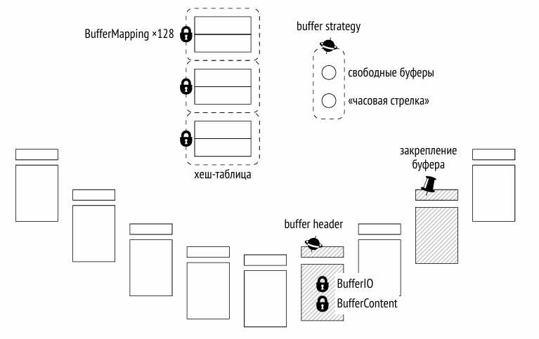
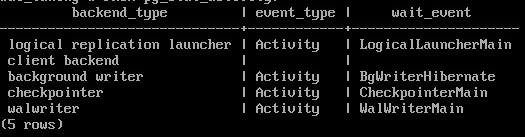

Блокировки в оперативной памяти
###############################

Долговременные блокировки действующие обычно до конца транзакции и поддерживают множество режимов. Но процессы работают со структурами в разделяемой оперативной памяти, которые тоже необходимо
защищать. В локальной памяти процесса доступ ко всему имеет один процесс, а в разделяемой несколько процессов конкурируют за доступ к ресурсам.
Для этого используются более простые (и дешевые в смысле накладных расходов) блокировки.

Самые простые из них — спин-блокировки или спинлоки (spinlock).

Спин-блокировки
***************

Они предназначены для захвата на очень короткое время (несколько инструкций процессора) и защищают отдельные поля структур данных от одновременного изменения.

Спин-блокировки реализуются на основе атомарных инструкций процессора, например, compare-and-swap(https://ru.wikipedia.org/wiki/Сравнение_с_обменом).

Они захватываются только в **исключительном режиме**. Если блокировка занята, выполняется цикл активного ожидания — команда повторяется до тех пор, пока не выполнится успешно. 
Это имеет смысл, поскольку спин-блокировки применяются только в тех случаях, когда вероятность конфликта очень мала. 

Спин-блокировки не позволяют обнаруживать взаимоблокировки и не имеют никаких средств мониторинга. С прикладной точки зрения остается  только знать об их
существовании, за этим следят разработчики PostgreSQL
  
Легкие блокировки
*****************

Lightweight locks, lwlocks

Они захватываются на короткое время. Это время уже занимает не несколько инструкций процессора, а достаточное, например, на обход какой-нибудь структуры данных. 
Например, списка или хеш-таблицы. Как правило, легкая блокировка удерживается недолго, но в процессе ее удержания могут выполняться операции ввода-вывода, 
так что иногда время может оказаться и значительным.

Используются два режима блокирования: исключительный (для записи) и разделяемый (для чтения).

Поддерживается очередь ожидания. Однако пока блокировка удерживается в разделяемом режиме, другие читающие процессы проходят вне очереди. 
Очередь "нечестная" и поэтому в многоядерных системах с высокой степенью параллельности и большой нагрузкой это может приводить к непредсказуемо долгим ожиданиям процессов, 
которым требуется изменять данные.

(https://postgrespro.ru/list/thread-id/2400193).

Проверка взаимоблокировок не выполняется, как и для спин-блокировок. Но легкие блокировки имеют средства для мониторинга.

Закрепление буфера (buffer pin)
*******************************

Для каждого буфера ведется список работающих с ним процессов. Если буфер закреплен, в нем запрещены некоторые действия. 
Например, в страницу можно вставить новую строку (которую остальные процессы не увидят благодаря многоверсионности), но нельзя заменить одну страницу на другую.

Как правило, процессы пропускают закрепленный буфер и выбирают другой, чтобы не ждать снятия закрепления. 
Но в некоторых случаях, например, при заморозке страницы, когда требуется именно этот буфер, запрашивается *легкая блокировка в исключительном режиме*. 
При необходимости процесс ждет, пока все остальные процессы закончат работу с буфером. 
Ожидание при этом пассивное: система «будит» ожидающий процесс, когда закрепление снимается.

Взаимоблокировки невозможны, за этим следят разработчики PostgreSQL. 
Ожидания, связанные с закреплением, доступны для мониторинга через представление *pg_stat_activity*. 
Текущее количество закреплений буфера показывает расширение *pg_buffercache*

Примеры использования блокировок
================================

Буферный кеш
------------

Чтобы обратиться к хеш-таблице, содержащей ссылки на буферы, процесс должен захватить легкую блокировку **BufferMapping lock** в разделяемом режиме, 
а если таблицу требуется изменять — то в исключительном режиме. Обращения к хеш-таблице происходят очень активно, и зачастую эта блокировка становится узким местом. 
Всем нужен буферный кэш. И если заблокировать всю хэш-таблицу, то все остановится.
Чтобы увеличить гранулярность, эта блокировка устроена как *транш*, состоящий из 128 отдельных блокировок, каждая из которых защищает свою часть хеш-таблицы.
Поэтому в данном месте очереди, как правило, отсутствуют.

Доступ к *заголовку буфера* процесс получает с помощью *спин-блокировки* **buffer header**. 
Чаще всего отдельные операции (такие, как увеличение счетчика) могут выполняться и без явных блокировок, с помощью атомарных инструкций процессора.
Но если тебуется что-то посложнее, то захватывается блокировка.

Чтобы прочитать содержимое буфера, требуется блокировка **BufferContent lock**. Обычно она захватывается только для чтения указателей на версии строк, 
а дальше достаточно защиты, предоставляемой закреплением буфера. Строки никуда не денутся. 
*Для изменения* содержимого буфера (смена версии строки) эта блокировка захватывается в *исключительном* режиме.

При чтении буфера с диска (или записи на диск) в его заголовке устанавливается признак **IO in progress**, который сигнализирует другим процессам, 
что страница читается — они могут встать в очередь, если им тоже нужна та же самая страница.

Указатели на свободные буферы и на следующую жертву защищены одной спин-блокировкой **buffer strategy lock**.

Буферы журнала предзаписи
-------------------------

Для журнального кеша тоже используется хеш-таблица, содержащая отображение страниц в буферы. 
В отличие от хеш-таблицы буферного кеша, эта хеш-таблица защищена единственной легкой блокировкой **WALBufMapping lock**, 
поскольку размер журнального кеша меньше (обычно 1/32 от буферного кеша) и обращение к его буферам более упорядочено.

Запись страниц на диск защищена легкой блокировкой WALWrite lock, чтобы только один процесс одновременно мог выполнять эту операцию.

Чтобы создать журнальную запись, процесс должен сначала зарезервировать место в странице. Для этого он захватывает спин-блокировку **insert position lock**, 
защищающую указатель вставки. После того, как место зарезервировано, процесс копирует содержимое своей записи в отведенное место. 
Эта операция может выполняться несколькими процессами одновременно, для чего запись защищена траншем из восьми *легких* блокировок **WALInsert lock**.

Блокировок на самом деле больше, но для иллюстрации достаточно. Остальные важны лишт для разработчиков ядра.

Мониторинг ожиданий
*******************

Блокировки необходимы для корректной работы, но они могут  приводить и к нежелательным ожиданиям. Такие ожидания полезно отслеживать, 
чтобы разобраться в причине их возникновения.

Самый простой способ получить представление о длительных блокировках в системе — включить параметр **log_lock_waits**. В этом случае в журнал сообщений 
сервера будут попадать подробные сведения о блокировке каждый раз, когда транзакция ждет дольше, чем  *deadlock_timeout*. Эти данные выводятся, 
когда транзакция завершает проверку на взаимоблокировки, отсюда и имя параметра.

Но гораздо более полную и полезную информацию можно найти в представлении **pg_stat_activity**. Когда процесс — системный или обслуживающий — не может выполнять 
свою работу и ждет чего-либо, это ожидание отображается в столбцах **wait_event_type** (тип ожидания) и **wait_event** (имя конкретного ожидания).

Типы ожиданий:
 Большую категорию составляют ожидания различных блокировок:
 
- Lock — тяжелых блокировок;

- LWLock —легких блокировок;

- BufferPin — закрепленного буфера.
 
Но процессы могут ожидать и других событий:

- IO — ввода-вывода,когда требуется записать или прочитать данные;

- Client — данных от клиента (в этом состоянии обычно проводит бóльшую  часть времени psql);

- IPC —данных от другого процесса;

- Extension —специфического события,зарегистрированного расширением.

Бывают ситуации,когда процесс просто не выполняет полезной работы. Как  правило, такие ожидания «нормальны» и не говорят о каких-либо проблемах.

К этой категории относятся ожидания:

- Activity —фоновых процессов в своем основном цикле;
 
- Timeout —таймера.
 
Каждый тип конкретизируется именем ожидания. Например, для легких блокировок это будет имя блокировки или соответствующего транша.
Следует учитывать, что представление показывает только те ожидания, которые соответствующим образом обрабатываются в исходном коде. Если
имя типа ожидания не определено, процесс не находится ни в одном известном ожидании. Такое время следует считать неучтенным, так как это
не означает со стопроцентной вероятностью, что процесс ничего не ждет; на самом деле неизвестно,что именно происходи в этот момент.

::

	SELECT backend_type, wait_event_type AS event_type, wait_event
	FROM pg_stat_activity;

В данном случае во время обращения к представлению все фоновые служебные процессы простаивали, а обслуживающий процесс (client backend) 
был занят выполнением запроса и ничего не ждал.

Семплирование
=============

К сожалению, представление pg_stat_activity показывает информацию об ожиданиях только на текущий момент; статистика не накапливается.
Единственный способ получить картину ожиданий во времени — *семплирование* состояния представления с определенным интервалом.

При семплировании надо учитывать его вероятностный характер. Чтобы получить более или менее достоверную картину, число измерений должно быть достаточно высоко. 
Поэтому семплирование с низкой частотой не даст достоверной картины, а повышение частоты приводит к увеличению накладных расходов. 
По той же причине семплирование бесполезно для анализа короткоживущих сеансов.

Встроенных средств для этого не предусмотрено, но можно использовать расширения, например, *pg_wait_sampling*.

https://github.com/postgrespro/pg_wait_sampling

Практика
--------

Чтобы получить более или менее полную картину ожиданий процесса, требуется выполнять семплирование с некоторой частотой. Воспользуемся расширением *pg_wait_sampling*.

Расширение уже установлено, но необходимо внести в конфигурационный параметр **shared_preload_libraries** название загружаемой библиотеки расширения. Применение этого параметра требует перезагрузки сервера.

::

	ALTER SYSTEM SET shared_preload_libraries = 'pg_wait_sampling';

::

	sudo pg_ctlcluster 16 main restart
	psql -U postgres 
	
Создать расширение в базе данных.

::

	CREATE DATABASE locks_memory;

::

	\c locks_memory

::

	CREATE EXTENSION pg_wait_sampling;

Расширение позволяет просмотреть некоторую историю ожиданий, которая хранится в кольцевом буфере. 
Но интереснее увидеть профиль ожиданий — накопленную статистику за все время работы.

Подождем несколько секунд и заглянем в профиль...

::

	SELECT * FROM pg_wait_sampling_profile ORDER BY 1;

	  pid   | event_type |        event        | queryid | count 
	--------+------------+---------------------+---------+-------
	 153088 | Activity   | CheckpointerMain    |       0 |   831
	 153089 | Activity   | BgWriterMain        |       0 |   831
	 153091 | IO         | WALSync             |       0 |    19
	 153091 | Activity   | WalWriterMain       |       0 |   812
	 153092 | Activity   | AutoVacuumMain      |       0 |   831
	 153094 | Activity   | LogicalLauncherMain |       0 |   831
	 153098 |            |                     |       0 |     1
	 153136 | IO         | VersionFileSync     |       0 |     2
	 153136 | IO         | WALSync             |       0 |     2
	 153136 |            |                     |       0 |   289
	 153136 | IO         | RelationMapReplace  |       0 |     4
	 153136 | IO         | DataFileRead        |       0 |     3
	 153136 | Client     | ClientRead          |       0 |    11
	 153186 |            |                     |       0 |     1
	 153186 | Client     | ClientRead          |       0 |   301
	 153186 | IO         | WALSync             |       0 |     2
	(16 rows)

Поскольку за прошедшее после запуска сервера время ничего не происходило, основные ожидания относятся к типу Activity (служебные процессы ждут, пока появится работа) 
и Client (psql ждет, пока пользователь пришлет запрос).

Строки с пустыми значениями event_type и event фиксируют ситуации, когда процесс ничего не ожидает (но работает и занимает процессорное время). 
За отображение таких строк отвечает параметр pg_wait_sampling.sample_cpu:

::

	SHOW pg_wait_sampling.sample_cpu;

	 pg_wait_sampling.sample_cpu 
	-----------------------------
	 on
	(1 row)

С установками по умолчанию частота семплирования — 100 раз в секунду. Поэтому, чтобы оценить длительность ожиданий в секундах, значение count надо делить на 100.

Чтобы понять, к какому процессу относятся ожидания, добавим к запросу представление pg_stat_activity:

::

	SELECT p.pid, a.backend_type, a.application_name AS app, p.event_type, p.event, p.count
	FROM pg_wait_sampling_profile p
	LEFT JOIN pg_stat_activity a ON p.pid = a.pid
	ORDER BY p.pid, p.count DESC;

	  pid   |         backend_type         | app  | event_type |        event        | count 
	--------+------------------------------+------+------------+---------------------+-------
	 153088 | checkpointer                 |      | Activity   | CheckpointerMain    |   861
	 153089 | background writer            |      | Activity   | BgWriterMain        |   861
	 153091 | walwriter                    |      | Activity   | WalWriterMain       |   842
	 153091 | walwriter                    |      | IO         | WALSync             |    19
	 153092 | autovacuum launcher          |      | Activity   | AutoVacuumMain      |   861
	 153094 | logical replication launcher |      | Activity   | LogicalLauncherMain |   861
	 153098 |                              |      |            |                     |     1
	 153136 |                              |      |            |                     |   289
	 153136 |                              |      | Client     | ClientRead          |    11
	 153136 |                              |      | IO         | RelationMapReplace  |     4
	 153136 |                              |      | IO         | DataFileRead        |     3
	 153136 |                              |      | IO         | WALSync             |     2
	 153136 |                              |      | IO         | VersionFileSync     |     2
	 153186 | client backend               | psql | Client     | ClientRead          |   331
	 153186 | client backend               | psql | IO         | WALSync             |     2
	 153186 | client backend               | psql |            |                     |     1
	(16 rows)

Подготовить базу для получения нагрузки с помощью pgbench и наблюдать, как изменится картина.

::

	student$ pgbench -i locks_memory

	dropping old tables...
	NOTICE:  table "pgbench_accounts" does not exist, skipping
	NOTICE:  table "pgbench_branches" does not exist, skipping
	NOTICE:  table "pgbench_history" does not exist, skipping
	NOTICE:  table "pgbench_tellers" does not exist, skipping
	creating tables...
	generating data (client-side)...
	100000 of 100000 tuples (100%) done (elapsed 0.32 s, remaining 0.00 s)
	vacuuming...
	creating primary keys...
	done in 0.73 s (drop tables 0.00 s, create tables 0.04 s, client-side generate 0.38 s, 
	vacuum 0.15 s, primary keys 0.15 s).

Сбросить собранный профиль в ноль и запустить тест на 30 секунд в отдельном процессе. Одновременно смотреть, как изменяется профиль.

::

	SELECT pg_wait_sampling_reset_profile();

	 pg_wait_sampling_reset_profile 
	--------------------------------
	 
	(1 row)

::
	admin$pgbench -T 30 locks_memory

::

	SELECT p.pid, a.backend_type, a.application_name AS app, p.event_type, p.event, p.count
	FROM pg_wait_sampling_profile p
	  LEFT JOIN pg_stat_activity a ON p.pid = a.pid
	WHERE a.application_name = 'pgbench'
	ORDER BY p.pid, p.count DESC;

	  pid   |  backend_type  |   app   | event_type |    event     | count 
	--------+----------------+---------+------------+--------------+-------
	 153615 | client backend | pgbench | IO         | WALSync      |   158
	 153615 | client backend | pgbench |            |              |    29
	 153615 | client backend | pgbench | IO         | DataFileRead |     1
	(3 rows)

::
	
	\g

	  pid   |  backend_type  |   app   | event_type |     event      | count 
	--------+----------------+---------+------------+----------------+-------
	 153615 | client backend | pgbench | IO         | WALSync        |  1186
	 153615 | client backend | pgbench |            |                |   161
	 153615 | client backend | pgbench | IO         | WALWrite       |     4
	 153615 | client backend | pgbench | IO         | DataFileRead   |     1
	 153615 | client backend | pgbench | IO         | DataFileExtend |     1
	 153615 | client backend | pgbench | Client     | ClientRead     |     1
	 153615 | client backend | pgbench | LWLock     | WALWrite       |     1
	(7 rows)

::

	\g

	  pid   |  backend_type  |   app   | event_type |     event      | count 
	--------+----------------+---------+------------+----------------+-------
	 153615 | client backend | pgbench | IO         | WALSync        |  2185
	 153615 | client backend | pgbench |            |                |   329
	 153615 | client backend | pgbench | IO         | WALWrite       |     9
	 153615 | client backend | pgbench | IO         | DataFileRead   |     1
	 153615 | client backend | pgbench | IO         | DataFileExtend |     1
	 153615 | client backend | pgbench | Client     | ClientRead     |     1
	 153615 | client backend | pgbench | LWLock     | WALWrite       |     1
	(7 rows)

Ожидания процесса pgbench будут получаться разными в зависимости от конкретной системы. 
C большой вероятностью будет представлено ожидание записи и синхронизации журнала (IO/WALSync, IO/WALWrite).

::

	pgbench (16.3 (Ubuntu 16.3-1.pgdg22.04+1))
	starting vacuum...end.
	transaction type: <builtin: TPC-B (sort of)>
	scaling factor: 1
	query mode: simple
	number of clients: 1
	number of threads: 1
	maximum number of tries: 1
	duration: 30 s
	number of transactions actually processed: 4163
	number of failed transactions: 0 (0.000%)
	latency average = 7.206 ms
	initial connection time = 2.669 ms
	tps = 138.766218 (without initial connection time)

Легкие блокировки
^^^^^^^^^^^^^^^^^

Всегда нужно помнить, что отсутствие какого-либо ожидания при семплировании не говорит о том, что ожидания не было. Если оно было короче, чем период семплирования (сотая часть секунды в нашем примере), то могло просто не попасть в выборку.

Поэтому легкие блокировки скорее всего не появились в профиле — но появятся, если собирать данные в течении длительного времени.

Чтобы гарантированно увидеть их, подключимся к кластеру slow с замедленной файловой системой: в ней любая операция ввода-вывода будет занимать 1/10 секунды.

::

	admin$ sudo pg_ctlcluster 16 main stop
	admin$ sudo pg_ctlcluster 16 slow start
	
Еще раз сбросим профиль и дадим нагрузку.

::

	\c

::

	SELECT pg_wait_sampling_reset_profile();

	 pg_wait_sampling_reset_profile 
	--------------------------------
	 
	(1 row)

::

	admin$ pgbench -T 30 locks_memory

::

	SELECT p.pid, a.backend_type, a.application_name AS app, p.event_type, p.event, p.count
	FROM pg_wait_sampling_profile p
	  LEFT JOIN pg_stat_activity a ON p.pid = a.pid
	WHERE a.application_name = 'pgbench'
	ORDER BY p.pid, p.count DESC;

	  pid   |  backend_type  |   app   | event_type |    event     | count 
	--------+----------------+---------+------------+--------------+-------
	 154026 | client backend | pgbench | LWLock     | WALWrite     |   182
	 154026 | client backend | pgbench |            |              |     8
	 154026 | client backend | pgbench | IO         | DataFileRead |     1
	(3 rows)

::

	\g
	  pid   |  backend_type  |   app   | event_type |     event      | count 
	--------+----------------+---------+------------+----------------+-------
	 154075 | client backend | pgbench | IO         | WALWrite       |   932
	 154075 | client backend | pgbench | LWLock     | WALWrite       |    55
	 154075 | client backend | pgbench | IO         | WALSync        |    45
	 154075 | client backend | pgbench | IO         | DataFileExtend |    20
	 154075 | client backend | pgbench |            |                |    13
	 154075 | client backend | pgbench | IO         | DataFileRead   |     1
	(6 rows)

::

	\g
	
      pid   |  backend_type  |   app   | event_type |     event      | count 
	--------+----------------+---------+------------+----------------+-------
	 154075 | client backend | pgbench | IO         | WALWrite       |  2046
	 154075 | client backend | pgbench | IO         | WALSync        |   101
	 154075 | client backend | pgbench | LWLock     | WALWrite       |    55
	 154075 | client backend | pgbench | IO         | DataFileExtend |    20
	 154075 | client backend | pgbench |            |                |    16
	 154075 | client backend | pgbench | IO         | DataFileRead   |     2
	(6 rows)

Теперь основное ожидание процесса pgbench связано с вводом-выводом, точнее с записью журнала, которая выполняется в синхронном режиме при каждой фиксации. Поскольку (вспомним слайд презентации) запись журнала на диск защищена легкой блокировкой WALWriteLock, она также присутствует в профиле.

::

	pgbench (16.3 (Ubuntu 16.3-1.pgdg22.04+1))
	
	starting vacuum...end.
	transaction type: <builtin: TPC-B (sort of)>
	scaling factor: 1
	query mode: simple
	number of clients: 1
	number of threads: 1
	maximum number of tries: 1
	duration: 30 s
	number of transactions actually processed: 63
	number of failed transactions: 0 (0.000%)
	latency average = 482.915 ms
	initial connection time = 81.537 ms
	tps = 2.070758 (without initial connection time)
