Терминальный клиент psql
#####################

Программа **psql** — это терминальный клиент для работы с PostgreSQL. 
Она позволяет интерактивно вводить запросы, передавать их в PostgreSQL и видеть результаты. 
Также запросы могут быть получены из файла или из аргументов командной строки. 
Кроме того, psql предоставляет ряд метакоманд и различные возможности, подобные тем, 
что имеются у командных оболочек, для облегчения написания скриптов и автоматизации широкого спектра задач.

Данный инструмент предназначен в первую очередь для администраторов.

Подключение к базе данных
*************************

**Синтаксис команды подключения:**

*Полная форма:*

::

	psql -d <db> -U <username> -h <server> -p <port>

::

	psql -U postgres

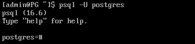

Так как база данных не была указана, то подключение произошло к базе *postgres* через Unix-сокет.
Это можно увидеть, введя команду **\conninfo**.

**/conninfo** - вывод информации о текущем подключении:

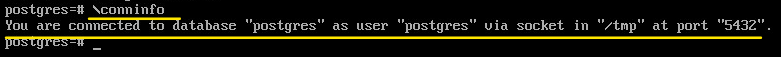

Приглашение вида:

::

	postgres=# 
	
означает, что работа осуществляется в привилегированном режиме.

::

	=>
	
непривилегированный режим

**CTRL+D** - выход из сеанса psql.

*Сокращенная форма*

::

	psql

В данном случае psql попробует подключиться, используя значения по умолчанию:

- база — совпадает с именем пользователя(admin);
- пользователь — совпадает с именем пользователя ОС(admin);
- узел — соединение через Unix-socket;
- порт — 5432.

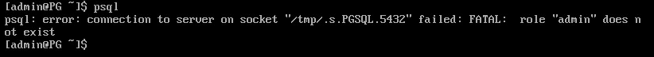

В этом примере пользователь **admin** отстутствует среди зарегистрированных в кластере.

::

	psql -U postgres

**\c[onnect]** - метакоманда для подключения к базе данных из сеанса psql

Синтаксис:

::

	\c <db> <username> <server> <port>

::

	\c dvdrental
	
.. figure:: img/03_conn_dvdrental.png
       :scale: 100 %
       :align: center
       :alt: asda

Справочная информация
**********************

Основной источник справочной информации - это официальная документация postgres

https://postgrespro.ru/docs

Однако, имеются встроенные средства получения справочной информации:

Справка из командной строки Linux:

::

	psql --help | less
	
::

	man psql
	
Из сеанса psql:

- **\\?** список команд psql
- **\\? variables** переменные psql
- **\\h[elp]** список команд SQL
- **\\h  команда** синтаксис команды SQL
- **\\q** выход

Ввод команд SQL и вывод результата
**********************************

Комманды SQL можно вводить в одной строке, но так как они могут быть очень длинными, то ввод можно разбивать на несколько строк.

.. important:: Окончанием ввода команды является символ "точка-с-запятой".

::

	SELECT * FROM actor LIMIT 5;

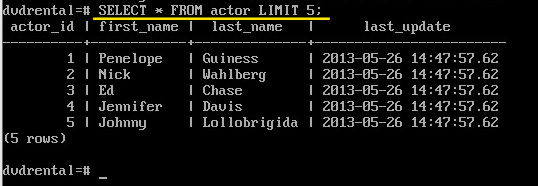

::

	SELECT * FROM actor
	WHERE last_name LIKE 'G%';

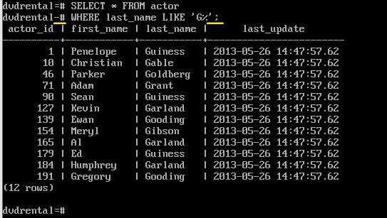

Приглашение вида **-#** означает продолжение ввода команды SQL.

Форматирование вывода
=======================

По-умолчанию результат выводится в виде таблицы с заголовками:

	   
Выравнивание в столбце производится по самой длинной строке.
	   
Отключение (включение) параметров форматирования:

- \a - отключить (включить) выравнивание
- \t - отключить (включить) вывод заголовков.

Отключение выравнивания:

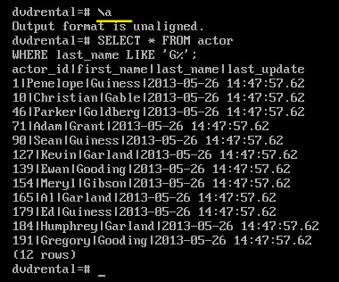
	   
Отключение заголовков:

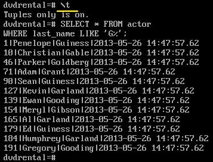

Установка параметров форматирования
---------------------

**\pset**

Получение значений параметров форматирования:
^^^^^^^^^^^^^^^^^^^^^^^^^^^^^^^^^^^^^^^^^^^^

::

	\pset

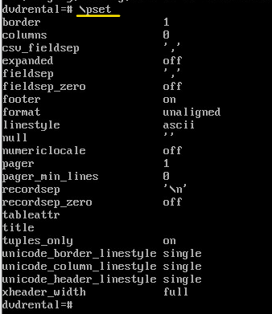

Установка разделителя вывода
^^^^^^^^^^^^^^^^^^^^^^^^^^^^^^^

Например, если потребуется создать csv-файл c результатами SQL выборки, то можно установить в качестве разделителя
символ "запятая" и потом полученный результат передать в файл.  

::
	\t
	\pset fieldsep ','
	
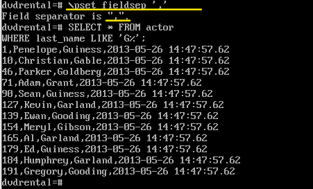

Отправка результата запроса в файл:
^^^^^^^^^^^^^^^^^^^^^^^^^^^^^^^^^^^^^
	   
Для того, чтобы отправить результат запроса SQL в файл можно завершить ввод запроса 
командой **\g** с указанием имени файла:

::
	SELECT * FROM actor
	WHERE last_name LIKE 'G%' \g actor.csv
	

Отправка результата запроса в туннель:
^^^^^^^^^^^^^^^^^^^^^^^^^^^^^^^^^^^^^
	   
Для того, чтобы отправить результат запроса SQL в файл можно завершить ввод запроса 
командой **\g** с указанием имени файла:

::
	SELECT * FROM actor
	WHERE last_name LIKE 'G%' \g | cat -n

В результате выполнится запрос и его результат будет отправлен команде Linux **cat** в конвейере
	
Выполнение команд shell из psql
^^^^^^^^^^^^^^^^^^^^^^^

Синтаксис:

::

	\! <команда >

Просмотр содержимого файла:

::
	
	\! actor.csv
	
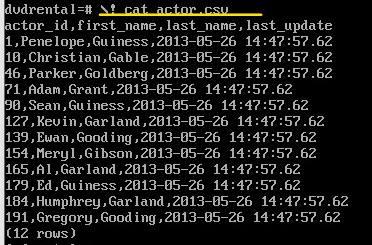

::
	
	\! pwd

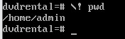

	

