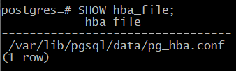

Управление доступом
###################

Роли и атрибуты
***************

PostgreSQL использует концепцию ролей (roles) для управления разрешениями на доступ к базе данных. 

**Роль в базах данных** — это объект, который управляет правами доступа к объектам базы данных (например, таблицам и функциям). 
Роль может рассматриваться как пользователь базы данных или группа пользователей, в зависимости от того, как она установлена.

То есть  это пользователь СУБД. Роль может быть пользователем СУБД, а может включать в себя другие роли и оказаться таким образом целой группой.

Особенности ролей:

- Могут владеть объектами, на которые имеют полные права. 

- Могут назначать права для этих объектов другим ролям, контролируя, кто имеет доступ к каким объектам. 

- Можно предоставить членство в роли другой роли, чтобы использовать её привилегии. 

Концепция ролей включает в себя концепцию пользователей («users») и групп («groups»). До версии 8.1 в PostgreSQL пользователи и группы были отдельными сущностями, 
но теперь есть только роли. 

Роли базы данных концептуально отделены от пользователей операционной системы, но можно создавать роли, соответствующие пользователям операционной системы.
Например, psql, запущенный от имени пользователя ОС **postgres**, автоматически использует одноименную роль **postgres** 
(если в ключах утилиты не указано что-то другое). 

При создании кластера определяется одна начальная роль, имеющая суперпользовательский доступ (обычно она называется postgres).
В дальнейшем роли можно создавать, изменять и удалять.

https://postgrespro.ru/docs/postgresql/16/database-roles

Роль обладает некоторыми атрибутами, определяющими ее общие особенности и права (не связанные с определенными объектами).
То есть атрибуты - это свойства роли, которые что эта роль в системе может делать.

Обычно атрибуты имеют два варианта, например:

*CREATEDB* - дает право на создание БД

*NOCREATEDB* - не дает такого права

*LOGIN* - эта роль — пользователь.

*NOLOGIN* — роль не является пользовательской и не сможет подключиться к серверу; такие роли обычно используют для включения других ролей.

*SUPERUSER, NOSUPERUSER*

*CREATEROLE, NOCREATEROLE*

Подробнее:

https://postgrespro.ru/docs/postgresql/16/role-attributes

https://postgrespro.ru/docs/postgresql/16/sql-createrole

Практика:

Создать роль для пользователя Алисы. В команде указаны два атрибута.

В этой теме нам важно, от имени какой роли выполняются команды, поэтому имя текущей роли вынесено в приглашение.

postgres=# CREATE ROLE alice LOGIN PASSWORD 'alice';

CREATE ROLE

*LOGIN* - атрибут, позволяющий Алисе зайти в сеанс, может подключиться к базе данных.

Список ролей можно узнать командой:

student=# \du

	   
Роль postgres является суперпользователем. Поэтому до сих пор мы не задумывались о разграничении доступа.

Создадим и базу данных:

postgres=# CREATE DATABASE access_overview;
CREATE DATABASE

postgres=# \c access_overview
You are now connected to database "access_overview" as user "student".

Подключение к серверу
*********************

Для каждого нового клиента сервер определяет, надо ли разрешить подключение к базе данных. 

При подключении к серверу базы данных, клиентское приложение указывает имя пользователя PostgreSQL, так же как и при обычном входе пользователя на компьютер с ОС Unix. 
При работе в среде SQL по имени пользователя определяется, какие у него есть права доступа к объектам базы данных. 
Следовательно, важно указать на этом этапе, к каким базам пользователь имеет право подключиться.

**Аутентификация** это процесс идентификации клиента сервером базы данных, а также определение того, 
может ли клиентское приложение (или пользователь запустивший приложение) подключиться с указанным именем пользователя.

Настройки подключения определяются в конфигурационном файле pg_hba.conf («host-based authentication»). 

	   
::

	sudo -u postgres cat /var/lib/pgsql/data/pg_hba.conf | less

Как и с основным конфигурационным файлом postgresql.conf, изменения вступают в силу только после перечитывания файла сервером (SQL-функцией pg_reload_conf() 
или командой reload утилиты управления).

При появлении нового клиента сервер просматривает конфигурационный файл сверху вниз в поисках строки, подходящей к запрашиваемому клиентом подключению. 

Соответствие определяется по четырем полям: типу подключения, имени БД, имени пользователя и IP-адресу (отделяются пробеломи или Tab)

**Основные возможности:**

**TYPE** local (unix-сокеты) или host (подключение по протоколу TCP/IP). Не привязан к сетевым интерфейсам. В поле ADDRESS для него отсутствуют значения.

*local* не привязан к сетевым интерфейсам. В поле ADDRESS для него отсутствуют значения.

*host* это подключение через какой-то сетевой адаптер, который прослушивается postgres. Это может быть loopback или любой другой. 

**DATABASE** – ключевое слово all (соответствует любой БД) или имя конкретной базы данных (можно перечислить через запятую).

**USER** — all или имя конкретной роли (можно перечислить через запятую).

**ADDRESS** — all, диапазон IP-адресов или доменное имя. Не указывается для типа local. 

По умолчанию PostgreSQL слушает входящие соединения только с localhost; обычно параметр listen_addresses ставят в значение «*» 
(слушать все интерфейсы) и дальше регулируют доступ средствами pg_hba.conf.

https://postgrespro.ru/docs/postgresql/16/client-authentication
	   
Когда в файле найдена подходящая строка, выполняется аутентификация указанным в этой строке методом, а также проверяется наличие атрибута 
LOGIN и привилегии CONNECT. Если результат проверки успешен, то подключение разрешается, иначе — запрещается (другие строки файла при этом уже не рассматриваются).

Если ни одна из строк не подошла, то доступ также запрещается.

Таким образом, записи в файле должны идти сверху вниз от частных правил к общим.

Существует множество методов аутентификации:

https://postgrespro.ru/docs/postgresql/16/auth-methods

Основные методы аутентификации:

- **trust** безусловно разрешает подключение. Если вопросы безопасности не важны, можно указать «все all» и метод trust — тогда будут разрешены все подключения.

- **reject** безусловно запрещает подключение. Например, чтобы запретить нешифрованные соединения. 

- **scram-sha-256** запрашивает у пользователя пароль и проверяет его соответствие хешу, который хранится в системном каталоге кластера. 

- **md5** парольный метод также используется, но объявлен устаревшим.

- **peer** запрашивает имя пользователя у операционной системы и разрешает подключение, если имя пользователя ОС и пользователя БД совпадают.

Правила проверяются сверху-вниз до первого совпавшего правила. Если такое есть, то выполняется указанный метод аутентификации и принимается то решение разрешать вход или нет.

Если не нашлось ни одного подходящего для данного конкретного пользователя правила, то соединение запрещается.

Парольная аутентификация
************************

Если используется аутентификация по паролю, для роли обязательно должен быть установлен пароль, иначе в доступе будет отказано.

Хеш-код пароля хранится в системном каталоге в таблице pg_authid.

Пользователь может вводить пароль вручную, а может автоматизировать его ввод (например, для приложений): 

- переменная окружения **PGPASSWORD** на клиенте. Однако это неудобно, если приходится подключаться к нескольким базам и не рекомендуется из соображений безопасности.

- файл **~/.pgpass** на клиенте. К файлу должен иметь доступ только его владелец (установлены права доступа 600), иначе PostgreSQL проигнорирует его.

Формат записи:

::

	узел:порт:база:роль:пароль
	
Можно использовать шаблон *

Практика:

Чтобы роль смогла подключиться к базе данных, она должна иметь не только атрибут **LOGIN**, 
но и разрешение в файле **pg_hba.conf**. Располагается он обычно рядом с основным конфигурационным файлом:

postgres=# SHOW hba_file;

Можно получить содержимое с помощью SQL:

postgres=# SELECT type, database, user_name, address, auth_method FROM pg_hba_file_rules();

.. figure:: img/04_role05.png
       :scale: 100 %
       :align: center
       :alt: asda

Выполним подключение к localhost по TCP/IP (host). Такому подключению соответствует вторая строка выборки. Она предполагает аутентификацию по паролю.

student$ psql 'host=localhost user=alice dbname=access_overview password=alice'

	
