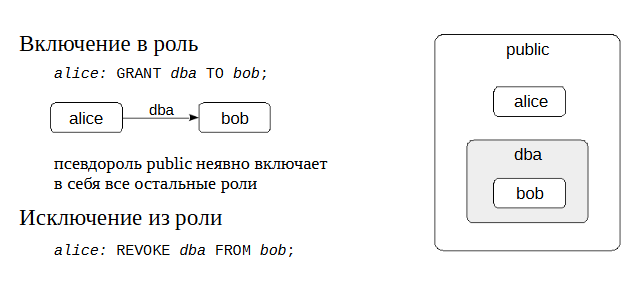
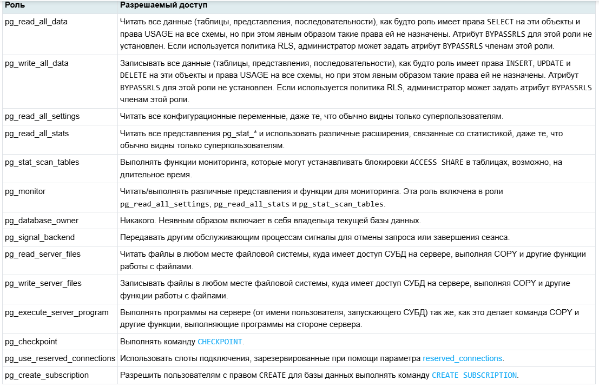
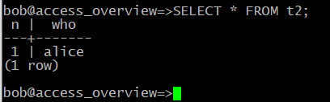
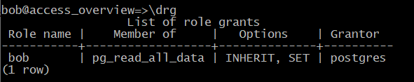
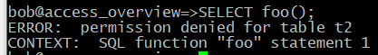
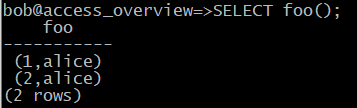
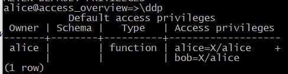
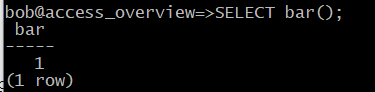

Управление доступом
###################

Роли и атрибуты
***************

PostgreSQL использует концепцию ролей (roles) для управления разрешениями на доступ к базе данных. 

**Роль в базах данных** — это объект, который управляет правами доступа к объектам базы данных (например, таблицам и функциям). 
Роль может рассматриваться как пользователь базы данных или группа пользователей, в зависимости от того, как она установлена.

То есть  это пользователь СУБД. Роль может быть пользователем СУБД, а может включать в себя другие роли и оказаться таким образом целой группой.

Особенности ролей:

- Могут владеть объектами, на которые имеют полные права. 

- Могут назначать права для этих объектов другим ролям, контролируя, кто имеет доступ к каким объектам. 

- Можно предоставить членство в роли другой роли, чтобы использовать её привилегии. 

Концепция ролей включает в себя концепцию пользователей («users») и групп («groups»). До версии 8.1 в PostgreSQL пользователи и группы были отдельными сущностями, 
но теперь есть только роли. 

Роли базы данных концептуально отделены от пользователей операционной системы, но можно создавать роли, соответствующие пользователям операционной системы.
Например, psql, запущенный от имени пользователя ОС **postgres**, автоматически использует одноименную роль **postgres** 
(если в ключах утилиты не указано что-то другое). 

При создании кластера определяется одна начальная роль, имеющая суперпользовательский доступ (обычно она называется postgres).
В дальнейшем роли можно создавать, изменять и удалять.

https://postgrespro.ru/docs/postgresql/16/database-roles

Роль обладает некоторыми атрибутами, определяющими ее общие особенности и права (не связанные с определенными объектами).
То есть атрибуты - это свойства роли, которые что эта роль в системе может делать.

Обычно атрибуты имеют два варианта, например:

*CREATEDB* - дает право на создание БД

*NOCREATEDB* - не дает такого права

*LOGIN* - эта роль — пользователь.

*NOLOGIN* — роль не является пользовательской и не сможет подключиться к серверу; такие роли обычно используют для включения других ролей.

*SUPERUSER, NOSUPERUSER*

*CREATEROLE, NOCREATEROLE*

Подробнее:

https://postgrespro.ru/docs/postgresql/16/role-attributes

https://postgrespro.ru/docs/postgresql/16/sql-createrole

Практика:

Создать роль для пользователя Алисы. В команде указаны два атрибута.

В этой теме нам важно, от имени какой роли выполняются команды, поэтому имя текущей роли вынесено в приглашение.

postgres=# CREATE ROLE alice LOGIN PASSWORD 'alice';

CREATE ROLE

*LOGIN* - атрибут, позволяющий Алисе зайти в сеанс, может подключиться к базе данных.

Список ролей можно узнать командой:

student=# \\du

.. figure:: img/04_role01.png
       :scale: 100 %
       :align: center
       :alt: asda
	   
Роль postgres является суперпользователем. Поэтому до сих пор мы не задумывались о разграничении доступа.

Создадим и базу данных:

::

	postgres=# CREATE DATABASE access_overview;

CREATE DATABASE

::

	postgres=# \c access_overview

You are now connected to database "access_overview" as user "postgres".

Подключение к серверу
*********************

Для каждого нового клиента сервер определяет, надо ли разрешить подключение к базе данных. 

При подключении к серверу базы данных, клиентское приложение указывает имя пользователя PostgreSQL, так же как и при обычном входе пользователя на компьютер с ОС Unix. 
При работе в среде SQL по имени пользователя определяется, какие у него есть права доступа к объектам базы данных. 
Следовательно, важно указать на этом этапе, к каким базам пользователь имеет право подключиться.

**Аутентификация** это процесс идентификации клиента сервером базы данных, а также определение того, 
может ли клиентское приложение (или пользователь запустивший приложение) подключиться с указанным именем пользователя.

Настройки подключения определяются в конфигурационном файле **pg_hba.conf** («host-based authentication»). 

.. figure:: img/04_role02.png
       :scale: 100 %
       :align: center
       :alt: asda
	   
::

	sudo -u postgres cat /var/lib/pgsql/data/pg_hba.conf | less

Как и с основным конфигурационным файлом postgresql.conf, изменения вступают в силу только после перечитывания файла сервером (SQL-функцией pg_reload_conf() 
или командой reload утилиты управления).

При появлении нового клиента сервер просматривает конфигурационный файл сверху вниз в поисках строки, подходящей к запрашиваемому клиентом подключению. 

Соответствие определяется по четырем полям (отделяются пробелами или Tab): 

-типу подключения 

- имени БД 

- имени пользователя 

- IP-адресу 

**Основные возможности:**

**TYPE** local (unix-сокеты) или host (подключение по протоколу TCP/IP). Не привязан к сетевым интерфейсам. В поле ADDRESS для него отсутствуют значения.

*local* не привязан к сетевым интерфейсам. В поле ADDRESS для него отсутствуют значения.

*host* это подключение через какой-то сетевой адаптер, который прослушивается postgres. Это может быть loopback или любой другой. 

**DATABASE** – ключевое слово all (соответствует любой БД) или имя конкретной базы данных (можно перечислить через запятую).

**USER** — all или имя конкретной роли (можно перечислить через запятую).

**ADDRESS** — all, диапазон IP-адресов или доменное имя. Не указывается для типа local. 

По умолчанию PostgreSQL слушает входящие соединения только с localhost; обычно параметр listen_addresses ставят в значение «*» 
(слушать все интерфейсы) и дальше регулируют доступ средствами pg_hba.conf.

https://postgrespro.ru/docs/postgresql/16/client-authentication
	   
Когда в файле найдена подходящая строка, выполняется аутентификация указанным в этой строке методом, а также проверяется наличие атрибута 
LOGIN и привилегии CONNECT. Если результат проверки успешен, то подключение разрешается, иначе — запрещается (другие строки файла при этом уже не рассматриваются).

Если ни одна из строк не подошла, то доступ также запрещается.

Таким образом, записи в файле должны идти сверху вниз от частных правил к общим.

.. figure:: img/04_role03.png
       :scale: 100 %
       :align: center
       :alt: asda

Существует множество методов аутентификации:

https://postgrespro.ru/docs/postgresql/16/auth-methods

Основные методы аутентификации:

- **trust** безусловно разрешает подключение. Если вопросы безопасности не важны, можно указать «все all» и метод trust — тогда будут разрешены все подключения.

- **reject** безусловно запрещает подключение. Например, чтобы запретить нешифрованные соединения. 

- **scram-sha-256** запрашивает у пользователя пароль и проверяет его соответствие хешу, который хранится в системном каталоге кластера. 

- **md5** парольный метод также используется, но объявлен устаревшим.

- **peer** запрашивает имя пользователя у операционной системы и разрешает подключение, если имя пользователя ОС и пользователя БД совпадают.

Правила проверяются сверху-вниз до первого совпавшего правила. Если такое есть, то выполняется указанный метод аутентификации и принимается то решение разрешать вход или нет.

Если не нашлось ни одного подходящего для данного конкретного пользователя правила, то соединение запрещается.

Парольная аутентификация
************************

Если используется аутентификация по паролю, для роли обязательно должен быть установлен пароль, иначе в доступе будет отказано.

Хеш-код пароля хранится в системном каталоге в таблице pg_authid.

Пользователь может вводить пароль вручную, а может автоматизировать его ввод (например, для приложений): 

- переменная окружения **PGPASSWORD** на клиенте. Однако это неудобно, если приходится подключаться к нескольким базам и не рекомендуется из соображений безопасности.

- файл **~/.pgpass** на клиенте. К файлу должен иметь доступ только его владелец (установлены права доступа 600), иначе PostgreSQL проигнорирует его.

Формат записи:

::

	узел:порт:база:роль:пароль
	
Можно использовать шаблон *

Практика:

Чтобы роль смогла подключиться к базе данных, она должна иметь не только атрибут **LOGIN**, 
но и разрешение в файле **pg_hba.conf**. Располагается он обычно рядом с основным конфигурационным файлом:

::
	
	postgres=# SHOW hba_file;

.. figure:: img/04_role04.png
       :scale: 100 %
       :align: center
       :alt: asda

Можно получить содержимое с помощью SQL:

::

	postgres=# SELECT type, database, user_name, address, auth_method FROM pg_hba_file_rules();

Выполним подключение к localhost по TCP/IP (host). Такому подключению соответствует вторая строка выборки. Она предполагает аутентификацию по паролю.

::

	admin$ psql 'host=localhost user=alice dbname=access_overview password=alice'

.. figure:: img/04_role06.png
       :scale: 100 %
       :align: center
       :alt: asda

::

	\conninfo

	   
Параметры подключения ожидаемы.

Изменение пароля для роли alice:

::

	postgres=# ALTER ROLE alice PASSWORD 'alicepass';

Привилегии
**********

Привилегии устанавливают связь между субъектами (ролями) и объектами кластера. Они определяют действия, доступные для ролей в отношении этих объектов.
Роль - это действующий субъект, а объект это то, к чему этот субъект пытается получить доступ.

Список возможных привилегий отличается для объектов различных типов. 

Больше всего привилегий определено для таблиц и представлений. Часть из них можно задать не только для всего отношения, но и для отдельных столбцов.

https://postgrespro.ru/docs/postgresql/16/ddl-priv

https://postgrespro.ru/docs/postgresql/16/sql-grant

Привилегия **CREATE**

Привилегия CREATE для **табличных пространств** разрешающает создание **объектов** в этом пространстве.

CREATE для **баз данных** разрешает создавать **схемы** в этой БД

CREATE для **схемы** разрешает создавать **объекты** в этой схеме.

Привилегия **USAGE** схемы разрешает обращаться к объектам в этой схеме.

Для схем это право даёт доступ к содержащимся в них объектам (предполагается, что при этом имеются права, необходимые для доступа к самим объектам). 
То есть без этого разрешения доступа к *данным* не будет.
По сути это право позволяет субъекту «просматривать» объекты внутри схемы. 
Без этого разрешения имена объектов всё же можно будет узнать, например, обратившись к системным каталогам. 
Кроме того, если отозвать это право, в существующих сеансах могут оказаться операторы, для которых просмотр имён объектов был выполнен ранее, 
так что это право не позволяет абсолютно надёжно перекрыть доступ к объектам.

Для последовательностей это право позволяет использовать функции *currval* и *nextval*.

Привилегия **CONNECT** базы данных разрешает подключение к этой БД

Категории ролей
***************

Доступ роли к объекту определяется привилегиями. 

Но имеет смысл выделить три категории ролей и рассмотреть их по отдельности:

1. Роли с атрибутом **SUPERUSER** (суперпользователи). Такие роли могут делать все, что угодно — для них проверки разграничения доступа не выполняются.
Пользователь postgres является суперпользователем. Его нельзя удалить. Всех остальных (alice) можно сделать суперпользователем, а потом и поменять.

2. **Владелец объекта**. Изначально это роль, создавшая объект, хотя потом его можно сменить. 
Владельцем считается не только сама роль-владелец, но и любая другая роль, включенная в нее. Владелец объекта сразу получает полный набор привилегий для этого объекта.
У владельца имеются возможности которые вообще не регламентируется привилегиями. Саздал таблицу, может и DROP.
Но он не является суперпользователем. Владельца можно поменять и после этого переназначить все права.

В принципе, эти привилегии можно отозвать, но владелец объекта обладает также неотъемлемым правом совершать действия, не регламентируемые привилегиями. 
В частности, он может выдаватьи отзывать привилегии (в том числе и себе самому), удалять объект и т. п.

3. **Все остальные** роли имеют доступ к объекту только в рамках выданных им привилегий.Чтобы проверить, есть ли у роли необходимая привилегия в отношении некоторого объекта, 
можно воспользоваться функциями *has_*_privilege*:

https://postgrespro.ru/docs/postgresql/16/functions-info

Управление привилегиями
***********************

**GRANT** — определить права доступа

Команда GRANT имеет две основные разновидности: 

1. Назначает права для доступа к объектам баз данных (таблицам, столбцам, представлениям, сторонним таблицам, последовательностям, базам данных, обёрткам сторонних данных, 
сторонним серверам, функциям, процедурам, процедурным языкам, большим объектам, параметрам конфигурации, схемам, табличным пространствам или типам).

2. Назначает одни роли членами других. Эти разновидности во многом похожи, но имеют достаточно отличий.

Ключевое слово **PUBLIC** означает, что права даются всем ролям, включая те, что могут быть созданы позже. **PUBLIC** можно воспринимать как неявно определённую группу, в которую входят все роли. 
Любая конкретная роль получит в сумме все права, данные непосредственно ей и ролям, членом которых она является, а также права, данные роли **PUBLIC**.

**WITH GRANT OPTION** - получатель права, в свою очередь, может давать его другим

Возможные права:

SELECT

INSERT

UPDATE

DELETE

TRUNCATE

REFERENCES

TRIGGER

CREATE

CONNECT

TEMPORARY

EXECUTE

USAGE

SET

ALTER SYSTEM

**REVOKE** — отозвать права доступа.

Команда **REVOKE** лишает одну или несколько ролей прав, назначенных ранее. Ключевое слово **PUBLIC** обозначает неявно определённую группу всех ролей.

	   
Практика:

Настроить приглашение psql:
 
В файле **.psqlrc** создать запись:

::
 
	\set PROMPT1 '%n@%/%R%x%#'

Создание схемы для alice и несколько объектов в ней.

::

	alice=> CREATE SCHEMA alice;

ERROR:  permission denied for database access_overview

Ошибка возникла по причине отсутствия у Алисы привилегии для создания схем в БД. 

Алиса подключилась к базе который который владеет postgres для того чтобы алиса имела право внутри базы данных создать 
себе схему нужно чтобы у нее была привилегия которая называется **create**, выданная postgres.

Выдача привилегии:

::

	postgres=# GRANT CREATE ON DATABASE access_overview TO alice;
	
GRANT

::

	alice=> CREATE SCHEMA alice;

CREATE SCHEMA

Теперь, поскольку Алиса является владельцем своей схемы. Причем, схема одноименная с пользователем. Алиса имеет все привилегии на нее и может создавать в ней любые объекты. 
По умолчанию будет использоваться именно эта схема (В параметре search_path первым идет "$user"):

alice=> SELECT current_schemas(false);

	   
Алиса создает две таблицы.

::
	
	alice=> CREATE TABLE t1(n numeric);

CREATE TABLE

::

	alice=> INSERT INTO t1 VALUES (1);

INSERT 0 1

::

	alice=> CREATE TABLE t2(n numeric, who text DEFAULT current_user);

CREATE TABLE

::

	alice=> INSERT INTO t2(n) VALUES (1);

INSERT 0 1

Создать роль для пользователя Боба, который будет обращаться к объектам, принадлежащим Алисе.

::

	postgres=# CREATE ROLE bob LOGIN PASSWORD 'bobpass';

CREATE ROLE

::

	admin$ psql 'host=localhost user=bob dbname=access_overview password=bobpass'

Боб попробует обратиться к таблице t1.

::

	bob=> SELECT * FROM alice.t1;

ERROR:  permission denied for schema alice
LINE 1: SELECT * FROM alice.t1;

Нет доступа к схеме, так как Боб не суперпользователь и не владелец этой схемы.

Проверить права на доступ к схеме можно так (столбец Access privileges):

::

	alice=> \x \dn+ \x

Привилегии отображаются в формате: роль=привилегии/кем_предоставлены.

Каждая привилегия кодируется одним символом, в частности для схем:

U = usage;

C = create.

Если имя роли опущено (как в последней строке), то имеется в виду псевдороль public. 

Обратите внимание, что на схему public у псевдороли public есть лишь привилегия usage. Здесь *pg_database_owner* соответствует владельцу базы данных.

Если же опущено все поле (как в первой строке), то имеются в виду привилегии по умолчанию: alice имеет обе доступные привилегии на собственную схему, 
а остальные роли не имеют никаких.

Предоставим доступ к схеме для Боба. Это может сделать Алиса как владелец.

::

	alice=> GRANT CREATE, USAGE ON SCHEMA alice TO bob;

GRANT

Боб снова пробует обратиться к таблице:

::

	bob=> SELECT * FROM alice.t1;
	
ERROR:  permission denied for table t1

У Боба есть доступ к схеме, но нет доступа к самой таблице. Вот как проверить доступ:

::

	alice=> \dp alice.t1
	

И снова видим пустое поле: доступ есть только у владельца, то есть у Алисы.

Алиса предоставляет Бобу доступ на чтение и изменение:

::

	alice=> GRANT SELECT, UPDATE ON alice.t1 TO bob;

GRANT

А для второй таблицы — доступ на вставку и чтение одного столбца:

::

	alice=> GRANT SELECT(n), INSERT ON alice.t2 TO bob;

GRANT

Проверка привилегий:

alice=> \dp alice.*

Теперь пустое поле «проявилось», и мы видим, что в нем находится полный перечень привилегий. Ниже — обозначения, не все они вполне очевидные:

a = insert

r = select

w = update

d = delete

D = truncate

x = reference

t = trigger

Привилегии для столбцов отображаются отдельно (столбец Column privileges).

На этот раз попытки Боба увенчаются успехом. Чтобы не указывать каждый раз имя схемы, Боб добавляет его к своему пути поиска.

::

	bob=> ALTER ROLE bob SET search_path = public, alice;

ALTER ROLE

Теперь путь поиска будет устанавливаться в каждом сеансе Боба.

::

	bob=> \c

You are now connected to database "access_overview" as user "bob".

::

	bob=> SHOW search_path;

::

	bob=> UPDATE t1 SET n = n + 1;

UPDATE 1

::

	bob=> SELECT * FROM t1;

Но другие операции по-прежнему запрещены:

::

	bob=> DELETE FROM t1;
	
ERROR:  permission denied for table t1
И вторая таблица:

::

	bob=> INSERT INTO t2(n) VALUES (100);

INSERT 0 1

::

	bob=> SELECT n FROM t2;

А чтение другого столбца запрещено:

::

	bob=> SELECT * FROM t2;

ERROR:  permission denied for table t2

Групповая роль
**************

	   
В любую роль могут быть включены другие роли. В таком случае роль выступает в качестве группы. Отдельного понятия «группа» в PostgreSQL нет.

Роль может быть включена в несколько ролей; включенная роль может, в свою очередь, включать в себя третьи роли, но циклы при этом не допускаются.

По умолчанию роль наследует привилегии роли, в которую она включена. Это поведение можно изменить, указав роли атрибут **NOINHERIT** — тогда, 
чтобы воспользоваться привилегиями включающей роли, надо будет явно переключиться на нее с помощью **SET ROLE**. 
Атрибуты ролей не наследуются, но можно переключиться на включающую роль и воспользоваться ее атрибутами.

Роли, включающие другие роли, обычно имеют атрибут **NOLOGIN** и называются «групповыми». Фактически это именованный набор привилегий, 
который удобно «выдать» обычной роли точно так же, как выдается одиночная привилегия. Это упрощает управление доступом и администрирование.

Существует псевдороль **public**, которая неявно включает в себя все остальные роли. Если выдать какие-либо привилегии роли **public**, эти привилегии получат вообще все роли.

https://postgrespro.ru/docs/postgresql/16/role-membership

Предопределенные роли
*********************

В PostgreSQL имеется набор предопределенных ролей, имеющих доступ к часто востребованным, но не общедоступным функциями данным. 
Членство в этих ролях может быть предоставлено обычным пользователям для решения ряда задач администрирования — чтобы избежать наделения этих пользователей 
суперпользовательскими полномочиями.

Количество предопределенных ролей увеличивается с каждой новой версией PostgreSQL. 

Полный список всех ролей, включая предопределенные, можно просмотреть с помощью команды **\duS** в psql

https://postgrespro.ru/docs/postgresql/16/predefined-roles

Есть возможность создавать и свои собственные «административные» роли, например, для выполнения задач резервного копирования.

Роли *pg_monitor, pg_read_all_settings, pg_read_all_stats и pg_stat_scan_tables* созданы для того, чтобы администраторы могли легко настроить роль для мониторинга сервера БД. 
Эти роли наделяют своих членов набором общих прав, позволяющих читать различные полезные параметры конфигурации, статистику и другую системную информацию, 
что обычно доступно только суперпользователям.

Практика:

В предыдущем случае Боб не смог прочитать второй столбец таблицы:

::

	|| bob=> SELECT * FROM t2;
	
ERROR:  permission denied for table t2

Суперпользователь включает Боба в предопределенную роль **pg_read_all_data**:

::

	postgres=# GRANT pg_read_all_data TO bob;

GRANT ROLE

Теперь Боб сможет получить доступ на чтение ко всем таблицам так, как будто ему были выданы привилегии SELECT на все таблицы и USAGE на все схемы:

::

	|| bob=> SELECT * FROM t2;

Получить информацию о членстве в ролях можно с помощью команды \drg утилиты psql:

::

	|| bob=> \drg

	   
Столбец Options содержит информацию об атрибутах, описывающих включение. 
Здесь для роли bob, включенной в pg_read_all_data, SET означает возможность переключения на групповую роль, 
а INHERIT — использование привилегий группы без явного переключения на нее.

Исключим пользователя bob из группы:

::

	postgres=# REVOKE pg_read_all_data FROM bob;

REVOKE ROLE

Подпрограммы
************

Для функций и процедур есть единственная привилегия EXECUTE, разрешающая выполнение этой подпрограммы.

Важно от имени какого пользователя будет выполняться подпрограмма. 

Если подпрограмма объявлена как **SECURITY INVOKER** (по умолчанию), она выполняется с правами вызывающего пользователя. 
В этом случае операторы внутри подпрограммы смогут обращаться только к тем объектам, к которыму вызывающего пользователя есть доступ.

Если же указать фразу **SECURITY DEFINER**, подпрограмма работаетс правами ее владельца. 
Это позволяет другим пользователям выполнять определенные действия над объектами, к которым у них нет непосредственного доступа.

https://postgrespro.ru/docs/postgresql/16/sql-createfunction

https://postgrespro.ru/docs/postgresql/16/sql-createprocedure

Привилегии по умолчанию
***********************

Псевдороль **public** включает в себя все остальные роли, которые, таким образом, пользуются всеми привилегиями, выданными для public.

При этом public имеет довольно широкий спектр привилегий по умолчанию. В частности:

- право подключения к любой базе данных (именно поэтому роль alice смогла подключиться к базе данных несмотря на то, что привилегия CONNECT не выдавалась ей явно);

- доступ к системному каталогу;

- выполнение любых подпрограмм.

С одной стороны - это удобно, так как позволяет работать, не задумываясь о привилегиях, а с другой — создает определенные сложности, 
если  задумываться о безопасности и разграничении доступа..

Описанные выше привилегии появляются у **public** автоматически при создании новых объектов. 
То есть недостаточно, например, просто отозвать у public привилегию EXECUTE на все подпрограммы: как только появится новая, 
public немедленно получает привилегию на ее выполнение.

Однако существует специальный механизм «привилегий по умолчанию», который позволяет автоматически выдавать и отзывать привилегии при создании нового объекта. 
Этот механизм можно использовать и для отзыва права выполнения функций у псевдороли public.

**ALTER DEFAULT PRIVILEGES** — определить права доступа по умолчанию

Позволяет задавать права, которые будут применяться к объектам, созданным в будущем. (Она не влияет на права, назначенные уже существующим объектам.) 
Права могут быть заданы глобально (т. е. для всех объектов, создаваемых в текущей базе данных) или только для объектов, создаваемых в указанных схемах.
Можно изменять права только для схем, таблиц (включая представления и сторонние таблицы), последовательностей, функций и типов (включая домены). 

https://postgrespro.ru/docs/postgresql/16/sql-alterdefaultprivileges

Практика:

Алиса создает функцию:

::

	alice=> CREATE FUNCTION foo() RETURNS SETOF t2
			AS $$
			SELECT * FROM t2;
			$$ LANGUAGE sql STABLE;

CREATE FUNCTION

При создании таблицы создается сруктурированный тип, состоящий из столбцов этой таблицы.
То есть будут возвращаться кортежи, состоящие из значений столбцов.

Сможет ли Боб вызвать ее, если Алиса не выдала ему привилегию EXECUTE?
В силу того, что Боб является членом псевдоролей public, значит у него привилегия execute на функцию есть:

::

	| bob=> SELECT foo();

	   
Вызвать — да, но Боб не сможет получить доступ к объектам, на которые у него нет соответствующих привилегий (столбец who).
Членство в группе *pg_read_all_data* было отобрано.

Другой доступный вариант — объявить функцию как работающую с правами ее владельца:

::

	alice=> ALTER FUNCTION foo() SECURITY DEFINER;
	
ALTER FUNCTION

В этом случае функция всегда будет выполняться с правами Алисы, независимо от того, кто ее вызывает.

::

	| bob=> SELECT foo();
	

В этом случае Алисе надо внимательно следить за выданными привилегиями. 
Скорее всего, потребуется отозвать EXECUTE у роли public и выдавать ее явно только нужным ролям.

::

	alice=> REVOKE EXECUTE ON ALL ROUTINES IN SCHEMA alice FROM public;

REVOKE

::

	| bob=> SELECT foo();
	
ERROR:  permission denied for function foo

Но дело осложняется тем, что по умолчанию привилегия на выполнение автоматически выдается роли public на каждую 
вновь создаваемую функцию.

Для того чтобы конкретные пользователи получали или, наоборот, лишались тех или иных привилегий 
на вновь создаваемые объекты, можно настроить привилегии по умолчанию:

::

	alice=> ALTER DEFAULT PRIVILEGES
			FOR ROLE alice
			REVOKE EXECUTE ON ROUTINES FROM public;

ALTER DEFAULT PRIVILEGES

::

	alice=> ALTER DEFAULT PRIVILEGES
			FOR ROLE alice
			GRANT EXECUTE ON ROUTINES TO bob;

ALTER DEFAULT PRIVILEGES
			
::

	alice=> \ddp

Теперь Боб сразу получает привилегию на выполнение подпрограмм, создаваемых Алисой, 
а остальные пользователи не смогут их выполнять.

::

	alice=> CREATE FUNCTION bar() RETURNS integer
			LANGUAGE sql IMMUTABLE SECURITY DEFINER
			RETURN 1;
			
CREATE FUNCTION

::

	bob=> SELECT bar();

Практика
********

Настройте привилегии таким образом, чтобы одни пользователи имели полный доступ к таблицам, а другие могли только запрашивать, но не изменять информацию.

1. Создайте новую базу данных и двух пользователей: writer и reader.

2. Отзовите у роли public все привилегии на схему public, выдайте роли writer обе привилегии, а роли reader — только usage.

3. Настройте привилегии по умолчанию так, чтобы роль reader получала доступ на чтение к таблицам в схеме public, принадлежащим writer.

4. Создайте пользователя w1, включив его в роль writer, и пользователя r1, включив его в reader.

5. Под ролью writer создайте таблицу.

6. Убедитесь, что r1 имеет доступ к таблице только на чтение, а w1 имеет к ней полный доступ, включая удаление.