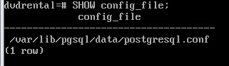
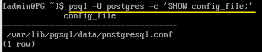
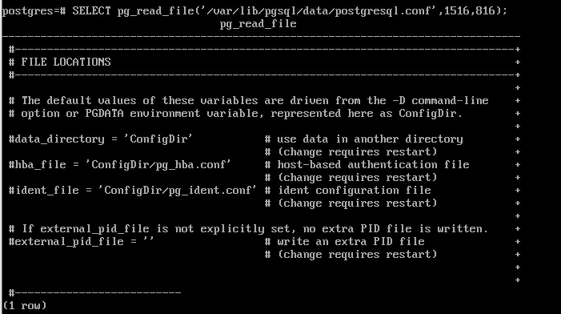
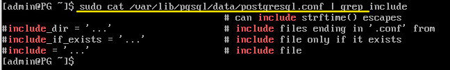
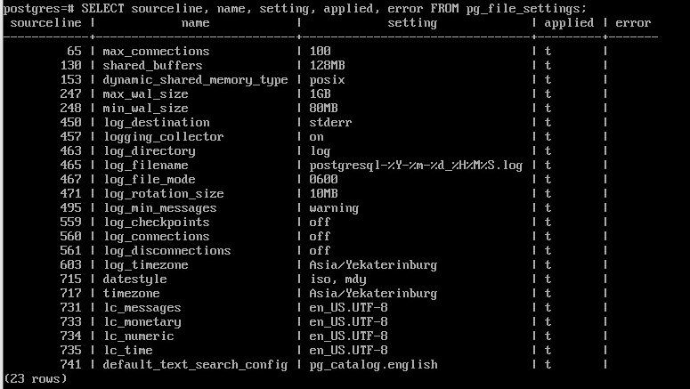
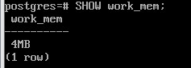
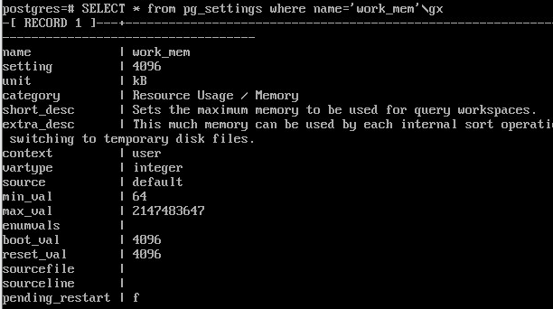
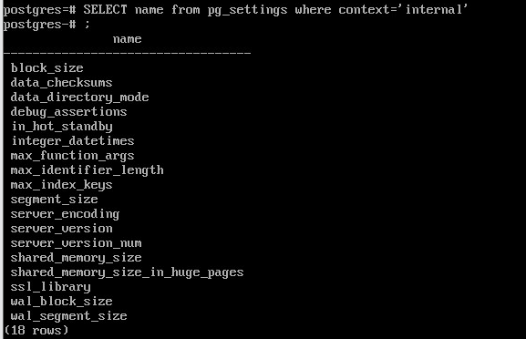
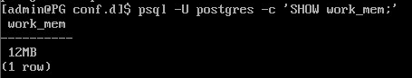
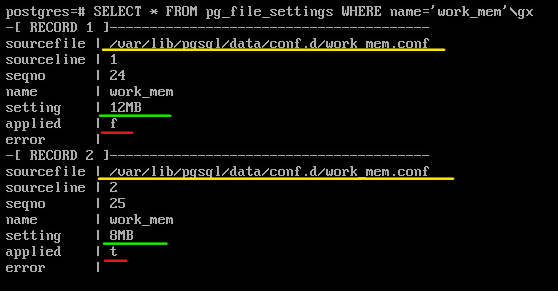

Конфигурирование сервера
#####################

PostgreSQL является сложной системой, которая должна обеспечивать работоспособность в разных условиях.

Для настройки системы используются различные параметры, которые, в свою очередь, расположены в файлах конфигурации.
Большую часть работы администраторы выполняют именно с параметрами систем.

Для Postgres параметры конфигурации могут быть настроены для:

- всего кластера;
- для отдельной базы данных;
- для отдельного пользователя;
- для отдельной команды, транзакции.

Основной файл конфигурации
***************************

**postgresql.conf**

В зависимости от операционной системы может быть расположен в разных каталогах, но обычно располагается 
в системном каталоге кластера postgres. Для ALT Linux по-умолчанию расположен в */var/lib/pgsql/data*,
в UBUNTU **/etc/postgresql/16/main**

Для просмотра местонахождения файла postgresql.conf можно воспользоваться командой **SHOW**, которая показывает значения
параметров на текущий момент.

В сеансе psql:

::

	SHOW config_file;

В командной строке 

::

	psql -U postgres -c 'SHOW config_file;'
	

При запуске исполняемого файла сервера с помощью аргумента командной строки 
**-c config_file** можно задать требуемое местонахождение файла конфигурации.

Файл является хорошо документированным. Данные хранятся в виде **ключ-значение**.

После внесения в файл изменений необходимо, чтобы сервер перечитал файл, 
а для некоторых параметров требуется перезагрузка сервера.

::

	pg_ctl -D /var/lib/pgsql/data reload
	
или в терминале psql

::

	SELECT pg_reload_conf();

::

	pg_ctl -D /var/lib/pgsql/data restart

Позже будет показано, как определить необходимость перезагрузки или перечитывания для разных параметров.

**pg_read_file()** — системная функция в PostgreSQL, которая возвращает содержимое текстового файла с локальной файловой системы.  

- Возвращает фрагмент файла с заданного смещения (offset), размером не больше length байт (размер может быть меньше, если файл кончится раньше).
- Если смещение offset отрицательно, оно отсчитывается от конца файла. 
- Если параметры offset и length опущены, возвращается всё содержимое файла. 
- Прочитанные из файла байты обрабатываются как символы в серверной кодировке; если они оказываются недопустимыми для этой кодировки, возникает ошибка.

::
	
	SELECT pg_read_file('/var/lib/pgsql/data/postgresql.conf');

Хранить все параметры в одном большом файле может быть неудобно, поэтому есть возможность 
к основному конфигурационному файлу postgresql.conf можно подключать дополнительные файлы конфигурации. 

Директивы подключения:

- include_dir — каталог с дополнительными файлами конфигурации;
- include — включает дополнительный файл конфигурации;
- include_if_exists — включает дополнительный файл конфигурации, если он существует.

::

	sudo cat /var/lib/pgsql/data/postgresql.conf | grep include

	   
В ALT по-умолчанию никакие дополнительные файлы или каталои не подключены.
	   
Найстройки, которые были считаны из файла postgresql.conf, можно увидеть с помощью представления **pg_file_settings**:

::

	SELECT sourceline, name, setting, applied, error FROM pg_file_settings;
	

	   
Представление выводит незакомментированные строки конфигурационных файлов, 
имя файла конфигурации и номер строки, что удобно для поиска ошибок.

Столбец **applied** показывает, будет ли заданное значение применено при перечитывании. 
В частности, в столбце будет **false**, если:

- изменение требует рестарта сервера;
- существует строка с тем же параметром, которая будет прочитана позже (конфигурационные читаются сверху вниз построчно, 
и если один и тот же параметр определен несколько раз, то действовать будет то значение, которое будет прочитано последним);
- в одной из строк, где задается параметр, есть ошибка (если параметр числовой, а указан будет текст, то будет зафиксирована ошибка).

Отображение параметров
======================

**work_mem** - определяет объем памяти, который выделяется при выполнении запроса. 
Если выполняется сортировка, ему нужно место для сортировки. Вот в этом случае в узлу выделяется память размером work_mem.
Обычно если узел не может вложиться в это ограничение, то он начинает работать с диском, а если сделать слишком много, 
то оперативной памяти сервера может просто не хватить.

::

	SHOW work_mem;
	

Представление **pg_settings** возвращает более подробную информацию:

::

	SELECT * FROM pg_settings WHERE name='work_mem' \gx

- name, unit — название и единица измерения параметра;
- setting — текущее значение;
- boot_val — значение по умолчанию (если не указывать вообще в конфигурационном файле);
- reset_val — начальное значение для сеансов (значение, которое устанавливается вначал сеанса и к которому оно будет сброшено, при установке начального значение параметра);
- source — источник текущего значения параметра;
- sourcefile, sourceline — файл конфигурации и номер строки, если текущее значение было задано в файле;
- pending_restart — true, если значение изменено в файле конфигурации, но для применения требуется перезапуск сервера.

**context** определяет действия, необходимые для применения параметра. Среди возможных значений:

- internal — изменить нельзя, значение задано при установке (поменять его вообще нельзя);
- postmaster — требуется перезапуск сервера;
- sighup — требуется перечитать файлы конфигурации,
- superuser — суперпользователь может изменить для своего сеанса;
- user — любой пользователь может изменить для своего сеанса.

В примере выше было показано, что только часть параметров установлена в конфигурационном файле, а все остальное - значение по-умолчанию.
В данном случае source - default, значит параметр вообще не установлен.

Столбец context - user, следовательно, любой пользователь для своего сеанса может установить свое значение.

Значение internal столбца context означает, что поменять данное значение нельзя в принципе.

Порядок применения параметров
=============================

В первую очередь читается основной файл, а потом дополнительные, которые указаны в строках include...
И применяется то значение, которое было считано последним.

Пример:
-------

Создать отдельный каталог для параметров conf.d и установить значения work_mem

1) Остановить сервер:

::

	sudo -u postgres pg_ctl -D //var/lib/pgsql/data stop

2) Создать каталог:

::

	sudo mkdir /var/lib/pgsql/data/conf.d
	
::

3) Раскомментировать строку **include_dir** в postgresql.conf

::

	include_dir='conf.d'
	
4) Добавить значение параметра **work_mem=12MB**:

::

	echo work_mem=12MB | sudo tee /var/lib/pgsql/data/conf.d/work_mem.conf
	
Имена файлов в conf.d должны иметьрасширение .conf**

5) Запустить сервер

::

	sudo -u postgres pg_ctl -D //var/lib/pgsql/data start
	
6) Прочитать значение параметра work_mem:

::

	psql -U postgres -c 'SHOW work_mem;'

7) Переустановить значение параметра **work_mem=8MB**:

::

	echo work_mem=12MB | sudo tee -a /var/lib/pgsql/data/conf.d/work_mem.conf
	
8) Прочитать значение параметра work_mem. Оно не должно измениться.

9) Перечитать конфигурационный файл:

::

	sudo -u postgres pg_ctl -D //var/lib/pgsql/data reload
	
8) Прочитать значение параметра work_mem. Оно должно стать 8MB.

9) Подключиться к серверу:

::

	psql -U postgres
	
10) Вывести сведения для параметра work_mem из pg_file_settings:

::

	SELECT * FROM pg_file_settings WHERE name='work_mem' \gx 

