Логическое резервирование
#########################

Логическая копия
****************

Логическое резервирование — набор команд SQL, восстанавливающих кластер (или базу данных, или отдельную таблицу) с нуля: 
создаются необходимые объекты и наполняются данными.

Команды можно выполнить на другой версии СУБД (при наличии совместимости на уровне команд) или на другой платформе и архитектуре (не требуется двоичная совместимость).
Можно создавать, делать копию не целиком всей базы данных, а только одного отдельного объекта. 

В частности, логическую резервную копию можно использовать для долговременного хранения: ее можно будет восстановить и после обновления сервера на новую версию (восстановиться на другой основной версии Postgres)

Однако для большой базы команды могут выполняться очень долго по сравнению, например, с операцией физического копирования файлов.

Восстановить систему из логической копии можно ровно на момент начала резервного копирования.

COPY (команда SQL)
******************

**Серверный вариант**

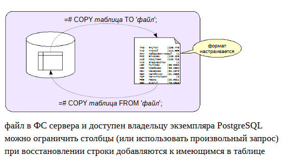

**COPY** - сохранения содержимого только одной таблицы.

Команда позволяет записать таблицу (или часть столбцов таблицы, или даже результат произвольного запроса) либо в файл, либо на консоль, либо на вход какой-либо программе. 
Эти же табличные данные из внешнего источника можно будет загрузить таблицу обратно.

При этом можно указать ряд параметров, таких как формат (текстовый, CSV или двоичный). Для текстового формата указать разделитель полей, текстовое представление NULL и т. п.
Файл будет создаваться в файловой системе сервера, где установлен Postgres, и принадлежать будет пользователю, владельцу экземпляра Postgres. 

Другой вариант команды, наоборот, считывает из файла или из консоли строки с полями и записывает их в таблицу. 
Команда **COPY** **не выгружает структуру таблицы**, она выгружает **только данные**. И при загруке данных таблица уже должна быть. 
Если в этой таблице есть какие-то строки, то команда COPY просто добавит из файла строки к уже имеющимся. 

Таблица при этом не очищается, новые строки добавляются к уже существующим.

Команда COPY работает существенно быстрее, чем аналогичные команды INSERT — клиенту не нужно много раз обращаться к серверу, а серверу не нужно много раз анализировать команды.

Тонкость: при выполнении команды COPY FROM не применяются правила (rules), хотя ограничения целостности и триггеры выполняются.

Команда psql \copy
******************

**Клиентский вариант**

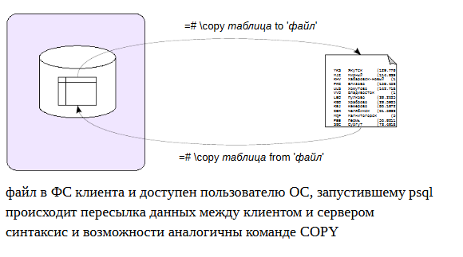

В отличие от серверного варианта COPY, который является командой SQL, клиентский вариант — это команда psql.

Указание имени файла в команде SQL соответствует файлу на сервере БД. У пользователя, под которым работает PostgreSQL (обычно postgres), должен быть доступ к этому файлу.

В клиентском же варианте обращение к файлу происходит на клиенте, а на сервер передается только содержимое. 

Синтаксис команд аналогичный.

https://postgrespro.ru/docs/postgresql/13/app-psql#APP-PSQL-META-COMMANDS-COPY

Практика
========

Создадим базу данных и таблицу.

::

	postgres=# CREATE DATABASE db1;

CREATE DATABASE

::

	postgres=# \c db1

You are now connected to database "db1" as user "admin".

::

	postgres=# CREATE TABLE t(
					id integer GENERATED ALWAYS AS IDENTITY PRIMARY KEY,
					s text
				);
CREATE TABLE

::

	postgres=# INSERT INTO t(s) VALUES ('Привет, мир!'), (''), (NULL);

INSERT 0 3

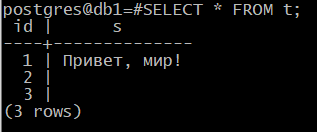

Вот что показывает команда COPY (выдаем на консоль, а не в файл):

::

	postgres=# COPY t TO stdout;

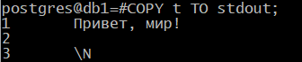
	   
Копирование в файл:

::

	COPY t TO '/var/lib/pgsql/data/db1_t.copy';
	   
Видно, как различаются в выводе пустые строки и неопределенные значения.

Формат вывода настраивается достаточно гибко. Можно изменить разделитель, представление неопределенных значений и т. п. Например:

::

	postgres=# COPY t TO stdout WITH (NULL '<NULL>', DELIMITER ',');

1,Привет\, мир!
2,
3,<NULL>

Обратите внимание, что *символ-разделитель* внутри строки был экранирован (символ для экранирования тоже настраивается).

Вместо таблицы можно указать произвольный запрос.

::

	postgres=# COPY (SELECT * FROM t WHERE s IS NOT NULL) TO stdout;

1	Привет, мир!
2	

Таким образом можно сохранить результат запроса, данные представления и т. п.

Команда поддерживает вывод в формате CSV, который поддерживается множеством программ.

::

	postgres=# COPY t TO stdout WITH (FORMAT csv);

1,"Привет, мир!"
2,""
3,

Аналогично работает и ввод данных из файла или с консоли.

::

	postgres=# TRUNCATE TABLE t;

TRUNCATE TABLE

Но при вводе с консоли требуется маркер конца файла — обратная косая черта с точкой; в обычном файле он не нужен.

Чтобы данные загрузились, при вводе надо указать те же параметры, что были указаны при выводе.

При загрузке также можно указать условие:

::

	postgres=# COPY t FROM stdin WHERE id != 2;

	1	Привет, мир!
	2	
	3	\N
	\.

COPY 2

Вот что загрузилось в таблицу (для наглядности настроим в psql вывод неопределенных значений):

::

	postgres=# \pset null '\\N'

Null display is "\N".

::
	
	postgres=# SELECT * FROM t;

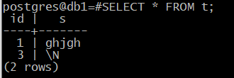

Загрузим все строки из файла:

::

	postgres=# TRUNCATE TABLE t;
	
::

	
	postgres=# COPY t FROM '/var/lib/pgsql/data/db1_t.copy';
	
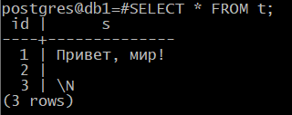
	   
Копия базы данных
*****************

Для создания полноценной резервной копии базы данных используется утилита **pg_dump**.

Если не указать имя файла (-f, --file), то утилита выведет результат на консоль. 

Результатом является скрипт, предназначенный для psql, который содержит команды для создания необходимых объектов и наполнения их данными.
Представлен он обычным файлом в plian формате.

Pgdump это отдельная утилита, поэтому она может запускаться как на сервере, так и на клиенте. 
Соответственно, в зависимости от того, где она запущена там и будет формироваться копия.

Дополнительными ключами утилиты можно ограничить набор объектов: выбрать указанные таблицы, или все объекты в указанных схемах, или наложить другие фильтры.

Чтобы восстановить объекты из резервной копии, достаточно выполнить полученный скрипт в psql.

.. important:: Базу данных для восстановления надо создавать из шаблона **template0**, так как все изменения, сделанные в template1, также попадут в резервную копию. 
               Заранее должны быть созданы необходимые **роли** и **табличные пространства**. Так как это глобальные объекты и не относятсяк конкретной БД, они не будут выгружены в резервную копию.

После восстановления базы, если сразу нужно использовать данные для работы, то имеет смысл выполнить команду **ANALYZE**: она соберет статистику, 
необходимую оптимизатору для планирования запросов.

https://postgrespro.ru/docs/postgresql/13/app-pgdump

Практика
--------

При запуске без дополнительных параметров утилита **pg_dump** выдает команды SQL, 
создающие все объекты в базе данных:

::

	[admin@PG ~]$ sudo -u postgres pg_dump -d db1

::

	--
	-- PostgreSQL database dump
	--

	-- Dumped from database version 16.9
	-- Dumped by pg_dump version 16.9

	SET statement_timeout = 0;
	SET lock_timeout = 0;
	SET idle_in_transaction_session_timeout = 0;
	SET client_encoding = 'UTF8';
	SET standard_conforming_strings = on;
	SELECT pg_catalog.set_config('search_path', '', false);
	SET check_function_bodies = false;
	SET xmloption = content;
	SET client_min_messages = warning;
	SET row_security = off;

	--
	-- Name: pgcrypto; Type: EXTENSION; Schema: -; Owner: -
	--

	CREATE EXTENSION IF NOT EXISTS pgcrypto WITH SCHEMA public;

	--
	-- Name: EXTENSION pgcrypto; Type: COMMENT; Schema: -; Owner:
	--

	COMMENT ON EXTENSION pgcrypto IS 'cryptographic functions';

	SET default_tablespace = '';

	SET default_table_access_method = heap;

	--
	-- Name: t; Type: TABLE; Schema: public; Owner: postgres
	--

	CREATE TABLE public.t (
		id integer NOT NULL,
		s text
	);

	ALTER TABLE public.t OWNER TO postgres;

	--
	-- Name: t_id_seq; Type: SEQUENCE; Schema: public; Owner: postgres
	--

	ALTER TABLE public.t ALTER COLUMN id ADD GENERATED ALWAYS AS IDENTITY (
		SEQUENCE NAME public.t_id_seq
		START WITH 1
		INCREMENT BY 1
		NO MINVALUE
		NO MAXVALUE
		CACHE 1
	);

	--
	-- Data for Name: t; Type: TABLE DATA; Schema: public; Owner: postgres
	--

	COPY public.t (id, s) FROM stdin;
	1       Привет, мир!
	2
	3       \N

	--
	-- Name: t_id_seq; Type: SEQUENCE SET; Schema: public; Owner: postgres
	--

	SELECT pg_catalog.setval('public.t_id_seq', 3, true);

	--
	-- Name: t t_pkey; Type: CONSTRAINT; Schema: public; Owner: postgres
	--

	ALTER TABLE ONLY public.t
		ADD CONSTRAINT t_pkey PRIMARY KEY (id);

	--
	-- PostgreSQL database dump complete
	--

**Полезные ключи**

Могут пригодиться при восстановлении копии на системе с другим набором ролей:

**-O, --no-owner** — не генерировать команды для установки владельца объектов;

**-x, --no-acl** — не генерировать команды для установки привилегий;

**--no-comments** — не генерировать комментарии.

Полезны для выгрузки и загрузки данных частями:

**-s, --schema-only** — выгрузить только определения объектов без данных. Команды create будут все выгружены, а вот сами табличные данные выгружаться не будут.
Используется когда нужна только структура базы данных.

**-a, --data-only** — выгрузить только данные, без создания объектов. Используется, когда объекты уже есть.

Удобны, если восстанавливать копию на системе, в которой уже есть данные (и наоборот, на чистой системе):

**-c, --clean** — генерировать команды DROP для создаваемых объектов. Перед командой CREATE, например, TABLE будет генерироваться команда на удаление этой же самой таблицы. 
Соответственно, будет генерироваться  DROP TABLE , и так для каждого типа объекта. Тогда при восстановлении, если объект уже существует, 
он будет удален, и после этого будет создан объект из копии.

**-C, --create** — генерировать команды создания БД и подключения к ней. В самое начало резервной копии нужно включить **CREATE DATABASE** для 
создания самой базы данных, а потом к ней подключиться и только после этого начать восстанавливать объекты. 
При этом команда **CREATE DATABASE** будет создавать базу данных из шаблона **template 0**. 

::

	sudo -u postgres pg_dump --create -d db1 | grep 'CREATE DATABASE'
	
	
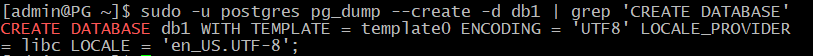

Существуют ключи для выбора объектов, которые должны попасть в резервную копию:

**-n, --schema** — шаблон для имен схем. Выгрузить данные находящиеся только в определенной схеме или в схемах, соответствующих указанному шаблону. 

**-t, --table** — шаблон для имен таблиц.

И наоборот, включить в копию все, кроме указанного:

**-N, --exclude-schema** — шаблон для имен схем;

**-T, --exclude-table** — шаблон для имен таблиц.

Например, восстановим таблицу t в другой базе данных на другом сервере.

::

	admindb$ psql -U postgres -p 5433
	
	B@postgres# CREATE DATABASE db2;
	
	CREATE DATABASE
	
	admin$ sudo -u postgres pg_dump --table=t -d db1 | sudo -u postgres psql -p 5433 -d db2
	
	SET
	SET
	SET
	SET
	SET
	 set_config 
	------------
	 
	(1 row)

	SET
	SET
	SET
	SET
	SET
	SET
	CREATE TABLE
	ALTER TABLE
	ALTER TABLE
	COPY 3
	 setval 
	--------
		  3
	(1 row)

	ALTER TABLE
	
	B@postgres# \c db2
	
	You are now connected to database "db2" as user "admin".
	
	B@db2=# SELECT * FROM t;
	
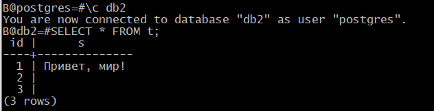
	   
Формат custom
*************

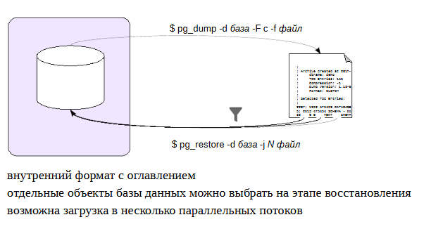

Утилита pg_dump позволяет указать формат резервной копии. По умолчанию это plain — простые команды для psql.

Формат **custom** (-F c, --format=custom) создает резервную копиюв специальном формате, содержащем не только объекты, 
но и оглавление. Наличие оглавления позволяет выбирать объекты для восстановления не при создании копии, а непосредственно при восстановлении. 
Файл формата **custom** по умолчанию **сжат**.

Для восстановления потребуется другая утилита — **pg_restore**. Она читает файл и преобразует его в команды psql. 
Если не указать явно имя базы данных (в ключе -d), то команды будут выведены на консоль. Если же база данных указана — утилита соединится с этой БД 
и выполнит команды без участия psql.

Указывается имя файла с резервной копией, а также, можно указать ключ **-g**, в котором задается количество рабочих процессов, 
которые будут восстанавливать данные из резервной копии.

Чтобы восстановить только часть объектов, можно воспользоваться одним из двух подходов. 

1) можно ограничить объекты аналогично тому, как они ограничиваются в pg_dump. Утилита **pg_restore** понимает многие параметры, используемые в **pg_dump**.

2) можно получить из оглавления список объектов, содержащихся в резервной копии (ключ *--list*). Затем этот список можно отредактировать вручную, 
удалив ненужное и передать измененный список на вход pg_restore (ключ *--use-list*).

Если используется несколько запущенных процессов, они на основании этого оглавления распределяют таблицы, которые необходимо загрузить между собой 
и их параллельно выполняют загрузку, что делает процесс намного быстрее, чем если бы мы это выполнялось в один поток.

Наличие резервной копии с оглавлением говорит о том, что на этапе восстановления можно указать, какие объекты необходимо восстановить. 
То есть не обязательно восстанавливать всю копию целиком, можно прямо в команде **pg_restore** указать конкретные объекты, которые из 
этой резервной копии требуется восстановить. 

https://postgrespro.ru/docs/postgresql/13/app-pgrestore

Практика:

Серьезное ограничение обычного формата (plain) состоит в том, что выбирать объекты нужно в момент выгрузки. 
Формат custom позволяет сначала сделать полную копию, а выбирать объекты уже при загрузке.

Создать роль admin с правами суперпользователя в обоих кластерах.

::

	CREATE ROLE admin SUPERUSER
	ALTER ROLE admin LOGIN PASSWORD 'P@ssw0rd'

::

	admin$ pg_dump --format=custom -d db1 -f /home/admin/db1.custom
	
Для восстановления объектов из такой копии предназначена утилита pg_restore. Повторим восстановление таблицы t:

::

	| B@db2=#DROP table t;

	DROP TABLE

::

	admin$ pg_restore --table=t -p 5433 -d db2 /home/admin/db1.custom

Формат резервной копии указывать не обязательно — утилита распознает его сама.

Утилита pg_restore понимает те же ключи для фильтрации объектов, что и pg_dump, и даже больше:

-I, --index — загрузить определенные индексы;

-P, --function — загрузить определенные функции;

-T, --trigger — загрузить определенные триггеры.

Проверим, как восстановилась таблица:

::

	| B@db2=#SELECT * FROM t;

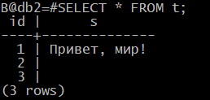

Еще один пример: восстановим целиком исходную базу данных db1 на другом сервере.

::

	admin$ pg_restore -p 5433 --create -d postgres /home/admin/db1.custom

Здесь указана БД *postgres*, но при восставновлении из копии утилита сама создаст нужную БД и тут же 
переключится в нее.

Проверим:

::

	\l
	
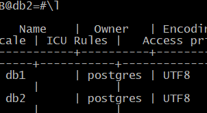
	   
	   
::

	| B@postgres=\c db1

	You are now connected to database "db1" as user "admin".

::

	| B@db1=#SELECT * FROM t;

	 id |      s       
	----+--------------
	  1 | Привет, мир!
	  2 | 
	  3 | 
	(3 rows)

Резервную копию в обычном (plain) формате при необходимости можно изменить в текстовом редакторе. 
Резервная копия формата custom хранится в двоичном виде, но и для нее доступны более широкие 
возможности фильтрации объектов, чем рассмотренные ключи. 
Утилита **pg_restore** может сформировать список объектов — оглавление резервной копии:

::

	[admin@PG ~]$ pg_restore --list /home/admin/db1.custom

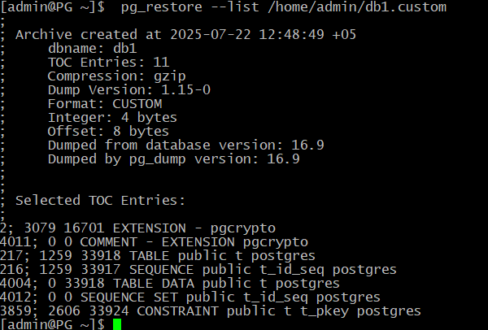

	;
	; Archive created at 2024-01-16 12:14:23 MSK
	;     dbname: db1
	;     TOC Entries: 9
	;     Compression: -1
	;     Dump Version: 1.14-0
	;     Format: CUSTOM
	;     Integer: 4 bytes
	;     Offset: 8 bytes
	;     Dumped from database version: 13.7 (Ubuntu 13.7-1.pgdg22.04+1)
	;     Dumped by pg_dump version: 13.7 (Ubuntu 13.7-1.pgdg22.04+1)
	;
	;
	; Selected TOC Entries:
	;
	201; 1259 24579 TABLE public t admin
	200; 1259 24577 SEQUENCE public t_id_seq admin
	3027; 0 24579 TABLE DATA public t admin
	3034; 0 0 SEQUENCE SET public t_id_seq admin
	2895; 2606 24586 CONSTRAINT public t t_pkey admin

Такой список можно записать в файл, отредактировать и использовать его для восстановления с помощью ключа 
--use-list.

Формат directory
****************

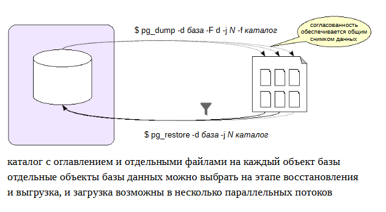
	   
Еще один формат резервной копии — **directory**. В таком случае будет создан не один файл, а каталог, содержащий объекты и оглавление.

По умолчанию файлы внутри каталога будут сжаты.

Преимущество перед форматом **custom** состоит в том, что такая резервная копия может создаваться параллельно в несколько потоков (количество указывается в ключе -j, --jobs).
То есть многопоточность используется не только при восстановлении, но и при копировании. Каждый рабочий процесс будет работать с одной таблицей базы данных, 
и для каждой такой таблицы в каталоге будет создаваться отдельный файл. То есть минимальной единицей деления объектов между несколькими рабочими процессами 
является таблица. Если есть одна очень большая таблица, она все равно будет выгружаться только одним процессом.

Разумеется, несмотря на параллельное выполнение, копия будет содержать согласованные данные. 
Это обеспечивается общим снимком данных для всех параллельно работающих процессов. Сначала запускается один ведущий процесс, он начинает транзакцию 
с уровнем изоляции **repeatable read**, делает снимок и эспортирует его. Дальше запускаются рабочие процессы, импортируют этот снимок и работают с согласованными данными.

https://postgrespro.ru/docs/postgresql/13/functions-admin.html#FUNCTIONS-SNAPSHOT-SYNCHRONIZATION

Восстановление также возможно в несколько потоков (это работает и для формата custom).

В остальном возможности по работе с форматом directory не отличается от ранее рассмотренных: поддерживаются те же ключи и подходы.

Практика:

Формат **directory** интересен тем, что позволяет **выгружать** данные в несколько параллельных потоков.

::

	admin$ pg_dump --format=directory --jobs=2 -d db1 -f /home/admin/db1.directory

При этом гарантируется согласованность данных: все параллельные потоки будут использовать один и тот же снимок данных.

Заглянем внутрь каталога:

::

	admin$ ls -l /home/admin/db1.directory
	
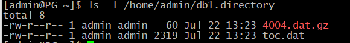

В нем находится файл оглавления и по одному файлу на каждый выгружаемый объект (у нас он всего один):

::

	admin$ zcat /home/admin/db1.directory/4004.dat.gz
	
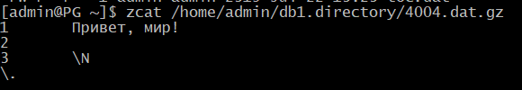
	   
Для восстановления из резервной копии предварительно отключимся от базы данных db1:

::

	B@db1=#\q

В команду восстановления добавляем ключ --clean, который генерирует команду удаления существующей БД:

::

	admin$ pg_restore --clean --create --jobs=2 -p 5433 -d postgres /home/admin/db1.directory

Нужно заново создать базу данных, восстанавливаться мы в два потока, восстанавливаться на B. Здесь указывается подключение к базе данных postgres. 
Нужно подключиться к любой базе данных, а поскольку есть здесь опция **create**, то будет сгенерирована команда **create database db1**, 
дальше подключение к базе данных db1, и потом уже восстановление именно в нее.

Сравнение форматов
******************

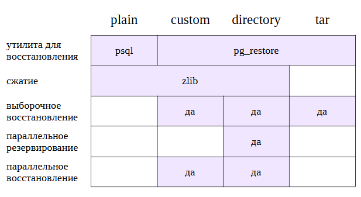
	   

В приведенной таблице разные форматы сравниваются с точки зрения предоставляемых ими возможностей.

С точки зрения восстановления данных для формата *plane* используется *psql*, а для всех остальных форматов восстановление делается из утилиты pgrestore.

Сжатие данных возможно, для чего используется встроенная для утилиты zlib для форматов plane, custom и directory. 

Выборочное восстановление отдельных объектов возможно для форматов custom и directory. Для формата plain выборочное восстановление возможно в ручном режиме.

Параллельное резервирование, то есть создание копий в несколько потоков возможно только для формата directory, а параллельное восстановление для custom и directory.

Отметим, что имеется и четвертый формат — **tar**. Он не дает преимуществ перед другими форматами. 
Фактически он соответствует созданию *tar*-файла из каталога в формате **directory**, но не поддерживает сжатие и параллелизм.

Копия кластера БД
*****************

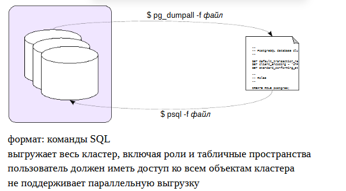

Чтобы создать резервную копию всего кластера, включая роли и табличные пространства, можно воспользоваться утилитой **pg_dumpall**.

Поскольку pg_dumpall требуется доступ ко всем объектам всех БД, имеет смысл запускать ее от имени суперпользователя, чтобы гарантированно иметь доступ ко всем объектам. 
Утилита по очереди подключается к каждой БД кластера и выгружает информацию с помощью **pg_dump**. Кроме того, она сохраняет и данные, относящиеся к кластеру в целом.

Чтобы начать работу, утилите требуется подключиться хотя бы к какой-то базе данных. По умолчанию выбирается *postgres* или *template1*, 
но можно указать и другую.

Результатом работы **pg_dumpall** является **скрипт для psql** (plain формат). Другие форматы не поддерживаются. 
Это означает, что **pg_dumpall** не поддерживает параллельную выгрузку данных, что может оказаться проблемой при больших объемах данных. 
В таком случае можно воспользоваться ключом **--globals-only**, чтобы выгрузить только роли и табличные пространства, а сами базы данных выгрузить отдельнос помощью 
**pg_dump** в параллельном режиме.

Для восстановления всегда используется **psql**. Именно он предназначен для восстановления из текстового файла с командами sql. 

https://postgrespro.ru/docs/postgresql/13/app-pg-dumpall	

Практика:

Утилита **pg_dump** годится для выгрузки одной базы данных, но никогда не выгружает общие объекты кластера БД, такие, как роли и табличные пространства. 
Чтобы сделать полную копию кластера, нужна утилита **pg_dumpall**.

Утилиты **pg_dumpall, pg_dump и pg_restore** не требуют каких-то отдельных привилегий, но у выполняющей их роли должны быть привилегии на чтение (создание) 
всех затронутых объектов. Утилитой **pg_dump** может, например, пользоваться владелец базы данных. 
Но поскольку для копирования кластера надо иметь доступ ко всем БД, мы выполняем **pg_dumpall** под **суперпользовательской** ролью.

::

	admin$ pg_dumpall --clean -U postgres -f /home/admin/alpha.sql

В копию кластера попадают:

- команды, которые выгружает **pg_dump** для каждой базы;

- команды для общих объектов кластера (ролей и табличных пространств).

Команды для общих объектов можно получить отдельно:

::

	admin$ pg_dumpall --clean --globals-only -U postgres
	
	--
	-- PostgreSQL database cluster dump
	--

	SET default_transaction_read_only = off;

	SET client_encoding = 'UTF8';
	SET standard_conforming_strings = on;

	--
	-- Drop roles
	--

	DROP ROLE admin;
	DROP ROLE alice;
	DROP ROLE bob;
	DROP ROLE postgres;

	--
	-- Roles
	--

	CREATE ROLE admin;
	ALTER ROLE admin WITH SUPERUSER INHERIT NOCREATEROLE NOCREATEDB LOGIN NOREPLICATION NOBYPASSRLS PASSWORD 'SCRAM-SHA-256$4096:YTiSIdRbkCNEcWXImjYkQw==$B1QHEvLPozBJGVzsMdOMNrgAdYfhL9FAslCaD+AShxQ=:PTb6bsHiKhv98MFLfeAA5zgzQh1TxQTk/mUs3xy3z9I=';
	CREATE ROLE alice;
	ALTER ROLE alice WITH NOSUPERUSER INHERIT NOCREATEROLE NOCREATEDB LOGIN NOREPLICATION NOBYPASSRLS PASSWORD 'SCRAM-SHA-256$4096:gKntYtR5JSkbOUBVfJFIgg==$04W0lOoP6qGzf5LYApcON9+Wt/5rJMXK/S+N/24cTPM=:+BD1C+a3axSKWDhmc3QETLK3+yJFOywhBu+pr8bAnSQ=';
	CREATE ROLE bob;
	ALTER ROLE bob WITH NOSUPERUSER INHERIT NOCREATEROLE NOCREATEDB LOGIN NOREPLICATION NOBYPASSRLS PASSWORD 'SCRAM-SHA-256$4096:Ior3+hYgPAKsZITiLH3/+Q==$6LV2Gz7sT8TI5DT8+C6trUpCLOB55SqtmQb1llMfQH0=:azXITE9owaRQ88qe6pXWQTw5t0wZ6c7HOMXN3UzpsLo=';
	CREATE ROLE postgres;
	ALTER ROLE postgres WITH SUPERUSER INHERIT CREATEROLE CREATEDB LOGIN REPLICATION BYPASSRLS;

	--
	-- User Configurations
	--

	--
	-- User Config "bob"
	--

	ALTER ROLE bob SET search_path TO 'public', 'alice';

	--
	-- PostgreSQL database cluster dump complete
	--

Восстановление выполняется с помощью psql — никакой другой формат не поддерживается.

::

	admin$ psql -p 5433 -U postgres -f /home/admin/alpha.sql
	
	SET
	SET
	SET
	psql:/home/admin/alpha.sql:14: ERROR:  database "access_overview" does not exist
	psql:/home/admin/alpha.sql:15: ERROR:  database "appdb" does not exist
	psql:/home/admin/alpha.sql:16: ERROR:  database "bank_rc" does not exist
	psql:/home/admin/alpha.sql:17: ERROR:  database "checkpt" does not exist
	psql:/home/admin/alpha.sql:18: ERROR:  database "chekpt" does not exist
	psql:/home/admin/alpha.sql:19: ERROR:  database "configdb" does not exist
	psql:/home/admin/alpha.sql:20: ERROR:  database "data_catalog" does not exist
	psql:/home/admin/alpha.sql:21: ERROR:  database "db1" is being accessed by other users
	DETAIL:  There is 1 other session using the database.
	DROP DATABASE
	psql:/home/admin/alpha.sql:23: ERROR:  database "dvdrental" does not exist
	psql:/home/admin/alpha.sql:24: ERROR:  database "locks_objects" does not exist
	psql:/home/admin/alpha.sql:25: ERROR:  database "mv1" does not exist
	psql:/home/admin/alpha.sql:26: ERROR:  database "mvcc" does not exist
	psql:/home/admin/alpha.sql:27: ERROR:  database "mvcc_hot" does not exist
	psql:/home/admin/alpha.sql:28: ERROR:  database "mvcc_vac" does not exist
	psql:/home/admin/alpha.sql:29: ERROR:  database "new_database" does not exist
	psql:/home/admin/alpha.sql:30: ERROR:  database "wal_checkpoint" does not exist
	psql:/home/admin/alpha.sql:31: ERROR:  database "wal_log" does not exist
	psql:/home/admin/alpha.sql:40: ERROR:  role "admin" cannot be dropped because some objects depend on it
	DETAIL:  37 objects in database db1
	psql:/home/admin/alpha.sql:41: ERROR:  role "alice" does not exist
	psql:/home/admin/alpha.sql:42: ERROR:  role "bob" does not exist
	psql:/home/admin/alpha.sql:43: ERROR:  current user cannot be dropped
	psql:/home/admin/alpha.sql:50: ERROR:  role "admin" already exists
	ALTER ROLE
	CREATE ROLE
	ALTER ROLE
	CREATE ROLE

	SET
	SET
	SET
	SET
	SET
	 set_config 
	------------
	 
	(1 row)

	SET
	SET
	SET
	SET
	UPDATE 1
	DROP DATABASE
	CREATE DATABASE
	ALTER DATABASE
	You are now connected to database "template1" as user "postgres".
	SET
	SET
	SET
	SET
	SET
	 set_config 
	------------
	 
	(1 row)

	SET
	SET
	SET
	SET
	COMMENT
	ALTER DATABASE
	You are now connected to database "template1" as user "postgres".
	SET
	SET
	SET
	SET
	SET
	 set_config 
	------------
	 
	(1 row)

	SET
	SET
	SET
	SET
	REVOKE
	GRANT
	SET
	SET
	SET
	SET
	SET
	 set_config 
	------------
	 
	(1 row)

	SET
	SET
	SET
	SET
	CREATE DATABASE
	ALTER DATABASE
	You are now connected to database "db1" as user "postgres".
	SET
	SET
	SET
	SET
	SET
	 set_config 
	------------
	 
	(1 row)

	SET
	SET
	SET
	SET
	SET
	SET
	CREATE TABLE
	ALTER TABLE
	ALTER TABLE
	COPY 3
	 setval 
	--------
		  3
	(1 row)

	ALTER TABLE
	SET
	SET
	SET
	SET
	SET
	 set_config 
	------------
	 
	(1 row)

	SET
	SET
	SET
	SET
	DROP DATABASE
	CREATE DATABASE
	ALTER DATABASE
	You are now connected to database "postgres" as user "postgres".
	SET
	SET
	SET
	SET
	SET
	 set_config 
	------------
	 
	(1 row)

	SET
	SET
	SET
	SET
	COMMENT
	SET
	SET
	SET
	SET
	SET
	 set_config 
	------------
	 
	(1 row)

	SET
	SET
	SET
	SET
	CREATE DATABASE
	ALTER DATABASE
	You are now connected to database "student" as user "postgres".
	SET
	SET
	SET
	SET
	SET
	 set_config 
	------------
	 
	(1 row)

	SET
	SET
	SET
	SET

В процессе восстановления могут возникать ошибки из-за невозможности удалить некоторые объекты или создать уже существующие, в данном случае это нормально и не мешает процессу.

::

	admin$ psql -p 5433

	B@db1=#SELECT datname FROM pg_database;
	

::

	B@db1=# \c db1
	
	You are now connected to database "db1" as user "admin".

::

	B@db1=#  SELECT * FROM t;
 
	 id |      s       
	----+--------------
	  1 | Привет, мир!
	  2 | 
	  3 | 
	(3 rows)

Влияние политик защиты строк
****************************

Если на таблицах определены политики защиты строк, то есть опасность выгрузить неполные данные и даже не узнать об этом. 
Чтобы этого не произошло, перед выполнением команды **COPY** можно установить параметр **row_security** в значение **off** — в этом случае применение политики приведет к 
явной ошибке.

Простой пример. Настроим политику так, чтобы не выводились пустые строки, и включим ее для владельца таблицы:

::

	A@postgres=# CREATE POLICY t_s_not_null ON t USING (s IS NOT NULL);
    CREATE POLICY
::

	A@postgres=# ALTER TABLE t ENABLE ROW LEVEL SECURITY;
	ALTER TABLE

::

	A@postgres=# ALTER TABLE t FORCE ROW LEVEL SECURITY;
	ALTER TABLE
Теперь запрос покажет только две строки:

::

	A@postgres=#  COPY t TO stdout;
	1	Привет, мир!
	2	

Но с параметром, установленным в off, будет зафиксирована ошибка:

::

	A@postgres=#  SET row_security = off;
	SET

::
	A@postgres=# COPY t TO stdout;
	
	ERROR:  query would be affected by row-level security policy for table "t"
	HINT:  To disable the policy for the table's owner, use ALTER TABLE NO FORCE ROW LEVEL SECURITY.

Утилиты pg_dump и pg_dumpall автоматически используют этот параметр, так что дополнительные действия предпринимать не нужно:

admin$ pg_dump -d db1 > /dev/null

pg_dump: error: query failed: ERROR:  query would be affected by row-level security policy for table "t"
HINT:  To disable the policy for the table's owner, use ALTER TABLE NO FORCE ROW LEVEL SECURITY.
pg_dump: error: query was: COPY public.t (id, s) TO stdout;

Чтобы обойти политики защиты строк и выгрузить все данные, пользователь должен иметь атрибут роли BYPASSRLS:

::

	A@postgres=#  \c - postgres
	You are now connected to database "db1" as user "postgres".

::

	ALTER USER admin BYPASSRLS;
	ALTER ROLE

Теперь запросы от роли admin будут игнорировать политики защиты строк:

::

	admin$ pg_dump -d db1 -t t --data-only
	
	--
	-- PostgreSQL database dump
	--

	-- Dumped from database version 13.7 (Ubuntu 13.7-1.pgdg22.04+1)
	-- Dumped by pg_dump version 13.7 (Ubuntu 13.7-1.pgdg22.04+1)

	SET statement_timeout = 0;
	SET lock_timeout = 0;
	SET idle_in_transaction_session_timeout = 0;
	SET client_encoding = 'UTF8';
	SET standard_conforming_strings = on;
	SELECT pg_catalog.set_config('search_path', '', false);
	SET check_function_bodies = false;
	SET xmloption = content;
	SET client_min_messages = warning;
	SET row_security = off;

	--
	-- Data for Name: t; Type: TABLE DATA; Schema: public; Owner: admin
	--

	COPY public.t (id, s) FROM stdin;
	1	Привет, мир!
	2	
	3	\N
	\.

	--
	-- Name: t_id_seq; Type: SEQUENCE SET; Schema: public; Owner: admin
	--

	SELECT pg_catalog.setval('public.t_id_seq', 3, true);

	--
	-- PostgreSQL database dump complete
	--

Практика
********

1. На первом сервере создайте несколько баз данных.В них создайте различные объекты (например, таблицы, представления, индексы).

2. Сделайте копию только глобальных объектов кластерас помощью утилиты pg_dumpall.

3. Сделайте копии каждой базы данных кластера с помощью утилиты pg_dump в параллельном режиме.

4. Полностью восстановите кластер на другом сервере, используя созданные резервные копии.

5. Попробуйте подобрать такие данные и параметры команды COPY, чтобы созданную копию таблицы невозможно было загрузить