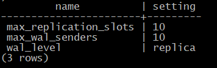

Базовая резервная копия
#######################

Физическая копия
****************

Физическое резервирование подразумевает копирование всех файлов, относящихся к кластеру БД, то есть создание полной двоичной копии.

Копирование файлов работает быстрее, чем выгрузка SQL-команд при логическом резервировании; запустить сервер из созданной физической копии — дело нескольких минут, 
в отличие от восстановления из логической копии. При этом статистика также восстанавливается из копии, нет необходимости ее собирать заново.

К недостаткам можно отнести тот факт, что из физической резервной копии можно восстановить систему только на совместимой платформе 
(та же ОС, та же разрядность, тот же порядок байтов в представлении чисел и т. п.) и только на той же основной версии PostgreSQL.
Восстанавливаться между разными операционными системами или между 15-м и 16 Postgres не получится. 

Кроме того, невозможно сделать физическую копию отдельных баз данных кластера, возможно копирование только всего кластера целиком.

Холодное резервирование
***********************

.. figure:: img/baserezcopy_01.png
       :scale: 100 %
       :align: center
       :alt: asda

Смысл холодного резервирования состоит в том, чтобы сделать копию файловой системы в тот момент, когда она содержит согласованные данные. 
Восстановление из такой копии происходит просто: файлы разворачиваются, запускается сервер — и он сразу же готов к работе.

Единственный вариант сделать такую копию — остановить сервер с выполнением контрольной точки. 
Необходима *остановка* сервера (которая к тому же может оказаться длительной при большом объеме данных), что является очевидным недостатком этого способа.

Время простоя можно сократить за счет предварительного выполнения *rsync* (или аналогичного инструмента) при работающем сервере. 
Тогда после останова сервера *rsync* докопирует только изменения (которых, предположительно, будет не много). 
Но простоя все равно не избежать.

Другой вариант — сделать копию несогласованных данных. 
Такая ситуация может возникнуть при неаккуратном отключении сервера или при создании снимка файловой системы 
(если ФС имеет такую возможность, и если все необходимые файлы попадают в один снимок). При этом потребуются файлы журнала pg_wal.

В этом случае восстановление происходит аналогично, но при старте серверу потребуется выполнить восстановление согласованности. 
Это обычная автоматическая процедура восстановления после сбоя. Она не представляет проблемы, так как необходимые файлы журнала гарантированно попадут в копию, 
но она потребует некоторого времени.

https://postgrespro.ru/docs/postgresql/13/backup-file

Практика

Холодная файловая копия

Файлы остановленного кластера можно скопировать и запустить с ними второй сервер. При этом не важно, был ли сервер остановлен корректно.

Создадим базу данных и таблицу.

::

	admin$ sudo -u postgres pg_ctl -D /var/lib/pgsql/data  start

	admin$ psql -U postgres 

::
	
	postgres=# CREATE DATABASE backup_base;

::

	postgres=# \c backup_base

	postgres=#  CREATE TABLE t(s text);

	postgres=#  INSERT INTO t VALUES ('Привет, мир!');

Аварийно останавливаем сервер и копируем файлы на сервер beta:

::

	admin$  sudo -u postgres head -1  /var/lib/pgsql/data/postmaster.pid
	
	41066

::

	admin$ sudo -u postgres kill -9 41066

::

	admin$ sudo -u postgres pg_ctl -D /var/lib/pgsql/data1 status

	pg_ctl: no server running
	
::

	admin$ sudo -u postgres rm -rf /var/lib/pgsql/data1

::

	admin$ sudo -u postgres cp -rp /var/lib/pgsql/data /var/lib/pgsql/data1

Сам резервный сервер уже предварительно собран и установлен.

Сервер **B** восстанавливает согласованность и запускается:

::

	admindb$ sudo -u postgres pg_ctl -D /var/lib/pgsql/data1  start

::

	admindb$  sudo -u postgres tail -n 5 /var/lib/pgsql/data1/log/postgresql-2025-07-24_084400.log

.. figure:: img/baserezcopy_02.png
       :scale: 100 %
       :align: center
       :alt: asda

::

	psql -U postgres
	
.. figure:: img/baserezcopy_03.png
       :scale: 100 %
       :align: center
       :alt: asda

::

	admindb$ sudo -u postgres pg_ctl -D /var/lib/pgsql/data1  stop

Горячее резервирование
**********************

Горячее резервирование выполняется на работающем сервере, поэтому в копию попадут несогласованные данные.

Также при резервном копировании данные читаются не через буферный кеш, а напрямую из файлов. 
Содержимое файлов на диске, очевидно, изменяется во время копирования, а файловая система обычно не гарантирует атомарность чтения/записи 
8-килобайтной страницы PostgreSQL. Postgres оперирует страницами размером 8 килобайт, а операционная система, как правило, оперирует блоками меньшего размера. 
Пока файл читается, в него одновременно другие процессы пишут. 
Поэтому в резервную копию будут попадать «безнадежные» страницы, к которым даже нельзя применить журнальные записи. 
Для борьбы с этой проблемой используется параметр **full_page_writes**, который говорит о том, что при после 
каждой контрольной точки, когда в первый раз записываются изменения в странице, то записывается не только это изменение, а вся страница целиком.
И только если дальше к этой странице будут применяться какие-то изменения, то будут уже записываться уже эти отдельные изменения.

Для восстановления из такой горячей резервные копии потребуются все журнальные записи от начала последней контрольной точки, 
которая была выполнена перед началом копирования данных, а также все журнальные записи от начала и до самого конца копирования файлов данных. 

Другая сложность состоит в том, что копирование файлов данных может занимать достаточно много времени. 
Но сервер, после выполнения очередной контрольной точки, может удалить часть файлов журнала, которые уже не нужны ему для восстановления после сбоя, 
но нужны для резервной копии.

Если не принять специальных мер, сделанная резервная копия будет непригодна для восстановления. 
Поэтому для горячего резервирования требуются специальные инструменты. PostgreSQL предоставляет низкоуровневый интерфейс, 
используя который можно реализовать надежное копирование. Этот интерфейс  использует и штатная утилита **pg_basebackup**, 
и другие сторонние средства резервного копирования.

https://postgrespro.ru/docs/postgresql/13/continuous-archiving.html#BACKUP-BASE-BACKUP

Протокол репликации
*******************

	   
Для упрощения задачи, сервер PostgreSQL предоставляет протокол репликации — специальный протокол для управления как собственно репликацией, 
так и резервным копированием. В частности, он позволяет получать поток журнальных записей, которые генерирует сервер.

.. note:: Протокол репликации в информационных системах — это механизм, который обеспечивает синхронизацию копий данных (реплик) на нескольких узлах системы. 
          Цель репликации — обеспечить доступность данных, повысить отказоустойчивость и улучшить производительность системы. 
		  Например, в контексте баз данных репликация позволяет создавать и хранить дубликаты базы данных на нескольких серверах или узлах, что помогает справляться с ситуациями отказа в работе одного из серверов

На сервере подключение по протоколу репликации обслуживается процессом **wal sender**. 
Он похож на обычный обслуживающий процесс, который запускается при обычном подключении клиента, но понимает не SQL, а специальные команды. 
Число одновременно работающих процессов **wal_sender** ограничено значением параметра **max_wal_senders**.

Уровень журнала должен быть не ниже, чем **replica**. Дело в том, что на уровне **minimal** такие команды, как *CREATE TABLE AS SELECT, CREATE INDEX, COPY FROM*, 
не попадают в журнал: их долговечность обеспечивается тем, что данные не остаются в оперативной памяти,а сразу записываются на диск. 
Этого достаточно для восстановления после сбоя и из холодной копии, но недостаточно для восстановления из горячей копии.

Чтобы использовать протокол репликации, клиент должен подключаться к серверу под ролью, имеющей атрибут **REPLICATION** (либо под **суперпользователем**). 
В **pg_hba.conf** надо разрешить подключение этой роли к базе данных **replication** (это, конечно, не название БД, а ключевое слово). 
Причем разрешения для **all** недостаточно, **replication** должен быть разрешен отдельно.

https://postgrespro.ru/docs/postgresql/13/protocol-replication

Слот репликации
***************

	   
.. note:: Слот репликации в PostgreSQL — это механизм, который отслеживает состояние репликации и гарантирует, 
          что основная база данных сохраняет все необходимые файлы для репликации до тех пор, пока их не используют реплики.
		  
Чтобы сервер не удалил необходимые файлы WAL преждевременно, можно применять слот репликации. Если поток журнальных записей идет через слот, то слот помнит, 
какие записи уже были переданы клиенту. Наличие слота не позволит серверу удалять файл WAL до тех пор, пока клиент не получит все записи из этого файла.

Без использования слотов Postgres может удалять файлы WAL  после прохождения очередной контрольной точки. 
Если контрольнаяа точка выполнена, значит все предыдущие файлы VAL для восстановления после сбоя не нужны, поэтому их можно уже удалять.

Использование слота позволяет клиенту не беспокоиться о том, что сервер удалит файл журнала раньше времени. Клиент может отключиться и затем через 
какое-то время подключиться вновь и продолжить получать журнальные записи с того момента, на котором остановился.

Но отключении клиента файлы журнала **будут накапливаться на сервере** и могут занять все свободное место. 
Поэтому каждый созданный слот следует добавлять в мониторинг (представление **pg_replication_slots**) и своевременно удалять ненужные слоты.

Общее количество слотов, которые могут быть созданы, ограничено конфигурационным параметром **max_replication_slots**.

https://postgrespro.ru/docs/postgresql/13/warm-standby.html#STREAMING-REPLICATION-SLOTS

Утилита pg_basebackup
*********************

	   
Для создания физической резервной копии  в составе сервера идет утилита, которая называется **pg_basebackup**. 

По умолчанию считается, что утилита **pg_basebackup** запускается на другом сервере. 
В результате работы должна появиться во-первых копия файлов данных, и во-вторых набор сегментов WAL необходимых для восстановления из этой копии 
После можно запускать сервер и начинать работать.

Для выполнения копирования утилита **pg_basebackup** использует **два** подключения по протоколу репликации: 

- первое для передачи данных 
- второе — для передачи потока журнальных записей, которые генерирует работающий сервер во время копирования. 

Поэтому для **pg_basebackup** значение параметра **max_wal_senders** должно быть не менее двух.

Для передачи журнальных записей **pg_basebackup**, начиная с 10-й версии, PostgreSQL по умолчанию использует временный слот репликации, 
который существует только на время соединения и удаляется при завершении работы pg_basebackup.

Однако в параметрах утилиты можно указать и имя обычного слота, который должен существовать на момент запуска утилиты или создаваться ей.

https://postgrespro.ru/docs/postgresql/13/app-pgbasebackup

Если предполагается немедленно развернуть новый сервер из резервной копии, удобно вызывать **pg_basebackup** с форматом **plain**  (используется по умолчанию), 
запуская его на целевом сервере. Утилита удаленно подключается к серверу-источнику и создает локальные каталоги и файлы, соответствующие каталогам и 
файлам основного сервера. Таким образом, новый сервер можно запускать, как только отработает pg_basebackup.

Табличные пространства будут скопированы по тем же абсолютным путям, что и на сервере-источнике (поэтому в таком режиме **pg_basebackup** нельзя запускать 
на сервере-источнике). Однако при необходимости можно переназначить пути для табличных пространств, указав соответствие в параметрах утилиты.

Если же копия выполняется в рамках обычной политики резервного копирования, удобно воспользоваться форматом **tar**. В этом случае **pg_basebackup** 
можно запускать как на сервере-источнике, так и удаленно. Основной каталог кластера **PGDATA** будет сохранен в файле **base.tar**, журналы — в файле **pg_wal.tar**, 
а табличные пространства — каждое в своем собственном *tar-файле*, имя которого будет совпадатьс *OID* табличного пространства. 
Файлы могут быть сжаты, если указать соответствующие ключи утилиты.

Для восстановления из такой копии сначала потребуется развернуть tar-файлы по правильным путям. При этом табличные пространства можно разместить по новым путям, 
но потребуется отредактировать файл **tablespace_map** перед запуском сервера.

Практика
--------

Сделать базовую копию работающего сервера.

::

	admin$ sudo -u postgres pg_ctl -D /var/lib/pgsql/data  start

Значения параметров по умолчанию позволяют сразу использовать протокол репликации:

::

	admin$ psql -U postgres

::

	postgres@postgres=#SELECT name, setting
					FROM pg_settings
					WHERE name IN ('wal_level','max_wal_senders','max_replication_slots');

        	name          | setting 
	-----------------------+---------
	 max_replication_slots | 10
	 max_wal_senders       | 10
	 wal_level             | replica
	(3 rows)
	

	   
 

Разрешение на локальное подключение по протоколу репликации в pg_hba.conf также прописано по умолчанию 
(хотя это и зависит от конкретной пакетной сборки):

::

	postgres@postgres=# SELECT type, database, user_name, address, auth_method
					FROM pg_hba_file_rules()
					WHERE 'replication' = ANY(database);

	 type  |   database    | user_name |  address  | auth_method 
	-------+---------------+-----------+-----------+-------------
	 local | {replication} | {all}     |           | trust
	 host  | {replication} | {all}     | 127.0.0.1 | md5
	 host  | {replication} | {all}     | ::1       | md5
	(3 rows)

Чтобы утилита **pg_basebackup** могла подключиться к серверу под ролью **admin**, эта роль должна иметь атрибут **REPLICATION**:

::

	#ALTER ROLE admin WITH REPLICATION;
	
	α=> \du admin
    
	List of roles
	 Role name |             Attributes              |      Member of      
	-----------+-------------------------------------+---------------------
	   admin   | Create role, Create DB, Replication | {pg_read_all_stats}

Выполним команду **pg_basebackup**. В нашем случае и сервер-источник, и резервная копия будут располагаться на одном сервере.

Если бы мы использовали табличные пространства, дополнительно пришлось бы указать для них другие пути в ключе --tablespace-mapping, 
но в данном случае этого не требуется.

Для мониторинга добавим ключ **--progress**. Это имеет смыслбольших резервных копий.
Ту же информацию можно получить в реальном времени из представления **pg_stat_progress_basebackup**.

::

	admin$ pg_basebackup --pgdata=/home/admin/backup --progress

	waiting for checkpoint
		0/40184 kB (0%), 0/1 tablespace
	40194/40194 kB (100%), 0/1 tablespace
	40194/40194 kB (100%), 1/1 tablespace

По умолчанию в начале копирования выполняется «протяженная» контрольная точка в соответствии с обычной настройкой. 
Это может занять заметное время: если контрольные точки выполняются по расписанию, то соответствующую долю от значения параметра **checkpoint_timeout**.

::

	postgres@postgres=# SHOW checkpoint_timeout; SHOW checkpoint_completion_target;

	 checkpoint_timeout 
	--------------------
	 5min
	(1 row)

	 checkpoint_completion_target 
	------------------------------
	 0.5
	(1 row)
	

Если требуется выполнить контрольную точку как можно быстрее, надо указать ключ **--checkpoint=fast**.

Проверим содержимое каталога с данными, в который была записана базовая копия:

admin$ ls -l /home/admin/backup

	   
Все необходимые файлы журнала находятся в каталоге **pg_wal**:

admin$ ls -l /home/admin/backup/pg_wal/

По причине отсутствия активности на сервере записан только один файл. 

Восстановление из базовой резервной копии
^^^^^^^^^^^^^^^^^^^^^^^^^^^^^^^^^^^^^^^^^

Скопируем базовую копию в каталог данных второго сервера (B).

::

	admin$ sudo -u posgtres pg_ctl -D /var/lib/pgsql/data1/ status
	pg_ctl: no server running

::
	
	admin$ sudo rm -rf /var/lib/pgsql/data1/*

::

	admin$ sudo cp -r backup/* /var/lib/pgsql/data1

::

	admin$ sudo chown -R postgres /var/lib/pgsql/data1

Изменим в файле **postgresql.conf** значение port на 5433 и запускаем второй сервер.

::

	sudo -u postgres vim /var/lib/pgsql/data1/postgresql.conf

Запустим второй сервер во втором сеансе (admindb):

::

	admindb$ sudo -u postgres pg_ctl -D /var/lib/pgsql/data1  start

Теперь оба сервера работают одновременно и независимо. Проверим:

::

	admindb$  psql -U postgres -p 5433 -d backup_base

::

	B@backup_base=#SELECT * FROM t;

Резервное копирование на низком уровне
**************************************

Общий алгоритм изготовления резервной копии на низком уровне одинаков как для **pg_basebackup**, так и для любых сторонних средств 
(которые могут потребоваться, поскольку **pg_basebackup** предоставляет только самую базовую функциональность).

1. Серверу сообщается, что начинается резервное копирование. 

1) На время копирования устанавливается параметр **full_page_writes = on**: при первом изменении страницы после контрольной точки полный 
образ этой страницы записывается в журнал. При восстановлении журнальные записи будут применяться нек страницам в файле (которые, как мы видели, могут быть прочитаныв рассогласованном состоянии), 
а к образу страницы из журнала. Данный параметр позволяет снять ограничение на неатомарность записи данных на диск.

2) Выполняется контрольная точка. Предусмотрено два режима: быстрое выполнение (что может привести к пиковой нагрузке на дисковую подсистему) и 
протяженное (которое определяется обычным параметром checkpoint_completion_target).

2. После прохождения контрольной точки можно копировать файлы данных любым удобным способом.

3. После того, как все скопировано, надо сообщить серверу, что резервное копирование завершено.

4. Кроме того, так или иначе надо обеспечить попадание в резервную копию всех журнальных записей, сгенерированных с начала копирования и до его окончания.

Проверка целостности данных
***************************

	   
При инициализации кластера можно включить расчет и сохранение контрольных сумм страниц (**initdb -k**). Утилита **pg_checksums** 
позволяет в дальнейшем включать и выключать этот режим, но требует остановки сервера.

https://postgrespro.ru/docs/postgresql/13/app-pgchecksums

Контрольные суммы вычисляются при каждом изменении страницы и сохраняются в ее заголовке. Сравнение вычисленной и сохраненной контрольных сумм 
производится при чтении страницы в буферный кеш, утилитой **pg_basebackup** при формировании копии и утилитой **pg_checksums** в режиме проверки.
**pg_basebackup** при копировании файлов еще дополнительно проверяет контрольные суммы каждой страницы, если эти контрольные суммы в данных были включены.
В производственной среде это делать обязательно.

Утилита **pg_basebackup** включает в копию файл **backup_manifest**, содержащий информацию о файлах (имена, размеры, вычисленные контрольные суммы) и 
журнальных записях (начальная и конечная позиции WAL, линия времени) и контрольную сумму манифеста.

https://postgrespro.ru/docs/postgresql/13/backup-manifest-format

Утилита **pg_verifybackup**, основываясь на информации из манифеста, проверяет наличие файлов, соответствие контрольных сумм, возможность чтения и 
разбора записей WAL, необходимых для восстановления. Успешное выполнение всех проверок не гарантирует отсутствия ошибок в резервной копии, 
критерием ее работоспособности может быть только возможность безошибочного восстановления и беспроблемной работы сервера.

https://postgrespro.ru/docs/postgresql/13/app-pgverifybackup

Практика
--------

Проверка целостности

Резервная копия содержит файл манифеста, вот его начало и конец:

::

	admin$ head -n 5 backup/backup_manifest

	   
::

	admin$ tail -n 6 ~/backup/backup_manifest

	   
Проверка целостности копии утилитой **pg_verifybackup**:

::

	[admin@PG ~]$ /usr/bin/pg_verifybackup ~/backup

	backup successfully verified

Утилита проверяет по манифесту наличие файлов, их контрольные суммы, а также наличие и возможность чтения всех записей WAL, необходимых для восстановления.

Практика
********

1. В первом кластере создайте табличное пространствои базу данных с таблицей в этом пространстве.

2. Сделайте базовую резервную копию кластера с помощью **pg_basebackup** в формате **tar** со сжатием.

3. Разверните второй кластер из этой резервной копии. Табличное пространство разместите в другом каталоге, изменив файл **tablespace_map**.
	
4. Запустите второй сервер и проверьте его работоспособность.

5. Удалите базу данных и табличное пространство в обоих кластерах