Архив журнала предзаписи
########################

Непрерывная архивация
*********************

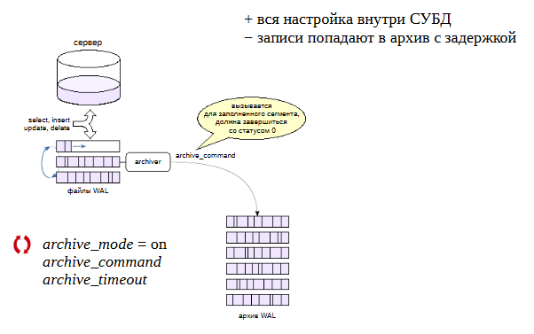

Так как имеется базовая резервная копия и журнал предзаписи, то, добавляя каким-то образом к копии все новые журнальные файлы, генерируемые сервером, 
можно восстановить систему не только на момент копирования файловой системы, но и на произвольный момент времени.

Такая возможность предоставляется путем добавления журнальных записей не к самой резервной копии, а в отдельный «архив». При этом восстановление может 
осуществлено на произвольный момент времени.

Отправка журнальных файлов в архив реализуется фоновым процессом **archiver**, который включается параметром **archive_mode = on**. 
**Требует перезагрузки сервера**.

Для копирования определяется произвольная команда shell в параметре **archive_command**. Она вызывается при заполнении очередного сегмента WAL. 
Если команда завершается с нулевым статусом, то считается, что сегмент успешно помещен в архив и может быть удален с сервера. 
При ненулевом статусе этот сегмент(и следующие за ним) не будут удаляться, а сервер будет периодически повторять команду архивирования, пока не получит 0.
Выполняется непрерывная архивация. Каждый сегмент при заполнении 16 МБ отправляется в архив. Возникает задержка. При активной работе сервера файлы заполняются быстро,
а при низкой (ночью) дольше.

Параметр **archive_timeout** позволяет указать максимальное время переключения на новый сегмент WAL — это позволяет при невысокой активности сервера 
сохранять тем не менее журналы не реже, чем хотелось бы (иными словами, потерять данные максимум за указанное время). Сегмент архива считается заполненным 
и отправляется в архив. 

Переключение на новый сегмент можно выполнить и вручнуюс помощью функции **pg_switch_wal()**.

https://postgrespro.ru/docs/postgresql/13/continuous-archiving

Команда archive_command
***********************

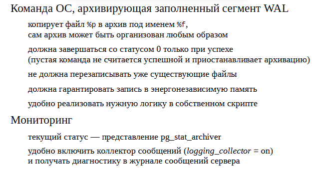
	   
Команда архивирования должна скопировать указанный файл в некий архив. Архив может быть организован любым образом. 
Например, это может быть файловая система на отдельном сервере.

При заполнении этой команды можно пользоваться символами подстановки - **%p** и **%f**. Файл **%p** копируется в файл **%f**. 

Команда обязана завершаться с *нулевым статусом* только в случае успеха.

Команда не должна перезаписывать уже существующие файлы, так как это скорее всего означает какую-то ошибку, и перезапись файла может погубить архив.

Команда **archive_command** может быть пустой. В таком случае команда возвращает ненулевой статус и сервер будет копить сегменты, не копируя их в архив. 
Этим можно пользоваться в том случае, если нужно произвести какие-то работы над архивом. 

Для гарантии надежности команда должна обеспечить попадание файла в энергонезависимую память: иначе при сбое архива можно потерять сегмент, 
если сервер PostgreSQL успеет его удалить.

Текущий статус архивации показывает представление **pg_stat_archiver**. Удобно включить сбор сообщений с помощью процесса **logging_collector**, 
так как в этом случае сообщения об ошибках при выполнения ar chive_command будут попадать в журнал сервера.

Если подразумевается сложная логика, то ее удобно записать в скрипт и использовать имя скрипта в качестве команды копирования.

https://postgrespro.ru/docs/postgresql/13/runtime-config-wal.html#GUC-ARCHIVE-COMMAND

Практика
--------

**Настройка непрерывной архивации**

Архив будем хранить в каталоге **/var/lib/pgsql/archive**. Он должен быть доступен пользователю-владельцу PostgreSQL.

::

	admin$ sudo mkdir /var/lib/pgsql/archive

::

	admin$ sudo chown postgres /var/lib/pgsql/archive
	
В реальной практике архив может размещаться на отдельном сервере или дисковой системе с доступом по сети.

Включим режим архивирования и установим команду копирования заполненных сегментов журнала.

::

	A@postgres=#\c

::

	A@postgres=#ALTER SYSTEM SET archive_mode = on;

В archive_command мы сначала проверяем наличие файла с указанным именем в архиве, и копируем его только в случае отсутствия.

::

	A@postgres=#ALTER SYSTEM SET archive_command = 'test ! -f /var/lib/pgsql/archive/%f && cp %p /var/lib/pgsql/archive/%f';

В archive_command можно указать произвольную команду, лишь бы она завершалась со статусом 0 только в случае успеха. 
Например, можно организовать сжатие архивируемых сегментов:

::

	A@postgres=# SET archive_command = 'test ! -f /var/lib/pgsql/archive/%f && gzip <%p >/var/lib/pgsql/archive/%f';

В идеале команда архивирования должна выполнять sync, чтобы файл гарантированно попал в энергонезависимую память. 
Иначе при сбое он может пропасть из архива, а сервер может успеть стереть его из каталога **pg_wal**.

В общем случае удобно поместить всю необходимую логику архивирования в отдельный скрипт и вызывать его:

::

	A@postgres=# SET archive_command = 'archive.sh "%f" "%p"';

Изменение **archive_mode** требует рестарта сервера.

::

	[admin@PG ~]$ sudo -u postgres pg_ctl -D /var/lib/pgsql/data  restart

Проверим работу архивации. Создадим базу и таблицу.

::

	admint$ psql -U postgres
	
::

	A@postgres=#CREATE DATABASE backup_archive;

::

	A@postgres=#\c backup_archive

	You are now connected to database "backup_archive" as user "postgres".
::

	CREATE TABLE t(s text);
::

	INSERT INTO t VALUES ('Привет, мир!');

Вот какой сегмент WAL используется сейчас:

::

	SELECT pg_walfile_name(pg_current_wal_lsn());
	
	pg_walfile_name      
	--------------------------
	 000000010000000000000003
	(1 row)

Первые восемь цифр в имени файла — *номер текущей линии времени*.

Чтобы заполнить файл, пришлось бы выполнить большое количество операций. 
В тестовых целях проще принудительно переключить сегмент:

::

	SELECT pg_switch_wal();
	
	 pg_switch_wal 
	---------------
	 0/301C460
	(1 row)
	
::

	INSERT INTO t VALUES ('Доброе утро, страна!');

Сегмент сменился:

::

	SELECT pg_walfile_name(pg_current_wal_lsn());
     
	 pg_walfile_name      
	--------------------------
	 000000010000000000000004
	(1 row)

А предыдущий должен был попасть в архив. Проверим:

::

	admin$ sudo ls -l /var/lib/pgsql/archive

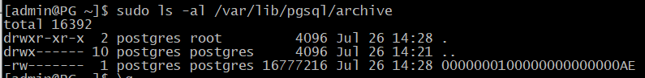

Текущий статус архивации показывает представление pg_stat_archiver:

::

	A@backup_archive=#SELECT * FROM pg_stat_archiver \gx

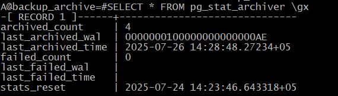
	   
Таким образом, файловая архивация настроена и работает.

pg_receivewal
*************

Можно организовать пополнение архива с помощью протокола репликации. 
Для этого используется утилита **pg_receivewal**.

Обычно утилита запускается на отдельном сервере и подключаетсяк серверу с параметрами, указанными в ключах. 
На том сервере, куда нужно будет сохранять архив. И для того, чтобы гарантировать, что все журнальные записи с основного сервера 
попадут в архив, используется слот репликации, чтобы гарантированно не потерять записи.

Утилита формирует файлы аналогично тому, как это делает сам сервер, и записывает их в указанный каталог. 
Еще не до конца заполненные сегменты отличаются префиксом **.partial**. То есть журнальные записи попадают в архив непрерывно.
Синхронизацияс файловой системой по умолчанию происходит только при закрытии файла-сегмента.

Архивирование всегда начинается с начала сегмента, следующего за последним уже полностью заполненным сегментом, 
который присутствует в архиве. Если архив пуст (первый запуск), архивирование начинается с начала текущего сегмента. 
Вместе со слотом это гарантирует отсутствие пропусков в архиве, даже если утилита отключалась на некоторое время. 
Утилита будет получать записи бесконечно, но, если указан ключ **--endpos=lsn**, она завершит работу по получении записи с заданным LSN.

С помощью потоковой репликации в архиве не будет "дыр", потому что даже в случае обрыва связи и ее восстановления pg_receivewal определяет,
какой файл в архиве был записан последним и начнет вытягивать с основного сервера те файлы, которые идут после него.

.. important:: **pg_receivewal** не запускается автоматически (как сервис) и не демонизируется. 
               Она потребует дополнительного мониторинга и (в случае репликации) действий по переключению на другой сервер.
			   
https://postgrespro.ru/docs/postgresql/13/app-pgreceivewal

Практика
--------

**Потоковый архив**

Чтобы настроить пополнение архива по протоколу потоковой репликации, сначала необходимо остановить файловую архивацию.

::

	A@postgres=#\c backup_archive

	You are now connected to database "backup_archive" as user "postgres".

::

	A@postgres=#ALTER SYSTEM RESET archive_mode;

ALTER SYSTEM

::

	A@backup_archive=#ALTER SYSTEM RESET archive_command;

ALTER SYSTEM

::

	[admin@PG ~]$ sudo -u postgres pg_ctl -D /var/lib/pgsql/data  restart
	
Текущее состояние архива.

::

	[admin@PG ~]$ sudo ls -al /var/lib/pgsql/archive
	
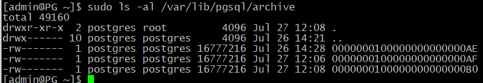
	   
Сначала создадим слот **pg_receivewal**, чтобы гарантировать получение всех записей журнала.

::

	admin$ pg_receivewal --create-slot --slot=archive

Затем запустим ее фоном в режиме архивации. Увидев, что в архиве уже есть файлы, утилита запросит у сервера следующий сегмент, чтобы в архиве не было пропусков.

::

	[admin@PG ~]$ sudo -u postgres pg_receivewal -D /var/lib/pgsql/archive --slot=archive

В другом сеансе добавим в таблицу много строк и удалим их.

::

	[admin@PG ~]$ psql -U postgres -d backup_archive

::

	A@backup_archive=#INSERT INTO t SELECT 'PostgreSQL' FROM generate_series(1,200000);
	
	INSERT 0 200000

::

	A@backup_archive=#DELETE FROM t WHERE s = 'PostgreSQL';
	
	DELETE 200000

::

	A@backup_archive=#VACUUM t;
	
	VACUUM

В архиве появились новые файлы.

::

	[admin@PG ~]$ sudo ls -al /var/lib/pgsql/archive

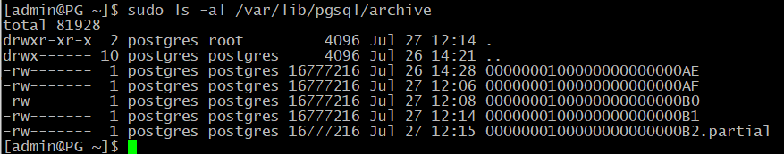
	   
Последний файл имеет суффикс **.partial** — в него идет запись.

Потоковая архивация настроена.

Базовая копия и восстановление
******************************

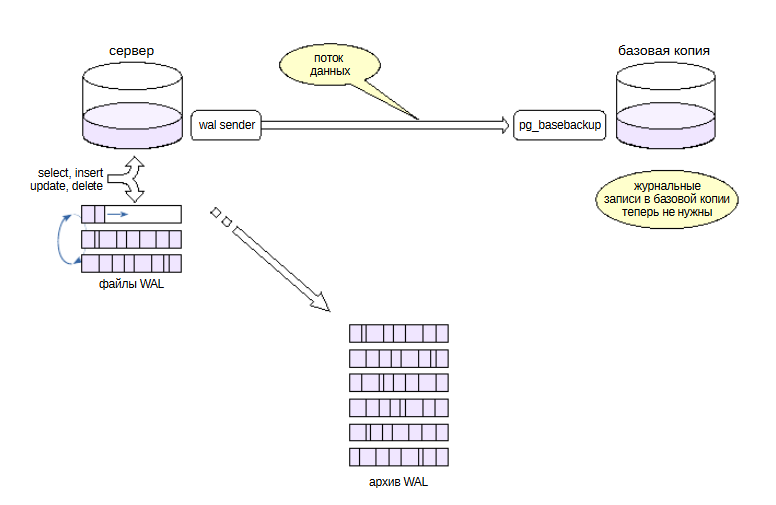

Если имеется настроенный архив журнала предзаписи, то в базовой резервной копии файлы журнала делать не обязательно, так как их при восстановлении можно 
получить из архива. Поэтому **pg_basebackup** можно запускать с ключом **--wal-method=none**.
(Но это делать необязательно. Более того, наличие файлов журнала позволит восстановить систему в ситуации, если архив окажется недоступен.)

Практика:
---------

Поскольку архив пополняется автоматически, то запустить **pg_basebackup** без добавления файлов журнала к резервной копии:

::

	[admin@PG ~]$ pg_basebackup --wal-method=none --pgdata=/home/admin/backup

	NOTICE:  WAL archiving is not enabled; you must ensure that all required WAL segments are copied through other means to complete the backup

Каталог **pg_wal** резервной копии пуст:

::

	[admin@PG ~]$ ls -al backup/pg_wal/

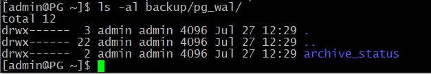
	   
А в архиве прибавилось файлов:

::
	
	[admin@PG ~]$ sudo ls -al /var/lib/pgsql/archive

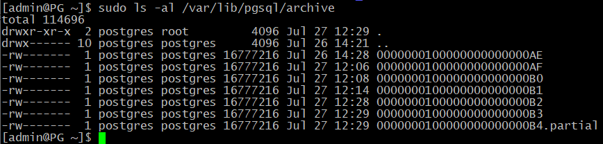

Файл метки:

::

	[admin@PG ~]$ cat backup/backup_label

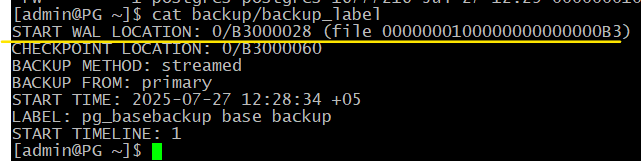

Главная информация в этом файле — номер линии времени (строка START TIMELINE) и указание начальной точки для восстановления (START WAL LOCATION). 
Теоретически восстановление можно начать и с более ранней (но не более поздней) позиции, но это потребует больше времени.

Восстановление
==============

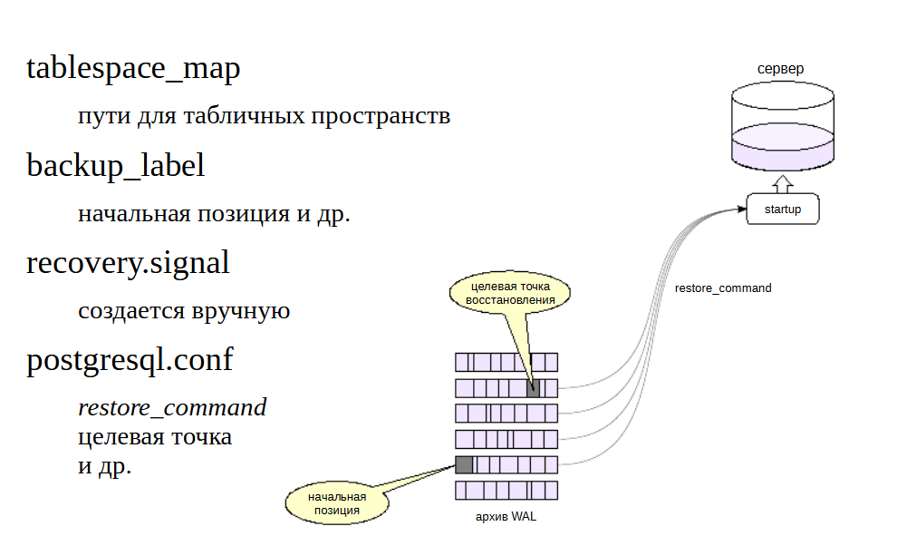
	   
Процессом восстановления управляют три файла и параметры.

Файл **tablespace_map** генерируется при создании базовой резервной копии и содержит пути для табличных пространств. 
Если символические ссылки в **pg_tblspc** отсутствуют (это верно для формата tar), то они будут созданы при старте сервера на основании информации в **tablespace_map**.

Файл метки **backup_label** также генерируется автоматически при создании базовой резервной копии и содержит название, 
время создания копии и — самое важное — номер линии времени, название сегмента WAL и позицию в нем, с которой надо начинать восстановление.
Так как когда есть большой архив, накопившийся за длительное время, то нужно знать начальную точку восстановления, 
с какого именно момента нужно проигрывать журнальные файлы.

Третий файл, **recovery.signal**, создается вручную. Его наличие дает указание серверу перейти в режим восстановления. 
Содержимое файла игнорируется. Если **recovery.signal** отсутствует, то PostgreSQL считает, что выполняется автоматическое восстановление после сбоя. 
Если же файл есть- то происходит управляемое пользователем восстановление из резервной копии.

Целевая точка
=============

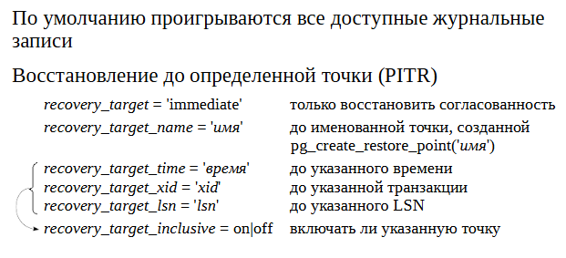
	   
Если не задана цель восстановления (один из параметров **recovery_target**), базы данных будут восстановлены максимально близко к моменту сбоя. 
Однако процесс восстановления можно остановить и в любой другой момент, указав целевую точку.

Параметр **recovery_target = 'immediate'** остановит восстановление, как только будет достигнута согласованность. 
Фактически, это эквивалентно восстановлению из базовой копии без архива. Будет восстановлено то количество журнальных записей, которое нужно для 
восстановления согласованности, то есть минимальное количество журнальных записей.

Параметр **recovery_target_name** позволяет указать именованную точку восстановления, созданную ранее с помощью функции **pg_create_restore_point()**. 
Это полезно, если заранее известно, что может потребоваться восстановление. Удобно этим пользоваться, если есть уверенность,
что далее будут произведены какие-то действия, которые наверняка могут привести к проблемам в базе данных, и придется откатываться.

Параметр **recovery_target_time** позволяет указать произвольное время (timestamp), **recovery_target_xid** — произвольную транзакцию, 
**recovery_target_lsn** — номер LSN. С помощью параметра **recovery_target_inclusive** можно включить или исключить саму точку.

https://postgrespro.ru/docs/postgresql/13/runtime-config-wal#RUNTIME-CONFIG-WAL-ARCHIVE-RECOVERY

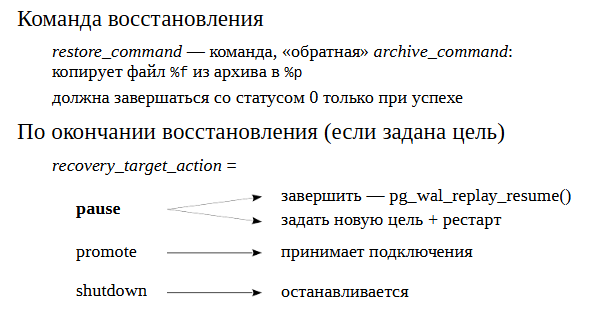
	   
Для восстановления необходимо задать параметр **restore_command**, который определяет команду, «обратную» команде архивирования **archive_command**. 
Она должна **скопировать файл из архива в каталог pg_wal и завершаться со статусом 0 только при успехе**. Это очень важно, так как в процессе восстановления 
сервер может выполнять команду для файлов, которых не окажется в архиве — это  не ошибка, но команда должна завершиться с ненулевым статусом.

https://postgrespro.ru/docs/postgresql/13/runtime-config-wal#RUNTIME-CONFIG-WAL-ARCHIVE-RECOVERY

Если задана цель, параметр **recovery_target_action** позволяет выбрать состояние, в котором окажется сервер по окончании восстановления.

По умолчанию (значение **pause**) процедура восстановления приостанавливается. 
Администратор может выполнить запросы к данным и решить, корректно ли была выбрана цель, после чего либо завершить восстановление, вызвав функцию 
**pg_wal_replay_resume()**, либо задать новую цель, перезапустить сервер и продолжить применение журнальных записей.

Если задано значение **promote**, сервер сразу сможет принимать запросы на подключения.

Значение **shutdown** приведет к остановке сервера. При этом файл **recovery.signal** не удаляется.

Окончание восстановления
========================

После того, как восстановление закончено:

- процесс **startup** завершается, postmaster запускает остальные служебные процессы, необходимые для работы экземпляра, и сервер начинает работатьв обычном режиме. 

- Файл **recovery.signal** удаляется, **backup_label** переименовывается в **backup_label.old**.

Возможна ситуация, когда запущенный сервер не стартует. В этом случае в операционной системе будут отсутствовать процессы 
(и не будет файла postmaster.pid), а **recovery.signal не будет удален**. Причину ошибки можно узнать из журнала сообщений сервера 
(например, в параметрах была допущена ошибка). После исправления причины ошибки сервер следует запустить еще раз.

.. important:: Если на сервере-источнике было настроено непрерывное архивирование, то на резервном сервере его надо либо отключить, 
               либо перенаправить в другой архив
			  
Практика
--------

**Восстановление из базовой резервной копии**

Задать настройки восстановления. В простейшем случае достаточно указать команду восстановления, 
которая будет копировать указанный сегмент WAL обратно из архива по указанному пути:

::

	[admin@PG ~]$ echo "restore_command = 'cp /var/lib/pgsql/archive/%f %p'" >>/home/admin/backup/postgresql.auto.conf

Если не указана целевая точка восстановления (один из параметров **recovery_target**), то к базовой резервной копии будут применены записи WAL 
из всех файлов в архиве.

Наличие файла **recovery.signal** — указание серверу при старте войти в режим управляемого восстановления:

::

	[admin@PG ~]$ touch /home/admin/backup/recovery.signal

Выложить резервную копию в каталог данных сервера B и запустить его.

::

	[admin@PG ~]$ sudo -u postgres pg_ctl -D /var/lib/pgsql/data1 status
	
	pg_ctl: no server running

::

	[admin@PG ~]$ sudo -u postgres rm -fr /var/lib/pgsql/data1

::

	[admin@PG ~]$ sudo  mv backup/ /var/lib/pgsql/data1
	
::

	[admin@PG ~]$ sudo chown -R postgres /var/lib/pgsql/data1

Изменить порт для сервера B:

::

	sudo sed -i 's/#port = 5432/port = 5433/g' /var/lib/pgsql/data1/postgresql.conf

Запустить сервер B:

::

	[admin@PG ~]$ sudo -u postgres pg_ctl -D /var/lib/pgsql/data1 start

После успешного восстановления файл **recovery.signal** удаляется, а файл метки переименовывается в **backup_label.old**:

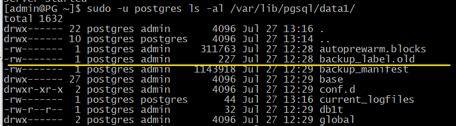

::

	[admin@PG ~]$ sudo ls -l /var/lib/pgsql/data1 | egrep 'recovery.*|backup_label.*'

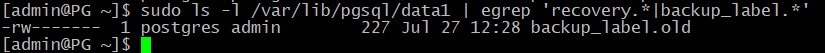

Проверка восстановленных данных:

::

	[admindb@PG ~]$ psql -U postgres -p 5433 -d backup_archive
	
	SELECT * FROM t;

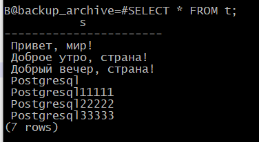

Линии времени
*************

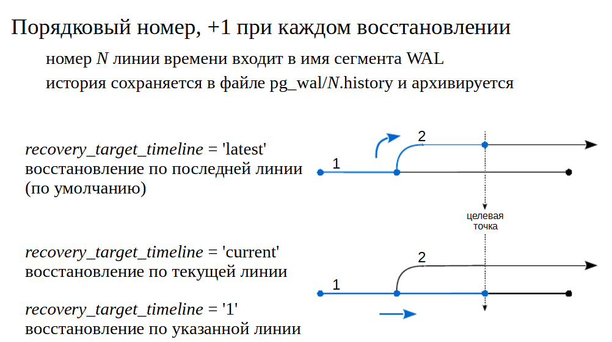

После восстановления на момент в прошлом сервер начинает генерировать новые сегменты WAL, которые будут пересекаться с сегментами «из прошлой жизни». 
Чтобы не потерять сегменты и, вместе с ними, возможность восстановления на другой момент, PostgreSQL вводит понятие линии времени. 
После каждого восстановления с использованием **recovery.signal** номер линии времени увеличивается, и этот номер является частью номера сегментов WAL.

Линии времени образуют древовидную структуру, на рисунках приведен пример. Первая линия имеет номер 1. 
Произошло восстановление на момент времени в прошлом, и началась линия 2.

Если выполнить восстановление с указанием параметра **recovery_target_timeline = 'latest'** , то, дойдя то точки ветвления, применение записей WAL 
продолжится по второй (более поздней) линии.

Если же указать параметр **recovery_target_timeline = '1'**, то восстановление продолжится по первой (указанной) линии, 
а если указать **recovery_target_timeline = 'current'**, то по текущей (в нашем случае тоже по линии 1, это поведение по умолчанию до версии 11).

Информацию о точках ветвления PostgreSQL берет из файлов истории **pg_wal/N.history**. Поэтому их никогда не следует удалять из архива.

Практика
---------

Линии времени

Что стало с линией времени после восстановления?

::

	B@backup_archive=#SELECT pg_walfile_name(pg_current_wal_lsn());

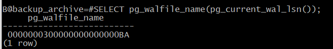

Номер увеличился на единицу.

В каталоге pg_wal появился файл истории, соответствующий этой ветви:

::

	[admin@PG ~]$ sudo -u postgres ls -al /var/lib/pgsql/data1/pg_wal

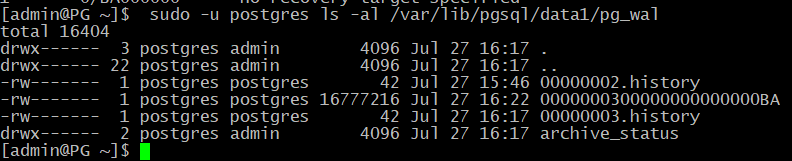
	   
В нем есть информация о «точках ветвления», через которые мы пришли в данную линию времени:

::

	[admin@PG ~]$ sudo -u postgres cat /var/lib/pgsql/data1/pg_wal/00000003.history
	
	1       0/BA000000      no recovery target specified

Эти файлы PostgreSQL использует, когда указывается линия времени в параметре **recovery_target_timeline**. 
Поэтому файлы истории подлежат архивации вместе с сегментами WAL, и удалять из архива их не надо.

Очистка архива
**************

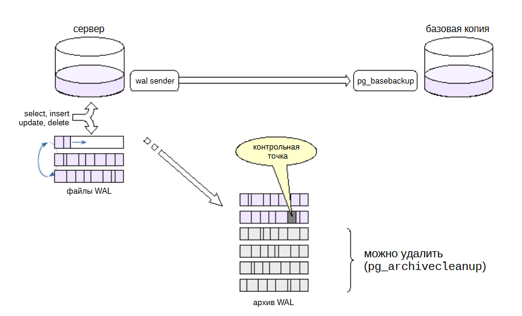
	   
	   
Архив со временем разрастается, поэтому требуется периодическая очистка от ненужных файлов.

Для очистки можно воспользоваться утилитой **pg_archivecleanup**. Утилите нужно указать имя сегмента WAL, и она удалит все ему предшествующие.

https://postgrespro.ru/docs/postgresql/13/pgarchivecleanup

Вопрос в том, как определить позицию в архиве, начиная с которой сегменты уже не нужны. Нужно каким-то образом найти последний сегмент 
который необходим и все что меньше него удалить.

Если архив используется только для восстановления одного резервного экземпляра, можно выполнять очистку сразу после восстановления. 
Для этого служит параметр **recovery_end_command**, в котором задается команда (например, **pg_archivecleanup**), которая выполнится по окончании восстановления. 
В команде можно использовать комбинацию **%r**, которая заменится на имя файла, содержащего запись о последней выполненной контрольной точке.

Но если архив должен поддерживать восстановление из нескольких базовых резервных копий, то для автоматизации очистки либо придется написать собственный скрипт, 
либо — что лучше — воспользоваться одной из сторонних программ резервного копирования, таких как **pg_probackup**, 
которые позволяют гибко настроить политику хранения резервных копий.

Практика
--------

**Очистка архива**

Сейчас архив первого сервера содержит ненужные файлы, они попали туда до формирования базовой копии:

::

	[admin@PG ~]$ sudo ls -al /var/lib/pgsql/archive
	
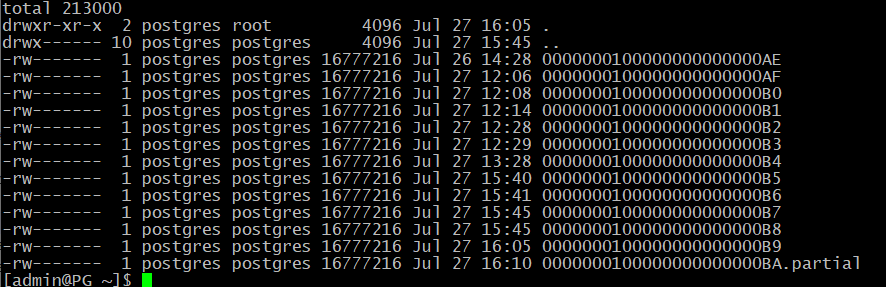
	   
Утилите pg_archivecleanup нужно передать путь к архиву и имя последнего сохраняемого сегмента WAL (его можно найти в файле **backup_label**).

::

	[admin@PG ~]$ sudo -u postgres cat /var/lib/pgsql/data1/backup_label.old
	
	
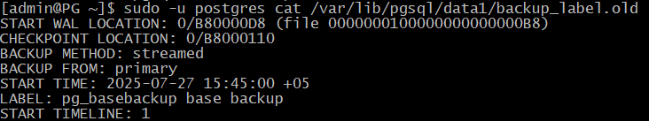

::

	[admin@PG ~]$ sudo pg_archivecleanup /var/lib/pgsql/archive 0000000100000000000000B8

Посмотрим, какие файлы остались в архиве:

::

	[admin@PG ~]$ sudo ls -al /var/lib/pgsql/archive
	
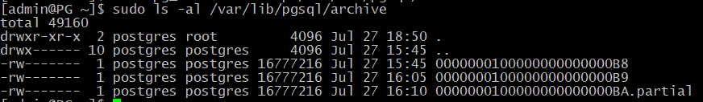
	   
Архив очищен.

Чтобы архив очищался по окончании восстановления, можно задать параметр

::

	A=> -- SET recovery_end_command = 'pg_archivecleanup /var/lib/pgsql/archive %r'

Таким образом,

Физическое резервирование — базовые резервные копии и архив журнала предзаписи

Хорошо подходит для: 

- текущего периодического резервированиядля восстановления после сбоя с минимальной потерей данных

- для восстановления на произвольный момент времени

- для резервирования данных большого объема

Плохо подходит для длительного хранения

Не подходитдля миграции на другую платформу

Практика
********

1. На первом сервере создайте базу данных и в ней таблицус какими-нибудь данными.

2. Настройте непрерывное архивирование.

3. Сделайте базовую резервную копию кластера с помощью pg_basebackup, без файлов журнала.

4. Вставьте еще несколько строк в таблицу и убедитесь,что текущий сегмент WAL попал в архив.

5. Восстановите второй сервер из резервной копии, указавв параметрах одну только команду восстановления. Проверьте, что в таблице восстановились все строки.

6. Остановите второй сервер и восстановите его повторноиз той же резервной копии, на этот раз указав целевую точку восстановления immediate. Проверьте таблицу.