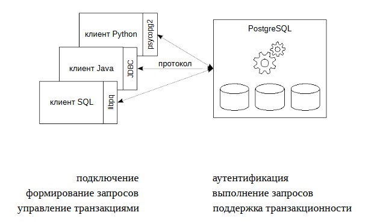
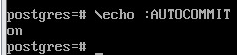
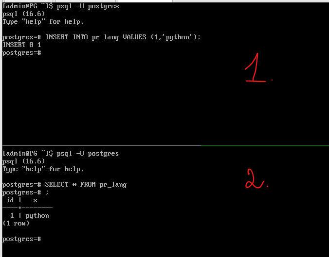

Устройство сервера
#####################

Клиент-серверный протокол
*******************

.. figure:: img/05_struct_01.png
       :scale: 100 %
       :align: center
       :alt: asda
	   

PostgreSQL функционирует в режиме сервера. Для того чтобы пользователи могли использовать его ресурсы пишутся
клиентские приложения. Чтобы все эти разнообразные программы могли работать одинаково с сервером, 
сервер поддерживает клиент-серверный протокол. Все протоколы клиент-серверной модели работают на уровне приложений.

Клиенты и серверы PostgreSQL взаимодействуют друг с другом, используя специальный протокол, основанный на сообщениях. 
Этот протокол поддерживается для соединений по TCP/IP и через Unix-сокеты. Для серверов, поддерживающих этот протокол, 
в IANA зарезервирован номер TCP-порта 5432, но на практике можно задействовать любой порт, не требующий особых привилегий.

Чтобы эффективно обслуживать множество клиентов, сервер запускает отдельный «обслуживающий» процесс для каждого клиента. 
В текущей реализации новый дочерний процесс запускается немедленно после обнаружения входящего подключения, что происходит прозрачно для протокола.

Протокол определяет функционал который может быть использован между сервером и клиентом, он описан в документации, 
является открытым.

Для реализации протокола существуют готовые библиотеки, которые можно подключать и использовать. 
Обычно клиент использует драйвер, реализующий протокол и предоставляющий набор функций для использованияв программе. 
Внутри драйвер может пользоваться стандартной реализацией протокола (библиотекой libpq), 
либо реализовывать этот протокол самостоятельно.

Например:

- **psycopg2** — один из самых популярных и широко используемых драйверов Python для PostgreSQL. Это оболочка для libpq, 
официальной клиентской библиотеки PostgreSQL.

Все, что будет программироваться в рамках приложения будет ограничено протоколом.

В протоколе выделены отдельные фазы для запуска и обычной работы. 
На стадии *запуска* клиент открывает подключение к серверу и передаёт стартовое сообщение. 
В этом сообщении содержатся имена пользователя и базы данных, к которой пользователь хочет подключиться; 
в нём также определяется, какая именно версия протокола будет использоваться. 
После анализа этой информации и содержимого конфигурационных файлов(в частности, pg_hba.conf), 
сервер определяет, можно ли предварительно разрешить это подключение, и какая дополнительная проверка подлинности требуется.

Затем сервер отправляет соответствующее сообщение с запросом аутентификации, 
на которое клиент должен ответить сообщением, подтверждающим его подлинность (например, по паролю). 

Если клиент не поддерживает метод проверки подлинности, запрошенный сервером, он должен немедленно закрыть соединение.

Получив сообщение **AuthenticationOk**, клиент должен ждать дальнейших сообщений от сервера. 
В этой фазе запускается обслуживающий процесс (backend). Попытка запуска может быть неудачной (и клиент получит ErrorResponse) 
либо сервер может отказать в поддержке запрошенной младшей версии протокола (NegotiateProtocolVersion).

В ходе обычной работы клиент передаёт запросы и другие команды серверу, 
а сервер возвращает результаты запросов и другие ответы. 
Иногда сервер передаёт клиенту сообщения по своей инициативе, но по большей части эта фаза сеанса управляется запросами клиента.

*Завершение* сеанса обычно происходит по желанию клиента, 
но в некоторых случаях и сервер может принудительно завершить сеанс. 
Когда сервер закрывает соединение, он предварительно откатывает любую открытую (незавершённую) транзакцию.

Поробнее:

https://postgrespro.ru/docs/postgresql/16/protocol

Транзакции
***********

Транзакция — это совокупность операций над базой данных, которые
вместе образуют логически целостную процедуру, и могут быть либо
выполнены все вместе, либо не будет выполнена ни одна из них.

- Транзакция переводит базу данных из одного согласованного
состояния в другое согласованное состояние;
- Транзакции являются одним из средств обеспечения согласованности
(непротиворечивости) базы данных, наряду с ограничениями
целостности (constraints), накладываемыми на таблицы.
- Транзакция может иметь два исхода: первый — изменения данных,
произведенные в ходе ее выполнения, успешно зафиксированы в
базе данных, а второй исход таков — транзакция отменяется, и
отменяются все изменения, выполненные в ее рамках;
- Изменения, сделанные транзакцией фиксируются с помощью ключевого слова COMMIT;
- Отмена транзакции называется откатом (rollback);
- В простейшем случае транзакция состоит из одной операции.

ACID
=====

От транзакции обычно ожидают выполнение четырех свойств, так называемый ACID:

.. note:: **Атомарность (Atomicity)** Это свойство означает, что либо транзакция
будет зафиксирована в базе данных полностью, т. е. будут зафиксированы результаты выполнения всех ее операций, либо не
будет зафиксирована ни одна операция транзакции.

Транзакцию нельзя выполнлить так, что она доработает до половины и оборвется. 
Если это произошло, то изменения, которые она успела произвести, будут убраны.

.. note:: **Согласованность (Consistency)**. Это свойство предписывает, чтобы в результате успешного выполнения транзакции база данных была
переведена из одного согласованного состояния в другоесогласованное состояние.

Это могут быть как ограничения целостности, которые описаны базе данных, так и некоторые ограничения, 
которые описываются логикой клиентского приложения. 

.. note:: **Изолированность (Isolation)**. Во время выполнения транзакции другие транзакции должны оказывать по возможности минимальное
влияние на нее.

.. note:: **Долговечность (Durability)**. После успешной фиксации транзакции пользователь должен быть уверен, что данные надежно сохранены в
базе данных и впоследствии могут быть извлечены из нее, независимо от последующих возможных сбоев в работе системы.

Транзакции могут создаваться явным образом командой **BEGIN** или **START TRANSACTION** и завершаться командой **COMMIT** или 
**ROLLBACK**. SQL-операторы вне явного блока транзакций автоматически обрабатываются в виде транзакций, состоящих из одного оператора.

Каждой транзакции присваивается уникальный идентификатор **VirtualTransactionId** (также именуемый virtualXID или **vxid**), 
который состоит из идентификатора обслуживающего процесса (или backendID) и последовательно назначаемого номера. 
При первой операции **записи** транзакции в базу данных транзакции назначается невиртуальный 
идентификатор **TransactionId** (или **xid**). Когда транзакция верхнего уровня с (невиртуальным) **xid** фиксируется, 
она помечается как зафиксированная в каталоге **pg_xact**.

Подробнее:

https://postgrespro.ru/docs/postgresql/16/sql-begin

https://postgrespro.ru/docs/postgresql/16/sql-savepoint

https://postgrespro.ru/docs/postgresql/16/transactions

Практика:
-----------

psql работает в режиме автофиксации, то есть любая одиночная команда сразу исполняется.

::

	\echo :AUTOCOMMIT
	

Например, драйвер **psycopg2** работает в режиме отключенной автофиксации.

1. Создать таблицу pr_lang

::

	CREATE TABLE pr_lang(
	id integer,
    s text
    );
	
2. Вставить строку 

::

	INSERT INTO pr_lang(id, s) VALUES (1, 'python');

3. Проверить видимость данных в другой транзакции (2):

::

	| SELECT * FROM pr_lang;

	

