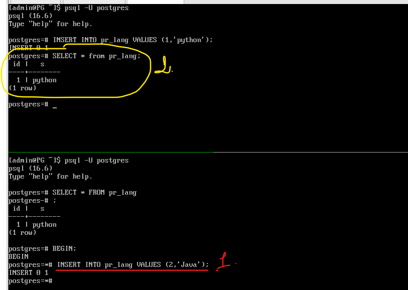
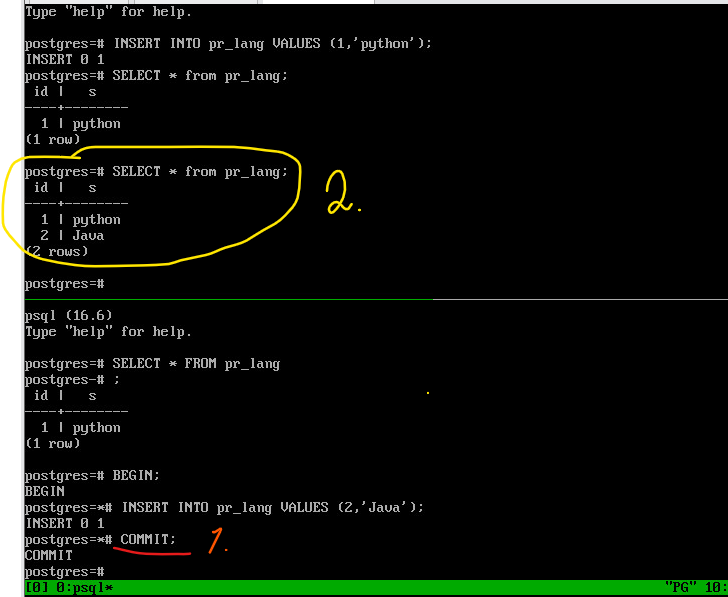
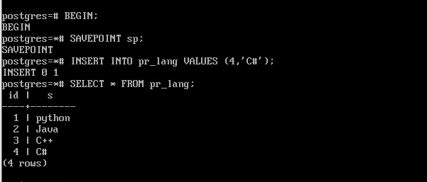
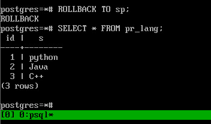
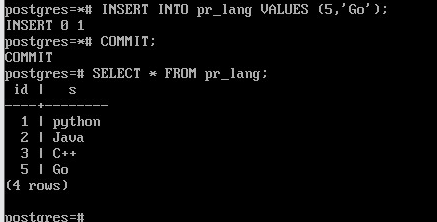

Устройство сервера
#####################

Клиент-серверный протокол
*******************

.. figure:: img/05_struct_01.png
       :scale: 100 %
       :align: center
       :alt: asda
	   

PostgreSQL функционирует в режиме сервера. Для того чтобы пользователи могли использовать его ресурсы пишутся
клиентские приложения. Чтобы все эти разнообразные программы могли работать одинаково с сервером, 
сервер поддерживает клиент-серверный протокол. Все протоколы клиент-серверной модели работают на уровне приложений.

Клиенты и серверы PostgreSQL взаимодействуют друг с другом, используя специальный протокол, основанный на сообщениях. 
Этот протокол поддерживается для соединений по TCP/IP и через Unix-сокеты. Для серверов, поддерживающих этот протокол, 
в IANA зарезервирован номер TCP-порта 5432, но на практике можно задействовать любой порт, не требующий особых привилегий.

Чтобы эффективно обслуживать множество клиентов, сервер запускает отдельный «обслуживающий» процесс для каждого клиента. 
В текущей реализации новый дочерний процесс запускается немедленно после обнаружения входящего подключения, что происходит прозрачно для протокола.

Протокол определяет функционал который может быть использован между сервером и клиентом, он описан в документации, 
является открытым.

Для реализации протокола существуют готовые библиотеки, которые можно подключать и использовать. 
Обычно клиент использует драйвер, реализующий протокол и предоставляющий набор функций для использованияв программе. 
Внутри драйвер может пользоваться стандартной реализацией протокола (библиотекой libpq), 
либо реализовывать этот протокол самостоятельно.

Например:

- **psycopg2** — один из самых популярных и широко используемых драйверов Python для PostgreSQL. Это оболочка для libpq, 
официальной клиентской библиотеки PostgreSQL.

Все, что будет программироваться в рамках приложения будет ограничено протоколом.

В протоколе выделены отдельные фазы для запуска и обычной работы. 
На стадии *запуска* клиент открывает подключение к серверу и передаёт стартовое сообщение. 
В этом сообщении содержатся имена пользователя и базы данных, к которой пользователь хочет подключиться; 
в нём также определяется, какая именно версия протокола будет использоваться. 
После анализа этой информации и содержимого конфигурационных файлов(в частности, pg_hba.conf), 
сервер определяет, можно ли предварительно разрешить это подключение, и какая дополнительная проверка подлинности требуется.

Затем сервер отправляет соответствующее сообщение с запросом аутентификации, 
на которое клиент должен ответить сообщением, подтверждающим его подлинность (например, по паролю). 

Если клиент не поддерживает метод проверки подлинности, запрошенный сервером, он должен немедленно закрыть соединение.

Получив сообщение **AuthenticationOk**, клиент должен ждать дальнейших сообщений от сервера. 
В этой фазе запускается обслуживающий процесс (backend). Попытка запуска может быть неудачной (и клиент получит ErrorResponse) 
либо сервер может отказать в поддержке запрошенной младшей версии протокола (NegotiateProtocolVersion).

В ходе обычной работы клиент передаёт запросы и другие команды серверу, 
а сервер возвращает результаты запросов и другие ответы. 
Иногда сервер передаёт клиенту сообщения по своей инициативе, но по большей части эта фаза сеанса управляется запросами клиента.

*Завершение* сеанса обычно происходит по желанию клиента, 
но в некоторых случаях и сервер может принудительно завершить сеанс. 
Когда сервер закрывает соединение, он предварительно откатывает любую открытую (незавершённую) транзакцию.

Поробнее:

https://postgrespro.ru/docs/postgresql/16/protocol

Транзакции
***********

Транзакция — это совокупность операций над базой данных, которые
вместе образуют логически целостную процедуру, и могут быть либо
выполнены все вместе, либо не будет выполнена ни одна из них.

- Транзакция переводит базу данных из одного согласованного состояния в другое согласованное состояние;

- Транзакции являются одним из средств обеспечения согласованности (непротиворечивости) базы данных, наряду с ограничениями
целостности (constraints), накладываемыми на таблицы;

- Транзакция может иметь два исхода: первый — изменения данных,произведенные в ходе ее выполнения, успешно зафиксированы в
базе данных, а второй исход таков — транзакция отменяется, и отменяются все изменения, выполненные в ее рамках;

- Изменения, сделанные транзакцией фиксируются с помощью ключевого слова COMMIT;

- Отмена транзакции называется откатом (rollback);

- В простейшем случае транзакция состоит из одной операции.

ACID
=====

От транзакции обычно ожидают выполнение четырех свойств, так называемый ACID:

.. note:: **Атомарность (Atomicity)** Это свойство означает, что либо транзакция будет зафиксирована в базе данных полностью, т. е. будут зафиксированы результаты выполнения всех ее операций, либо не будет зафиксирована ни одна операция транзакции.

Транзакцию нельзя выполнлить так, что она доработает до половины и оборвется. 
Если это произошло, то изменения, которые она успела произвести, будут убраны.

.. note:: **Согласованность (Consistency)**. Это свойство предписывает, чтобы в результате успешного выполнения транзакции база данных была
			переведена из одного согласованного состояния в другоесогласованное состояние.

Это могут быть как ограничения целостности, которые описаны базе данных, так и некоторые ограничения, 
которые описываются логикой клиентского приложения. 

.. note:: **Изолированность (Isolation)**. Во время выполнения транзакции другие транзакции должны оказывать по возможности минимальное
			влияние на нее.

.. note:: **Долговечность (Durability)**. После успешной фиксации транзакции пользователь должен быть уверен, что данные надежно сохранены в
			базе данных и впоследствии могут быть извлечены из нее, независимо от последующих возможных сбоев в работе системы.

Транзакции могут создаваться явным образом командой **BEGIN** или **START TRANSACTION** и завершаться командой **COMMIT** или 
**ROLLBACK**. SQL-операторы вне явного блока транзакций автоматически обрабатываются в виде транзакций, состоящих из одного оператора.

Каждой транзакции присваивается уникальный идентификатор **VirtualTransactionId** (также именуемый virtualXID или **vxid**), 
который состоит из идентификатора обслуживающего процесса (или backendID) и последовательно назначаемого номера. 
При первой операции **записи** транзакции в базу данных транзакции назначается невиртуальный 
идентификатор **TransactionId** (или **xid**). Когда транзакция верхнего уровня с (невиртуальным) **xid** фиксируется, 
она помечается как зафиксированная в каталоге **pg_xact**.

Подробнее:

https://postgrespro.ru/docs/postgresql/16/sql-begin

https://postgrespro.ru/docs/postgresql/16/sql-savepoint

https://postgrespro.ru/docs/postgresql/16/transactions

Практика:
-----------

psql работает в режиме автофиксации, то есть любая одиночная команда сразу исполняется.

::

	\echo :AUTOCOMMIT
	

Например, драйвер **psycopg2** работает в режиме отключенной автофиксации.

1. Создать таблицу pr_lang

::

	CREATE TABLE pr_lang(id integer, s text);
	
2. Вставить строку 

::

	INSERT INTO pr_lang(id, s) VALUES (1, 'python');

3. Проверить видимость данных в другой транзакции (2):

::

	| SELECT * FROM pr_lang;

	
4. Во втором сеансе начать новую транзакцию:

::

	|BEGIN;
	|INSERT INTO pr_lang VALUES (2,'Java');

4. В первом сеансе сделать выборку:

::

	SELECT * FROM pr_lang;
	
Новые данные не видны.

5. Зафиксировать транзакцию втором сеансе и повторить выборку в первом сеансе.

::

	| COMMIT;

::

	SELECT * FROM pr_lang;
	

6. Отключить автофиксацию psql и выполнить вставку данных в первом сеансе, проверить во втором и закоммитить.

::

	\set AOUTOCOMMIT off
	INSERT INTO pr_lang VALUES (3,'C++');
	
	|SELECT * FROM pr_lang;
	
	COMMIT;
	
	|SELECT * FROM pr_lang;

Для отмены вполнения части команд транзакции можно использовать точку сохранения **SAVEPOINT**.
Отменяются только те изменения состояния БД, которые были выполнены от момента установки точки до текущего момента.

::

	|BEGIN;
	|SAVEPOINT sp;
	|INSERT INTO pr_lang VALUES (4,'C#');
	|SELECT * FROM pr_lang;
	

	   
Внутри транзакции видны собственные изменения.

::

	|ROLLBACK TO sp;
	|SELECT * FROM pr_lang;
	
Таблица вернулась к состоянию на момент точки сохранения **sp**.

::

	|INSERT INTO pr_lang VALUES (5,'Go');
	|COMMIT;
	|SELECT * FROM pr_lang;
	

	   
Запросы
********

Простое выполнение запросов 
=============================

Цикл простого выполнения запросов начинает клиент, передавая серверу сообщение Query. 
Это сообщение включает команду (или команды) SQL, выраженную в виде *текстовой строки*. 
В ответ сервер передаёт одно или несколько сообщений, в зависимости от строки запроса, 
и завершает цикл сообщением ReadyForQuery. ReadyForQuery говорит клиенту, что он может безопасно передавать новую команду.

Запрос, поступающий серверу на выполнение, проходит несколько этапов:

- Разбор;
- Переписывание (трансформация);
- Планирование;
- Выполнение.

Разбор
-------

Во-первых, текст запроса необходимо разобрать (parse), чтобы понять, что именно требуется выполнить.

Лексический и синтаксический разбор
^^^^^^^^^^^^^^^^^^^^

Лексический анализатор разбирает текст запроса на лексемы (такие как ключевые слова, строковые и числовые литералы и т. п.), 
а синтаксический анализатор убеждается, что полученный набор лексем соответствует грамматике языка. 

Разобранный запрос представляется в виде абстрактного синтаксического дерева.

Семантический разбор
^^^^^^^^^^^^^^^^^^^^^^^

Задача семантического анализа — определить, есть ли в базе данных таблицы и другие объекты, 
на которые запрос ссылается по имени, и есть ли у пользователя право обращаться к этим объектам. 
Вся необходимая для семантического анализа мета-информация хранится в **системном каталоге** в специальных таблицах.

Семантический анализатор получает от синтаксического анализатора дерево разбора и перестраивает его, 
дополняя ссылками на конкретные объекты базы данных, информацией о типах данных и т. п.

После того, как запрос разобран, выполняется переписывание или трансформация.

Трансформация
---------------

Трансформации используются ядром для нескольких целей. 
Одна из них — заменять в дереве разбора имя представления на поддерево, соответствующее запросу этого представления.

Когда выполняется запрос к представлению (т. е. виртуальной таблице), система правил преобразует запрос пользователя в запрос, 
обращающийся не к представлению, а к базовым таблицам из определения представления.

Дерево разбора отражает синтаксическую структуру запроса, но ничего не говорит о том, в каком порядке будут выполнены операции.

PostgreSQL дает пользователю возможность написать свои собственные трансформации. Для этого используется система правил перезаписи (rules)

Планирование
--------------

После того, как запрос окончательно переписан и разобран, его нужно спланировать. 
В силу того, что SQL — это декларативный язык программирования, то у клиента и разработчика нет возможности указать, как именно выполнять запрос.
Указывается только то, что необходимо получить.

Разобранный запрос передается планировщику.

Определённый SQL-запрос (представленный деревом запроса) можно выполнить самыми разными способами, 
при этом получая одни и те же результаты.  Например, данные из таблицы можно получить, прочитав всю таблицу 
(и отбросив ненужное), а можно найти подходящие строки с помощью индекса. 

Разница во времени выполнения между неоптимальным и оптимальным планами может составлять многие порядки, поэтому планировщик, 
выполняющий оптимизацию разобранного запроса, является одним из самых сложных компонентов системы.

Для работы планировщику необходимо также знать статиститку, хранимую в системном каталоге.
Таблицы, распределение строк в таблицах, индексы и многое другое.

Выполнение
------------

План выполнения передается исполнителю.
Исполнитель принимает план и обрабатывает его рекурсивно, чтобы получить требуемый набор строк. 
Обработка выполняется по конвейеру, с получением данных по требованию. 
При вызове любого узла плана он должен выдать очередную строку, либо сообщить, что выдача строк завершена.

Механизм исполнителя применяется для обработки всех пяти основных типов SQL-запросов: SELECT, INSERT, UPDATE, DELETE и MERGE. 

Подробнее:
https://postgrespro.ru/docs/postgresql/16/query-path

Расширенный режим выполнения запросов
======================================

Шаги, перечисленные выше выполняются каждый раз, когда клиент посылает запрос, даже если он очень простой.
В силу того, что в приложениях часто выполняются простые запросы, то подобный алгоритм становится довольно накладным.

Поэтому имеется *расширенный протокол запросов*, который позволяет более детально управлять порядком действий, которые происходят.

Запрос можно **подготовить**.

Результаты подготовительных шагов (разбор и переписывание) можно многократно использовать повторно для улучшения эффективности. 
Запоминается дерево разбора. 
Можно передавать значения данных в отдельных параметрах вместо того, чтобы внедрять их непосредственно в строку запроса.

При выполнении запроса выполняется *привязка* конкретных значений параметров (сообщение Bind). 
Затем выполняется **планирование** запроса. Если подготовленный оператор не имеет параметров, либо он выполняется многократно, 
сервер может сохранить созданный план и использовать его повторно при последующих сообщениях Bind 
для того же подготовленного оператора. 

Экономия здесь стоит в том, что можно один раз оператор подготовить и много раз после этого его выполнять, 
возможно с разными значениями параметров. При этом он не будет каждый раз разбираться, 
а будет использовать на уже сохраненное закешированное дерево разбора. 
Более того, если у подготовленного оператора нет параметров, 
то нет никакой необходимости каждый раз выполнять планирование.

Подготовленные операторы существуют только в рамках **текущего сеанса работы** с БД. 
Когда сеанс завершается, система забывает подготовленный оператор, так что его надо будет создать снова, чтобы использовать дальше,
поэтому один подготовленный оператор не может использоваться одновременно несколькими клиентами базы данных; 
но каждый клиент может создать собственный подготовленный оператор и использовать его.

https://postgrespro.ru/docs/postgresql/16/sql-prepare

https://postgrespro.ru/docs/postgresql/16/sql-execute

Практика:
----------

