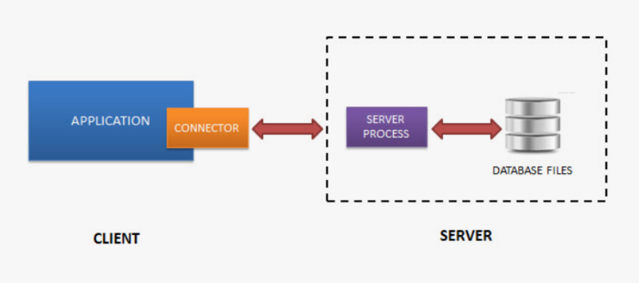

Структура программы
~~~~~~~~~~~~~~~~~~~~~

Python относится к языкам, разделяющим идею структурного
программирования, в основе которой лежит представление программы в виде
иерархической структуры блоков. Блок представляет собой фрагмент текста
программы на языке Python, который выполняется как единое целое.

Любая программа на языке Python состоит из **модулей**. Модуль на языке Python представляет собой ряд связанных между собой операций. Модули сохраняются в отдельных файлах с расширением *.py*. Сохранённые модули можно использовать в создаваемых программах. Сначала мы будем разрабатывать довольно простые программы, которые практически всегда будут состоять всего из одного модуля.

Модули, в свою очередь, состоят из более простых структурных единиц. В модулях содержится код на языке Python, состоящий из **инструкций**.  Инструкции представляют собой указания компьютеру. Они определяют, какие операции выполнит компьютер с данными. Инструкции в языке Python делятся на простые и составные. Простые инструкции описываются одной строкой кода, составные же – содержат вложенные инструкции.

Инструкции могут содержать **выражения**. И если инструкции определяют, какие действия будут выполнены над информацией, то выражения в составе инструкций определяют, над какими именно данными будут выполнены действия, описанные в инструкции.

**Операциями** в языках программирования называются любые действия над **операндами**. **Операндами** называются некоторые данные. Ими могут быть могут быть литералы, выражения и переменные 

Общие принципы написания кода на Python
~~~~~~~~~~~~~~~~~~~~~~~~~~~~~~~~~~~~~~~~

Python Enhancement Proposals
"""""""""""""""""""""""""""""""

PEP 8 – Style Guide for Python Code
------------------------------------

PEP8 — руководство по стилю для кода на Python

Основные правила PEP8 — это набор рекомендаций по оформлению кода на Python, который помогает сделать код более читаемым и понятным.

**Отступы**

Использовать 4 пробела для каждого уровня отступа. Помогает визуально выделить блоки кода и упрощает чтение кода. Использование символов табуляции или пробелов для отступов не рекомендуется, так как это может вызывать проблемы с отображением в разных текстовых редакторах.

**Максимальная длина строки**

Дину строки не должна превышать 79 символами. Если строка длиннее, необходимо разбивать ее на несколько строк. Длинные строки могут быть трудны для чтения, особенно когда они выходят за границы окна редактора. Испльзовать "\" для разделения:

::

        # Правильно:
        long_string = "This is a really long string that "\
            "spans multiple lines."

        # Неправильно:
        long_string = "This is a really long string that spans multiple lines."

**Пробелы**

Используйте один пробел между операторами и операндами. Не используйте пробелы для выделения скобок вокруг аргументов функций. Это правило помогает упростить код и сделать его более читабельным.

Использовать пустые строки для разделения логически связанных частей кода. Не использовать несколько операторов на одной строке.

Использовать пробелы вокруг операторов (=, +, -, /, //, %, и т. д.), но не использовать пробелы вокруг символа индексирования или среза.

        Например:

        # Правильно:
        x = 2 + 3
        y = (1 + 2) * 3
        
        # Неправильно:
        x=2+3
        y = ( 1 + 2 ) * 3

**Комментарии**

Добавляйте комментарии к вашему коду, чтобы объяснить сложные участки кода.

Комментарии должны быть короткими, лаконичными и описательными, они должны помогать другим программистам понимать ваш код. Не использовать комментарии для описания очевидных вещей, таких как присваивание переменной значения, и избегать комментариев в конце строки.

Например:

::

        # Правильно:
        # Получаем текущую дату и время
        current_time = datetime.datetime.now()
        
        # Неправильно:
        current_time = datetime.datetime.now()  # Получаем текущую дату и время

**Имена переменных**
Имена переменных должны быть snake_case (стиль написания, при котором все слова пишутся в нижнем регистре и разделяются нижним подчеркиванием) (first_name).

Необходимо использовать длинные описательные имена, которые легко читаются. Очень важно, чтобы имена были простыми и описательными и могли быть поняты сами по себе. Это избавит от необходимости писать комментарии:

::

        # Неправильно 
        # The au variable is the number of active users
        au = 105

        # Правильно
        total_active_users = 105

Zen of Python 
"""""""""""""""

Одним из важных вкладов в развитие Python стал свод правил Дзен Питон или как его еще называют PEP20 от Тима Петерсона.

PEP20

19 правил по улучшению языка Питон от Тима Петерса, выглядят следующим образом на русском языке:

- Красивое лучше уродливого.
- Явное лучше неявного.
- Простое лучше сложного.
- Сложное лучше запутанного.
- Развернутое лучше вложенного.
- Разреженное лучше плотного.
- Читаемость имеет значение.
- Особые случаи не настолько особые, чтобы нарушать правила.
- При этом практичность важнее безупречности.
- Ошибки не должны замалчиваться.
- Если не замалчиваются явно.
- Встретив двусмысленность, отбрось искушение угадать.
- Должен существовать один - и, желательно, только один – очевидный способ сделать что-то.
- Хотя этот способ поначалу может быть и не очевиден, если вы не голландец.
- Сейчас лучше, чем никогда.
- Хотя никогда часто лучше, чем "прямо" сейчас.
- Если реализацию сложно объяснить – идея точно плоха.
- Если реализацию легко объяснить – возможно, идея хороша.
- Пространства имен – отличная штука! Будем использовать их чаще!

Сегодня этот свод правил такой же востребованный, как два десятка лет назад. Благодаря этому код, написанный с учетом PEP20, легко читаем для любого программиста. Это особенно актуально при реализации больших масштабных проектов, над созданием кода которых трудится целая группа программистов. Также читабельность кода важна при последующем сопровождении программного продукта – исправлении багов, выпуске обновлений.
