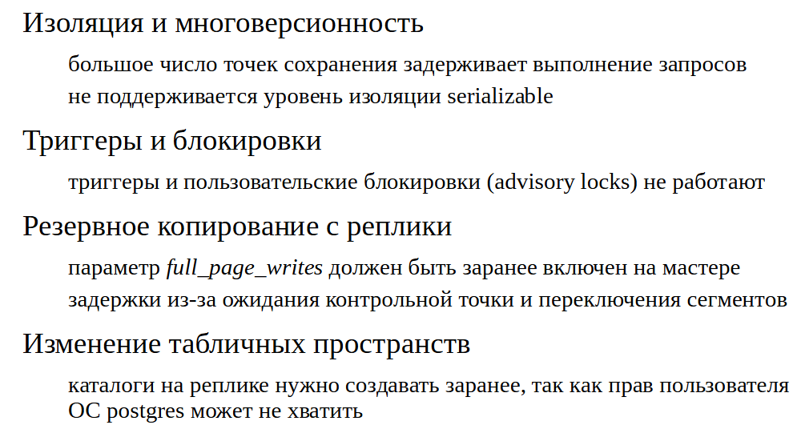
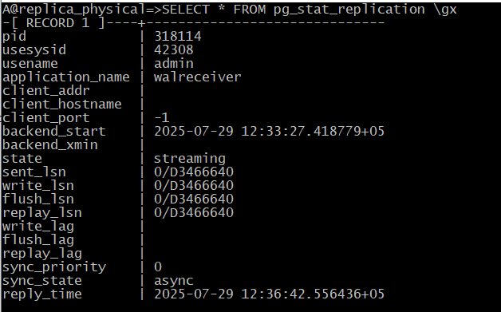

Физическая репликация
#####################

.. note:: Репликация PostgreSQL — это метод копирования данных с одного сервера базы данных на другой сервер в режиме реального времени. 
          Этот процесс обеспечивает безопасность и доступность данных, помогает поддерживать бесперебойную работу системы даже во время сбоев сервера. 
		  
		  Некоторые цели использования репликации:
		  
		  Повышение отказоустойчивости. Если один из серверов выйдет из строя, то остальные продолжат работу.
		  
		  Повышение производительности. Распределение данных по серверам в разных частях страны или мира повышает скорость доступа к данным для местных пользователей.

	   
Не смотря на то, что работать на одном сервере удобнее, одиночный сервер, управляющий базами данных, может не удовлетворять требованиям, предъявляемым к системе. 
Есть две основных задачи, для решения которых требуется наличие нескольких серверов.

- отказоустойчивость: один физический сервер — это возможная точка отказа. Если сервер выходит из строя, система становится недоступной.

- производительность (масштабируемость). Один сервер может не справлятьсяс нагрузкой. Зачастую желательна возможность не вертикального, а горизонтального 
масштабирования — распределения нагрузки на несколько серверов. Дело может быть как в стоимости аппаратуры, так и в необходимости различных настроек для 
разных типов нагрузки (например, для OLTP и отчетности).

В случае PostgreSQL распределенные системы строятся по принципу «shared nothing»: несколько серверов работают независимо друг от друга и не имеют ни 
общей оперативной памяти, ни общих дисков. Следовательно, если серверы должны работать с одними и теми же  данными, то эти данные требуется 
синхронизировать между ними. 

Механизм синхронизации и называется репликацией.

Мастер и реплика
****************

.. figure:: img/fizrepl_02.png
       :scale: 100 %
       :align: center
       :alt: asda

При физической репликации серверы имеют назначенные роли: один является **ведущим** («мастер») и один или несколько серверов являются **ведомыми** («реплики»).

Мастер передает на реплику журнальные записи, а реплика тут же применяет эти записи к своим файлам данных. 
Применение происходит чисто механически, без «понимания смысла» изменений, и выполняется быстрее, чем работало бы повторное выполнение операторов SQL.
Таким образом появляется точная копия основного сервера, но с некоторым запозданием.

Но при этом критична двоичная совместимость между серверами — они должны работать на одной и той же программно-аппаратной платформе и на них должны 
быть запущены одинаковые основные версии PostgreSQL. Потому что журнальные файлы — это некая информация, которая позволяет повторить операцию, 
но физически это просто какие-то фрагменты страниц. А страницы зависят от архитектуры (может зависеть порядка байт в числе, может зависеть от разрядности 
и от других факторов) Поэтому реплика и мастер должны работать на одном и том же железе, с одной и той же системой, с одной и той же основной версии Postgres.

Поскольку журнал является общим для всего кластера, то и реплицировать можно только кластер целиком, а не отдельные базы данных или таблицы. 
Возможность «отфильтровать» журнальные записи по базам данных отсутствует. Поток этот идет всегда в одну сторону от мастера к реплике, весь журнал WAL. 

Реплика не может генерировать собственных журнальных записей, она лишь применяет записи мастера. 

Поэтому при таком подходе реплика может быть доступна только для чтения — никакие операции, изменяющие данные, на реплике не допустимы.

Потоковая репликация
********************

.. figure:: img/fizrepl_03.png
       :scale: 100 %
       :align: center
       :alt: asda

Обычно на практике, применяется потоковая репликация. То есть основной сервер с резервным общаются по потоку репликаций, точно так же как , 
утилита pg_basebackup, подключается к основному серверу и вытягивает из него журнальные записи. Так происходит и в данном случае. 

Реплика запускает у себя процесс, который называется wal-reciver. Этот процесс подключается по протоколу репликации к основному серверу, 
а основной сервер запускает процесс wal-sender, который поставляет wal-reciver журнальные записи. 

Кроме этого, на реплике *постоянно работает* процесс **startup**. Он что восстанавливает согласованность, когда сервер запускается после сбоя.
В случае репликации этот процесс запущен и он все время работает. 

**Wal-reciver** получает журнальные записи, а **startup** эти записи проигрывает, и таким образом реплика догоняет мастер. 

Также используется слот репликации (на рис. кружок). Слот репликации здесь используется для того, чтобы мастер знал о том, 
что к нему осуществлено подключение и нельзя  преждевременно удалять те журнальные файлы, которые реплике не передавались.

Практика
========

**Настройка потоковой репликации**

Поскольку в конфигурации не будет архива журнала предзаписи, важно на всех этапах использовать слот репликации — 
иначе при определенной задержке мастер может успеть удалить необходимые сегменты и весь процесс придется повторять с самого начала.

Создание слота:

::

	A@postgres=#SELECT pg_create_physical_replication_slot('replica');

Проверка созданного слота:

::

	A@postgres=#SELECT * FROM pg_replication_slots \gx
	

Вначале слот не инициализирован (**restart_lsn** и **wal_status** пустые).

Все необходимые настройки есть по умолчанию:

wal_level = replica;

max_wal_senders;

разрешение на подключение в pg_hba.conf.

Создание автономной резервной копии с использованием созданного слота. 
Копию расположим в подготовленном каталоге. С ключом -R утилита создает файлы, необходимые для будущей реплики.

::

	[admin@PG ~]$ pg_basebackup --pgdata=/home/admin/backup -R --slot=replica

Снова проверим слот:

::

	A@postgres=#SELECT * FROM pg_replication_slots \gx

.. figure:: img/fizrepl_06.png
       :scale: 100 %
       :align: center
       :alt: asda
	   
	-[ RECORD 1 ]-------+----------
	slot_name           | replica
	plugin              | 
	slot_type           | physical
	datoid              | 
	database            | 
	temporary           | f
	active              | f
	active_pid          | 
	xmin                | 
	catalog_xmin        | 
	restart_lsn         | 0/4000000
	confirmed_flush_lsn | 
	wal_status          | reserved
	safe_wal_size       | 

После выполнения резервной копии слот инициализировался, и мастер теперь хранит все файлы журнала с начала копирования 
(restart_lsn, wal_status).

Примерно то же самое хранится в **backup_label**:

::

	[admin@PG ~]$ head -n 1 /home/admin/backup/backup_label

.. figure:: img/fizrepl_07.png
       :scale: 100 %
       :align: center
       :alt: asda

Файл **postgresql.auto.conf** был подготовлен утилитой **pg_basebackup**, поскольку мы указали ключ **-R**. 
Он содержит информацию для подключения к мастеру (**primary_conninfo**) и имя слота репликации (**primary_slot_name**):

::

	[admin@PG ~]$ cat /home/admin/backup/postgresql.auto.conf

# Do not edit this file manually!
# It will be overwritten by the ALTER SYSTEM command.
primary_conninfo = 'user=student passfile=''/home/student/.pgpass'' channel_binding=prefer host=''/var/run/postgresql'' port=5432 sslmode=prefer sslcompression=0 sslsni=1 ssl_min_protocol_version=TLSv1.2 gssencmode=prefer krbsrvname=postgres target_session_attrs=any'
primary_slot_name = 'replica'

По умолчанию реплика будет «горячей», то есть сможет выполнять запросы во время восстановления. Если такая возможность не нужна, реплику можно сделать «теплой» (hot_standby = off).

Утилита также создала сигнальный файл **standby.signal**, наличие которого указывает серверу войти в режим постоянного восстановления.

::

	[admindb@PG ~]$ ls -l /home/admin/backup/standby.signal

Выкладываем резервную копию в каталог данных сервера beta.

::

	[admindb@PG ~]$ sudo -u postgres rm -fr /var/lib/pgsql/data1
	[admindb@PG ~]$ sudo mv /home/admin/backup /var/lib/pgsql/data1
	[admindb@PG ~]$ sudo chown -R postgres:postgres /var/lib/pgsql/data1
	
Поменять порт для запуска второго сервера

::

	[admindb@PG ~]$ sudo sed -i 's/#port = 5432/port = 5433/g' /var/lib/pgsql/data1/postgresql.conf

Журнальные записи, необходимые для восстановления согласованности, реплика получит от мастера по протоколу репликации. 
Далее она войдет в режим непрерывного восстановления и продолжит получать и проигрывать поток записей.

::

	[admindb@PG ~]$ sudo -u postgres pg_ctl -D /var/lib/pgsql/data1 start

Репликация и архивация
**********************

.. figure:: img/fizrepl_08.png
       :scale: 100 %
       :align: center
       :alt: asda
	   
Другой способ доставки журнальных записей состоит в том, чтобы предоставить реплике доступ к архиву журналов — точно так же, 
как при обычном восстановлении из архива. запустится процесс **archiver** который будет копировать WAL архив, 
реплика сможет из этого архива файлы забирать.

Если реплика по каким-то причинам не сможет получить очередную журнальную запись по протоколу репликации 
(например, из-за обрыва связи), она попробует прочитать ее из архива с помощью команды, заданной в параметре **restore_command**. 

Переключение произойдет автоматически, и когда реплика из архива все файлы заберет она будет пробовать переключиться обратно на 
потоковую репликацию, чтобы забирать файлы быстрее по потоку. При восстановлении связи реплика снова автоматически переключится на использование потоковой репликации.

В принципе, репликация может работать и с одним только архивом, без потоковой репликации. Но в этом случае:

- реплика вынужденно отстает от мастера на время заполнения сегмента;

- мастер ничего не знает о существовании реплики, что в некоторых случаях может привести к проблемам.

Также архив позволяет обойтись без слота репликации, потому что слот это всегда необходимость мониторинга. 
При использовании слота на основном сервере могут переполнится диски журнальными файлами. 

Очистка архива
**************

Если архив используется только для синхронизации одной реплики, можно настроить его автоматическую очистку, 
для этого в параметре **archive_cleanup_command** задается команда, которая будет выполняться по окончании каждой 
точки рестарта подобно тому, как после каждой контрольной точки удаляются файлы журнала. 

В команде удобно вызывать утилиту **pg_archivecleanup**: 

::

	archive_cleanup_command = 'pg_archivecleanup /path/to/archive %r'

1. Когда проходит определенное время, либо накапливается определенное количество журнальных файлов, выполняется контрольная точка. 
Она позволяет удалить те журнальные файлы, которые уже не нужны для восстановления. 

2. Запись о контрольной точке приходит по протоколу репликации к реплике, и реплика в этот момент выполняет точку рестарта. 
Она удаляет у себя лишние файлы, которые ей уже не потребуются для того, чтобы можно было продолжить восстановление, 
если вдруг что-то случится. На реплике в процессе восстановления может произойти какой-то сбой и начинать восстановление необходимо будет 
не с самого начала, а с какой-то точки. Это точка рестарта.

3. При достижении точки рестарта **checkpointer** будет вызывать эту команду, которая будет прописана в параметр, 
и она из архива тоже будет удалять файлы, которые не нужны. Таким образом  размер архива можно ограничить, если он нужен только для
поддержки реплики. 

https://postgrespro.ru/docs/postgresql/13/runtime-config-wal#RUNTIME-CONFIG-WAL-ARCHIVE-RECOVERY

https://postgrespro.ru/docs/postgresql/13/pgarchivecleanup

Процессы на мастере и реплике
*****************************

На мастере и на реплике выполняется разный набор процессов. 
Кроме уже рассмотренных **wal sender** (на мастере) и **wal receiver** и **startup**(на реплике), работают также другие процессы.

Общие процессы:

- **background writer** — записывает грязные страницы из буферного кеша на диск (на реплике, для того, чтобы применить журнальную запись, 
страницы точно так же читаются в буферный кеш и затем записываются в фоновом режиме или при вытеснении).

- **stats collector** — статистика не передается в журнале, а собирается на реплике отдельно.

- **checkpointer** — на реплике при получении журнальной записи о контрольной точке выполняется похожая процедура — точка рестарта. 
Если в процессе восстановления случится сбой, реплика сможет продолжить с последней точки рестарта, а не с самого начала.

Процессы только на мастере:

- **wal writer** — реплика не создает журналы упреждающей записи, а только получает их с мастера.

- **autovacuum launcher/worker** — реплика не выполняет очистку, ее выполнение на мастере передается реплике через журнал.

Есть также процесс, наличие которого зависит от настройки:

- **archiver** — при значении **archive_mode = on** выполняется только на мастере, а при **archive_mode = always** также и на реплике.
С этим режимом надо быть аккуратным, потому что если два этих процесса будут писать одни и те же журнальные файлы в один и тот же архив, 
то могут затереть данные друг друга.

Практика
========

Процессы реплики
Посмотрим на процессы реплики.

::

	[admindb@PG ~]$ ps -o pid,command --ppid `sudo head -n 1 /var/lib/pgsql/data1/postmaster.pid`
	

Процесс **walreceiver** принимает поток журнальных записей, процесс **startup** применяет изменения.

Процессы walwriter и autovacuum launcher** отсутствуют.
**autovacuum** только на мастере, а все изменения, которые он делает приходят в журнальных записях на реплику.

И сравним с процессами мастера.

::

	[admin@PG ~]$ ps -o pid,command --ppid `sudo head -n 1 /var/lib/pgsql/data/postmaster.pid`

	   
Здесь добавился процесс walsender, обслуживающий подключение по протоколу репликации.

Использование реплики
*********************

**На реплике не допускается любое изменение данных.**

А именно не допускаются:

- изменения таблиц, материализованных представлений, последовательностей;

- блокировки (так как для этого требуется изменение страниц данных);

- команды DDL, включая создание временных таблиц;

- такие команды, как vacuum и analyze;

- команды управления доступом (GRANT, REVOKE)

- создавать временные таблицы на реплике.

При этом реплика может выполнять запросы на чтение данных, если установлен параметр **hot_standby = on**. 
Также будет работать установка параметров сервера (SET, RESET), COPY и команды управления транзакциями — например, можно начать (читающую) 
транзакцию с нужным уровнем изоляции (Repeatable Read).

Кроме того, реплику можно использовать и для изготовления резервных копий.

Практика
========

**Использование реплики**

На мастере:

::

	A@postgres=#CREATE DATABASE replica_physical;
	
	CREATE DATABASE

::

	A@postgres=#\c replica_physical

	You are now connected to database "replica_physical" as user "postgres".

::
	
	A@replica_physical=#CREATE TABLE test(s text);
	
	CREATE TABLE

::

	A@replica_physical=#INSERT INTO test VALUES ('Привет, мир!');
	
	INSERT 0 1

На реплике:

::

	[admindb@PG ~] psql -U postgres -p 5433 
	
::

	B@postgres=#\c replica_physical

	You are now connected to database "replica_physical" as user "postgres".

::

	B@c=#SELECT * FROM test;

		  s       
	--------------
	 Привет, мир!
	(1 row)

При этом изменения на реплике не допускаются:

::

	B@replica_physical=#INSERT INTO test VALUES ('Replica');

	ERROR:  cannot execute INSERT in a read-only transaction

Реплику от мастера можно отличить с помощью функции  **pg_is_in_recovery();**:

::

	B@replica_physical=#SELECT pg_is_in_recovery();

	 pg_is_in_recovery 
	-------------------
	 t
	(1 row)
	
Ограничения
***********

У репликации есть ряд ограничений и особенностей.

Если на мастере выполняется транзакция с числом вложенных транзакций > 64 (то есть активно используются точки сохранения), 
создание снимка на реплике будет приостановлено — это означает невозможность некоторое время выполнять запросы.

Не поддерживается уровень изоляции **serializable** на реплике (только read committed и repeatable read).

Триггеры не будут срабатывать на реплике (они выполнились на мастере и реплицируется уже результат их работы). 
Не будут работать и рекомендательные (**advisory**) блокировки.

При выполнении резервного копирования с реплики нет технической возможности полноценно управлять мастером, в частности, 
вызывать контрольные точки и включать параметр **full_page_writes**. Поэтому параметр нужно включить на мастере заранее (обычно он включен), 
а контрольную точку приходится ждать (что может существенно задержать процесс).

Создание табличных пространств реплицируется, но, если у пользователя ОС, под которым работает СУБД, недостаточно прав для создания каталога, произойдет ошибка. 
Лучше всего сначала создать каталоги на мастере и на всех репликах, а уже затем выполнять команду **CREATE TABLESPACE**.

Мониторинг
**********

В ходе репликации возможны проблемы, о которых должен предупредить заранее настроенный мониторинг. 
Основной информацией являются позиции в журнале предзаписи. Можно выделить четыре важные точки:

1. появление журнальной записи на мастере;

2. трансляция записи процессом walsender;

3. получение записи процессом walreceiver;

4. применение полученной записи процессом startup.

Между всеми этими пунктами возможны какие-то задержки. Если задерживается журнальная запись от первого пункта до второго, это значит что мастер чем-то сильно 
занят и *walsender* не может сразу подхватить журнальную запись, ему нужно какое-то время на это. Это, скорее всего, сильно нагруженный мастер. 

Разница между walsender и walreceiver говорит о том, что сеть недостаточно быстрая и данные передаются от walsender к walreceiver продолжительное время. 

Также возможна задержка воспроизведения данных на реплике. Она может быть обусловлена тем, что реплика сильно нагружена и просто не успевает, 
а возможно откладывание применения журнальных записей. 

Все эти точки обычно отслеживаются *на мастере*. Первую точку дает функция **pg_current_wal_lsn()**, остальные — представление **pg_stat_replication**. 
Реплика передает мастеру статус репликации при каждой записи на диск, но как минимум раз в **wal_receiver_status_interval** секунд (по умолчанию — 10 секунд).

Если используется слот репликации, то информацию о нем можно получить из представления **pg_replication_slots**.

Данные о ходе репликации можно получить и на реплике в представлении **pg_stat_wal_receiver** и с помощью функций 
**pg_last_wal_receive_lsn()** и **pg_last_wal_replay_lsn()**.

ПОля:

- **sent lsn** - lsn который был послан. РАзница между pg_current_wal_lsn и sent lsn сигнализирует о задержке между возникновением lsn и его отправкой на реплику.

- write LSN и flush LSN - write LSN журнальные записи получены и операционной системе дано указание на запись на диск, а FlashLSN говорит о том, 
что эти записи действительно дошли до диска. 

Практика
========

**Мониторинг репликации**

Состояние репликации можно смотреть в специальном представлении на мастере. 
Чтобы пользователь получил доступ к этой информации, ему должна быть выдана роль **pg_read_all_stats** (или он должен быть **суперпользователем**).

Выдать предопределенную роль **pg_read_all_stats** для alice:

::

	psql -U postgres -d replica_physical
	
::

	GRANT pg_read_all_stats TO alice;
	GRANT SELECT, UPDATE, INSERT ON test TO alice;
	
::

	[admin@PG ~]$ psql -U alice -d replica_physical

::

	A@replica_physical=> \du alice

::

	A@replica_physical=>SELECT * FROM pg_stat_replication \gx
   
	-[ RECORD 1 ]----+------------------------------
	pid              | 10440
	usesysid         | 16384
	usename          | student
	application_name | 13/beta
	client_addr      | 
	client_hostname  | 
	client_port      | -1
	backend_start    | 2024-01-16 12:17:17.774325+03
	backend_xmin     | 
	state            | streaming
	sent_lsn         | 0/501BFC0
	write_lsn        | 0/501BFC0
	flush_lsn        | 0/501BFC0
	replay_lsn       | 0/501BFC0
	write_lag        | 00:00:00.000123
	flush_lag        | 00:00:00.004935
	replay_lag       | 00:00:00.004976
	sync_priority    | 0
	sync_state       | async
	reply_time       | 2024-01-16 12:17:24.807756+03

	   
Обратите внимание на поля *_lsn (и *_lag) — они показывают отставание реплики на разных этапах. 
Сейчас все позиции совпадают, отставание нулевое, так как активности не было.

Теперь вставим в таблицу большое количество строк, чтобы увидеть репликацию в процессе работы.

::

	A@replica_physical=>INSERT INTO test SELECT 'Just a line' FROM generate_series(1,1000000);
INSERT 0 1000000

::

	A@replica_physical=> SELECT *, pg_current_wal_lsn() from pg_stat_replication \gx

	-[ RECORD 1 ]------+------------------------------
	pid                | 10440
	usesysid           | 16384
	usename            | student
	application_name   | 13/beta
	client_addr        | 
	client_hostname    | 
	client_port        | -1
	backend_start      | 2024-01-16 12:17:17.774325+03
	backend_xmin       | 
	state              | streaming
	sent_lsn           | 0/697A000
	write_lsn          | 0/691A000
	flush_lsn          | 0/68FA000
	replay_lsn         | 0/68B9FF8
	write_lag          | 00:00:02.241692
	flush_lag          | 00:00:02.247271
	replay_lag         | 00:00:02.258431
	sync_priority      | 0
	sync_state         | async
	reply_time         | 2024-01-16 12:17:27.97807+03
	pg_current_wal_lsn | 0/94F9C90
	

Видно, что возникла небольшая задержка. Однако не следует рассчитывать на точность выше чем полсекунды, 
так как статистика обновляется примерно с такой частотой.

Проверим реплику:

::

	| B@postgres=#\c replica_physical
	| B@postgres=#SELECT count(*) FROM test;
	

Все строки успешно доставлены.

И еще раз проверим состояние репликации:

::

	A@replica_physical=> SELECT *, pg_current_wal_lsn() from pg_stat_replication \gx

Все позиции выровнялись.

Режимы репликации
*****************

Фиксация транзакций может выполняться в двух режимах. 

В более быстром асинхронном режиме есть шанс потерять уже зафиксированные изменения в случае сбоя. В некоторых случаях (финансы, например)
этого допускать категорически нельзя.
В синхронном режиме команда COMMIT не завершается, пока запись не дойдет до диска.

Но даже при синхронной фиксации,  в случае выхода из строя сервера данные будут потеряны.
При наличии нескольких серверов надежность можно еще более увеличить, дожидаясь подтверждения от реплики о 
получении записи, тогда данные не пропадут даже при выходе из строя носителя.

При наличии синхронной реплики команда COMMIT будет не только дожидаться, пока данные попадут на локальный диск, но и отпраку этих данных реплике. 
Реплика эти данные примет и сообщит, что все хорошо и можно продолжать работать с транзакцией дальше. 
Естественно, что в этом случае фиксация будет долгой, потому что нужно дождаться не только обмена с диском, но и обмена по сети.

Синхронная репликация включается тем же параметром **synchronous_commit**, что и синхронная фиксация. 
Разные значения этого параметра позволяют управлять уровнем надежности. 
При значении **off** сервер переходит в асинхронный режим.

**local** - синхронная фиксация и асинхронная репликация. 

**on** - нужна и синхронная фиксация, и синхронная репликация. В этом случае реплика записывает данные на диск, то есть делает flush, 
данные попадают на диск физически, и только после этого она дает сигнал основному серверу, что можно продолжать транзакцию. Это гарантированная надежность.

При значении **remote_write** мастер ожидает подтверждения о получении записи 
(остается шанс потерять изменения, если на реплике случится сбой и она не успеет записать данные на диск).

При значении on мастер ожидает подтверждения о попадании журнальной записи на диск реплики (это надежный режим; однако приложение, обратившись к реплике, 
может не увидеть изменений).

Наконец, значение **remote_apply** заставляет мастер дождаться применения записи на реплике. 
Каждый следующий режим вызывает все большие задержки.

Мастер может синхронизироваться как с одной, так и с несколькими репликами. 
Можно указать список реплик в порядке приоритета или организовать синхронизацию на основе кворума, при которой мастер дожидается подтверждения 
от любых N реплик из числа доступных. Параметр **synchronous_standby_names**

Обычно одной синхронной реплики вполне достаточно в большинстве случаев. 

Возможные проблемы
******************

При репликации возможен ряд сложностей, которые можно решать разными способами.

Сервер PostgreSQL периодически удаляет файлы журнала (при прохождении контрольных точек), которые не требуются для восстановления. 
При этом мастер может удалить файл, который содержит данные, еще не переданные реплике.

Это не проблема, если используется архив журналов предзаписи, поскольку реплика, получив отказ по протоколу репликации, прочитает необходимые ей данные 
из архива, а затем, «догнав» мастер, снова переключится на получение данных из потока.

Но если архива нет, реплика не сможет продолжать восстановление и ее придется пересоздавать из новой резервной копии. 
Чтобы этого избежать, можно использовать слот репликации. Однако надо понимать, что создание слота ставит мастер в зависимость от реплики: 
если реплика не будет получать журнальные записи, они будут накапливаться на мастере и свободное пространство рано или поздно закончится. 
Поэтому слот — еще одна точка, которую необходимо включать в мониторинг.

Практика
=========

**Влияние слота репликации**

Остановим реплику.

::

	[admindb@PG ~]$ sudo -u postgres pg_ctl -D /var/lib/pgsql/data1 stop

Ограничим размер WAL двумя сегментами.

::

	[admin@PG ~] psql -U postgres

::

	A@postgres=# \c - postgres

	You are now connected to database "replica_physical" as user "postgres".

::

	A@postgres=#ALTER SYSTEM SET min_wal_size='32MB';

	ALTER SYSTEM

::

	A@postgres=#ALTER SYSTEM SET max_wal_size='32MB';

	ALTER SYSTEM

::

	A@postgres=#SELECT pg_reload_conf();

	 pg_reload_conf 
	----------------
	 t
	(1 row)

Слот неактивен, но помнит номер последней записи, полученной репликой:

::

	A@postgres=# SELECT active, restart_lsn, wal_status FROM pg_replication_slots \gx

	-[ RECORD 1 ]-----------
	active      | f
	restart_lsn | 0/DA6382A8
	wal_status  | reserved

Вставим еще строки в таблицу.

::

	A@postgres=# INSERT INTO test SELECT 'Just a line' FROM generate_series(1,1000000);
	
	INSERT 0 1000000

Номер LSN в слоте не изменился:

::

	A@postgres=# SELECT active, restart_lsn, wal_status FROM pg_replication_slots \gx

	-[ RECORD 1 ]-----------
	active      | f
	restart_lsn | 0/DA6382A8
	wal_status  | reserved

Выполним контрольную точку, которая должна очистить журнал, поскольку его размер превышает допустимый.

::

	A@postgres=# CHECKPOINT;
	
	CHECKPOINT

Каков теперь размер журнала?

::

	A@postgres=# SELECT pg_size_pretty(sum(size)) FROM pg_ls_waldir();
 
	 pg_size_pretty 
	----------------
	 80 MB
	(1 row)

Контрольная точка не удалила сегменты — их удерживает слот, несмотря на превышение лимита. Если оставить слот без присмотра, дисковое пространство может быть исчерпано.

Скорее всего, бесперебойная работа основного сервера важнее, чем синхронизация реплики. Чтобы предотвратить разрастание журнала, можно ограничить объем, удерживаемый слотом:

::

	A@postgres=# ALTER SYSTEM SET max_slot_wal_keep_size='16MB';
	
	ALTER SYSTEM

::

	A@postgres=# SELECT pg_reload_conf();

	 pg_reload_conf 
	----------------
	 t
	(1 row)

::

	A@postgres=# CHECKPOINT;

	CHECKPOINT

Теперь журнал очищается контрольной точкой:

::

	A@postgres=# SELECT pg_size_pretty(sum(size)) FROM pg_ls_waldir();

	 pg_size_pretty 
	----------------
	 32 MB
	(1 row)

Но слот уже не обеспечивает наличие записей WAL (wal_status=lost):

::

	A@postgres=# SELECT active, restart_lsn, wal_status FROM pg_replication_slots \gx

	-[ RECORD 1 ]-----
	active      | f
	restart_lsn | 
	wal_status  | lost

А реплика не может синхронизироваться:

::

	[admindb@PG ~]$ sudo -u postgres pg_ctl -D /var/lib/pgsql/data1 start
	
::

	[admindb@PG ~]$  sudo -u postgres tail -n 2 /var/lib/pgsql/data1/log/postgresql-2025-07-29_134441.log

Для синхронизации реплики в таких случаях можно воспользоваться архивом, задав параметр **restore_command**. 
Если это невозможно, придется заново настроить репликацию, повторив формирование базовой копии.

Это лучше, чем потерять основной сервер из-за того, что у него просто закончится место на дисках.
 

	   
Вторая проблема возникает, если реплика используется для выполнения запросов. Мастер может выполнить действие, несовместимое с запросом на реплике:

- очистка может удалить версию строки, которая используется запросом, или потребовать блокировку, несовместимую с запросом;

VACUUM удаляет какие-то версии строк, которые не нужны основному серверу. Но если не предпринять специальных действий, то VACUUM ничего не будет знать о том, 
что существует  реплика, и на реплике тоже выполняются какие-то запросы, которым эти версии строк тоже могут быть нужны. 
VACUUM может удалять те версии строк, которые реплика используется. С одной стороны есть запрос, который хочет работать, 
а с другой стороны есть журнальная запись, которая удаляет версию и нужный запрос.

- может прийти запись об эксклюзивной блокировке объекта (например, при удалении таблицы);

Возникновение таких конфликтов можно отслеживать с помощью представления **pg_stat_database_conflicts**.

Конфликты с запросами на реплике, вызванные редкими причинами, такими как взаимоблокировки, удаление базы данных или табличного пространства, 
разрешаются путем немедленной отмены запроса.

Возможные решения конфликтов
****************************

Один из путей борьбы с конфликтами — избегать действий на мастере, приводящих к исключительным блокировкам. 
Например, можно не выполнять команды *DROP TABLE, TRUNCATE, LOCK, DROP INDEX, DROP TRIGGER** и т. п. или выполнять их в то время, 
когда на реплике заведомо нет выполняющихся запросов.

Некоторых неявных блокировок можно избежать, отключая соответствующую функциональность на мастере. Например, если в результате очистки освободились 
страницы в конце файла, при уменьшении его размера устанавливается исключительная блокировка таблицы. 
Но можно отменить усечение файла, задав параметр хранения таблицы **vacuum_truncate = off**. Однако отменять или надолго откладывать очистку нельзя, 
поэтому избежать конфликта в случае очистки нужных запросу версий строк таким образом не получится.

Другой способ — не избегать конфликтов, а откладывать применение полученных несовместимых журнальных записей на реплике. Этот способ работает и при потоковой репликации, 
и при использовании архива; он откладывает записи, относящие и к очистке, и к эксклюзивным блокировкам. 
В параметрах устанавливается максимальная задержка применения (от времени получения записи). 
Если к этому моменту конфликтующий запрос не успеет завершиться, он будет прерван. 

Параметры:

max_standby_streaming_delay

max_standby_archive_delay

	   
Еще один путь решения — откладывать несовместимые действия на мастере. Для этого включается обратная связь.

Этот способ работает только для очистки (эксклюзивную блокировку отложить не получится) и только в случае потоковой репликации 
(если реплика переключается на получение записей из архива, она фактически перестает существовать для мастера).

Каждый снимок данных содержит так называемый горизонт событий — это значение счетчика транзакций, по которому проходит граница между ненужными и 
нужными версиями строк. Минимальный горизонт по всем снимкам реплики определяет возможность очистки. 
Благодаря обратной связи, мастер понимает, какие версии строк нужны реплике. В таком случае (с точки зрения очистки) запрос на реплике ничем не 
отличается от запроса на самом мастере.

Обратная связь позволяет мониторить горизонт событий на стороне мастера. Если слот репликации не используется, горизонт виден в поле 
**pg_stat_replication.backend_xmin**, а при использовании слота — **в pg_replication_slots.xmin**. Нужно учитывать, что при включенной обратной связи слот,
даже неактивный, будет задерживать очистку, что может привести к увеличению размеров файлов данных.

Практика
********

1. Настройте физическую потоковую репликациюмежду двумя серверами в синхронном режиме,без обратной связи.

2. Проверьте работу репликации. Убедитесь, что при остановленной реплике фиксация не завершается.

3. Воспроизведите ситуацию, при которой запрос на реплике  прерывается из-за очистки версий строк на мастере.

4. Запретите откладывать применение конфликтующих изменений; проверьте, что запрос отменяется сразу.

5. Включите обратную связь и убедитесь, что очистка на мастере не прерывает выполнение запроса.

6. Остановите реплику и убедитесь, что слот препятствует очистке. Удалите слот, чтобы очистка возобновилась

Комментарии:
============

1. Для этого на мастере установите параметры:

- **synchronous_commit = on**,

- **synchronous_standby_names = 'beta'**,

а на реплике - **cluster_name = beta**.

3. Для этого на реплике можно начать транзакцию с уровнем изоляции repeatable read и периодически выполнять запросы к таблице, 
а на мастере изменить эту таблицу и выполнить очистку.

Учтите, что параметр **max_standby_streaming_delay** по умолчанию имеет значение 30 секунд.

4. Установите параметр **max_standby_streaming_delay** в ноль.

5. Установите на реплике параметр **hot_standby_feedback = on**. 

Максимальный интервал оповещений устанавливается в параметре wal_receiver_status_interval (по умолчанию 10 секунд).

6. Не забудьте отменить **synchronous_commit**, иначе при остановленной реплике не удастся зафиксировать транзакцию.