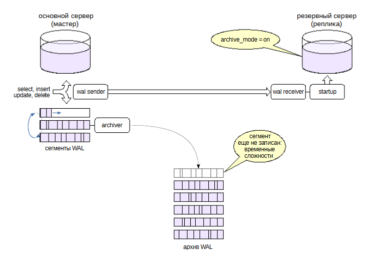
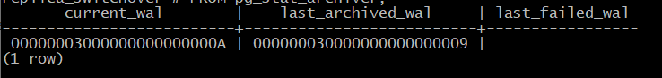

Переключение на реплику
#######################

.. figure:: img/switch_01.png
       :scale: 100 %
       :align: center
       :alt: asda

Причиной перехода на резервный сервер может быть:

- необходимость проведения технических работ на основном сервере — тогда переход выполняется в удобное время в 
штатном режиме (switchover). 

- сбой основного сервера, и в таком случае переходить на резервный сервер нужно как можно быстрее, чтобы сократить время простоя системы (failover).

В любом случае сначала нужно убедиться, что мастер остановлен. Это очень важно, иначе данные на разных серверах «разойдутся».
Если возникнет ситуация, что на мастере, который выбыл из строя, продолжается работа, и туда какие-то запросы поступают, появляется информация, 
и на реплике, которая стала новым мастером, тоже появляются данные, то свести их потом воедино — нетривиальная и неавтоматизируемая задача. 
Скорее всего, часть данных придется просто потерять.

Затем выполняется переход на реплику в ручном режиме. Автоматизация этого процесса возможна, но требует стороннего кластерного программного обеспечения. 

Переключение состоит в разрыве цикла восстановления. Для этого реплике посылается команда **promote**: 

либо командой **pg_ctl promote**, 

либо вызовом функции **pg_promote** из SQL. 

Другой вариант — задать имя файла в параметре **promote_trigger_file**. При появлении в системе файла с таким именем восстановление прерывается.

Еще один вариант: удалить файл **standby.signal** и перезапустить резервный сервер. Это не вполне «честный» способ, поскольку в этом случае реплика не поймет, 
что восстановление завершено, и не перейдет на новую линию времени. 

Необходимые действия
=====================

	   
Получив сигнал, сервер завершает восстановление и переходитв обычный режим работы.

Для этого он применяет уже полученные журнальные записи, которые еще не были применены.

Процессы **walreceiver и startup** завершают свою работу — на основном сервере они не нужны. 
А вот процессы **wal writer** и **autovacuum launcher**, наоборот, запускаются.

Кроме того, сервер переходит на новую линию времени.

С точностью до некоторых деталей, все происходит так же, как при окончании восстановления из резервной копии.
	   
Практика
-------

**Настройка потоковой репликации**

Настроить реплику так же, как делали ранее. А после нужно выполнить переход на нее.

Создаем автономную резервную копию, попросив утилиту создать слот и необходимые файлы (postgresql.auto.conf с настройками и standby.signal).

::

	[admin@PG ~]$ pg_basebackup --pgdata=/home/admin/backup -R --slot=replica

Выкладываем копию в каталог PGDATA сервера B:

::

	[admindb@PG ~]$ sudo -u postgres rm -fr /var/lib/pgsql/data1
	[admindb@PG ~]$ sudo mv /home/admin/backup /var/lib/pgsql/data1
	[admindb@PG ~]$ sudo chown -R postgres:postgres /var/lib/pgsql/data1
	

::

	[admindb@PG ~]$ sudo sed -i 's/#port = 5432/port = 5433/g' /var/lib/pgsql/data1/postgresql.conf

	Запускаем реплику:	

::

	[admindb@PG ~]$ sudo -u postgres pg_ctl -D /var/lib/pgsql/data1 start

Проверим настроенную репликацию. Выполним несколько команд на мастере:

::

	A@postgres=#CREATE DATABASE replica_switchover;

	CREATE DATABASE

::

	A@postgres=#\c replica_switchover
	
	You are now connected to database "replica_switchover" as user "postgres".

::

	A@replica_switchover=#CREATE TABLE test(s text);

	CREATE TABLE

::

	A@replica_switchover=#INSERT INTO test VALUES ('Переключение на реплику!');

	INSERT 0 1
	
Проверим реплику:

::

	[admindb@PG ~]$ psql -U postgres -p 5433

::

	| B@postgres=#\c replica_switchover

	| B@replica_switchover=#SELECT * FROM test;

	s
	--------------------------
	 Переключение на реплику!
	(1 row)

**Переход на реплику**

Сейчас сервер B является репликой (находится в режиме восстановления):

::

	B@replica_switchover=#SELECT pg_is_in_recovery();

	 pg_is_in_recovery 
	-------------------
	 t
	(1 row)

Повышаем реплику. В версии 13 появилась функция pg_promote(), которая выполняет то же действие.

::

	sudo -u postgres pg_ctl -D /var/lib/pgsql/data1 promote

Теперь бывшая реплика стала полноценным экземпляром.

::
	
	B@replica_switchover=#SELECT pg_is_in_recovery();

	 pg_is_in_recovery 
	-------------------
	 f
	(1 row)

Мы можем изменять данные:

::

	B@replica_switchover=#INSERT INTO test VALUES ('Реплика стала мастером');
	
	INSERT 0 1
	
Восстановение сервера
*********************

.. figure:: img/switch_03.png
       :scale: 100 %
       :align: center
       :alt: asda
	   
Если переход на реплику не был вызван выходом сервера из строя,то нужен способ быстро вернуть старый мастер в строй — 
теперь ужев качестве реплики (failback).

Возможно несколько вариантов.

Простое подключение
===================

	   
В случае аккуратной остановки мастера (останов в режимах **fast** или **smart**) все журнальные записи мастера скорее всего 
дойдут до реплики, хотя это и не гарантируется. Процесс останова организован таким образом, 
что сначала отключаются все обслуживающие процессы, затем выполняется контрольная точка, и только в самую последнюю 
очередь останавливается процесс **wal sender**, чтобы реплика успела получить запись WAL о контрольной точке.

Позицию в журнале мастера можно проверить с помощью утилиты **pg_controldata** («Latest checkpoint location»), 
а позицию на реплике покажет функция **pg_last_wal_receive_lsn()**. Поскольку функция **pg_last_wal_receive_lsn()** 
показывает следующую позицию, то ее значение должно опережать **latest_checkpoint_location** на длину записи 
(120 байт в PostgreSQL 13). Если это так, то бывший мастер можно непосредственно подключить к новому, 
изменив соответствующим образом конфигурационные параметры.

В случае останова мастера без выполнения контрольной точки (сбой или режим **immediate**), 
такое подключение в принципе невозможно: сервер не стартует, а в журнале сообщений будет зафиксирована ошибка.

Резервная копия
===============

.. figure:: img/switch_05.png
       :scale: 100 %
       :align: center
       :alt: asda

Если мастер был остановлен аварийно, велика вероятность того, что часть журнальных записей не успела дойти до реплики. 
В этом случае просто так подключать мастер нельзя.

Простой и надежный вариант — создать абсолютно новую реплику путем изготовления и развертывания базовой резервной копии. 
То есть создается копия реплики (новый мастер) через pg_basebackup и подключается уже абсолютно новый сервер 
к абсолютно новой копии к бывшей реплике (новый мастер) в качестве реплики.
Однако для больших баз данных этот процесс может занимать много времени.

Вариант такого подхода — не использовать утилиту **pg_basebackup**,а сделать копию с помощью **API резервирования** с
использованием утилиты **rsync**. Если выполнять копирование сразу после переходана реплику, то большая часть файлов не 
должна успеть поменяться и процесс может пройти существенно быстрее. Но это усложняет процесс.

Утилита pg_rewind
=================

	   
Еще более быстрый вариант состоит в использовании штатной утилиты **pg_rewind**.

**pg_rewind** нужно передать в параметрах информацию о том, что является бывшим мастером (бывшим основным сервером). 
Это так называемый *целевой сервер*, а также передать информацию о том, что является *серверным источником*.

Утилита определяет место расхождения между двумя серверами, определяет ближайшую к нему общую контрольную точку, и, 
просматривая журнал, определяет все страницы, измененныес момента этой контрольной точки.

Найденные страницы (которых должно быть немного) заменяются страницами с сервера-источника (нового мастера). 
То есть те страницы в файлах данных, которые изменились на целевом сервере (на бывшем мастере) она заменит теми страницами, 
которые возьмет из реплики. Кроме того, утилита копирует с сервера-источника все служебные файлы. 

Дальше применяются все необходимые записи WAL с нового мастера. Фактически, это выполняет уже не утилита, 
а обычный процесс восстановления после запуска сервера. Чтобы восстановление началось с нужного момента, 
утилита создает управляющий файл **backup_label**.

Ограничения re_wind
-------------------

Утилита имеет ряд особенностей, ограничивающих ее применение. Необходимо, в числе прочего:

- Все сегменты WAL от текущего момента до найденной контрольной точки должны находиться в каталоге **pg_wal** целевого сервера 
или быть доступны для получения из архива, в этом случае надо задать параметр **restore_command** и ключ **--restore-target-wal**.

- Первое изменение данных после контрольной точки должно вызывать запись в WAL полной страницы. 
Параметра **full_page_writes = on** недостаточно, поскольку он не учитывает «незначительные» изменения страниц 
(они называются *hint bits*). Дополнительно требуется, чтобы либо кластер был инициализирован с контрольными суммами страниц, 
либо нужно устанавливать параметр **wal_log_hints = on**.

- Целевой сервер должен быть остановлен аккуратно, с выполнением контрольной точки. 
Если это не так, утилита по умолчанию запустит целевой сервер и тут же остановит его корректно.

- На сервере-источнике заранее должен быть установлен параметр **full_page_writes = on** — причина та же, что и при 
восстановлении из резервной копии: утилита может скопировать страницы в рассогласованном состоянии.

Практика
--------

**Утилита pg_rewind**

Сервер **А** еще не выключен и тоже может изменять данные:

::

	A@replica_switchover=#INSERT INTO test VALUES ('Die hard');

В реальности такой ситуации необходимо всячески избегать, поскольку теперь непонятно, какому серверу верить. 
Придется либо полностью потерять изменения на одном из серверов, либо придумывать, как объединить данные.

Наш выбор — потерять изменения, сделанные на первом сервере.

Мы планируем использовать утилиту **pg_rewind**, поэтому убедимся, что включены контрольные суммы на страницах данных:

::

	A@replica_switchover=#SHOW data_checksums;
	
	 data_checksums 
	----------------
	 on
	(1 row)

Этот параметр служит только для информации; изменить его нельзя — подсчет контрольных сумм задается при инициализации 
кластера или утилитой **pg_checksums** на остановленном сервере.

Остановим целевой сервер (A) некорректно.

::

	[admin@PG ~]$ sudo head -n 1 /var/lib/pgsql/data/postmaster.pid

	41792
	
::

	[admin@PG ~]$ sudo kill -9 41792

Создадим на сервере-источнике (B) слот для будущей реплики:

::

	B@postgres=#SELECT pg_create_physical_replication_slot('replica');

	 pg_create_physical_replication_slot 
	-------------------------------------
	 (replica,)
	(1 row)

И проверим, что параметр full_page_writes включен:

::

	B@postgres=#SHOW full_page_writes;

	 full_page_writes 
	------------------
	 on
	(1 row)

Если целевой сервер не был остановлен корректно, утилита сначала запустит его в монопольном режиме и 
остановит с выполнением контрольной точки. Для запуска требуется наличие файла **postgresql.conf** в PGDATA.

::

	[admin@PG ~]$ sudo touch /var/lib/pgsql/data/postgresql.conf

В ключах утилиты pg_rewind надо указать каталог PGDATA целевого сервера и способ обращения к серверу-источнику: 
либо подключение от имени суперпользователя (если сервер работает), либо местоположение его каталога PGDATA (если он выключен).

::

	[admin@PG ~]$ sudo -u postgres /usr/bin/pg_rewind -D /var/lib/pgsql/data --source-server='user=postgres port=5433' -R -P
	
.. figure:: img/switch_08.png
       :scale: 100 %
       :align: center
       :alt: asda
	   
В результате работы **pg_rewind** «откатывает» файлы данных на ближайшую контрольную точку до того момента, 
как пути серверов разошлись, а также создает файл **backup_label**, который обеспечивает применение нужных журналов 
для завершения восстановления.

Заглянем в backup_label:

::

	[admin@PG ~]$ sudo cat /var/lib/pgsql/data/backup_label

.. figure:: img/switch_09.png
       :scale: 100 %
       :align: center
       :alt: asda

Ключом -R мы попросили утилиту создать сигнальный файл **standby.signal** и задать в конфигурационном файле строку соединения.

::

	[admin@PG ~]$ sudo ls -l /var/lib/pgsql/data/standby.signal
	
	-rw------- 1 postgres postgres 0 Jul 31 12:18 /var/lib/pgsql/data/standby.signal

::

	[admin@PG ~]$ sudo cat /var/lib/pgsql/data/postgresql.auto.conf
	
	# Do not edit this file manually!
	# It will be overwritten by the ALTER SYSTEM command.
	primary_conninfo = 'user=admin passfile=''/home/admin/.pgpass'' channel_binding=prefer port=5432 sslmode=prefer sslnegotiation=postgres sslcompression=0 sslcertmode=allow sslsni=1 ssl_min_protocol_version=TLSv1.2 
	gssencmode=prefer krbsrvname=postgres gssdelegation=0 target_session_attrs=any load_balance_hosts=disable'
	primary_slot_name = 'replica'
	primary_conninfo = 'user=postgres passfile=''/var/lib/pgsql/.pgpass'' channel_binding=prefer port=5433 
	sslmode=prefer sslnegotiation=postgres sslcompression=0 sslcertmode=allow sslsni=1 ssl_min_protocol_version=TLSv1.2 
	gssencmode=prefer krbsrvname=postgres gssdelegation=0 target_session_attrs=any load_balance_hosts=disable'

Утилита добавляет строку для primary_conninfo в конец существующего файла конфигурации, поэтому остальные 
настройки (primary_slot_name) продолжат действовать.

Меняем порт:

::

	sudo sed -i 's/port = 5433/port = 5432/g' /var/lib/pgsql/data/postgresql.conf

Можно стартовать новую реплику.

::

	[admin@PG ~]$ sudo -u postgres pg_ctl -D /var/lib/pgsql/data start

Слот репликации инициализировался и используется:

::

	B@replica_switchover=#SELECT * FROM pg_replication_slots \gx

	   
Данные, измененные на новом мастере, получены:

::

	[admin@PG ~]$ psql -p 5432 -d replica_switchover

::

	A@replica_switchover=#SELECT * FROM test;

				s
	--------------------------
	 Переключение на реплику!
	 Реплика стала мастером
	(2 rows)

Проверим еще:

::

	B@replica_switchover=#INSERT INTO test VALUES ('Еще строка с нового мастера.');
	INSERT 0 1

::

	A@replica_switchover=#SELECT * FROM test;

				   s
	------------------------------
	 Переключение на реплику!
	 Реплика стала мастером
	 Еще строка с нового мастера.
	(3 rows)

Таким образом, два сервера поменялись ролями.

Переключение и архив
********************

	   
Архив файлов журнала предзаписи, наполняемый с помощью механизма непрерывного архивирования, имеет неприятную 
особенность в контексте потоковой репликации и переключении на реплику.

Допустим, при отказе мастера не все сегменты были записаны в архив. 

Например, могли возникнуть временные проблемы с доступным местом и **archive_command** возвращала ошибку.

Но реплика не знает о настройках архивирования на мастере. Когда бывшая реплика займет место мастера, 
она не запишет недостающие сегменты в архив (хотя они у нее есть), потому что рассчитывает на то, что архив работал без сбоев.
В результате архив будет неполным.

А это означает, что из имеющихся резервных копий можно  восстановить систему только до образовавшейся «дыры». 
Если такая ситуация возникла (а это еще нужно понять), требуется в срочном порядке выполнить резервное копирование.

Потоковый архив лишен этого недостатка, поскольку утилита **pg_receivewal** отслеживает содержимое каталога и 
запрашиваету сервера недостающие журнальные записи. Но использование этой утилиты сопряжено с поддержанием дополнительной 
инфраструктуры.

Практика
--------

**Проблемы с файловым архивом**

Сейчас **B** — основной сервер, а **A** — реплика. Настроим на обоих файловую архивацию в общий архив.

::

	[admin@PG ~]$ sudo mkdir  /var/lib/pgsql/archive

	[admin@PG ~]$ sudo chown postgres:postgres /var/lib/pgsql/archive

::
	
	B@postgres=#\c replica_switchover
	You are now connected to database "replica_switchover" as user "postgres".

::

	B@replica_switchover=#ALTER SYSTEM SET archive_mode = on;
	ALTER SYSTEM
::

	B@replica_switchover=#ALTER SYSTEM SET archive_command = 'test ! -f /var/lib/pgsql/archive/%f && cp %p /var/lib/pgsql/archive/%f';

::

	| [admin@PG ~]$ psql -U postgres

	You are now connected to database "replica_switchover" as user "postgres".

::

	| A@postgres=#ALTER SYSTEM SET archive_mode = on;

	ALTER SYSTEM

::

	| A@postgres=#ALTER SYSTEM SET archive_command = 'test ! -f /var/lib/pgsql/archive/%f && cp %p /var/lib/pgsql/archive/%f';
	ALTER SYSTEM

::

	B@replica_switchover=#\q

::

	| A@postgres=#\q
	
Перезапускаем оба сервера.

::

	[admindb@PG ~]$ sudo -u postgres pg_ctl -D /var/lib/pgsql/data1 restart

::

	[admin@PG ~]$ sudo -u postgres pg_ctl -D /var/lib/pgsql/data restart

Текущий сегмент журнала:

::

	[admindb@PG ~]$ psql -U postgres -p 5433 -d replica_switchover
	
::

	B@replica_switchover=#SELECT pg_walfile_name(pg_current_wal_lsn());

		 pg_walfile_name
	--------------------------
	 000000020000000000000006
	(1 row)

Принудительно переключим сегмент WAL, вызвав функцию pg_switch_wal. Чтобы переключение произошло, нужно гарантировать, что текущий и следующий сегменты содержат какие-либо записи.

::

	B@replica_switchover=#SELECT pg_switch_wal();

	 pg_switch_wal
	---------------
	 0/6451DB0
	(1 row)

::

	B@replica_switchover=#INSERT INTO test SELECT now();

	INSERT 0 1
	
Теперь записывается следующий сегмент, а предыдущий попал в архив:

::

	B@replica_switchover=#SELECT
			pg_walfile_name(pg_current_wal_lsn()) current_wal,
			last_archived_wal,
			last_failed_wal
			FROM pg_stat_archiver;
			

Теперь представим, что возникли трудности с архивацией. Причиной может быть, например, заполнение диска или проблемы с 
сетевым соединением, а мы смоделируем их, возвращая статус 1 из команды архивации.

::

	B@replica_switchover=#ALTER SYSTEM SET archive_command = 'exit 1';
	
	SELECT pg_reload_conf();
	
	ALTER SYSTEM
	 pg_reload_conf 
	----------------
	 t
	(1 row)

Опять переключим сегмент WAL.

::
	
	B@replica_switchover=#SELECT pg_switch_wal();
	 pg_switch_wal
	---------------
	 0/7000338
	(1 row)

::

	B@replica_switchover=#INSERT INTO test SELECT now();

	INSERT 0 1
	
Сегмент не архивируется.

::

	B@replica_switchover=#SELECT
			pg_walfile_name(pg_current_wal_lsn()) current_wal,
			last_archived_wal,
			last_failed_wal
		FROM pg_stat_archiver;

.. figure:: img/switch_13.png
       :scale: 100 %
       :align: center
       :alt: asda

Процесс archiver будет продолжать попытки, но безуспешно.

::

	[admindb@PG ~]$ sudo -u postgres tail -n 5 /var/lib/pgsql/data1/log/postgresql-2025-07-31_123958.log

Остановим сервер **B**, переключаемся на **A**.

::

	B@replica_switchover=#\q

::

	[admindb@PG ~]$ sudo -u postgres head -n 1 /var/lib/pgsql/data1/postmaster.pid

	9504

::

	[admindb@PG ~]$ sudo kill -9 9504

::

	[admindb@PG ~]$ sudo -u postgres pg_ctl -D /var/lib/pgsql/data promote

Еще раз принудительно переключим сегмент, теперь уже на **A**.

student$ psql -U postgres -d replica_switchover

::

	| A@replica_switchover=#SELECT pg_switch_wal();
	pg_switch_wal
	---------------
	 0/80024F8
	(1 row)

::

	| A@replica_switchover=#INSERT INTO test SELECT now();

	INSERT 0 1

Что с архивом?

::

	[admin@PG ~]$ sudo -u postgres ls -l /var/lib/pgsql/archive
	total 65540
	-rw------- 1 postgres postgres 16777216 Jul 31 12:44 000000010000000000000006
	-rw------- 1 postgres postgres 16777216 Jul 31 12:41 000000020000000000000006
	-rw------- 1 postgres postgres 16777216 Jul 31 12:53 000000020000000000000008.partial
	-rw------- 1 postgres postgres 16777216 Jul 31 12:53 000000030000000000000008
	-rw------- 1 postgres postgres       83 Jul 31 12:53 00000003.history

Сегмент 000000020000000000000007 отсутствует, архив теперь непригоден для восстановления и репликации.

archive_mode = always
=====================

	   
При установке **archive_mode = always** на реплике запускается процесс **archiver**, который записывает сегменты в 
архив *наравне с мастером*. Таким образом, один и тот же файл будет записан два раза: и мастером, и репликой. 
Это накладывает на команду **archive_command** серьезные требования:

- она не должна перезаписывать существующий файл, но должна сообщать об успехе, если файл с тем же содержимым уже естьв архиве;

- она должна корректно обрабатывать одновременный вызов с двух серверов.

При такой настройке сегмент не пропадет, поскольку реплика будет продолжать попытки записи даже после останова мастера.
(Можно настроить **archive_command** так, чтобы мастер и реплика сохраняли сегменты журнала в разные архивы, 
но это непрактично.)

Практика
---------

**Архивация с реплики**

Чтобы при переключении на реплику архив не пострадал, на реплике нужно использовать значение **archive_mode = always**. 
При этом команда архивации должна корректно обрабатывать одновременную запись сегмента мастером и репликой.

Восстановим архивацию на сервере **A**. Файл будет копироваться только при отсутствии в архиве, а наличие файла в архиве 
не будет считаться ошибкой.

::

	A@replica_switchover=#ALTER SYSTEM SET archive_command = 'test -f /var/lib/pgsql/archive/%f || cp %p /var/lib/pgsql/archive/%f';

	SELECT pg_reload_conf();
	ALTER SYSTEM
	 pg_reload_conf 
	----------------
	 t
	(1 row)

Добавим слот для реплики.

::

	A@replica_switchover=#SELECT pg_create_physical_replication_slot('replica');
	
	 pg_create_physical_replication_slot
	-------------------------------------
	 (replica,)
	(1 row)

Теперь настроим B как реплику с архивацией в режиме always.

::

	[admindb@PG ~]$ sudo -u postgres  cat << EOF | sudo -u postgres tee /var/lib/pgsql/data1/postgresql.auto.conf
	primary_conninfo='user=student port=5432'
	primary_slot_name='replica'
	archive_mode='always'
	archive_command='test -f /var/lib/pgsql/archive/%f || cp %p /var/lib/pgsql/archive/%f'
	EOF

Стартуем реплику.

::

	[admindb@PG ~]$ sudo -u postgres touch /var/lib/pgsql/data1/standby.signal

::

	[admindb@PG ~]$ sudo -u postgres pg_ctl -D /var/lib/pgsql/data1 start

::

	[admindb@PG ~]$ psql -U postgres -d replica_switchover

Повторим опыт. Переключаем сегмент:

::
	
	A@replica_switchover=#SELECT pg_switch_wal();
	 pg_switch_wal
	---------------
	 0/90003B0
	(1 row)

::

	A@replica_switchover=#INSERT INTO test SELECT now();
	INSERT 0 1

::

	A@replica_switchover=# SELECT
		pg_walfile_name(pg_current_wal_lsn()) current_wal,
		last_archived_wal,
		last_failed_wal
		FROM pg_stat_archiver;

Заполненный сегмент попал в архив.

На сервере A возникли проблемы с архивацией, команда возвращает 1:

::

	A@replica_switchover=# ALTER SYSTEM SET archive_command = 'exit 1';
	
	SELECT pg_reload_conf();

	pg_reload_conf 
	----------------
	 t
	(1 row)

**A** продолжает генерировать сегменты WAL.

::

	A@replica_switchover=# SELECT pg_switch_wal();
	INSERT INTO test SELECT now();
	
 pg_switch_wal 
---------------
 0/90000C0
(1 row)

INSERT 0 1
Но основной сервер их не архивирует:

::

	A@replica_switchover=#  SELECT
		pg_walfile_name(pg_current_wal_lsn()) current_wal,
		last_archived_wal,
		last_failed_wal
		FROM pg_stat_archiver;
		

Однако архивация с реплики срабатывает и сегмент оказывается в архиве:

::

	admin$ ls -l /var/lib/pgsql/archive

	total 131076
	-rw------- 1 postgres postgres 16777216 янв 16 12:18 000000010000000000000005
	-rw------- 1 postgres postgres 16777216 янв 16 12:18 000000020000000000000005
	-rw------- 1 postgres postgres 16777216 янв 16 12:19 000000020000000000000006
	-rw------- 1 postgres postgres 16777216 янв 16 12:19 000000020000000000000007
	-rw------- 1 postgres postgres 16777216 янв 16 12:18 000000020000000000000007.partial
	-rw------- 1 postgres postgres 16777216 янв 16 12:18 000000030000000000000007
	-rw------- 1 postgres postgres 16777216 янв 16 12:19 000000030000000000000008
	-rw------- 1 postgres postgres 16777216 янв 16 12:19 000000030000000000000009
	-rw------- 1 postgres postgres       83 янв 16 12:18 00000003.history

Выполняем переключение на реплику.

::

	A@replica_switchover=#\q
	
::

	admin$ sudo head -n 1 /var/lib/postgresql/13/A/postmaster.pid
	14086

::
	
	admin$ sudo kill -9 14086

::

	[admin@PG ~]$ sudo -u postgres pg_ctl -D /var/lib/pgsql/data1 promote

B стала основным сервером и генерирует файлы WAL.

::

	admindb@PG ~]$ psql -p 5433 -U postgres -d replica_switchover

::

	B@replica_switchover=#SELECT pg_switch_wal();
	 pg_switch_wal
	---------------
	 0/8000490
	(1 row)

::

	INSERT INTO test SELECT now();
	INSERT 0 1
	
Еще раз заглянем в архив:

::

	[admin@PG ~]$ sudo  ls -al /var/lib/pgsql/archive
	
	total 163848
	-rw------- 1 postgres postgres 16777216 янв 16 12:18 000000010000000000000005
	-rw------- 1 postgres postgres 16777216 янв 16 12:18 000000020000000000000005
	-rw------- 1 postgres postgres 16777216 янв 16 12:19 000000020000000000000006
	-rw------- 1 postgres postgres 16777216 янв 16 12:19 000000020000000000000007
	-rw------- 1 postgres postgres 16777216 янв 16 12:18 000000020000000000000007.partial
	-rw------- 1 postgres postgres 16777216 янв 16 12:18 000000030000000000000007
	-rw------- 1 postgres postgres 16777216 янв 16 12:19 000000030000000000000008
	-rw------- 1 postgres postgres 16777216 янв 16 12:19 000000030000000000000009
	-rw------- 1 postgres postgres 16777216 янв 16 12:19 00000003000000000000000A.partial
	-rw------- 1 postgres postgres       83 янв 16 12:18 00000003.history
	-rw------- 1 postgres postgres 16777216 янв 16 12:19 00000004000000000000000A
	-rw------- 1 postgres postgres      125 янв 16 12:19 00000004.history

В архиве появились файлы реплики, пропусков в нем нет, проблема решена.

Таким образом:

Переключение используется как в штатных,так и в нештатных ситуациях

После переключения бывший мастер надо вернуть в строй

Обе процедуры должны быть заранее отработаны

Файловый архив журнала предзаписи требует внимания

Практика
********

1. Выполните необходимую настройку мастера и реплики для потоковой репликации с использованием слота, без 
непрерывного архивирования.

2. Имитируйте сбой основного сервера и переключитесьна реплику.

3. Верните в строй бывший основной сервер, выполнив резервную копию с нового мастера и настроив необходимые параметры. 
Убедитесь, что репликация работает и использует слот.

4. Переключитесь на новую реплику, чтобы бывший мастер снова стал основным сервером.