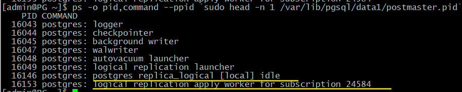

Логическая репликация
#####################

Физическая и логическая репликация
**********************************

	   
При физической репликации серверы имеют назначенные роли: **мастер** и **реплика**. 
Мастер передает на реплику журнальные записи (в виде файлов или потока записей). Поток данных всегда идет от 
основного сервера только в одну сторону - на реплику, в обратную сторону от реплики на сервер передача данных невозможна. 
реплика применяет эти записи к своим файлам данных. Применение происходит чисто механически, 
без «понимания смысла» изменений, поэтому важна двоичная совместимость между серверами (одинаковые платформы и 
основные версии PostgreSQL). Поскольку журнал общий для всего кластера, то и реплицировать можно только кластер целиком.

При логической репликации на одном сервере создается **публикация**, другие серверы могут на нее **подписаться**. 
У сервера нет выделенной роли: один и тот же сервер может как публиковать изменения, так и подписываться на другие 
(или даже свои) публикации. Подписке передается информация об изменениях строк в таблицах в платформо-независимом виде; 
двоичная совместимость не требуется. Для работы логической репликации в журнале публикующего сервера необходима 
дополнительная информация (параметр **wal_level = logical**). Это необходимо для того, чтобы выделить информацию, 
касающуюся изменения отдельных таблиц, что для логической репликации и требуется. 
Логическая репликация позволяет *транслировать не все изменения*, а только касающиеся определенных таблиц.

Для физической репликации обязательно нужна двоичная совместимость серверов. Это говорит о том, что можно 
выполнять физическую репликацию только между серверами на одинаковой платформе, с одинаковой операционной системой и с 
одинаковой основной версией сервера. Для логической репликации достаточно совместимости только на уровне протокола репликации.
Это позволяет организовать логическую репликацию между серверами, которые, работают под разными операционными системами 
и даже под разными основными версиями Postgres. 

https://www.2ndquadrant.com/en/resources-old/pglogical/
	   
Модель логической репликации
****************************

	   
Логическая репликация использует модель «публикация-подписка».

На одном сервере создается публикация, которая может включать ряд таблиц одной базы данных. 
Для репликации из нескольких баз данных потребуется создать несколько публикаций.

Публикация включает в себя изменения, происходящие с таблицами: эти изменения передаются на уровне строк 
(«в таблице такой-то такая-то строка изменилась таким-то образом»).

Изменения выдаются не сразу, а только при фиксации транзакции.

https://postgrespro.ru/docs/postgresql/13/logical-replication-publication

Другие серверы могут создавать подписки на публикации, получатьи применять изменения.

Применение изменений всегда происходит построчно. Хотя каждое изменение не требует разбора и планирования запроса, 
массовые изменения из-за этого будут выполняться медленнее.

Таблицы идентифицируются по **полным именам** (включая схему), столбцы также идентифицируются по именам. 
Это позволяет подписке использовать отличающуюся схему данных (например, иметь в таблице дополнительные столбцы).
На стороне подписки **уже должны существовать таблицы с такими же столбцами**, как и на стороне публикации

По умолчанию при создании подписки выполняется начальная синхронизация содержимого таблиц. 
Она происходит «бесшовно» благодаря использованию механизма экспорта снимка данных.
После того, как таблицы будут синхронизированы, то есть данные из таблицы с публикацией полностью будут перенесены в 
таблицу на подписчике, продолжится работа по передаче изменений с таблицы на сервера публикации. 
Но такая схема работы предполагает, что могут возникать конфликты с локальными данными. ПОскольку можно работать 
на сервере подписки (например, добавлять, изменять строки), то те строки, которые приходят из публикации 
и применяются, могут начать конфликтовать с имеющимися локальными данными.

https://postgrespro.ru/docs/postgresql/13/logical-replication-subscription

Ограничения логической репликации
*********************************

Реплицируются **только изменения** содержимого таблиц, вызванные командами **DML**. 

**Не реплицируются** команды **DDL**, что означает необходимость предварительно создать все необходимые 
таблицы на стороне подписки. Изменение структуры таблиц системного каталога, появление самих таблиц или изменение структуры 
таблицы. За этими изменениями нужно следить вручную и создавать и изменять структуры таблиц на стороне подписки отдельно.

Не реплицируются остальные объекты, объединяемые термином relation: 
последовательности, материализованные представления, внешние таблицы. Большие объекты (large objects) также не реплицируются.

Если используется физическая репликация, то и публикацию,и подписку можно создать только на основном сервере, 
так как команды DDL на реплике не поддерживаются.

Нет возможности организовать репликацию одной и той же таблицы между двумя серверами (циклы): 
изменения, сделанные на первом сервере, применяются вторым и тут же снова пересылаются первому, который скорее всего 
не сможет их применить из-за нарушения ограничений целостности.

https://postgrespro.ru/docs/postgresql/13/logical-replication-restrictions

Схема работы
************

Данные об изменениях таблиц передаются подписке тем же процессом **wal sender**, что и при обычной потоковой репликации. 
Так же, как и при потоковой репликации, этот процесс читает журнал предзаписи, но не просто транслирует прочитанные записи, 
а предварительно декодирует их. Целью декодирования которого является выделение из потока WAL только те[ изменениq, 
которые относятся к конкретным таблицам, на которые подписан подписчик. И только эти изменения будут передаваться.
В отличие от физической репликации, в **обязательном порядке используется слот логической 
репликации**. 

.. warning:: Без слотов логическая репликация работать не будет.

На стороне подписки информацию принимает фоновый процесс **logical replication worker** и применяет ее. 
Именно он будет подключаться к серверу поставщика. Данный процесс работает от имени суперпользователя. В это же время сервер-подписчик принимает обычные запросы и 
на чтение, и на запись.

.. important:: На публикующем сервере может быть запущено много процессов **wal sender** — по одному на каждую подписку. 
               Значения параметров **max_wal_senders** и **max_replication_slots** должны соответствовать нужному количеству процессов.

На сервере подписки необходимо установить параметры **max_logical_replication_workers** (для процессов, принимающих 
изменения по подписке. Для каждой подписки будет выделяться соответствующий процесс logical_replication_workers) и в целом **max_worker_processes** (как минимум на единицу больше, так как есть еще процесс 
**logical replication launcher**, но вообще этот пул используется и для других нужд).

https://postgrespro.ru/docs/postgresql/13/logical-replication-architecture

Практика
********

**Логическая репликация**

Настроить логическую репликацию таблицы test с сервера A на сервер B.

::

	[admin@PG ~]$ sudo -u postgres pg_ctl -D /var/lib/pgsql/data start
	[admin@PG ~]$ psql -U postgres

Для начала создадим базу данных.

::

	A@postgres=#CREATE DATABASE replica_logical;
	CREATE DATABASE

::

	A@postgres=#\c replica_logical
	
	You are now connected to database "replica_logical" as user "postgres".

Второй кластер изначально будет копией первого, поэтому выполним резервное копирование в каталог PGDATA второго сервера.

::

	[admin@PG ~]$ rm -fr /home/admin/backup

::

	[admin@PG ~]$ pg_basebackup --pgdata=/home/admin/backup

::

	[admindb@PG ~]$ sudo -u postgres pg_ctl -D /var/lib/pgsql/data1 status
	pg_ctl: no server running

::

	[admin@PG ~]$ sudo rm -fr /var/lib/pgsql/data1
	[admin@PG ~]$ sudo mv /home/admin/backup /var/lib/pgsql/data1
	[admin@PG ~]$sudo chown -R postgres:postgres /var/lib/pgsql/data1

::

	sudo sed -i 's/#port = 5432/port = 5433/g' /var/lib/pgsql/data1/postgresql.conf

Запускаем второй сервер.

::

	[admindb@PG ~]$ sudo -u postgres pg_ctl -D /var/lib/pgsql/data1 start 

Теперь на первом сервере создадим таблицу и заполним ее данными.

::

	[admin@PG ~]$ psql -U postgres -d replica_logical

::

	A@replica_logical=#CREATE TABLE test(id int PRIMARY KEY GENERATED BY DEFAULT AS IDENTITY, descr text);
	CREATE TABLE

::

	A@replica_logical=#INSERT INTO test(descr) VALUES ('Раз'), ('Два'), ('Три');
	INSERT 0 3

Для работы логической репликации понадобится изменить уровень журнала.

::

	A@replica_logical=#ALTER SYSTEM SET wal_level = logical;
	ALTER SYSTEM

::

	[admin@PG ~]$ sudo -u postgres pg_ctl -D /var/lib/pgsql/data restart

На втором сервере таблицы test нет. Поскольку команды DDL не реплицируются, 
таблицу необходимо создать вручную. При этом таблица подписчика может содержать и дополнительные столбцы, 
если это необходимо.

::

	| [admindb@PG ~]$ psql -U postgres -p 5433 -d replica_logical

	| B@replica_logical=#CREATE TABLE test(id int PRIMARY KEY GENERATED BY DEFAULT AS IDENTITY, descr text, additional text);
	| CREATE TABLE

На первом сервере создаем публикацию для таблицы **test**. Публикация относится к конкретной базе данных; 
в нее можно включить и несколько таблиц, а можно даже все таблицы сразу (**FOR ALL TABLES**).

::

	A@replica_logical=#CREATE PUBLICATION test_pub FOR TABLE test;
	CREATE PUBLICATION

::

	A@replica_logical=#\dRp+

На втором сервере подписываемся на публикацию. При этом на публикующем сервере будет создан слот логической репликации.

.. important:: Подписку может создать только **суперпользователь**. А роль для подключения к публикующему серверу должна иметь атрибуты 
               **REPLICATION** и **LOGIN**, и также **право чтения публикуемых таблиц**.

::

	| B@replica_logical=#\c
	| You are now connected to database "replica_logical" as user "postgres".

::

	| B@replica_logical=#CREATE SUBSCRIPTION test_sub
		CONNECTION 'port=5432 user=postgres dbname=replica_logical'
		PUBLICATION test_pub;
		NOTICE:  created replication slot "test_sub" on publisher
		CREATE SUBSCRIPTION
		
В команде create subscription указывается ее имя, параметром connection указыватеся строка подключения к той базе данных, 
где располагается публикация, и в параметре publication на какую конкретно публикацию в базе данных replica_logical осуществляется подписка.

ПРи создании подписки на сервере B автоматически создаётся слот логической репликации на сервере A. 
То есть команда выполняеся на одном экземпляре, а слот логической репликации создается на другом. 

::

	| B@replica_logical=#\dRs
	

По умолчанию данные сначала синхронизируются между серверами, и только после этого запускается процесс репликации. 
Это выполняется «бесшовно» с гарантией того, что никакие изменения не будут потеряны.

Если бы в таблице уже изначально были одинаковые и заполненые данные, то синхронизация не поттребовалась. В таком случае 
команде create subscription можно указать, что подписку нужно создавать, но синхронизацию делать не надо. 

::

	| B@replica_logical=#SELECT * FROM test;

	 id | descr | additional
	----+-------+------------
	  1 | Раз   |
	  2 | Два   |
	  3 | Три   |
	(3 rows)

Проверим, как работает репликация изменений.

::

	A@replica_logical=#INSERT INTO test(descr) VALUES ('Четыре');

	INSERT 0 1
	
::

	| B@replica_logical=#SELECT * FROM test;

	 id | descr  | additional
	----+--------+------------
	  1 | Раз    |
	  2 | Два    |
	  3 | Три    |
	  4 | Четыре |
	(4 rows)

Состояние подписки можно посмотреть в представлении:

::

	B@replica_logical=#SELECT * FROM pg_stat_subscription \gx

**received_lsn** — позиция в журнале, до которой получены изменения;

**latest_end_lsn** — позиция в журнале, подтвержденная процессу wal sender.

К процессам сервера добавился **logical replication worker** (его номер указан в **pg_stat_subscription.pid**):

::

	[admin@PG ~]$ ps -o pid,command --ppid `sudo head -n 1 /var/lib/pgsql/data1/postmaster.pid`

Логическое декодирование на стороне публикации
**********************************************

Полезно представлять внутреннее устройство логической репликации.

Журнальные записи читаются процессом **wal sender** и раскладываются по отдельным транзакциям в специальном буфере в оперативной памяти, 
в локальной памяти этого процесса. Это делается для того, чтобы при фиксации транзакции можно было взять все изменения, 
сделанные именно этой транзакцией, и передать их подписчику. При превышении определенного порога буфер начинает 
сбрасываться на диск (в каталог PGDATA/pg_replslots).

При наличии нескольких подписчиков и, следовательно, нескольких процессов **wal sender**, каждый из этих процессов будет самостоятельно 
читать WAL: буфер, упорядочивающий записи, находится в локальной памяти каждого процесса wal sender.

Когда транзакция фиксируется, ее изменения передаются модулю вывода, который декодирует их и представляет в платформо-независимом 
(текстовом) формате. Процесс wal sender передает эти декодированные сообщения подписчику (если он на них подписан) 
через слот логической репликации. Этот слот похож на обычный репликационный слот, но к нему привязан модуль вывода.
Этот слот логической репликации нужен для того, чтобы гарантировать то, что подписка не пропустит изменения, если подписчик на время отключится.
Он будет гарантировать то, что WAL файлы останутся, и когда сервер-подписчик продолжит работу, 
он сможет продолжить применять изменения с того места, на котором закончил.

В журнал на уровне **logical** дополнительно записывается информация, необходимая для логического декодирования, в частности:

- новые значения всех столбцов для UPDATE, а не только измененных;

- старые значения столбцов, входящих в логический идентификатор, для UPDATE и DELETE;

- OID базы данных для COMMIT.

https://postgrespro.ru/docs/postgresql/13/logicaldecoding

Практика
========

**Слот и логическое декодирование**

Что происходит при логическом декодировании?

Создадим вручную слот логической репликации. Для передачи изменений подписчику используется модуль вывода **pgoutput**, 
а для наблюдения удобнее модуль **test_decoding**:

::

	A@=#SELECT pg_create_logical_replication_slot('test_slot','test_decoding');

	 pg_create_logical_replication_slot 
	------------------------------------
	 (test_slot,0/50282F0)
	(1 row)

Теперь на сервере A два слота:

::

	A@=#SELECT slot_name, plugin, slot_type, active FROM pg_replication_slots;

	 slot_name |    plugin     | slot_type | active 
	-----------+---------------+-----------+--------
	 test_sub  | pgoutput      | logical   | t
	 test_slot | test_decoding | logical   | f
	(2 rows)

В отдельном сеансе начнем транзакцию и вставим строку в таблицу:

::

	admin$ psql -d replica_logical

::

	||| A@=#BEGIN;
		BEGIN
::

	|| A@=#INSERT INTO test(descr) VALUES ('Пять');
	INSERT 0 1

Модуль вывода может запросить у слота изменения:

::

	A@=#SELECT * FROM pg_logical_slot_get_changes('test_slot', NULL, NULL);

	 lsn | xid | data 
	-----+-----+------
	(0 rows)

Транзакция не завершена, модуль вывода пока ничего не получил. Сделаем еще изменение и завершим транзакцию.

::

	||| A@=#UPDATE test SET descr = 'Beş' WHERE id = 5;
		UPDATE 1
::

	||| A@=#COMMIT;
	COMMIT
::

	A@=#SELECT * FROM pg_logical_slot_get_changes('test_slot', NULL, NULL);

		lsn    | xid |                            data                             
	-----------+-----+-------------------------------------------------------------
	 0/50282F0 | 492 | BEGIN 492
	 0/50282F0 | 492 | table public.test: INSERT: id[integer]:5 descr[text]:'Пять'
	 0/5028378 | 492 | table public.test: UPDATE: id[integer]:5 descr[text]:'Beş'
	 0/50283F8 | 492 | COMMIT 492
	(4 rows)

Теперь модуль вывода получил изменения.

Удалим тестовый слот, иначе он будет препятствовать удалению сегментов WAL.

::

	A@=#SELECT pg_drop_replication_slot('test_slot');

	 pg_drop_replication_slot 
	--------------------------
	 
	(1 row)

Конфликты
*********

Вставка новых строк на стороне подписки происходит достаточно просто.

Интереснее обстоит дело при изменениях и удалениях — в этом случае надо как-то идентифицировать старую версию строки. По умолчанию для этого используются столбцы первичного ключа, 
но для таблицы можно указать и другие способы: 

- по уникальному индексу. Для поиска строки будет использоваться соответствующий индекс.

- по всем столбцам. Для поиска строки будет использоваться полное сканирование таблицы (что крайне неэффективно для больших таблиц.

Можно вообще отказаться от поддержки репликации для некоторых таблиц (по умолчанию так работают таблицы системного каталога).

Поскольку таблицы на публикующем сервере и на подписчике могут изменяться независимо друг от друга, при вставке новых версий строк возможно возникновение **конфликта** — 
нарушение ограничения целостности. В этом случае процесс применения записей приостанавливается до тех пор, пока конфликт не будет разрешен. Автоматического разрешения пока не существует; 
нужно вручную исправить данные на подписчике так, чтобы устранить конфликт. Логическая репликация в этом случае приостанавливает свою работу, будет периодически просыпаться и проверять, 
можно ли продолжить работу. Если можно, то она продолжит работу, если нет, то она опять какой-то небольшой период заснет. И так периодически будет регулярно ждать, когда конфликт будет разрешен.

https://postgrespro.ru/docs/postgresql/13/logical-replication-conflicts

Практика
========

**Конфликты**

.. important:: Последовательности не реплицируются. 

На втором сервере создалась своя собственная последовательность:

::

	| B=# INSERT INTO test(descr) VALUES ('Шесть - локально');

	| ERROR:  duplicate key value violates unique constraint "test_pkey"
	| DETAIL:  Key (id)=(1) already exists.

А вот так получится:

::

	| B=# INSERT INTO test VALUES (6, 'Шесть - локально');
	
	| INSERT 0 1

Что произойдет, если значение с таким же ключом (6) появится на публикующем сервере?

::

	A=# INSERT INTO test(descr) VALUES ('Шесть');
	INSERT 0 1

::

	A=# INSERT INTO test(descr) VALUES ('Семь');
	INSERT 0 1

При репликации возникнет конфликт, и она будет приостановлена.

::

	| B=# SELECT * FROM test;

	 id |      descr       | additional 
	----+------------------+------------
	  1 | Раз              | 
	  2 | Два              | 
	  3 | Три              | 
	  4 | Четыре           | 
	  5 | Beş              | 
	  6 | Шесть - локально | 
	(6 rows)

Фактически, процесс **logical replication worker** будет периодически перезапускаться, проверяя, не устранен ли конфликт. 
Поэтому информация в **pg_stat_subscription** пропадает:

::

	| B=# SELECT * FROM pg_stat_subscription \gx

	-[ RECORD 1 ]---------+---------
	subid                 | 32778
	subname               | test_sub
	pid                   | 
	relid                 | 
	received_lsn          | 
	last_msg_send_time    | 
	last_msg_receipt_time | 
	latest_end_lsn        | 
	latest_end_time       | 

В журнал сообщений будут попадать записи о нарушении ограничений целостности:

::

	admin$ sudo tail -n 3 /var/lib/pgsql/data1/log/...log

	2024-01-16 12:20:04.353 MSK [16638] ERROR:  duplicate key value violates unique constraint "test_pkey"
	2024-01-16 12:20:04.353 MSK [16638] DETAIL:  Key (id)=(6) already exists.
	2024-01-16 12:20:04.356 MSK [16286] LOG:  background worker "logical replication worker" (PID 16638) exited with exit code 1

Чтобы разрешить этот конфликт можно выполнить следующее:

- Попробовать пропустить эту конфликтующую запись и продолжить применение со следующей. Это требует достаточно точной 
работы по вычислению номеров и соответствующими функциями, управляющими для работы с логической репликацией. Нужно найти ту запись, 
точнее говоря даже ту транзакцию, которую мы нельзя применить.

- удалить конфликтующую строку из таблицы и немного подождать:

::

	| B=# DELETE FROM test WHERE id = 6;
	
	| DELETE 1

Проверим:

::

	| B=# SELECT * FROM test;

	 id | descr  | additional 
	----+--------+------------
	  1 | Раз    | 
	  2 | Два    | 
	  3 | Три    | 
	  4 | Четыре | 
	  5 | Beş    | 
	  6 | Шесть  | 
	  7 | Семь   | 
	(7 rows)

Данные появились, репликация восстановлена.

**Триггеры на подписчике**

.. note:: Триггер в PostgreSQL — это специальный механизм, который позволяет автоматически выполнять конкретную операцию при наступлении определённого события в базе данных. 
          Например, триггер срабатывает при выполнении команд **INSERT**, **UPDATE** или **DELETE**.

Данные могут быть добавлены как на подписчике, так и прийти со стороны логической репликации.

Для триггеров по умолчанию поведение такое, что, созданные обычными командами триггера без дополнительных указаний, 
они на стороне подписчика срабатывать не будут, и не будут применять изменения. 

Это удобно, если на обоих серверах созданы одинаковые таблицы с одинаковым набором триггеров: в таком случае триггер уже отработал на публикующем сервере, его не надо выполнять на подписчике.

На стороне подписчика создается триггер:

Триггерная функция (**RETURNS trigger**) на сервере подписчика. В третий дополнительный столбец нужено добавлять значение из публикации:

::

	| B=# CREATE OR REPLACE FUNCTION change_descr() RETURNS trigger AS $$
		BEGIN
		  NEW.additional := 'из публикации';
		  RETURN NEW;
		END;
		$$ LANGUAGE plpgsql;
		
	| CREATE FUNCTION

Hепосредственно триггер, который срабатывает before insert или update для таблицы test для каждой строки:
 
::

	| B=# CREATE TRIGGER test_before_row
		BEFORE INSERT OR UPDATE ON test
		FOR EACH ROW
		EXECUTE FUNCTION change_descr();

	| CREATE TRIGGER
	
::

	A=# INSERT INTO test(descr) VALUES ('Восемь');
	
	INSERT 0 1

::

	| B=# SELECT * FROM test;

	 id | descr  | additional 
	----+--------+------------
	  1 | Раз    | 
	  2 | Два    | 
	  3 | Три    | 
	  4 | Четыре | 
	  5 | Beş    | 
	  6 | Шесть  | 
	  7 | Семь   | 
	  8 | Восемь | 
	(8 rows)

Можно изменить таблицу, чтобы триггер срабатывал **только при репликации**:

::

	| B=# ALTER TABLE test ENABLE REPLICA TRIGGER test_before_row;
	
	| ALTER TABLE

Или в обоих случаях: **и при репликации, и при локальных изменениях**.

::

	| B=# ALTER TABLE test ENABLE ALWAYS TRIGGER test_before_row;
	| ALTER TABLE

Различить эти ситуации можно с помощью параметра **session_replication_role**:

::

	| B=# CREATE OR REPLACE FUNCTION change_descr() RETURNS trigger AS $$
		BEGIN
		  NEW.additional := current_setting('session_replication_role');
		  RETURN NEW;
		END;
		$$ LANGUAGE plpgsql;
	
	| CREATE FUNCTION
Д
обавляем по одной строке на каждом сервере:

::

	A=# INSERT INTO test(descr) VALUES ('Девять');
	INSERT 0 1

::

	| B=# INSERT INTO test(id,descr) VALUES (10,'Десять');
	| INSERT 0 1

::

	| B=# SELECT * FROM test;

	 id | descr  | additional 
	----+--------+------------
	  1 | Раз    | 
	  2 | Два    | 
	  3 | Три    | 
	  4 | Четыре | 
	  5 | Beş    | 
	  6 | Шесть  | 
	  7 | Семь   | 
	  8 | Восемь | 
	  9 | Девять | replica
	 10 | Десять | origin
	(10 rows)

Триггер сработал в обоих случаях, причем понятно, откуда пришла строка.

**Удаление подписки**

Если репликация больше не нужна, надо удалить подписку — иначе на публикующем сервере останется открытым репликационный слот.

::

	| B=# \c - postgres
	| You are now connected to database "replica_logical" as user "postgres".

::

	| B=# DROP SUBSCRIPTION test_sub;
	| NOTICE:  dropped replication slot "test_sub" on publisher
	| DROP SUBSCRIPTION
	
Таким образом:

Логическая репликация: 

- модель «публикация–подписка»

- Передаются изменения табличных строк

- Возможна выборочная репликация отдельных таблиц

- Не требуется двоичная совместимость серверов

Практика
********

1. Создайте две базы данных на одном сервере. В первой базе данных создайте таблицу с первичным ключом и добавьте в нее несколько строк.

2. Перенесите определение созданной таблицы во вторуюбазу данных с помощью логической резервной копии.
	
3. Настройте логическую репликацию таблицы из первой базы данных во вторую.

4. Проверьте работу репликации.

5. Удалите подписку.

**Пояснения:**

2. Воспользуйтесь утилитой **pg_dump** с ключом **\--schema-only**.

3. Если попробовать выполнить это обычным образом, команда создания подписки «повиснет» из-за того, что она должна дождаться завершения активных транзакций на публикующем сервере, 
то есть и самой себя в том числе. В таком случае необходимо заранее создать слот логической репликации, как описано в документации: 

https://postgrespro.ru/docs/postgresql/13/sql-createsubscription

