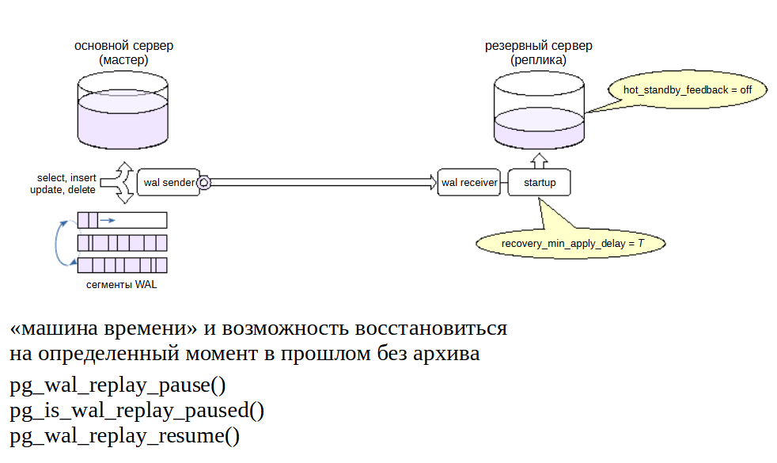
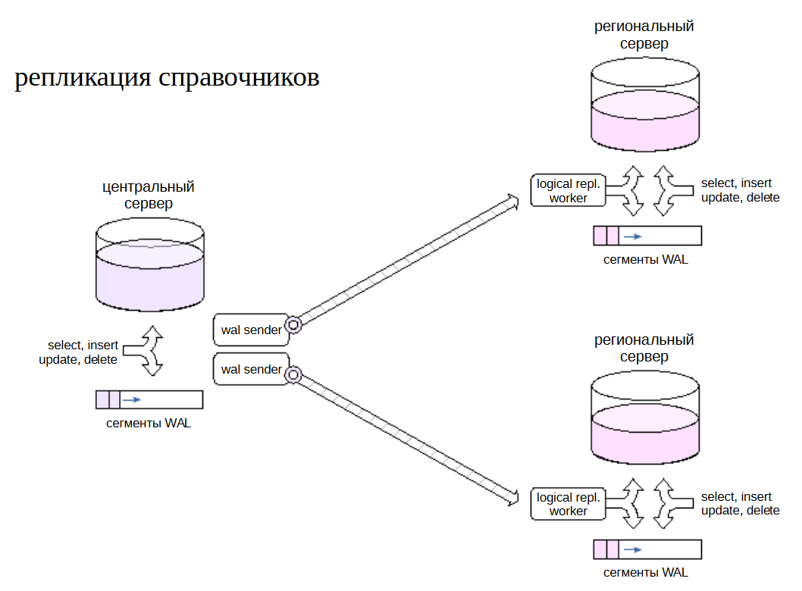

Использование репликации
########################

Физическая репликация
*********************

Горячий резерв для высокой доступности

Балансировка OLTP-нагрузки

Реплика для отчетов

Несколько реплик и каскадная репликация

Отложенная репликация

Горячий резерв для высокой доступности (HA)
===========================================

Реплика может создаваться для решения разных задач, и настройка зависит от ее предназначения.

Один из возможных вариантов — обеспечение горячего резерва для целей высокой доступности. Это означает, что при сбое основного сервера требуется как можно быстрее перейти на реплику, 
не потеряв при этом данные.

Надежность обеспечивает синхронная репликация в режиме **synchronous_commit = on** (значение **write** не гарантирует надежность; значение **apply** будет перебором).

Чтобы реплика как можно меньше отставала от основного сервера, нужно применять журнальные записи сразу же. Для этого выставляем задержку **max_standby_streaming_delay** в небольшое значение.

Чтобы запросы к реплике не могли негативно повлиять на основной сервер, выключаем обратную связь (**hot_standby_feedback = off**).

С такими настройками запросы к реплике возможны, но в случае конфликтов они будут прерваны. 

Если запросы к реплике не предполагаются, можно создать ее в режиме «теплого резерва» (**hot_standby = off**).

Балансировка OLTP-нагрузки
==========================

Другой вариант — реплика используется для балансировки OLTP-нагрузки на чтение.OLTP-нагрузка характеризуется небольшими по длительности запросами. 
Это позволяет достаточно тесно связать реплику с основным сервером, чтобы запросы гарантированно не прерывались из-за конфликтов, и в то же время не беспокоиться о негативном влиянии на основной сервер.

Необходимо включить обратную связь (**hot_standby_feedback = on**) и выставить достаточно большую задержку применения конфликтных записей (**max_standby_streaming_delay** можно даже несколько минут).

Синхронная репликация в такой конфигурации, скорее всего, не требуется. Она все равно не обеспечивает согласованность данных: зафиксированное изменение на основном сервере не гарантирует, 
что запрос к реплике увидит эти изменения.

Для обеспечения согласованности нужно, чтобы изменения появлялись на обоих серверах одновременно. Режим **synchronous_commit = apply** позволяет дождаться применения журнальной записи на реплике 
(ценой сильного падения производительности основного сервера),но остается возможность увидеть данные на реплике раньше, чем на мастере. 

Реплика для отчетов
===================

Можно использовать реплику для разделения по серверам нагрузки разного типа. Основной сервер может брать на себя *OLTP-нагрузку*, а длительные читающие запросы (отчеты) можно вынести на реплику.

Кроме распределения нагрузки между серверами, такое решение позволит избежать проблемы с тем, что длительные запросы на основном сервере могут задерживать выполнение очистки и приводить 
к разрастанию таблиц.

Из этих соображений «отчетная» реплика должна быть максимально отделена от основного сервера. Должна быть отключена обратная связь (**hot_standby_feedback = off**), 
но время откладывания конфликтующих журнальных записей нужно сильно увеличить, вплоть до бесконечности (**max_standby_streaming_delay = −1**).

Поскольку для длительных отчетов не требуются мгновенные изменения данных, можно отказаться от слота репликации и использовать архив (не забыв выставить параметр **max_standby_archive_delay** 
аналогично **max_standby_streaming_delay**). Тогда, если мастер успеет удалить необходимый реплике файл, реплика возьмет его из архива.

Такую реплику можно также использовать для выполнения резервного копирования.

На практике возможны и другие сочетания параметров. Все зависит от решаемых задач и какое влияние оказывают те или иные параметры.

Несколько реплик
================

	   
К основному серверу можно подключить несколько реплик. Для этого не требуется специальных настроек, но надо учитывать, что каждой реплике будет соответствовать отдельный 
процесс **wal sender** и **отдельный слот репликации**. При развертывании можно растиражировать одну базовую копию и *клонировать слот репликации* функцией **pg_copy_physical_replication_slot()**.

https://postgrespro.ru/docs/postgresql/13/functions-admin#FUNCTIONS-REPLICATION

Обычно такая схема требуется для распределения нагрузки, но собственно распределение должно решаться внешними средствами.

Практика
--------

Мастер и две физические реплики
Настроим конфигурацию с двумя репликами.

Создадим автономную резервную копию первого сервера, одновременно создав слот.

::

	admin$ pg_basebackup --pgdata=/home/admin/backup -R --create-slot --slot=beta

Поскольку третий сервер при старте начнет применять записи WAL с той же позиции, что и второй, можно дублировать слот:

::

	A=# \c - postgres
	
	You are now connected to database "postgres" as user "postgres".

::

	A=# SELECT pg_copy_physical_replication_slot('beta','gamma');

	 pg_copy_physical_replication_slot 
	-----------------------------------
	 (gamma,)
	(1 row)

Выложим автономную копию в каталоги PG_DATA второго и третьего серверов:

::

	admin$ sudo -u postgres pg_ctl -D /var/lib/pgsql/data1 status
	Error: /var/lib/pgsql/data1 is not accessible or does not exist

::

	admin$ sudo rm -rf /var/lib/pgsql/data1
	admin$ sudo cp -r /home/admin/backup /var/lib/pgsql/data1
	admin$ sudo chown -R postgres:postgres /var/lib/pgsql/data1
	
Заменить порт на 5433

::

	admin$ sudo  -u postgres pg_ctl -D /var/lib/pgsql/data2 status
	Error: /var/lib/pgsql/data2 is not accessible or does not exist
	
::

	admin$ sudo rm -rf /var/lib/pgsql/data2
	admin$ sudo cp -r /home/admin/backup /var/lib/pgsql/data2
	admin$ sudo chown -R postgres:postgres /var/lib/pgsql/data2
	
Заменить порт на 5434

В конфигурации третьего сервера укажем слот gamma:

::

	admin$ sudo sed 's/beta/gamma/g' -i /var/lib/pgsql/data2/postgresql.auto.conf

	admin$ sudo tail -n 1 /var/lib/pgsql/data2/postgresql.auto.conf

	primary_slot_name = 'gamma'

Запускаем обе реплики:

::

	admin$ sudo -u postgres pg_ctl -D /var/lib/pgsql/data1 start
	admin$ sudo -u postgres pg_ctl -D /var/lib/pgsql/data2 start

Слоты инициализировались:

::

	A=# SELECT slot_name, active_pid, restart_lsn FROM pg_replication_slots;

	 slot_name | active_pid | restart_lsn 
	-----------+------------+-------------
	 beta      |      19050 | 0/5000060
	 gamma     |      19092 | 0/5000060
	(2 rows)

Проверка:

::

	A=# CREATE DATABASE replica_usecases;
	CREATE DATABASE
	
	A=# \c replica_usecases
	
	You are now connected to database "replica_usecases" as user "postgres".
::

	A=# CREATE TABLE revenue(city text, amount numeric);
	
	CREATE TABLE

::

	| admindb$ psql -U postgres -p 5433

::

	|| admin_jr$ psql -U postgres -p 5434

::

	| B=# \c replica_usecases
	You are now connected to database "replica_usecases" as user "postgres".

::

	|| C=# \c replica_usecases
	You are now connected to database "replica_usecases" as user "postgres".

::

	| B=# \d revenue

				  Table "public.revenue"
	 Column |  Type   | Collation | Nullable | Default 
	--------+---------+-----------+----------+---------
	 city   | text    |           |          | 
	 amount | numeric |           |          | 

::

	|| C=# \d revenue
		
				  Table "public.revenue"
	 Column |  Type   | Collation | Nullable | Default 
	--------+---------+-----------+----------+---------
	 city   | text    |           |          | 
	 amount | numeric |           |          | 

Настроены две реплики одного мастера на основе одной базовой копии.

Каскадная репликация
====================

Несколько реплик, подключенных к одному основному серверу, будут создавать на него определенную нагрузку. 
Кроме того, надо учитывать нагрузку на сеть для пересылки нескольких копий потока журнальных записей.

Для снижения нагрузки реплики можно соединять каскадом; при этом серверы передают журнальные записи друг другу по цепочке. 
Чем дальше от мастера, тем большее может накопиться запаздывание. Схема мониторинга усложняется: процесс надо контролировать на нескольких серверах.

Для настройки на промежуточных репликах требуется обеспечить достаточное значение параметров **max_wal_senders** и **max_replication_slots** и проверить настройки подключения по протоколу 
репликации в **pg_hba.conf**.

Если совершится переход на реплику (ближайшую к основному серверу), то на ней произойдет увеличение номера линии времени. 
Значение (по умолчанию с версии 12) **recovery_target_timeline = 'latest'** направит восстановление по этой новой линии.

Заметим, что каскадная синхронная репликация не поддерживается: основной сервер может быть синхронизирован толькос непосредственно подключенной к нему репликой. 
А вот обратная связь поступает основному серверу от всех реплик.

Отложенная репликация
=====================

	   
Позволяет получить возможность просмотреть данные на некоторый момент в прошлом и, при необходимости, восстановить сервер на этот момент.

Обычный механизм восстановления из архива на момент времени (**point-in-time recovery**) позволяет решить задачу, но требует большой подготовительной работы и занимает много времени.

Другое решение — создать реплику, которая применяет журнальные записи не сразу, а через установленный интервал времени (**recovery_min_apply_delay**). 
Чтобы задержка работала правильно, необходима синхронизация часов между серверами.

Откладывается применение не всех записей, а только записей о фиксации изменений. Записи до фиксации могут быть применены «раньше времени», но это не представляет проблемы благодаря  многоверсионности.

Обратную связь следует отключать, чтобы не вызвать разрастание таблиц на мастере.

Типичный сценарий: на основном сервере происходит какая-либо проблема (допустим, удалены критичные данные). На реплике данные еще есть, поскольку соответствующие записи еще не применены. 
Дальнейшее проигрывание записей приостанавливается с помощью функции **pg_wal_replay_pause()**, пока идет исследование проблемы.

Если принято решение вернуться на момент времени до удаления, нужно указать целевую точку восстановления одним из параметров **recovery_target_\* ** и перезапустить реплику.

Логическая репликация
*********************

Консолидация данных
===================

Пусть имеются несколько региональных филиалов, каждый из которых работает на собственном сервере PostgreSQL. 
Задача состоитв консолидации части данных на центральном сервере.

Для решения на региональных серверах создаются публикации необходимых данных. Центральный сервер подписывается на эти публикации. 
Полученные данные можно обрабатывать (например, приводить к единому виду) с помощью триггеров на стороне центрального сервера.

Поскольку репликация основана на передаче данных через слот, между серверами необходимо более или менее постоянное соединение, так как во время разрыва соединения региональные 
серверы будут вынуждены сохранять файлы журнала.Есть множество особенностей такого процесса и с точки зрения бизнес-логики, требующих всестороннего изучения. 
В ряде случаев может оказаться проще передавать данные пакетно раз в определенный интервал времени.

Общие данные (справочники)
==========================

Другая задача: на центральном сервере поддерживаются справочники, актуальные версии которых должны быть доступны на региональных серверах.
 
В этом случае схему надо развернуть наоборот: центральный сервер  публикует изменения, а региональные серверы подписываются на эти обновления.

Практика
--------

**Консолидация с помощью логической репликации**

Вывод астроенных ранее реплик (B, C) из режима восстановления и настройка консолидации данных.

::

	| B=#\c - postgres
	
	You are now connected to database "replica_usecases" as user "postgres".

::

	| B=#SELECT pg_promote(), pg_is_in_recovery();
	
	 pg_promote | pg_is_in_recovery 
	------------+-------------------
	 t          | f
	(1 row)

	|| C=# \c - postgres
	You are now connected to database "replica_usecases" as user "postgres".

::

	|| C=# SELECT pg_promote(), pg_is_in_recovery();
	 pg_promote | pg_is_in_recovery 
	------------+-------------------
	 t          | f
	(1 row)

Для логической репликации нужно повысить уровень WAL (потребуется рестарт).

::

	| B=#ALTER SYSTEM SET wal_level = 'logical';
	ALTER SYSTEM

::

	|| C=# ALTER SYSTEM SET wal_level = 'logical';
	ALTER SYSTEM

::

	admin$ sudo -u postgres pg_ctl -D /var/lib/pgsql/data1 restart

::

	admin$ sudo -u postgres pg_ctl -D /var/lib/pgsql/data2 restart

Публикуем таблицу на втором и третьем серверах:

::

	admindb$ psql  -U postgres -p 5433 -d replica_usecases

::

	| B=#CREATE PUBLICATION revenue FOR TABLE revenue;
	CREATE PUBLICATION
::

	admin_jr$ psql  -U postgres -p 5434 -d replica_usecases

::

	|| C=# CREATE PUBLICATION revenue FOR TABLE revenue;
	CREATE PUBLICATION

Первый сервер подписывается на обе публикации:

::

	A=# \c - postgres

	You are now connected to database "replica_usecases" as user "postgres".

::

	A=# CREATE SUBSCRIPTION msk CONNECTION 'port=5433 dbname=replica_usecases' PUBLICATION revenue;
	NOTICE:  created replication slot "msk" on publisher
	CREATE SUBSCRIPTION

::

	A=# CREATE SUBSCRIPTION spb CONNECTION 'port=5434 dbname=replica_usecases' PUBLICATION revenue;
	NOTICE:  created replication slot "spb" on publisher
	CREATE SUBSCRIPTION

В филиалах происходит заполнение данных:

::

	| B=#INSERT INTO revenue
	  SELECT 'Москва', random()*1e6 FROM generate_series(1,70);
 	INSERT 0 70

::

	|| C=# INSERT INTO revenue
	  SELECT 'Санкт-Петербург', random()*1e6 FROM generate_series(1,10);
	INSERT 0 10

А центральный офис видит работу всей компании (подождем несколько секунд, чтобы сработала репликация):

::

	A=# SELECT city, sum(amount) FROM revenue GROUP BY city;
		  city       |         sum          
	-----------------+----------------------
	 Москва          | 33805589.79714438005
	 Санкт-Петербург |   6182834.3921458255
	(2 rows)
	

Обновление серверов
*******************

Логическая репликация может использоваться для обновления основной версии сервера без прерывания обслуживания (или с минимальным прерыванием).

Допустим, имеется основной сервер и физическая потоковая реплика.

.. figure:: img/scenar_09.png
       :scale: 100 %
       :align: center
       :alt: asda
	   
Создаем новый сервер с требуемой версией PostgreSQL и переносим на него структуру всех таблиц выбранной базы данных.

На основном сервере предыдущей версии публикуем изменения всех таблиц базы данных. 

Поскольку изменения схемы данных не реплицируются, на время обновления такие изменения должны быть запрещены.

Создаем физическую реплику, аналогичную реплике сервера предыдущей версии.

В итоге получаем параллельную структуру серверов с новой версией PostgreSQL. Эта структура аналогична имеющейся для старой версии.

После этого переключаем клиентов на новые серверы, а старые останавливаем. Прерывание обслуживания будет определяться тем, насколько плавно можно выполнить это переключение.

Надо иметь в виду, что такой процесс нельзя считать универсальным: он накладывает достаточно много ограничений и существенно более сложен, 
чем использование утилиты **pg_upgrade**, которая позволяет выполнить обновление за небольшое время.

Практика
********

1. Настройте репликацию между серверами **A** и **B**.

2. Настройте каскадную репликацию на сервер **C** с применение записей WAL с задержкой в десять секунд.

3. Проверьте работу репликации, убедитесь в том, что на сервере **C** данные появляются с установленной задержкой.
	
4. Остановите мастер и перейдите на сервер **B**.

5. Проверьте, что сервер **C** продолжает работать в режиме реплики.