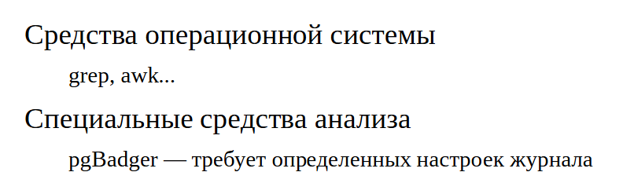

Мониторинг
##########

Средства опреационной системы
*****************************

.. figure:: img/monitor_01.png
       :scale: 100 %
       :align: center
       :alt: asda
	   
PostgreSQL работает под управлением операционной системы ив известной степени зависит от ее настроек.

Используя инструменты операционной системы, можно посмотреть информацию о процессах PostgreSQL. При включенном (по умолчанию) параметре сервера **update_process_title** 
в имени процесса отображается его текущее состояние. Параметр **cluster_name** задает имя экземпляра, по которому его можно отличать в списке процессов.

Для изучения использования системных ресурсов (процессор, память, диски) в Unix имеются различные инструменты: iostat, vmstat, sar, topи др.

Необходимо следить и за размером дискового пространства. Место, занимаемое базой данных, можно смотреть как из самой БД, так из ОС (команда du). 
Размер доступного дискового пространства надо смотреть в ОС (команда df). Если используются дисковые квоты, надо принимать во внимание и их.

В целом набор инструментов и подходы могут сильно различаться в зависимости от используемой ОС и файловой системы.

https://postgrespro.ru/docs/postgresql/16/monitoring-ps

https://postgrespro.ru/docs/postgresql/16/diskusage

Статистика
**********

Существует два основных источника информации о происходящемв системе:

- Cтатистическая информация, которая собирается PostgreSQL и хранится в кластере.

- Журнал сообщений.

Сбор статистики
===============

.. figure:: img/monitor_02.png
       :scale: 100 %
       :align: center
       :alt: asda

Система накопительной статистики в PostgreSQL собирает и позволяет получать информацию о работе сервера. Накопительная статистика отслеживает обращения к таблицам и 
индексам как на уровне блоков на диске, так и на уровне отдельных строк. Кроме того, для каждой таблицы собираются сведения о количестве строк и действиях по очистке и анализу.

Можно также учитывать количество вызовов пользовательских функций и время, затраченное на их выполнение.

Количеством собираемой информации управляют несколько параметров сервера, так как чем больше информации собирается, тем больше и накладные расходы.

https://postgrespro.ru/docs/postgresql/16/monitoring-stats

Архитектура
===========

	   
Обслуживающие процессы собирают статистику в рамках транзакций. Затем эта статистика самим процессом записывается в разделяемую память, но не чаще, 
чем раз в одну секунду (задано при компиляции). Накопительная статистика запоминается в **PGDATA/pg_stat/** при штатной остановке сервера и считывается при его запуске. 
При аварийной остановке все счетчики сбрасываются.

Обслуживающий процесс может кешировать данные статистики при обращении к ней. Уровнем кеширования управляет параметр stats_fetch_consistency:

- **none** — без кеширования, статистика только в разделяемой памяти;

- **cache** — кешируется статистика по одному объекту;

- **snapshot** — кешируется вся статистика текущей базы данных.

По умолчанию используется значение **cache** — это компромисс между согласованностью и эффективностью.

Закешированная статистика не перечитывается и сбрасывается в конце транзакции или при вызове **pg_stat_clear_snapshot()**.

Из-за задержек и кеширования обслуживающий процесс использует не самую свежую статистику, но обычно это и не требуется.

Практика
--------

**Накопительная статистика**

::

	A=# CREATE DATABASE admin_monitoring;
	CREATE DATABASE

::

	A=# \c admin_monitoring
	You are now connected to database "admin_monitoring" as user "postgres".

1. Включение сбора статистики ввода-вывода:

::

	A=# ALTER SYSTEM SET track_io_timing=on;
	ALTER SYSTEM

	A=# SELECT pg_reload_conf();
	 pg_reload_conf 
	----------------
	 t
	(1 row)

Смотреть на активности сервера имеет смысл, когда какие-то активности на самом деле есть. Чтобы сымитировать нагрузку, 
воспользуемся **pgbench** — штатной утилитой для запуска эталонных тестов.

Сначала утилита создает набор таблиц и заполняет их данными.

::

	admin$ pgbench -i admin_monitoring

	dropping old tables...
	NOTICE:  table "pgbench_accounts" does not exist, skipping
	NOTICE:  table "pgbench_branches" does not exist, skipping
	NOTICE:  table "pgbench_history" does not exist, skipping
	NOTICE:  table "pgbench_tellers" does not exist, skipping
	creating tables...
	generating data (client-side)...
	100000 of 100000 tuples (100%) done (elapsed 0.61 s, remaining 0.00 s)
	vacuuming...
	creating primary keys...
	done in 1.03 s (drop tables 0.00 s, create tables 0.02 s, client-side generate 0.69 s, 
	vacuum 0.14 s, primary keys 0.19 s).

Сброс накопленной ранее статистику по базе данных:
::

	A=# SELECT pg_stat_reset();

	 pg_stat_reset 
	---------------
	 
	(1 row)

А также статистику экземпляра по вводу-выводу:

::

	A=# SELECT pg_stat_reset_shared('io');

	 pg_stat_reset_shared 
	----------------------
	 
	(1 row)

Запуск тестf TPC-B на несколько секунд:

::

	admin$ pgbench -T 10 admin_monitoring

	pgbench (16.9 ))
	starting vacuum...end.
	transaction type: <builtin: TPC-B (sort of)>
	scaling factor: 1
	query mode: simple
	number of clients: 1
	number of threads: 1
	maximum number of tries: 1
	duration: 10 s
	number of transactions actually processed: 1360
	number of failed transactions: 0 (0.000%)
	latency average = 7.352 ms
	initial connection time = 3.828 ms
	tps = 136.022702 (without initial connection time)

Теперь мы можем посмотреть статистику обращений к таблицам в терминах строк:

::

	A=# SELECT *
	FROM pg_stat_all_tables
	WHERE relid = 'pgbench_accounts'::regclass \gx

	-[ RECORD 1 ]-------+------------------------------
	relid               | 16393
	schemaname          | public
	relname             | pgbench_accounts
	seq_scan            | 0
	last_seq_scan       | 
	seq_tup_read        | 0
	idx_scan            | 2720
	last_idx_scan       | 2025-06-23 23:25:35.249459+03
	idx_tup_fetch       | 2720
	n_tup_ins           | 0
	n_tup_upd           | 1360
	n_tup_del           | 0
	n_tup_hot_upd       | 429
	n_tup_newpage_upd   | 931
	n_live_tup          | 0
	n_dead_tup          | 1248
	n_mod_since_analyze | 1360
	n_ins_since_vacuum  | 0
	last_vacuum         | 
	last_autovacuum     | 
	last_analyze        | 
	last_autoanalyze    | 
	vacuum_count        | 0
	autovacuum_count    | 0
	analyze_count       | 0
	autoanalyze_count   | 0

И в терминах страниц:

::

	A=# SELECT *
	FROM pg_statio_all_tables
	WHERE relid = 'pgbench_accounts'::regclass \gx

	-[ RECORD 1 ]---+-----------------
	relid           | 16393
	schemaname      | public
	relname         | pgbench_accounts
	heap_blks_read  | 0
	heap_blks_hit   | 9199
	idx_blks_read   | 274
	idx_blks_hit    | 7032
	toast_blks_read | 
	toast_blks_hit  | 
	tidx_blks_read  | 
	tidx_blks_hit   | 

Существуют аналогичные представления для индексов:

::

	A=# SELECT *
	FROM pg_stat_all_indexes
	WHERE relid = 'pgbench_accounts'::regclass \gx

	-[ RECORD 1 ]-+------------------------------
	relid         | 16393
	indexrelid    | 16407
	schemaname    | public
	relname       | pgbench_accounts
	indexrelname  | pgbench_accounts_pkey
	idx_scan      | 2720
	last_idx_scan | 2025-06-23 23:25:35.249459+03
	idx_tup_read  | 3654
	idx_tup_fetch | 2720

::

	A=# SELECT *
	FROM pg_statio_all_indexes
	WHERE relid = 'pgbench_accounts'::regclass \gx
	-[ RECORD 1 ]-+----------------------
	relid         | 16393
	indexrelid    | 16407
	schemaname    | public
	relname       | pgbench_accounts
	indexrelname  | pgbench_accounts_pkey
	idx_blks_read | 274
	idx_blks_hit  | 7032

Эти представления, в частности, могут помочь определить неиспользуемые индексы. Такие индексы не только бессмысленно занимают место на диске, 
но и тратят ресурсы на обновление при каждом изменении данных в таблице.

Есть также представления для пользовательских и системных объектов (all, user, sys), для статистики текущей транзакции (**pg_stat_xact**) и другие.

Можно посмотреть общую статистику по базе данных:

::

	A=# SELECT *
	FROM pg_stat_database
	WHERE datname = 'admin_monitoring' \gx

	-[ RECORD 1 ]------------+------------------------------
	datid                    | 16386
	datname                  | admin_monitoring
	numbackends              | 1
	xact_commit              | 1376
	xact_rollback            | 0
	blks_read                | 276
	blks_hit                 | 26827
	tup_returned             | 20098
	tup_fetched              | 3351
	tup_inserted             | 1360
	tup_updated              | 4081
	tup_deleted              | 0
	conflicts                | 0
	temp_files               | 0
	temp_bytes               | 0
	deadlocks                | 0
	checksum_failures        | 
	checksum_last_failure    | 
	blk_read_time            | 15.291
	blk_write_time           | 1.131
	session_time             | 21463.672
	active_time              | 9224.644
	idle_in_transaction_time | 682.323
	sessions                 | 2
	sessions_abandoned       | 0
	sessions_fatal           | 0
	sessions_killed          | 0
	stats_reset              | 2025-06-23 23:25:25.082128+03

Здесь есть много полезной информации о количестве произошедших взаимоблокировок, зафиксированных и отмененных транзакций, использовании временных файлов, 
ошибках подсчета контрольных сумм. Здесь же хранится статистика общего количества сеансов и количества прерванных по разным причинам сеансов.

Столбец **numbackends** показывает текущее количество обслуживающих процессов, подключенных к базе данных.

Статистика ввода-вывода на уровне сервера доступна в представлении **pg_stat_io**. Например, выполним контрольную точку и посмотрим количество операций чтения и 
записи страниц по типам процессов:

::

	A=# CHECKPOINT;

	CHECKPOINT

::

	A=# SELECT backend_type, sum(hits) hits, sum(reads) reads, sum(writes) writes
	FROM pg_stat_io
	GROUP BY backend_type;

		backend_type     | hits  | reads | writes 
	---------------------+-------+-------+--------
	 background worker   |     0 |     0 |      0
	 client backend      | 27953 |   276 |      0
	 walsender           |     0 |     0 |      0
	 standalone backend  |     0 |     0 |      0
	 autovacuum worker   |   584 |     0 |      0
	 autovacuum launcher |     0 |     0 |      0
	 background writer   |       |       |      0
	 startup             |     0 |     0 |      0
	 checkpointer        |       |       |   2878
	(9 rows)
	
Текущие активности
==================

	   
Текущие активности всех обслуживающих и фоновых процессов отображаются в представлении **pg_stat_activity**. 

Работа этого представления зависит от параметра **track_activities**, включенного по умолчанию.

Практика
--------

**Текущие активности**

Воспроизведем сценарий, в котором один процесс блокирует выполнение другого, и попробуем разобраться в ситуации с помощью системных представлений.

Создадим таблицу с одной строкой:

::

	=# CREATE TABLE t(n integer);
	CREATE TABLE

::

	=# INSERT INTO t VALUES(42);
	INSERT 0 1

Запустим два сеанса, один из которых изменяет таблицу и не завершает транзакцию:

::

	admin$ psql -d admin_monitoring
::

	=# BEGIN;
	BEGIN

::

	=# UPDATE t SET n = n + 1;
	UPDATE 1

А второй пытается изменить ту же строку и блокируется:

::

	admin$ psql -d admin_monitoring

::

	=# UPDATE t SET n = n + 2;

Посмотрим информацию об обслуживающих процессах:

::

	=# SELECT pid, query, state, wait_event, wait_event_type, pg_blocking_pids(pid)
		FROM pg_stat_activity
		WHERE backend_type = 'client backend' \gx
	-[ RECORD 1 
	]----+-----------------------------------------------------------------------------
	pid              | 20272
	query            | UPDATE t SET n = n + 1;
	state            | idle in transaction
	wait_event       | ClientRead
	wait_event_type  | Client
	pg_blocking_pids | {}
	-[ RECORD 2 
	]----+-----------------------------------------------------------------------------
	pid              | 19290
	query            | SELECT pid, query, state, wait_event, wait_event_type, 
	pg_blocking_pids(pid)+
					 | FROM pg_stat_activity                                                  
		 +
					 | WHERE backend_type = 'client backend' 
	state            | active
	wait_event       | 
	wait_event_type  | 
	pg_blocking_pids | {}
	-[ RECORD 3 
	]----+-----------------------------------------------------------------------------
	pid              | 20361
	query            | UPDATE t SET n = n + 2;
	state            | active
	wait_event       | transactionid
	wait_event_type  | Lock
	pg_blocking_pids | {20272}

Состояние **«idle in transaction»** означает, что сеанс начал транзакцию, но в настоящее время ничего не делает, а транзакция осталась незавершенной. 
Это может стать проблемой, если ситуация возникает систематически (например, из-за некорректной реализации приложения или из-за ошибок в драйвере), 
поскольку открытый сеанс удерживает снимок данных и таким образом препятствует очистке.

В арсенале администратора имеется параметр **idle_in_transaction_session_timeout**, позволяющий принудительно завершать сеансы, 
в которых транзакция простаивает больше указанного времени. Также имеется параметр **idle_session_timeout** — принудительно завершает сеансы, 
простаивающие больше указанного времени вне транзакции.

Завершение блокирующего процесса вручнную.

1) Сначала узнаем номер заблокированного процесса при помощи функции **pg_blocking_pids**:

::

	=# SELECT pid AS blocked_pid
	FROM pg_stat_activity
	WHERE backend_type = 'client backend'
	AND cardinality(pg_blocking_pids(pid)) > 0;
	
	 blocked_pid 
	-------------
		   20361
	(1 row)

Блокирующий процесс можно вычислить и без функции **pg_blocking_pids**, используя запросы к таблице блокировок. Запрос покажет две строки: одна транзакция получила блокировку (granted), а другая ее ожидает.

::

	=# SELECT locktype, transactionid, pid, mode, granted
	FROM pg_locks
	WHERE transactionid IN (
	  SELECT transactionid FROM pg_locks WHERE pid = 20361 AND NOT granted
	);
	
	   locktype    | transactionid |  pid  |     mode      | granted 
	---------------+---------------+-------+---------------+---------
	 transactionid |          2112 | 20272 | ExclusiveLock | t
	 transactionid |          2112 | 20361 | ShareLock     | f
	(2 rows)

В общем случае нужно аккуратно учитывать тип блокировки.

Выполнение запроса можно прервать функцией **pg_cancel_backend**. В нашем случае транзакция простаивает, так что просто прерываем сеанс, вызвав **pg_terminate_backend**:

::

	=# SELECT pg_terminate_backend(b.pid)
	FROM unnest(pg_blocking_pids(20361)) AS b(pid);

	 pg_terminate_backend 
	----------------------
	 t
	(1 row)

Функция **unnest** нужна, поскольку **pg_blocking_pids** возвращает массив идентификаторов процессов, блокирующих искомый обслуживающий процесс. 
В нашем примере блокирующий процесс один, но в общем случае их может быть несколько.

Проверим состояние обслуживающих процессов.

::

	=# SELECT pid, query, state, wait_event, wait_event_type
	FROM pg_stat_activity
	WHERE backend_type = 'client backend' \gx

	-[ RECORD 1 ]---+------------------------------------------------------
	pid             | 19290
	query           | SELECT pid, query, state, wait_event, wait_event_type+
					| FROM pg_stat_activity                                +
					| WHERE backend_type = 'client backend' 
	state           | active
	wait_event      | 
	wait_event_type | 
	-[ RECORD 2 ]---+------------------------------------------------------
	pid             | 20361
	query           | UPDATE t SET n = n + 2;
	state           | idle
	wait_event      | ClientRead
	wait_event_type | Client

Осталось только два, причем заблокированный успешно завершил транзакцию.

Представление **pg_stat_activity** показывает информацию не только про обслуживающие процессы, но и про служебные фоновые процессы экземпляра:

::

	=# SELECT pid, backend_type, backend_start, state
	FROM pg_stat_activity;

	  pid  |         backend_type         |         backend_start         | state  
	-------+------------------------------+-------------------------------+--------
	 19194 | autovacuum launcher          | 2025-06-23 23:25:15.787314+03 | 
	 19195 | logical replication launcher | 2025-06-23 23:25:15.793676+03 | 
	 19290 | client backend               | 2025-06-23 23:25:23.674757+03 | active
	 20361 | client backend               | 2025-06-23 23:25:41.083253+03 | idle
	 19191 | background writer            | 2025-06-23 23:25:15.719773+03 | 
	 19190 | checkpointer                 | 2025-06-23 23:25:15.718874+03 | 
	 19193 | walwriter                    | 2025-06-23 23:25:15.784309+03 | 
	(7 rows)

Сравним с тем, что показывает операционная система:

::

	admin$ sudo head -n 1 /var/lib/pgsql/data/postmaster.pid
	19189

::

	admin$ ps -o pid,command --ppid 19189

    PID COMMAND
  19190 postgres: 16/main: checkpointer 
  19191 postgres: 16/main: background writer 
  19193 postgres: 16/main: walwriter 
  19194 postgres: 16/main: autovacuum launcher 
  19195 postgres: 16/main: logical replication launcher 
  19290 postgres: 16/main: postgres admin_monitoring [local] idle
  20361 postgres: 16/main: postgres admin_monitoring [local] idle
  
Выполнение команд
=================

.. figure:: img/monitor_05.png
       :scale: 100 %
       :align: center
       :alt: asda

Следить за ходом выполнения некоторых потенциально долгих команд можно, выполняя запросы к соответствующим представлениям.

Структуры представлений описаны в документации: 

https://postgrespro.ru/docs/postgresql/16/progress-reporting

Дополнительная статистика
=========================

	   
Существуют расширения, позволяющие собирать дополнительную статистику, как входящие в поставку, так и внешние:

- расширение **pg_stat_statements** сохраняет информациюо запросах, выполняемых СУБД; 

- pg_buffercache позволяет заглянутьв содержимое буферного кеша и т. п.

Журнал сообщений
****************

Второй важный источник информации о происходящем на сервере — **журнал сообщений**.

	   
Журнал сообщений сервера можно направлять в разные приемники и выводить в разных форматах. 
Основной параметр, который определяет приемник и формат — **log_destination** (можно указать один или несколько приемников через запятую).

- **stderr** (установленное по умолчанию) выводит сообщенияв стандартный поток ошибок в текстовом виде. 

- **syslog** направляет сообщения демону **syslog** в Unix-системах, а **eventlog** — в журнал событий Windows.

Обычно дополнительно включают специальный процесс — коллектор сообщений. Он позволяет записать больше информации, поскольку собирает ее со всех процессов, 
составляющих PostgreSQL. Он спроектирован так, что никогда не теряет сообщения; как следствие, при большой нагрузке он может стать узким местом.

Коллектор сообщений включается параметром **logging_collector**. При значении **stderr** информация записывается в каталог, определяемый параметром **log_directory**, 
в файл, определяемый параметром **log_filename**.

Включенный коллектор сообщений позволяет также указать приемник **csvlog**; в этом случае информация будет сбрасываться в формате *CSV* в файл **log_filename** с расширением **csv**. 

При использовании приемника **jsonlog** содержимое файла отчета будет записываться в формате **JSON**, а имя файла будет иметь расширение **json**.

Информация в журнале
====================

	   
В журнал сообщений сервера можно выводить множество полезной информации. По умолчанию почти весь вывод отключен, чтобы не превратить запись журнала в узкое место 
для подсистемы ввода-вывода. Администратор должен решить, какая информация важна, обеспечить необходимое место на диске для ее хранения и оценить влияние записи журнала 
на общую производительность системы.

Ротация файлов журнала
======================

	   
Если записывать журнал в один файл, рано или поздно он вырастет до огромных размеров, что крайне неудобно для администрированияи анализа. 
Поэтому обычно используется та или иная схема ротации журналов.

https://postgrespro.ru/docs/postgresql/16/logfile-maintenance

Коллектор сообщений имеет встроенные средства ротации, которые настраиваются несколькими параметрами, основные из которых приведены на рисунке.

Параметр **log_filename** позволяет задавать не просто имя, а маску имени файла с помощью спецсимволов даты и времени.

Параметр **log_rotation_age** задает время переключения на следующий файл в минутах (а **log_rotation_size** — размер файла, при котором надо переключаться на следующий).

Включение **log_truncate_on_rotation** перезаписывает уже существующие файлы.

Таким образом, комбинируя маску и время переключения, можно получать разные схемы ротации.

https://postgrespro.ru/docs/postgresql/16/runtime-config-logging#RUNTIME-CONFIG-LOGGING-WHERE

В качестве альтернативы можно воспользоваться внешними программами ротации, например пакетный дистрибутив для Ubuntu использует системную утилиту **logrotate**
(ее настройки находятся в файле **/etc/logrotate.d/postgresql-common**).

Анализ журнала
==============

	   
Анализировать журналы можно по-разному.Можно искать определенную информацию средствами ОС или специально разработанными скриптами.

Стандартом де-факто для анализа является программа **PgBadger** 

https://github.com/darold/pgbadger, 

но надо иметь в виду, что она накладывает определенные ограничения на содержимое журнала.

В частности, допускаются сообщения только на английском языке.

Практика
--------

**Анализ журнала**

Например, нас интересуют сообщения FATAL:

::

	admin$ sudo grep FATAL /var/lib/pgsql/data/log/postgresql-16... | tail -n 10
	2025-06-23 23:21:10.187 MSK [2665] student@student FATAL:  terminating connection due to 
	administrator command
	2025-06-23 23:25:42.484 MSK [20272] student@admin_monitoring FATAL:  terminating 
	connection due to administrator command

Сообщение «terminating connection» вызвано тем, что мы завершали блокирующий процесс.

Обычное применение журнала — анализ наиболее продолжительных запросов. Включим вывод всех команд и времени их выполнения:

:

	=# ALTER SYSTEM SET log_min_duration_statement=0;

	ALTER SYSTEM

::

	=# SELECT pg_reload_conf();

	 pg_reload_conf 
	----------------
	 t
	(1 row)

Теперь выполним какую-нибудь команду:

::

	=# SELECT sum(random()) FROM generate_series(1,1_000_000);

			sum        
	-------------------
	 500095.8921310923
	(1 row)

И посмотрим журнал:

::

	admin$ sudo tail -n 1 /var/lib/pgsql/data/log/postgresql-16.log

	2025-06-23 23:25:43.228 MSK [19290] student@admin_monitoring LOG:  duration: 150.194 ms  
	statement: SELECT sum(random()) FROM generate_series(1,1_000_000);
	
Внешний мониторинг
******************

	   
На практике требуется полноценная система мониторинга, которая собирает различные метрики как с PostgreSQL, так и с операционной системы, 
хранит историю этих метрик, отображает их в виде понятных графиков, имеет средства оповещения при выходе определенных метрик за установленные границы и т. д.

Собственно PostgreSQL не располагает такой системой; он только предоставляет средства для получения информации о себе. 

Поэтому для полноценного мониторинга нужно выбрать внешнюю систему. Таких систем существует довольно много. Есть универсальные системы, имеющие плагины или агенты для PostgreSQL. 
К ним относятся Zabbix, Munin, Cacti, облачные сервисы Okmeter, NewRelic, Datadog и другие.

Есть и системы, ориентированные специально на PostgreSQL, такие, как PGObserver, PoWA, OPM и т. д. 

Расширение **pg_profile** позволяет строить снимки статических данных и сравнивать их, выявляя ресурсоемкие операции и их динамику. 
Расширенная коммерческая версия этого расширения — **pgpro_pwr**.

https://postgrespro.ru/docs/enterprise/16/pgpro-pwr

Список систем мониторинга можно посмотреть на странице 

https://wiki.postgresql.org/wiki/Monitoring

Таким ообразом:

Мониторинг заключается в контроле работы сервера как со стороны операционной системы,так и со стороны самого сервера

PostgreSQL предоставляет накопительную статистикуи журнал сообщений сервера

Для полноценного мониторинга требуется внешняя система

Практика
********

1. В новой базе данных создайте таблицу, выполните вставку нескольких строк, а затем удалите все строки. Посмотрите статистику обращений к таблице и сопоставьте цифры 
(n_tup_ins, n_tup_del, n_live_tup, n_dead_tup) с вашей активностью. Выполните очистку (vacuum), снова проверьте статистикуи сравните с предыдущими цифрами.

2. Создайте ситуацию взаимоблокировки двух транзакций. Посмотрите, какая информация записывается при этом в журнал сообщений сервера.

3. Установите расширение **pg_stat_statements**. Выполните несколько произвольных запросов. Посмотрите, какую информацию показывает представление **pg_stat_statements**.

**Комментарий:**

2. Взаимоблокировка (deadlock) — ситуация, в которой две (или больше) транзакций ожидают друг друга. 
В отличие от обычной блокировки при взаимоблокировке у транзакций нет возможности выйти из этого «тупика» и СУБД вынуждена принимать меры — 
одна из транзакций будет принудительно прервана, чтобы остальные могли продолжить выполнение.Проще всего воспроизвести взаимоблокировку на таблице с двумя строками. 

Первая транзакция меняет (и, соответственно, блокирует) первую строку, а вторая — вторую. 
Затем первая транзакция пытается изменить вторую строку и «повисает» на блокировке. 
А потом вторая транзакция пытается изменить первую строку — и тоже ждет освобождения блокировки.

3. Модуль **pg_stat_statements** предоставляет возможность отслеживать статистику планирования и выполнения сервером всех операторов SQL.

Этот модуль нужно загружать, добавив **pg_stat_statements в shared_preload_libraries** в файле **postgresql.conf**, так как ему требуется дополнительная разделяемая память. 
Это значит, что для загрузки или выгрузки модуля необходимо перезапустить сервер. Кроме того, для функционирования этого модуля должны вычисляться идентификаторы запросов, 
что происходит автоматически, когда для параметра **compute_query_id** задаётся значение auto или on или же загружается сторонний модуль, вычисляющий идентификаторы запросов.

https://postgrespro.ru/docs/postgresql/16/pgstatstatements

